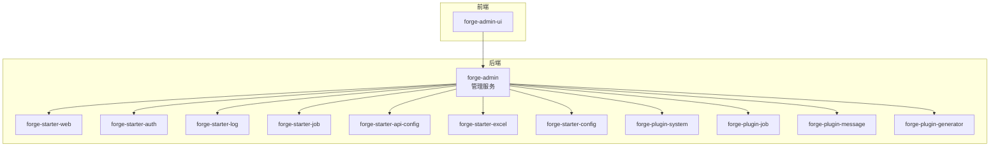
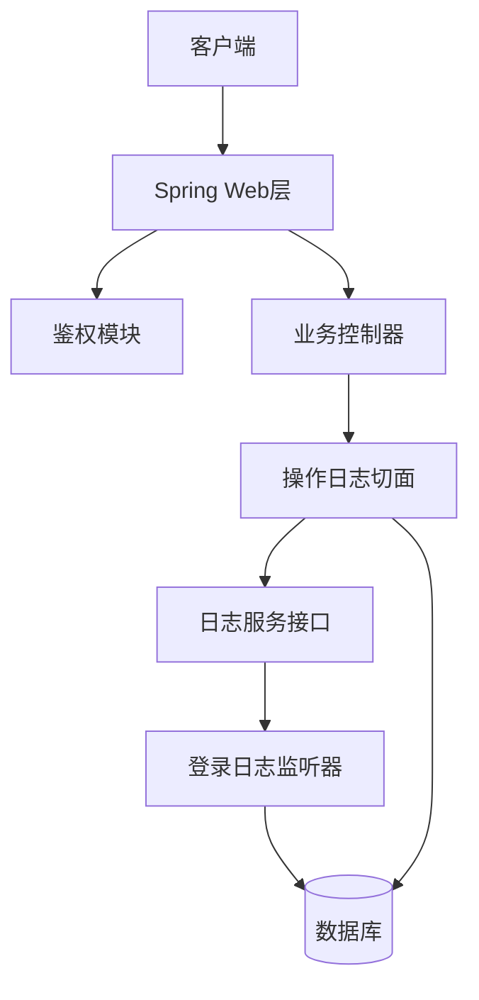
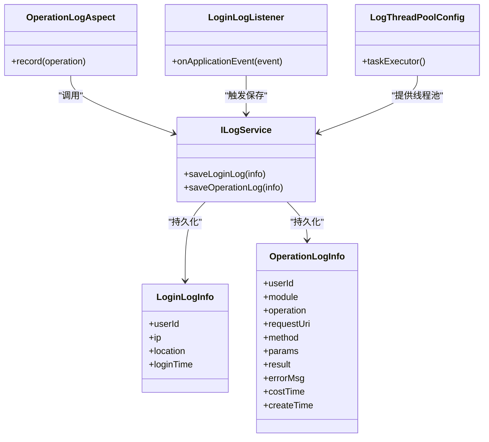
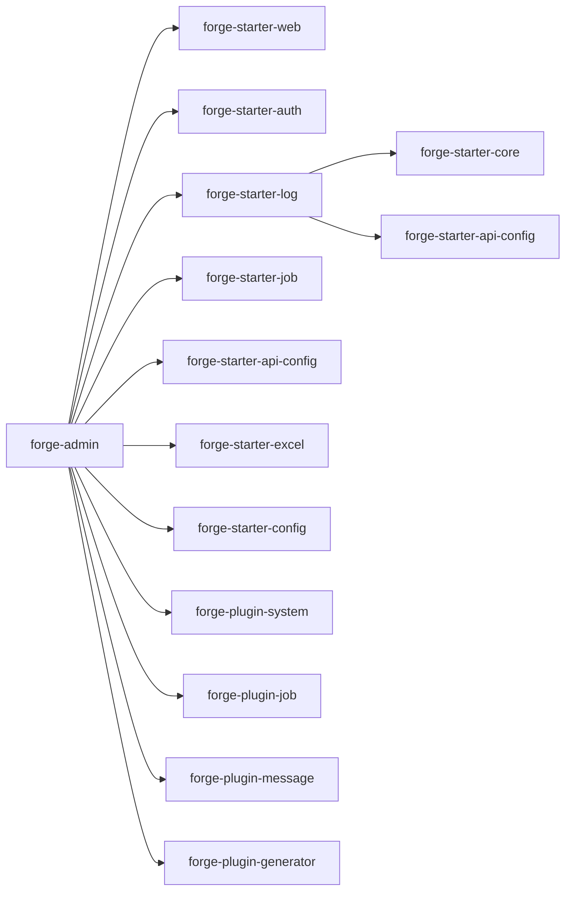

# 监控运维

<cite>
**本文引用的文件**
- [application.yml](file://forge/forge-admin/src/main/resources/application.yml)
- [logback.xml](file://forge/forge-admin/src/main/resources/logback.xml)
- [pom.xml（forge-admin）](file://forge/forge-admin/pom.xml)
- [pom.xml（forge-starter-log）](file://forge/forge-framework/forge-starter-parent/forge-starter-log/pom.xml)
- [OperationLogAspect.java](file://forge/forge-framework/forge-starter-parent/forge-starter-log/src/main/java/com/mdframe/forge/starter/log/aspect/OperationLogAspect.java)
- [ILogService.java](file://forge/forge-framework/forge-starter-parent/forge-starter-log/src/main/java/com/mdframe/forge/starter/log/service/ILogService.java)
- [LoginLogListener.java](file://forge/forge-framework/forge-starter-parent/forge-starter-log/src/main/java/com/mdframe/forge/starter/log/listener/LoginLogListener.java)
- [LoginLogInfo.java](file://forge/forge-framework/forge-starter-parent/forge-starter-log/src/main/java/com/mdframe/forge/starter/log/domain/LoginLogInfo.java)
- [OperationLogInfo.java](file://forge/forge-framework/forge-starter-parent/forge-starter-log/src/main/java/com/mdframe/forge/starter/log/domain/OperationLogInfo.java)
- [LogThreadPoolConfig.java](file://forge/forge-framework/forge-starter-parent/forge-starter-log/src/main/java/com/mdframe/forge/starter/log/config/LogThreadPoolConfig.java)
- [OperationLog.java](file://forge/forge-framework/forge-starter-parent/forge-starter-core/src/main/java/com/mdframe/forge/starter/core/annotation/log/OperationLog.java)
- [API权限控制使用说明.md](file://forge/forge-admin/src/main/resources/sql/API权限控制使用说明.md)
- [API_CONFIG_USAGE.md](file://forge/forge-framework/forge-starter-parent/forge-starter-api-config/API_CONFIG_USAGE.md)
- [USAGE_EXAMPLE.md](file://forge/forge-framework/forge-starter-parent/forge-starter-config/USAGE_EXAMPLE.md)
- [DATA_SCOPE_CONFIG_GUIDE.md](file://forge/forge-framework/forge-starter-parent/forge-starter-datascope/DATA_SCOPE_CONFIG_GUIDE.md)
- [API.md](file://forge/forge-framework/forge-starter-parent/forge-starter-job/API.md)
- [README.md（forge-admin-ui）](file://forge-admin-ui/README.md)
- [THEME_CONFIG.md](file://forge-admin-ui/docs/THEME_CONFIG.md)
</cite>

## 目录
1. 引言
2. 项目结构
3. 核心组件
4. 架构总览
5. 详细组件分析
6. 依赖关系分析
7. 性能考量
8. 故障排查指南
9. 结论
10. 附录

## 引言
本指南面向Forge框架的监控与运维团队，目标是建立完善的系统监控与运维管理体系，覆盖应用监控指标采集（CPU、内存、磁盘、网络）、日志管理策略、告警机制配置、性能监控工具集成，并结合现有工程能力给出可落地的实践建议。当前仓库已具备基础的日志记录与审计能力，后续可在此基础上扩展指标采集、可视化与告警。

## 项目结构
Forge采用多模块架构，核心模块包括：
- forge-admin：后端管理服务，承载系统管理、鉴权、作业调度等能力
- forge-starter-*：通用能力封装（如鉴权、日志、配置中心、Excel、消息、ORM、事务、Web、WebSocket、租户等）
- forge-admin-ui：前端管理界面
- var/logs：日志输出目录

图表来源
- [pom.xml（forge-admin）](file://forge/forge-admin/pom.xml#L13-L76)
- [pom.xml（forge-starter-log）](file://forge/forge-framework/forge-starter-parent/forge-starter-log/pom.xml#L14-L42)

章节来源
- [pom.xml（forge-admin）](file://forge/forge-admin/pom.xml#L1-L111)
- [pom.xml（forge-starter-log）](file://forge/forge-framework/forge-starter-parent/forge-starter-log/pom.xml#L1-L46)

## 核心组件
- 日志与审计：基于AOP的登录日志与操作日志切面，统一记录登录、操作行为，支持异步落库与监听器处理
- 配置中心：提供配置项管理与示例，便于集中化配置与动态更新
- API配置：提供API资源定义与使用说明，支撑接口权限控制与审计
- 作业调度：提供定时任务能力与使用说明，便于后台任务监控与排障
- 数据范围：提供数据权限范围配置指南，保障数据安全与合规

章节来源
- [OperationLogAspect.java](file://forge/forge-framework/forge-starter-parent/forge-starter-log/src/main/java/com/mdframe/forge/starter/log/aspect/OperationLogAspect.java)
- [ILogService.java](file://forge/forge-framework/forge-starter-parent/forge-starter-log/src/main/java/com/mdframe/forge/starter/log/service/ILogService.java)
- [LoginLogListener.java](file://forge/forge-framework/forge-starter-parent/forge-starter-log/src/main/java/com/mdframe/forge/starter/log/listener/LoginLogListener.java)
- [LoginLogInfo.java](file://forge/forge-framework/forge-starter-parent/forge-starter-log/src/main/java/com/mdframe/forge/starter/log/domain/LoginLogInfo.java)
- [OperationLogInfo.java](file://forge/forge-framework/forge-starter-parent/forge-starter-log/src/main/java/com/mdframe/forge/starter/log/domain/OperationLogInfo.java)
- [LogThreadPoolConfig.java](file://forge/forge-framework/forge-starter-parent/forge-starter-log/src/main/java/com/mdframe/forge/starter/log/config/LogThreadPoolConfig.java)
- [OperationLog.java](file://forge/forge-framework/forge-starter-parent/forge-starter-core/src/main/java/com/mdframe/forge/starter/core/annotation/log/OperationLog.java)
- [API_CONFIG_USAGE.md](file://forge/forge-framework/forge-starter-parent/forge-starter-api-config/API_CONFIG_USAGE.md)
- [USAGE_EXAMPLE.md](file://forge/forge-framework/forge-starter-parent/forge-starter-config/USAGE_EXAMPLE.md)
- [DATA_SCOPE_CONFIG_GUIDE.md](file://forge/forge-framework/forge-starter-parent/forge-starter-datascope/DATA_SCOPE_CONFIG_GUIDE.md)
- [API.md](file://forge/forge-framework/forge-starter-parent/forge-starter-job/API.md)

## 架构总览
下图展示日志与审计在系统中的位置与交互关系：

图表来源
- [OperationLogAspect.java](file://forge/forge-framework/forge-starter-parent/forge-starter-log/src/main/java/com/mdframe/forge/starter/log/aspect/OperationLogAspect.java)
- [ILogService.java](file://forge/forge-framework/forge-starter-parent/forge-starter-log/src/main/java/com/mdframe/forge/starter/log/service/ILogService.java)
- [LoginLogListener.java](file://forge/forge-framework/forge-starter-parent/forge-starter-log/src/main/java/com/mdframe/forge/starter/log/listener/LoginLogListener.java)

## 详细组件分析

### 日志与审计子系统
- 登录日志：通过监听器捕获登录事件，统一记录登录信息
- 操作日志：通过注解标记方法，AOP切面拦截并记录操作详情
- 异步落库：日志写入采用线程池异步处理，降低对主流程影响
- 数据模型：登录日志与操作日志实体定义清晰，便于查询与统计

图表来源
- [OperationLogAspect.java](file://forge/forge-framework/forge-starter-parent/forge-starter-log/src/main/java/com/mdframe/forge/starter/log/aspect/OperationLogAspect.java)
- [ILogService.java](file://forge/forge-framework/forge-starter-parent/forge-starter-log/src/main/java/com/mdframe/forge/starter/log/service/ILogService.java)
- [LoginLogListener.java](file://forge/forge-framework/forge-starter-parent/forge-starter-log/src/main/java/com/mdframe/forge/starter/log/listener/LoginLogListener.java)
- [LoginLogInfo.java](file://forge/forge-framework/forge-starter-parent/forge-starter-log/src/main/java/com/mdframe/forge/starter/log/domain/LoginLogInfo.java)
- [OperationLogInfo.java](file://forge/forge-framework/forge-starter-parent/forge-starter-log/src/main/java/com/mdframe/forge/starter/log/domain/OperationLogInfo.java)
- [LogThreadPoolConfig.java](file://forge/forge-framework/forge-starter-parent/forge-starter-log/src/main/java/com/mdframe/forge/starter/log/config/LogThreadPoolConfig.java)

章节来源
- [OperationLogAspect.java](file://forge/forge-framework/forge-starter-parent/forge-starter-log/src/main/java/com/mdframe/forge/starter/log/aspect/OperationLogAspect.java)
- [ILogService.java](file://forge/forge-framework/forge-starter-parent/forge-starter-log/src/main/java/com/mdframe/forge/starter/log/service/ILogService.java)
- [LoginLogListener.java](file://forge/forge-framework/forge-starter-parent/forge-starter-log/src/main/java/com/mdframe/forge/starter/log/listener/LoginLogListener.java)
- [LoginLogInfo.java](file://forge/forge-framework/forge-starter-parent/forge-starter-log/src/main/java/com/mdframe/forge/starter/log/domain/LoginLogInfo.java)
- [OperationLogInfo.java](file://forge/forge-framework/forge-starter-parent/forge-starter-log/src/main/java/com/mdframe/forge/starter/log/domain/OperationLogInfo.java)
- [LogThreadPoolConfig.java](file://forge/forge-framework/forge-starter-parent/forge-starter-log/src/main/java/com/mdframe/forge/starter/log/config/LogThreadPoolConfig.java)
- [OperationLog.java](file://forge/forge-framework/forge-starter-parent/forge-starter-core/src/main/java/com/mdframe/forge/starter/core/annotation/log/OperationLog.java)

### 配置中心与API管理
- 配置中心：提供配置项管理与使用示例，支持集中化配置与动态更新
- API配置：提供API资源定义与使用说明，支撑接口权限控制与审计

章节来源
- [API_CONFIG_USAGE.md](file://forge/forge-framework/forge-starter-parent/forge-starter-api-config/API_CONFIG_USAGE.md)
- [USAGE_EXAMPLE.md](file://forge/forge-framework/forge-starter-parent/forge-starter-config/USAGE_EXAMPLE.md)

### 作业调度与数据范围
- 作业调度：提供定时任务能力与使用说明，便于后台任务监控与排障
- 数据范围：提供数据权限范围配置指南，保障数据安全与合规

章节来源
- [API.md](file://forge/forge-framework/forge-starter-parent/forge-starter-job/API.md)
- [DATA_SCOPE_CONFIG_GUIDE.md](file://forge/forge-framework/forge-starter-parent/forge-starter-datascope/DATA_SCOPE_CONFIG_GUIDE.md)

## 依赖关系分析
- forge-admin依赖多个starter与plugin模块，形成完整的后端能力矩阵
- 日志模块依赖核心模块与API配置模块，确保日志功能与配置联动

图表来源
- [pom.xml（forge-admin）](file://forge/forge-admin/pom.xml#L13-L76)
- [pom.xml（forge-starter-log）](file://forge/forge-framework/forge-starter-parent/forge-starter-log/pom.xml#L14-L42)

章节来源
- [pom.xml（forge-admin）](file://forge/forge-admin/pom.xml#L1-L111)
- [pom.xml（forge-starter-log）](file://forge/forge-framework/forge-starter-parent/forge-starter-log/pom.xml#L1-L46)

## 性能考量
- 日志异步化：通过线程池异步写入日志，避免阻塞主线程
- 日志滚动：按天滚动与保留策略，控制磁盘占用
- 线程池参数：根据业务量调整线程池大小与队列长度，防止过载
- 数据库写入：建议对日志表建立合适索引，优化查询与清理

章节来源
- [LogThreadPoolConfig.java](file://forge/forge-framework/forge-starter-parent/forge-starter-log/src/main/java/com/mdframe/forge/starter/log/config/LogThreadPoolConfig.java)
- [logback.xml](file://forge/forge-admin/src/main/resources/logback.xml#L15-L27)

## 故障排查指南
- 日志定位
  - 查看控制台与文件日志，确认异常堆栈与关键字段
  - 利用登录与操作日志快速定位用户行为轨迹
- 接口与权限
  - 参考API权限控制使用说明，核对接口白名单与权限配置
- 配置问题
  - 使用配置中心示例进行比对，确认配置项是否正确下发
- 作业调度
  - 检查定时任务状态与日志，确认执行周期与失败重试策略

章节来源
- [logback.xml](file://forge/forge-admin/src/main/resources/logback.xml#L1-L49)
- [API权限控制使用说明.md](file://forge/forge-admin/src/main/resources/sql/API权限控制使用说明.md)
- [API_CONFIG_USAGE.md](file://forge/forge-framework/forge-starter-parent/forge-starter-api-config/API_CONFIG_USAGE.md)
- [USAGE_EXAMPLE.md](file://forge/forge-framework/forge-starter-parent/forge-starter-config/USAGE_EXAMPLE.md)
- [API.md](file://forge/forge-framework/forge-starter-parent/forge-starter-job/API.md)

## 结论
本指南基于现有工程能力，给出了日志与审计、配置中心、API管理、作业调度与数据范围的运维要点。建议在现有基础上逐步引入指标采集、可视化与告警体系，以构建完整的监控运维闭环。

## 附录

### 日志管理策略
- 日志级别：生产环境建议以info为主，关键模块可临时提升至debug
- 日志滚动：按天滚动，保留30天，避免磁盘爆满
- 输出位置：控制台与文件双通道输出，便于开发与生产环境区分

章节来源
- [logback.xml](file://forge/forge-admin/src/main/resources/logback.xml#L1-L49)

### 告警机制配置（建议）
- CPU/内存/磁盘/网络：结合操作系统与容器监控，设置阈值与告警规则
- 应用健康：结合业务指标（QPS、错误率、P95/P99）设置阈值
- 告警渠道：邮件、短信、IM群组，分级处理

### 性能监控工具集成（建议）
- Spring Boot Admin：用于服务发现与健康检查
- Prometheus+Grafana：用于指标采集与可视化
- ELK：用于日志采集、检索与分析

### 故障排查流程（建议）
- 收集日志与指标
- 定位异常点与关联操作
- 回溯配置与权限
- 验证修复与回归测试

### 应急响应预案（建议）
- 分级响应：根据影响范围划分等级
- 快速回滚：版本与配置回滚策略
- 限流降级：在高负载场景保护核心链路

### 备份恢复策略（建议）
- 数据库备份：全量+增量，定期校验
- 配置备份：配置中心快照与版本管理
- 日志归档：长期归档与合规要求满足

### 容量规划建议（建议）
- 基于历史趋势与峰值预测，预留20%-30%冗余
- 关键指标监控与预警，提前扩容或优化