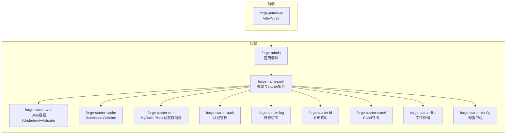
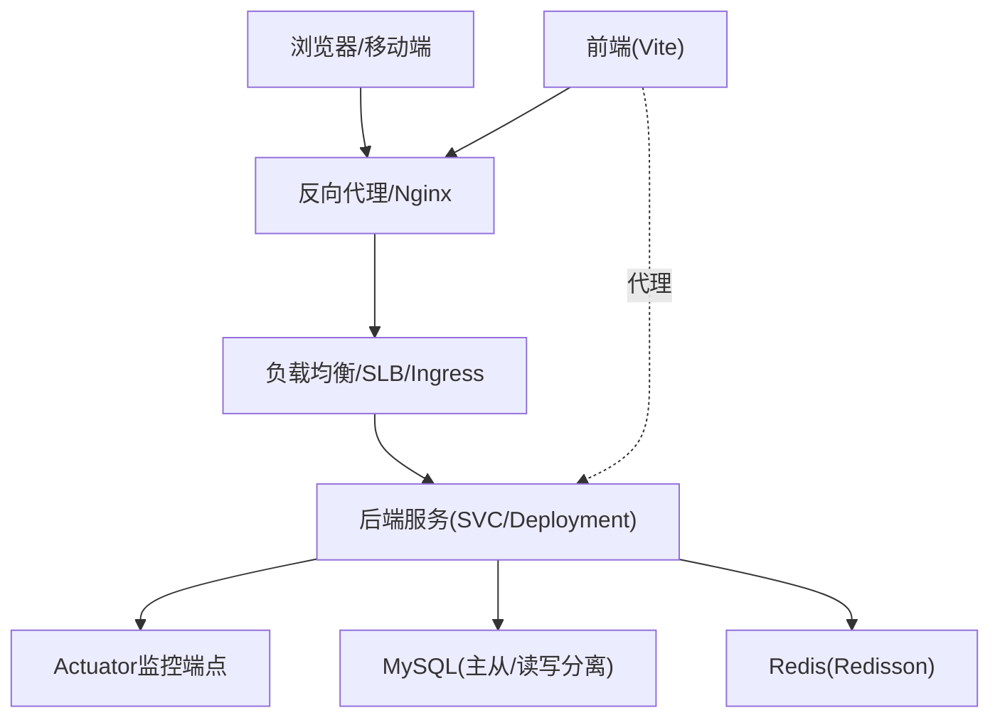
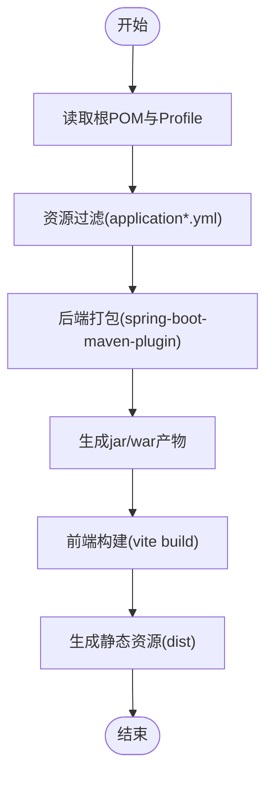
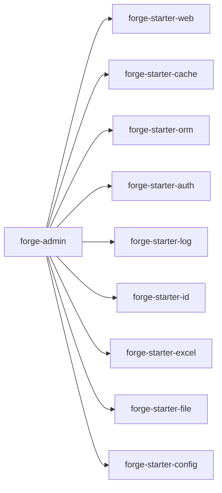
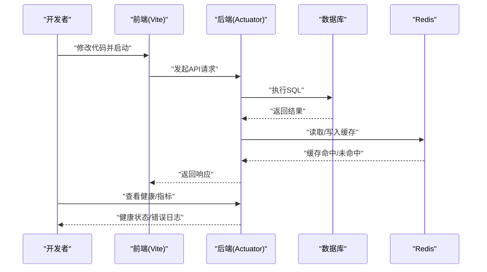

# 部署运维

<cite>
**本文引用的文件**
- [forge/pom.xml](file://forge/pom.xml)
- [forge/forge-admin/pom.xml](file://forge/forge-admin/pom.xml)
- [forge/forge-admin/src/main/resources/application.yml](file://forge/forge-admin/src/main/resources/application.yml)
- [forge/forge-admin/src/main/resources/application-dev.yml](file://forge/forge-admin/src/main/resources/application-dev.yml)
- [forge/forge-admin/src/main/resources/application-prod.yml](file://forge/forge-admin/src/main/resources/application-prod.yml)
- [forge/forge-admin/src/main/resources/logback.xml](file://forge/forge-admin/src/main/resources/logback.xml)
- [forge/forge-framework/forge-starter-parent/forge-starter-web/pom.xml](file://forge/forge-framework/forge-starter-parent/forge-starter-web/pom.xml)
- [forge/forge-framework/forge-starter-parent/forge-starter-cache/pom.xml](file://forge/forge-framework/forge-starter-parent/forge-starter-cache/pom.xml)
- [forge/forge-framework/forge-starter-parent/forge-starter-cache/src/main/java/com/mdframe/forge/starter/cache/config/RedissonConfig.java](file://forge/forge-framework/forge-starter-parent/forge-starter-cache/src/main/java/com/mdframe/forge/starter/cache/config/RedissonConfig.java)
- [forge/forge-framework/forge-starter-parent/forge-starter-orm/pom.xml](file://forge/forge-framework/forge-starter-parent/forge-starter-orm/pom.xml)
- [forge/forge-framework/forge-starter-parent/forge-starter-config/pom.xml](file://forge/forge-framework/forge-starter-parent/forge-starter-config/pom.xml)
- [forge/forge-framework/forge-starter-parent/forge-starter-log/pom.xml](file://forge/forge-framework/forge-starter-parent/forge-starter-log/pom.xml)
- [forge/forge-framework/forge-starter-parent/forge-starter-id/src/main/java/com/mdframe/forge/starter/id/generator/FusionDisposableWorkerIdAssigner.java](file://forge/forge-framework/forge-starter-parent/forge-starter-id/src/main/java/com/mdframe/forge/starter/id/generator/FusionDisposableWorkerIdAssigner.java)
- [forge-admin-ui/package.json](file://forge-admin-ui/package.json)
- [forge-admin-ui/vite.config.js](file://forge-admin-ui/vite.config.js)
- [forge-admin-ui/.env](file://forge-admin-ui/.env)
</cite>

## 目录
1. [简介](#简介)
2. [项目结构](#项目结构)
3. [核心组件](#核心组件)
4. [架构总览](#架构总览)
5. [详细组件分析](#详细组件分析)
6. [依赖关系分析](#依赖关系分析)
7. [性能考量](#性能考量)
8. [故障排查指南](#故障排查指南)
9. [结论](#结论)
10. [附录](#附录)

## 简介
本指南面向Forge框架的部署与运维，覆盖从开发环境到生产环境的完整方案，包括构建打包、容器化、负载均衡、监控告警、数据库与缓存、文件存储、域名配置、以及现代化的Docker/Kubernetes编排与CI/CD实践。同时提供性能监控、日志管理、故障排查与备份恢复的最佳实践，帮助团队安全、稳定、可扩展地交付系统。

## 项目结构
Forge采用多模块Maven工程组织，后端由Spring Boot 3 + Undertow提供Web容器与Actuator监控能力；前端为Vue 3 + Vite工程，通过代理联调后端接口。核心模块与职责如下：
- forge-admin：后端应用模块，聚合各starter与插件，打包为可执行jar或war。
- forge-framework：框架与starter集合，提供Web、缓存、ORM、认证鉴权、日志、定时任务、Excel、文件、ID生成、租户等通用能力。
- forge-admin-ui：前端工程，提供开发、构建、预览脚本与代理配置。

图表来源
- [forge/pom.xml](file://forge/pom.xml#L114-L119)
- [forge/forge-admin/pom.xml](file://forge/forge-admin/pom.xml#L13-L76)
- [forge/forge-framework/forge-starter-parent/forge-starter-web/pom.xml](file://forge/forge-framework/forge-starter-parent/forge-starter-web/pom.xml#L14-L59)
- [forge/forge-framework/forge-starter-parent/forge-starter-cache/pom.xml](file://forge/forge-framework/forge-starter-parent/forge-starter-cache/pom.xml#L14-L41)
- [forge/forge-framework/forge-starter-parent/forge-starter-orm/pom.xml](file://forge/forge-framework/forge-starter-parent/forge-starter-orm/pom.xml#L14-L37)
- [forge/forge-framework/forge-starter-parent/forge-starter-config/pom.xml](file://forge/forge-framework/forge-starter-parent/forge-starter-config/pom.xml#L14-L24)
- [forge/forge-framework/forge-starter-parent/forge-starter-log/pom.xml](file://forge/forge-framework/forge-starter-parent/forge-starter-log/pom.xml#L14-L42)
- [forge-admin-ui/package.json](file://forge-admin-ui/package.json#L6-L12)

章节来源
- [forge/pom.xml](file://forge/pom.xml#L114-L119)
- [forge/forge-admin/pom.xml](file://forge/forge-admin/pom.xml#L13-L76)

## 核心组件
- 构建与打包
  - Maven多模块统一管理，支持本地(dev)/开发(local)/生产(prod)三套profile，资源过滤按profile注入。
  - 后端使用spring-boot-maven-plugin重打包，支持jar/war两种产物。
- Web容器与监控
  - Undertow替代Tomcat，启用Actuator指标端点，便于容器化与云原生监控。
- 缓存与锁
  - Redisson集成，提供分布式锁、限流、序列化配置；Caffeine本地缓存增强。
- 数据持久化
  - MyBatis-Plus + 动态数据源，支持多数据源与SQL性能分析。
- 认证鉴权
  - Sa-Token结合Redis存储Session，支持跨服务单点登录。
- 日志
  - Logback滚动日志，包含traceId，输出至控制台与文件，支持按模块分级。
- 分布式ID
  - Docker环境下自动识别容器节点，生成worker节点信息，保障ID唯一性。
- 前端
  - Vite工程，支持代理转发、公共路径、租户与客户端配置等环境变量。

章节来源
- [forge/pom.xml](file://forge/pom.xml#L63-L91)
- [forge/forge-admin/pom.xml](file://forge/forge-admin/pom.xml#L78-L108)
- [forge/forge-framework/forge-starter-parent/forge-starter-web/pom.xml](file://forge/forge-framework/forge-starter-parent/forge-starter-web/pom.xml#L14-L59)
- [forge/forge-framework/forge-starter-parent/forge-starter-cache/pom.xml](file://forge/forge-framework/forge-starter-parent/forge-starter-cache/pom.xml#L14-L41)
- [forge/forge-framework/forge-starter-parent/forge-starter-orm/pom.xml](file://forge/forge-framework/forge-starter-parent/forge-starter-orm/pom.xml#L14-L37)
- [forge/forge-framework/forge-starter-parent/forge-starter-cache/src/main/java/com/mdframe/forge/starter/cache/config/RedissonConfig.java](file://forge/forge-framework/forge-starter-parent/forge-starter-cache/src/main/java/com/mdframe/forge/starter/cache/config/RedissonConfig.java#L19-L33)
- [forge/forge-framework/forge-starter-parent/forge-starter-id/src/main/java/com/mdframe/forge/starter/id/generator/FusionDisposableWorkerIdAssigner.java](file://forge/forge-framework/forge-starter-parent/forge-starter-id/src/main/java/com/mdframe/forge/starter/id/generator/FusionDisposableWorkerIdAssigner.java#L46-L64)
- [forge/forge-admin/src/main/resources/logback.xml](file://forge/forge-admin/src/main/resources/logback.xml#L1-L49)
- [forge-admin-ui/vite.config.js](file://forge-admin-ui/vite.config.js#L56-L80)
- [forge-admin-ui/.env](file://forge-admin-ui/.env#L1-L26)

## 架构总览
下图展示从浏览器到后端服务、数据库与缓存的整体链路，以及前端代理与后端Actuator监控的关系。

图表来源
- [forge/forge-framework/forge-starter-parent/forge-starter-web/pom.xml](file://forge/forge-framework/forge-starter-parent/forge-starter-web/pom.xml#L47-L48)
- [forge/forge-admin/src/main/resources/application.yml](file://forge/forge-admin/src/main/resources/application.yml#L32-L100)
- [forge/forge-admin/src/main/resources/application-dev.yml](file://forge/forge-admin/src/main/resources/application-dev.yml#L1-L70)

## 详细组件分析

### 构建与打包流程
- Maven Profile与资源过滤
  - 通过profiles.active与logging.level注入，实现不同环境的日志级别与激活配置。
  - application*.yml启用过滤，确保敏感信息与环境变量在构建期注入。
- 后端打包
  - spring-boot-maven-plugin重打包，支持可执行jar；同时保留maven-war-plugin以生成war。
- 前端构建
  - Vite提供开发、构建、预览脚本；支持公共路径与代理配置，便于联调。

图表来源
- [forge/pom.xml](file://forge/pom.xml#L63-L91)
- [forge/pom.xml](file://forge/pom.xml#L203-L221)
- [forge/forge-admin/pom.xml](file://forge/forge-admin/pom.xml#L78-L108)
- [forge-admin-ui/package.json](file://forge-admin-ui/package.json#L6-L12)

章节来源
- [forge/pom.xml](file://forge/pom.xml#L63-L91)
- [forge/pom.xml](file://forge/pom.xml#L203-L221)
- [forge/forge-admin/pom.xml](file://forge/forge-admin/pom.xml#L78-L108)
- [forge-admin-ui/package.json](file://forge-admin-ui/package.json#L6-L12)

### 容器化部署策略
- 基础镜像与运行时
  - 建议使用OpenJDK 17官方镜像作为基础镜像，确保与项目Java版本一致。
  - 将后端jar复制至镜像内，设置JAVA_OPTS与spring.profiles.active，挂载日志目录。
- 前端静态资源
  - 使用Nginx镜像承载静态资源，配置gzip、缓存与HTTPS；或在同镜像中提供静态站点。
- 健康检查与探针
  - 启用Actuator健康端点，配置liveness/readiness探针，确保容器编排稳定性。
- 环境隔离
  - 通过环境变量注入数据库、Redis、文件存储等配置，避免硬编码。

章节来源
- [forge/forge-framework/forge-starter-parent/forge-starter-web/pom.xml](file://forge/forge-framework/forge-starter-parent/forge-starter-web/pom.xml#L47-L48)
- [forge/forge-admin/src/main/resources/application.yml](file://forge/forge-admin/src/main/resources/application.yml#L32-L100)

### 负载均衡配置
- 反向代理层
  - Nginx/HAProxy/云厂商SLB：配置上游后端服务列表，开启会话保持(如需)与健康检查。
- Kubernetes Ingress
  - 通过Ingress规则暴露服务，结合证书与路径转发；必要时配置WebSocket支持。
- 连接与超时
  - 合理设置代理超时、后端连接超时与读写超时，避免长尾请求拖垮集群。

章节来源
- [forge-admin-ui/vite.config.js](file://forge-admin-ui/vite.config.js#L59-L80)

### 监控告警设置
- 指标采集
  - 启用Actuator端点，暴露JVM、业务指标与自定义指标；对接Prometheus/Grafana。
- 日志采集
  - 前端静态日志与后端Logback滚动日志统一收集，建议使用ELK/Fluent Bit/Vector。
- 告警策略
  - CPU/内存/连接池使用率、错误率、响应时间、健康检查失败等阈值告警。

章节来源
- [forge/forge-framework/forge-starter-parent/forge-starter-web/pom.xml](file://forge/forge-framework/forge-starter-parent/forge-starter-web/pom.xml#L47-L48)
- [forge/forge-admin/src/main/resources/logback.xml](file://forge/forge-admin/src/main/resources/logback.xml#L1-L49)

### 数据库部署
- MySQL
  - 建议主从复制与只读实例，开启binlog与慢查询日志；连接池参数根据并发与延迟调优。
- 动态数据源
  - 通过动态数据源实现读写分离与多数据源切换，结合SQL性能分析工具定位瓶颈。
- 初始化与迁移
  - 使用starter提供的SQL脚本初始化系统表与字典、作业、Excel导出等配置。

章节来源
- [forge/forge-framework/forge-starter-parent/forge-starter-orm/pom.xml](file://forge/forge-framework/forge-starter-parent/forge-starter-orm/pom.xml#L21-L36)
- [forge/forge-admin/src/main/resources/application-dev.yml](file://forge/forge-admin/src/main/resources/application-dev.yml#L1-L70)

### 缓存配置
- Redis
  - 使用Redisson作为分布式缓存与分布式锁，配置连接池、序列化与超时；结合Caffeine做本地缓存加速。
- 配置定制
  - Jackson序列化支持Java 8时间类型，确保复杂对象缓存一致性。

章节来源
- [forge/forge-framework/forge-starter-parent/forge-starter-cache/pom.xml](file://forge/forge-framework/forge-starter-parent/forge-starter-cache/pom.xml#L21-L40)
- [forge/forge-framework/forge-starter-parent/forge-starter-cache/src/main/java/com/mdframe/forge/starter/cache/config/RedissonConfig.java](file://forge/forge-framework/forge-starter-parent/forge-starter-cache/src/main/java/com/mdframe/forge/starter/cache/config/RedissonConfig.java#L19-L33)

### 文件存储
- 存储方式
  - 支持本地磁盘与对象存储(如OSS)，通过starter配置文件存储路径与访问凭证。
- 安全与性能
  - 上传鉴权、签名直传、CDN加速与防盗链策略；控制单文件与总请求大小。

章节来源
- [forge/forge-admin/src/main/resources/application.yml](file://forge/forge-admin/src/main/resources/application.yml#L41-L47)
- [forge/forge-framework/forge-starter-parent/forge-starter-config/pom.xml](file://forge/forge-framework/forge-starter-parent/forge-starter-config/pom.xml#L14-L24)

### 域名与HTTPS
- 域名解析
  - 将域名指向负载均衡或Ingress入口；配置CNAME与A记录，确保多区域可用。
- HTTPS
  - 使用Let’s Encrypt或云证书，开启TLS 1.3与安全套件；强制HTTPS重定向。

章节来源
- [forge-admin-ui/vite.config.js](file://forge-admin-ui/vite.config.js#L59-L80)

### Docker部署
- 镜像构建
  - 多阶段构建减少镜像体积；将jar与静态资源分别放入最小化运行时镜像。
- 容器编排
  - docker-compose或Kubernetes Deployment/Service/Ingress；设置资源限制与副本数。
- 挂载与环境
  - 挂载日志目录与配置卷；通过环境变量注入数据库、Redis与文件存储配置。

章节来源
- [forge/forge-admin/pom.xml](file://forge/forge-admin/pom.xml#L78-L108)
- [forge/forge-admin/src/main/resources/application.yml](file://forge/forge-admin/src/main/resources/application.yml#L32-L100)

### Kubernetes编排
- 资源清单
  - Deployment：副本数、滚动更新策略、探针；Service：ClusterIP/LoadBalancer；Ingress：TLS与路径转发。
- 配置与密钥
  - ConfigMap管理配置，Secret管理数据库与Redis密码、证书等敏感信息。
- 存储
  - PVC绑定持久化存储，满足日志与文件存储需求。

章节来源
- [forge/forge-admin/src/main/resources/application.yml](file://forge/forge-admin/src/main/resources/application.yml#L32-L100)

### CI/CD流水线
- 触发与分支
  - develop/dev分支合并触发测试与打包；main/prod分支触发发布与部署。
- 步骤建议
  - 代码检出 → 依赖安装 → 单元测试 → 构建后端jar与前端dist → 镜像构建 → 推送镜像 → 部署到K8s/容器编排平台 → 健康检查 → 回滚策略。
- 安全与审计
  - 镜像扫描、依赖漏洞检测、发布审批与审计日志。

章节来源
- [forge/pom.xml](file://forge/pom.xml#L63-L91)
- [forge/forge-admin/pom.xml](file://forge/forge-admin/pom.xml#L78-L108)
- [forge-admin-ui/package.json](file://forge-admin-ui/package.json#L6-L12)

## 依赖关系分析
后端模块间依赖清晰，遵循“应用模块聚合框架starter”的原则；前端通过代理与后端交互。

图表来源
- [forge/forge-admin/pom.xml](file://forge/forge-admin/pom.xml#L13-L76)

章节来源
- [forge/forge-admin/pom.xml](file://forge/forge-admin/pom.xml#L13-L76)

## 性能考量
- Web容器
  - Undertow线程模型与缓冲区参数可根据并发与延迟调优；合理设置IO线程与worker线程。
- 数据库
  - 连接池参数(maxPoolSize/minIdle/timeout等)与批处理优化(rewriteBatchedStatements)平衡吞吐与资源。
- 缓存
  - Redisson连接池与序列化策略影响延迟；Caffeine本地缓存命中率与淘汰策略需结合热点数据调整。
- 前端
  - Vite构建产物按需加载与代码分割；CDN与压缩提升首屏性能。

章节来源
- [forge/forge-admin/src/main/resources/application.yml](file://forge/forge-admin/src/main/resources/application.yml#L8-L22)
- [forge/forge-admin/src/main/resources/application-dev.yml](file://forge/forge-admin/src/main/resources/application-dev.yml#L19-L34)
- [forge/forge-framework/forge-starter-parent/forge-starter-cache/src/main/java/com/mdframe/forge/starter/cache/config/RedissonConfig.java](file://forge/forge-framework/forge-starter-parent/forge-starter-cache/src/main/java/com/mdframe/forge/starter/cache/config/RedissonConfig.java#L19-L33)

## 故障排查指南
- 日志定位
  - 查看后端日志目录下的滚动日志，结合traceId快速定位请求链路；关注SQL日志与异常堆栈。
- 健康检查
  - 通过Actuator健康端点判断服务状态；结合探针与告警联动。
- 数据库与缓存
  - 检查连接池占用、慢查询与缓存命中率；核对Redis连接参数与序列化配置。
- 前端联调
  - 确认Vite代理目标与路径前缀，避免跨域与404；检查公共路径与静态资源加载。

图表来源
- [forge/forge-framework/forge-starter-parent/forge-starter-web/pom.xml](file://forge/forge-framework/forge-starter-parent/forge-starter-web/pom.xml#L47-L48)
- [forge/forge-admin/src/main/resources/logback.xml](file://forge/forge-admin/src/main/resources/logback.xml#L1-L49)

章节来源
- [forge/forge-admin/src/main/resources/logback.xml](file://forge/forge-admin/src/main/resources/logback.xml#L1-L49)
- [forge-admin-ui/vite.config.js](file://forge-admin-ui/vite.config.js#L59-L80)

## 结论
Forge框架提供了完善的后端starter与前端工程化能力，结合本文的部署运维指南，可在本地、容器与Kubernetes环境中实现高效、稳定、可观测的交付。建议在生产中配套完善的监控告警、备份恢复与变更治理流程，持续优化性能与可靠性。

## 附录
- 环境变量与配置要点
  - 后端：spring.profiles.active、数据库URL/用户名/密码、Redis地址/密码、文件存储路径。
  - 前端：VITE_HTTP_PROXY_TARGET/VITE_REQUEST_PREFIX/VITE_PUBLIC_PATH等。
- Docker/K8s部署清单建议
  - Deployment/Service/Ingress/ConfigMap/Secret/PVC；设置探针与资源限制；启用滚动更新与回滚。

章节来源
- [forge/forge-admin/src/main/resources/application-dev.yml](file://forge/forge-admin/src/main/resources/application-dev.yml#L1-L70)
- [forge-admin-ui/.env](file://forge-admin-ui/.env#L1-L26)
- [forge-admin-ui/vite.config.js](file://forge-admin-ui/vite.config.js#L13-L80)