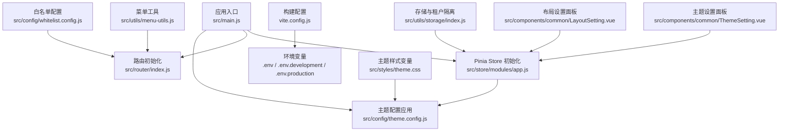
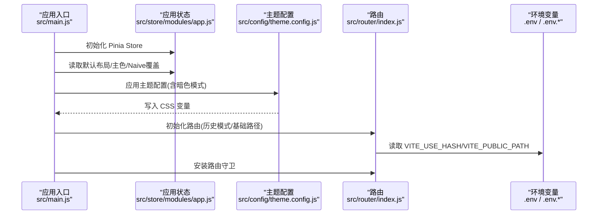
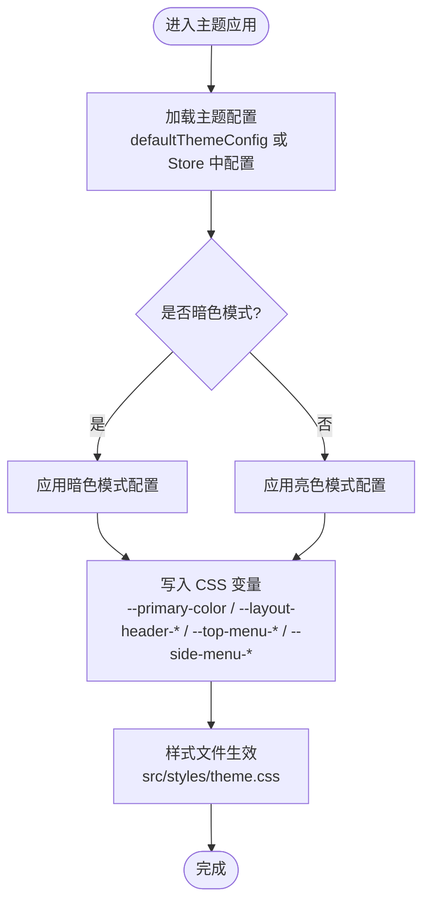
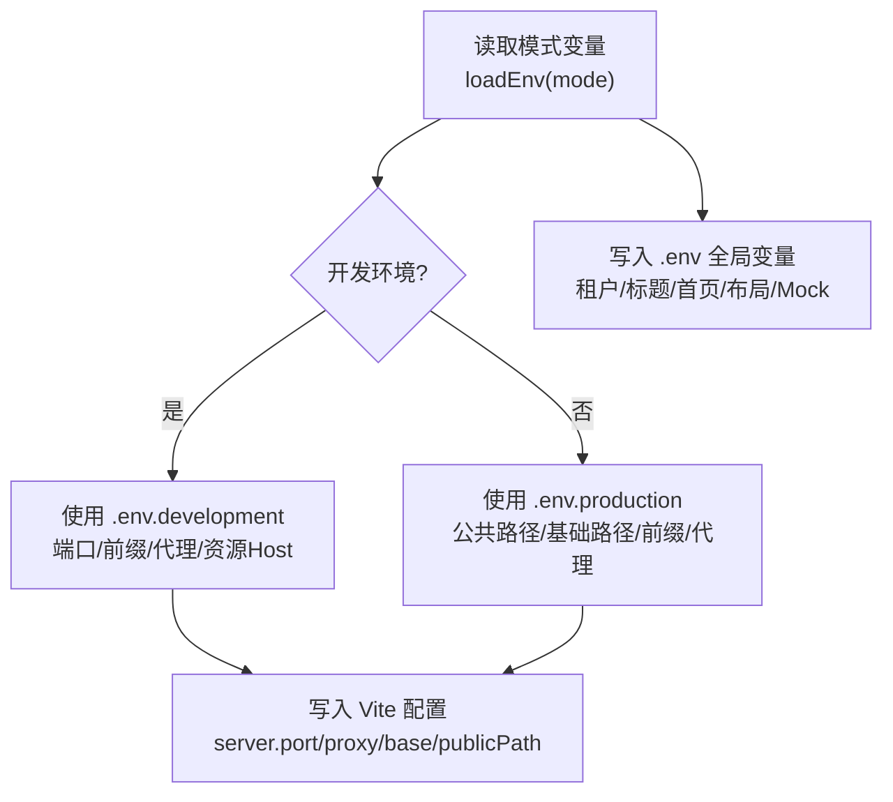
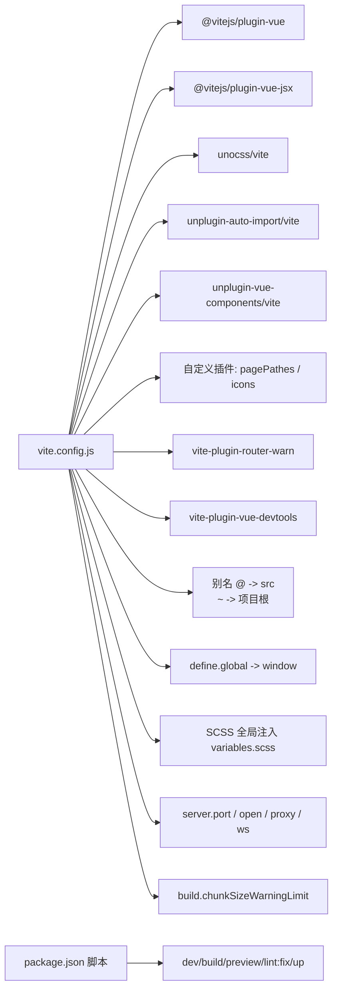
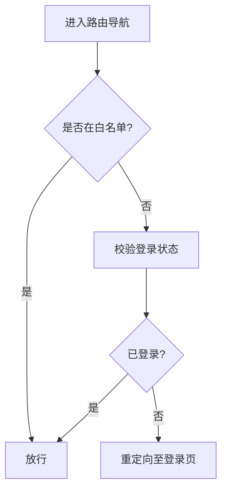
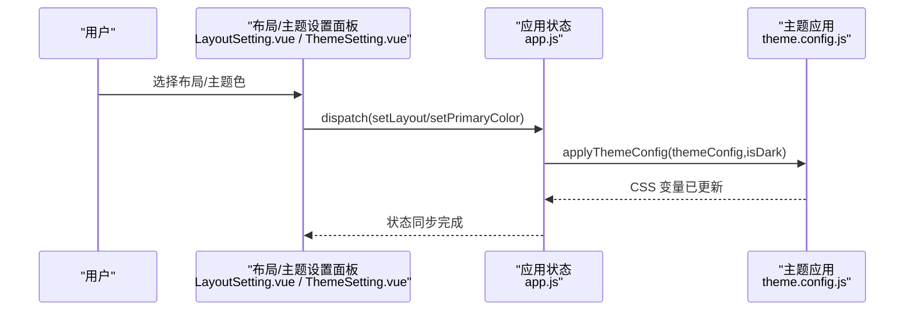
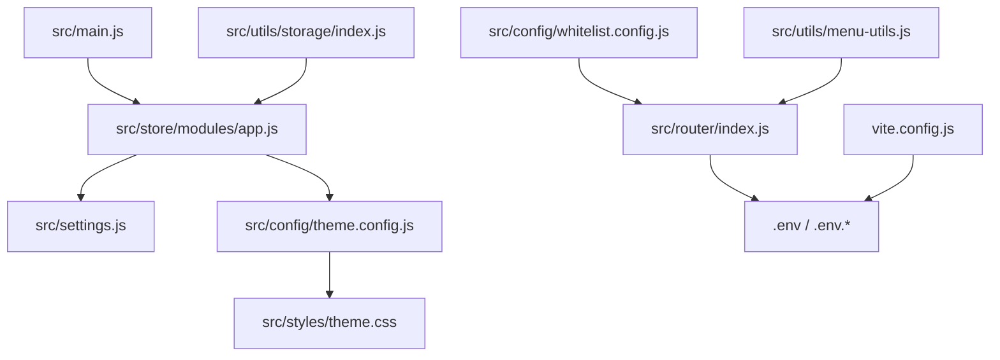

# 前端配置

<cite>
**本文引用的文件**
- [forge-admin-ui/src/settings.js](file://forge-admin-ui/src/settings.js)
- [forge-admin-ui/vite.config.js](file://forge-admin-ui/vite.config.js)
- [forge-admin-ui/src/config/theme.config.js](file://forge-admin-ui/src/config/theme.config.js)
- [forge-admin-ui/src/config/whitelist.config.js](file://forge-admin-ui/src/config/whitelist.config.js)
- [forge-admin-ui/.env](file://forge-admin-ui/.env)
- [forge-admin-ui/.env.development](file://forge-admin-ui/.env.development)
- [forge-admin-ui/.env.production](file://forge-admin-ui/.env.production)
- [forge-admin-ui/package.json](file://forge-admin-ui/package.json)
- [forge-admin-ui/src/main.js](file://forge-admin-ui/src/main.js)
- [forge-admin-ui/src/store/modules/app.js](file://forge-admin-ui/src/store/modules/app.js)
- [forge-admin-ui/src/router/index.js](file://forge-admin-ui/src/router/index.js)
- [forge-admin-ui/src/components/common/LayoutSetting.vue](file://forge-admin-ui/src/components/common/LayoutSetting.vue)
- [forge-admin-ui/src/components/common/ThemeSetting.vue](file://forge-admin-ui/src/components/common/ThemeSetting.vue)
- [forge-admin-ui/src/styles/theme.css](file://forge-admin-ui/src/styles/theme.css)
- [forge-admin-ui/src/utils/storage/index.js](file://forge-admin-ui/src/utils/storage/index.js)
- [forge-admin-ui/src/utils/menu-utils.js](file://forge-admin-ui/src/utils/menu-utils.js)
</cite>

## 目录
1. [简介](#简介)
2. [项目结构](#项目结构)
3. [核心组件](#核心组件)
4. [架构总览](#架构总览)
5. [详细组件分析](#详细组件分析)
6. [依赖关系分析](#依赖关系分析)
7. [性能考量](#性能考量)
8. [故障排查指南](#故障排查指南)
9. [结论](#结论)
10. [附录](#附录)

## 简介
本文件系统性梳理 Forge Admin UI 前端配置体系，覆盖主题配置（颜色方案、布局样式、字体设置）、环境变量配置（开发/生产环境切换、API 地址配置、功能开关）、构建配置（Vite 配置、打包优化、资源路径）、国际化配置（多语言支持与本地化规则）、白名单配置（接口权限与路由访问控制）。通过实际应用场景与配置示例，帮助前端开发者快速定制符合业务需求的界面与功能。

## 项目结构
前端配置相关的关键位置集中在以下模块：
- 默认设置与布局：src/settings.js
- 主题配置与应用：src/config/theme.config.js、src/styles/theme.css
- 构建与运行：vite.config.js、package.json
- 环境变量：.env、.env.development、.env.production
- 路由与守卫：src/router/index.js
- 白名单：src/config/whitelist.config.js
- 存储与租户隔离：src/utils/storage/index.js
- 菜单处理与图标：src/utils/menu-utils.js
- 应用入口与主题注入：src/main.js、src/store/modules/app.js
- 在线布局与主题设置面板：src/components/common/LayoutSetting.vue、src/components/common/ThemeSetting.vue

图表来源
- [forge-admin-ui/src/main.js](file://forge-admin-ui/src/main.js#L15-L36)
- [forge-admin-ui/src/config/theme.config.js](file://forge-admin-ui/src/config/theme.config.js#L105-L163)
- [forge-admin-ui/src/router/index.js](file://forge-admin-ui/src/router/index.js#L14-L17)
- [forge-admin-ui/src/store/modules/app.js](file://forge-admin-ui/src/store/modules/app.js#L7-L17)
- [forge-admin-ui/vite.config.js](file://forge-admin-ui/vite.config.js#L13-L84)
- [forge-admin-ui/.env](file://forge-admin-ui/.env#L1-L26)
- [forge-admin-ui/.env.development](file://forge-admin-ui/.env.development#L1-L16)
- [forge-admin-ui/.env.production](file://forge-admin-ui/.env.production#L1-L14)
- [forge-admin-ui/src/styles/theme.css](file://forge-admin-ui/src/styles/theme.css#L6-L50)
- [forge-admin-ui/src/config/whitelist.config.js](file://forge-admin-ui/src/config/whitelist.config.js#L1-L10)
- [forge-admin-ui/src/utils/storage/index.js](file://forge-admin-ui/src/utils/storage/index.js#L4-L24)
- [forge-admin-ui/src/utils/menu-utils.js](file://forge-admin-ui/src/utils/menu-utils.js#L1-L170)
- [forge-admin-ui/src/components/common/LayoutSetting.vue](file://forge-admin-ui/src/components/common/LayoutSetting.vue#L1-L176)
- [forge-admin-ui/src/components/common/ThemeSetting.vue](file://forge-admin-ui/src/components/common/ThemeSetting.vue#L1-L27)

章节来源
- [forge-admin-ui/src/main.js](file://forge-admin-ui/src/main.js#L15-L36)
- [forge-admin-ui/src/store/modules/app.js](file://forge-admin-ui/src/store/modules/app.js#L7-L17)
- [forge-admin-ui/vite.config.js](file://forge-admin-ui/vite.config.js#L13-L84)

## 核心组件
- 默认设置与布局：定义默认布局、主色、Naive UI 主题覆盖、布局设置可见性以及可用布局列表。
- 主题配置与应用：统一的主题配置对象、CSS 变量映射函数、主题样式文件。
- 构建配置：Vite 插件、别名、代理、公共路径、端口等。
- 环境变量：全局与环境特定的配置项，如端口、代理目标、公共路径、默认布局、是否使用 Mock。
- 路由与白名单：路由历史模式选择、白名单路由控制。
- 存储与租户：基于租户 ID 的存储前缀，避免多系统间冲突。
- 菜单工具：菜单数据处理、图标渲染、活动菜单定位。
- 在线布局与主题设置面板：可视化布局切换与主题色选择。

章节来源
- [forge-admin-ui/src/settings.js](file://forge-admin-ui/src/settings.js#L21-L75)
- [forge-admin-ui/src/config/theme.config.js](file://forge-admin-ui/src/config/theme.config.js#L9-L163)
- [forge-admin-ui/src/styles/theme.css](file://forge-admin-ui/src/styles/theme.css#L6-L50)
- [forge-admin-ui/vite.config.js](file://forge-admin-ui/vite.config.js#L13-L84)
- [forge-admin-ui/.env](file://forge-admin-ui/.env#L1-L26)
- [forge-admin-ui/.env.development](file://forge-admin-ui/.env.development#L1-L16)
- [forge-admin-ui/.env.production](file://forge-admin-ui/.env.production#L1-L14)
- [forge-admin-ui/src/router/index.js](file://forge-admin-ui/src/router/index.js#L5-L12)
- [forge-admin-ui/src/config/whitelist.config.js](file://forge-admin-ui/src/config/whitelist.config.js#L1-L10)
- [forge-admin-ui/src/utils/storage/index.js](file://forge-admin-ui/src/utils/storage/index.js#L4-L24)
- [forge-admin-ui/src/utils/menu-utils.js](file://forge-admin-ui/src/utils/menu-utils.js#L1-L170)
- [forge-admin-ui/src/components/common/LayoutSetting.vue](file://forge-admin-ui/src/components/common/LayoutSetting.vue#L1-L176)
- [forge-admin-ui/src/components/common/ThemeSetting.vue](file://forge-admin-ui/src/components/common/ThemeSetting.vue#L1-L27)

## 架构总览
前端配置围绕“入口初始化 → 主题应用 → 路由与权限 → 构建与环境”的主线展开。应用启动时从 Store 读取主题与布局配置，动态写入 CSS 变量；路由根据环境变量决定历史模式与基础路径；构建阶段通过 Vite 插件链路与环境变量实现代理、别名与公共路径等。

图表来源
- [forge-admin-ui/src/main.js](file://forge-admin-ui/src/main.js#L15-L36)
- [forge-admin-ui/src/store/modules/app.js](file://forge-admin-ui/src/store/modules/app.js#L7-L17)
- [forge-admin-ui/src/config/theme.config.js](file://forge-admin-ui/src/config/theme.config.js#L105-L163)
- [forge-admin-ui/src/router/index.js](file://forge-admin-ui/src/router/index.js#L5-L12)
- [forge-admin-ui/.env](file://forge-admin-ui/.env#L1-L26)
- [forge-admin-ui/.env.development](file://forge-admin-ui/.env.development#L1-L16)
- [forge-admin-ui/.env.production](file://forge-admin-ui/.env.production#L1-L14)

## 详细组件分析

### 主题配置（颜色方案、布局样式、字体设置）
- 默认主题配置：包含主色、Header、顶部菜单、侧边菜单及其暗色模式配置。
- CSS 变量映射：将主题配置映射到 CSS 变量，供样式文件统一消费。
- Store 动态更新：支持修改主色、主题配置并实时应用到 CSS 变量。
- 样式文件：集中声明主题变量与对应组件样式，保证一致性。

图表来源
- [forge-admin-ui/src/config/theme.config.js](file://forge-admin-ui/src/config/theme.config.js#L9-L163)
- [forge-admin-ui/src/styles/theme.css](file://forge-admin-ui/src/styles/theme.css#L6-L50)
- [forge-admin-ui/src/store/modules/app.js](file://forge-admin-ui/src/store/modules/app.js#L50-L73)

章节来源
- [forge-admin-ui/src/config/theme.config.js](file://forge-admin-ui/src/config/theme.config.js#L9-L163)
- [forge-admin-ui/src/styles/theme.css](file://forge-admin-ui/src/styles/theme.css#L6-L50)
- [forge-admin-ui/src/store/modules/app.js](file://forge-admin-ui/src/store/modules/app.js#L34-L73)

### 环境变量配置（开发/生产环境切换、API 地址配置、功能开关）
- 全局环境变量：租户、客户端 ID/Secret、标题、首页路径、公共路径、默认布局、是否使用 Mock。
- 开发环境：端口、请求前缀、资源 Host、模板路径、代理目标。
- 生产环境：公共路径、基础路径、SourceMap、请求前缀、代理目标。
- Vite 读取：构建时通过 loadEnv 读取对应模式的变量，影响 server、proxy、base 等。

图表来源
- [forge-admin-ui/vite.config.js](file://forge-admin-ui/vite.config.js#L13-L84)
- [forge-admin-ui/.env](file://forge-admin-ui/.env#L1-L26)
- [forge-admin-ui/.env.development](file://forge-admin-ui/.env.development#L1-L16)
- [forge-admin-ui/.env.production](file://forge-admin-ui/.env.production#L1-L14)

章节来源
- [forge-admin-ui/.env](file://forge-admin-ui/.env#L1-L26)
- [forge-admin-ui/.env.development](file://forge-admin-ui/.env.development#L1-L16)
- [forge-admin-ui/.env.production](file://forge-admin-ui/.env.production#L1-L14)
- [forge-admin-ui/vite.config.js](file://forge-admin-ui/vite.config.js#L13-L84)

### 构建配置（Vite 配置、打包优化、资源路径）
- 插件链：Vue、JSX、UnoCSS、自动导入、组件自动注册、自定义页面路径与图标插件、移除无匹配路由警告、DevTools。
- 别名：@ 指向 src，~ 指向项目根。
- 全局对象：为部分依赖提供 global。
- SCSS 全局注入：引入 variables.scss。
- 服务器：端口、自动打开、代理（HTTP 与 WebSocket）。
- 构建：chunkSizeWarningLimit 调整。
- 包管理：脚本命令 dev/build/preview/lint:fix/up。

图表来源
- [forge-admin-ui/vite.config.js](file://forge-admin-ui/vite.config.js#L1-L86)
- [forge-admin-ui/package.json](file://forge-admin-ui/package.json#L6-L12)

章节来源
- [forge-admin-ui/vite.config.js](file://forge-admin-ui/vite.config.js#L1-L86)
- [forge-admin-ui/package.json](file://forge-admin-ui/package.json#L6-L12)

### 国际化配置（多语言支持、本地化规则）
- 项目内未发现独立的国际化配置文件或 i18n 初始化逻辑。
- 若需启用多语言，请在现有路由与视图中集成 i18n 工具，并在入口处挂载语言包与本地化规则。

[本节为概念性说明，不直接分析具体文件，故无章节来源]

### 白名单配置（接口权限、路由访问控制）
- 路由白名单：无需登录即可访问的路由集合。
- 白名单检查：提供 isInWhiteList 方法判断路径是否在白名单中。
- 路由守卫：结合白名单与登录状态进行访问控制（守卫位于 guards 目录，此处引用白名单常量）。

图表来源
- [forge-admin-ui/src/config/whitelist.config.js](file://forge-admin-ui/src/config/whitelist.config.js#L1-L10)
- [forge-admin-ui/src/router/index.js](file://forge-admin-ui/src/router/index.js#L5-L12)

章节来源
- [forge-admin-ui/src/config/whitelist.config.js](file://forge-admin-ui/src/config/whitelist.config.js#L1-L10)
- [forge-admin-ui/src/router/index.js](file://forge-admin-ui/src/router/index.js#L5-L12)

### 在线布局与主题设置（可视化配置）
- 布局设置面板：提供多种布局预览与切换，优先级说明与 Store 同步。
- 主题设置面板：提供主题色选择器，联动 Store 更新主色与 Naive UI 覆盖。
- Store 状态：持久化于 sessionStorage，键包含租户前缀。

图表来源
- [forge-admin-ui/src/components/common/LayoutSetting.vue](file://forge-admin-ui/src/components/common/LayoutSetting.vue#L1-L176)
- [forge-admin-ui/src/components/common/ThemeSetting.vue](file://forge-admin-ui/src/components/common/ThemeSetting.vue#L1-L27)
- [forge-admin-ui/src/store/modules/app.js](file://forge-admin-ui/src/store/modules/app.js#L28-L73)
- [forge-admin-ui/src/config/theme.config.js](file://forge-admin-ui/src/config/theme.config.js#L105-L163)

章节来源
- [forge-admin-ui/src/components/common/LayoutSetting.vue](file://forge-admin-ui/src/components/common/LayoutSetting.vue#L1-L176)
- [forge-admin-ui/src/components/common/ThemeSetting.vue](file://forge-admin-ui/src/components/common/ThemeSetting.vue#L1-L27)
- [forge-admin-ui/src/store/modules/app.js](file://forge-admin-ui/src/store/modules/app.js#L7-L17)

## 依赖关系分析
- 入口依赖 Store 与主题配置，Store 依赖默认设置与主题配置。
- 路由依赖环境变量决定历史模式与基础路径。
- 构建配置依赖环境变量与插件生态。
- 白名单与路由守卫共同构成访问控制。
- 存储工具依赖租户变量，避免跨系统冲突。
- 菜单工具负责菜单数据与图标渲染，间接影响布局与主题展示。

图表来源
- [forge-admin-ui/src/main.js](file://forge-admin-ui/src/main.js#L15-L36)
- [forge-admin-ui/src/store/modules/app.js](file://forge-admin-ui/src/store/modules/app.js#L7-L17)
- [forge-admin-ui/src/settings.js](file://forge-admin-ui/src/settings.js#L21-L75)
- [forge-admin-ui/src/config/theme.config.js](file://forge-admin-ui/src/config/theme.config.js#L105-L163)
- [forge-admin-ui/src/styles/theme.css](file://forge-admin-ui/src/styles/theme.css#L6-L50)
- [forge-admin-ui/src/router/index.js](file://forge-admin-ui/src/router/index.js#L5-L12)
- [forge-admin-ui/vite.config.js](file://forge-admin-ui/vite.config.js#L13-L84)
- [forge-admin-ui/src/config/whitelist.config.js](file://forge-admin-ui/src/config/whitelist.config.js#L1-L10)
- [forge-admin-ui/src/utils/storage/index.js](file://forge-admin-ui/src/utils/storage/index.js#L4-L24)
- [forge-admin-ui/src/utils/menu-utils.js](file://forge-admin-ui/src/utils/menu-utils.js#L1-L170)

章节来源
- [forge-admin-ui/src/main.js](file://forge-admin-ui/src/main.js#L15-L36)
- [forge-admin-ui/src/store/modules/app.js](file://forge-admin-ui/src/store/modules/app.js#L7-L17)
- [forge-admin-ui/src/router/index.js](file://forge-admin-ui/src/router/index.js#L5-L12)
- [forge-admin-ui/vite.config.js](file://forge-admin-ui/vite.config.js#L13-L84)

## 性能考量
- 构建体积：通过调整 chunkSizeWarningLimit 降低体积告警阈值，便于早期发现大包。
- 代理与 WebSocket：统一代理目标与路径重写，减少跨域与额外请求开销。
- 样式变量：集中 CSS 变量映射，避免重复计算与样式抖动。
- 存储持久化：Store 持久化于 sessionStorage，减少刷新丢失与 IO 开销。

[本节提供一般性建议，不直接分析具体文件，故无章节来源]

## 故障排查指南
- 代理无效或 404：检查 VITE_REQUEST_PREFIX 与代理 rewrite 规则，确认代理目标与 changeOrigin。
- 资源路径异常：核对 VITE_PUBLIC_PATH 与路由基础路径，确保与部署路径一致。
- 主题色不生效：确认 CSS 变量已被写入，且样式文件正确引用变量。
- 白名单不生效：确认 isInWhiteList 判断逻辑与路由 path 一致。
- 租户冲突：检查 VITE_TENANT 是否正确，存储前缀是否包含该租户标识。

章节来源
- [forge-admin-ui/vite.config.js](file://forge-admin-ui/vite.config.js#L59-L79)
- [forge-admin-ui/src/config/whitelist.config.js](file://forge-admin-ui/src/config/whitelist.config.js#L7-L10)
- [forge-admin-ui/src/utils/storage/index.js](file://forge-admin-ui/src/utils/storage/index.js#L4-L6)
- [forge-admin-ui/src/styles/theme.css](file://forge-admin-ui/src/styles/theme.css#L6-L50)

## 结论
Forge Admin UI 的前端配置以“入口初始化 + 主题应用 + 路由与权限 + 构建与环境”为核心，通过集中化的主题配置与 CSS 变量映射、灵活的环境变量与 Vite 构建配置、清晰的白名单与路由守卫，形成可扩展、可维护的前端配置体系。结合可视化布局与主题设置面板，开发者可快速适配业务需求并提升用户体验。

## 附录
- 实际应用场景与配置示例（路径指引）
  - 修改默认布局：参考 [默认布局设置](file://forge-admin-ui/src/settings.js#L37-L73)，并在入口或 Store 中设置。
  - 自定义主题色：参考 [主题设置面板](file://forge-admin-ui/src/components/common/ThemeSetting.vue#L1-L27) 与 [主题应用函数](file://forge-admin-ui/src/config/theme.config.js#L105-L163)。
  - 开启哈希路由：参考 [路由历史模式](file://forge-admin-ui/src/router/index.js#L6-L9) 与 [环境变量](file://forge-admin-ui/.env#L1-L26)。
  - 配置代理与 API 前缀：参考 [Vite 代理配置](file://forge-admin-ui/vite.config.js#L59-L79) 与 [环境变量](file://forge-admin-ui/.env.development#L5-L15)。
  - 设置白名单路由：参考 [白名单配置](file://forge-admin-ui/src/config/whitelist.config.js#L1-L10)。
  - 租户隔离存储：参考 [存储工具](file://forge-admin-ui/src/utils/storage/index.js#L4-L24)。