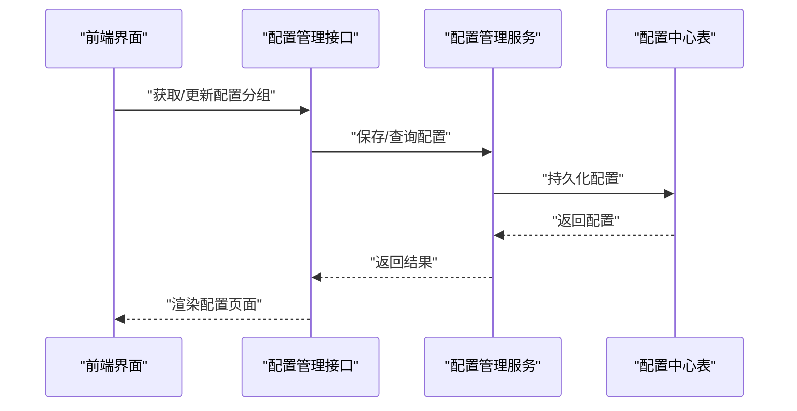
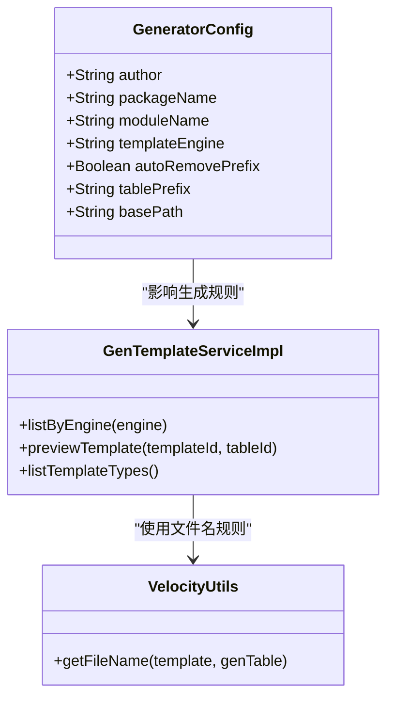
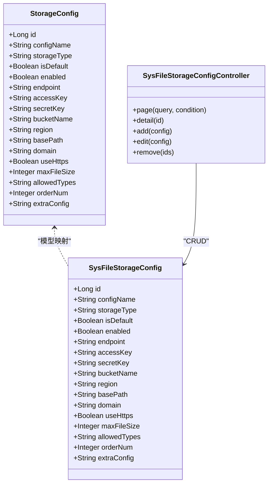
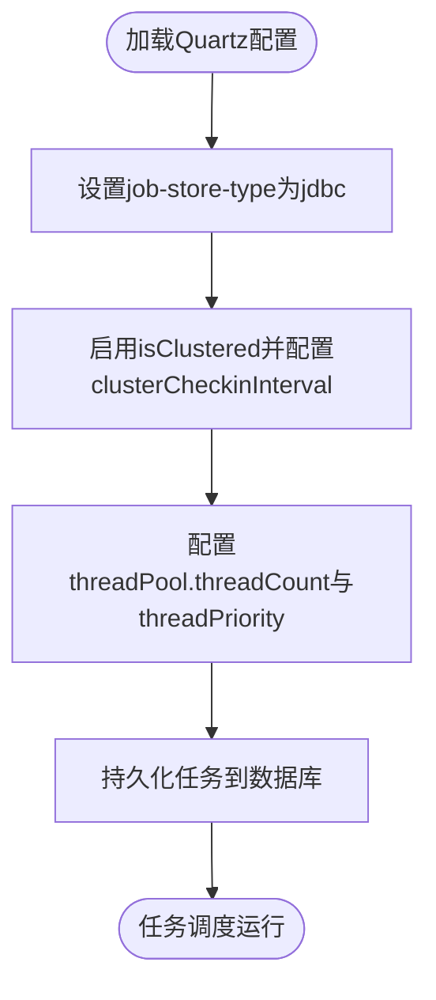
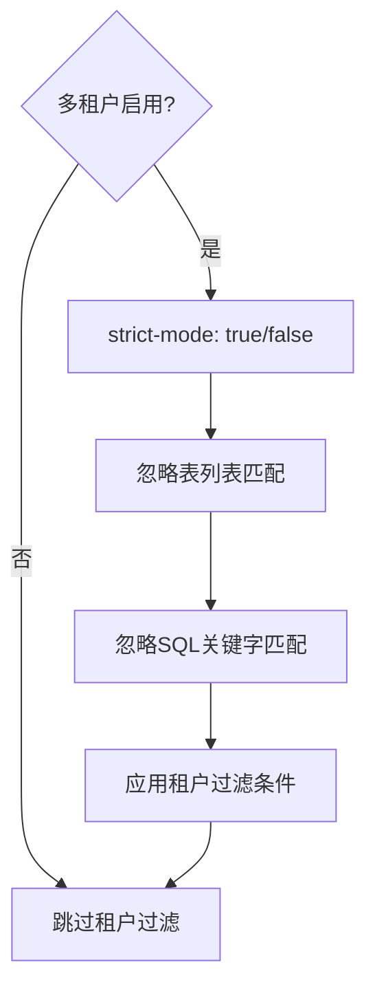
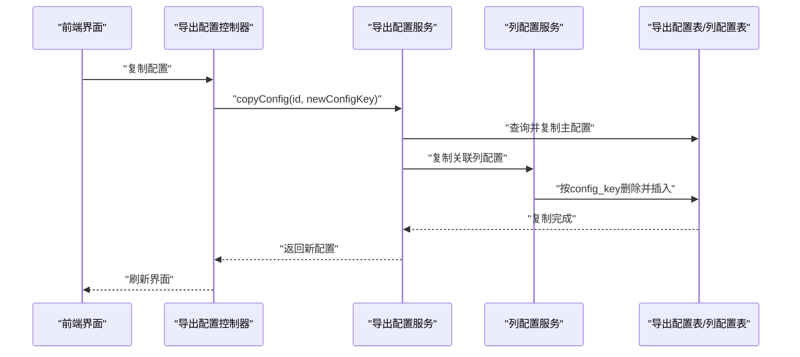
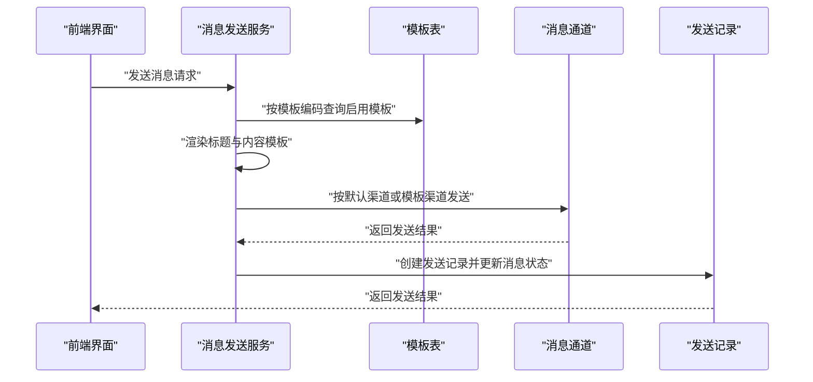
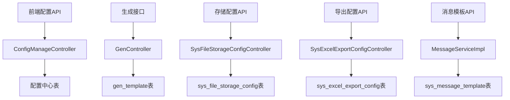

# 功能配置

<cite>
**本文引用的文件**
- [application.yml](file://forge/forge-admin/src/main/resources/application.yml)
- [application-dev.yml](file://forge/forge-admin/src/main/resources/application-dev.yml)
- [ConfigController.java](file://forge/forge-admin/src/main/java/com/mdframe/forge/admin/ConfigController.java)
- [FeatureConfig.java](file://forge/forge-admin/src/main/java/com/mdframe/forge/admin/FeatureConfig.java)
- [config.js](file://forge-admin-ui/src/api/config.js)
- [config-center.vue](file://forge-admin-ui/src/views/system/config-center.vue)
- [config.vue](file://forge-admin-ui/src/views/system/config.vue)
- [ConfigManageController.java](file://forge/forge-framework/forge-starter-parent/forge-starter-config/src/main/java/com/mdframe/forge/starter/config/controller/ConfigManageController.java)
- [GeneratorConfig.java](file://forge/forge-framework/forge-plugin-parent/forge-plugin-generator/src/main/java/com/mdframe/forge/plugin/generator/config/GeneratorConfig.java)
- [GenTemplateServiceImpl.java](file://forge/forge-framework/forge-plugin-parent/forge-plugin-generator/src/main/java/com/mdframe/forge/plugin/generator/service/impl/GenTemplateServiceImpl.java)
- [VelocityUtils.java](file://forge/forge-framework/forge-plugin-parent/forge-plugin-generator/src/main/java/com/mdframe/forge/plugin/generator/util/VelocityUtils.java)
- [generator_tables.sql](file://forge/forge-framework/forge-plugin-parent/forge-plugin-generator/src/main/resources/sql/generator_tables.sql)
- [GenController.java](file://forge/forge-framework/forge-plugin-parent/forge-plugin-generator/src/main/java/com/mdframe/forge/plugin/generator/controller/GenController.java)
- [SysFileStorageConfig.java](file://forge/forge-framework/forge-plugin-parent/forge-plugin-system/src/main/java/com/mdframe/forge/plugin/system/entity/SysFileStorageConfig.java)
- [SysFileStorageConfigController.java](file://forge/forge-framework/forge-plugin-parent/forge-plugin-system/src/main/java/com/mdframe/forge/plugin/system/controller/SysFileStorageConfigController.java)
- [file_storage.sql](file://forge/forge-framework/forge-starter-parent/forge-starter-file/sql/file_storage.sql)
- [storage-config.vue](file://forge-admin-ui/src/views/system/storage-config.vue)
- [StorageConfig.java](file://forge/forge-framework/forge-starter-parent/forge-starter-file/src/main/java/com/mdframe/forge/starter/file/model/StorageConfig.java)
- [application-job-example.yml](file://forge/forge-framework/forge-plugin-parent/forge-plugin-job/src/main/resources/application-job-example.yml)
- [DATA_SCOPE_CONFIG_GUIDE.md](file://forge/forge-framework/forge-starter-parent/forge-starter-datascope/DATA_SCOPE_CONFIG_GUIDE.md)
- [tenant-config-example.yml](file://forge/forge-framework/forge-starter-parent/forge-starter-tenant/src/main/resources/tenant-config-example.yml)
- [excel_export_config.sql](file://forge/forge-framework/forge-starter-parent/forge-starter-excel/sql/excel_export_config.sql)
- [SysExcelExportConfigController.java](file://forge/forge-framework/forge-plugin-parent/forge-plugin-system/src/main/java/com/mdframe/forge/plugin/system/controller/SysExcelExportConfigController.java)
- [SysExcelExportConfigServiceImpl.java](file://forge/forge-framework/forge-plugin-parent/forge-plugin-system/src/main/java/com/mdframe/forge/plugin/system/service/impl/SysExcelExportConfigServiceImpl.java)
- [excel-export-config.vue](file://forge-admin-ui/src/views/system/excel-export-config.vue)
- [WebMessageChannel.java](file://forge/forge-framework/forge-starter-parent/forge-starter-message/src/main/java/com/mdframe/forge/starter/message/channel/WebMessageChannel.java)
- [MessageServiceImpl.java](file://forge/forge-framework/forge-plugin-parent/forge-plugin-message/src/main/java/com/mdframe/forge/plugin/message/service/impl/MessageServiceImpl.java)
- [message_tables.sql](file://forge/forge-framework/forge-plugin-parent/forge-plugin-message/src/main/resources/sql/message_tables.sql)
- [template-list.vue](file://forge-admin-ui/src/views/message/template-list.vue)
</cite>

## 目录
1. [简介](#简介)
2. [项目结构](#项目结构)
3. [核心组件](#核心组件)
4. [架构总览](#架构总览)
5. [详细组件分析](#详细组件分析)
6. [依赖关系分析](#依赖关系分析)
7. [性能考量](#性能考量)
8. [故障排查指南](#故障排查指南)
9. [结论](#结论)
10. [附录](#附录)

## 简介
本文件面向Forge框架的功能配置，围绕以下主题提供系统化的配置说明与实践指导：
- 代码生成配置：模板路径、生成规则、输出目录、模板引擎与覆盖策略
- 文件存储配置：存储类型、本地/云存储参数、默认策略、访问域名与HTTPS
- 定时任务配置：调度策略、集群与线程池、数据库持久化
- 多租户配置：租户字段、严格模式、忽略表与SQL关键字
- Excel导出配置：模板管理、列配置、数据源与分页、样式与文件命名
- 消息通知配置：通道设置、模板管理、发送策略与渲染

目标是帮助开发者基于业务需求灵活配置系统功能，确保可维护性与可扩展性。

## 项目结构
Forge框架采用模块化分层设计，功能配置分布在“启动器(starter)”与“插件(plugin)”两大类中：
- 启动器：提供通用能力（配置中心、文件存储、Excel导出、消息通知、定时任务、多租户、数据权限等）
- 插件：封装具体业务能力（代码生成、系统管理、消息管理等）

```mermaid
graph TB
subgraph "应用层"
AdminUI["前端管理界面<br/>config-center.vue / storage-config.vue / excel-export-config.vue / template-list.vue"]
AdminApp["后端管理应用<br/>ConfigController / FeatureConfig"]
end
subgraph "配置中心(starter-config)"
CfgCtrl["ConfigManageController<br/>配置管理接口"]
end
subgraph "代码生成(plugin-generator)"
GenCfg["GeneratorConfig<br/>生成器配置"]
GenSvc["GenTemplateServiceImpl<br/>模板服务"]
GenCtl["GenController<br/>生成接口"]
end
subgraph "文件存储(starter-file)"
FSCfg["StorageConfig<br/>存储策略模型"]
FSModel["SysFileStorageConfig<br/>存储配置实体"]
FSApi["SysFileStorageConfigController<br/>存储配置接口"]
end
subgraph "Excel导出(starter-excel)"
EXCfg["sys_excel_export_config<br/>导出配置表"]
EXCtl["SysExcelExportConfigController<br/>导出配置接口"]
EXSvc["SysExcelExportConfigServiceImpl<br/>导出配置服务"]
end
subgraph "消息通知(starter-message)"
MsgCh["WebMessageChannel<br/>站内信通道"]
MsgSvc["MessageServiceImpl<br/>消息发送服务"]
MsgTpl["sys_message_template<br/>模板表"]
end
subgraph "定时任务(plugin-job)"
JobYml["application-job-example.yml<br/>Quartz配置示例"]
end
subgraph "多租户(starter-tenant)"
TenantYml["tenant-config-example.yml<br/>多租户配置示例"]
end
subgraph "数据权限(starter-datascope)"
DSGuide["DATA_SCOPE_CONFIG_GUIDE.md<br/>数据范围配置指南"]
end
AdminUI --> CfgCtrl
AdminUI --> FSApi
AdminUI --> EXCtl
AdminUI --> MsgSvc
AdminUI --> GenCtl
AdminApp --> CfgCtrl
GenSvc --> GenCfg
FSApi --> FSCfg
FSApi --> FSModel
EXCtl --> EXSvc
MsgSvc --> MsgCh
MsgSvc --> MsgTpl
JobYml --> Quartz["Quartz调度器"]
TenantYml --> Tenant["租户过滤器/拦截器"]
DSGuide --> DS["数据权限拦截器"]
```

图表来源
- [config-center.vue](file://forge-admin-ui/src/views/system/config-center.vue#L506-L538)
- [storage-config.vue](file://forge-admin-ui/src/views/system/storage-config.vue#L566-L598)
- [excel-export-config.vue](file://forge-admin-ui/src/views/system/excel-export-config.vue#L73-L553)
- [template-list.vue](file://forge-admin-ui/src/views/message/template-list.vue#L57-L84)
- [ConfigManageController.java](file://forge/forge-framework/forge-starter-parent/forge-starter-config/src/main/java/com/mdframe/forge/starter/config/controller/ConfigManageController.java#L41-L90)
- [SysFileStorageConfigController.java](file://forge/forge-framework/forge-plugin-parent/forge-plugin-system/src/main/java/com/mdframe/forge/plugin/system/controller/SysFileStorageConfigController.java#L14-L68)
- [SysExcelExportConfigController.java](file://forge/forge-framework/forge-plugin-parent/forge-plugin-system/src/main/java/com/mdframe/forge/plugin/system/controller/SysExcelExportConfigController.java#L66-L118)
- [MessageServiceImpl.java](file://forge/forge-framework/forge-plugin-parent/forge-plugin-message/src/main/java/com/mdframe/forge/plugin/message/service/impl/MessageServiceImpl.java#L101-L240)
- [GenController.java](file://forge/forge-framework/forge-plugin-parent/forge-plugin-generator/src/main/java/com/mdframe/forge/plugin/generator/controller/GenController.java#L116-L141)
- [application-job-example.yml](file://forge/forge-framework/forge-plugin-parent/forge-plugin-job/src/main/resources/application-job-example.yml#L1-L34)
- [tenant-config-example.yml](file://forge/forge-framework/forge-starter-parent/forge-starter-tenant/src/main/resources/tenant-config-example.yml#L1-L50)
- [DATA_SCOPE_CONFIG_GUIDE.md](file://forge/forge-framework/forge-starter-parent/forge-starter-datascope/DATA_SCOPE_CONFIG_GUIDE.md#L58-L200)

章节来源
- [application.yml](file://forge/forge-admin/src/main/resources/application.yml#L1-L100)
- [application-dev.yml](file://forge/forge-admin/src/main/resources/application-dev.yml#L1-L70)

## 核心组件
- 配置中心：提供统一的配置分组查询、刷新与管理接口，前端通过API封装调用。
- 代码生成：通过配置类与模板服务实现模板引擎、输出路径、覆盖策略等控制。
- 文件存储：以实体与控制器为核心，支持本地与多种云存储策略配置。
- 定时任务：基于Quartz的数据库持久化与集群配置示例。
- 多租户与数据权限：提供配置示例与数据范围配置指南。
- Excel导出：主配置表与列配置联动，支持复制、测试导出与分页。
- 消息通知：模板驱动的渲染与多通道发送，包含站内信通道示例。

章节来源
- [ConfigManageController.java](file://forge/forge-framework/forge-starter-parent/forge-starter-config/src/main/java/com/mdframe/forge/starter/config/controller/ConfigManageController.java#L41-L90)
- [GeneratorConfig.java](file://forge/forge-framework/forge-plugin-parent/forge-plugin-generator/src/main/java/com/mdframe/forge/plugin/generator/config/GeneratorConfig.java#L1-L49)
- [GenTemplateServiceImpl.java](file://forge/forge-framework/forge-plugin-parent/forge-plugin-generator/src/main/java/com/mdframe/forge/plugin/generator/service/impl/GenTemplateServiceImpl.java#L1-L33)
- [SysFileStorageConfig.java](file://forge/forge-framework/forge-plugin-parent/forge-plugin-system/src/main/java/com/mdframe/forge/plugin/system/entity/SysFileStorageConfig.java#L1-L101)
- [SysFileStorageConfigController.java](file://forge/forge-framework/forge-plugin-parent/forge-plugin-system/src/main/java/com/mdframe/forge/plugin/system/controller/SysFileStorageConfigController.java#L14-L68)
- [application-job-example.yml](file://forge/forge-framework/forge-plugin-parent/forge-plugin-job/src/main/resources/application-job-example.yml#L1-L34)
- [tenant-config-example.yml](file://forge/forge-framework/forge-starter-parent/forge-starter-tenant/src/main/resources/tenant-config-example.yml#L1-L50)
- [excel_export_config.sql](file://forge/forge-framework/forge-starter-parent/forge-starter-excel/sql/excel_export_config.sql#L1-L22)
- [SysExcelExportConfigController.java](file://forge/forge-framework/forge-plugin-parent/forge-plugin-system/src/main/java/com/mdframe/forge/plugin/system/controller/SysExcelExportConfigController.java#L66-L118)
- [SysExcelExportConfigServiceImpl.java](file://forge/forge-framework/forge-plugin-parent/forge-plugin-system/src/main/java/com/mdframe/forge/plugin/system/service/impl/SysExcelExportConfigServiceImpl.java#L54-L89)
- [WebMessageChannel.java](file://forge/forge-framework/forge-starter-parent/forge-starter-message/src/main/java/com/mdframe/forge/starter/message/channel/WebMessageChannel.java#L1-L15)
- [MessageServiceImpl.java](file://forge/forge-framework/forge-plugin-parent/forge-plugin-message/src/main/java/com/mdframe/forge/plugin/message/service/impl/MessageServiceImpl.java#L101-L240)

## 架构总览
配置体系由“前端界面 + 后端控制器 + 配置模型/实体 + 配置示例/SQL”构成，形成闭环的可视化配置与持久化管理。

图表来源
- [config.js](file://forge-admin-ui/src/api/config.js#L1-L142)
- [ConfigManageController.java](file://forge/forge-framework/forge-starter-parent/forge-starter-config/src/main/java/com/mdframe/forge/starter/config/controller/ConfigManageController.java#L41-L90)

## 详细组件分析

### 代码生成配置
- 关键点
  - 生成器配置项：作者、包名、模块名、模板引擎、是否覆盖、表前缀、基础路径
  - 模板引擎与文件路径：Velocity模板引擎，文件路径按约定生成
  - 模板表结构：模板ID、名称、编码、类型、引擎、内容、后缀、相对路径、系统内置、启用状态、排序、备注
  - 生成接口：支持按表名生成与批量下载
- 参数说明
  - author：默认作者
  - packageName：默认包名
  - moduleName：默认模块名
  - templateEngine：模板引擎类型（如VELOCITY）
  - autoRemovePrefix：是否自动移除表前缀
  - tablePrefix：表前缀（自动移除）
  - basePath：生成基础路径（默认当前用户目录）
- 使用场景
  - 快速生成标准CRUD代码骨架，统一团队开发规范
  - 通过模板引擎自定义输出文件名与路径，满足多模块或多语言需求
- 配置示例
  - 在应用配置中设置生成器参数，或通过配置中心动态调整
  - 模板内容通过模板表维护，支持系统内置与自定义模板

图表来源
- [GeneratorConfig.java](file://forge/forge-framework/forge-plugin-parent/forge-plugin-generator/src/main/java/com/mdframe/forge/plugin/generator/config/GeneratorConfig.java#L1-L49)
- [GenTemplateServiceImpl.java](file://forge/forge-framework/forge-plugin-parent/forge-plugin-generator/src/main/java/com/mdframe/forge/plugin/generator/service/impl/GenTemplateServiceImpl.java#L1-L33)
- [VelocityUtils.java](file://forge/forge-framework/forge-plugin-parent/forge-plugin-generator/src/main/java/com/mdframe/forge/plugin/generator/util/VelocityUtils.java#L109-L133)

章节来源
- [GeneratorConfig.java](file://forge/forge-framework/forge-plugin-parent/forge-plugin-generator/src/main/java/com/mdframe/forge/plugin/generator/config/GeneratorConfig.java#L1-L49)
- [GenTemplateServiceImpl.java](file://forge/forge-framework/forge-plugin-parent/forge-plugin-generator/src/main/java/com/mdframe/forge/plugin/generator/service/impl/GenTemplateServiceImpl.java#L1-L33)
- [VelocityUtils.java](file://forge/forge-framework/forge-plugin-parent/forge-plugin-generator/src/main/java/com/mdframe/forge/plugin/generator/util/VelocityUtils.java#L109-L133)
- [generator_tables.sql](file://forge/forge-framework/forge-plugin-parent/forge-plugin-generator/src/main/resources/sql/generator_tables.sql#L84-L102)
- [GenController.java](file://forge/forge-framework/forge-plugin-parent/forge-plugin-generator/src/main/java/com/mdframe/forge/plugin/generator/controller/GenController.java#L116-L141)

### 文件存储配置
- 关键点
  - 存储策略模型：名称、类型、默认策略、启用状态、端点、密钥、桶、区域、基础路径、域名、HTTPS、最大文件大小、允许类型、排序、扩展配置
  - 存储配置实体：与数据库表结构对应，支持本地与云存储（如MinIO、阿里云OSS等）
  - 控制器：分页查询、详情、新增、修改、删除、测试连接
- 参数说明
  - storageType：存储类型（local/minio/aliyun_oss等）
  - isDefault：是否默认策略
  - endpoint/accessKey/secretKey/bucketName/region：云存储接入参数
  - basePath/domain/useHttps：基础路径、访问域名、是否HTTPS
  - maxFileSize/allowedTypes：最大文件大小（MB）、允许的文件类型（逗号分隔）
  - extraConfig：扩展配置（JSON格式）
- 使用场景
  - 多租户环境下选择不同存储策略
  - 本地开发与生产云存储切换
- 配置示例
  - 通过前端界面配置存储策略，后端持久化到sys_file_storage_config表

图表来源
- [StorageConfig.java](file://forge/forge-framework/forge-starter-parent/forge-starter-file/src/main/java/com/mdframe/forge/starter/file/model/StorageConfig.java#L1-L99)
- [SysFileStorageConfig.java](file://forge/forge-framework/forge-plugin-parent/forge-plugin-system/src/main/java/com/mdframe/forge/plugin/system/entity/SysFileStorageConfig.java#L1-L101)
- [SysFileStorageConfigController.java](file://forge/forge-framework/forge-plugin-parent/forge-plugin-system/src/main/java/com/mdframe/forge/plugin/system/controller/SysFileStorageConfigController.java#L14-L68)

章节来源
- [StorageConfig.java](file://forge/forge-framework/forge-starter-parent/forge-starter-file/src/main/java/com/mdframe/forge/starter/file/model/StorageConfig.java#L1-L99)
- [SysFileStorageConfig.java](file://forge/forge-framework/forge-plugin-parent/forge-plugin-system/src/main/java/com/mdframe/forge/plugin/system/entity/SysFileStorageConfig.java#L1-L101)
- [SysFileStorageConfigController.java](file://forge/forge-framework/forge-plugin-parent/forge-plugin-system/src/main/java/com/mdframe/forge/plugin/system/controller/SysFileStorageConfigController.java#L14-L68)
- [file_storage.sql](file://forge/forge-framework/forge-starter-parent/forge-starter-file/sql/file_storage.sql#L1-L26)
- [storage-config.vue](file://forge-admin-ui/src/views/system/storage-config.vue#L566-L598)

### 定时任务配置
- 关键点
  - Quartz数据库持久化：使用JDBC存储，支持集群模式
  - 调度器实例名称与ID、表前缀、线程池规模与优先级
- 参数说明
  - job-store-type：jdbc
  - overwrite-existing-jobs：启动时覆盖已存在任务
  - instanceName/instanceId：调度器实例配置
  - tablePrefix：表前缀（QRTZ_）
  - isClustered：集群模式开关
  - threadCount/threadPriority：线程池配置
- 使用场景
  - 高可用分布式任务调度，避免单点故障
- 配置示例
  - 在应用配置中启用Quartz JDBC存储与集群参数

图表来源
- [application-job-example.yml](file://forge/forge-framework/forge-plugin-parent/forge-plugin-job/src/main/resources/application-job-example.yml#L1-L34)

章节来源
- [application-job-example.yml](file://forge/forge-framework/forge-plugin-parent/forge-plugin-job/src/main/resources/application-job-example.yml#L1-L34)

### 多租户配置
- 关键点
  - 启用开关、租户字段、严格模式、忽略表与SQL关键字
  - 忽略表包括租户表、系统配置、字典、文件存储、Excel配置、日志等
- 参数说明
  - enabled：是否启用多租户
  - column：租户字段名称（默认tenant_id）
  - strict-mode：严格模式（true时缺失租户ID抛异常）
  - ignore-tables：忽略租户过滤的表列表
  - ignore-sql-keywords：忽略租户过滤的SQL关键字列表
- 使用场景
  - 多租户SaaS系统，确保数据强隔离
- 配置示例
  - 在应用配置中启用多租户并设置忽略表

图表来源
- [tenant-config-example.yml](file://forge/forge-framework/forge-starter-parent/forge-starter-tenant/src/main/resources/tenant-config-example.yml#L1-L50)

章节来源
- [tenant-config-example.yml](file://forge/forge-framework/forge-starter-parent/forge-starter-tenant/src/main/resources/tenant-config-example.yml#L1-L50)

### Excel导出配置
- 关键点
  - 主配置表：配置键、导出名称、Sheet名称、文件名模板、数据源Bean与方法、是否自动翻译字典、分页查询、最大导出条数、排序字段与方向、状态、备注
  - 控制器：新增、编辑、删除、状态更新、复制配置、导出测试
  - 服务：复制配置时同步复制列配置
- 参数说明
  - config_key：配置键（唯一标识）
  - export_name：导出名称
  - sheet_name：Sheet名称（默认Sheet1）
  - file_name_template：文件名模板（支持占位符{date}、{time}）
  - data_source_bean/query_method：数据源Bean名称与查询方法
  - auto_trans/pageable/max_rows：自动翻译字典、分页查询、最大导出条数
  - sort_field/sort_order：排序字段与方向
  - status：状态（1启用，0禁用）
- 使用场景
  - 系统导出报表、统计分析数据
- 配置示例
  - 通过前端界面配置导出模板与列配置，支持复制与测试导出

图表来源
- [SysExcelExportConfigController.java](file://forge/forge-framework/forge-plugin-parent/forge-plugin-system/src/main/java/com/mdframe/forge/plugin/system/controller/SysExcelExportConfigController.java#L66-L118)
- [SysExcelExportConfigServiceImpl.java](file://forge/forge-framework/forge-plugin-parent/forge-plugin-system/src/main/java/com/mdframe/forge/plugin/system/service/impl/SysExcelExportConfigServiceImpl.java#L54-L89)
- [excel_export_config.sql](file://forge/forge-framework/forge-starter-parent/forge-starter-excel/sql/excel_export_config.sql#L1-L22)

章节来源
- [excel_export_config.sql](file://forge/forge-framework/forge-starter-parent/forge-starter-excel/sql/excel_export_config.sql#L1-L22)
- [SysExcelExportConfigController.java](file://forge/forge-framework/forge-plugin-parent/forge-plugin-system/src/main/java/com/mdframe/forge/plugin/system/controller/SysExcelExportConfigController.java#L66-L118)
- [SysExcelExportConfigServiceImpl.java](file://forge/forge-framework/forge-plugin-parent/forge-plugin-system/src/main/java/com/mdframe/forge/plugin/system/service/impl/SysExcelExportConfigServiceImpl.java#L54-L89)
- [excel-export-config.vue](file://forge-admin-ui/src/views/system/excel-export-config.vue#L73-L553)

### 消息通知配置
- 关键点
  - 模板表：模板编码、名称、类型、标题与内容模板、默认渠道、启用状态、备注
  - 消息发送服务：模板渲染、渠道选择、发送记录与状态更新
  - 站内信通道：占位实现，实际推送由插件模块完成
- 参数说明
  - template_code/template_name/type：模板编码、名称、类型（SYSTEM/SMS/EMAIL/CUSTOM）
  - title_template/content_template：标题与内容模板（支持${变量}占位符）
  - default_channel：默认发送渠道（WEB/SMS/EMAIL/PUSH）
  - enabled：启用状态
- 使用场景
  - 系统通知、审批通知、短信验证码等
- 配置示例
  - 通过前端模板列表配置消息模板，后端按模板渲染并发送

图表来源
- [MessageServiceImpl.java](file://forge/forge-framework/forge-plugin-parent/forge-plugin-message/src/main/java/com/mdframe/forge/plugin/message/service/impl/MessageServiceImpl.java#L101-L240)
- [WebMessageChannel.java](file://forge/forge-framework/forge-starter-parent/forge-starter-message/src/main/java/com/mdframe/forge/starter/message/channel/WebMessageChannel.java#L1-L15)
- [message_tables.sql](file://forge/forge-framework/forge-plugin-parent/forge-plugin-message/src/main/resources/sql/message_tables.sql#L62-L89)
- [template-list.vue](file://forge-admin-ui/src/views/message/template-list.vue#L57-L84)

章节来源
- [MessageServiceImpl.java](file://forge/forge-framework/forge-plugin-parent/forge-plugin-message/src/main/java/com/mdframe/forge/plugin/message/service/impl/MessageServiceImpl.java#L101-L240)
- [WebMessageChannel.java](file://forge/forge-framework/forge-starter-parent/forge-starter-message/src/main/java/com/mdframe/forge/starter/message/channel/WebMessageChannel.java#L1-L15)
- [message_tables.sql](file://forge/forge-framework/forge-plugin-parent/forge-plugin-message/src/main/resources/sql/message_tables.sql#L62-L89)
- [template-list.vue](file://forge-admin-ui/src/views/message/template-list.vue#L57-L84)

### 配置中心与前端交互
- 关键点
  - 前端通过API封装获取/更新配置分组，刷新配置
  - 配置中心控制器提供登录、水印、安全、加解密、认证、日志、系统等配置的查询与更新接口
  - 前端配置中心页面支持日志相关参数（请求/响应最大长度、控制台打印开关）
- 参数说明
  - 日志配置：请求参数最大长度、响应结果最大长度、在控制台打印操作日志、登录日志
- 使用场景
  - 运维与管理员在线调整系统行为参数

章节来源
- [config.js](file://forge-admin-ui/src/api/config.js#L1-L142)
- [ConfigManageController.java](file://forge/forge-framework/forge-starter-parent/forge-starter-config/src/main/java/com/mdframe/forge/starter/config/controller/ConfigManageController.java#L41-L90)
- [config-center.vue](file://forge-admin-ui/src/views/system/config-center.vue#L506-L538)
- [config.vue](file://forge-admin-ui/src/views/system/config.vue#L50-L142)
- [ConfigController.java](file://forge/forge-admin/src/main/java/com/mdframe/forge/admin/ConfigController.java#L1-L38)
- [FeatureConfig.java](file://forge/forge-admin/src/main/java/com/mdframe/forge/admin/FeatureConfig.java#L1-L21)

## 依赖关系分析
- 配置中心依赖于后端控制器与数据库表，前端通过API进行交互
- 代码生成依赖于模板引擎与模板表，生成接口负责打包下载
- 文件存储依赖于存储策略模型与实体，控制器提供CRUD与测试连接
- Excel导出依赖于主配置表与列配置表，服务层负责复制与测试导出
- 消息通知依赖于模板表与通道实现，服务层负责渲染与记录
- 定时任务依赖于Quartz配置示例，确保数据库持久化与集群运行

图表来源
- [config.js](file://forge-admin-ui/src/api/config.js#L1-L142)
- [ConfigManageController.java](file://forge/forge-framework/forge-starter-parent/forge-starter-config/src/main/java/com/mdframe/forge/starter/config/controller/ConfigManageController.java#L41-L90)
- [GenController.java](file://forge/forge-framework/forge-plugin-parent/forge-plugin-generator/src/main/java/com/mdframe/forge/plugin/generator/controller/GenController.java#L116-L141)
- [SysFileStorageConfigController.java](file://forge/forge-framework/forge-plugin-parent/forge-plugin-system/src/main/java/com/mdframe/forge/plugin/system/controller/SysFileStorageConfigController.java#L14-L68)
- [SysExcelExportConfigController.java](file://forge/forge-framework/forge-plugin-parent/forge-plugin-system/src/main/java/com/mdframe/forge/plugin/system/controller/SysExcelExportConfigController.java#L66-L118)
- [MessageServiceImpl.java](file://forge/forge-framework/forge-plugin-parent/forge-plugin-message/src/main/java/com/mdframe/forge/plugin/message/service/impl/MessageServiceImpl.java#L101-L240)

## 性能考量
- 代码生成
  - 模板引擎缓存与预览有助于减少重复渲染开销
  - 输出路径与覆盖策略影响磁盘I/O，建议合理规划basePath与tablePrefix
- 文件存储
  - 云存储端点与HTTPS配置影响网络延迟，建议在生产环境启用HTTPS并优化endpoint
  - 允许类型与最大文件大小限制可降低存储压力
- 定时任务
  - 线程池规模与集群检查间隔需结合业务负载调整
- Excel导出
  - 分页查询与最大导出条数限制可避免大查询导致的内存压力
- 消息通知
  - 模板渲染与通道发送的异步化可提升吞吐量

## 故障排查指南
- 配置中心
  - 若刷新配置无效，检查后端接口与数据库配置是否正确
  - 日志参数过大可能导致内存占用上升，适当下调最大长度
- 代码生成
  - 模板未生效：检查模板编码与启用状态
  - 输出路径异常：核对basePath与tablePrefix配置
- 文件存储
  - 云存储连接失败：核对endpoint、accessKey、secretKey、bucketName、region
  - 前端测试连接无响应：确认后端控制器与数据库连通性
- 定时任务
  - 任务未执行：检查Quartz数据库表与集群配置
- Excel导出
  - 导出失败：检查数据源Bean与方法、分页参数与最大导出条数
- 消息通知
  - 模板未渲染：检查模板编码、启用状态与占位符
  - 发送失败：查看发送记录与错误信息

章节来源
- [config-center.vue](file://forge-admin-ui/src/views/system/config-center.vue#L506-L538)
- [storage-config.vue](file://forge-admin-ui/src/views/system/storage-config.vue#L566-L598)
- [excel-export-config.vue](file://forge-admin-ui/src/views/system/excel-export-config.vue#L73-L553)
- [template-list.vue](file://forge-admin-ui/src/views/message/template-list.vue#L57-L84)

## 结论
Forge框架通过模块化与配置中心实现了功能配置的统一管理与可视化操作。开发者可根据业务场景灵活调整代码生成、文件存储、定时任务、多租户、Excel导出与消息通知等配置，从而在保证一致性的同时提升系统的可维护性与扩展性。

## 附录
- 数据范围配置指南要点
  - 资源编码、Mapper方法、表别名、用户ID/组织ID/租户ID字段配置
  - 支持简单字段名与复杂SQL语句两种模式
  - 提供多示例展示不同权限场景下的SQL条件生成

章节来源
- [DATA_SCOPE_CONFIG_GUIDE.md](file://forge/forge-framework/forge-starter-parent/forge-starter-datascope/DATA_SCOPE_CONFIG_GUIDE.md#L58-L200)