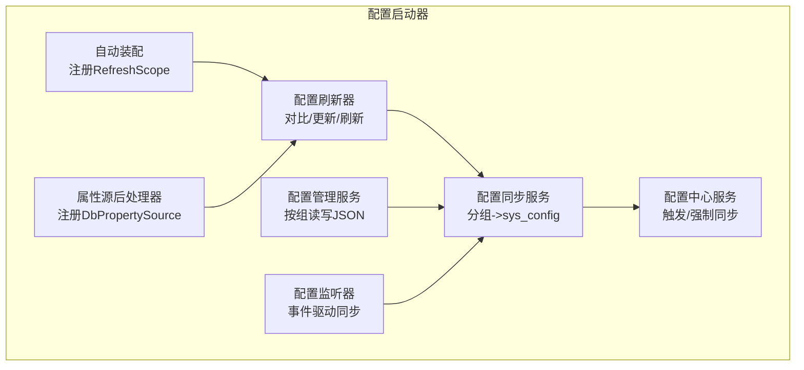
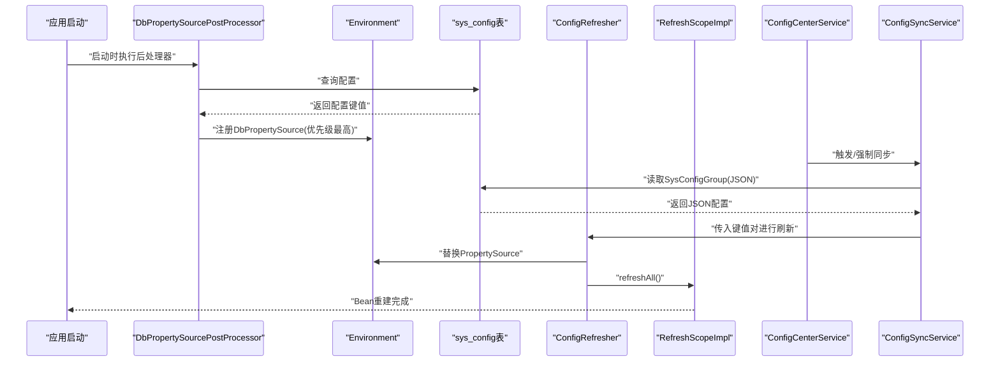
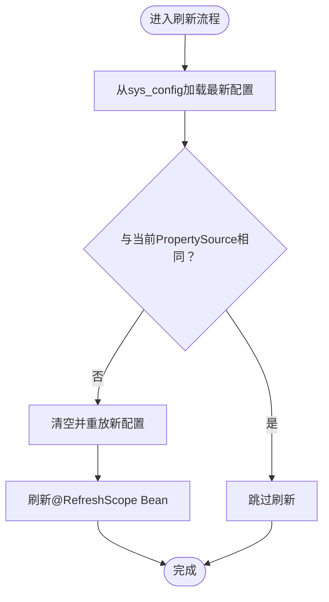
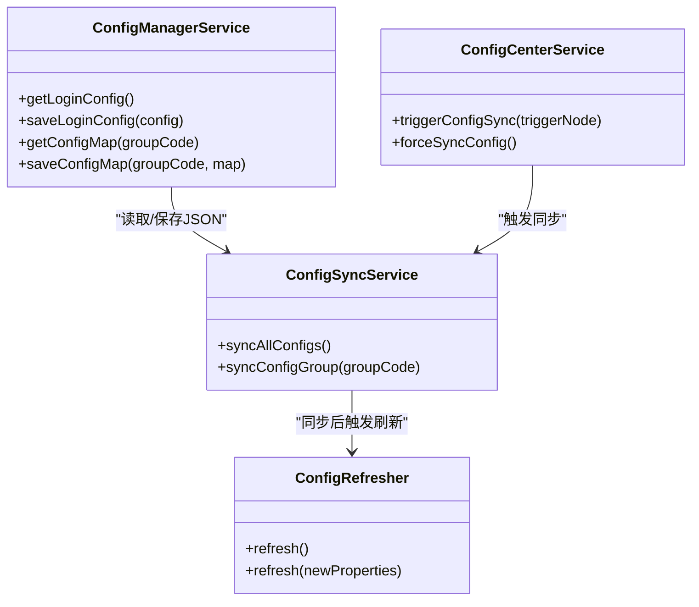
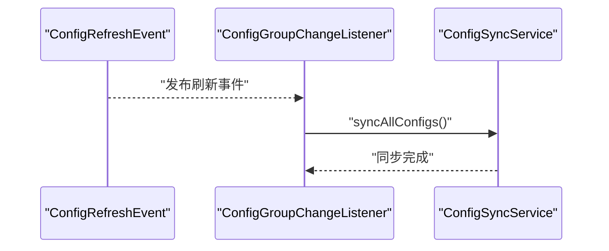
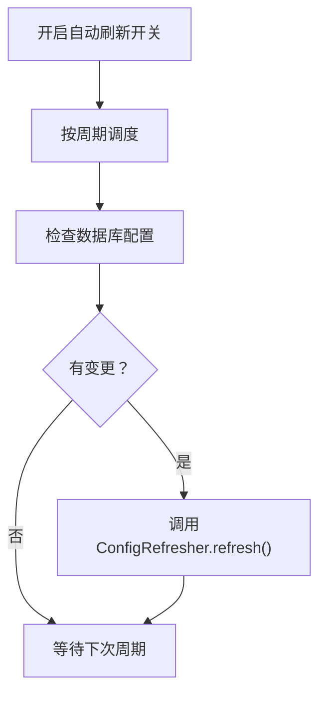
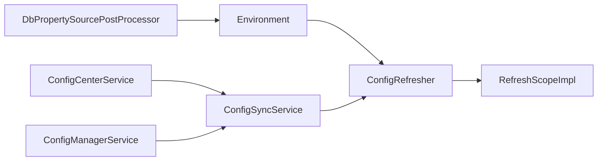

# 动态配置

<cite>
**本文引用的文件**
- [forge/forge-framework/forge-starter-parent/forge-starter-config/USAGE_EXAMPLE.md](file://forge/forge-framework/forge-starter-parent/forge-starter-config/USAGE_EXAMPLE.md)
- [forge/forge-framework/forge-starter-parent/forge-starter-config/src/main/java/com/mdframe/forge/starter/config/config/ConfigAutoConfiguration.java](file://forge/forge-framework/forge-starter-parent/forge-starter-config/src/main/java/com/mdframe/forge/starter/config/config/ConfigAutoConfiguration.java)
- [forge/forge-framework/forge-starter-parent/forge-starter-config/src/main/java/com/mdframe/forge/starter/config/service/ConfigCenterService.java](file://forge/forge-framework/forge-starter-parent/forge-starter-config/src/main/java/com/mdframe/forge/starter/config/service/ConfigCenterService.java)
- [forge/forge-framework/forge-starter-parent/forge-starter-config/src/main/java/com/mdframe/forge/starter/config/service/ConfigSyncService.java](file://forge/forge-framework/forge-starter-parent/forge-starter-config/src/main/java/com/mdframe/forge/starter/config/service/ConfigSyncService.java)
- [forge/forge-framework/forge-starter-parent/forge-starter-config/src/main/java/com/mdframe/forge/starter/config/service/ConfigManagerService.java](file://forge/forge-framework/forge-starter-parent/forge-starter-config/src/main/java/com/mdframe/forge/starter/config/service/ConfigManagerService.java)
- [forge/forge-framework/forge-starter-parent/forge-starter-config/src/main/java/com/mdframe/forge/starter/config/listener/ConfigGroupChangeListener.java](file://forge/forge-framework/forge-starter-parent/forge-starter-config/src/main/java/com/mdframe/forge/starter/config/listener/ConfigGroupChangeListener.java)
- [forge/forge-framework/forge-starter-parent/forge-starter-config/src/main/java/com/mdframe/forge/starter/property/DbPropertySource.java](file://forge/forge-framework/forge-starter-parent/forge-starter-config/src/main/java/com/mdframe/forge/starter/property/DbPropertySource.java)
- [forge/forge-framework/forge-starter-parent/forge-starter-config/src/main/java/com/mdframe/forge/starter/property/DbPropertySourcePostProcessor.java](file://forge/forge-framework/forge-starter-parent/forge-starter-config/src/main/java/com/mdframe/forge/starter/property/DbPropertySourcePostProcessor.java)
- [forge/forge-framework/forge-starter-parent/forge-starter-config/src/main/java/com/mdframe/forge/starter/property/refresh/ConfigRefresher.java](file://forge/forge-framework/forge-starter-parent/forge-starter-config/src/main/java/com/mdframe/forge/starter/property/refresh/ConfigRefresher.java)
- [forge/forge-framework/forge-starter-parent/forge-starter-config/src/main/java/com/mdframe/forge/starter/property/refresh/ConfigChangeListener.java](file://forge/forge-framework/forge-starter-parent/forge-starter-config/src/main/java/com/mdframe/forge/starter/property/refresh/ConfigChangeListener.java)
- [forge/forge-framework/forge-starter-parent/forge-starter-config/src/main/java/com/mdframe/forge/starter/property/config/PropertyRefreshAutoConfiguration.java](file://forge/forge-framework/forge-starter-parent/forge-starter-config/src/main/java/com/mdframe/forge/starter/property/config/PropertyRefreshAutoConfiguration.java)
- [forge/forge-framework/forge-starter-parent/forge-starter-config/src/main/java/com/mdframe/forge/starter/property/event/ConfigRefreshEvent.java](file://forge/forge-framework/forge-starter-parent/forge-starter-config/src/main/java/com/mdframe/forge/starter/property/event/ConfigRefreshEvent.java)
- [forge/forge-framework/forge-starter-parent/forge-starter-config/sql/config_properties.sql](file://forge/forge-framework/forge-starter-parent/forge-starter-config/sql/config_properties.sql)
</cite>

## 目录
1. [简介](#简介)
2. [项目结构](#项目结构)
3. [核心组件](#核心组件)
4. [架构总览](#架构总览)
5. [详细组件分析](#详细组件分析)
6. [依赖关系分析](#依赖关系分析)
7. [性能考量](#性能考量)
8. [故障排查指南](#故障排查指南)
9. [结论](#结论)
10. [附录](#附录)

## 简介
本文件聚焦于Forge框架的动态配置中心机制，系统性阐述配置中心的工作原理、配置组管理、配置监听与刷新策略、数据库配置存储、热更新实现、版本与同步机制，并提供使用示例、最佳实践与运维建议。读者无需深入源码即可理解如何在运行时修改配置、接收变更通知以及进行回滚。

## 项目结构
动态配置能力主要由“配置启动器”模块提供，核心涉及以下层次：
- 自动装配与作用域注册：负责注册RefreshScope作用域、定时刷新开关等
- 属性源与后处理器：将数据库配置注入为Spring Environment的PropertySource
- 配置刷新器：负责对比新旧配置、更新PropertySource并刷新@RefreshScope Bean
- 配置同步服务：将SysConfigGroup中的配置转换并同步到sys_config表，复用现有刷新链路
- 配置中心服务：提供触发/强制同步的能力，保障分布式一致性
- 配置管理服务：面向业务的配置读写入口，按分组管理JSON配置
- 监听器与事件：监听配置刷新事件，触发同步或缓存刷新

图表来源
- [forge/forge-framework/forge-starter-parent/forge-starter-config/src/main/java/com/mdframe/forge/starter/property/config/PropertyRefreshAutoConfiguration.java](file://forge/forge-framework/forge-starter-parent/forge-starter-config/src/main/java/com/mdframe/forge/starter/property/config/PropertyRefreshAutoConfiguration.java#L1-L34)
- [forge/forge-framework/forge-starter-parent/forge-starter-config/src/main/java/com/mdframe/forge/starter/property/DbPropertySourcePostProcessor.java](file://forge/forge-framework/forge-starter-parent/forge-starter-config/src/main/java/com/mdframe/forge/starter/property/DbPropertySourcePostProcessor.java#L39-L65)
- [forge/forge-framework/forge-starter-parent/forge-starter-config/src/main/java/com/mdframe/forge/starter/property/refresh/ConfigRefresher.java](file://forge/forge-framework/forge-starter-parent/forge-starter-config/src/main/java/com/mdframe/forge/starter/property/refresh/ConfigRefresher.java#L15-L86)
- [forge/forge-framework/forge-starter-parent/forge-starter-config/src/main/java/com/mdframe/forge/starter/config/service/ConfigSyncService.java](file://forge/forge-framework/forge-starter-parent/forge-starter-config/src/main/java/com/mdframe/forge/starter/config/service/ConfigSyncService.java#L1-L121)
- [forge/forge-framework/forge-starter-parent/forge-starter-config/src/main/java/com/mdframe/forge/starter/config/service/ConfigCenterService.java](file://forge/forge-framework/forge-starter-parent/forge-starter-config/src/main/java/com/mdframe/forge/starter/config/service/ConfigCenterService.java#L1-L54)
- [forge/forge-framework/forge-starter-parent/forge-starter-config/src/main/java/com/mdframe/forge/starter/config/service/ConfigManagerService.java](file://forge/forge-framework/forge-starter-parent/forge-starter-config/src/main/java/com/mdframe/forge/starter/config/service/ConfigManagerService.java#L1-L194)
- [forge/forge-framework/forge-starter-parent/forge-starter-config/src/main/java/com/mdframe/forge/starter/config/listener/ConfigGroupChangeListener.java](file://forge/forge-framework/forge-starter-parent/forge-starter-config/src/main/java/com/mdframe/forge/starter/config/listener/ConfigGroupChangeListener.java#L1-L34)

章节来源
- [forge/forge-framework/forge-starter-parent/forge-starter-config/USAGE_EXAMPLE.md](file://forge/forge-framework/forge-starter-parent/forge-starter-config/USAGE_EXAMPLE.md#L1-L70)

## 核心组件
- 自动装配与作用域注册
  - 注册RefreshScope作用域，使Bean可通过@RefreshScope实现动态刷新
  - 开启调度，为定时刷新提供基础
- 属性源与后处理器
  - 在应用启动时从sys_config表加载配置，构建DbPropertySource并插入到Environment优先级最高处
- 配置刷新器
  - 对比数据库最新配置与当前PropertySource，若不同则清空并重放新配置，随后刷新所有@RefreshScope Bean
- 配置同步服务
  - 将SysConfigGroup中的JSON配置按分组解析为键值对，同步到sys_config表，再复用刷新器完成热更新
- 配置中心服务
  - 提供触发同步与强制同步方法，内部使用本地锁避免并发冲突
- 配置管理服务
  - 面向业务的配置读写：按组读取/保存对象或Map形式的配置
- 配置监听器
  - 监听配置刷新事件，触发同步，确保多实例一致

章节来源
- [forge/forge-framework/forge-starter-parent/forge-starter-config/src/main/java/com/mdframe/forge/starter/property/config/PropertyRefreshAutoConfiguration.java](file://forge/forge-framework/forge-starter-parent/forge-starter-config/src/main/java/com/mdframe/forge/starter/property/config/PropertyRefreshAutoConfiguration.java#L1-L34)
- [forge/forge-framework/forge-starter-parent/forge-starter-config/src/main/java/com/mdframe/forge/starter/property/DbPropertySourcePostProcessor.java](file://forge/forge-framework/forge-starter-parent/forge-starter-config/src/main/java/com/mdframe/forge/starter/property/DbPropertySourcePostProcessor.java#L39-L65)
- [forge/forge-framework/forge-starter-parent/forge-starter-config/src/main/java/com/mdframe/forge/starter/property/refresh/ConfigRefresher.java](file://forge/forge-framework/forge-starter-parent/forge-starter-config/src/main/java/com/mdframe/forge/starter/property/refresh/ConfigRefresher.java#L15-L86)
- [forge/forge-framework/forge-starter-parent/forge-starter-config/src/main/java/com/mdframe/forge/starter/config/service/ConfigSyncService.java](file://forge/forge-framework/forge-starter-parent/forge-starter-config/src/main/java/com/mdframe/forge/starter/config/service/ConfigSyncService.java#L1-L121)
- [forge/forge-framework/forge-starter-parent/forge-starter-config/src/main/java/com/mdframe/forge/starter/config/service/ConfigCenterService.java](file://forge/forge-framework/forge-starter-parent/forge-starter-config/src/main/java/com/mdframe/forge/starter/config/service/ConfigCenterService.java#L1-L54)
- [forge/forge-framework/forge-starter-parent/forge-starter-config/src/main/java/com/mdframe/forge/starter/config/service/ConfigManagerService.java](file://forge/forge-framework/forge-starter-parent/forge-starter-config/src/main/java/com/mdframe/forge/starter/config/service/ConfigManagerService.java#L1-L194)
- [forge/forge-framework/forge-starter-parent/forge-starter-config/src/main/java/com/mdframe/forge/starter/config/listener/ConfigGroupChangeListener.java](file://forge/forge-framework/forge-starter-parent/forge-starter-config/src/main/java/com/mdframe/forge/starter/config/listener/ConfigGroupChangeListener.java#L1-L34)

## 架构总览
下图展示了从数据库到Spring Environment再到@RefreshScope Bean的完整链路，以及配置中心服务与监听器的协同：

图表来源
- [forge/forge-framework/forge-starter-parent/forge-starter-config/src/main/java/com/mdframe/forge/starter/property/DbPropertySourcePostProcessor.java](file://forge/forge-framework/forge-starter-parent/forge-starter-config/src/main/java/com/mdframe/forge/starter/property/DbPropertySourcePostProcessor.java#L39-L65)
- [forge/forge-framework/forge-starter-parent/forge-starter-config/src/main/java/com/mdframe/forge/starter/property/refresh/ConfigRefresher.java](file://forge/forge-framework/forge-starter-parent/forge-starter-config/src/main/java/com/mdframe/forge/starter/property/refresh/ConfigRefresher.java#L15-L86)
- [forge/forge-framework/forge-starter-parent/forge-starter-config/src/main/java/com/mdframe/forge/starter/property/scope/RefreshScopeImpl.java](file://forge/forge-framework/forge-starter-parent/forge-starter-config/src/main/java/com/mdframe/forge/starter/property/scope/RefreshScopeImpl.java#L1-L66)
- [forge/forge-framework/forge-starter-parent/forge-starter-config/src/main/java/com/mdframe/forge/starter/config/service/ConfigCenterService.java](file://forge/forge-framework/forge-starter-parent/forge-starter-config/src/main/java/com/mdframe/forge/starter/config/service/ConfigCenterService.java#L1-L54)
- [forge/forge-framework/forge-starter-parent/forge-starter-config/src/main/java/com/mdframe/forge/starter/config/service/ConfigSyncService.java](file://forge/forge-framework/forge-starter-parent/forge-starter-config/src/main/java/com/mdframe/forge/starter/config/service/ConfigSyncService.java#L1-L121)

## 详细组件分析

### 组件一：配置刷新与热更新
- 工作原理
  - 启动阶段通过DbPropertySourcePostProcessor将sys_config表的配置注入为Environment的PropertySource
  - ConfigRefresher对比数据库最新配置与当前PropertySource，若不一致则清空并重放新配置，随后调用RefreshScopeImpl.refreshAll()重建@RefreshScope Bean
- 关键点
  - PropertySource优先级最高，保证数据库配置覆盖默认配置
  - 刷新过程原子化，避免部分更新导致的不一致
- 使用示例路径
  - 参考使用示例文档中的配置与Bean标注方式

图表来源
- [forge/forge-framework/forge-starter-parent/forge-starter-config/src/main/java/com/mdframe/forge/starter/property/refresh/ConfigRefresher.java](file://forge/forge-framework/forge-starter-parent/forge-starter-config/src/main/java/com/mdframe/forge/starter/property/refresh/ConfigRefresher.java#L15-L86)
- [forge/forge-framework/forge-starter-parent/forge-starter-config/src/main/java/com/mdframe/forge/starter/property/DbPropertySource.java](file://forge/forge-framework/forge-starter-parent/forge-starter-config/src/main/java/com/mdframe/forge/starter/property/DbPropertySource.java#L1-L34)
- [forge/forge-framework/forge-starter-parent/forge-starter-config/src/main/java/com/mdframe/forge/starter/property/scope/RefreshScopeImpl.java](file://forge/forge-framework/forge-starter-parent/forge-starter-config/src/main/java/com/mdframe/forge/starter/property/scope/RefreshScopeImpl.java#L1-L66)

章节来源
- [forge/forge-framework/forge-starter-parent/forge-starter-config/src/main/java/com/mdframe/forge/starter/property/refresh/ConfigRefresher.java](file://forge/forge-framework/forge-starter-parent/forge-starter-config/src/main/java/com/mdframe/forge/starter/property/refresh/ConfigRefresher.java#L15-L86)
- [forge/forge-framework/forge-starter-parent/forge-starter-config/src/main/java/com/mdframe/forge/starter/property/DbPropertySource.java](file://forge/forge-framework/forge-starter-parent/forge-starter-config/src/main/java/com/mdframe/forge/starter/property/DbPropertySource.java#L1-L34)
- [forge/forge-framework/forge-starter-parent/forge-starter-config/src/main/java/com/mdframe/forge/starter/property/scope/RefreshScopeImpl.java](file://forge/forge-framework/forge-starter-parent/forge-starter-config/src/main/java/com/mdframe/forge/starter/property/scope/RefreshScopeImpl.java#L1-L66)

### 组件二：配置组管理与同步
- 配置组管理
  - ConfigManagerService按组读取/保存JSON配置，支持Login、Security、System、Watermark、Crypto、Auth、Log等常用分组
  - 支持Map形式的灵活读写
- 同步机制
  - ConfigSyncService将SysConfigGroup中的JSON解析为键值对，写入sys_config表，再交由ConfigRefresher完成热更新
  - 支持全量同步与按分组同步
- 配置中心服务
  - ConfigCenterService提供triggerConfigSync与forceSyncConfig，内部使用本地锁避免并发同步

图表来源
- [forge/forge-framework/forge-starter-parent/forge-starter-config/src/main/java/com/mdframe/forge/starter/config/service/ConfigManagerService.java](file://forge/forge-framework/forge-starter-parent/forge-starter-config/src/main/java/com/mdframe/forge/starter/config/service/ConfigManagerService.java#L1-L194)
- [forge/forge-framework/forge-starter-parent/forge-starter-config/src/main/java/com/mdframe/forge/starter/config/service/ConfigSyncService.java](file://forge/forge-framework/forge-starter-parent/forge-starter-config/src/main/java/com/mdframe/forge/starter/config/service/ConfigSyncService.java#L1-L121)
- [forge/forge-framework/forge-starter-parent/forge-starter-config/src/main/java/com/mdframe/forge/starter/config/service/ConfigCenterService.java](file://forge/forge-framework/forge-starter-parent/forge-starter-config/src/main/java/com/mdframe/forge/starter/config/service/ConfigCenterService.java#L1-L54)
- [forge/forge-framework/forge-starter-parent/forge-starter-config/src/main/java/com/mdframe/forge/starter/property/refresh/ConfigRefresher.java](file://forge/forge-framework/forge-starter-parent/forge-starter-config/src/main/java/com/mdframe/forge/starter/property/refresh/ConfigRefresher.java#L15-L86)

章节来源
- [forge/forge-framework/forge-starter-parent/forge-starter-config/src/main/java/com/mdframe/forge/starter/config/service/ConfigManagerService.java](file://forge/forge-framework/forge-starter-parent/forge-starter-config/src/main/java/com/mdframe/forge/starter/config/service/ConfigManagerService.java#L1-L194)
- [forge/forge-framework/forge-starter-parent/forge-starter-config/src/main/java/com/mdframe/forge/starter/config/service/ConfigSyncService.java](file://forge/forge-framework/forge-starter-parent/forge-starter-config/src/main/java/com/mdframe/forge/starter/config/service/ConfigSyncService.java#L1-L121)
- [forge/forge-framework/forge-starter-parent/forge-starter-config/src/main/java/com/mdframe/forge/starter/config/service/ConfigCenterService.java](file://forge/forge-framework/forge-starter-parent/forge-starter-config/src/main/java/com/mdframe/forge/starter/config/service/ConfigCenterService.java#L1-L54)

### 组件三：监听器与事件
- ConfigRefreshEvent：封装旧/新配置，计算变更集合
- ConfigGroupChangeListener：监听配置刷新事件，触发同步
- ApiConfigRefreshListener（同模块其他组件）：监听API配置刷新事件，刷新本地缓存

图表来源
- [forge/forge-framework/forge-starter-parent/forge-starter-config/src/main/java/com/mdframe/forge/starter/property/event/ConfigRefreshEvent.java](file://forge/forge-framework/forge-starter-parent/forge-starter-config/src/main/java/com/mdframe/forge/starter/property/event/ConfigRefreshEvent.java#L1-L42)
- [forge/forge-framework/forge-starter-parent/forge-starter-config/src/main/java/com/mdframe/forge/starter/config/listener/ConfigGroupChangeListener.java](file://forge/forge-framework/forge-starter-parent/forge-starter-config/src/main/java/com/mdframe/forge/starter/config/listener/ConfigGroupChangeListener.java#L1-L34)

章节来源
- [forge/forge-framework/forge-starter-parent/forge-starter-config/src/main/java/com/mdframe/forge/starter/property/event/ConfigRefreshEvent.java](file://forge/forge-framework/forge-starter-parent/forge-starter-config/src/main/java/com/mdframe/forge/starter/property/event/ConfigRefreshEvent.java#L1-L42)
- [forge/forge-framework/forge-starter-parent/forge-starter-config/src/main/java/com/mdframe/forge/starter/config/listener/ConfigGroupChangeListener.java](file://forge/forge-framework/forge-starter-parent/forge-starter-config/src/main/java/com/mdframe/forge/starter/config/listener/ConfigGroupChangeListener.java#L1-L34)

### 组件四：定时刷新与自动装配
- PropertyRefreshAutoConfiguration：注册RefreshScope作用域与调度
- ConfigChangeListener：按配置开关与周期定时检查数据库变更并刷新

图表来源
- [forge/forge-framework/forge-starter-parent/forge-starter-config/src/main/java/com/mdframe/forge/starter/property/config/PropertyRefreshAutoConfiguration.java](file://forge/forge-framework/forge-starter-parent/forge-starter-config/src/main/java/com/mdframe/forge/starter/property/config/PropertyRefreshAutoConfiguration.java#L1-L34)
- [forge/forge-framework/forge-starter-parent/forge-starter-config/src/main/java/com/mdframe/forge/starter/property/refresh/ConfigChangeListener.java](file://forge/forge-framework/forge-starter-parent/forge-starter-config/src/main/java/com/mdframe/forge/starter/property/refresh/ConfigChangeListener.java#L1-L33)

章节来源
- [forge/forge-framework/forge-starter-parent/forge-starter-config/src/main/java/com/mdframe/forge/starter/property/config/PropertyRefreshAutoConfiguration.java](file://forge/forge-framework/forge-starter-parent/forge-starter-config/src/main/java/com/mdframe/forge/starter/property/config/PropertyRefreshAutoConfiguration.java#L1-L34)
- [forge/forge-framework/forge-starter-parent/forge-starter-config/src/main/java/com/mdframe/forge/starter/property/refresh/ConfigChangeListener.java](file://forge/forge-framework/forge-starter-parent/forge-starter-config/src/main/java/com/mdframe/forge/starter/property/refresh/ConfigChangeListener.java#L1-L33)

## 依赖关系分析
- 组件耦合
  - ConfigSyncService依赖ISysConfigGroupService、JdbcTemplate、ConfigRefresher、ConfigConverter
  - ConfigCenterService依赖ConfigSyncService与事件发布器
  - ConfigRefresher依赖ApplicationContext、Environment、RefreshScopeImpl、JdbcTemplate
  - DbPropertySourcePostProcessor依赖DataSource与JdbcTemplate
- 外部依赖
  - Spring Environment与Bean作用域机制
  - 数据库sys_config表作为配置存储载体
  - Jackson用于JSON序列化/反序列化

图表来源
- [forge/forge-framework/forge-starter-parent/forge-starter-config/src/main/java/com/mdframe/forge/starter/property/DbPropertySourcePostProcessor.java](file://forge/forge-framework/forge-starter-parent/forge-starter-config/src/main/java/com/mdframe/forge/starter/property/DbPropertySourcePostProcessor.java#L39-L65)
- [forge/forge-framework/forge-starter-parent/forge-starter-config/src/main/java/com/mdframe/forge/starter/property/refresh/ConfigRefresher.java](file://forge/forge-framework/forge-starter-parent/forge-starter-config/src/main/java/com/mdframe/forge/starter/property/refresh/ConfigRefresher.java#L15-L86)
- [forge/forge-framework/forge-starter-parent/forge-starter-config/src/main/java/com/mdframe/forge/starter/config/service/ConfigSyncService.java](file://forge/forge-framework/forge-starter-parent/forge-starter-config/src/main/java/com/mdframe/forge/starter/config/service/ConfigSyncService.java#L1-L121)
- [forge/forge-framework/forge-starter-parent/forge-starter-config/src/main/java/com/mdframe/forge/starter/config/service/ConfigCenterService.java](file://forge/forge-framework/forge-starter-parent/forge-starter-config/src/main/java/com/mdframe/forge/starter/config/service/ConfigCenterService.java#L1-L54)
- [forge/forge-framework/forge-starter-parent/forge-starter-config/src/main/java/com/mdframe/forge/starter/config/service/ConfigManagerService.java](file://forge/forge-framework/forge-starter-parent/forge-starter-config/src/main/java/com/mdframe/forge/starter/config/service/ConfigManagerService.java#L1-L194)

章节来源
- [forge/forge-framework/forge-starter-parent/forge-starter-config/src/main/java/com/mdframe/forge/starter/config/config/ConfigAutoConfiguration.java](file://forge/forge-framework/forge-starter-parent/forge-starter-config/src/main/java/com/mdframe/forge/starter/config/config/ConfigAutoConfiguration.java#L14-L47)

## 性能考量
- 刷新频率与开销
  - 定时刷新周期可通过配置调整，默认周期参考定时监听器实现
  - 建议在高并发场景下适当增大刷新间隔，减少数据库压力
- 刷新粒度
  - 全量刷新会重建@RefreshScope Bean，应避免过于频繁
  - 可结合事件驱动的按需刷新，降低全局刷新成本
- 数据库负载
  - 启动阶段一次性加载sys_config表，后续通过定时轮询或事件驱动增量更新
- 缓存与一致性
  - 通过本地锁与事件监听确保分布式环境下的同步一致性

## 故障排查指南
- 未找到数据库配置源
  - 现象：刷新失败并记录警告
  - 排查：确认sys_config表存在且包含有效配置；检查DbPropertySourcePostProcessor是否成功注册
- 刷新无变化
  - 现象：定时刷新判定无变化，跳过
  - 排查：确认数据库配置确有变更；检查ConfigRefresher的比较逻辑
- Bean未生效
  - 现象：@RefreshScope Bean未更新
  - 排查：确认Bean处于refresh作用域；检查RefreshScopeImpl.refreshAll()是否被调用
- 并发同步冲突
  - 现象：多实例同时同步导致竞争
  - 排查：使用ConfigCenterService提供的同步方法，内部已使用本地锁保护

章节来源
- [forge/forge-framework/forge-starter-parent/forge-starter-config/src/main/java/com/mdframe/forge/starter/property/refresh/ConfigRefresher.java](file://forge/forge-framework/forge-starter-parent/forge-starter-config/src/main/java/com/mdframe/forge/starter/property/refresh/ConfigRefresher.java#L15-L86)
- [forge/forge-framework/forge-starter-parent/forge-starter-config/src/main/java/com/mdframe/forge/starter/config/service/ConfigCenterService.java](file://forge/forge-framework/forge-starter-parent/forge-starter-config/src/main/java/com/mdframe/forge/starter/config/service/ConfigCenterService.java#L1-L54)

## 结论
Forge的动态配置中心通过“数据库配置源 + PropertySource + RefreshScope”的组合，实现了从持久化到运行时的无缝热更新。配合配置组管理、事件驱动与中心化同步，既满足了灵活性，又兼顾了分布式一致性与性能。建议在生产中合理设置刷新周期、采用事件驱动的增量更新，并完善监控与审计，确保变更可控、可观测。

## 附录

### 使用示例（路径）
- 配置数据库连接与刷新参数
  - [forge/forge-framework/forge-starter-parent/forge-starter-config/USAGE_EXAMPLE.md](file://forge/forge-framework/forge-starter-parent/forge-starter-config/USAGE_EXAMPLE.md#L1-L23)
- 创建配置表与示例数据
  - [forge/forge-framework/forge-starter-parent/forge-starter-config/sql/config_properties.sql](file://forge/forge-framework/forge-starter-parent/forge-starter-config/sql/config_properties.sql)
- 标注@RefreshScope并注入配置
  - [forge/forge-framework/forge-starter-parent/forge-starter-config/USAGE_EXAMPLE.md](file://forge/forge-framework/forge-starter-parent/forge-starter-config/USAGE_EXAMPLE.md#L46-L70)

### 最佳实践
- 变更影响评估
  - 对关键配置（如认证、加解密、日志级别）变更前进行灰度验证
- 发布流程
  - 先在测试环境验证，再通过配置中心触发同步，最后观察业务指标
- 监控与审计
  - 记录配置变更事件与刷新日志，建立变更追踪与回滚预案
- 回滚策略
  - 保留历史配置快照，必要时回退到上一个版本；对不可逆变更提前备份