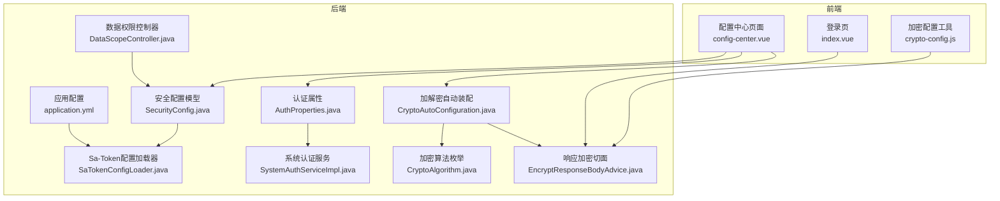
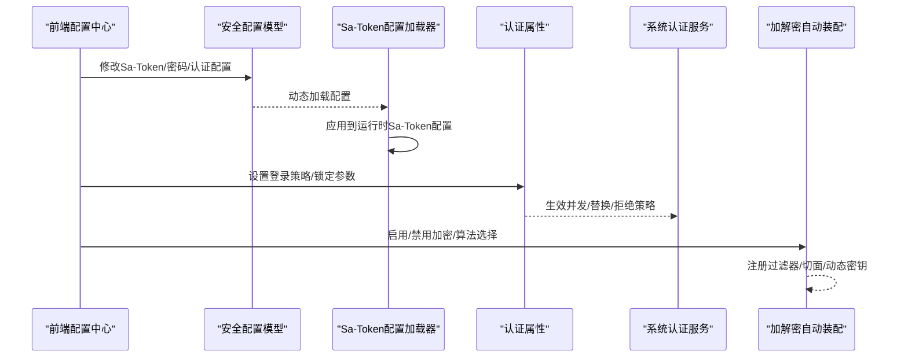
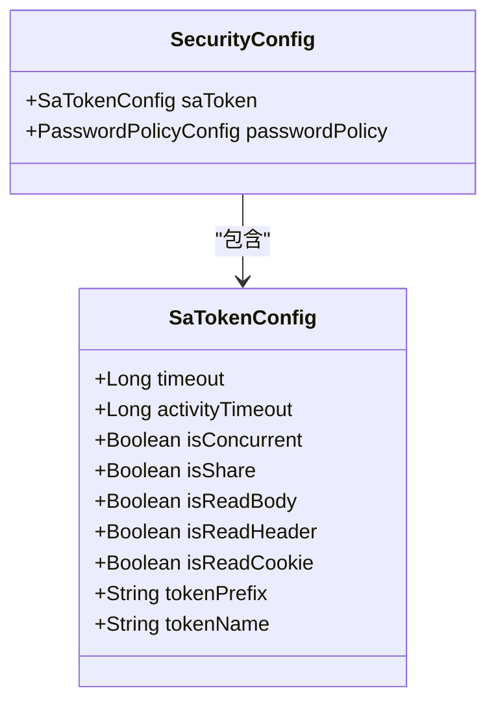
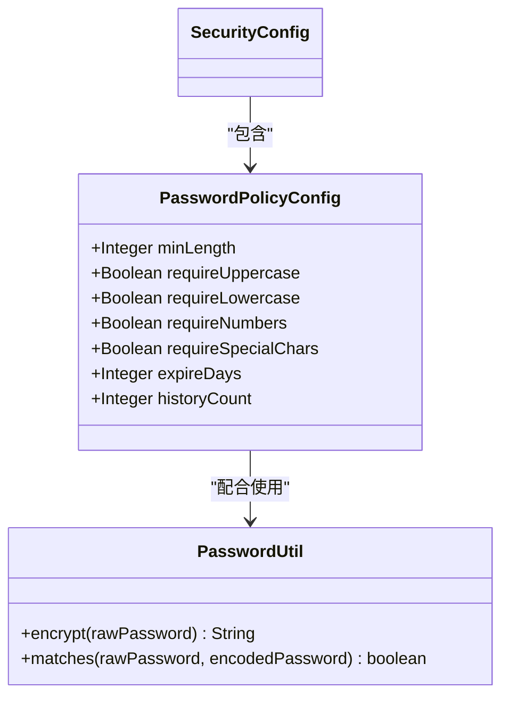
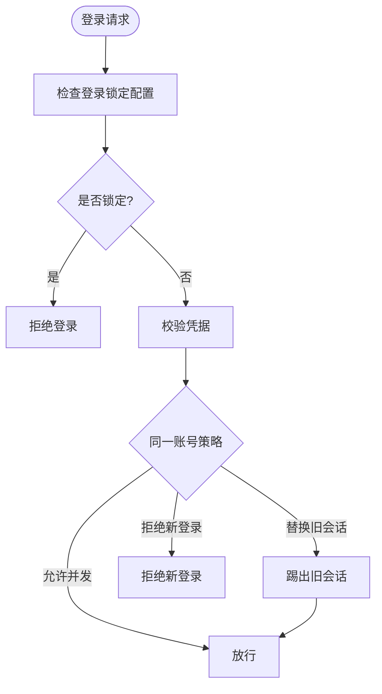
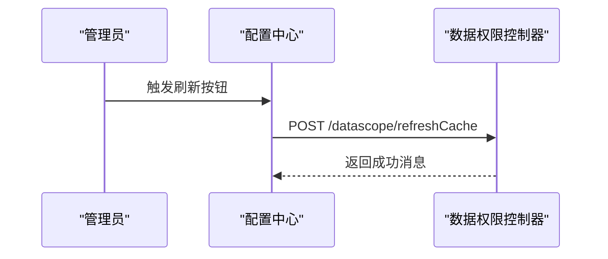
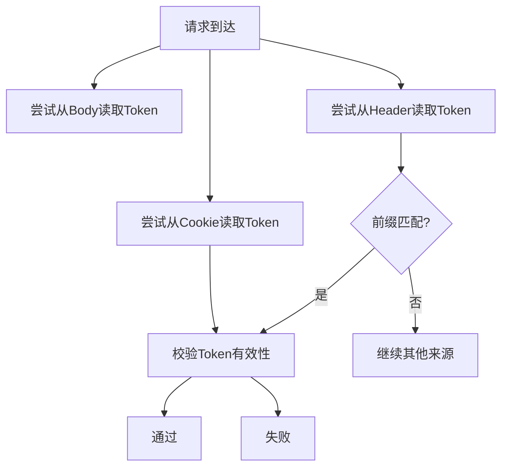
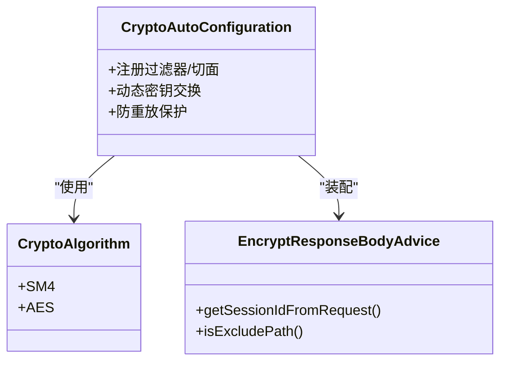
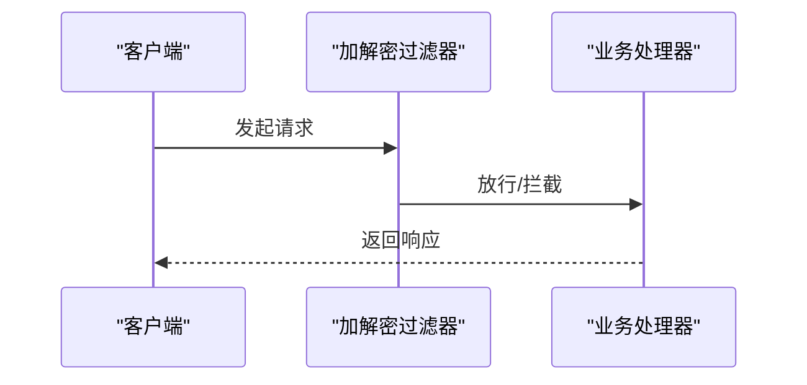
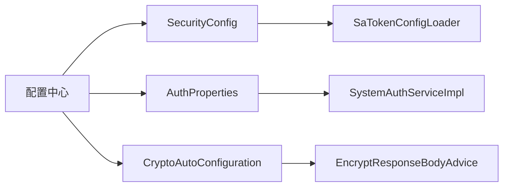

# 安全配置

<cite>
**本文引用的文件**
- [SecurityConfig.java](file://forge/forge-framework/forge-starter-parent/forge-starter-config/src/main/java/com/mdframe/forge/starter/config/config/SecurityConfig.java)
- [SaTokenConfigLoader.java](file://forge/forge-framework/forge-starter-parent/forge-starter-auth/src/main/java/com/mdframe/forge/starter/auth/config/SaTokenConfigLoader.java)
- [AuthProperties.java](file://forge/forge-framework/forge-starter-parent/forge-starter-core/src/main/java/com/mdframe/forge/starter/core/context/AuthProperties.java)
- [CryptoAlgorithm.java](file://forge/forge-framework/forge-starter-parent/forge-starter-crypto/src/main/java/com/mdframe/forge/starter/crypto/crypto/CryptoAlgorithm.java)
- [PasswordUtil.java](file://forge/forge-framework/forge-starter-parent/forge-starter-auth/src/main/java/com/mdframe/forge/starter/auth/util/PasswordUtil.java)
- [CryptoAutoConfiguration.java](file://forge/forge-framework/forge-starter-parent/forge-starter-crypto/src/main/java/com/mdframe/forge/starter/crypto/config/CryptoAutoConfiguration.java)
- [EncryptResponseBodyAdvice.java](file://forge/forge-framework/forge-starter-parent/forge-starter-crypto/src/main/java/com/mdframe/forge/starter/crypto/advice/EncryptResponseBodyAdvice.java)
- [application.yml](file://forge/forge-admin/src/main/resources/application.yml)
- [config-center.vue](file://forge-admin-ui/src/views/system/config-center.vue)
- [index.vue](file://forge-admin-ui/src/views/login/index.vue)
- [crypto-config.js](file://forge-admin-ui/src/utils/crypto/crypto-config.js)
- [DataScopeController.java](file://forge/forge-framework/forge-starter-parent/forge-starter-datascope/src/main/java/com/mdframe/forge/starter/datascope/controller/DataScopeController.java)
- [SystemAuthServiceImpl.java](file://forge/forge-framework/forge-plugin-parent/forge-plugin-system/src/main/java/com/mdframe/forge/plugin/system/service/impl/SystemAuthServiceImpl.java)
</cite>

## 目录
1. [简介](#简介)
2. [项目结构](#项目结构)
3. [核心组件](#核心组件)
4. [架构总览](#架构总览)
5. [详细组件分析](#详细组件分析)
6. [依赖关系分析](#依赖关系分析)
7. [性能考量](#性能考量)
8. [故障排查指南](#故障排查指南)
9. [结论](#结论)
10. [附录](#附录)

## 简介
本文件系统性梳理Forge框架的安全配置机制，围绕以下主题展开：
- Sa-Token认证配置：Redis存储、Token有效期、登录策略、读取来源与前缀等
- 密码策略配置：最小长度、字符集要求、过期与历史记录
- 权限控制配置：接口权限、数据权限、菜单权限
- 加解密配置：算法选择、动态密钥、防重放、会话密钥过期
- 会话与登录策略：并发登录、替换旧会话、拒绝新登录
- 跨域与CORS：前端白名单与后端过滤器集成
- 调试方法与常见问题排查

## 项目结构
Forge框架将安全能力拆分为多个子模块，前端通过配置中心进行可视化管理，后端通过自动装配与配置类实现动态加载与生效。

**图表来源**
- [config-center.vue](file://forge-admin-ui/src/views/system/config-center.vue#L628-L689)
- [index.vue](file://forge-admin-ui/src/views/login/index.vue#L274-L308)
- [crypto-config.js](file://forge-admin-ui/src/utils/crypto/crypto-config.js#L40-L78)
- [application.yml](file://forge/forge-admin/src/main/resources/application.yml#L86-L100)
- [SecurityConfig.java](file://forge/forge-framework/forge-starter-parent/forge-starter-config/src/main/java/com/mdframe/forge/starter/config/config/SecurityConfig.java#L1-L112)
- [SaTokenConfigLoader.java](file://forge/forge-framework/forge-starter-parent/forge-starter-auth/src/main/java/com/mdframe/forge/starter/auth/config/SaTokenConfigLoader.java#L24-L76)
- [AuthProperties.java](file://forge/forge-framework/forge-starter-parent/forge-starter-core/src/main/java/com/mdframe/forge/starter/core/context/AuthProperties.java#L1-L68)
- [CryptoAutoConfiguration.java](file://forge/forge-framework/forge-starter-parent/forge-starter-crypto/src/main/java/com/mdframe/forge/starter/crypto/config/CryptoAutoConfiguration.java#L1-L27)
- [CryptoAlgorithm.java](file://forge/forge-framework/forge-starter-parent/forge-starter-crypto/src/main/java/com/mdframe/forge/starter/crypto/crypto/CryptoAlgorithm.java#L1-L33)
- [EncryptResponseBodyAdvice.java](file://forge/forge-framework/forge-starter-parent/forge-starter-crypto/src/main/java/com/mdframe/forge/starter/crypto/advice/EncryptResponseBodyAdvice.java#L166-L197)
- [SystemAuthServiceImpl.java](file://forge/forge-framework/forge-plugin-parent/forge-plugin-system/src/main/java/com/mdframe/forge/plugin/system/service/impl/SystemAuthServiceImpl.java#L100-L138)
- [DataScopeController.java](file://forge/forge-framework/forge-starter-parent/forge-starter-datascope/src/main/java/com/mdframe/forge/starter/datascope/controller/DataScopeController.java#L1-L30)

**章节来源**
- [config-center.vue](file://forge-admin-ui/src/views/system/config-center.vue#L628-L689)
- [application.yml](file://forge/forge-admin/src/main/resources/application.yml#L86-L100)

## 核心组件
- 安全配置模型：定义Sa-Token与密码策略的可配置项，支持从数据库动态加载
- Sa-Token配置加载器：在启动阶段或配置刷新事件时，将配置应用到运行时的Sa-Token配置
- 认证属性：统一管理API权限开关、登录锁定、并发策略等
- 加解密自动装配：根据配置启用加解密、动态密钥交换、防重放
- 加密算法枚举：支持SM4与AES两种对称加密算法
- 响应加密切面：基于请求上下文识别会话ID，按路径规则决定是否加密
- 登录策略服务：根据策略执行并发、替换旧会话或拒绝新登录
- 数据权限控制器：提供刷新数据权限缓存的接口

**章节来源**
- [SecurityConfig.java](file://forge/forge-framework/forge-starter-parent/forge-starter-config/src/main/java/com/mdframe/forge/starter/config/config/SecurityConfig.java#L1-L112)
- [SaTokenConfigLoader.java](file://forge/forge-framework/forge-starter-parent/forge-starter-auth/src/main/java/com/mdframe/forge/starter/auth/config/SaTokenConfigLoader.java#L24-L76)
- [AuthProperties.java](file://forge/forge-framework/forge-starter-parent/forge-starter-core/src/main/java/com/mdframe/forge/starter/core/context/AuthProperties.java#L1-L68)
- [CryptoAutoConfiguration.java](file://forge/forge-framework/forge-starter-parent/forge-starter-crypto/src/main/java/com/mdframe/forge/starter/crypto/config/CryptoAutoConfiguration.java#L1-L27)
- [CryptoAlgorithm.java](file://forge/forge-framework/forge-starter-parent/forge-starter-crypto/src/main/java/com/mdframe/forge/starter/crypto/crypto/CryptoAlgorithm.java#L1-L33)
- [EncryptResponseBodyAdvice.java](file://forge/forge-framework/forge-starter-parent/forge-starter-crypto/src/main/java/com/mdframe/forge/starter/crypto/advice/EncryptResponseBodyAdvice.java#L166-L197)
- [SystemAuthServiceImpl.java](file://forge/forge-framework/forge-plugin-parent/forge-plugin-system/src/main/java/com/mdframe/forge/plugin/system/service/impl/SystemAuthServiceImpl.java#L100-L138)
- [DataScopeController.java](file://forge/forge-framework/forge-starter-parent/forge-starter-datascope/src/main/java/com/mdframe/forge/starter/datascope/controller/DataScopeController.java#L1-L30)

## 架构总览
下图展示从前端配置到后端生效的关键流程，包括Sa-Token配置加载、登录策略执行与加解密处理。

**图表来源**
- [config-center.vue](file://forge-admin-ui/src/views/system/config-center.vue#L628-L689)
- [SecurityConfig.java](file://forge/forge-framework/forge-starter-parent/forge-starter-config/src/main/java/com/mdframe/forge/starter/config/config/SecurityConfig.java#L1-L112)
- [SaTokenConfigLoader.java](file://forge/forge-framework/forge-starter-parent/forge-starter-auth/src/main/java/com/mdframe/forge/starter/auth/config/SaTokenConfigLoader.java#L24-L76)
- [AuthProperties.java](file://forge/forge-framework/forge-starter-parent/forge-starter-core/src/main/java/com/mdframe/forge/starter/core/context/AuthProperties.java#L1-L68)
- [SystemAuthServiceImpl.java](file://forge/forge-framework/forge-plugin-parent/forge-plugin-system/src/main/java/com/mdframe/forge/plugin/system/service/impl/SystemAuthServiceImpl.java#L100-L138)
- [CryptoAutoConfiguration.java](file://forge/forge-framework/forge-starter-parent/forge-starter-crypto/src/main/java/com/mdframe/forge/starter/crypto/config/CryptoAutoConfiguration.java#L1-L27)

## 详细组件分析

### Sa-Token认证配置
- 存储与Redis集成：通过独立Redis配置启用，便于分布式共享会话
- Token有效期与活跃超时：支持全局超时与二次无操作后的过期时间
- 并发与共享：可配置是否允许并发登录及是否共用Token
- 请求读取来源：支持从Body/Header/Cookie读取Token
- Token前缀与名称：可自定义请求头与前缀，适配不同客户端

**图表来源**
- [SecurityConfig.java](file://forge/forge-framework/forge-starter-parent/forge-starter-config/src/main/java/com/mdframe/forge/starter/config/config/SecurityConfig.java#L24-L70)
- [application.yml](file://forge/forge-admin/src/main/resources/application.yml#L86-L100)

**章节来源**
- [SecurityConfig.java](file://forge/forge-framework/forge-starter-parent/forge-starter-config/src/main/java/com/mdframe/forge/starter/config/config/SecurityConfig.java#L24-L70)
- [SaTokenConfigLoader.java](file://forge/forge-framework/forge-starter-parent/forge-starter-auth/src/main/java/com/mdframe/forge/starter/auth/config/SaTokenConfigLoader.java#L38-L76)
- [application.yml](file://forge/forge-admin/src/main/resources/application.yml#L86-L100)

### 密码策略配置
- 字符复杂度：最小长度、大小写、数字、特殊字符可选
- 生命周期：密码过期天数与历史记录条数
- 加密算法：采用BCrypt进行不可逆加密与校验

**图表来源**
- [SecurityConfig.java](file://forge/forge-framework/forge-starter-parent/forge-starter-config/src/main/java/com/mdframe/forge/starter/config/config/SecurityConfig.java#L75-L112)
- [PasswordUtil.java](file://forge/forge-framework/forge-starter-parent/forge-starter-auth/src/main/java/com/mdframe/forge/starter/auth/util/PasswordUtil.java#L1-L30)

**章节来源**
- [SecurityConfig.java](file://forge/forge-framework/forge-starter-parent/forge-starter-config/src/main/java/com/mdframe/forge/starter/config/config/SecurityConfig.java#L75-L112)
- [PasswordUtil.java](file://forge/forge-framework/forge-starter-parent/forge-starter-auth/src/main/java/com/mdframe/forge/starter/auth/util/PasswordUtil.java#L1-L30)

### 权限控制配置
- 接口权限：通过认证属性控制是否启用API权限校验与排除路径
- 登录锁定：最大失败次数、锁定时长、失败记录保留时长
- 登录策略：允许并发、替换旧会话、拒绝新登录三种策略
- 在线用户管理：可选开启，便于审计与强制下线

**图表来源**
- [AuthProperties.java](file://forge/forge-framework/forge-starter-parent/forge-starter-core/src/main/java/com/mdframe/forge/starter/core/context/AuthProperties.java#L16-L68)
- [SystemAuthServiceImpl.java](file://forge/forge-framework/forge-plugin-parent/forge-plugin-system/src/main/java/com/mdframe/forge/plugin/system/service/impl/SystemAuthServiceImpl.java#L100-L138)

**章节来源**
- [AuthProperties.java](file://forge/forge-framework/forge-starter-parent/forge-starter-core/src/main/java/com/mdframe/forge/starter/core/context/AuthProperties.java#L16-L68)
- [SystemAuthServiceImpl.java](file://forge/forge-framework/forge-plugin-parent/forge-plugin-system/src/main/java/com/mdframe/forge/plugin/system/service/impl/SystemAuthServiceImpl.java#L100-L138)

### 数据权限配置
- 控制器：提供刷新数据权限缓存的接口，确保权限变更即时生效
- 配置开关：通过条件注解控制API是否启用

**图表来源**
- [DataScopeController.java](file://forge/forge-framework/forge-starter-parent/forge-starter-datascope/src/main/java/com/mdframe/forge/starter/datascope/controller/DataScopeController.java#L1-L30)

**章节来源**
- [DataScopeController.java](file://forge/forge-framework/forge-starter-parent/forge-starter-datascope/src/main/java/com/mdframe/forge/starter/datascope/controller/DataScopeController.java#L1-L30)

### JWT与会话管理（基于Sa-Token）
- Token读取来源：Body/Header/Cookie三通道可配置
- 前缀与名称：可自定义请求头字段与前缀
- Redis存储：独立Redis实例，便于横向扩展与共享
- 活跃超时：支持二次无操作后的过期时间

**图表来源**
- [SecurityConfig.java](file://forge/forge-framework/forge-starter-parent/forge-starter-config/src/main/java/com/mdframe/forge/starter/config/config/SecurityConfig.java#L47-L69)
- [SaTokenConfigLoader.java](file://forge/forge-framework/forge-starter-parent/forge-starter-auth/src/main/java/com/mdframe/forge/starter/auth/config/SaTokenConfigLoader.java#L52-L60)

**章节来源**
- [SecurityConfig.java](file://forge/forge-framework/forge-starter-parent/forge-starter-config/src/main/java/com/mdframe/forge/starter/config/config/SecurityConfig.java#L47-L69)
- [SaTokenConfigLoader.java](file://forge/forge-framework/forge-starter-parent/forge-starter-auth/src/main/java/com/mdframe/forge/starter/auth/config/SaTokenConfigLoader.java#L52-L60)
- [application.yml](file://forge/forge-admin/src/main/resources/application.yml#L86-L100)

### 加解密配置与防重放
- 算法选择：SM4与AES两种对称加密算法
- 动态密钥：RSA公私钥交换，会话密钥过期时间可配置
- 路径规则：支持包含/排除路径，灵活控制加解密范围
- 防重放：可启用时间窗口内的请求去重

**图表来源**
- [CryptoAutoConfiguration.java](file://forge/forge-framework/forge-starter-parent/forge-starter-crypto/src/main/java/com/mdframe/forge/starter/crypto/config/CryptoAutoConfiguration.java#L1-L27)
- [CryptoAlgorithm.java](file://forge/forge-framework/forge-starter-parent/forge-starter-crypto/src/main/java/com/mdframe/forge/starter/crypto/crypto/CryptoAlgorithm.java#L1-L33)
- [EncryptResponseBodyAdvice.java](file://forge/forge-framework/forge-starter-parent/forge-starter-crypto/src/main/java/com/mdframe/forge/starter/crypto/advice/EncryptResponseBodyAdvice.java#L166-L197)

**章节来源**
- [CryptoAutoConfiguration.java](file://forge/forge-framework/forge-starter-parent/forge-starter-crypto/src/main/java/com/mdframe/forge/starter/crypto/config/CryptoAutoConfiguration.java#L1-L27)
- [CryptoAlgorithm.java](file://forge/forge-framework/forge-starter-parent/forge-starter-crypto/src/main/java/com/mdframe/forge/starter/crypto/crypto/CryptoAlgorithm.java#L1-L33)
- [EncryptResponseBodyAdvice.java](file://forge/forge-framework/forge-starter-parent/forge-starter-crypto/src/main/java/com/mdframe/forge/starter/crypto/advice/EncryptResponseBodyAdvice.java#L166-L197)
- [crypto-config.js](file://forge-admin-ui/src/utils/crypto/crypto-config.js#L40-L78)

### 跨域与CORS设置
- 前端白名单：通过路由守卫与权限守卫控制访问
- 后端过滤器：结合加解密自动装配注册过滤器，统一处理跨域与安全拦截

**图表来源**
- [CryptoAutoConfiguration.java](file://forge/forge-framework/forge-starter-parent/forge-starter-crypto/src/main/java/com/mdframe/forge/starter/crypto/config/CryptoAutoConfiguration.java#L1-L27)

**章节来源**
- [CryptoAutoConfiguration.java](file://forge/forge-framework/forge-starter-parent/forge-starter-crypto/src/main/java/com/mdframe/forge/starter/crypto/config/CryptoAutoConfiguration.java#L1-L27)

## 依赖关系分析
- 配置中心驱动：前端配置中心将Sa-Token、密码策略、认证属性与加解密配置下发至后端
- 自动装配生效：加解密自动装配根据配置注册组件；Sa-Token配置加载器在启动或刷新事件时应用配置
- 登录策略耦合：认证属性与系统认证服务紧密耦合，策略直接影响会话生命周期

**图表来源**
- [config-center.vue](file://forge-admin-ui/src/views/system/config-center.vue#L628-L689)
- [SecurityConfig.java](file://forge/forge-framework/forge-starter-parent/forge-starter-config/src/main/java/com/mdframe/forge/starter/config/config/SecurityConfig.java#L1-L112)
- [SaTokenConfigLoader.java](file://forge/forge-framework/forge-starter-parent/forge-starter-auth/src/main/java/com/mdframe/forge/starter/auth/config/SaTokenConfigLoader.java#L24-L76)
- [AuthProperties.java](file://forge/forge-framework/forge-starter-parent/forge-starter-core/src/main/java/com/mdframe/forge/starter/core/context/AuthProperties.java#L1-L68)
- [SystemAuthServiceImpl.java](file://forge/forge-framework/forge-plugin-parent/forge-plugin-system/src/main/java/com/mdframe/forge/plugin/system/service/impl/SystemAuthServiceImpl.java#L100-L138)
- [CryptoAutoConfiguration.java](file://forge/forge-framework/forge-starter-parent/forge-starter-crypto/src/main/java/com/mdframe/forge/starter/crypto/config/CryptoAutoConfiguration.java#L1-L27)
- [EncryptResponseBodyAdvice.java](file://forge/forge-framework/forge-starter-parent/forge-starter-crypto/src/main/java/com/mdframe/forge/starter/crypto/advice/EncryptResponseBodyAdvice.java#L166-L197)

**章节来源**
- [config-center.vue](file://forge-admin-ui/src/views/system/config-center.vue#L628-L689)
- [SaTokenConfigLoader.java](file://forge/forge-framework/forge-starter-parent/forge-starter-auth/src/main/java/com/mdframe/forge/starter/auth/config/SaTokenConfigLoader.java#L24-L76)
- [SystemAuthServiceImpl.java](file://forge/forge-framework/forge-plugin-parent/forge-plugin-system/src/main/java/com/mdframe/forge/plugin/system/service/impl/SystemAuthServiceImpl.java#L100-L138)
- [CryptoAutoConfiguration.java](file://forge/forge-framework/forge-starter-parent/forge-starter-crypto/src/main/java/com/mdframe/forge/starter/crypto/config/CryptoAutoConfiguration.java#L1-L27)

## 性能考量
- Sa-Token超时与活跃超时：合理设置可降低无效会话占用，建议结合业务场景调优
- Redis存储：独立Redis实例可提升会话读写性能，注意连接池与超时配置
- 加解密开销：对称加密成本较低，但频繁加解密仍会带来CPU压力，建议仅对敏感接口启用
- 并发登录策略：允许并发会增加会话数量，需评估内存与Redis压力

[本节为通用指导，无需列出具体文件来源]

## 故障排查指南
- Sa-Token配置未生效
  - 检查配置中心是否正确下发；确认加载器是否在启动或刷新事件中执行
  - 核对Redis连接参数与网络连通性
  - 参考：[SaTokenConfigLoader.java](file://forge/forge-framework/forge-starter-parent/forge-starter-auth/src/main/java/com/mdframe/forge/starter/auth/config/SaTokenConfigLoader.java#L38-L76)，[application.yml](file://forge/forge-admin/src/main/resources/application.yml#L86-L100)
- 登录失败被锁定
  - 检查认证属性中的最大失败次数、锁定时长与失败记录保留时长
  - 参考：[AuthProperties.java](file://forge/forge-framework/forge-starter-parent/forge-starter-core/src/main/java/com/mdframe/forge/starter/core/context/AuthProperties.java#L30-L53)
- 同一账号登录策略异常
  - 确认策略配置是否为允许并发/替换旧会话/拒绝新登录之一
  - 参考：[SystemAuthServiceImpl.java](file://forge/forge-framework/forge-plugin-parent/forge-plugin-system/src/main/java/com/mdframe/forge/plugin/system/service/impl/SystemAuthServiceImpl.java#L100-L138)
- 加解密不生效或报错
  - 检查算法选择与密钥配置；确认路径规则是否命中排除/包含列表
  - 参考：[CryptoAlgorithm.java](file://forge/forge-framework/forge-starter-parent/forge-starter-crypto/src/main/java/com/mdframe/forge/starter/crypto/crypto/CryptoAlgorithm.java#L1-L33)，[crypto-config.js](file://forge-admin-ui/src/utils/crypto/crypto-config.js#L40-L78)
- 响应未加密
  - 检查响应加密切面对会话ID的识别逻辑与排除路径
  - 参考：[EncryptResponseBodyAdvice.java](file://forge/forge-framework/forge-starter-parent/forge-starter-crypto/src/main/java/com/mdframe/forge/starter/crypto/advice/EncryptResponseBodyAdvice.java#L166-L197)

**章节来源**
- [SaTokenConfigLoader.java](file://forge/forge-framework/forge-starter-parent/forge-starter-auth/src/main/java/com/mdframe/forge/starter/auth/config/SaTokenConfigLoader.java#L38-L76)
- [application.yml](file://forge/forge-admin/src/main/resources/application.yml#L86-L100)
- [AuthProperties.java](file://forge/forge-framework/forge-starter-parent/forge-starter-core/src/main/java/com/mdframe/forge/starter/core/context/AuthProperties.java#L30-L53)
- [SystemAuthServiceImpl.java](file://forge/forge-framework/forge-plugin-parent/forge-plugin-system/src/main/java/com/mdframe/forge/plugin/system/service/impl/SystemAuthServiceImpl.java#L100-L138)
- [CryptoAlgorithm.java](file://forge/forge-framework/forge-starter-parent/forge-starter-crypto/src/main/java/com/mdframe/forge/starter/crypto/crypto/CryptoAlgorithm.java#L1-L33)
- [crypto-config.js](file://forge-admin-ui/src/utils/crypto/crypto-config.js#L40-L78)
- [EncryptResponseBodyAdvice.java](file://forge/forge-framework/forge-starter-parent/forge-starter-crypto/src/main/java/com/mdframe/forge/starter/crypto/advice/EncryptResponseBodyAdvice.java#L166-L197)

## 结论
Forge框架通过“配置中心+自动装配+动态加载”的方式，实现了安全配置的可视化与可热更新。Sa-Token提供完善的会话管理能力，认证属性与登录策略保障了多样的登录行为控制，加解密模块则提供了灵活的加密与防重放方案。建议在生产环境中结合业务特性，合理设置超时、并发策略与加密范围，并持续监控会话与加解密性能。

[本节为总结性内容，无需列出具体文件来源]

## 附录
- 最佳实践清单
  - 密码策略：最小长度≥8，启用大小写与数字；按需启用特殊字符；定期轮换与历史记录限制
  - 会话安全：合理设置超时与活跃超时；启用Redis存储；避免在Cookie中持久化敏感Token
  - 登录策略：默认使用“替换旧会话”以保证安全性；高并发场景可评估“允许并发”
  - 加解密：仅对敏感接口启用；选择合适算法；配置动态密钥与防重放
  - 跨域与CORS：前后端协同，明确白名单与排除路径，避免过度宽松

[本节为通用指导，无需列出具体文件来源]