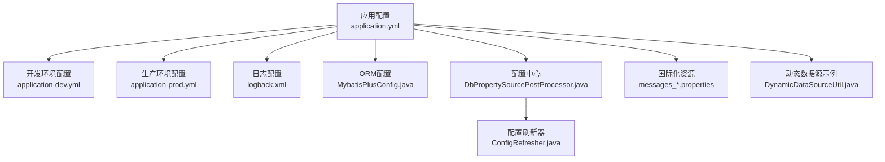
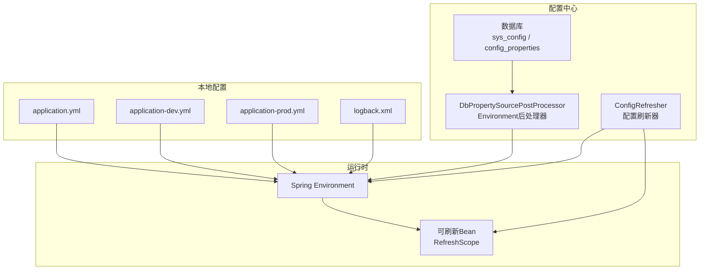
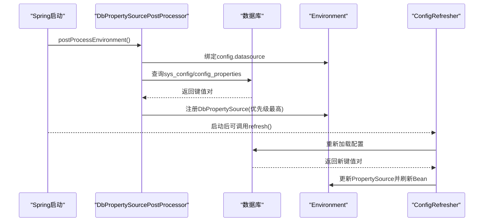
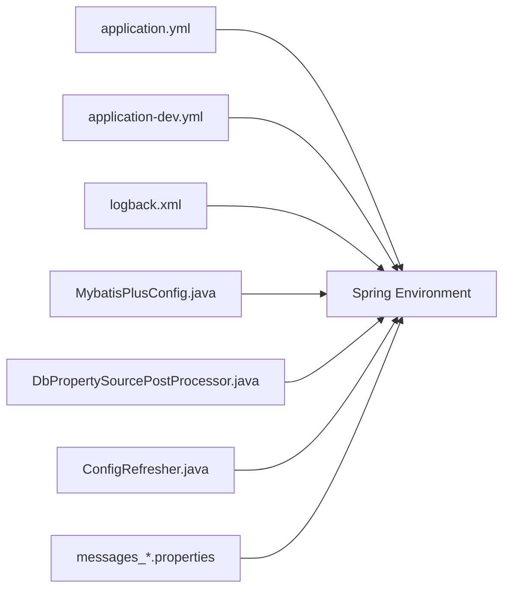

# 系统配置

<cite>
**本文引用的文件**
- [application.yml](file://forge/forge-admin/src/main/resources/application.yml)
- [application-dev.yml](file://forge/forge-admin/src/main/resources/application-dev.yml)
- [application-prod.yml](file://forge/forge-admin/src/main/resources/application-prod.yml)
- [logback.xml](file://forge/forge-admin/src/main/resources/logback.xml)
- [MybatisPlusConfig.java](file://forge/forge-framework/forge-starter-parent/forge-starter-orm/src/main/java/com/mdframe/forge/starter/orm/config/MybatisPlusConfig.java)
- [DbPropertySourcePostProcessor.java](file://forge/forge-framework/forge-starter-parent/forge-starter-config/src/main/java/com/mdframe/forge/starter/property/DbPropertySourcePostProcessor.java)
- [ConfigRefresher.java](file://forge/forge-framework/forge-starter-parent/forge-starter-config/src/main/java/com/mdframe/forge/starter/property/refresh/ConfigRefresher.java)
- [messages_zh_CN.properties](file://forge/forge-admin/src/main/resources/i18n/messages_zh_CN.properties)
- [messages_en_US.properties](file://forge/forge-admin/src/main/resources/i18n/messages_en_US.properties)
- [DynamicDataSourceUtil.java](file://forge/forge-framework/forge-plugin-parent/forge-plugin-generator/src/main/java/com/mdframe/forge/plugin/generator/util/DynamicDataSourceUtil.java)
</cite>

## 目录
1. [简介](#简介)
2. [项目结构](#项目结构)
3. [核心组件](#核心组件)
4. [架构总览](#架构总览)
5. [详细组件分析](#详细组件分析)
6. [依赖关系分析](#依赖关系分析)
7. [性能考量](#性能考量)
8. [故障排查指南](#故障排查指南)
9. [结论](#结论)
10. [附录](#附录)

## 简介
本文件面向Forge框架的系统配置，聚焦于核心配置项与运行机制，覆盖服务器配置（端口、线程池、缓冲区）、日志配置（级别、格式、落盘策略）、Spring配置（国际化、文件上传、静态资源）、MyBatis Plus配置（Mapper扫描、XML位置、驼峰映射）、数据库连接配置（HikariCP、动态数据源），并提供开发/测试/生产三类环境的配置差异说明、作用机制、默认值与可选范围、优化建议与常见问题解决方案。

## 项目结构
Forge系统配置主要分布在以下位置：
- 服务端配置与通用框架配置：application.yml 及其环境特定文件 application-dev.yml、application-prod.yml
- 日志配置：logback.xml
- ORM配置：MyBatis Plus自动装配与配置类
- 配置中心与热刷新：数据库驱动的配置源与刷新器
- 国际化资源：i18n/messages_*.properties
- 动态数据源示例：生成器插件中的动态数据源工具类

图表来源
- [application.yml](file://forge/forge-admin/src/main/resources/application.yml#L1-L100)
- [application-dev.yml](file://forge/forge-admin/src/main/resources/application-dev.yml#L1-L70)
- [application-prod.yml](file://forge/forge-admin/src/main/resources/application-prod.yml#L1-L1)
- [logback.xml](file://forge/forge-admin/src/main/resources/logback.xml#L1-L49)
- [MybatisPlusConfig.java](file://forge/forge-framework/forge-starter-parent/forge-starter-orm/src/main/java/com/mdframe/forge/starter/orm/config/MybatisPlusConfig.java#L1-L30)
- [DbPropertySourcePostProcessor.java](file://forge/forge-framework/forge-starter-parent/forge-starter-config/src/main/java/com/mdframe/forge/starter/property/DbPropertySourcePostProcessor.java#L1-L131)
- [ConfigRefresher.java](file://forge/forge-framework/forge-starter-parent/forge-starter-config/src/main/java/com/mdframe/forge/starter/property/refresh/ConfigRefresher.java#L1-L204)
- [messages_zh_CN.properties](file://forge/forge-admin/src/main/resources/i18n/messages_zh_CN.properties#L1-L1)
- [messages_en_US.properties](file://forge/forge-admin/src/main/resources/i18n/messages_en_US.properties#L1-L1)
- [DynamicDataSourceUtil.java](file://forge/forge-framework/forge-plugin-parent/forge-plugin-generator/src/main/java/com/mdframe/forge/plugin/generator/util/DynamicDataSourceUtil.java#L1-L113)

章节来源
- [application.yml](file://forge/forge-admin/src/main/resources/application.yml#L1-L100)
- [application-dev.yml](file://forge/forge-admin/src/main/resources/application-dev.yml#L1-L70)
- [application-prod.yml](file://forge/forge-admin/src/main/resources/application-prod.yml#L1-L1)
- [logback.xml](file://forge/forge-admin/src/main/resources/logback.xml#L1-L49)
- [MybatisPlusConfig.java](file://forge/forge-framework/forge-starter-parent/forge-starter-orm/src/main/java/com/mdframe/forge/starter/orm/config/MybatisPlusConfig.java#L1-L30)
- [DbPropertySourcePostProcessor.java](file://forge/forge-framework/forge-starter-parent/forge-starter-config/src/main/java/com/mdframe/forge/starter/property/DbPropertySourcePostProcessor.java#L1-L131)
- [ConfigRefresher.java](file://forge/forge-framework/forge-starter-parent/forge-starter-config/src/main/java/com/mdframe/forge/starter/property/refresh/ConfigRefresher.java#L1-L204)
- [messages_zh_CN.properties](file://forge/forge-admin/src/main/resources/i18n/messages_zh_CN.properties#L1-L1)
- [messages_en_US.properties](file://forge/forge-admin/src/main/resources/i18n/messages_en_US.properties#L1-L1)
- [DynamicDataSourceUtil.java](file://forge/forge-framework/forge-plugin-parent/forge-plugin-generator/src/main/java/com/mdframe/forge/plugin/generator/util/DynamicDataSourceUtil.java#L1-L113)

## 核心组件
- 服务器配置（Undertow）
  - 端口：默认8080
  - 上下文路径：根路径
  - Undertow参数：POST最大大小、buffer大小、是否使用直接内存、IO线程数、worker线程数
- 日志配置（Logback）
  - 输出级别：按包名分级；根级别info；SQL调试日志可单独开启
  - 输出目标：控制台与滚动文件；日志路径与文件名模式
  - 输出格式：包含traceId等上下文信息
- Spring配置
  - 国际化：basename指向i18n/messages
  - 文件上传：单文件与总大小限制
  - 静态资源：静态路径模式
  - Jackson：日期格式、输出格式、未知属性处理
- MyBatis Plus配置
  - Mapper扫描包、XML位置、实体别名包
  - 驼峰映射、缓存启用、主键策略、默认执行器类型、日志实现
- 数据库连接配置（HikariCP）
  - 开发环境：主库数据源、连接池参数（最大池大小、最小空闲、超时、空闲/生命周期、保活）
  - Redis：地址、端口、数据库索引、密码、超时、Redisson配置
- 配置中心与热刷新
  - 通过Environment后处理器从数据库加载配置，支持sys_config与config_properties两套表
  - 支持中划线键到驼峰键的双向兼容
  - 提供刷新器以更新PropertySource并刷新作用域Bean
- 国际化资源
  - 中文与英文消息资源文件
- 动态数据源示例
  - 基于HikariCP的动态数据源创建、连接测试、池清理等

章节来源
- [application.yml](file://forge/forge-admin/src/main/resources/application.yml#L1-L100)
- [application-dev.yml](file://forge/forge-admin/src/main/resources/application-dev.yml#L1-L70)
- [logback.xml](file://forge/forge-admin/src/main/resources/logback.xml#L1-L49)
- [MybatisPlusConfig.java](file://forge/forge-framework/forge-starter-parent/forge-starter-orm/src/main/java/com/mdframe/forge/starter/orm/config/MybatisPlusConfig.java#L1-L30)
- [DbPropertySourcePostProcessor.java](file://forge/forge-framework/forge-starter-parent/forge-starter-config/src/main/java/com/mdframe/forge/starter/property/DbPropertySourcePostProcessor.java#L1-L131)
- [ConfigRefresher.java](file://forge/forge-framework/forge-starter-parent/forge-starter-config/src/main/java/com/mdframe/forge/starter/property/refresh/ConfigRefresher.java#L1-L204)
- [messages_zh_CN.properties](file://forge/forge-admin/src/main/resources/i18n/messages_zh_CN.properties#L1-L1)
- [messages_en_US.properties](file://forge/forge-admin/src/main/resources/i18n/messages_en_US.properties#L1-L1)
- [DynamicDataSourceUtil.java](file://forge/forge-framework/forge-plugin-parent/forge-plugin-generator/src/main/java/com/mdframe/forge/plugin/generator/util/DynamicDataSourceUtil.java#L1-L113)

## 架构总览
Forge系统配置由“本地配置文件 + 数据库配置源 + 环境后处理器 + 刷新器”构成，形成“本地优先、数据库兜底”的双层配置体系，并支持运行期热刷新。

图表来源
- [application.yml](file://forge/forge-admin/src/main/resources/application.yml#L1-L100)
- [application-dev.yml](file://forge/forge-admin/src/main/resources/application-dev.yml#L1-L70)
- [application-prod.yml](file://forge/forge-admin/src/main/resources/application-prod.yml#L1-L1)
- [logback.xml](file://forge/forge-admin/src/main/resources/logback.xml#L1-L49)
- [DbPropertySourcePostProcessor.java](file://forge/forge-framework/forge-starter-parent/forge-starter-config/src/main/java/com/mdframe/forge/starter/property/DbPropertySourcePostProcessor.java#L1-L131)
- [ConfigRefresher.java](file://forge/forge-framework/forge-starter-parent/forge-starter-config/src/main/java/com/mdframe/forge/starter/property/refresh/ConfigRefresher.java#L1-L204)

## 详细组件分析

### 服务器配置（端口、线程池、缓冲区）
- 端口与上下文路径：默认端口8080，上下文路径“/”
- Undertow参数：
  - POST最大大小：-1表示无限制
  - buffer大小：字节单位，越小空间利用越充分
  - 直接内存开关：启用后减少用户态拷贝
  - IO线程数：默认每个CPU核心一个线程
  - worker线程数：阻塞任务线程池大小，依据系统负载调整
- 适用场景：高并发短连接、低延迟响应；可根据CPU核数与QPS调优IO与worker线程比例

章节来源
- [application.yml](file://forge/forge-admin/src/main/resources/application.yml#L1-L22)

### 日志配置（级别、格式、落盘）
- 级别控制：
  - 包级别：com.mdframe.forge/info；org.springframework/info；特定Mapper包debug
  - 根级别：info
- 输出目标：
  - 控制台：实时调试
  - 滚动文件：按日切割，保留30天
- 输出格式：包含traceId、方法、行号等上下文信息
- 落盘路径：./var/logs

章节来源
- [application.yml](file://forge/forge-admin/src/main/resources/application.yml#L23-L29)
- [logback.xml](file://forge/forge-admin/src/main/resources/logback.xml#L1-L49)

### Spring配置（国际化、文件上传、静态资源）
- 国际化：basename为i18n/messages，支持多语言资源
- 文件上传：单文件大小与总大小限制
- 静态资源：通过静态路径模式避免所有请求匹配静态资源
- Jackson：日期格式、缩进输出、空对象序列化、未知属性处理

章节来源
- [application.yml](file://forge/forge-admin/src/main/resources/application.yml#L31-L64)
- [messages_zh_CN.properties](file://forge/forge-admin/src/main/resources/i18n/messages_zh_CN.properties#L1-L1)
- [messages_en_US.properties](file://forge/forge-admin/src/main/resources/i18n/messages_en_US.properties#L1-L1)

### MyBatis Plus配置（Mapper扫描、XML位置、驼峰映射）
- Mapper扫描：基于配置项扫描多包
- XML位置：classpath*:mapper/**/*Mapper.xml
- 实体别名包：com.mdframe.forge.**.domain
- 配置细节：驼峰映射、缓存启用、主键策略、默认执行器类型、日志实现
- 自动装配：通过ORM启动器的自动配置导入MybatisPlusConfig

章节来源
- [application.yml](file://forge/forge-admin/src/main/resources/application.yml#L65-L80)
- [MybatisPlusConfig.java](file://forge/forge-framework/forge-starter-parent/forge-starter-orm/src/main/java/com/mdframe/forge/starter/orm/config/MybatisPlusConfig.java#L1-L30)

### 数据库连接配置（HikariCP、动态数据源）
- 开发环境数据源：
  - 类型：Hikari
  - 主库：master，含驱动、URL、用户名、密码
  - 连接池参数：最大池大小、最小空闲、超时、空闲/生命周期、保活
- Redis：地址、端口、数据库索引、密码、超时、Redisson配置
- 动态数据源示例：基于Hikari的动态数据源创建、连接测试、池清理

章节来源
- [application-dev.yml](file://forge/forge-admin/src/main/resources/application-dev.yml#L1-L70)
- [DynamicDataSourceUtil.java](file://forge/forge-framework/forge-plugin-parent/forge-plugin-generator/src/main/java/com/mdframe/forge/plugin/generator/util/DynamicDataSourceUtil.java#L1-L113)

### 配置中心与热刷新（数据库驱动配置）
- 配置源加载：
  - 通过Environment后处理器读取config.datasource配置
  - 优先从sys_config表加载（键/值、类型Y）
  - 降级到config_properties表（key/value、enabled=1）
  - 自动将中划线键转换为驼峰键，支持双向兼容
- 热刷新：
  - 刷新器对比新旧配置，更新PropertySource并刷新作用域Bean
  - 可发布配置变更事件（预留）

图表来源
- [DbPropertySourcePostProcessor.java](file://forge/forge-framework/forge-starter-parent/forge-starter-config/src/main/java/com/mdframe/forge/starter/property/DbPropertySourcePostProcessor.java#L1-L131)
- [ConfigRefresher.java](file://forge/forge-framework/forge-starter-parent/forge-starter-config/src/main/java/com/mdframe/forge/starter/property/refresh/ConfigRefresher.java#L1-L204)

章节来源
- [DbPropertySourcePostProcessor.java](file://forge/forge-framework/forge-starter-parent/forge-starter-config/src/main/java/com/mdframe/forge/starter/property/DbPropertySourcePostProcessor.java#L1-L131)
- [ConfigRefresher.java](file://forge/forge-framework/forge-starter-parent/forge-starter-config/src/main/java/com/mdframe/forge/starter/property/refresh/ConfigRefresher.java#L1-L204)

## 依赖关系分析
- 配置文件与运行时绑定：
  - application.yml作为基线，application-dev.yml在dev环境下生效
  - logback.xml与logging配置共同决定日志行为
  - MyBatis Plus配置通过自动配置类生效
- 配置中心依赖：
  - DbPropertySourcePostProcessor在环境初始化阶段注入自定义PropertySource
  - ConfigRefresher在运行期维护配置一致性
- 国际化与静态资源：
  - i18n资源文件与Spring MVC静态路径配置协同工作

图表来源
- [application.yml](file://forge/forge-admin/src/main/resources/application.yml#L1-L100)
- [application-dev.yml](file://forge/forge-admin/src/main/resources/application-dev.yml#L1-L70)
- [logback.xml](file://forge/forge-admin/src/main/resources/logback.xml#L1-L49)
- [MybatisPlusConfig.java](file://forge/forge-framework/forge-starter-parent/forge-starter-orm/src/main/java/com/mdframe/forge/starter/orm/config/MybatisPlusConfig.java#L1-L30)
- [DbPropertySourcePostProcessor.java](file://forge/forge-framework/forge-starter-parent/forge-starter-config/src/main/java/com/mdframe/forge/starter/property/DbPropertySourcePostProcessor.java#L1-L131)
- [ConfigRefresher.java](file://forge/forge-framework/forge-starter-parent/forge-starter-config/src/main/java/com/mdframe/forge/starter/property/refresh/ConfigRefresher.java#L1-L204)
- [messages_zh_CN.properties](file://forge/forge-admin/src/main/resources/i18n/messages_zh_CN.properties#L1-L1)
- [messages_en_US.properties](file://forge/forge-admin/src/main/resources/i18n/messages_en_US.properties#L1-L1)

章节来源
- [application.yml](file://forge/forge-admin/src/main/resources/application.yml#L1-L100)
- [application-dev.yml](file://forge/forge-admin/src/main/resources/application-dev.yml#L1-L70)
- [logback.xml](file://forge/forge-admin/src/main/resources/logback.xml#L1-L49)
- [MybatisPlusConfig.java](file://forge/forge-framework/forge-starter-parent/forge-starter-orm/src/main/java/com/mdframe/forge/starter/orm/config/MybatisPlusConfig.java#L1-L30)
- [DbPropertySourcePostProcessor.java](file://forge/forge-framework/forge-starter-parent/forge-starter-config/src/main/java/com/mdframe/forge/starter/property/DbPropertySourcePostProcessor.java#L1-L131)
- [ConfigRefresher.java](file://forge/forge-framework/forge-starter-parent/forge-starter-config/src/main/java/com/mdframe/forge/starter/property/refresh/ConfigRefresher.java#L1-L204)
- [messages_zh_CN.properties](file://forge/forge-admin/src/main/resources/i18n/messages_zh_CN.properties#L1-L1)
- [messages_en_US.properties](file://forge/forge-admin/src/main/resources/i18n/messages_en_US.properties#L1-L1)

## 性能考量
- 服务器线程池
  - IO线程数建议与CPU核心数匹配；worker线程数根据阻塞任务量动态调整
  - 合理设置buffer大小与direct-buffers以降低拷贝成本
- 连接池
  - HikariCP参数需结合QPS与事务时长调优；注意连接超时、空闲回收与生命周期
  - 批处理开关（rewriteBatchedStatements）可显著提升批量写入性能，但需评估数据库侧开销
- 日志
  - 生产环境建议降低SQL日志级别，仅在定位问题时临时开启
  - 控制台输出在高并发下可能成为瓶颈，建议以文件为主
- 配置中心
  - 热刷新应避免频繁触发；建议合并变更批次，减少刷新次数

## 故障排查指南
- 无法加载数据库配置
  - 检查config.datasource是否正确绑定，URL/用户名/密码是否完整
  - 确认数据库表sys_config或config_properties存在且数据有效
- 配置刷新无效
  - 确认DbPropertySource已注册且优先级最高
  - 检查刷新器是否正确获取旧配置并更新
- 日志不输出或格式异常
  - 检查logback.xml路径与编码
  - 确认日志级别与logger配置
- 国际化不生效
  - 检查messages basename与资源文件命名规范
- 动态数据源连接失败
  - 使用连接测试方法验证URL、账号、密码与驱动
  - 关注池大小与超时配置

章节来源
- [DbPropertySourcePostProcessor.java](file://forge/forge-framework/forge-starter-parent/forge-starter-config/src/main/java/com/mdframe/forge/starter/property/DbPropertySourcePostProcessor.java#L1-L131)
- [ConfigRefresher.java](file://forge/forge-framework/forge-starter-parent/forge-starter-config/src/main/java/com/mdframe/forge/starter/property/refresh/ConfigRefresher.java#L1-L204)
- [logback.xml](file://forge/forge-admin/src/main/resources/logback.xml#L1-L49)
- [messages_zh_CN.properties](file://forge/forge-admin/src/main/resources/i18n/messages_zh_CN.properties#L1-L1)
- [messages_en_US.properties](file://forge/forge-admin/src/main/resources/i18n/messages_en_US.properties#L1-L1)
- [DynamicDataSourceUtil.java](file://forge/forge-framework/forge-plugin-parent/forge-plugin-generator/src/main/java/com/mdframe/forge/plugin/generator/util/DynamicDataSourceUtil.java#L1-L113)

## 结论
Forge框架通过本地配置文件与数据库配置源相结合的方式，提供了灵活、可热刷新的系统配置能力。围绕服务器、日志、Spring、ORM、数据库连接等关键领域，既保证了默认可用性，又允许在不同环境进行精细化调优。建议在生产环境遵循“最小暴露面、可观测性优先、性能与稳定性平衡”的原则进行配置落地。

## 附录

### 不同环境配置要点
- 开发环境（application-dev.yml）
  - 数据源：主库master，Hikari连接池参数适中
  - Redis：本地地址与密码，便于联调
- 测试/生产环境（application-prod.yml）
  - 当前仓库未提供具体配置，建议：
    - 明确数据源集群与只读副本策略
    - 调整连接池参数以匹配压测结果
    - 强化日志级别与脱敏策略
    - 配置健康检查与监控指标

章节来源
- [application-dev.yml](file://forge/forge-admin/src/main/resources/application-dev.yml#L1-L70)
- [application-prod.yml](file://forge/forge-admin/src/main/resources/application-prod.yml#L1-L1)

### 配置项作用机制与默认值
- 服务器
  - 端口：默认8080
  - Undertow：POST大小-1、buffer大小、直接内存开关、IO线程数、worker线程数
- 日志
  - 级别：包级别与根级别；SQL日志可单独开启
  - 输出：控制台+滚动文件；路径./var/logs
- Spring
  - 国际化：basename=i18n/messages
  - 文件上传：单文件与总大小限制
  - 静态资源：static-path-pattern=/static/**
  - Jackson：日期格式、缩进输出、未知属性处理
- MyBatis Plus
  - Mapper扫描包、XML位置、实体别名包
  - 配置：驼峰映射、缓存启用、主键策略、默认执行器类型、日志实现
- 数据库连接
  - HikariCP：最大池大小、最小空闲、超时、空闲/生命周期、保活
  - Redis：地址、端口、数据库索引、密码、超时、Redisson配置

章节来源
- [application.yml](file://forge/forge-admin/src/main/resources/application.yml#L1-L100)
- [application-dev.yml](file://forge/forge-admin/src/main/resources/application-dev.yml#L1-L70)
- [logback.xml](file://forge/forge-admin/src/main/resources/logback.xml#L1-L49)
- [MybatisPlusConfig.java](file://forge/forge-framework/forge-starter-parent/forge-starter-orm/src/main/java/com/mdframe/forge/starter/orm/config/MybatisPlusConfig.java#L1-L30)