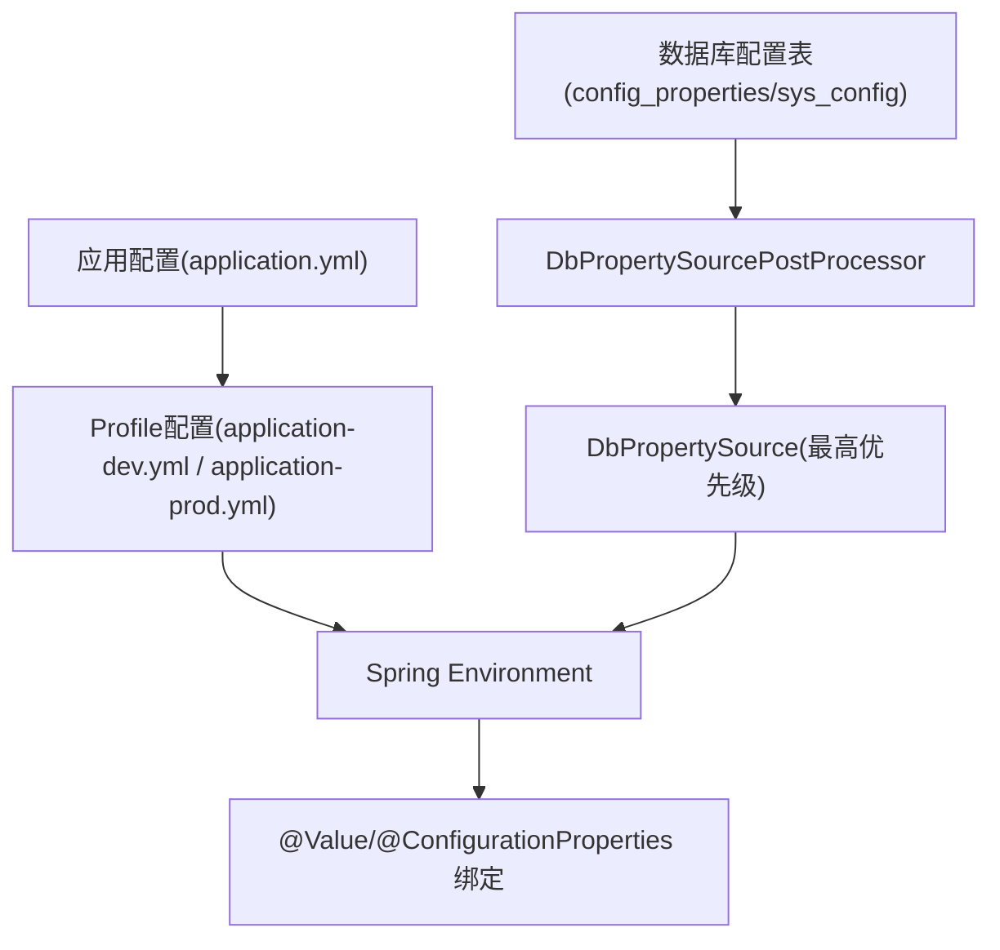
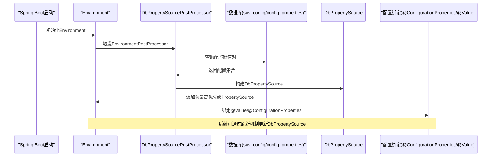
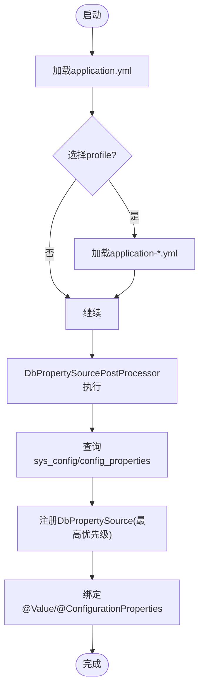
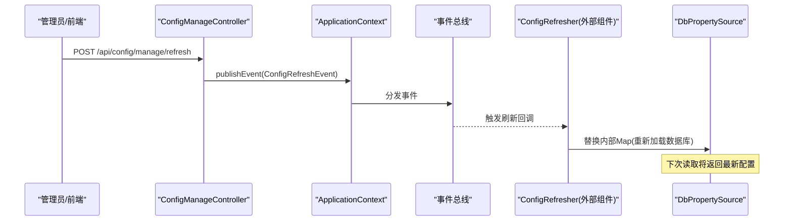
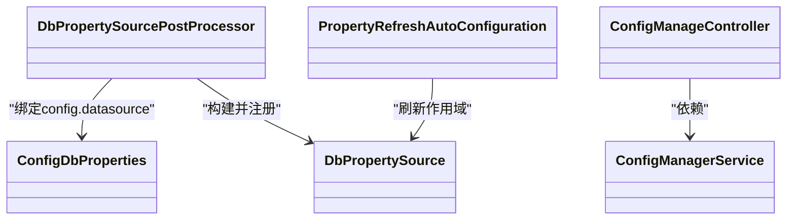

# 配置管理

<cite>
**本文引用的文件**
- [application.yml](file://forge/forge-admin/src/main/resources/application.yml)
- [application-dev.yml](file://forge/forge-admin/src/main/resources/application-dev.yml)
- [application-prod.yml](file://forge/forge-admin/src/main/resources/application-prod.yml)
- [ConfigController.java](file://forge/forge-admin/src/main/java/com/mdframe/forge/admin/ConfigController.java)
- [FeatureConfig.java](file://forge/forge-admin/src/main/java/com/mdframe/forge/admin/FeatureConfig.java)
- [ConfigManageController.java](file://forge/forge-framework/forge-starter-parent/forge-starter-config/src/main/java/com/mdframe/forge/starter/config/controller/ConfigManageController.java)
- [ConfigManagerService.java](file://forge/forge-framework/forge-starter-parent/forge-starter-config/src/main/java/com/mdframe/forge/starter/config/service/ConfigManagerService.java)
- [ConfigDbProperties.java](file://forge/forge-framework/forge-starter-parent/forge-starter-config/src/main/java/com/mdframe/forge/starter/property/ConfigDbProperties.java)
- [DbPropertySource.java](file://forge/forge-framework/forge-starter-parent/forge-starter-config/src/main/java/com/mdframe/forge/starter/property/DbPropertySource.java)
- [DbPropertySourcePostProcessor.java](file://forge/forge-framework/forge-starter-parent/forge-starter-config/src/main/java/com/mdframe/forge/starter/property/DbPropertySourcePostProcessor.java)
- [PropertyRefreshAutoConfiguration.java](file://forge/forge-framework/forge-starter-parent/forge-starter-config/src/main/java/com/mdframe/forge/starter/property/config/PropertyRefreshAutoConfiguration.java)
- [config_properties.sql](file://forge/forge-framework/forge-starter-parent/forge-starter-config/sql/config_properties.sql)
- [LoginConfig.java](file://forge/forge-framework/forge-starter-parent/forge-starter-config/src/main/java/com/mdframe/forge/starter/config/config/LoginConfig.java)
- [SecurityConfig.java](file://forge/forge-framework/forge-starter-parent/forge-starter-config/src/main/java/com/mdframe/forge/starter/config/config/SecurityConfig.java)
</cite>

## 目录
1. [简介](#简介)
2. [项目结构](#项目结构)
3. [核心组件](#核心组件)
4. [架构总览](#架构总览)
5. [详细组件分析](#详细组件分析)
6. [依赖关系分析](#依赖关系分析)
7. [性能考量](#性能考量)
8. [故障排查指南](#故障排查指南)
9. [结论](#结论)
10. [附录](#附录)

## 简介
本文件系统性梳理Forge框架的配置管理体系，覆盖配置层次结构、配置项说明与管理策略，重点包括：
- 数据库连接与动态多数据源
- 缓存与Redis配置
- 文件存储与上传限制
- 安全认证（Sa-Token）、密码策略
- 功能开关与运行态配置中心
- 配置文件加载顺序、环境差异化配置、动态配置更新机制
- 最佳实践、性能调优与故障排查

目标是帮助开发者基于业务场景合理配置系统参数，确保应用在不同环境下稳定高效运行。

## 项目结构
Forge配置体系由“应用层配置”和“数据库驱动配置”两部分构成：
- 应用层配置：通过Spring Boot的application.yml及profile文件进行环境化配置（开发/生产等）
- 数据库驱动配置：通过EnvironmentPostProcessor在启动早期从数据库加载配置，并注入为最高优先级的PropertySource

图表来源
- [application.yml](file://forge/forge-admin/src/main/resources/application.yml#L1-L100)
- [application-dev.yml](file://forge/forge-admin/src/main/resources/application-dev.yml#L1-L70)
- [DbPropertySourcePostProcessor.java](file://forge/forge-framework/forge-starter-parent/forge-starter-config/src/main/java/com/mdframe/forge/starter/property/DbPropertySourcePostProcessor.java#L19-L49)
- [DbPropertySource.java](file://forge/forge-framework/forge-starter-parent/forge-starter-config/src/main/java/com/mdframe/forge/starter/property/DbPropertySource.java#L10-L33)

章节来源
- [application.yml](file://forge/forge-admin/src/main/resources/application.yml#L1-L100)
- [application-dev.yml](file://forge/forge-admin/src/main/resources/application-dev.yml#L1-L70)
- [DbPropertySourcePostProcessor.java](file://forge/forge-framework/forge-starter-parent/forge-starter-config/src/main/java/com/mdframe/forge/starter/property/DbPropertySourcePostProcessor.java#L19-L49)

## 核心组件
- 配置加载与绑定
  - 应用配置：server、logging、spring、mybatis-plus、sa-token等
  - Profile配置：开发环境数据库、Redis、HikariCP连接池参数
  - 数据库驱动配置：通过DbPropertySourcePostProcessor在启动早期加载sys_config或config_properties表中的键值对，作为最高优先级的配置源
- 配置管理服务
  - ConfigManageController：提供登录、安全、系统、水印、加解密、认证、日志等配置的查询与更新接口
  - ConfigManagerService：按分组序列化/反序列化配置，支持默认值回退与异常容错
- 动态刷新
  - PropertyRefreshAutoConfiguration：注册refresh作用域与调度能力，配合ConfigRefresher实现配置热更新
- 示例与开关
  - FeatureConfig：基于数据库开关的条件装配示例
  - ConfigController：演示@Value与Environment读取数据库配置

章节来源
- [application.yml](file://forge/forge-admin/src/main/resources/application.yml#L1-L100)
- [application-dev.yml](file://forge/forge-admin/src/main/resources/application-dev.yml#L1-L70)
- [ConfigManageController.java](file://forge/forge-framework/forge-starter-parent/forge-starter-config/src/main/java/com/mdframe/forge/starter/config/controller/ConfigManageController.java#L22-L162)
- [ConfigManagerService.java](file://forge/forge-framework/forge-starter-parent/forge-starter-config/src/main/java/com/mdframe/forge/starter/config/service/ConfigManagerService.java#L22-L193)
- [DbPropertySourcePostProcessor.java](file://forge/forge-framework/forge-starter-parent/forge-starter-config/src/main/java/com/mdframe/forge/starter/property/DbPropertySourcePostProcessor.java#L19-L130)
- [PropertyRefreshAutoConfiguration.java](file://forge/forge-framework/forge-starter-parent/forge-starter-config/src/main/java/com/mdframe/forge/starter/property/config/PropertyRefreshAutoConfiguration.java#L13-L34)
- [FeatureConfig.java](file://forge/forge-admin/src/main/java/com/mdframe/forge/admin/FeatureConfig.java#L10-L20)
- [ConfigController.java](file://forge/forge-admin/src/main/java/com/mdframe/forge/admin/ConfigController.java#L12-L37)

## 架构总览
下图展示配置从数据库到运行时的加载与刷新路径：

图表来源
- [DbPropertySourcePostProcessor.java](file://forge/forge-framework/forge-starter-parent/forge-starter-config/src/main/java/com/mdframe/forge/starter/property/DbPropertySourcePostProcessor.java#L22-L49)
- [DbPropertySource.java](file://forge/forge-framework/forge-starter-parent/forge-starter-config/src/main/java/com/mdframe/forge/starter/property/DbPropertySource.java#L10-L33)
- [ConfigDbProperties.java](file://forge/forge-framework/forge-starter-parent/forge-starter-config/src/main/java/com/mdframe/forge/starter/property/ConfigDbProperties.java#L6-L45)

## 详细组件分析

### 配置层次与加载顺序
- 层次结构
  - 应用层配置：application.yml为主，application-dev.yml、application-prod.yml为环境差异化配置
  - 数据库驱动配置：DbPropertySourcePostProcessor在Environment初始化阶段从数据库加载配置，优先级最高
- 加载顺序
  1) 读取application.yml基础配置
  2) 根据profiles.active选择对应profile文件
  3) 执行DbPropertySourcePostProcessor，从数据库加载sys_config或config_properties
  4) 将数据库配置作为最高优先级注入Environment
  5) 绑定@Value/@ConfigurationProperties到业务Bean

图表来源
- [application.yml](file://forge/forge-admin/src/main/resources/application.yml#L39-L40)
- [application-dev.yml](file://forge/forge-admin/src/main/resources/application-dev.yml#L1-L70)
- [DbPropertySourcePostProcessor.java](file://forge/forge-framework/forge-starter-parent/forge-starter-config/src/main/java/com/mdframe/forge/starter/property/DbPropertySourcePostProcessor.java#L22-L49)

章节来源
- [application.yml](file://forge/forge-admin/src/main/resources/application.yml#L39-L40)
- [application-dev.yml](file://forge/forge-admin/src/main/resources/application-dev.yml#L1-L70)
- [DbPropertySourcePostProcessor.java](file://forge/forge-framework/forge-starter-parent/forge-starter-config/src/main/java/com/mdframe/forge/starter/property/DbPropertySourcePostProcessor.java#L22-L49)

### 数据库连接与动态多数据源
- HikariCP连接池参数（开发环境示例）
  - 最大连接池数量、最小空闲线程、连接超时、校验超时、空闲与生命周期、保活周期
- 动态数据源
  - primary默认主库、strict严格模式、master数据源配置
  - 通过spring.dynamic.datasource.*进行扩展
- 驱动与URL
  - MySQL驱动、URL、用户名、密码、rewriteBatchedStatements批处理优化

章节来源
- [application-dev.yml](file://forge/forge-admin/src/main/resources/application-dev.yml#L1-L70)

### 缓存与Redis配置
- Redis地址、端口、数据库索引、密码、超时、SSL
- Redisson客户端配置（单机模式、连接池、重试策略、线程数）

章节来源
- [application-dev.yml](file://forge/forge-admin/src/main/resources/application-dev.yml#L35-L63)

### 文件存储与上传限制
- 单文件大小与总请求大小限制
- 静态资源路径与日期时间格式化

章节来源
- [application.yml](file://forge/forge-admin/src/main/resources/application.yml#L41-L52)

### 安全认证与密码策略
- Sa-Token配置：token有效期、活动超时、并发登录、读取策略、前缀与名称
- 密码策略：最小长度、大小写、数字、特殊字符、过期天数、历史记录数
- 登录配置：验证码开关与类型、记住我、登录日志、IP限制与白名单

章节来源
- [application.yml](file://forge/forge-admin/src/main/resources/application.yml#L86-L100)
- [SecurityConfig.java](file://forge/forge-framework/forge-starter-parent/forge-starter-config/src/main/java/com/mdframe/forge/starter/config/config/SecurityConfig.java#L8-L112)
- [LoginConfig.java](file://forge/forge-framework/forge-starter-parent/forge-starter-config/src/main/java/com/mdframe/forge/starter/config/config/LoginConfig.java#L8-L45)

### 功能开关与运行态配置中心
- 数据库开关示例：FeatureConfig基于feature.enabled条件装配
- 运行态配置中心：ConfigManageController提供登录、安全、系统、水印、加解密、认证、日志等配置的查询与更新
- 分组管理：ConfigManagerService按groupCode序列化/反序列化配置，支持默认值回退

章节来源
- [FeatureConfig.java](file://forge/forge-admin/src/main/java/com/mdframe/forge/admin/FeatureConfig.java#L10-L20)
- [ConfigManageController.java](file://forge/forge-framework/forge-starter-parent/forge-starter-config/src/main/java/com/mdframe/forge/starter/config/controller/ConfigManageController.java#L22-L162)
- [ConfigManagerService.java](file://forge/forge-framework/forge-starter-parent/forge-starter-config/src/main/java/com/mdframe/forge/starter/config/service/ConfigManagerService.java#L22-L193)

### 数据库配置表结构
- config_properties：键、值、描述、分组、类型、启用状态、创建/更新时间
- sys_config：企业级配置表（示例），按config_key/config_value组织

章节来源
- [config_properties.sql](file://forge/forge-framework/forge-starter-parent/forge-starter-config/sql/config_properties.sql#L1-L31)

### 动态配置更新机制
- 刷新入口：ConfigManageController的刷新接口发布ConfigRefreshEvent
- 作用域注册：PropertyRefreshAutoConfiguration注册refresh作用域与调度
- 数据源刷新：DbPropertySource持有可变Map，支持运行时替换

图表来源
- [ConfigManageController.java](file://forge/forge-framework/forge-starter-parent/forge-starter-config/src/main/java/com/mdframe/forge/starter/config/controller/ConfigManageController.java#L152-L161)
- [PropertyRefreshAutoConfiguration.java](file://forge/forge-framework/forge-starter-parent/forge-starter-config/src/main/java/com/mdframe/forge/starter/property/config/PropertyRefreshAutoConfiguration.java#L13-L34)
- [DbPropertySource.java](file://forge/forge-framework/forge-starter-parent/forge-starter-config/src/main/java/com/mdframe/forge/starter/property/DbPropertySource.java#L10-L33)

## 依赖关系分析
- 组件耦合
  - DbPropertySourcePostProcessor依赖ConfigDbProperties与JdbcTemplate，负责从数据库加载配置并注入Environment
  - ConfigManagerService依赖SysConfigGroup相关服务，负责配置分组的序列化/反序列化与持久化
  - ConfigManageController聚合ConfigManagerService，提供REST接口
  - PropertyRefreshAutoConfiguration注册refresh作用域，支撑运行态刷新
- 关键依赖链
  - application.yml → Environment → @Value/@ConfigurationProperties
  - DbPropertySourcePostProcessor → DbPropertySource → Environment → @Value/@ConfigurationProperties
  - ConfigManageController → ConfigManagerService → SysConfigGroup持久化

图表来源
- [DbPropertySourcePostProcessor.java](file://forge/forge-framework/forge-starter-parent/forge-starter-config/src/main/java/com/mdframe/forge/starter/property/DbPropertySourcePostProcessor.java#L19-L49)
- [ConfigDbProperties.java](file://forge/forge-framework/forge-starter-parent/forge-starter-config/src/main/java/com/mdframe/forge/starter/property/ConfigDbProperties.java#L6-L45)
- [DbPropertySource.java](file://forge/forge-framework/forge-starter-parent/forge-starter-config/src/main/java/com/mdframe/forge/starter/property/DbPropertySource.java#L10-L33)
- [ConfigManageController.java](file://forge/forge-framework/forge-starter-parent/forge-starter-config/src/main/java/com/mdframe/forge/starter/config/controller/ConfigManageController.java#L22-L162)
- [ConfigManagerService.java](file://forge/forge-framework/forge-starter-parent/forge-starter-config/src/main/java/com/mdframe/forge/starter/config/service/ConfigManagerService.java#L22-L193)
- [PropertyRefreshAutoConfiguration.java](file://forge/forge-framework/forge-starter-parent/forge-starter-config/src/main/java/com/mdframe/forge/starter/property/config/PropertyRefreshAutoConfiguration.java#L13-L34)

## 性能考量
- 数据库连接池
  - 合理设置maxPoolSize/minIdle/connectionTimeout/validationTimeout，避免连接争用与超时
  - 批处理优化rewriteBatchedStatements可显著提升批量操作性能，但需评估数据库压力
- Redis与Redisson
  - 连接池大小与最小空闲需结合QPS与延迟目标调优
  - 重试次数与间隔影响可用性与后端压力，建议按SLA权衡
- 配置加载
  - DbPropertySource仅在启动阶段加载，运行时刷新通过事件触发，避免频繁I/O
- JSON序列化
  - 配置分组采用Jackson序列化/反序列化，注意字段变更与兼容性

[本节为通用指导，无需列出具体文件来源]

## 故障排查指南
- 启动阶段未加载数据库配置
  - 检查config.datasource的URL/用户名/密码是否完整绑定
  - 确认数据库表存在且可访问（sys_config或config_properties）
- 配置读取异常或为空
  - 检查@Value键名与驼峰格式映射是否正确
  - 若数据库加载失败，系统会回退到默认配置；确认日志中是否有降级提示
- 动态刷新无效
  - 确认刷新接口已调用并发布ConfigRefreshEvent
  - 检查refresh作用域是否注册成功
- 配置中心接口异常
  - 查看ConfigManagerService的异常日志与默认值回退逻辑
  - 确认SysConfigGroup持久化层正常工作

章节来源
- [DbPropertySourcePostProcessor.java](file://forge/forge-framework/forge-starter-parent/forge-starter-config/src/main/java/com/mdframe/forge/starter/property/DbPropertySourcePostProcessor.java#L22-L49)
- [DbPropertySourcePostProcessor.java](file://forge/forge-framework/forge-starter-parent/forge-starter-config/src/main/java/com/mdframe/forge/starter/property/DbPropertySourcePostProcessor.java#L52-L104)
- [ConfigManageController.java](file://forge/forge-framework/forge-starter-parent/forge-starter-config/src/main/java/com/mdframe/forge/starter/config/controller/ConfigManageController.java#L152-L161)
- [ConfigManagerService.java](file://forge/forge-framework/forge-starter-parent/forge-starter-config/src/main/java/com/mdframe/forge/starter/config/service/ConfigManagerService.java#L133-L150)

## 结论
Forge框架通过“应用层配置+数据库驱动配置”的双轨机制，实现了环境差异化与运行态配置管理的统一。结合动态刷新与分组化的配置中心，开发者可在不重启的情况下灵活调整系统行为，同时通过合理的连接池与缓存参数保障性能与稳定性。

[本节为总结性内容，无需列出具体文件来源]

## 附录

### 配置项速查与建议
- 服务器与日志
  - server.port/context-path/undertow线程与缓冲区：按并发与吞吐调优
  - logging.level与logback配置：生产环境建议降低至warn/error
- Spring与MyBatis Plus
  - Jackson格式化、fail策略：生产建议关闭fail_on_empty_beans/fail_on_unknown_properties以增强容错
  - MyBatis Plus驼峰映射、缓存与主键策略：保持默认即可，必要时按实体命名规范调整
- Sa-Token
  - token有效期、并发策略、读取来源：结合业务安全策略与移动端特性配置
- 数据库与连接池
  - HikariCP参数：结合QPS与RT调优，避免过大导致GC压力
  - 批处理优化：仅在明确批量场景启用
- Redis与Redisson
  - 连接池与超时：结合延迟目标与连接数峰值调优
  - SSL与密码：生产环境务必启用SSL并设置强密码
- 文件上传
  - 单文件与总大小：结合业务场景与带宽限制设定
- 功能开关
  - feature.enabled：通过数据库集中管控，避免硬编码

[本节为通用指导，无需列出具体文件来源]