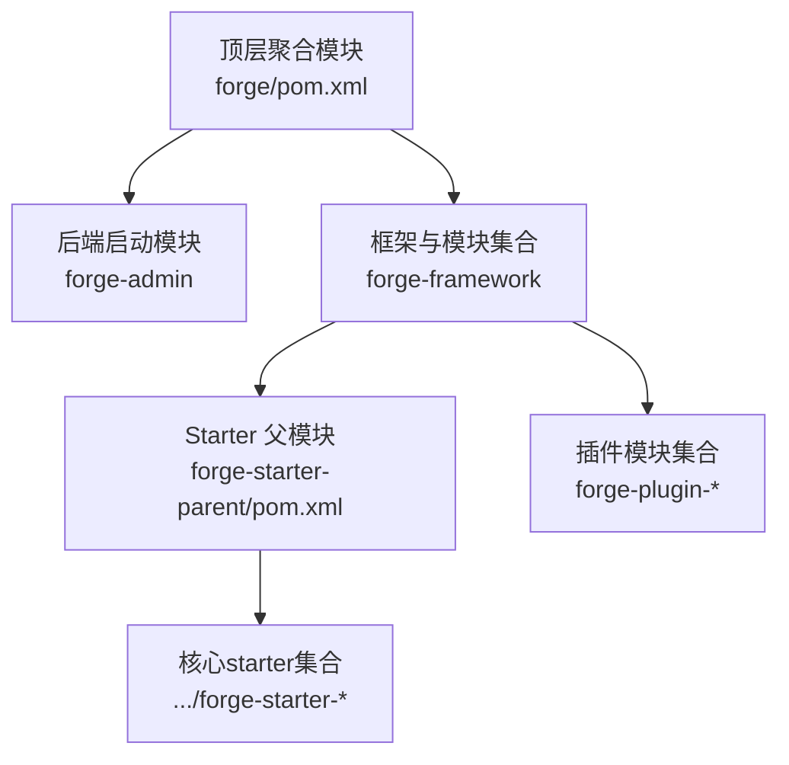
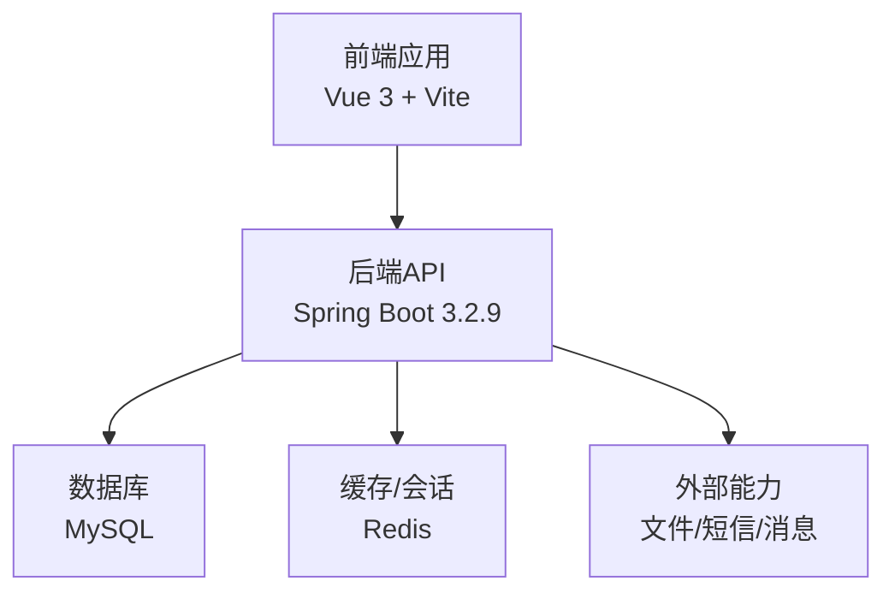
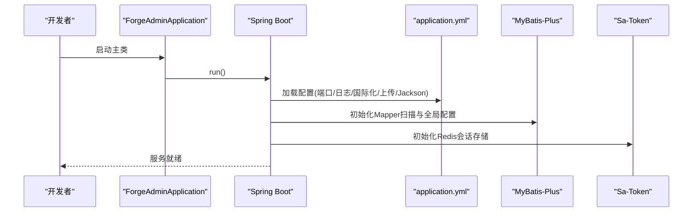
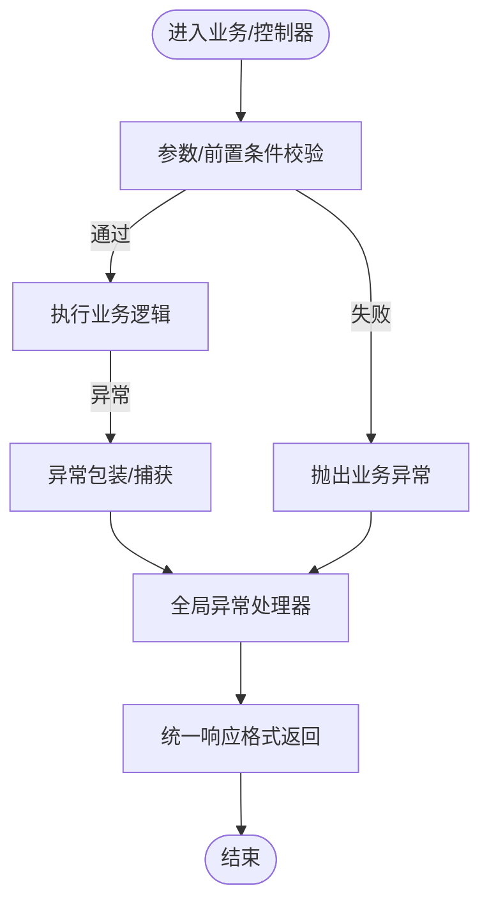
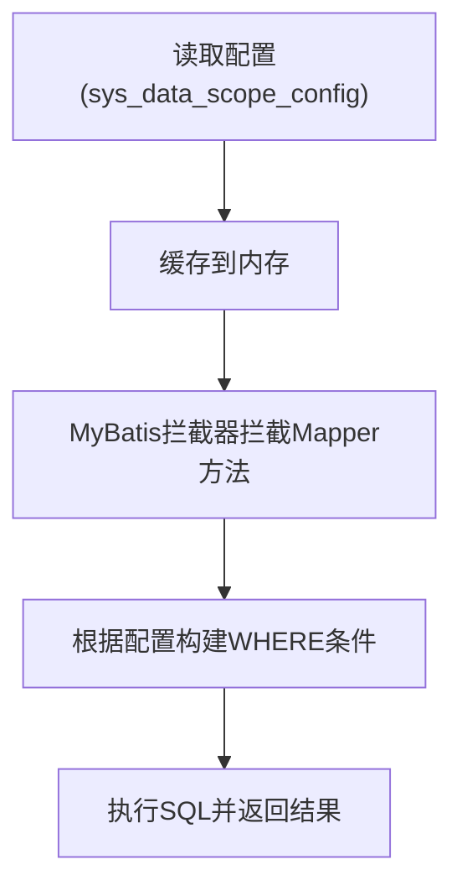
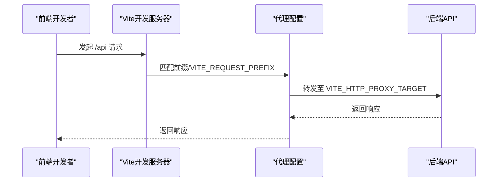
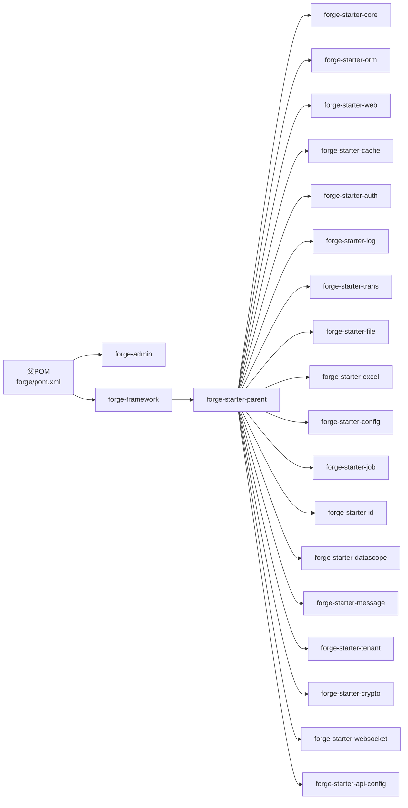

# 项目概述

<cite>
**本文引用的文件**
- [forge/README.en.md](file://forge/README.en.md)
- [forge/pom.xml](file://forge/pom.xml)
- [forge/forge-admin/src/main/java/com/mdframe/forge/admin/ForgeAdminApplication.java](file://forge/forge-admin/src/main/java/com/mdframe/forge/admin/ForgeAdminApplication.java)
- [forge/forge-admin/src/main/resources/application.yml](file://forge/forge-admin/src/main/resources/application.yml)
- [forge/forge-framework/forge-starter-parent/pom.xml](file://forge/forge-framework/forge-starter-parent/pom.xml)
- [forge/forge-framework/forge-starter-parent/forge-starter-core/EXCEPTION_USAGE.md](file://forge/forge-framework/forge-starter-parent/forge-starter-core/EXCEPTION_USAGE.md)
- [forge/forge-framework/forge-starter-parent/forge-starter-datascope/DATA_SCOPE_CONFIG_GUIDE.md](file://forge/forge-framework/forge-starter-parent/forge-starter-datascope/DATA_SCOPE_CONFIG_GUIDE.md)
- [forge-admin-ui/package.json](file://forge-admin-ui/package.json)
- [forge-admin-ui/vite.config.js](file://forge-admin-ui/vite.config.js)
</cite>

## 目录
1. [简介](#简介)
2. [项目结构](#项目结构)
3. [核心组件](#核心组件)
4. [架构总览](#架构总览)
5. [详细组件分析](#详细组件分析)
6. [依赖关系分析](#依赖关系分析)
7. [性能考量](#性能考量)
8. [故障排查指南](#故障排查指南)
9. [结论](#结论)
10. [附录](#附录)

## 简介
Forge 是面向企业级应用开发的全栈框架，采用 Spring Boot 3.2.9 + Vue 3 的现代化组合，提供模块化、多租户、高内聚低耦合的基础能力套件。其核心价值主张包括：
- 快速搭建：内置认证授权、日志、文件、Excel、定时任务、消息通知、配置中心、数据权限、分布式 ID、缓存等通用模块，开箱即用
- 企业级安全：基于 Sa-Token 的统一认证与权限控制，结合数据范围拦截器实现细粒度数据权限
- 可扩展性：模块化设计，支持插件式扩展；多环境配置与统一异常处理，降低维护成本
- 易于落地：提供代码生成器、多语言国际化、多文件存储适配、WebSocket 支持等，覆盖典型企业应用场景

适用场景举例：
- SaaS 多租户平台
- 中后台管理系统
- 业务中台与微服务基础能力沉淀
- 需要统一认证、审计日志、数据权限与文件/消息集成的企业应用

## 项目结构
Forge 采用父子工程结构，顶层聚合模块管理版本与插件，核心由两大部分组成：
- forge-admin：后端启动模块，包含主启动类与核心配置
- forge-framework：前端 Vue 3 管理端与后端 Starter 模块集合，按功能拆分为若干 starter 与 plugin 子模块

图表来源
- [forge/pom.xml](file://forge/pom.xml#L114-L117)
- [forge/forge-framework/forge-starter-parent/pom.xml](file://forge/forge-framework/forge-starter-parent/pom.xml#L15-L34)

章节来源
- [forge/pom.xml](file://forge/pom.xml#L114-L117)
- [forge/forge-framework/forge-starter-parent/pom.xml](file://forge/forge-framework/forge-starter-parent/pom.xml#L15-L34)

## 核心组件
- 后端启动与配置
  - 主启动类：扫描 com.mdframe.forge 包，开启 AOP 代理，加载 MyBatis Mapper
  - 核心配置： Undertow 线程模型、日志级别、国际化、文件上传、Jackson 日期格式、MyBatis-Plus 全局配置、Sa-Token Redis 存储
- 异常处理体系
  - BusinessException 业务异常类、ExceptionUtil 工具类、GlobalExceptionHandler 全局处理器，统一异常响应格式与日志级别
- 数据权限控制
  - 通过配置化规则动态拼接 SQL 条件，支持用户、组织、租户三维度，支持简单字段与复杂 SQL 模式
- 前端工程
  - Vue 3 + Vite + Naive UI + Pinia + Vue Router，内置代理、自动导入、组件解析、UnoCSS、加密工具等

章节来源
- [forge/forge-admin/src/main/java/com/mdframe/forge/admin/ForgeAdminApplication.java](file://forge/forge-admin/src/main/java/com/mdframe/forge/admin/ForgeAdminApplication.java#L8-L10)
- [forge/forge-admin/src/main/resources/application.yml](file://forge/forge-admin/src/main/resources/application.yml#L1-L100)
- [forge/forge-framework/forge-starter-parent/forge-starter-core/EXCEPTION_USAGE.md](file://forge/forge-framework/forge-starter-parent/forge-starter-core/EXCEPTION_USAGE.md#L1-L138)
- [forge/forge-framework/forge-starter-parent/forge-starter-datascope/DATA_SCOPE_CONFIG_GUIDE.md](file://forge/forge-framework/forge-starter-parent/forge-starter-datascope/DATA_SCOPE_CONFIG_GUIDE.md#L1-L291)
- [forge-admin-ui/package.json](file://forge-admin-ui/package.json#L1-L68)
- [forge-admin-ui/vite.config.js](file://forge-admin-ui/vite.config.js#L1-L86)

## 架构总览
整体采用“前后端分离 + 后端模块化”的企业级架构：
- 前端：Vue 3 单页应用，通过 Vite 开发服务器与后端接口联调，支持代理跨域与 WebSocket
- 后端：Spring Boot 3.2.9，Starter 模块化装配通用能力，插件模块承载业务功能
- 数据与中间件：MySQL（默认）、Redis（Sa-Token 会话与分布式缓存）、可选云存储与短信通道

图表来源
- [forge/forge-admin/src/main/resources/application.yml](file://forge/forge-admin/src/main/resources/application.yml#L87-L100)
- [forge-admin-ui/vite.config.js](file://forge-admin-ui/vite.config.js#L56-L80)

## 详细组件分析

### 后端启动与配置组件
- 主启动类职责：包扫描、Mapper 扫描、AOP 代理开启
- 核心配置要点： Undertow 线程模型、日志级别、国际化、文件上传大小、Jackson 日期格式、MyBatis-Plus 全局配置、Sa-Token Redis 会话

图表来源
- [forge/forge-admin/src/main/java/com/mdframe/forge/admin/ForgeAdminApplication.java](file://forge/forge-admin/src/main/java/com/mdframe/forge/admin/ForgeAdminApplication.java#L11-L15)
- [forge/forge-admin/src/main/resources/application.yml](file://forge/forge-admin/src/main/resources/application.yml#L1-L100)

章节来源
- [forge/forge-admin/src/main/java/com/mdframe/forge/admin/ForgeAdminApplication.java](file://forge/forge-admin/src/main/java/com/mdframe/forge/admin/ForgeAdminApplication.java#L8-L15)
- [forge/forge-admin/src/main/resources/application.yml](file://forge/forge-admin/src/main/resources/application.yml#L1-L100)

### 异常处理组件
- 设计目标：统一异常响应格式，区分业务异常与系统异常，减少重复样板代码
- 关键点：工具类 ExceptionUtil 提供链式校验与包装；全局处理器自动拦截并格式化响应

图表来源
- [forge/forge-framework/forge-starter-parent/forge-starter-core/EXCEPTION_USAGE.md](file://forge/forge-framework/forge-starter-parent/forge-starter-core/EXCEPTION_USAGE.md#L106-L138)

章节来源
- [forge/forge-framework/forge-starter-parent/forge-starter-core/EXCEPTION_USAGE.md](file://forge/forge-framework/forge-starter-parent/forge-starter-core/EXCEPTION_USAGE.md#L1-L358)

### 数据权限组件
- 配置化规则：通过数据库表 sys_data_scope_config 配置资源编码、Mapper 方法、表别名与字段规则
- 执行机制：启动时加载配置并缓存；MyBatis 拦截器在执行 SQL 前动态拼接 WHERE 条件
- 支持模式：简单字段与复杂 SQL（占位符 #{userId}/#{orgIds}/#{tenantId} 等）

图表来源
- [forge/forge-framework/forge-starter-parent/forge-starter-datascope/DATA_SCOPE_CONFIG_GUIDE.md](file://forge/forge-framework/forge-starter-parent/forge-starter-datascope/DATA_SCOPE_CONFIG_GUIDE.md#L202-L226)

章节来源
- [forge/forge-framework/forge-starter-parent/forge-starter-datascope/DATA_SCOPE_CONFIG_GUIDE.md](file://forge/forge-framework/forge-starter-parent/forge-starter-datascope/DATA_SCOPE_CONFIG_GUIDE.md#L1-L291)

### 前端工程组件
- 技术栈：Vue 3、Vite、Naive UI、Pinia、Vue Router
- 开发体验：自动导入、组件解析、UnoCSS、加密工具、图标生成、路由警告移除
- 联调方式：通过 VITE_HTTP_PROXY_TARGET 将 /api 前缀代理到后端，WebSocket 通过 /ws 代理

图表来源
- [forge-admin-ui/vite.config.js](file://forge-admin-ui/vite.config.js#L56-L80)

章节来源
- [forge-admin-ui/package.json](file://forge-admin-ui/package.json#L1-L68)
- [forge-admin-ui/vite.config.js](file://forge-admin-ui/vite.config.js#L1-L86)

## 依赖关系分析
- 版本与环境
  - Java 17、Spring Boot 3.2.9、MyBatis-Plus、Sa-Token、Redisson、Quartz、EasyExcel、MapStruct 等
  - Maven Profile 支持 local/dev/prod 三套环境，统一编译与测试配置
- 模块划分
  - forge-starter-parent 下包含核心、ORM、Web、缓存、认证、日志、翻译、文件、Excel、配置、作业、ID、数据范围、消息、租户、加解密、WebSocket、API 配置等模块
  - 通过模块化避免功能耦合，便于按需引入与扩展

图表来源
- [forge/pom.xml](file://forge/pom.xml#L114-L117)
- [forge/forge-framework/forge-starter-parent/pom.xml](file://forge/forge-framework/forge-starter-parent/pom.xml#L15-L34)

章节来源
- [forge/pom.xml](file://forge/pom.xml#L12-L61)
- [forge/forge-framework/forge-starter-parent/pom.xml](file://forge/forge-framework/forge-starter-parent/pom.xml#L1-L37)

## 性能考量
- Web 层
  - Undertow 线程模型可按 CPU 核心数与并发负载调整 IO/Worker 线程数
  - 上传文件大小与总大小限制需结合业务场景评估
- ORM 与缓存
  - MyBatis-Plus 全局配置开启驼峰映射与二级缓存，建议配合 Redisson 缓存热点数据
  - Sa-Token 使用 Redis 存储会话，注意连接池与超时配置
- 数据权限
  - 配置项较多时建议缓存预热与 SQL EXPLAIN 分析，避免复杂条件导致慢查询
- 前端
  - Vite 构建产物体积可通过 UnoCSS、按需组件与路由拆分优化

## 故障排查指南
- 启动与配置
  - 确认 application.yml 中数据库、Redis、日志级别、国际化等配置正确
  - 检查 Sa-Token Redis 连接参数与数据库索引
- 异常处理
  - 若出现统一异常响应，优先查看 GlobalExceptionHandler 捕获的异常类型与日志级别
  - 使用 ExceptionUtil 的链式校验与包装，快速定位参数与业务异常
- 数据权限
  - 若查询结果为空或权限不生效，检查 sys_data_scope_config 的 enabled、Mapper 方法路径、表别名与字段名
  - 复杂 SQL 模式需确保以 <sql> 开头且占位符格式正确
- 前端联调
  - 确认 VITE_HTTP_PROXY_TARGET 与 VITE_REQUEST_PREFIX 配置，观察代理响应头 x-real-url
  - WebSocket 代理需启用 ws:true 并与后端同源

章节来源
- [forge/forge-admin/src/main/resources/application.yml](file://forge/forge-admin/src/main/resources/application.yml#L23-L100)
- [forge/forge-framework/forge-starter-parent/forge-starter-core/EXCEPTION_USAGE.md](file://forge/forge-framework/forge-starter-parent/forge-starter-core/EXCEPTION_USAGE.md#L106-L138)
- [forge/forge-framework/forge-starter-parent/forge-starter-datascope/DATA_SCOPE_CONFIG_GUIDE.md](file://forge/forge-framework/forge-starter-parent/forge-starter-datascope/DATA_SCOPE_CONFIG_GUIDE.md#L237-L260)
- [forge-admin-ui/vite.config.js](file://forge-admin-ui/vite.config.js#L56-L80)

## 结论
Forge 以 Spring Boot 3.2.9 + Vue 3 为基础，构建了覆盖企业级应用常见痛点的模块化能力集，具备：
- 快速交付：统一认证、日志、文件、Excel、定时任务、消息、配置中心、数据权限、ID 生成、缓存等
- 安全可控：Sa-Token + 数据权限配置化，满足多租户与细粒度权限需求
- 易于扩展：模块化与插件化设计，支持按需裁剪与二次开发

对于需要快速搭建中后台、SaaS 平台或业务中台的团队，Forge 能显著降低重复造轮子的成本，提升研发效率。

## 附录
- 项目背景与定位：面向企业级应用开发，提供可复用的基础设施模块
- 核心特性清单：模块化、多租户、数据权限、代码生成、配置中心、国际化、异常统一、缓存与分布式能力
- 技术选型理由：Spring Boot 3.2.9 提供稳定生态与性能；Vue 3 生态成熟、开发体验佳；MyBatis-Plus 简化 ORM；Sa-Token 简化权限；Redisson 提供分布式能力
- 适用场景：SaaS 多租户、中后台系统、数据密集型业务、需要统一认证与审计的日管系统
- 对比优势：相较传统单体框架，Forge 更强调模块化与可插拔；相较纯脚手架，Forge 更强调企业级安全与治理能力
- 最佳实践建议：严格区分业务异常与系统异常；规范数据权限配置；按需启用缓存与异步任务；重视前端代理与跨域策略；持续关注依赖升级与安全补丁