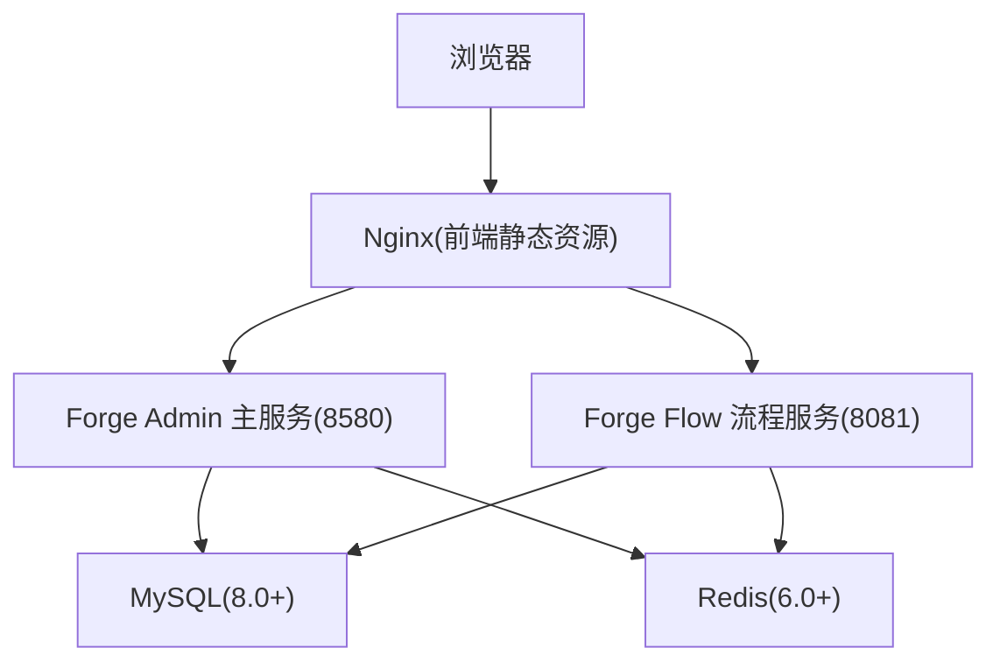
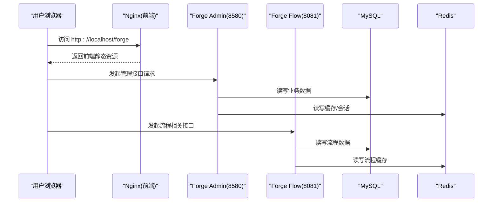
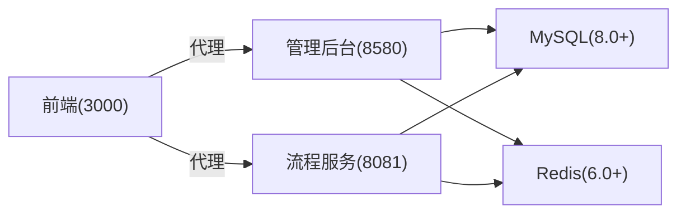

# 快速开始指南

<cite>
**本文引用的文件**
- [README.md](file://README.md)
- [package.json](file://package.json)
- [docker-compose.yml](file://docker/docker-compose.yml)
- [init-db.sh](file://forge-server/scripts/db/init-db.sh)
- [application-dev.example.yml（后台服务）](file://forge-server/forge-admin-server/src/main/resources/application-dev.example.yml)
- [application-dev.example.yml（流程服务）](file://forge-server/forge-flow/forge-flow-server/src/main/resources/application-dev.example.yml)
- [vite.config.js](file://forge-admin-ui/vite.config.js)
- [package.json（前端）](file://forge-admin-ui/package.json)
</cite>

## 目录
1. [简介](#简介)
2. [项目结构](#项目结构)
3. [核心组件](#核心组件)
4. [架构总览](#架构总览)
5. [详细组件分析](#详细组件分析)
6. [依赖关系分析](#依赖关系分析)
7. [性能考虑](#性能考虑)
8. [故障排查指南](#故障排查指南)
9. [结论](#结论)
10. [附录](#附录)

## 简介
本指南面向首次接触 Forge Admin 的新用户，目标是在最短时间内完成环境准备、数据库初始化、配置准备与前后端启动，体验默认账号登录与核心功能。文档同时覆盖两种安装路径：基于模板项目构建与传统方式；并提供 Docker 一键部署方案、常见问题排查、开发调试技巧与性能优化建议。

## 项目结构
Forge Admin 采用前后端分离与多模块后端组织：
- 后端：Spring Boot 3 + MyBatis-Plus + Flowable + Redis，模块化包含主管理后台、独立流程服务、报表服务等。
- 前端：Vue 3 + Vite + Naive UI，提供管理端与大屏编辑器等前端应用。
- 数据库：MySQL 8.0+，使用脚本与迁移统一管理结构与数据。
- 缓存：Redis 6.0+，用于会话、缓存与分布式锁等。
- 容器化：提供 docker-compose 编排，一键拉起 MySQL、Redis、流程服务、管理后台与 Nginx 前端。

图表来源
- [docker-compose.yml:11-149](file://docker/docker-compose.yml#L11-L149)

章节来源
- [README.md:241-259](file://README.md#L241-L259)

## 核心组件
- 主管理后台服务：聚合系统管理、AI 能力、代码生成、工作流集成等，默认端口 8580。
- 独立流程服务：Flowable 流程引擎运行与建模，默认端口 8081。
- 前端管理界面：Vite 开发服务器默认端口 3000，生产通过 Nginx 发布。
- 数据库与缓存：MySQL 负责持久化，Redis 负责缓存与会话。
- 容器编排：docker-compose 统一编排 MySQL、Redis、流程服务、管理后台与前端 Nginx。

章节来源
- [README.md:263-393](file://README.md#L263-L393)
- [docker-compose.yml:11-149](file://docker/docker-compose.yml#L11-L149)

## 架构总览
下图展示本地开发与容器化部署的访问链路与服务依赖关系。

图表来源
- [docker-compose.yml:61-149](file://docker/docker-compose.yml#L61-L149)
- [vite.config.js:120-158](file://forge-admin-ui/vite.config.js#L120-L158)

## 详细组件分析

### 环境要求与安装方法
- JDK 17+：后端运行环境，推荐安装 OpenJDK 或 Oracle JDK 17。
- Node.js 20.19+：前端开发与构建工具链。
- pnpm 8+：包管理器，推荐使用项目指定版本。
- MySQL 8.0+：数据库，建议使用 utf8mb4 字符集与排序规则。
- Redis 6.0+：缓存与会话存储，建议开启密码保护。

章节来源
- [README.md:265-273](file://README.md#L265-L273)

### 克隆项目与两种安装路径
- 传统方式：直接克隆仓库后进入 forge 目录进行后端构建与前端安装。
- 基于模板项目构建：使用 CLI 从远程模板创建新项目，便于隔离与定制。

步骤要点
- 克隆仓库并进入根目录。
- 选择“传统方式”或“基于模板项目构建”。

章节来源
- [README.md:275-290](file://README.md#L275-L290)
- [package.json:5-7](file://package.json#L5-L7)

### 数据库初始化
推荐使用统一初始化脚本，按顺序执行全量初始化 SQL、必需种子数据，并可按需导入演示数据与可选模块数据。

操作步骤
- 确保已安装 mysql 客户端。
- 执行初始化脚本，传入主机、端口、数据库名、用户名与密码。
- 如需演示数据，追加 --with-demo 参数。
- 如需可选模块数据，追加 --with-optional 参数。

注意事项
- 脚本会创建数据库并设置字符集与排序规则。
- 若跳过管理后台初始化，可加 --skip-admin-init。

章节来源
- [init-db.sh:16-31](file://forge-server/scripts/db/init-db.sh#L16-L31)
- [init-db.sh:83-134](file://forge-server/scripts/db/init-db.sh#L83-L134)

### 配置文件准备
- 复制并修改后台管理服务配置：将 application-dev.example.yml 复制为 application-dev.yml，填写 MySQL、Redis、文件存储、AI 供应商等本地信息。
- 复制并修改独立流程服务配置：同样复制 application-dev.example.yml 为 application-dev.yml，填写流程服务所需的数据库与 Redis 信息。
- 敏感配置不要提交到仓库，通用配置请同步更新示例文件并使用占位符。

章节来源
- [README.md:343-355](file://README.md#L343-L355)
- [application-dev.example.yml（后台服务）:1-89](file://forge-server/forge-admin-server/src/main/resources/application-dev.example.yml#L1-L89)
- [application-dev.example.yml（流程服务）:1-61](file://forge-server/forge-flow/forge-flow-server/src/main/resources/application-dev.example.yml#L1-L61)

### 服务启动
- 启动后端主服务：进入 forge/forge-admin-server，执行 Maven Spring Boot 运行命令，默认监听 8580。
- 可选启动独立流程服务：进入 forge/forge-flow/forge-flow-server，执行 Maven Spring Boot 运行命令，默认监听 8081。
- 启动前端管理界面：进入 forge-admin-ui，安装依赖后执行开发命令，默认监听 3000。
- 启动 AI 大屏前端：进入 forge-report-ui，安装依赖后执行开发命令，默认监听 3021。

章节来源
- [README.md:357-393](file://README.md#L357-L393)
- [package.json（前端）:6-18](file://forge-admin-ui/package.json#L6-L18)

### 基于模板项目构建的流程
- 使用 CLI 从远程模板创建新项目，指定模板仓库与分支。
- 适用于希望以模板为基础进行二次开发与隔离的场景。

章节来源
- [README.md:282-290](file://README.md#L282-L290)
- [package.json:5-7](file://package.json#L5-L7)

### Docker 容器化快速启动
- 在 docker 目录下复制环境变量示例并修改必要项。
- 使用 docker compose 启动，自动拉起 MySQL、Redis、流程服务、管理后台与 Nginx。
- 访问 http://localhost/forge，默认账号 admin/123456。

章节来源
- [docker-compose.yml:1-9](file://docker/docker-compose.yml#L1-L9)
- [docker-compose.yml:11-149](file://docker/docker-compose.yml#L11-L149)

### 默认登录与基本功能体验
- 默认账号：admin / 123456。
- 登录后体验工作台首页、用户管理、菜单管理、字典管理、消息管理等基础能力。
- H5 移动端体验账号：h5_admin / 123456。

章节来源
- [README.md:76-88](file://README.md#L76-L88)
- [README.md:393-393](file://README.md#L393-L393)

## 依赖关系分析
前后端与中间件的依赖关系如下：
- 前端通过 Vite 代理转发至后端与流程服务。
- 管理后台服务依赖 MySQL 与 Redis。
- 流程服务依赖 MySQL 与 Redis。
- Nginx 作为前端静态资源与反向代理入口。

图表来源
- [vite.config.js:120-158](file://forge-admin-ui/vite.config.js#L120-L158)
- [docker-compose.yml:61-149](file://docker/docker-compose.yml#L61-L149)

章节来源
- [vite.config.js:120-158](file://forge-admin-ui/vite.config.js#L120-L158)
- [docker-compose.yml:61-149](file://docker/docker-compose.yml#L61-L149)

## 性能考虑
- 前端构建优化：关闭源码映射、使用 oxc 压缩器、减少内存占用与构建时间。
- 依赖预构建：对大型依赖进行显式预构建，避免首次加载慢与超时。
- 后端连接池：合理配置 HikariCP 最大连接数、空闲线程与超时时间。
- Redis 连接池：根据并发需求调整连接池大小与超时策略。
- 数据库字符集：统一使用 utf8mb4 与合适的排序规则，避免后续迁移问题。

章节来源
- [vite.config.js:160-173](file://forge-admin-ui/vite.config.js#L160-L173)
- [application-dev.example.yml（后台服务）:19-33](file://forge-server/forge-admin-server/src/main/resources/application-dev.example.yml#L19-L33)
- [application-dev.example.yml（流程服务）:14-21](file://forge-server/forge-flow/forge-flow-server/src/main/resources/application-dev.example.yml#L14-L21)

## 故障排查指南
- 首次启动报数据库或 Redis 连接错误：检查是否已复制并修改 application-dev.yml，确认 MySQL 与 Redis 地址、端口、密码正确。
- 前端请求后端失败：确认后端端口已启动，检查前端 .env.development 中的代理目标是否指向本地服务。
- 新增配置项注意事项：本地敏感配置不要提交；通用配置请同步到示例文件并使用占位符。
- 不小心提交了敏感配置：立即更换相关密码或密钥，清理仓库历史与当前索引，补充 .gitignore 规则。
- 数据库初始化失败：确认 mysql 客户端已安装，检查脚本参数与数据库权限。

章节来源
- [README.md:502-518](file://README.md#L502-L518)
- [init-db.sh:83-96](file://forge-server/scripts/db/init-db.sh#L83-L96)

## 结论
通过本指南，你可以在最短时间内完成 Forge Admin 的环境准备、数据库初始化、配置准备与前后端启动，体验默认账号登录与核心功能。对于团队协作与持续交付，推荐使用 Docker Compose 一键部署；对于深度定制与二次开发，可选择传统方式或基于模板项目构建。遇到问题时，优先检查配置与代理设置，并结合日志与数据库状态定位原因。

## 附录
- 构建生产包：前端分别构建，后端全量构建，生产环境 Nginx 配置参考项目文档。
- 社区数据库同步：支持 dry-run 预览导出范围，确认后执行导出与校验。

章节来源
- [README.md:411-427](file://README.md#L411-L427)
- [README.md:395-410](file://README.md#L395-L410)