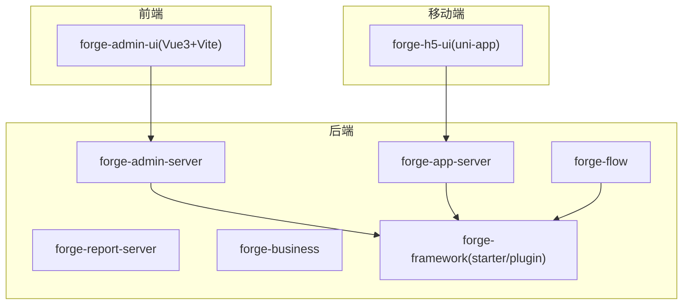
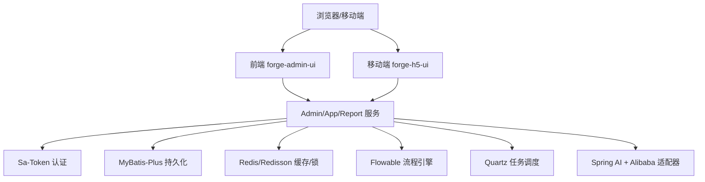
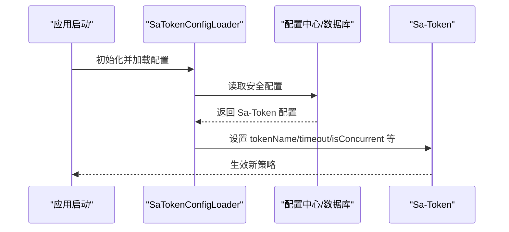
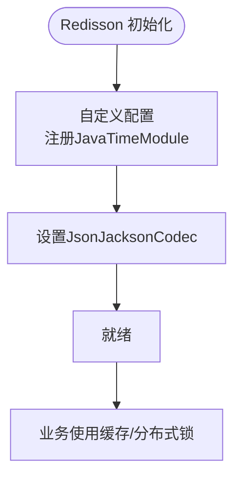
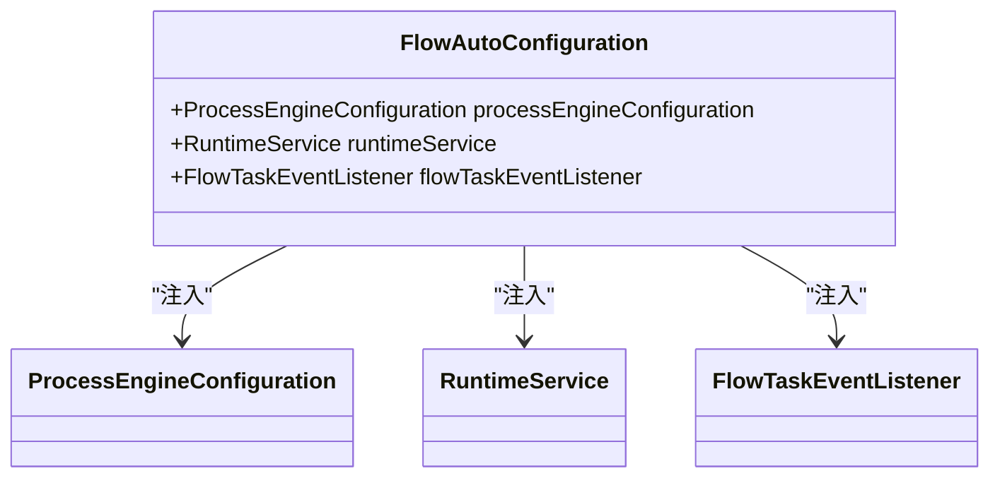
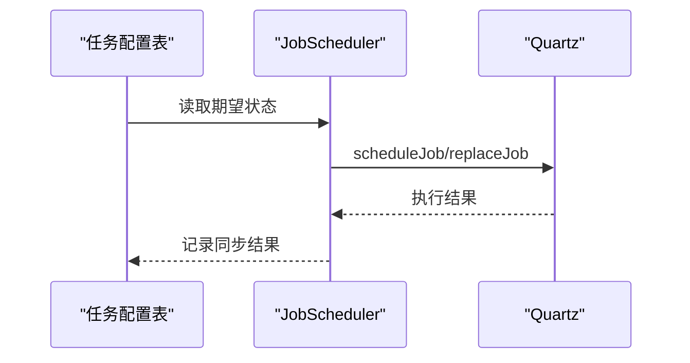
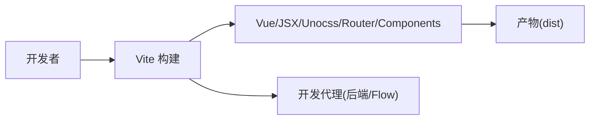
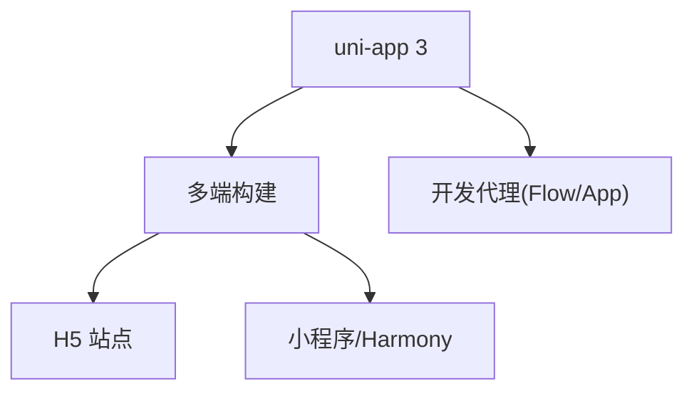
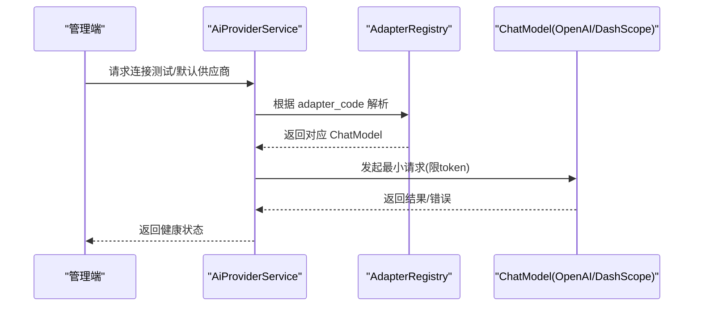
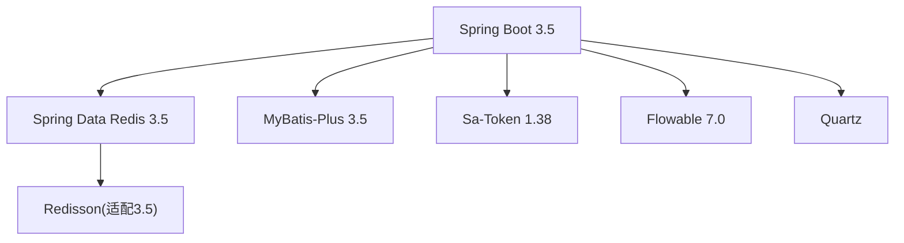

# 技术栈说明

<cite>
**本文引用的文件**
- [forge-server/pom.xml](file://forge-server/pom.xml)
- [forge-server/forge-framework/forge-dependencies/pom.xml](file://forge-server/forge-framework/forge-dependencies/pom.xml)
- [forge-admin-ui/package.json](file://forge-admin-ui/package.json)
- [forge-admin-ui/vite.config.js](file://forge-admin-ui/vite.config.js)
- [forge-h5-ui/package.json](file://forge-h5-ui/package.json)
- [forge-h5-ui/vite.config.js](file://forge-h5-ui/vite.config.js)
- [forge-server/forge-framework/forge-starter-parent/forge-starter-cache/src/main/java/com/mdframe/forge/starter/cache/config/RedissonConfig.java](file://forge-server/forge-framework/forge-starter-parent/forge-starter-cache/src/main/java/com/mdframe/forge/starter/cache/config/RedissonConfig.java)
- [forge-server/forge-framework/forge-plugin-parent/forge-plugin-flow/src/main/java/com/mdframe/forge/starter/flow/config/FlowAutoConfiguration.java](file://forge-server/forge-framework/forge-plugin-parent/forge-plugin-flow/src/main/java/com/mdframe/forge/starter/flow/config/FlowAutoConfiguration.java)
- [forge-server/forge-framework/forge-starter-parent/forge-starter-core/pom.xml](file://forge-server/forge-framework/forge-starter-parent/forge-starter-core/pom.xml)
- [forge-server/forge-framework/forge-starter-parent/forge-starter-auth/src/main/java/com/mdframe/forge/starter/auth/config/SaTokenConfigLoader.java](file://forge-server/forge-framework/forge-starter-parent/forge-starter-auth/src/main/java/com/mdframe/forge/starter/auth/config/SaTokenConfigLoader.java)
- [forge-server/forge-framework/forge-starter-parent/forge-starter-config/src/main/java/com/mdframe/forge/starter/config/config/SecurityConfig.java](file://forge-server/forge-framework/forge-starter-parent/forge-starter-config/src/main/java/com/mdframe/forge/starter/config/config/SecurityConfig.java)
- [forge-server/forge-framework/forge-starter-parent/forge-starter-job/pom.xml](file://forge-server/forge-framework/forge-starter-parent/forge-starter-job/pom.xml)
- [forge-server/forge-framework/forge-plugin-parent/forge-plugin-job/src/test/java/com/mdframe/forge/plugin/job/scheduler/JobSchedulerTest.java](file://forge-server/forge-framework/forge-plugin-parent/forge-plugin-job/src/test/java/com/mdframe/forge/plugin/job/scheduler/JobSchedulerTest.java)
- [forge-server/forge-framework/forge-plugin-parent/forge-plugin-job/src/main/java/com/mdframe/forge/plugin/job/scheduler/JobScheduler.java](file://forge-server/forge-framework/forge-plugin-parent/forge-plugin-job/src/main/java/com/mdframe/forge/plugin/job/scheduler/JobScheduler.java)
- [code-copilot/knowledge/tech-redisson-spring-data-redis-compat.md](file://code-copilot/knowledge/tech-redisson-spring-data-redis-compat.md)
- [code-copilot/changes/archive/2026-07-11-spring-ai-alibaba-provider-adapter/execution-log.md](file://code-copilot/changes/archive/2026-07-11-spring-ai-alibaba-provider-adapter/execution-log.md)
- [forge-server/forge-framework/forge-plugin-parent/forge-plugin-ai/src/main/java/com/mdframe/forge/plugin/ai/provider/service/AiProviderService.java](file://forge-server/forge-framework/forge-plugin-parent/forge-plugin-ai/src/main/java/com/mdframe/forge/plugin/ai/provider/service/AiProviderService.java)
</cite>

## 目录
1. [简介](#简介)
2. [项目结构](#项目结构)
3. [核心组件](#核心组件)
4. [架构总览](#架构总览)
5. [详细组件分析](#详细组件分析)
6. [依赖关系与兼容性](#依赖关系与兼容性)
7. [性能考量](#性能考量)
8. [故障排查指南](#故障排查指南)
9. [结论](#结论)
10. [附录](#附录)

## 简介
本技术栈说明面向 Forge Admin 工程，系统梳理后端、前端、移动端与 AI 相关技术选型、版本依据、集成方式与升级建议。内容基于仓库中的 POM、package.json、Vite 配置与关键实现类进行归纳，确保可追溯、可落地。

## 项目结构
Forge Admin 采用前后端分离与多模块后端架构：
- 后端：Spring Boot 多模块（admin/app/report/flow/business/framework），统一在根 POM 管理版本与依赖。
- 前端：Vue 3 + Vite + Naive UI + UnoCSS + Pinia + Vue Router。
- 移动端：uni-app 3 + Vue 3，支持多端构建。
- AI：基于 Spring AI 与 Spring AI Alibaba 的供应商适配层与智能体能力。

图表来源
- [forge-server/pom.xml:186-193](file://forge-server/pom.xml#L186-L193)
- [forge-admin-ui/vite.config.js:21-53](file://forge-admin-ui/vite.config.js#L21-L53)
- [forge-h5-ui/vite.config.js:23-35](file://forge-h5-ui/vite.config.js#L23-L35)

章节来源
- [forge-server/pom.xml:12-72](file://forge-server/pom.xml#L12-L72)
- [forge-admin-ui/package.json:19-105](file://forge-admin-ui/package.json#L19-L105)
- [forge-h5-ui/package.json:39-86](file://forge-h5-ui/package.json#L39-L86)

## 核心组件
- 后端基础框架
  - Java 17：编译与运行基线。
  - Spring Boot 3.5.x：应用容器与生态基座。
  - MyBatis-Plus 3.5.x：数据访问增强与分页等能力。
  - Sa-Token 1.38：轻量级认证鉴权，支持动态配置热加载。
  - Flowable 7.0：流程引擎，提供 BPMN 建模、执行与历史。
  - Redis/Redisson：缓存与分布式锁，已适配 Spring Data Redis 3.5。
  - Quartz/SnailJob：任务调度与扩展能力。
- 前端技术栈
  - Vue 3.5、Naive UI 2.42、Vite 8、Pinia 3、Vue Router 4.5、UnoCSS 66。
- 移动端技术栈
  - uni-app 3 + Vue 3，统一多端开发与构建。
- AI 技术栈
  - Spring AI 1.1.8 与 Spring AI Alibaba 1.1.2.3，提供多供应商适配与智能体能力。

章节来源
- [forge-server/pom.xml:12-72](file://forge-server/pom.xml#L12-L72)
- [forge-admin-ui/package.json:19-105](file://forge-admin-ui/package.json#L19-L105)
- [forge-h5-ui/package.json:39-86](file://forge-h5-ui/package.json#L39-L86)
- [forge-server/forge-framework/forge-starter-parent/forge-starter-core/pom.xml:117-121](file://forge-server/forge-framework/forge-starter-parent/forge-starter-core/pom.xml#L117-L121)
- [forge-server/forge-framework/forge-starter-parent/forge-starter-cache/src/main/java/com/mdframe/forge/starter/cache/config/RedissonConfig.java:1-34](file://forge-server/forge-framework/forge-starter-parent/forge-starter-cache/src/main/java/com/mdframe/forge/starter/cache/config/RedissonConfig.java#L1-L34)
- [forge-server/forge-framework/forge-plugin-parent/forge-plugin-flow/src/main/java/com/mdframe/forge/starter/flow/config/FlowAutoConfiguration.java:20-55](file://forge-server/forge-framework/forge-plugin-parent/forge-plugin-flow/src/main/java/com/mdframe/forge/starter/flow/config/FlowAutoConfiguration.java#L20-L55)
- [forge-server/forge-framework/forge-starter-parent/forge-starter-job/pom.xml:35-73](file://forge-server/forge-framework/forge-starter-parent/forge-starter-job/pom.xml#L35-L73)
- [code-copilot/changes/archive/2026-07-11-spring-ai-alibaba-provider-adapter/execution-log.md:51-61](file://code-copilot/changes/archive/2026-07-11-spring-ai-alibaba-provider-adapter/execution-log.md#L51-L61)

## 架构总览
后端以 Spring Boot 为底座，通过 starter/plugin 模块化封装通用能力；业务服务（admin/app/report）复用框架能力；Flowable 提供流程编排；Redis/Redisson 提供缓存与分布式锁；Quartz 负责定时任务；AI 能力通过 Spring AI 抽象接入多家供应商。

图表来源
- [forge-server/pom.xml:12-72](file://forge-server/pom.xml#L12-L72)
- [forge-admin-ui/vite.config.js:120-158](file://forge-admin-ui/vite.config.js#L120-L158)
- [forge-h5-ui/vite.config.js:53-102](file://forge-h5-ui/vite.config.js#L53-L102)
- [forge-server/forge-framework/forge-starter-parent/forge-starter-auth/src/main/java/com/mdframe/forge/starter/auth/config/SaTokenConfigLoader.java:39-69](file://forge-server/forge-framework/forge-starter-parent/forge-starter-auth/src/main/java/com/mdframe/forge/starter/auth/config/SaTokenConfigLoader.java#L39-L69)
- [forge-server/forge-framework/forge-starter-parent/forge-starter-cache/src/main/java/com/mdframe/forge/starter/cache/config/RedissonConfig.java:19-33](file://forge-server/forge-framework/forge-starter-parent/forge-starter-cache/src/main/java/com/mdframe/forge/starter/cache/config/RedissonConfig.java#L19-L33)
- [forge-server/forge-framework/forge-plugin-parent/forge-plugin-flow/src/main/java/com/mdframe/forge/starter/flow/config/FlowAutoConfiguration.java:20-55](file://forge-server/forge-framework/forge-plugin-parent/forge-plugin-flow/src/main/java/com/mdframe/forge/starter/flow/config/FlowAutoConfiguration.java#L20-L55)
- [forge-server/forge-framework/forge-plugin-parent/forge-plugin-job/src/main/java/com/mdframe/forge/plugin/job/scheduler/JobScheduler.java:70-92](file://forge-server/forge-framework/forge-plugin-parent/forge-plugin-job/src/main/java/com/mdframe/forge/plugin/job/scheduler/JobScheduler.java#L70-L92)
- [forge-server/forge-framework/forge-plugin-parent/forge-plugin-ai/src/main/java/com/mdframe/forge/plugin/ai/provider/service/AiProviderService.java:44-81](file://forge-server/forge-framework/forge-plugin-parent/forge-plugin-ai/src/main/java/com/mdframe/forge/plugin/ai/provider/service/AiProviderService.java#L44-L81)

## 详细组件分析

### 后端基础框架与版本选择
- Java 17：作为语言基线，配合 Spring Boot 3.5 获得更好的性能与现代化特性。
- Spring Boot 3.5.x：统一依赖管理与自动装配，支撑 Web、安全、缓存、任务调度等生态。
- MyBatis-Plus 3.5.x：在 MyBatis 基础上提供 CRUD、分页、条件构造器与扩展能力，提升开发效率。
- Sa-Token 1.38：轻量鉴权，支持从数据库动态加载 token 策略，便于运行时调整。
- Flowable 7.0：企业级流程引擎，提供可视化建模、执行与审计。
- Redis/Redisson：缓存与分布式锁，已适配 Spring Data Redis 3.5，避免接口不兼容导致的栈溢出问题。
- Quartz/SnailJob：Quartz 用于任务调度，SnailJob 作为扩展能力补充。

章节来源
- [forge-server/pom.xml:12-72](file://forge-server/pom.xml#L12-L72)
- [forge-server/forge-framework/forge-dependencies/pom.xml:173-208](file://forge-server/forge-framework/forge-dependencies/pom.xml#L173-L208)
- [forge-server/forge-framework/forge-starter-parent/forge-starter-core/pom.xml:117-121](file://forge-server/forge-framework/forge-starter-parent/forge-starter-core/pom.xml#L117-L121)
- [forge-server/forge-framework/forge-starter-parent/forge-starter-cache/src/main/java/com/mdframe/forge/starter/cache/config/RedissonConfig.java:19-33](file://forge-server/forge-framework/forge-starter-parent/forge-starter-cache/src/main/java/com/mdframe/forge/starter/cache/config/RedissonConfig.java#L19-L33)
- [forge-server/forge-framework/forge-plugin-parent/forge-plugin-flow/src/main/java/com/mdframe/forge/starter/flow/config/FlowAutoConfiguration.java:20-55](file://forge-server/forge-framework/forge-plugin-parent/forge-plugin-flow/src/main/java/com/mdframe/forge/starter/flow/config/FlowAutoConfiguration.java#L20-L55)
- [forge-server/forge-framework/forge-starter-parent/forge-starter-job/pom.xml:35-73](file://forge-server/forge-framework/forge-starter-parent/forge-starter-job/pom.xml#L35-L73)

### 认证与安全（Sa-Token）
- 动态配置：启动时或配置刷新时从数据库加载 Sa-Token 策略并应用，包括 token 名称、前缀、超时、并发登录等。
- 配置模型：SecurityConfig.SaTokenConfig 集中定义默认值与开关项。

图表来源
- [forge-server/forge-framework/forge-starter-parent/forge-starter-auth/src/main/java/com/mdframe/forge/starter/auth/config/SaTokenConfigLoader.java:39-69](file://forge-server/forge-framework/forge-starter-parent/forge-starter-auth/src/main/java/com/mdframe/forge/starter/auth/config/SaTokenConfigLoader.java#L39-L69)
- [forge-server/forge-framework/forge-starter-parent/forge-starter-config/src/main/java/com/mdframe/forge/starter/config/config/SecurityConfig.java:8-70](file://forge-server/forge-framework/forge-starter-parent/forge-starter-config/src/main/java/com/mdframe/forge/starter/config/config/SecurityConfig.java#L8-L70)

章节来源
- [forge-server/forge-framework/forge-starter-parent/forge-starter-auth/src/main/java/com/mdframe/forge/starter/auth/config/SaTokenConfigLoader.java:39-69](file://forge-server/forge-framework/forge-starter-parent/forge-starter-auth/src/main/java/com/mdframe/forge/starter/auth/config/SaTokenConfigLoader.java#L39-L69)
- [forge-server/forge-framework/forge-starter-parent/forge-starter-config/src/main/java/com/mdframe/forge/starter/config/config/SecurityConfig.java:8-70](file://forge-server/forge-framework/forge-starter-parent/forge-starter-config/src/main/java/com/mdframe/forge/starter/config/config/SecurityConfig.java#L8-L70)

### 缓存与分布式锁（Redis/Redisson）
- Jackson 序列化：自定义 Redisson 配置，注册 Java 8 时间模块，保证时间类型正确序列化。
- 版本兼容：升级到包含 Spring Data Redis 3.5 适配层的 Redisson，避免接口签名差异导致的递归调用与栈溢出。

图表来源
- [forge-server/forge-framework/forge-starter-parent/forge-starter-cache/src/main/java/com/mdframe/forge/starter/cache/config/RedissonConfig.java:19-33](file://forge-server/forge-framework/forge-starter-parent/forge-starter-cache/src/main/java/com/mdframe/forge/starter/cache/config/RedissonConfig.java#L19-L33)
- [code-copilot/knowledge/tech-redisson-spring-data-redis-compat.md:6-23](file://code-copilot/knowledge/tech-redisson-spring-data-redis-compat.md#L6-L23)

章节来源
- [forge-server/forge-framework/forge-starter-parent/forge-starter-cache/src/main/java/com/mdframe/forge/starter/cache/config/RedissonConfig.java:19-33](file://forge-server/forge-framework/forge-starter-parent/forge-starter-cache/src/main/java/com/mdframe/forge/starter/cache/config/RedissonConfig.java#L19-L33)
- [code-copilot/knowledge/tech-redisson-spring-data-redis-compat.md:6-23](file://code-copilot/knowledge/tech-redisson-spring-data-redis-compat.md#L6-L23)

### 工作流（Flowable）
- 自动配置：通过 Flowable AutoConfiguration 启用异步与自动装配，暴露 ProcessEngine、Repository/Runtime/Task/History/Management 等服务。
- 配置项：database-schema-update、async-executor-activate、history-level 等通过 application.yml 控制。

图表来源
- [forge-server/forge-framework/forge-plugin-parent/forge-plugin-flow/src/main/java/com/mdframe/forge/starter/flow/config/FlowAutoConfiguration.java:20-55](file://forge-server/forge-framework/forge-plugin-parent/forge-plugin-flow/src/main/java/com/mdframe/forge/starter/flow/config/FlowAutoConfiguration.java#L20-L55)

章节来源
- [forge-server/forge-framework/forge-plugin-parent/forge-plugin-flow/src/main/java/com/mdframe/forge/starter/flow/config/FlowAutoConfiguration.java:20-55](file://forge-server/forge-framework/forge-plugin-parent/forge-plugin-flow/src/main/java/com/mdframe/forge/starter/flow/config/FlowAutoConfiguration.java#L20-L55)

### 任务调度（Quartz/SnailJob）
- 同步机制：将数据库期望状态同步到 Quartz，处理一次性任务错过、替换作业、移除孤儿触发器等。
- 测试覆盖：验证添加/更新/暂停/删除、失败抛出业务异常、时区、幂等与重试参数、Flow 绑定等。

图表来源
- [forge-server/forge-framework/forge-plugin-parent/forge-plugin-job/src/main/java/com/mdframe/forge/plugin/job/scheduler/JobScheduler.java:70-92](file://forge-server/forge-framework/forge-plugin-parent/forge-plugin-job/src/main/java/com/mdframe/forge/plugin/job/scheduler/JobScheduler.java#L70-L92)
- [forge-server/forge-framework/forge-plugin-parent/forge-plugin-job/src/test/java/com/mdframe/forge/plugin/job/scheduler/JobSchedulerTest.java:54-150](file://forge-server/forge-framework/forge-plugin-parent/forge-plugin-job/src/test/java/com/mdframe/forge/plugin/job/scheduler/JobSchedulerTest.java#L54-L150)

章节来源
- [forge-server/forge-framework/forge-plugin-parent/forge-plugin-job/src/main/java/com/mdframe/forge/plugin/job/scheduler/JobScheduler.java:70-92](file://forge-server/forge-framework/forge-plugin-parent/forge-plugin-job/src/main/java/com/mdframe/forge/plugin/job/scheduler/JobScheduler.java#L70-L92)
- [forge-server/forge-framework/forge-plugin-parent/forge-plugin-job/src/test/java/com/mdframe/forge/plugin/job/scheduler/JobSchedulerTest.java:54-150](file://forge-server/forge-framework/forge-plugin-parent/forge-plugin-job/src/test/java/com/mdframe/forge/plugin/job/scheduler/JobSchedulerTest.java#L54-L150)

### 前端技术栈（Vue 3 + Vite + Naive UI + UnoCSS + Pinia + Vue Router）
- 构建工具：Vite 8，插件链包含 Vue、JSX、Unocss、自动导入、组件自动注册、路由生成、开发工具等。
- 包管理：Vue 3.5、Naive UI 2.42、Pinia 3、Vue Router 4.5、UnoCSS 66。
- 代理与优化：开发环境代理至后端与流程服务，生产构建关闭 source map、使用 oxc 压缩、分块优化。

图表来源
- [forge-admin-ui/vite.config.js:21-53](file://forge-admin-ui/vite.config.js#L21-L53)
- [forge-admin-ui/vite.config.js:120-173](file://forge-admin-ui/vite.config.js#L120-L173)
- [forge-admin-ui/package.json:19-105](file://forge-admin-ui/package.json#L19-L105)

章节来源
- [forge-admin-ui/package.json:19-105](file://forge-admin-ui/package.json#L19-L105)
- [forge-admin-ui/vite.config.js:21-53](file://forge-admin-ui/vite.config.js#L21-L53)
- [forge-admin-ui/vite.config.js:120-173](file://forge-admin-ui/vite.config.js#L120-L173)

### 移动端技术栈（uni-app 3 + Vue 3）
- 多端构建：支持 H5、微信小程序、支付宝小程序、鸿蒙等多端开发与构建。
- 依赖：uni-app 3 系列、Vue 3、Pinia、uview-plus、Axios 等。
- 代理：开发环境对 Flow 与 App 服务进行路径重写与代理。

图表来源
- [forge-h5-ui/package.json:39-86](file://forge-h5-ui/package.json#L39-L86)
- [forge-h5-ui/vite.config.js:23-35](file://forge-h5-ui/vite.config.js#L23-L35)
- [forge-h5-ui/vite.config.js:53-102](file://forge-h5-ui/vite.config.js#L53-L102)

章节来源
- [forge-h5-ui/package.json:39-86](file://forge-h5-ui/package.json#L39-L86)
- [forge-h5-ui/vite.config.js:23-35](file://forge-h5-ui/vite.config.js#L23-L35)
- [forge-h5-ui/vite.config.js:53-102](file://forge-h5-ui/vite.config.js#L53-L102)

### AI 相关技术（Spring AI 1.1.8 + Alibaba 适配）
- 框架基线：Spring AI 1.1.8 与 Spring AI Alibaba 1.1.2.3，复用 ChatModel/ChatClient 抽象，叠加 Alibaba 增强层。
- 供应商适配：引入 adapter_code 显式路由协议，区分 Compatible/Native 两类 ChatModel，避免凭据与 URL 推断歧义。
- 服务层：AiProviderService 提供默认供应商获取、连接测试、健康检查等能力。

图表来源
- [forge-server/forge-framework/forge-plugin-parent/forge-plugin-ai/src/main/java/com/mdframe/forge/plugin/ai/provider/service/AiProviderService.java:44-81](file://forge-server/forge-framework/forge-plugin-parent/forge-plugin-ai/src/main/java/com/mdframe/forge/plugin/ai/provider/service/AiProviderService.java#L44-L81)
- [code-copilot/changes/archive/2026-07-11-spring-ai-alibaba-provider-adapter/execution-log.md:51-61](file://code-copilot/changes/archive/2026-07-11-spring-ai-alibaba-provider-adapter/execution-log.md#L51-L61)

章节来源
- [forge-server/forge-framework/forge-plugin-parent/forge-plugin-ai/src/main/java/com/mdframe/forge/plugin/ai/provider/service/AiProviderService.java:44-81](file://forge-server/forge-framework/forge-plugin-parent/forge-plugin-ai/src/main/java/com/mdframe/forge/plugin/ai/provider/service/AiProviderService.java#L44-L81)
- [code-copilot/changes/archive/2026-07-11-spring-ai-alibaba-provider-adapter/execution-log.md:51-61](file://code-copilot/changes/archive/2026-07-11-spring-ai-alibaba-provider-adapter/execution-log.md#L51-L61)

## 依赖关系与兼容性
- 后端依赖
  - Spring Boot 3.5.x 与 Spring Data Redis 3.5 要求 Redisson 主版本与之对齐，避免接口签名差异导致运行时异常。
  - MyBatis-Plus 3.5.x 与 Spring Boot 3.5 兼容，提供 Spring Boot 3 Starter。
  - Sa-Token 1.38 与 Spring Boot 3 生态兼容，支持动态配置。
  - Flowable 7.0 与 Spring Boot 3 集成良好，可通过自动配置启用。
  - Quartz 与 Spring Boot 3 集成，结合动态数据源与 MyBatis-Plus 完成持久化。
- 前端依赖
  - Vite 8 与 Vue 3.5、Naive UI 2.42、UnoCSS 66、Pinia 3、Vue Router 4.5 协同工作，插件链稳定。
- 移动端依赖
  - uni-app 3 与 Vue 3 组合，支持多端构建与开发体验。

图表来源
- [forge-server/pom.xml:12-72](file://forge-server/pom.xml#L12-L72)
- [forge-server/forge-framework/forge-dependencies/pom.xml:173-208](file://forge-server/forge-framework/forge-dependencies/pom.xml#L173-L208)
- [code-copilot/knowledge/tech-redisson-spring-data-redis-compat.md:6-23](file://code-copilot/knowledge/tech-redisson-spring-data-redis-compat.md#L6-L23)

章节来源
- [forge-server/pom.xml:12-72](file://forge-server/pom.xml#L12-L72)
- [forge-server/forge-framework/forge-dependencies/pom.xml:173-208](file://forge-server/forge-framework/forge-dependencies/pom.xml#L173-L208)
- [code-copilot/knowledge/tech-redisson-spring-data-redis-compat.md:6-23](file://code-copilot/knowledge/tech-redisson-spring-data-redis-compat.md#L6-L23)

## 性能考量
- 前端构建
  - 关闭 source map、使用 oxc 压缩、减少 chunk 体积警告阈值，降低构建内存占用与打包体积。
  - 预构建大型依赖（如 CodeMirror、ECharts、BPMN JS）以提升首屏与交互性能。
- 后端缓存与锁
  - 使用 Redisson 的 Jackson 序列化，避免时间类型序列化开销与错误。
  - 合理设置 Redis 过期策略与锁粒度，避免热点键竞争。
- 任务调度
  - 一次性任务错过不补偿，避免重复执行；幂等与重试策略通过 JobDataMap 传递，保障可靠性。

章节来源
- [forge-admin-ui/vite.config.js:160-173](file://forge-admin-ui/vite.config.js#L160-L173)
- [forge-admin-ui/vite.config.js:66-108](file://forge-admin-ui/vite.config.js#L66-L108)
- [forge-server/forge-framework/forge-starter-parent/forge-starter-cache/src/main/java/com/mdframe/forge/starter/cache/config/RedissonConfig.java:19-33](file://forge-server/forge-framework/forge-starter-parent/forge-starter-cache/src/main/java/com/mdframe/forge/starter/cache/config/RedissonConfig.java#L19-L33)
- [forge-server/forge-framework/forge-plugin-parent/forge-plugin-job/src/main/java/com/mdframe/forge/plugin/job/scheduler/JobScheduler.java:314-329](file://forge-server/forge-framework/forge-plugin-parent/forge-plugin-job/src/main/java/com/mdframe/forge/plugin/job/scheduler/JobScheduler.java#L314-L329)

## 故障排查指南
- 登录栈溢出（Redisson 与 Spring Data Redis 不兼容）
  - 现象：/auth/login 报 StackOverflowError。
  - 原因：旧版 Redisson 依赖 redisson-spring-data-33，未实现 Spring Data Redis 3.5 的新签名，导致 default 方法与旧方法互相递归。
  - 解决：升级 Redisson 至包含 redisson-spring-data-35 的版本，并确保两个 POM 同步。
- 任务调度异常
  - 现象：同步任务失败抛出业务异常。
  - 排查：检查 Quartz 实例状态、Cron 表达式与时区配置、JobDataMap 中幂等与重试参数。
- AI 供应商连接失败
  - 现象：连接测试失败或无默认供应商。
  - 排查：确认 adapter_code 与 URL Policy、密钥脱敏与保存、租户默认供应商唯一性。

章节来源
- [code-copilot/knowledge/tech-redisson-spring-data-redis-compat.md:6-23](file://code-copilot/knowledge/tech-redisson-spring-data-redis-compat.md#L6-L23)
- [forge-server/forge-framework/forge-plugin-parent/forge-plugin-job/src/test/java/com/mdframe/forge/plugin/job/scheduler/JobSchedulerTest.java:76-94](file://forge-server/forge-framework/forge-plugin-parent/forge-plugin-job/src/test/java/com/mdframe/forge/plugin/job/scheduler/JobSchedulerTest.java#L76-L94)
- [forge-server/forge-framework/forge-plugin-parent/forge-plugin-ai/src/main/java/com/mdframe/forge/plugin/ai/provider/service/AiProviderService.java:68-81](file://forge-server/forge-framework/forge-plugin-parent/forge-plugin-ai/src/main/java/com/mdframe/forge/plugin/ai/provider/service/AiProviderService.java#L68-L81)

## 结论
Forge Admin 的技术栈以 Spring Boot 3.5 为核心，搭配 MyBatis-Plus、Sa-Token、Flowable、Redis/Redisson、Quartz 等成熟组件，形成高内聚、低耦合的后端平台。前端采用 Vue 3 + Vite + Naive UI + UnoCSS，具备高效开发与构建体验；移动端通过 uni-app 3 实现跨端一致体验；AI 能力基于 Spring AI 与 Alibaba 适配层，提供多供应商接入与智能体扩展。整体版本选择注重兼容性与稳定性，并提供清晰的升级路径与排障指引。

## 附录
- 许可证与社区支持
  - 本项目使用的开源组件（如 Spring Boot、MyBatis-Plus、Sa-Token、Flowable、Redisson、Vue、Vite、Naive UI、UnoCSS、Pinia、Vue Router、uni-app、Quartz、Spring AI、Alibaba AI）均遵循各自开源许可证，具体许可信息请查阅各组件官方仓库与文档。
  - 社区活跃度与版本维护：上述组件均为活跃维护的主流开源项目，具备完善的 Issue 与讨论渠道，建议在升级前关注官方公告与迁移指南。