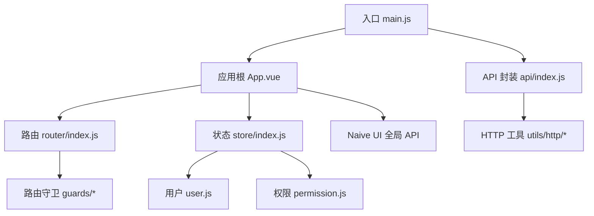
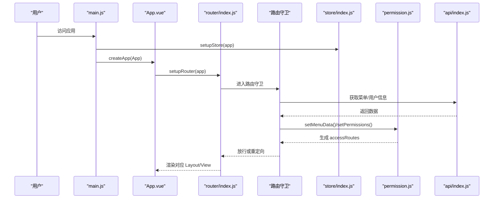
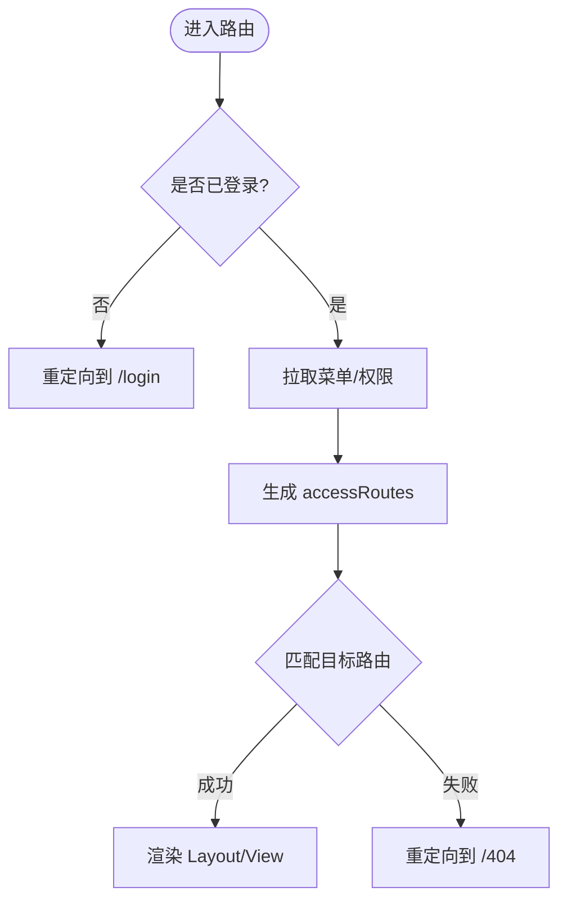
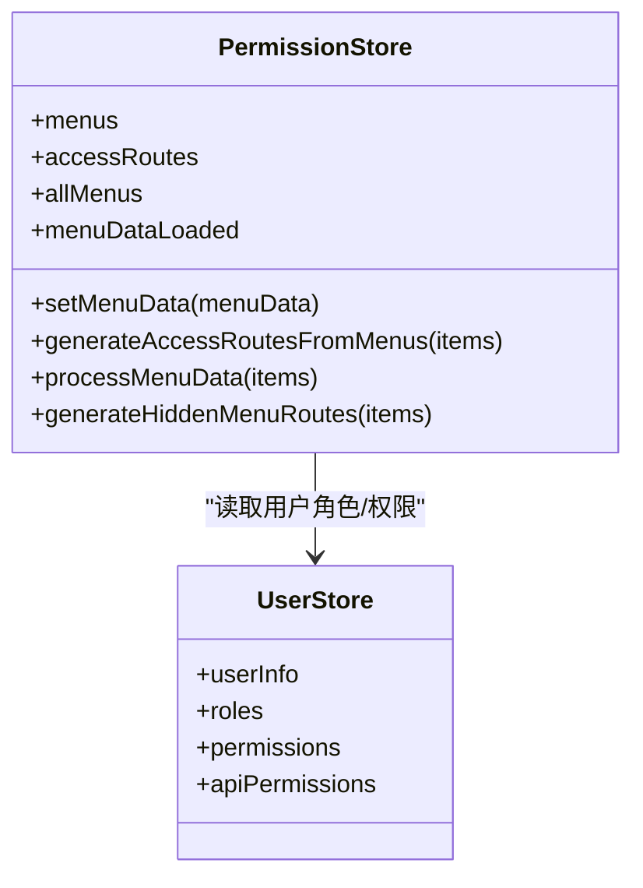
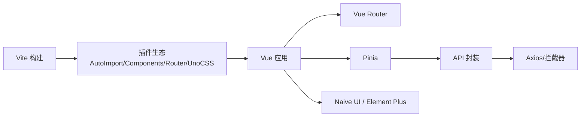

# 前端架构设计

<cite>
**本文引用的文件**
- [package.json](file://forge-admin-ui/package.json)
- [vite.config.js](file://forge-admin-ui/vite.config.js)
- [main.js](file://forge-admin-ui/src/main.js)
- [App.vue](file://forge-admin-ui/src/App.vue)
- [router/index.js](file://forge-admin-ui/src/router/index.js)
- [store/index.js](file://forge-admin-ui/src/store/index.js)
- [api/index.js](file://forge-admin-ui/src/api/index.js)
- [utils/index.js](file://forge-admin-ui/src/utils/index.js)
- [store/modules/permission.js](file://forge-admin-ui/src/store/modules/permission.js)
- [store/modules/user.js](file://forge-admin-ui/src/store/modules/user.js)
</cite>

## 目录
1. [简介](#简介)
2. [项目结构](#项目结构)
3. [核心组件](#核心组件)
4. [架构总览](#架构总览)
5. [详细组件分析](#详细组件分析)
6. [依赖关系分析](#依赖关系分析)
7. [性能与构建优化](#性能与构建优化)
8. [故障排查指南](#故障排查指南)
9. [结论](#结论)
10. [附录](#附录)

## 简介
本文件为 Forge Admin 的前端架构设计文档，面向基于 Vue 3.5 + TypeScript 的技术栈（实际工程以 JavaScript 为主，但类型声明与生态兼容 TS），围绕路由、状态管理、UI 组件库、构建工具、模块化组织、多端适配、动态路由与权限控制、工程化实践以及低代码平台前端实现进行系统化说明。目标是帮助开发者快速理解整体架构、关键流程与扩展点，并在 PC、H5、小程序等客户端上保持一致的开发体验。

## 项目结构
Forge Admin 前端位于 forge-admin-ui 目录，采用“功能域 + 分层”的目录组织方式：
- src/api：按业务域划分的接口封装（如 ai、system、business、flow 等）
- src/components：通用与业务组件（含低代码相关组件）
- src/composables：可复用组合式逻辑（如 useMenu、useUser、useForm 等）
- src/config：主题与白名单配置
- src/directives：自定义指令
- src/layouts：布局体系（normal、full、simple、top-menu、app-portal 等）
- src/router：路由定义与守卫
- src/store：Pinia 状态模块（user、permission、tab、tenant 等）
- src/styles：全局样式与主题变量
- src/utils：工具函数（http、crypto、storage、websocket 等）
- src/views：页面视图（按业务域划分）

图表来源
- [main.js:20-50](file://forge-admin-ui/src/main.js#L20-L50)
- [App.vue:1-40](file://forge-admin-ui/src/App.vue#L1-L40)
- [router/index.js:274-286](file://forge-admin-ui/src/router/index.js#L274-L286)
- [store/index.js:4-8](file://forge-admin-ui/src/store/index.js#L4-L8)
- [api/index.js:1-37](file://forge-admin-ui/src/api/index.js#L1-L37)

章节来源
- [main.js:20-50](file://forge-admin-ui/src/main.js#L20-L50)
- [App.vue:1-40](file://forge-admin-ui/src/App.vue#L1-L40)
- [router/index.js:274-286](file://forge-admin-ui/src/router/index.js#L274-L286)
- [store/index.js:4-8](file://forge-admin-ui/src/store/index.js#L4-L8)
- [api/index.js:1-37](file://forge-admin-ui/src/api/index.js#L1-L37)

## 核心组件
- 技术栈选型
  - 框架：Vue 3.5（Composition API、响应式系统）
  - 路由：Vue Router 4（支持自动路由生成与手动路由合并）
  - 状态：Pinia（持久化插件 pinia-plugin-persistedstate）
  - UI：Naive UI（主题覆盖、暗色模式、全局消息/对话框）
  - 构建：Vite 8（插件生态丰富、开发体验优秀）
  - CSS：UnoCSS（原子化 CSS）、SCSS（变量注入）
  - 其他：Axios、ECharts、CodeMirror、BPMN JS、WebSocket/SSE、加密工具等

- 启动流程
  - 初始化调试控制台与运行时加密配置
  - 创建 Vue 应用实例并挂载 Pinia
  - 初始化 Naive UI 全局离散 API（$message 等）
  - 注册指令、应用主题配置
  - 企微免登处理（必要时重定向）
  - 安装路由并挂载到 DOM

- 根组件职责
  - 提供 Naive UI 主题上下文（语言、日期、暗色模式、主题覆盖）
  - 根据路由元信息动态选择 Layout 组件
  - KeepAlive 缓存策略与 Tab 页联动
  - 全局水印与加载遮罩

章节来源
- [package.json:19-73](file://forge-admin-ui/package.json#L19-L73)
- [main.js:20-50](file://forge-admin-ui/src/main.js#L20-L50)
- [App.vue:1-40](file://forge-admin-ui/src/App.vue#L1-L40)
- [App.vue:43-149](file://forge-admin-ui/src/App.vue#L43-L149)

## 架构总览
前端采用“路由驱动 + 状态集中 + 组件复用 + 工具解耦”的分层架构：
- 表现层：Layouts + Views + Components
- 路由层：自动路由 + 手动路由 + 守卫（鉴权、标题、Tab、页面加载）
- 状态层：Pinia 模块（用户、权限、租户、标签页等）
- 数据层：API 封装（统一请求、拦截器、错误处理、加密）
- 基础设施：Vite 构建、UnoCSS、主题系统、调试与监控

图表来源
- [main.js:20-50](file://forge-admin-ui/src/main.js#L20-L50)
- [router/index.js:274-286](file://forge-admin-ui/src/router/index.js#L274-L286)
- [store/index.js:4-8](file://forge-admin-ui/src/store/index.js#L4-L8)
- [store/modules/permission.js:34-43](file://forge-admin-ui/src/store/modules/permission.js#L34-L43)
- [api/index.js:11-19](file://forge-admin-ui/src/api/index.js#L11-L19)

## 详细组件分析

### 路由与动态路由
- 自动路由：通过 unplugin-vue-router 扫描 views 目录生成路由，排除特定子目录
- 手动路由：登录、回调、404/403、工作台、应用门户、iframe、AI 动态页面等
- 兜底路由：未匹配时重定向至 404
- 历史模式：支持 Hash 与 History，由环境变量控制
- 动态路由生成：从后端菜单数据生成可访问路由（accessRoutes），并保留隐藏菜单的路由用于元信息补全

图表来源
- [router/index.js:24-286](file://forge-admin-ui/src/router/index.js#L24-L286)
- [store/modules/permission.js:93-146](file://forge-admin-ui/src/store/modules/permission.js#L93-L146)

章节来源
- [router/index.js:24-286](file://forge-admin-ui/src/router/index.js#L24-L286)
- [store/modules/permission.js:93-146](file://forge-admin-ui/src/store/modules/permission.js#L93-L146)

### 权限控制（菜单、按钮、API）
- 菜单权限：后端返回资源树，过滤目录/菜单类型，生成可见菜单与路由；隐藏菜单仍生成路由以保留 meta.title
- 按钮权限：在路由 meta 中携带按钮权限码集合，供组件级 v-permission 或条件渲染使用
- API 权限：结合用户信息中的 apiPermissions 与请求拦截器，对敏感接口进行前置校验或签名
- 权限状态：permissionStore 维护 menus、accessRoutes、allMenus、menuDataLoaded 等

图表来源
- [store/modules/permission.js:14-43](file://forge-admin-ui/src/store/modules/permission.js#L14-L43)
- [store/modules/user.js:26-107](file://forge-admin-ui/src/store/modules/user.js#L26-L107)

章节来源
- [store/modules/permission.js:14-43](file://forge-admin-ui/src/store/modules/permission.js#L14-L43)
- [store/modules/user.js:26-107](file://forge-admin-ui/src/store/modules/user.js#L26-L107)

### 状态管理（Pinia）
- 初始化：createPinia + 持久化插件，支持跨会话存储
- 模块划分：user（用户信息、角色、权限）、permission（菜单与路由）、tab（标签页缓存）、tenant（租户切换）、router（路由相关状态）等
- 主题与布局：appStore 管理主题、布局、字体缩放等

章节来源
- [store/index.js:4-8](file://forge-admin-ui/src/store/index.js#L4-L8)
- [store/modules/user.js:26-137](file://forge-admin-ui/src/store/modules/user.js#L26-L137)
- [store/modules/permission.js:14-43](file://forge-admin-ui/src/store/modules/permission.js#L14-L43)

### API 封装与请求治理
- 统一入口：api/index.js 暴露常用接口（用户、菜单、租户、组织等）
- 请求工具：通过 utils 导出 request（封装 Axios），支持拦截器、错误提示、重试、加密等
- 代理与跨域：Vite 开发服务器配置多段代理（主服务、流程服务、工作区、WebSocket）

章节来源
- [api/index.js:1-37](file://forge-admin-ui/src/api/index.js#L1-L37)
- [utils/index.js:1-15](file://forge-admin-ui/src/utils/index.js#L1-L15)
- [vite.config.js:120-158](file://forge-admin-ui/vite.config.js#L120-L158)

### 多端适配架构（PC、H5、小程序）
- 统一模式：共享路由与状态模型、统一的 API 封装与权限机制
- 差异化处理：
  - PC：完整 Layout 体系（normal/full/simple/top-menu/nexus/app-portal）
  - H5：轻量布局与移动端交互优化（触摸、键盘避让、视口适配）
  - 小程序：通过 uni-app 工程（forge-h5-ui）复用业务逻辑与 API，适配小程序生命周期与能力
- 运行时检测：根据环境或 UA 切换布局与组件行为

章节来源
- [App.vue:18-33](file://forge-admin-ui/src/App.vue#L18-L33)
- [vite.config.js:120-158](file://forge-admin-ui/vite.config.js#L120-L158)

### 低代码平台前端实现
- 表单设计器：集成 @form-create/designer 与 Element Plus 渲染器，支持可视化拖拽与规则引擎
- 表格组件：基于 ECharts 与自研表格组件，支持列配置、筛选、排序、导出
- 可视化编辑器：BPMN JS + diagram-js 实现流程图编辑与属性面板
- 运行时：低代码页面通过动态路由与组件懒加载渲染，支持预览与发布

章节来源
- [package.json:26-73](file://forge-admin-ui/package.json#L26-L73)
- [vite.config.js:66-108](file://forge-admin-ui/vite.config.js#L66-L108)

## 依赖关系分析
- 构建与插件
  - Vite + Vue 插件 + JSX 支持
  - UnoCSS 原子化样式
  - AutoImport 与 Components 自动导入
  - unplugin-vue-router 自动生成路由
  - 自定义插件：页面路径生成、图标生成、路由警告移除
- 运行依赖
  - Vue 3.5、Vue Router 4、Pinia
  - Naive UI、Element Plus（部分低代码场景）
  - ECharts、CodeMirror、BPMN JS、WebSocket/SSE、加密工具等

图表来源
- [vite.config.js:21-53](file://forge-admin-ui/vite.config.js#L21-L53)
- [package.json:19-105](file://forge-admin-ui/package.json#L19-L105)

章节来源
- [vite.config.js:21-53](file://forge-admin-ui/vite.config.js#L21-L53)
- [package.json:19-105](file://forge-admin-ui/package.json#L19-L105)

## 性能与构建优化
- 构建优化
  - 关闭 sourcemap 与压缩体积上报，降低内存占用
  - 使用 oxc 压缩器替代 esbuild，减少内存压力
  - CSS 压缩使用 esbuild，避免 lightningcss 严格注释问题
  - chunkSizeWarningLimit 调整，避免大包告警
- 依赖预构建：optimizeDeps.include 显式包含大依赖，提升首次加载速度
- 路由与组件懒加载：按需引入与异步组件，减少首屏体积
- 主题与样式：UnoCSS 原子化，SCSS 变量注入，减少重复样式

章节来源
- [vite.config.js:160-173](file://forge-admin-ui/vite.config.js#L160-L173)
- [vite.config.js:66-108](file://forge-admin-ui/vite.config.js#L66-L108)

## 故障排查指南
- 路由跳转异常
  - 检查自动路由生成与手动路由合并是否正确
  - 确认路由守卫是否放行或重定向
  - 查看浏览器控制台是否有 No match found 警告（已移除不必要警告）
- 菜单与权限问题
  - 确认后端返回的资源树结构与字段映射
  - 检查 permissionStore 的 processMenuData 与 generateAccessRoutesFromMenus 逻辑
- 网络请求失败
  - 检查 Vite 代理配置与后端地址
  - 查看请求头与响应头（x-real-url）定位真实地址
  - 确认是否需要加密或签名
- 构建内存不足
  - 调整 Node 最大堆大小（脚本中已设置）
  - 关闭不必要的报告与 sourcemap
  - 使用 oxc 压缩器

章节来源
- [vite.config.js:120-158](file://forge-admin-ui/vite.config.js#L120-L158)
- [store/modules/permission.js:149-256](file://forge-admin-ui/src/store/modules/permission.js#L149-L256)
- [router/index.js:258-286](file://forge-admin-ui/src/router/index.js#L258-L286)

## 结论
Forge Admin 前端以 Vue 3.5 + Vite + Pinia + Naive UI 为核心，构建了高内聚、低耦合、可扩展的管理后台架构。通过自动路由与动态路由生成、完善的权限体系、统一的 API 封装与构建优化，实现了在多端环境下的一致开发与高效交付。低代码能力的集成进一步提升了业务页面的生产效率。建议在后续迭代中持续完善错误追踪、性能监控与测试覆盖率，确保系统的稳定性与可维护性。

## 附录
- 环境变量与构建参数
  - VITE_HTTP_PORT、VITE_REQUEST_PREFIX、VITE_PUBLIC_PATH、VITE_HTTP_PROXY_TARGET、VITE_FLOW_PROXY_TARGET、VITE_OUT_DIR、VITE_USE_HASH、VITE_HOME_PATH
- 推荐实践
  - 新增页面遵循 views 目录命名规范，配合自动路由
  - 新增接口在 api 下按域拆分，统一通过 request 调用
  - 新增权限点在菜单与按钮层面同步配置，保持前后端一致
  - 使用 Composables 抽取复杂逻辑，提高复用性
  - 使用 UnoCSS 与 SCSS 变量统一管理样式