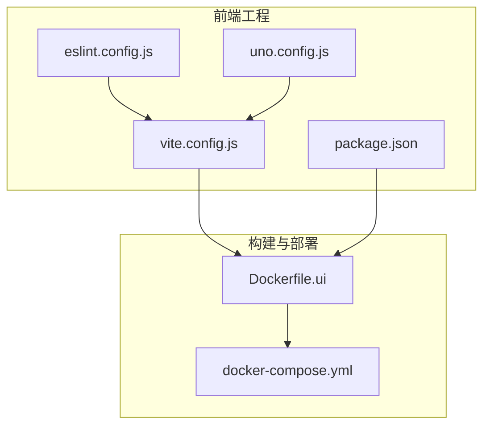
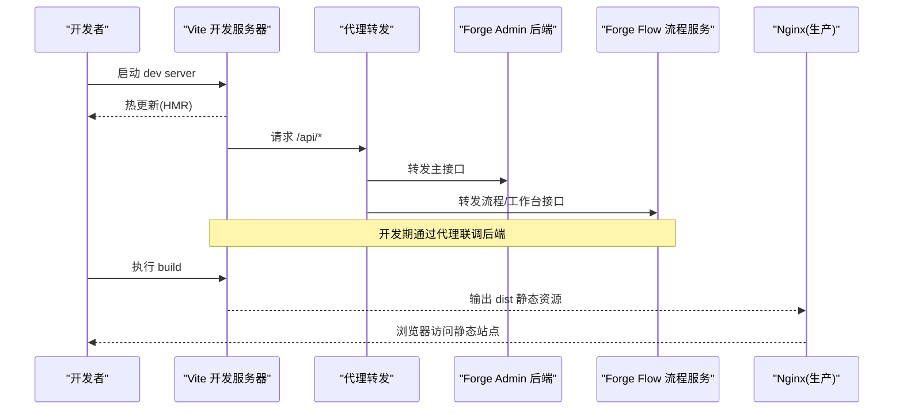
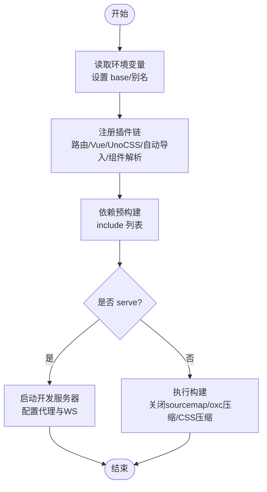
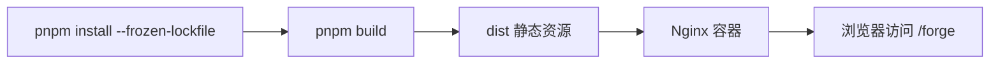
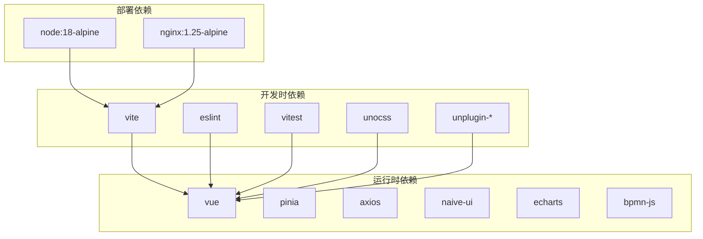

# 工程化实践

<cite>
**本文引用的文件**
- [vite.config.js](file://forge-admin-ui/vite.config.js)
- [package.json](file://forge-admin-ui/package.json)
- [eslint.config.js](file://forge-admin-ui/eslint.config.js)
- [uno.config.js](file://forge-admin-ui/uno.config.js)
- [Dockerfile.ui](file://docker/Dockerfile.ui)
- [docker-compose.yml](file://docker/docker-compose.yml)
</cite>

## 目录
1. [简介](#简介)
2. [项目结构](#项目结构)
3. [核心组件](#核心组件)
4. [架构总览](#架构总览)
5. [详细组件分析](#详细组件分析)
6. [依赖分析](#依赖分析)
7. [性能考虑](#性能考虑)
8. [故障排查指南](#故障排查指南)
9. [结论](#结论)
10. [附录](#附录)

## 简介
本文件面向 Forge Admin 前端工程化实践，围绕构建工具配置、代码质量保障、开发体验优化、部署流水线与运维自动化、性能监控与质量保证、团队协作规范等维度进行系统化说明。重点覆盖 Vite 开发服务器与生产构建优化、代码分割与资源压缩、ESLint/Prettier/Git Hooks 等质量门禁、Mock 与调试工具集成、错误上报与用户体验监控、CI/CD 与 Docker 容器化、环境变量管理、版本发布策略以及团队协作最佳实践。

## 项目结构
Forge Admin 前端位于 forge-admin-ui 目录，采用 Vite + Vue3 + UnoCSS + Naive UI 的工程化方案；通过 pnpm 管理依赖，使用 ESLint 统一代码风格，Vitest 提供单元测试能力；生产产物由 Nginx 静态托管，后端服务与流程服务通过 Docker Compose 编排运行。

图表来源
- [vite.config.js:14-176](file://forge-admin-ui/vite.config.js#L14-L176)
- [package.json:6-17](file://forge-admin-ui/package.json#L6-L17)
- [Dockerfile.ui:5-16](file://docker/Dockerfile.ui#L5-L16)
- [docker-compose.yml:137-149](file://docker/docker-compose.yml#L137-L149)

章节来源
- [vite.config.js:14-176](file://forge-admin-ui/vite.config.js#L14-L176)
- [package.json:6-17](file://forge-admin-ui/package.json#L6-L17)

## 核心组件
- 构建与插件：Vite 作为开发与构建核心，集成 Vue、Vue JSX、UnoCSS、自动导入、组件按需引入、路由生成、开发工具等插件。
- 样式系统：UnoCSS 原子化 CSS，配合预设与自定义主题、快捷方式、图标集合。
- 代码质量：ESLint 基于 antfu 配置，启用 Unocss、格式化、风格规则与全局 API 声明。
- 测试：Vitest 提供单元与 UI 测试能力。
- 部署：Nginx 静态托管构建产物，Docker Compose 编排数据库、缓存、后端与前端服务。

章节来源
- [vite.config.js:21-53](file://forge-admin-ui/vite.config.js#L21-L53)
- [uno.config.js:9-29](file://forge-admin-ui/uno.config.js#L9-L29)
- [eslint.config.js:1-39](file://forge-admin-ui/eslint.config.js#L1-L39)
- [package.json:75-105](file://forge-admin-ui/package.json#L75-L105)

## 架构总览
下图展示从开发到生产的完整链路：开发者在本地通过 Vite 启动开发服务器（含热重载与代理），构建阶段执行代码压缩与分包，产出静态资源后由 Nginx 提供服务；后端与流程服务通过 Docker Compose 编排，统一网络与数据卷管理。

图表来源
- [vite.config.js:120-158](file://forge-admin-ui/vite.config.js#L120-L158)
- [docker-compose.yml:61-149](file://docker/docker-compose.yml#L61-L149)
- [Dockerfile.ui:5-16](file://docker/Dockerfile.ui#L5-L16)

## 详细组件分析

### Vite 开发服务器与构建配置
- 基础路径与别名：通过环境变量控制 base，设置 src 与根目录别名，简化模块引用。
- 插件链：按顺序注册路由生成、Vue、JSX、开发工具、UnoCSS、自动导入、组件按需解析、页面路径与图标虚拟模块、路由警告优化等。
- 依赖预构建：对大型或冷启动慢的依赖进行 include 预构建，减少首次加载时间。
- CSS 预处理：注入全局 SCSS 变量，便于主题与样式复用。
- 开发服务器：端口与环境变量驱动，支持多路径代理（流程服务、工作台、主接口）与 WebSocket 代理，便于前后端联调。
- 生产构建：关闭 sourcemap、限制 chunk 大小告警、可配置输出目录、关闭体积上报、使用 oxc 压缩 JS、esbuild 压缩 CSS，降低内存占用并提升构建速度。

图表来源
- [vite.config.js:14-176](file://forge-admin-ui/vite.config.js#L14-L176)

章节来源
- [vite.config.js:14-176](file://forge-admin-ui/vite.config.js#L14-L176)

### 代码分割与资源优化策略
- 分包阈值：通过 chunkSizeWarningLimit 控制大包告警，避免单包过大影响首屏。
- 压缩器选择：JS 使用 oxc 压缩，内存更低且速度快；CSS 使用 esbuild 压缩，兼容性好。
- 体积报告：关闭 reportCompressedSize，降低构建内存峰值。
- 依赖预构建：将常用大依赖纳入 optimizeDeps.include，减少冷启动与二次优化带来的延迟。
- 路由与组件懒加载：结合 unplugin-vue-router 与按需组件解析，实现页面级与组件级拆分。

章节来源
- [vite.config.js:66-109](file://forge-admin-ui/vite.config.js#L66-L109)
- [vite.config.js:160-173](file://forge-admin-ui/vite.config.js#L160-L173)

### 样式系统与主题
- UnoCSS 预设：Wind3、Attributify、Icons、rem-to-px 转换，统一响应式与图标体系。
- 自定义主题：定义语义化颜色与暗色模式变量，保持视觉一致性。
- 快捷方式：封装常用布局与交互类名，提升开发效率。
- 图标集合：通过文件系统加载自定义图标集，safelist 确保按需生成。

章节来源
- [uno.config.js:9-59](file://forge-admin-ui/uno.config.js#L9-L59)

### 代码质量保障
- ESLint：基于 @antfu/eslint-config，启用 Unocss、格式化、风格规则，关闭部分不适用的规则，声明全局 API（如 Vue 组合式 API、Naive UI 消息等）。
- Prettier：可通过 eslint-plugin-format 与统一格式化工具链协同工作（本项目以 ESLint 为主，Prettier 可在团队中按需启用）。
- Git Hooks：当前仓库未包含 .husky 目录，建议引入 husky + lint-staged 在提交前执行 ESLint 修复与格式化，保证代码质量门禁。
- 脚本命令：提供 lint:fix 一键修复命令，便于本地快速修正。

章节来源
- [eslint.config.js:1-39](file://forge-admin-ui/eslint.config.js#L1-L39)
- [package.json:11-12](file://forge-admin-ui/package.json#L11-L12)

### 开发体验优化
- 热重载：Vite 内置 HMR，配合 Vue 插件与路由监听，实现秒级刷新。
- Mock 数据服务：可在 vite.config.js 的 server.proxy 基础上扩展 mock 中间件，或使用独立 mock 服务对接代理路径。
- 调试工具：开发模式下启用 vite-plugin-vue-devtools，增强组件状态与路由调试能力。
- 错误监控上报：建议在应用层接入错误捕获与上报 SDK（如 Sentry），并在构建时通过环境变量开关上报行为。

章节来源
- [vite.config.js:21-53](file://forge-admin-ui/vite.config.js#L21-L53)
- [vite.config.js:120-158](file://forge-admin-ui/vite.config.js#L120-L158)

### 部署流水线与容器化
- 前端镜像：基于 node:18-alpine 构建，安装 pnpm 并冻结锁文件，复制源码后执行构建；最终产物复制到 nginx 静态目录。
- Nginx 配置：将构建产物挂载至 /usr/share/nginx/html/forge，对外暴露 80 端口。
- 服务编排：docker-compose.yml 编排 MySQL、Redis、Forge Flow、Forge Admin、Nginx，统一网络与数据卷，提供健康检查与依赖启动顺序。
- 环境变量：通过 .env 或 compose 环境变量注入数据库、缓存、服务地址与加密相关参数，便于多环境切换。

图表来源
- [Dockerfile.ui:5-16](file://docker/Dockerfile.ui#L5-L16)
- [docker-compose.yml:137-149](file://docker/docker-compose.yml#L137-L149)

章节来源
- [Dockerfile.ui:5-16](file://docker/Dockerfile.ui#L5-L16)
- [docker-compose.yml:11-149](file://docker/docker-compose.yml#L11-L149)

### 性能监控与质量保证
- 前端性能指标：可采集 LCP、FID、CLS、FCP 等指标，结合上报通道汇总到监控平台。
- 错误追踪：统一捕获运行时异常与 Promise 拒绝，附带上下文信息（用户、路由、设备）上报。
- 用户体验监控：记录关键操作耗时与失败率，辅助定位性能瓶颈。
- 构建质量：利用 chunk 告警与可视化分析（如 rollup-plugin-visualizer）识别冗余依赖与超大模块。

[本节为通用指导，不直接分析具体文件]

### 团队协作规范
- 分支管理：建议采用主干流或特性分支模型，结合 PR 合并与 CI 检查。
- 代码审查：强制 PR 审查，结合 ESLint 与测试用例保障质量。
- 依赖版本管理：使用 pnpm 与锁定文件，定期升级依赖并评估兼容性。
- 发布策略：采用语义化版本，结合标签与制品归档，回滚策略明确。

[本节为通用指导，不直接分析具体文件]

## 依赖分析
前端依赖分为运行时与开发时两类：运行时包括 Vue、Pinia、Axios、ECharts、Naive UI、BPMN 等；开发时包括 Vite、ESLint、Vitest、UnoCSS、自动导入与组件解析等。构建与部署依赖 Node 与 Nginx 镜像。

图表来源
- [package.json:19-73](file://forge-admin-ui/package.json#L19-L73)
- [package.json:75-105](file://forge-admin-ui/package.json#L75-L105)
- [Dockerfile.ui:5-16](file://docker/Dockerfile.ui#L5-L16)

章节来源
- [package.json:19-105](file://forge-admin-ui/package.json#L19-L105)
- [Dockerfile.ui:5-16](file://docker/Dockerfile.ui#L5-L16)

## 性能考虑
- 构建内存优化：关闭 sourcemap 与体积上报，使用 oxc 压缩 JS，降低内存峰值。
- 首屏优化：合理拆分路由与组件，预构建关键依赖，减少冷启动开销。
- 资源压缩：CSS 使用 esbuild 压缩，兼顾兼容性与速度。
- 缓存策略：Nginx 可对静态资源开启强缓存与协商缓存，提升重复访问性能。
- 监控反馈：结合性能指标与错误上报，持续优化用户体验。

[本节为通用指导，不直接分析具体文件]

## 故障排查指南
- 开发代理问题：检查 vite.config.js 中的 proxy 配置与目标地址是否正确，确认 WS 代理已启用。
- 构建失败：关注 chunk 大小告警与依赖预构建列表，必要时调整 include 或拆分模块。
- 环境变量缺失：核对 .env 与 docker-compose 的环境变量注入，确保后端连接信息正确。
- 权限与端口：确认 Nginx 与后端端口未被占用，容器网络互通正常。

章节来源
- [vite.config.js:120-158](file://forge-admin-ui/vite.config.js#L120-L158)
- [docker-compose.yml:11-149](file://docker/docker-compose.yml#L11-L149)

## 结论
Forge Admin 前端工程化以 Vite 为核心，结合 UnoCSS、ESLint、Vitest 与 Docker 容器化，形成了从开发、构建到部署的完整闭环。通过合理的依赖预构建、代码分割与压缩策略，显著提升了构建速度与运行性能；通过统一的代码质量规范与完善的部署编排，保障了团队协作与交付稳定性。后续可进一步引入 Git Hooks、性能监控与错误上报，完善质量保障与可观测性。

[本节为总结，不直接分析具体文件]

## 附录
- 常用命令
  - 开发：dev
  - 构建：build/build:prod
  - 预览：preview
  - 代码检查与修复：lint:fix
  - 测试：test/test:watch/test:ui

章节来源
- [package.json:6-17](file://forge-admin-ui/package.json#L6-L17)