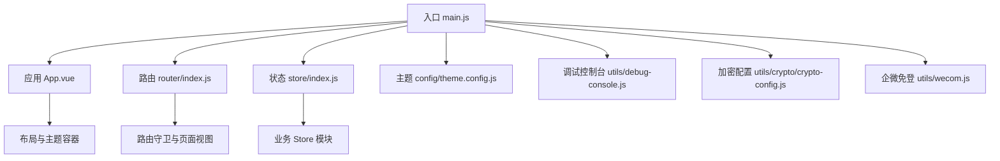
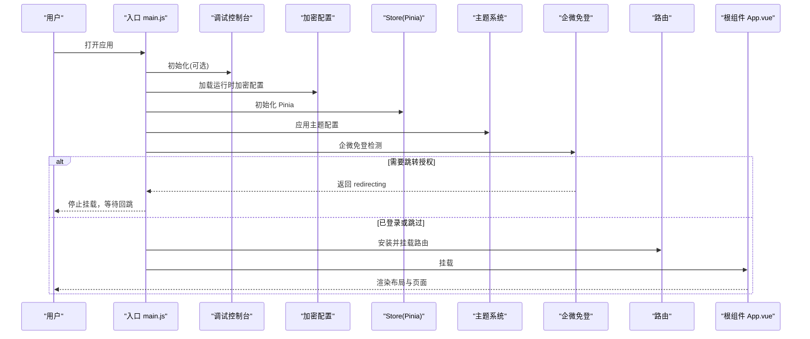
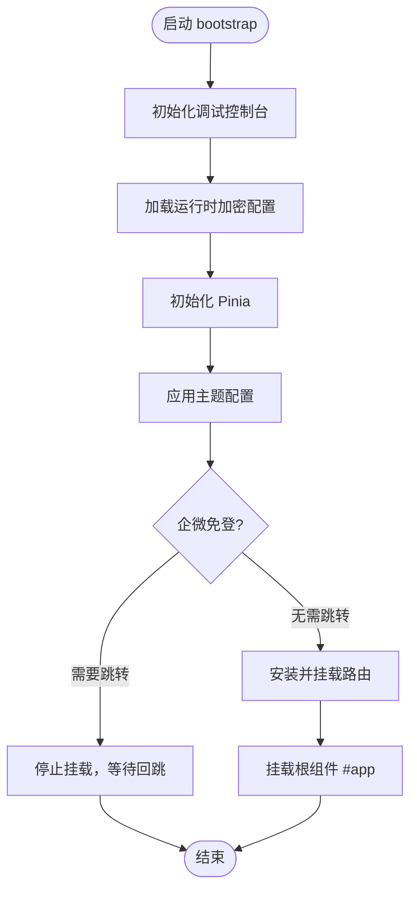
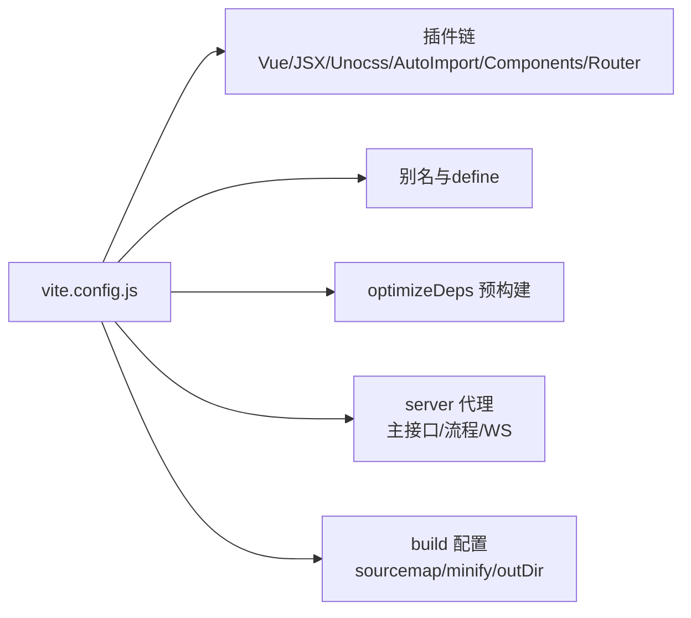
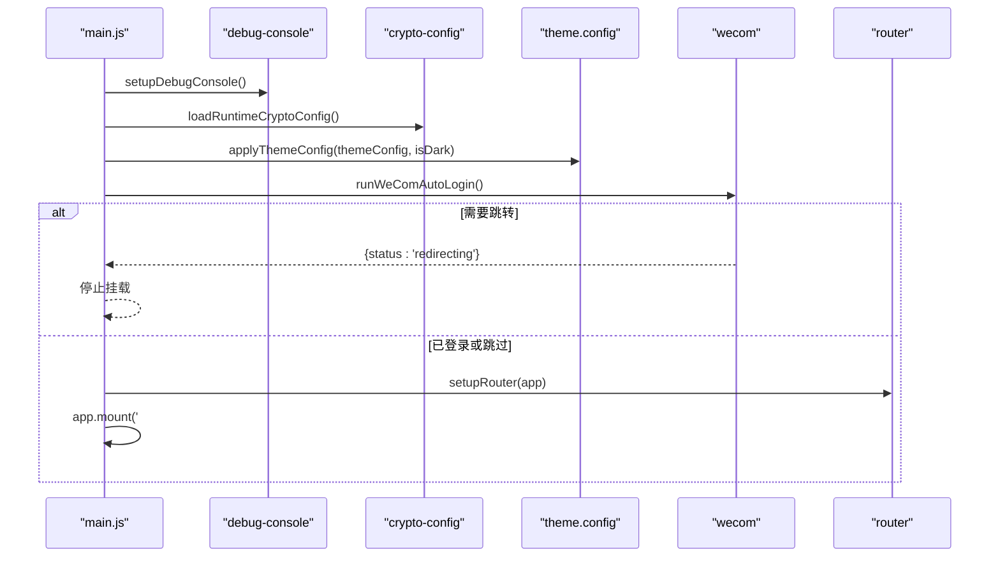
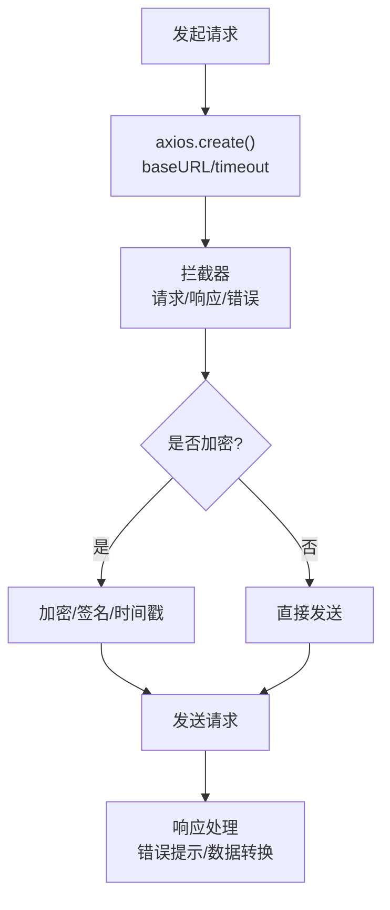
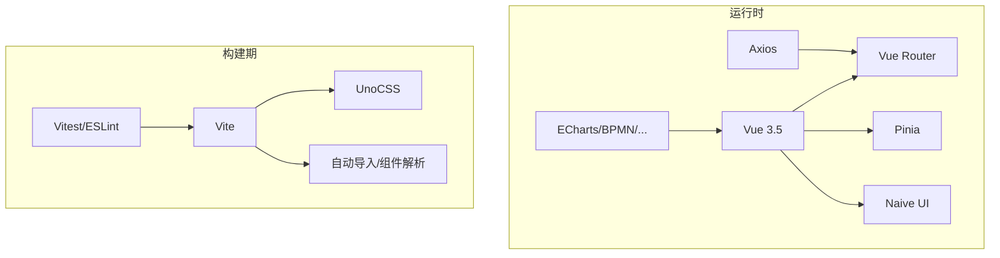

# 应用架构设计

<cite>
**本文引用的文件**
- [main.js](file://forge-admin-ui/src/main.js)
- [App.vue](file://forge-admin-ui/src/App.vue)
- [vite.config.js](file://forge-admin-ui/vite.config.js)
- [package.json](file://forge-admin-ui/package.json)
- [router/index.js](file://forge-admin-ui/src/router/index.js)
- [store/index.js](file://forge-admin-ui/src/store/index.js)
- [config/theme.config.js](file://forge-admin-ui/src/config/theme.config.js)
- [settings.js](file://forge-admin-ui/src/settings.js)
- [utils/http/index.js](file://forge-admin-ui/src/utils/http/index.js)
- [utils/crypto/crypto-config.js](file://forge-admin-ui/src/utils/crypto/crypto-config.js)
- [utils/wecom.js](file://forge-admin-ui/src/utils/wecom.js)
- [utils/debug-console.js](file://forge-admin-ui/src/utils/debug-console.js)
</cite>

## 目录
1. [简介](#简介)
2. [项目结构](#项目结构)
3. [核心组件](#核心组件)
4. [架构总览](#架构总览)
5. [详细组件分析](#详细组件分析)
6. [依赖关系分析](#依赖关系分析)
7. [性能考虑](#性能考虑)
8. [故障排查指南](#故障排查指南)
9. [结论](#结论)
10. [附录](#附录)

## 简介
本文件面向 Forge Admin 前端（基于 Vue 3.5 + Vite）的架构设计与实现，重点覆盖：
- 应用初始化流程：启动顺序、插件注册、全局配置加载、主题与调试面板初始化、企业微信自动登录处理。
- Vite 构建配置：开发环境优化、生产打包策略、代码分割与分包优化。
- 目录结构与组织原则：src 下各模块职责、命名规范与模块划分。
- 多环境配置管理：开发/测试/生产的差异化配置方式。
- 前后端通信机制：Axios 封装、拦截器、错误处理、加密与防重放策略。

## 项目结构
Forge Admin 前端位于 forge-admin-ui 目录，采用“按能力分层 + 按领域子域”的组织方式：
- src/main.js：应用入口，负责启动顺序编排、插件与全局能力装配。
- src/App.vue：根组件，提供主题容器、布局切换、水印与全局加载态。
- src/router/index.js：路由定义与守卫挂载，合并手动路由与自动路由。
- src/store/index.js：Pinia 初始化与持久化插件接入。
- src/config/theme.config.js：主题与布局样式变量集中管理。
- src/settings.js：默认布局、主题色与可用布局枚举。
- src/utils/http/index.js：Axios 实例创建与基础配置。
- src/utils/crypto/crypto-config.js：运行时加解密与防重放策略配置。
- src/utils/wecom.js：企业微信 PC 客户端免登流程。
- src/utils/debug-console.js：页内调试面板（vConsole）按需加载。
- vite.config.js：Vite 构建与开发服务器配置。
- package.json：脚本命令与依赖声明。

图表来源
- [main.js:20-53](file://forge-admin-ui/src/main.js#L20-L53)
- [App.vue:1-41](file://forge-admin-ui/src/App.vue#L1-L41)
- [router/index.js:263-286](file://forge-admin-ui/src/router/index.js#L263-L286)
- [store/index.js:4-8](file://forge-admin-ui/src/store/index.js#L4-L8)
- [config/theme.config.js:145-229](file://forge-admin-ui/src/config/theme.config.js#L145-L229)
- [utils/debug-console.js:8-45](file://forge-admin-ui/src/utils/debug-console.js#L8-L45)
- [utils/crypto/crypto-config.js:110-132](file://forge-admin-ui/src/utils/crypto/crypto-config.js#L110-L132)
- [utils/wecom.js:67-139](file://forge-admin-ui/src/utils/wecom.js#L67-L139)

章节来源
- [main.js:20-53](file://forge-admin-ui/src/main.js#L20-L53)
- [App.vue:1-41](file://forge-admin-ui/src/App.vue#L1-L41)
- [router/index.js:263-286](file://forge-admin-ui/src/router/index.js#L263-L286)
- [store/index.js:4-8](file://forge-admin-ui/src/store/index.js#L4-L8)
- [config/theme.config.js:145-229](file://forge-admin-ui/src/config/theme.config.js#L145-L229)
- [utils/debug-console.js:8-45](file://forge-admin-ui/src/utils/debug-console.js#L8-L45)
- [utils/crypto/crypto-config.js:110-132](file://forge-admin-ui/src/utils/crypto/crypto-config.js#L110-L132)
- [utils/wecom.js:67-139](file://forge-admin-ui/src/utils/wecom.js#L67-L139)

## 核心组件
- 应用入口与启动编排：在 main.js 中按序执行调试控制台初始化、加密配置加载、Store 初始化、Naive UI 离散 API 注入、指令注册、主题应用、企微免登、路由挂载与根节点挂载。
- 根组件与主题容器：App.vue 通过 Naive UI 的 ConfigProvider 统一主题、语言与覆盖项；根据路由动态选择布局组件；维护全局加载态与水印层。
- 路由系统：router/index.js 合并手动路由与自动路由，支持 Hash/History 模式切换，并在 setupRouter 中安装并挂载守卫。
- 状态管理：store/index.js 使用 Pinia 并启用持久化插件，后续业务模块按需扩展。
- 主题系统：config/theme.config.js 集中管理主题色、菜单与头部样式变量，并通过 applyThemeConfig 写入 CSS 变量；settings.js 提供默认布局与主题色等常量。
- HTTP 请求：utils/http/index.js 提供带 baseURL 与超时的 Axios 实例，并统一挂载拦截器。
- 安全与加密：utils/crypto/crypto-config.js 提供运行期可裁剪的加解密与防重放策略，支持从后端拉取配置并安全归一化。
- 企业微信免登：utils/wecom.js 在企业微信内置浏览器中完成授权跳转或回调换票登录，成功后仅写 token，由路由守卫继续补齐用户信息与菜单。
- 调试控制台：utils/debug-console.js 支持通过 URL 参数开启 vConsole，便于在受限环境中调试。

章节来源
- [main.js:20-53](file://forge-admin-ui/src/main.js#L20-L53)
- [App.vue:1-41](file://forge-admin-ui/src/App.vue#L1-L41)
- [router/index.js:263-286](file://forge-admin-ui/src/router/index.js#L263-L286)
- [store/index.js:4-8](file://forge-admin-ui/src/store/index.js#L4-L8)
- [config/theme.config.js:145-229](file://forge-admin-ui/src/config/theme.config.js#L145-L229)
- [settings.js:21-39](file://forge-admin-ui/src/settings.js#L21-L39)
- [utils/http/index.js:4-17](file://forge-admin-ui/src/utils/http/index.js#L4-L17)
- [utils/crypto/crypto-config.js:27-53](file://forge-admin-ui/src/utils/crypto/crypto-config.js#L27-L53)
- [utils/wecom.js:67-139](file://forge-admin-ui/src/utils/wecom.js#L67-L139)
- [utils/debug-console.js:8-45](file://forge-admin-ui/src/utils/debug-console.js#L8-L45)

## 架构总览
下图展示了应用启动到渲染的关键路径，以及各子系统之间的协作关系。

图表来源
- [main.js:20-53](file://forge-admin-ui/src/main.js#L20-L53)
- [utils/debug-console.js:8-45](file://forge-admin-ui/src/utils/debug-console.js#L8-L45)
- [utils/crypto/crypto-config.js:110-132](file://forge-admin-ui/src/utils/crypto/crypto-config.js#L110-L132)
- [store/index.js:4-8](file://forge-admin-ui/src/store/index.js#L4-L8)
- [config/theme.config.js:145-229](file://forge-admin-ui/src/config/theme.config.js#L145-L229)
- [utils/wecom.js:67-139](file://forge-admin-ui/src/utils/wecom.js#L67-L139)
- [router/index.js:283-286](file://forge-admin-ui/src/router/index.js#L283-L286)
- [App.vue:1-41](file://forge-admin-ui/src/App.vue#L1-L41)

## 详细组件分析

### 应用初始化流程（Vue 3.5 启动顺序）
- 调试控制台初始化：优先于其他逻辑，确保后续 console 可见。
- 加密配置加载：从后端获取运行时配置，进行安全归一化，决定后续请求是否加密与防重放策略。
- Store 初始化：先于 Naive UI 离散 API 初始化，因为后者可能依赖 store。
- 主题应用：读取 store 中的主题配置或默认配置，写入 CSS 变量。
- 企微免登：在企业微信内置浏览器中尝试免登，若需跳转则中止挂载，等待回跳后由路由守卫继续。
- 路由挂载与根节点挂载：完成所有前置准备后挂载路由与根组件。

图表来源
- [main.js:20-53](file://forge-admin-ui/src/main.js#L20-L53)
- [utils/debug-console.js:8-45](file://forge-admin-ui/src/utils/debug-console.js#L8-L45)
- [utils/crypto/crypto-config.js:110-132](file://forge-admin-ui/src/utils/crypto/crypto-config.js#L110-L132)
- [config/theme.config.js:145-229](file://forge-admin-ui/src/config/theme.config.js#L145-L229)
- [utils/wecom.js:67-139](file://forge-admin-ui/src/utils/wecom.js#L67-L139)

章节来源
- [main.js:20-53](file://forge-admin-ui/src/main.js#L20-L53)

### Vite 构建配置
- 插件链：Vue、JSX、Unocss、自动导入、组件自动解析、路由自动生成、开发工具、自定义插件（页面路径与图标）、移除非必要的路由警告。
- 别名与 define：@ 指向 src，~ 指向项目根；为依赖提供 globalThis 兼容对象。
- 依赖预构建：对大型或冷启动慢的库进行 include 预构建，提升首次加载速度。
- 开发服务器：端口、代理（主接口、流程服务、工作台、WebSocket），响应头注入真实地址以便调试。
- 构建产物：关闭 sourcemap、关闭体积上报、输出目录可配置、使用 oxc 压缩、CSS 压缩使用 esbuild。

图表来源
- [vite.config.js:14-53](file://forge-admin-ui/vite.config.js#L14-L53)
- [vite.config.js:54-65](file://forge-admin-ui/vite.config.js#L54-L65)
- [vite.config.js:66-109](file://forge-admin-ui/vite.config.js#L66-L109)
- [vite.config.js:120-158](file://forge-admin-ui/vite.config.js#L120-L158)
- [vite.config.js:160-173](file://forge-admin-ui/vite.config.js#L160-L173)

章节来源
- [vite.config.js:14-173](file://forge-admin-ui/vite.config.js#L14-L173)

### 目录结构设计原则
- src/main.js：应用启动编排，严格顺序控制，保证关键能力在挂载前就绪。
- src/App.vue：根容器，负责主题、布局、水印与全局加载态，不承载具体业务。
- src/router：路由定义与守卫，集中管理权限、菜单与页面访问控制。
- src/store：状态中心，按模块拆分（auth、user、permission、tab、tenant 等）。
- src/components：通用与业务组件，按功能域进一步细分。
- src/composables：组合式函数，复用跨组件逻辑。
- src/config：全局配置（如主题、布局常量）。
- src/constants：常量定义。
- src/directives：全局指令。
- src/layouts：布局组件集合，支持多种布局模式。
- src/plugins：第三方插件注册。
- src/styles：全局样式与主题变量。
- src/utils：工具函数与能力封装（HTTP、加密、存储、水印、菜单等）。
- src/views：页面级视图，配合自动路由生成。

章节来源
- [App.vue:1-41](file://forge-admin-ui/src/App.vue#L1-L41)
- [router/index.js:263-286](file://forge-admin-ui/src/router/index.js#L263-L286)
- [store/index.js:4-8](file://forge-admin-ui/src/store/index.js#L4-L8)
- [config/theme.config.js:145-229](file://forge-admin-ui/src/config/theme.config.js#L145-L229)
- [settings.js:21-39](file://forge-admin-ui/src/settings.js#L21-L39)

### 多环境配置管理
- 环境变量：通过 VITE_* 前缀暴露给前端，如 VITE_HTTP_PORT、VITE_REQUEST_PREFIX、VITE_PUBLIC_PATH、VITE_HTTP_PROXY_TARGET、VITE_FLOW_PROXY_TARGET、VITE_OUT_DIR、VITE_USE_HASH、VITE_USER_CLIENT、VITE_APP_ID 等。
- 构建期注入：vite.config.js 使用 loadEnv 读取 .env.* 文件，用于开发服务器端口、代理目标、输出目录等。
- 运行期使用：main.js、router/index.js、utils/http/index.js、utils/wecom.js 等通过 import.meta.env 读取环境变量，实现不同环境的差异化行为。
- 建议：将敏感信息放入后端下发的运行配置（如加密配置），前端只保留必要开关与基础地址。

章节来源
- [vite.config.js:14-17](file://forge-admin-ui/vite.config.js#L14-L17)
- [vite.config.js:120-158](file://forge-admin-ui/vite.config.js#L120-L158)
- [router/index.js:274-281](file://forge-admin-ui/src/router/index.js#L274-L281)
- [utils/http/index.js:4-17](file://forge-admin-ui/src/utils/http/index.js#L4-L17)
- [utils/wecom.js:22-24](file://forge-admin-ui/src/utils/wecom.js#L22-L24)

### 应用启动关键步骤详解
- 调试控制台初始化：支持 ?vdebug=1 开启，持久化至 localStorage，按需从 CDN 加载 vConsole，便于在受限环境调试。
- 加密配置加载：从 /crypto/config 拉取运行期配置，进行安全归一化，决定是否启用 API 级加解密、字段级展示、动态密钥与防重放策略。
- 主题配置应用：读取 store 中的主题配置或默认配置，调用 applyThemeConfig 写入 CSS 变量，影响全局组件与布局。
- 企业微信自动登录：在企业微信内置浏览器中，若无 code 则跳转授权；若有 code&state 则换票登录，成功后仅写 token，后续由路由守卫补全用户信息与菜单。

图表来源
- [main.js:20-53](file://forge-admin-ui/src/main.js#L20-L53)
- [utils/debug-console.js:8-45](file://forge-admin-ui/src/utils/debug-console.js#L8-L45)
- [utils/crypto/crypto-config.js:110-132](file://forge-admin-ui/src/utils/crypto/crypto-config.js#L110-L132)
- [config/theme.config.js:145-229](file://forge-admin-ui/src/config/theme.config.js#L145-L229)
- [utils/wecom.js:67-139](file://forge-admin-ui/src/utils/wecom.js#L67-L139)
- [router/index.js:283-286](file://forge-admin-ui/src/router/index.js#L283-L286)

章节来源
- [main.js:20-53](file://forge-admin-ui/src/main.js#L20-L53)

### 前后端通信机制
- Axios 实例：createAxios 提供 baseURL、超时等默认配置，并统一挂载拦截器；提供 noPrefixRequest 与 mockRequest 特殊场景实例。
- 拦截器与错误处理：interceptors 负责请求/响应拦截、错误提示与统一处理（具体实现位于 interceptors.js）。
- 加密与防重放：crypto-config.js 提供 shouldEncrypt 判断是否需要加密，结合后端下发的 exclude/include 路径与通配符匹配；支持动态密钥与防重放策略。
- 代理与 WebSocket：vite.config.js 配置开发代理与 WS 代理，便于本地联调。

图表来源
- [utils/http/index.js:4-17](file://forge-admin-ui/src/utils/http/index.js#L4-L17)
- [utils/crypto/crypto-config.js:150-181](file://forge-admin-ui/src/utils/crypto/crypto-config.js#L150-L181)
- [vite.config.js:120-158](file://forge-admin-ui/vite.config.js#L120-L158)

章节来源
- [utils/http/index.js:4-17](file://forge-admin-ui/src/utils/http/index.js#L4-L17)
- [utils/crypto/crypto-config.js:150-181](file://forge-admin-ui/src/utils/crypto/crypto-config.js#L150-L181)
- [vite.config.js:120-158](file://forge-admin-ui/vite.config.js#L120-L158)

## 依赖关系分析
- 运行时依赖：Vue 3.5、Vue Router、Pinia、Naive UI、Axios、ECharts、BPMN JS、Element Plus、UnoCSS、FormCreate、Dayjs、Crypto 相关库等。
- 构建依赖：Vite、Vue 插件、Unocss、自动导入、组件自动解析、路由自动生成、ESLint、Vitest、Sass 等。
- 脚本命令：dev/build/build:prod/preview/test 等，构建时增加内存限制以应对大项目。

图表来源
- [package.json:19-73](file://forge-admin-ui/package.json#L19-L73)
- [package.json:75-105](file://forge-admin-ui/package.json#L75-L105)
- [package.json:6-17](file://forge-admin-ui/package.json#L6-L17)

章节来源
- [package.json:6-17](file://forge-admin-ui/package.json#L6-L17)
- [package.json:19-73](file://forge-admin-ui/package.json#L19-L73)
- [package.json:75-105](file://forge-admin-ui/package.json#L75-L105)

## 性能考虑
- 依赖预构建：对大型库进行 include 预构建，减少冷启动时间与二次优化带来的卡顿。
- 构建优化：关闭 sourcemap 与体积上报，使用 oxc 压缩，降低构建内存占用与耗时。
- 路由懒加载：页面组件通过异步组件与自动路由生成，按需加载，减小首屏体积。
- 主题与样式：通过 CSS 变量与 UnoCSS 原子化样式，减少重复样式与运行时计算开销。
- 代理与缓存：开发环境代理减少跨域问题，生产环境可通过 CDN/静态资源缓存优化。

[本节为通用性能建议，不直接分析具体文件]

## 故障排查指南
- 调试控制台不可用：检查 URL 是否包含 ?vdebug=1，确认 localStorage 是否被清除；若 CDN 被拦截，改用远程调试。
- 加密配置加载失败：查看 /crypto/config 响应码与数据结构；若失败会保持安全默认开启，不影响基本功能。
- 企微免登异常：检查 UA 是否包含 wxwork、连接配置是否开启、code/state 是否正确；失败时会回退常规登录。
- 路由守卫阻塞：若路由守卫未完成，App.vue 会显示加载态；检查用户信息、菜单与权限数据是否正常加载。
- 代理与跨域：确认 VITE_REQUEST_PREFIX、VITE_HTTP_PROXY_TARGET、VITE_FLOW_PROXY_TARGET 配置正确；开发服务器日志可查看 x-real-url 响应头。

章节来源
- [utils/debug-console.js:8-45](file://forge-admin-ui/src/utils/debug-console.js#L8-L45)
- [utils/crypto/crypto-config.js:110-132](file://forge-admin-ui/src/utils/crypto/crypto-config.js#L110-L132)
- [utils/wecom.js:67-139](file://forge-admin-ui/src/utils/wecom.js#L67-L139)
- [App.vue:101-122](file://forge-admin-ui/src/App.vue#L101-L122)
- [vite.config.js:120-158](file://forge-admin-ui/vite.config.js#L120-L158)

## 结论
Forge Admin 前端采用清晰的启动编排与模块化架构，围绕 Vue 3.5 + Vite 构建了高效的开发与构建体系。通过统一的主题系统、安全的加密与防重放策略、灵活的路由与状态管理，以及完善的调试与排障手段，保障了复杂企业级应用的稳定性与可维护性。建议在后续迭代中持续优化首屏加载、依赖体积与错误监控，进一步提升用户体验与运维效率。

## 附录
- 环境变量清单（示例）：VITE_HTTP_PORT、VITE_REQUEST_PREFIX、VITE_PUBLIC_PATH、VITE_HTTP_PROXY_TARGET、VITE_FLOW_PROXY_TARGET、VITE_OUT_DIR、VITE_USE_HASH、VITE_USER_CLIENT、VITE_APP_ID。
- 常用脚本：dev、build、build:prod、preview、test、lint:fix。
- 主题与布局：可在 settings.js 与 config/theme.config.js 中调整默认布局、主题色与样式变量。

[本节为补充信息，不直接分析具体文件]