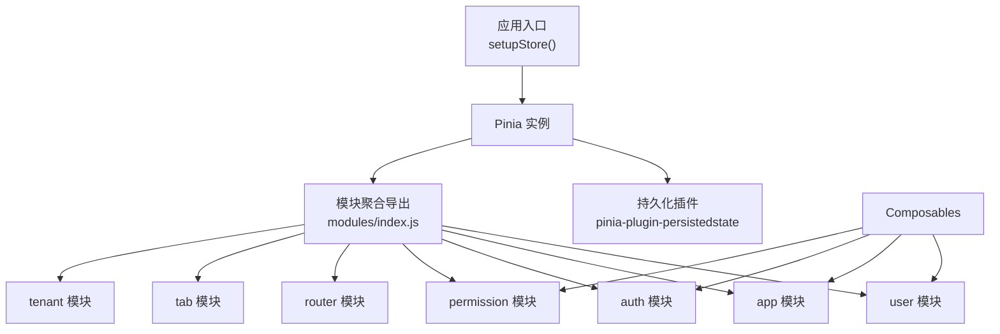
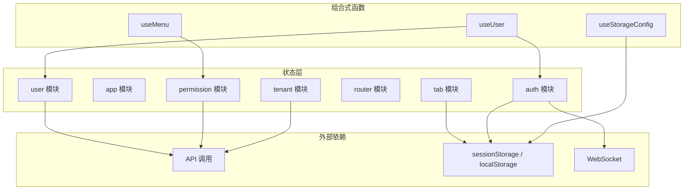
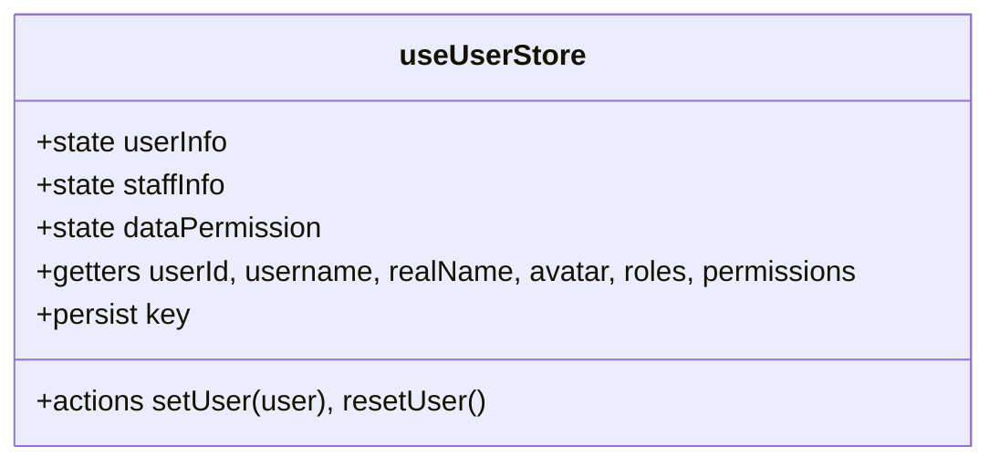
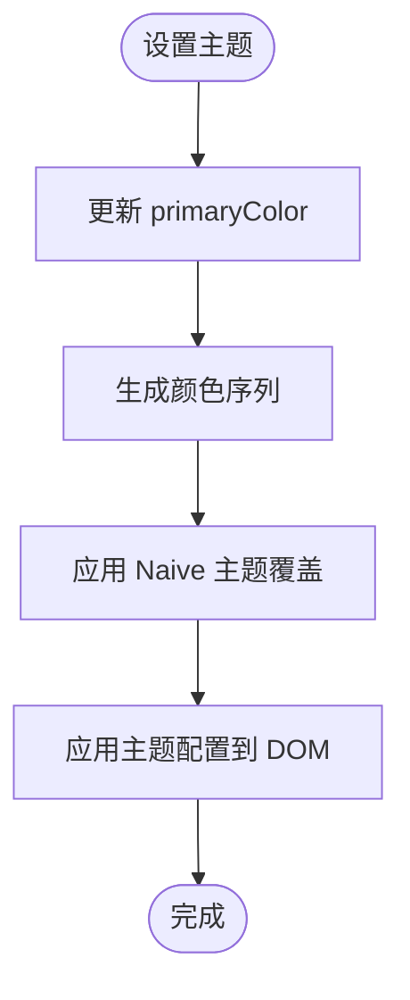
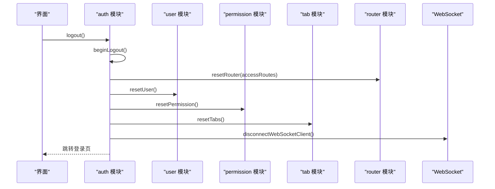
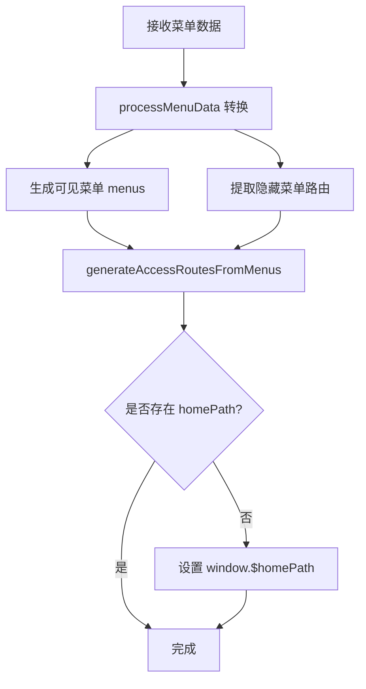
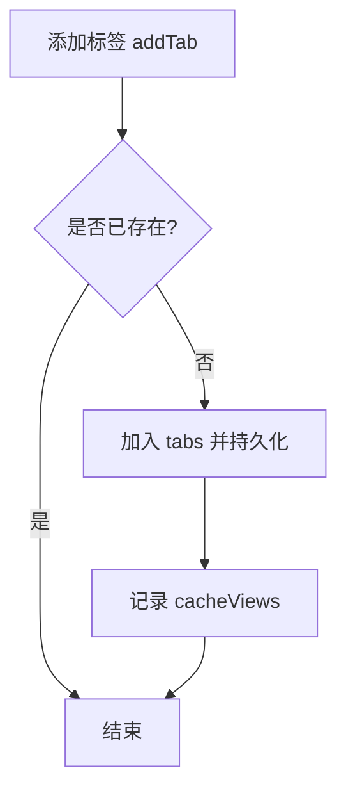
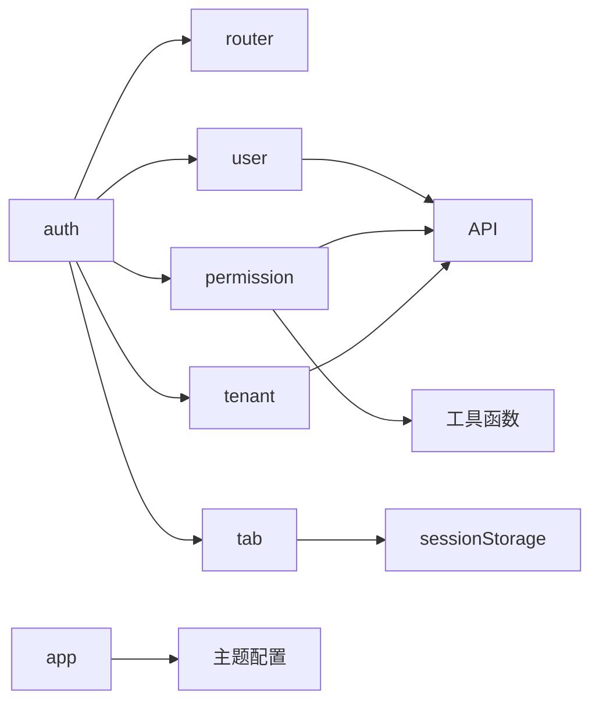

# 状态管理设计

<cite>
**本文引用的文件**
- [store/index.js](file://forge-admin-ui/src/store/index.js)
- [store/modules/index.js](file://forge-admin-ui/src/store/modules/index.js)
- [store/modules/user.js](file://forge-admin-ui/src/store/modules/user.js)
- [store/modules/app.js](file://forge-admin-ui/src/store/modules/app.js)
- [store/modules/auth.js](file://forge-admin-ui/src/store/modules/auth.js)
- [store/modules/permission.js](file://forge-admin-ui/src/store/modules/permission.js)
- [store/modules/router.js](file://forge-admin-ui/src/store/modules/router.js)
- [store/modules/tab.js](file://forge-admin-ui/src/store/modules/tab.js)
- [store/modules/tenant.js](file://forge-admin-ui/src/store/modules/tenant.js)
- [store/helper.js](file://forge-admin-ui/src/store/helper.js)
- [composables/useUser.js](file://forge-admin-ui/src/composables/useUser.js)
- [composables/useMenu.js](file://forge-admin-ui/src/composables/useMenu.js)
- [composables/useStorageConfig.js](file://forge-admin-ui/src/composables/useStorageConfig.js)
</cite>

## 目录
1. [简介](#简介)
2. [项目结构](#项目结构)
3. [核心组件](#核心组件)
4. [架构总览](#架构总览)
5. [详细组件分析](#详细组件分析)
6. [依赖关系分析](#依赖关系分析)
7. [性能考量](#性能考量)
8. [故障排查指南](#故障排查指南)
9. [结论](#结论)
10. [附录](#附录)

## 简介
本文件面向 Forge Admin 前端的状态管理系统，围绕 Pinia 的模块化 store、状态持久化、异步操作处理、全局状态组织（用户信息、应用配置、主题设置、国际化等）、组合式函数（composables）的设计模式与最佳实践、本地存储策略（localStorage/sessionStorage）及多端状态同步方案进行系统化说明。文档通过架构图、时序图与流程图帮助读者快速理解数据流与控制流，并提供可操作的排错建议与优化方向。

## 项目结构
- 入口初始化：在应用启动时创建 Pinia 实例并挂载插件，统一暴露各模块 store。
- Store 模块化：按领域拆分 user、app、auth、permission、router、tab、tenant 等模块，便于维护与复用。
- 组合式函数：封装跨组件复用的业务逻辑，如用户头像加载、菜单导航、存储配置缓存等。
- 本地存储：使用 pinia-plugin-persistedstate 实现 store 级持久化；部分场景直接使用 sessionStorage 做细粒度控制。

图表来源
- [store/index.js:1-11](file://forge-admin-ui/src/store/index.js#L1-L11)
- [store/modules/index.js:1-8](file://forge-admin-ui/src/store/modules/index.js#L1-L8)

章节来源
- [store/index.js:1-11](file://forge-admin-ui/src/store/index.js#L1-L11)
- [store/modules/index.js:1-8](file://forge-admin-ui/src/store/modules/index.js#L1-L8)

## 核心组件
- 用户信息 store（user）：集中管理登录态、角色权限、组织架构等，提供 getters 简化取值，actions 负责写入与重置。
- 应用配置 store（app）：管理布局、主题色、暗黑模式、Naive UI 主题覆盖、路由守卫完成标记等，支持动态主题切换与恢复默认。
- 认证 store（auth）：管理 token、登出流程、多模块联动重置（路由、用户、权限、标签页、租户配置），以及 WebSocket 清理。
- 权限与菜单 store（permission）：将后端菜单数据转换为前端菜单与路由，生成可见路由与隐藏路由，维护 allMenus 用于标题查找。
- 路由 store（router）：封装 Vue Router 实例与 resetRouter，支持动态移除路由。
- 标签页 store（tab）：管理多标签页、钉选、关闭历史、脏标记、缓存视图列表、刷新与重定向。
- 租户 store（tenant）：加载与缓存租户配置，提供系统名称、Logo、主题等 getter。

章节来源
- [store/modules/user.js:1-137](file://forge-admin-ui/src/store/modules/user.js#L1-L137)
- [store/modules/app.js:1-107](file://forge-admin-ui/src/store/modules/app.js#L1-L107)
- [store/modules/auth.js:1-112](file://forge-admin-ui/src/store/modules/auth.js#L1-L112)
- [store/modules/permission.js:1-368](file://forge-admin-ui/src/store/modules/permission.js#L1-L368)
- [store/modules/router.js:1-19](file://forge-admin-ui/src/store/modules/router.js#L1-L19)
- [store/modules/tab.js:1-409](file://forge-admin-ui/src/store/modules/tab.js#L1-L409)
- [store/modules/tenant.js:1-86](file://forge-admin-ui/src/store/modules/tenant.js#L1-L86)

## 架构总览
下图展示状态管理的整体架构与各模块职责边界，以及 Composables 如何消费 store 能力。

图表来源
- [store/modules/user.js:1-137](file://forge-admin-ui/src/store/modules/user.js#L1-L137)
- [store/modules/app.js:1-107](file://forge-admin-ui/src/store/modules/app.js#L1-L107)
- [store/modules/auth.js:1-112](file://forge-admin-ui/src/store/modules/auth.js#L1-L112)
- [store/modules/permission.js:1-368](file://forge-admin-ui/src/store/modules/permission.js#L1-L368)
- [store/modules/tab.js:1-409](file://forge-admin-ui/src/store/modules/tab.js#L1-L409)
- [store/modules/tenant.js:1-86](file://forge-admin-ui/src/store/modules/tenant.js#L1-L86)
- [composables/useUser.js:1-164](file://forge-admin-ui/src/composables/useUser.js#L1-L164)
- [composables/useMenu.js:1-577](file://forge-admin-ui/src/composables/useMenu.js#L1-L577)
- [composables/useStorageConfig.js:1-69](file://forge-admin-ui/src/composables/useStorageConfig.js#L1-L69)

## 详细组件分析

### 用户信息模块（user）
- 状态设计：userInfo、staffInfo、dataPermission，兼容新旧数据结构。
- Getter：提供 userId、username、realName、avatar、roles、permissions、apiPermissions 等常用字段，屏蔽差异。
- Action：setUser 支持多种入参结构；resetUser 使用 $reset 清空状态。
- 持久化：通过 persist 配置以租户隔离 key 持久化到默认存储。

图表来源
- [store/modules/user.js:26-137](file://forge-admin-ui/src/store/modules/user.js#L26-L137)

章节来源
- [store/modules/user.js:1-137](file://forge-admin-ui/src/store/modules/user.js#L1-L137)
- [store/helper.js:5-61](file://forge-admin-ui/src/store/helper.js#L5-L61)

### 应用配置模块（app）
- 状态设计：collapsed、isDark、layout、primaryColor、naiveThemeOverrides、themeConfig、routeGuardCompleted。
- Action：切换折叠、切换暗黑模式、设置主题色、更新主题配置、重置账号相关状态。
- 持久化：仅持久化关键 UI 配置项，使用 sessionStorage。

图表来源
- [store/modules/app.js:36-74](file://forge-admin-ui/src/store/modules/app.js#L36-L74)

章节来源
- [store/modules/app.js:1-107](file://forge-admin-ui/src/store/modules/app.js#L1-L107)

### 认证模块（auth）
- 状态设计：accessToken、userInfo、staffInfo、isLoggingOut。
- Action：setToken、resetToken、beginLogout、logout、resetLoginState（联动重置路由、用户、权限、标签页、租户配置、WebSocket）。
- 持久化：token 持久化，key 按租户隔离。

图表来源
- [store/modules/auth.js:43-106](file://forge-admin-ui/src/store/modules/auth.js#L43-L106)
- [store/modules/router.js:7-11](file://forge-admin-ui/src/store/modules/router.js#L7-L11)

章节来源
- [store/modules/auth.js:1-112](file://forge-admin-ui/src/store/modules/auth.js#L1-L112)
- [store/modules/router.js:1-19](file://forge-admin-ui/src/store/modules/router.js#L1-L19)

### 权限与菜单模块（permission）
- 状态设计：accessRoutes、permissions、menus、allMenus、menuDataLoaded。
- Action：
  - setMenuData：处理后端菜单树，生成 visible 菜单与隐藏菜单路由，计算首页路径。
  - generateAccessRoutesFromMenus：从菜单生成路由数组。
  - generateHiddenMenuRoutes：为隐藏菜单补充 meta.title 等元信息。
  - processMenuData：适配 UserResourceTreeVO 到前端菜单格式。
- 特点：支持外链、SSO、报表子系统桥接、业务应用运行时路径注入等。

图表来源
- [store/modules/permission.js:34-85](file://forge-admin-ui/src/store/modules/permission.js#L34-L85)
- [store/modules/permission.js:93-146](file://forge-admin-ui/src/store/modules/permission.js#L93-L146)
- [store/modules/permission.js:149-256](file://forge-admin-ui/src/store/modules/permission.js#L149-L256)
- [store/modules/permission.js:258-303](file://forge-admin-ui/src/store/modules/permission.js#L258-L303)

章节来源
- [store/modules/permission.js:1-368](file://forge-admin-ui/src/store/modules/permission.js#L1-L368)

### 路由模块（router）
- 功能：封装 Vue Router 实例，提供 resetRouter 方法，根据 accessRoutes 动态移除路由，配合权限模块实现动态路由。

章节来源
- [store/modules/router.js:1-19](file://forge-admin-ui/src/store/modules/router.js#L1-L19)

### 标签页模块（tab）
- 状态设计：tabs、closedTabs、activeTab、dirtyNavigationBypassPath、reloading、cacheViews。
- Action：增删改查标签、钉选/取消钉选、移动顺序、批量删除、刷新其他标签、恢复最近关闭标签、脏标记与导航拦截。
- 持久化：tabs 持久化到 sessionStorage，closedTabs 也持久化。

图表来源
- [store/modules/tab.js:56-69](file://forge-admin-ui/src/store/modules/tab.js#L56-L69)

章节来源
- [store/modules/tab.js:1-409](file://forge-admin-ui/src/store/modules/tab.js#L1-L409)

### 租户模块（tenant）
- 状态设计：config。
- Getter：systemName、systemLogo、browserTitle、browserIcon、systemLayout、systemTheme、systemIntro、copyrightInfo、themeConfig（解析 JSON）。
- Action：loadTenantConfig（异步加载并缓存）、clearTenantConfig。

章节来源
- [store/modules/tenant.js:1-86](file://forge-admin-ui/src/store/modules/tenant.js#L1-L86)

### 组合式函数（composables）

#### useUser
- 职责：封装用户显示名、头像加载、下拉菜单行为、退出登录流程。
- 与 store 交互：读取 userStore 的用户信息，调用 authStore 执行登出。
- 副作用：监听头像变化触发下载，调用 API 执行登出。

章节来源
- [composables/useUser.js:1-164](file://forge-admin-ui/src/composables/useUser.js#L1-L164)
- [store/modules/auth.js:99-106](file://forge-admin-ui/src/store/modules/auth.js#L99-L106)

#### useMenu
- 职责：菜单数据处理、活跃项计算、导航跳转（含外链、内嵌 iframe、SSO、报表子系统桥接）。
- 与 store 交互：读取 permissionStore.menus，结合 route/meta 计算 activeKey。
- 复杂逻辑：构建 SSO 桥接路由、报告子系统目标识别、业务应用运行时路径注入。

章节来源
- [composables/useMenu.js:1-577](file://forge-admin-ui/src/composables/useMenu.js#L1-L577)
- [store/modules/permission.js:149-256](file://forge-admin-ui/src/store/modules/permission.js#L149-L256)

#### useStorageConfig
- 职责：全局缓存默认存储配置（storageType、maxFileSize、allowedTypes），提供 computed 供组件读取。
- 本地存储：使用 sessionStorage 缓存配置，避免重复请求。

章节来源
- [composables/useStorageConfig.js:1-69](file://forge-admin-ui/src/composables/useStorageConfig.js#L1-L69)

## 依赖关系分析
- 模块耦合：
  - auth 强依赖 router、user、permission、tab、tenant 模块进行统一重置。
  - permission 依赖工具函数与路由元信息，生成 accessRoutes 与隐藏路由。
  - tab 依赖 sessionStorage 与 router 进行导航与状态恢复。
  - app 依赖主题配置与页面标题工具。
- 外部依赖：
  - API 调用：用户信息、权限、租户配置等。
  - WebSocket：认证模块在登出时断开连接。
  - 本地存储：pinia-plugin-persistedstate 与直接 sessionStorage 并存。

图表来源
- [store/modules/auth.js:61-98](file://forge-admin-ui/src/store/modules/auth.js#L61-L98)
- [store/modules/tab.js:26-35](file://forge-admin-ui/src/store/modules/tab.js#L26-L35)
- [store/modules/app.js:13-22](file://forge-admin-ui/src/store/modules/app.js#L13-L22)
- [store/modules/permission.js:149-256](file://forge-admin-ui/src/store/modules/permission.js#L149-L256)
- [store/modules/tenant.js:50-77](file://forge-admin-ui/src/store/modules/tenant.js#L50-L77)

章节来源
- [store/modules/auth.js:1-112](file://forge-admin-ui/src/store/modules/auth.js#L1-L112)
- [store/modules/tab.js:1-409](file://forge-admin-ui/src/store/modules/tab.js#L1-L409)
- [store/modules/app.js:1-107](file://forge-admin-ui/src/store/modules/app.js#L1-L107)
- [store/modules/permission.js:1-368](file://forge-admin-ui/src/store/modules/permission.js#L1-L368)
- [store/modules/tenant.js:1-86](file://forge-admin-ui/src/store/modules/tenant.js#L1-L86)

## 性能考量
- 主题切换：app 模块通过颜色生成与主题覆盖减少 DOM 操作次数，提升渲染效率。
- 菜单处理：permission 模块对菜单数据进行一次性转换与排序，避免重复计算；allMenus 扁平化用于快速查找。
- 标签页缓存：tab 模块维护 cacheViews 列表，减少 keepAlive 页面的重复挂载开销。
- 本地存储：敏感或会话级数据优先使用 sessionStorage，降低跨会话污染风险。
- 异步请求：tenant 与 user 模块对配置与用户信息进行缓存与幂等处理，避免重复请求。

[本节为通用性能指导，不直接分析具体代码文件]

## 故障排查指南
- 主题未生效：检查 app 模块的 setThemeColor 与 applyThemeConfig 调用链是否正确；确认 themeConfig 与 primaryColor 同步。
- 菜单异常：检查 permission 模块的 processMenuData 与 generateAccessRoutesFromMenus 输出；确认 hidden routes 是否被正确注入。
- 标签页丢失：检查 tab 模块的 setTabs 与 sessionStorage 写入；确认 removeTab 与 recordClosedTabs 逻辑。
- 登出不彻底：检查 auth 模块的 resetLoginState 是否调用了所有必要重置；确认 WebSocket 断开与密钥交换状态重置。
- 租户配置为空：检查 tenant 模块的 loadTenantConfig 返回值与错误处理；确认浏览器网络与接口可用性。

章节来源
- [store/modules/app.js:36-74](file://forge-admin-ui/src/store/modules/app.js#L36-L74)
- [store/modules/permission.js:93-146](file://forge-admin-ui/src/store/modules/permission.js#L93-L146)
- [store/modules/tab.js:178-221](file://forge-admin-ui/src/store/modules/tab.js#L178-L221)
- [store/modules/auth.js:61-98](file://forge-admin-ui/src/store/modules/auth.js#L61-L98)
- [store/modules/tenant.js:50-77](file://forge-admin-ui/src/store/modules/tenant.js#L50-L77)

## 结论
Forge Admin 的前端状态管理基于 Pinia 的模块化设计，结合 pinia-plugin-persistedstate 实现了灵活的持久化策略。通过 user、app、auth、permission、router、tab、tenant 等模块的职责划分，系统实现了清晰的数据流与可控的副作用。组合式函数进一步封装了跨组件复用的逻辑，提升了可维护性与可读性。针对多端一致性、离线与冲突解决，建议在现有基础上引入统一的变更日志与合并策略，并在移动端采用更严格的缓存与重试机制。

[本节为总结性内容，不直接分析具体代码文件]

## 附录

### 状态更新模式与最佳实践
- mutation 设计：尽量保持 action 的原子性，将复杂逻辑拆分为多个小步骤，便于测试与回滚。
- action 异步处理：对外部 API 调用进行错误捕获与降级处理，确保 UI 反馈一致。
- watch 监听：仅在必要时监听状态变化，避免不必要的重渲染；对头像等异步资源使用懒加载与缓存。

[本节为通用指导，不直接分析具体代码文件]

### 本地存储策略
- localStorage：适合长期保存用户偏好与主题配置（当前项目主要使用 sessionStorage）。
- sessionStorage：适合会话级数据，如标签页、临时配置、存储配置缓存。
- 数据同步：通过 store 的 persist 配置与手动读写保持一致性；注意键名按租户隔离，避免跨租户污染。

章节来源
- [store/modules/app.js:101-105](file://forge-admin-ui/src/store/modules/app.js#L101-L105)
- [store/modules/tab.js:403-407](file://forge-admin-ui/src/store/modules/tab.js#L403-L407)
- [composables/useStorageConfig.js:17-27](file://forge-admin-ui/src/composables/useStorageConfig.js#L17-L27)

### 多端状态同步方案
- PC 与移动端一致性：通过统一的 store 结构与 API 契约保证数据模型一致；在不同端按需裁剪展示。
- 离线状态处理：利用 sessionStorage 缓存关键状态，在网络恢复后增量同步；对写操作进行队列化与重试。
- 数据冲突解决：引入版本号或时间戳进行冲突检测，采用“最后写入胜出”或“合并策略”；对关键数据增加人工确认。

[本节为概念性指导，不直接分析具体代码文件]