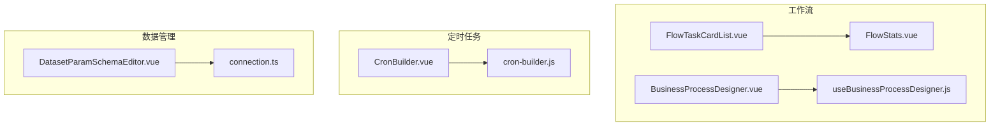
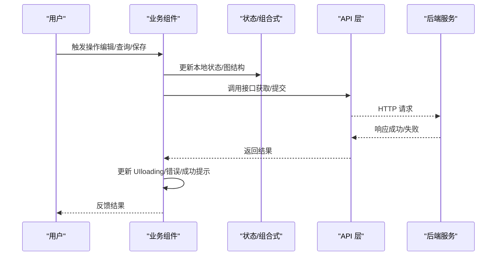
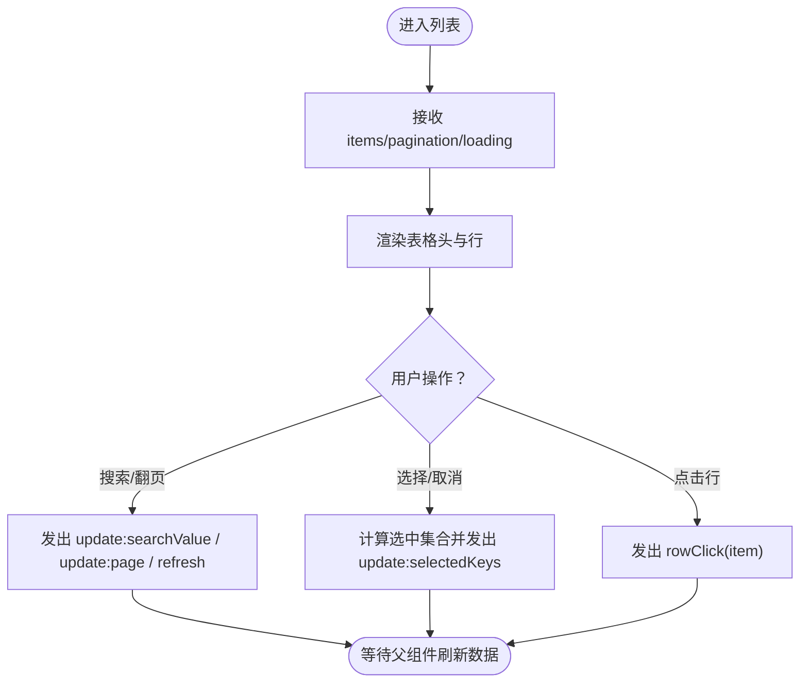
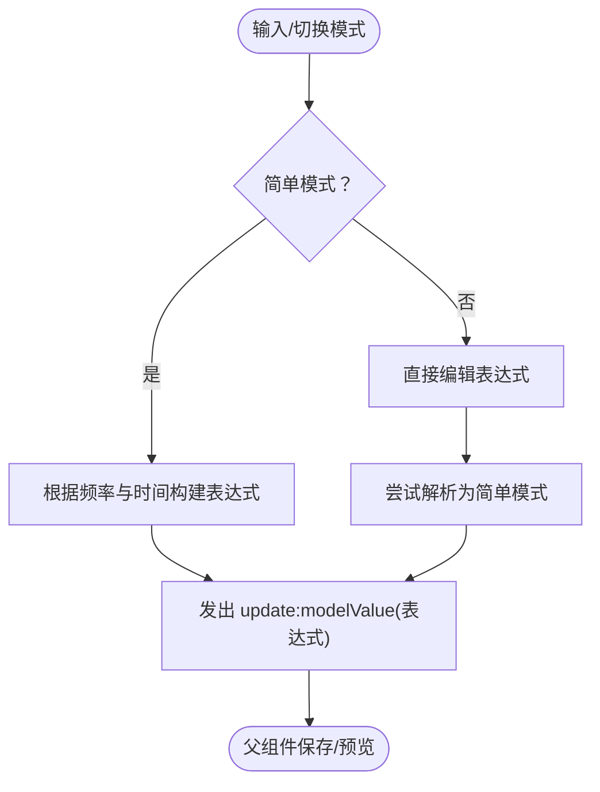
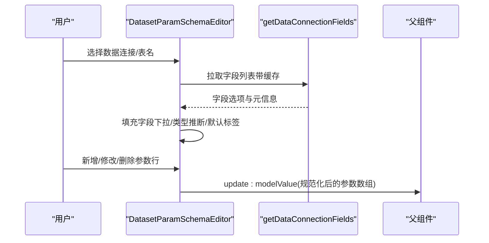
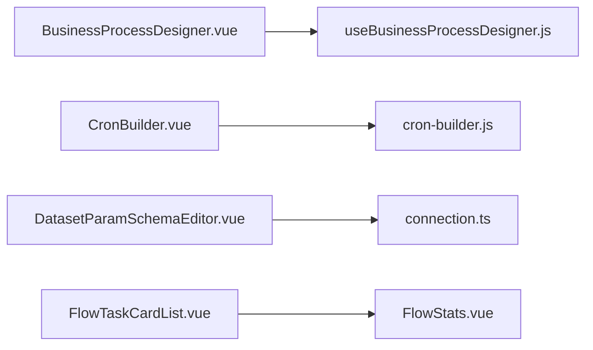

# 业务组件

<cite>
**本文引用的文件**
- [FlowTaskCardList.vue](file://forge-admin-ui/src/components/flow/FlowTaskCardList.vue)
- [FlowStats.vue](file://forge-admin-ui/src/components/flow/FlowStats.vue)
- [BusinessProcessDesigner.vue](file://forge-admin-ui/src/components/business-process-designer/BusinessProcessDesigner.vue)
- [useBusinessProcessDesigner.js](file://forge-admin-ui/src/components/business-process-designer/useBusinessProcessDesigner.js)
- [CronBuilder.vue](file://forge-admin-ui/src/components/job/CronBuilder.vue)
- [cron-builder.js](file://forge-admin-ui/src/components/job/cron-builder.js)
- [DatasetParamSchemaEditor.vue](file://forge-admin-ui/src/components/data/DatasetParamSchemaEditor.vue)
- [connection.ts](file://forge-admin-ui/src/api/data/connection.ts)
</cite>

## 目录
1. [简介](#简介)
2. [项目结构](#项目结构)
3. [核心组件](#核心组件)
4. [架构总览](#架构总览)
5. [详细组件分析](#详细组件分析)
6. [依赖关系分析](#依赖关系分析)
7. [性能考虑](#性能考虑)
8. [故障排查指南](#故障排查指南)
9. [结论](#结论)
10. [附录：使用场景与集成示例](#附录：使用场景与集成示例)

## 简介
本文件面向 Forge Admin 的业务组件，聚焦三类能力：
- 工作流相关：流程审批、任务管理、流程统计等前端展示与交互。
- 定时任务：Cron 表达式构建（简单模式与专家模式）、任务监控与配置。
- 数据管理：数据集参数编辑（SQL 参数识别、表字段映射、默认值与必填校验）。

文档将说明各组件的职责边界、内部状态流转、与后端服务的交互方式（API 调用、状态同步、错误处理），并给出配置方式、扩展机制、典型使用场景和性能优化建议。

## 项目结构
围绕业务能力的三个关键目录与文件：
- 工作流：flow 目录下的任务卡片列表与统计；business-process-designer 下的可视化业务流程设计器与编排逻辑。
- 定时任务：job 目录下的 Cron 表达式构建器与工具函数。
- 数据管理：data 目录下的数据集参数 Schema 编辑器，负责 SQL 参数与表字段的绑定。



图表来源
- [FlowTaskCardList.vue:1-146](file://forge-admin-ui/src/components/flow/FlowTaskCardList.vue#L1-L146)
- [FlowStats.vue:1-64](file://forge-admin-ui/src/components/flow/FlowStats.vue#L1-L64)
- [BusinessProcessDesigner.vue:1-112](file://forge-admin-ui/src/components/business-process-designer/BusinessProcessDesigner.vue#L1-L112)
- [useBusinessProcessDesigner.js:16-44](file://forge-admin-ui/src/components/business-process-designer/useBusinessProcessDesigner.js#L16-L44)
- [CronBuilder.vue:1-93](file://forge-admin-ui/src/components/job/CronBuilder.vue#L1-L93)
- [cron-builder.js:1-42](file://forge-admin-ui/src/components/job/cron-builder.js#L1-L42)
- [DatasetParamSchemaEditor.vue:1-161](file://forge-admin-ui/src/components/data/DatasetParamSchemaEditor.vue#L1-L161)
- [connection.ts:1-200](file://forge-admin-ui/src/api/data/connection.ts#L1-L200)

章节来源
- [FlowTaskCardList.vue:1-146](file://forge-admin-ui/src/components/flow/FlowTaskCardList.vue#L1-L146)
- [FlowStats.vue:1-64](file://forge-admin-ui/src/components/flow/FlowStats.vue#L1-L64)
- [BusinessProcessDesigner.vue:1-112](file://forge-admin-ui/src/components/business-process-designer/BusinessProcessDesigner.vue#L1-L112)
- [useBusinessProcessDesigner.js:16-44](file://forge-admin-ui/src/components/business-process-designer/useBusinessProcessDesigner.js#L16-L44)
- [CronBuilder.vue:1-93](file://forge-admin-ui/src/components/job/CronBuilder.vue#L1-L93)
- [cron-builder.js:1-42](file://forge-admin-ui/src/components/job/cron-builder.js#L1-L42)
- [DatasetParamSchemaEditor.vue:1-161](file://forge-admin-ui/src/components/data/DatasetParamSchemaEditor.vue#L1-L161)
- [connection.ts:1-200](file://forge-admin-ui/src/api/data/connection.ts#L1-L200)

## 核心组件
- FlowTaskCardList：可复用的任务卡片列表，支持搜索、分页、批量选择、未读高亮、插槽扩展标题/状态/节点/用户/操作列。
- FlowStats：流程统计入口，聚合待办、已办、发起、抄送等指标，支持 Tab 切换。
- BusinessProcessDesigner：可视化业务流程设计器，封装节点增删改、连线维护、条件分支、撤销重做、自动保存、冲突提示、表单资产绑定等。
- useBusinessProcessDesigner：流程图状态机与图算法（插入/删除节点、边同步、条件分支端口与默认边、ID 生成、历史快照）。
- CronBuilder：Cron 表达式构建器，提供“简单设置”与“专家模式”，内置 Quartz 6 段表达式解析与生成。
- DatasetParamSchemaEditor：数据集参数 Schema 编辑器，支持从 SQL 识别命名参数、为表字段定义筛选条件、类型推断、默认值与必填控制。

章节来源
- [FlowTaskCardList.vue:148-227](file://forge-admin-ui/src/components/flow/FlowTaskCardList.vue#L148-L227)
- [FlowStats.vue:53-64](file://forge-admin-ui/src/components/flow/FlowStats.vue#L53-L64)
- [BusinessProcessDesigner.vue:17-112](file://forge-admin-ui/src/components/business-process-designer/BusinessProcessDesigner.vue#L17-L112)
- [useBusinessProcessDesigner.js:16-44](file://forge-admin-ui/src/components/business-process-designer/useBusinessProcessDesigner.js#L16-L44)
- [CronBuilder.vue:95-151](file://forge-admin-ui/src/components/job/CronBuilder.vue#L95-L151)
- [cron-builder.js:19-78](file://forge-admin-ui/src/components/job/cron-builder.js#L19-L78)
- [DatasetParamSchemaEditor.vue:163-288](file://forge-admin-ui/src/components/data/DatasetParamSchemaEditor.vue#L163-L288)

## 架构总览
业务组件通过统一的 UI 层与 API 层解耦：
- 视图层：Vue 组件负责渲染与交互，暴露 props/emits 或 v-model 进行双向绑定。
- 状态层：组合式函数（如 useBusinessProcessDesigner）集中管理图结构与历史。
- 服务层：通过 @/api/* 模块调用后端接口，完成数据加载、保存、校验等操作。
- 错误与状态：组件内统一处理 loading、空态、冲突、错误提示，并通过事件向父级上报。



图表来源
- [BusinessProcessDesigner.vue:360-381](file://forge-admin-ui/src/components/business-process-designer/BusinessProcessDesigner.vue#L360-L381)
- [DatasetParamSchemaEditor.vue:290-358](file://forge-admin-ui/src/components/data/DatasetParamSchemaEditor.vue#L290-L358)
- [connection.ts:1-200](file://forge-admin-ui/src/api/data/connection.ts#L1-L200)

## 详细组件分析

### 工作流任务列表：FlowTaskCardList
职责与特性
- 展示任务卡片列表，支持分页、搜索、批量选择、未读标记、插槽扩展。
- 通过 props 控制列标题、行键、空文案、是否可选等；通过 emits 向上汇报页码、搜索、刷新、行点击、选择变化等事件。
- 内部计算当前页全选/半选状态，维护选中集合，避免重复渲染。

数据流与交互
- 外部传入 items/pagination/loading/searchValue/selectedKeys 等；组件内部仅做展示与选择逻辑。
- 当用户点击行或勾选框时，发出 rowClick/update:selectedKeys 等事件，由父组件驱动数据刷新。



图表来源
- [FlowTaskCardList.vue:148-227](file://forge-admin-ui/src/components/flow/FlowTaskCardList.vue#L148-L227)

章节来源
- [FlowTaskCardList.vue:1-146](file://forge-admin-ui/src/components/flow/FlowTaskCardList.vue#L1-L146)
- [FlowTaskCardList.vue:148-227](file://forge-admin-ui/src/components/flow/FlowTaskCardList.vue#L148-L227)

### 流程统计：FlowStats
职责与特性
- 展示待办、已办、发起、抄送四类指标，支持点击切换 activeTab。
- 对未读抄送数量进行角标显示，提升信息密度。

交互
- 通过 emit('switch', tabKey) 通知父组件切换统计维度。

章节来源
- [FlowStats.vue:1-64](file://forge-admin-ui/src/components/flow/FlowStats.vue#L1-L64)

### 业务流程设计器：BusinessProcessDesigner
职责与特性
- 可视化拖拽/点击添加节点，维护节点与连线，支持复制/删除节点、撤销/重做。
- 自动保存草稿、冲突提示、客户端与服务端校验合并展示。
- 自动为审批节点绑定应用表单资产，兼容历史草稿的旧引用修复。

状态与图算法
- 基于 useBusinessProcessDesigner 管理 schema、选中节点、脏标记、历史栈。
- 提供 addNode/insertNodeOnEdge/deleteNode/updateNode/changeStartType 等方法，保证图结构一致性（唯一后继、无环、条件分支端口唯一、默认边回退）。

```mermaid
classDiagram
class BusinessProcessDesigner {
+props(schema, processName, readonly, autoSaveDelay, saveState, serverValidation, objectId, objectName, fields, objects, flowModels, formAssets, businessActions, messageTemplates, capabilities, subProcesses, serviceActors)
+emits(update : schema, save, validate, openFlowDesigner, refreshFlowModel, refreshFields, editAction, dirtyChange, locateIssue, reload)
+handleAddNode(type)
+handleInsertNode({edgeId,type})
+handleCopyNode()
+handleDeleteNode(node)
+handleDrawerSave(node, metadata)
+handleValidate()
+handleSave(reason)
+scheduleAutoSave()
+clearAutoSave()
}
class useBusinessProcessDesigner {
+schema
+selectedNodeId
+isDirty
+getNode(id)
+getEdge(id)
+getOutgoingEdges(id)
+getIncomingEdges(id)
+selectNode(id)
+addNode(afterNodeId,type,overrides)
+insertNodeOnEdge(edgeId,type,overrides)
+copyNode(nodeId)
+updateNode(nodeId,patch,options)
+changeStartType(nodeId,type,overrides)
+deleteNode(nodeId)
+addEdge(edge)
+updateEdge(edgeId,patch)
+deleteEdge(edgeId)
+setSchema(nextSchema,options)
+markSaved()
+exportSchema()
+undo()
+redo()
+clearHistory()
}
BusinessProcessDesigner --> useBusinessProcessDesigner : "组合式状态与图算法"
```

图表来源
- [BusinessProcessDesigner.vue:17-112](file://forge-admin-ui/src/components/business-process-designer/BusinessProcessDesigner.vue#L17-L112)
- [useBusinessProcessDesigner.js:16-44](file://forge-admin-ui/src/components/business-process-designer/useBusinessProcessDesigner.js#L16-L44)
- [useBusinessProcessDesigner.js:45-111](file://forge-admin-ui/src/components/business-process-designer/useBusinessProcessDesigner.js#L45-L111)
- [useBusinessProcessDesigner.js:113-162](file://forge-admin-ui/src/components/business-process-designer/useBusinessProcessDesigner.js#L113-L162)
- [useBusinessProcessDesigner.js:164-197](file://forge-admin-ui/src/components/business-process-designer/useBusinessProcessDesigner.js#L164-L197)
- [useBusinessProcessDesigner.js:199-237](file://forge-admin-ui/src/components/business-process-designer/useBusinessProcessDesigner.js#L199-L237)
- [useBusinessProcessDesigner.js:239-277](file://forge-admin-ui/src/components/business-process-designer/useBusinessProcessDesigner.js#L239-L277)
- [useBusinessProcessDesigner.js:279-362](file://forge-admin-ui/src/components/business-process-designer/useBusinessProcessDesigner.js#L279-L362)

章节来源
- [BusinessProcessDesigner.vue:1-112](file://forge-admin-ui/src/components/business-process-designer/BusinessProcessDesigner.vue#L1-L112)
- [BusinessProcessDesigner.vue:360-381](file://forge-admin-ui/src/components/business-process-designer/BusinessProcessDesigner.vue#L360-L381)
- [useBusinessProcessDesigner.js:16-44](file://forge-admin-ui/src/components/business-process-designer/useBusinessProcessDesigner.js#L16-L44)
- [useBusinessProcessDesigner.js:45-111](file://forge-admin-ui/src/components/business-process-designer/useBusinessProcessDesigner.js#L45-L111)
- [useBusinessProcessDesigner.js:113-162](file://forge-admin-ui/src/components/business-process-designer/useBusinessProcessDesigner.js#L113-L162)
- [useBusinessProcessDesigner.js:164-197](file://forge-admin-ui/src/components/business-process-designer/useBusinessProcessDesigner.js#L164-L197)
- [useBusinessProcessDesigner.js:199-237](file://forge-admin-ui/src/components/business-process-designer/useBusinessProcessDesigner.js#L199-L237)
- [useBusinessProcessDesigner.js:239-277](file://forge-admin-ui/src/components/business-process-designer/useBusinessProcessDesigner.js#L239-L277)
- [useBusinessProcessDesigner.js:279-362](file://forge-admin-ui/src/components/business-process-designer/useBusinessProcessDesigner.js#L279-L362)

### 定时任务 Cron 构建器：CronBuilder
职责与特性
- 简单模式：按频率（间隔/每小时/每天/每周/每月）与时间选择生成 Quartz 6 段 Cron 表达式。
- 专家模式：直接编辑 Cron 表达式，支持解析回简单模式（若匹配规则）。
- 内置常量与工具：SIMPLE_SCHEDULE_TYPES、WEEKDAY_OPTIONS、createDefaultSimpleSchedule、buildCronExpression、parseCronExpression。



图表来源
- [CronBuilder.vue:95-151](file://forge-admin-ui/src/components/job/CronBuilder.vue#L95-L151)
- [cron-builder.js:19-78](file://forge-admin-ui/src/components/job/cron-builder.js#L19-L78)

章节来源
- [CronBuilder.vue:1-93](file://forge-admin-ui/src/components/job/CronBuilder.vue#L1-L93)
- [CronBuilder.vue:95-151](file://forge-admin-ui/src/components/job/CronBuilder.vue#L95-L151)
- [cron-builder.js:1-42](file://forge-admin-ui/src/components/job/cron-builder.js#L1-L42)
- [cron-builder.js:44-78](file://forge-admin-ui/src/components/job/cron-builder.js#L44-L78)

### 数据集参数编辑器：DatasetParamSchemaEditor
职责与特性
- 支持两种模式：
  - TABLE 模式：为数据表字段定义筛选条件（匹配方式、字段映射、类型推断、默认值、必填）。
  - SQL 模式：手工维护 SQL 条件，可从 SQL 文本中识别 :paramName 命名参数并导入。
- 字段缓存：按 connectionId:tableName 缓存字段列表与元信息，减少重复请求。
- 输出规范化：toOutputRows 清理空格与类型，确保稳定序列化。



图表来源
- [DatasetParamSchemaEditor.vue:290-358](file://forge-admin-ui/src/components/data/DatasetParamSchemaEditor.vue#L290-L358)
- [DatasetParamSchemaEditor.vue:496-524](file://forge-admin-ui/src/components/data/DatasetParamSchemaEditor.vue#L496-L524)
- [connection.ts:1-200](file://forge-admin-ui/src/api/data/connection.ts#L1-L200)

章节来源
- [DatasetParamSchemaEditor.vue:163-288](file://forge-admin-ui/src/components/data/DatasetParamSchemaEditor.vue#L163-L288)
- [DatasetParamSchemaEditor.vue:290-358](file://forge-admin-ui/src/components/data/DatasetParamSchemaEditor.vue#L290-L358)
- [DatasetParamSchemaEditor.vue:496-524](file://forge-admin-ui/src/components/data/DatasetParamSchemaEditor.vue#L496-L524)
- [DatasetParamSchemaEditor.vue:526-596](file://forge-admin-ui/src/components/data/DatasetParamSchemaEditor.vue#L526-L596)
- [connection.ts:1-200](file://forge-admin-ui/src/api/data/connection.ts#L1-L200)

## 依赖关系分析
- 组件耦合度低：UI 组件通过 props/emits 与父组件通信；复杂状态下沉到组合式函数（如 useBusinessProcessDesigner）。
- 外部依赖：Naive UI 组件库用于基础控件；图标来自 @vicons；API 层集中在 @/api/*。
- 潜在循环依赖：未发现明显循环；流程图状态与 UI 分离清晰。



图表来源
- [BusinessProcessDesigner.vue:1-112](file://forge-admin-ui/src/components/business-process-designer/BusinessProcessDesigner.vue#L1-L112)
- [useBusinessProcessDesigner.js:16-44](file://forge-admin-ui/src/components/business-process-designer/useBusinessProcessDesigner.js#L16-L44)
- [CronBuilder.vue:95-151](file://forge-admin-ui/src/components/job/CronBuilder.vue#L95-L151)
- [cron-builder.js:1-42](file://forge-admin-ui/src/components/job/cron-builder.js#L1-L42)
- [DatasetParamSchemaEditor.vue:290-358](file://forge-admin-ui/src/components/data/DatasetParamSchemaEditor.vue#L290-L358)
- [connection.ts:1-200](file://forge-admin-ui/src/api/data/connection.ts#L1-L200)
- [FlowTaskCardList.vue:148-227](file://forge-admin-ui/src/components/flow/FlowTaskCardList.vue#L148-L227)
- [FlowStats.vue:53-64](file://forge-admin-ui/src/components/flow/FlowStats.vue#L53-L64)

章节来源
- [BusinessProcessDesigner.vue:1-112](file://forge-admin-ui/src/components/business-process-designer/BusinessProcessDesigner.vue#L1-L112)
- [useBusinessProcessDesigner.js:16-44](file://forge-admin-ui/src/components/business-process-designer/useBusinessProcessDesigner.js#L16-L44)
- [CronBuilder.vue:95-151](file://forge-admin-ui/src/components/job/CronBuilder.vue#L95-L151)
- [cron-builder.js:1-42](file://forge-admin-ui/src/components/job/cron-builder.js#L1-L42)
- [DatasetParamSchemaEditor.vue:290-358](file://forge-admin-ui/src/components/data/DatasetParamSchemaEditor.vue#L290-L358)
- [connection.ts:1-200](file://forge-admin-ui/src/api/data/connection.ts#L1-L200)
- [FlowTaskCardList.vue:148-227](file://forge-admin-ui/src/components/flow/FlowTaskCardList.vue#L148-L227)
- [FlowStats.vue:53-64](file://forge-admin-ui/src/components/flow/FlowStats.vue#L53-L64)

## 性能考虑
- 列表渲染：FlowTaskCardList 使用网格布局与最小高度策略，避免溢出；分页与空态优化首屏体验。
- 状态计算：FlowTaskCardList 使用 Set 维护选中集合，O(1) 判断存在性；当前页全选/半选通过 computed 缓存。
- 网络请求：DatasetParamSchemaEditor 对字段列表进行 connectionId:tableName 缓存，避免重复请求；并发请求通过 currentFieldRequestKey 防抖覆盖。
- 自动保存：BusinessProcessDesigner 使用定时器延迟保存，降低频繁写盘；冲突状态阻止继续保存，避免覆盖他人修改。
- 表达式构建：cron-builder.js 对时间/范围进行 clamp/valid 校验，减少无效表达式生成与后端校验开销。

[本节为通用性能建议，不直接分析具体文件]

## 故障排查指南
- 流程保存冲突：当 saveState 为 conflict 时，提示刷新草稿，避免覆盖；检查服务端版本与本地 hash 是否一致。
- 保存失败：saveState 为 error 时，展示错误信息；检查网络与权限，重试保存。
- 字段加载失败：DatasetParamSchemaEditor 在 catch 中清空字段并提示；确认 connectionId/table 有效。
- 条件分支异常：useBusinessProcessDesigner 在更新条件分支时校验端口唯一性与下游独占节点，抛出明确错误信息，指导修正。
- Cron 表达式无效：专家模式下输入非法表达式不会回退到简单模式；建议在简单模式生成后再切换到专家微调。

章节来源
- [BusinessProcessDesigner.vue:521-534](file://forge-admin-ui/src/components/business-process-designer/BusinessProcessDesigner.vue#L521-L534)
- [useBusinessProcessDesigner.js:296-362](file://forge-admin-ui/src/components/business-process-designer/useBusinessProcessDesigner.js#L296-L362)
- [DatasetParamSchemaEditor.vue:319-358](file://forge-admin-ui/src/components/data/DatasetParamSchemaEditor.vue#L319-L358)
- [cron-builder.js:44-78](file://forge-admin-ui/src/components/job/cron-builder.js#L44-L78)

## 结论
Forge Admin 的业务组件以清晰的职责划分与良好的状态管理为基础：
- 工作流组件提供开箱即用的任务列表与统计，配合可视化流程设计器，满足审批与编排需求。
- 定时任务组件通过简单/专家双模式降低 Cron 配置门槛，同时具备解析与生成能力。
- 数据管理组件支持 SQL 参数识别与表字段映射，提升数据集配置效率与准确性。
整体采用组件化与组合式函数解耦，便于扩展与维护；通过缓存、分页、自动保存与冲突处理等手段保障性能与用户体验。

[本节为总结性内容，不直接分析具体文件]

## 附录：使用场景与集成示例
- 工作流任务看板
  - 使用 FlowTaskCardList 展示待办/已办/发起/抄送任务，结合 FlowStats 快速切换维度。
  - 父组件监听 search/refresh/page 事件，调用后端接口刷新数据；通过 selectedKeys 实现批量操作。
- 业务流程编排
  - 在页面引入 BusinessProcessDesigner，传入 schema 与资源（对象、表单、动作、消息模板等）。
  - 监听 save/validate/dirtyChange 事件，实现草稿保存、服务端校验与变更提示。
- 定时任务配置
  - 使用 CronBuilder 生成 Quartz 6 段表达式，保存至任务配置；必要时切换到专家模式微调。
- 数据集参数编辑
  - 在数据集配置页引入 DatasetParamSchemaEditor，选择数据连接与表后，自动加载字段并映射筛选条件。
  - 对于 SQL 数据集，使用“从 SQL 识别”快速导入命名参数，再完善类型与默认值。

[本节为概念性使用指引，不直接分析具体文件]