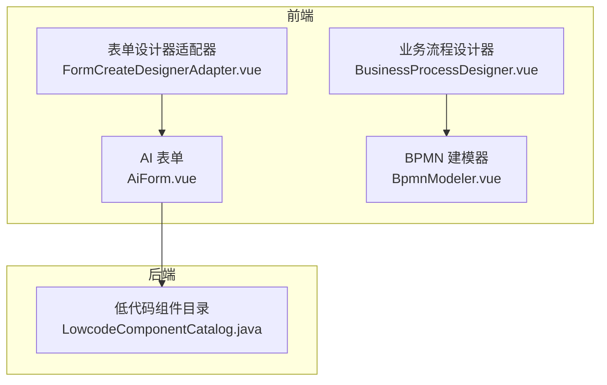
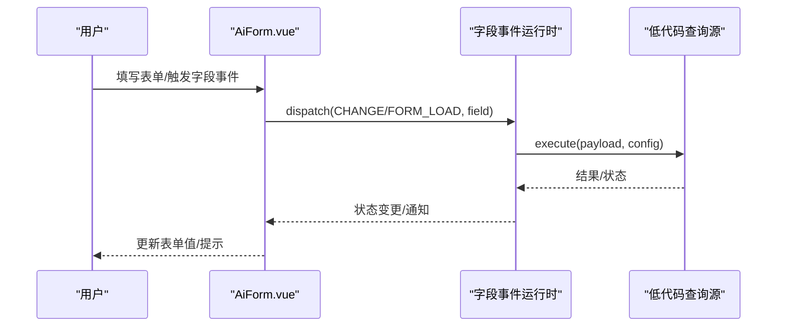
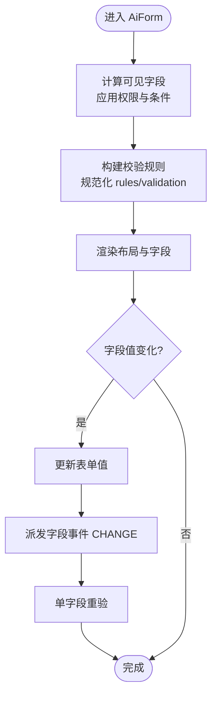
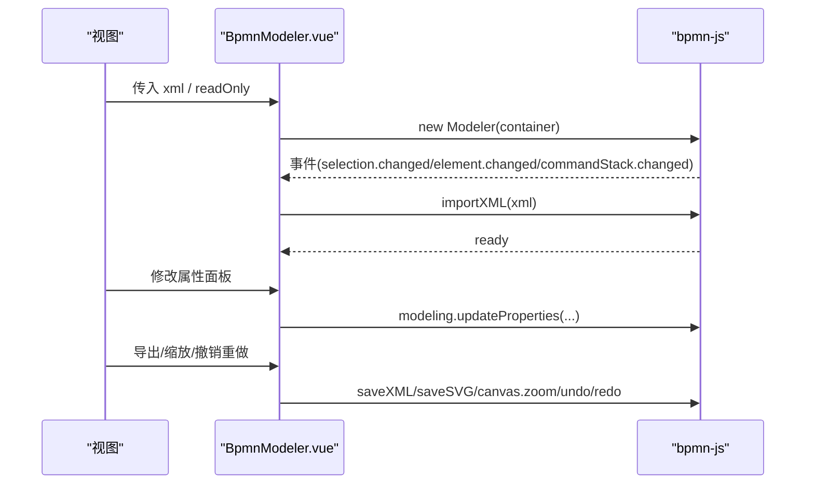
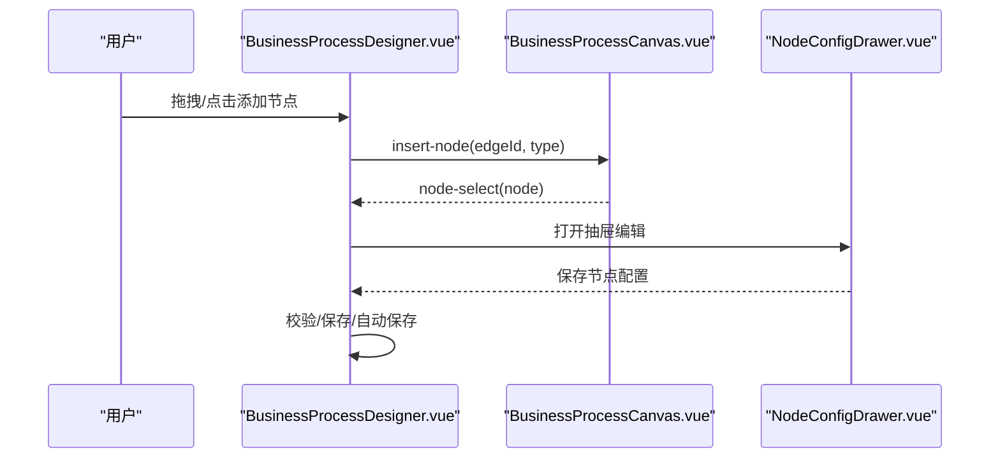
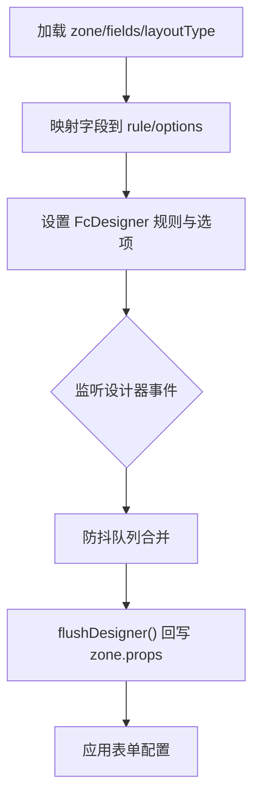
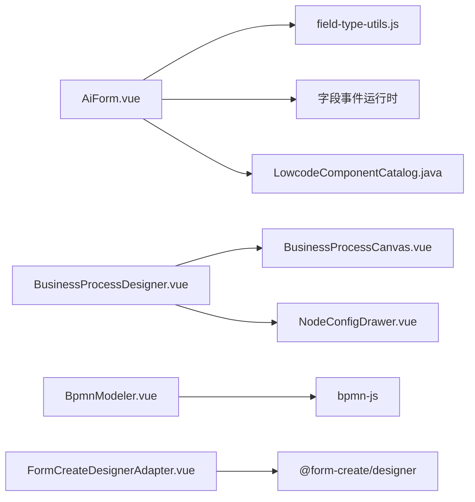

# 低代码组件

<cite>
**本文引用的文件**
- [AiForm.vue](file://forge-admin-ui/src/components/ai-form/AiForm.vue)
- [AiFormItem.vue](file://forge-admin-ui/src/components/ai-form/AiFormItem.vue)
- [field-type-utils.js](file://forge-admin-ui/src/components/ai-form/field-type-utils.js)
- [BpmnModeler.vue](file://forge-admin-ui/src/components/bpmn/BpmnModeler.vue)
- [BusinessProcessDesigner.vue](file://forge-admin-ui/src/components/business-process-designer/BusinessProcessDesigner.vue)
- [FormCreateDesignerAdapter.vue](file://forge-admin-ui/src/components/lowcode-builder/page/FormCreateDesignerAdapter.vue)
- [LowcodeComponentCatalog.java](file://forge-server/forge-framework/forge-plugin-parent/forge-plugin-generator/src/main/java/com/mdframe/forge/plugin/generator/service/lowcode/LowcodeComponentCatalog.java)
- [业务模型管理UI.md](file://docs/业务模型管理UI.md)
- [spec（钉钉样式流程设计器）.md](file://code-copilot/changes/archive/2026-06-27-dingflow-approver-style-designer/spec.md)
</cite>

## 目录
1. [简介](#简介)
2. [项目结构](#项目结构)
3. [核心组件](#核心组件)
4. [架构总览](#架构总览)
5. [详细组件分析](#详细组件分析)
6. [依赖关系分析](#依赖关系分析)
7. [性能考虑](#性能考虑)
8. [故障排查指南](#故障排查指南)
9. [结论](#结论)
10. [附录](#附录)

## 简介
本文件面向 Forge Admin 低代码平台，系统性梳理并说明 AI 表单组件、BPMN 流程图组件与业务流程设计器的实现原理与使用方式。内容覆盖：
- AI 表单：渲染引擎、字段类型系统、验证规则、事件处理机制
- BPMN 流程图：解析、节点渲染、交互操作、属性配置面板
- 流程设计器：画布操作、节点拖拽、连线绘制、属性编辑
- 表单设计器：可视化编辑、实时预览、代码生成
- 扩展机制与自定义开发指南
- 集成与定制最佳实践

## 项目结构
Forge Admin 的低代码能力主要分布在以下模块：
- 前端 UI 层
  - AI 表单与运行时：位于 forge-admin-ui/src/components/ai-form
  - BPMN 建模器与查看器：位于 forge-admin-ui/src/components/bpmn
  - 业务流程设计器：位于 forge-admin-ui/src/components/business-process-designer
  - 表单设计器适配器：位于 forge-admin-ui/src/components/lowcode-builder/page
- 后端能力
  - 低代码组件目录契约：定义可被设计器与运行时识别的字段组件键集合

**图表来源**
- [AiForm.vue:148-280](file://forge-admin-ui/src/components/ai-form/AiForm.vue#L148-L280)
- [BpmnModeler.vue:146-187](file://forge-admin-ui/src/components/bpmn/BpmnModeler.vue#L146-L187)
- [BusinessProcessDesigner.vue:17-36](file://forge-admin-ui/src/components/business-process-designer/BusinessProcessDesigner.vue#L17-L36)
- [FormCreateDesignerAdapter.vue:70-114](file://forge-admin-ui/src/components/lowcode-builder/page/FormCreateDesignerAdapter.vue#L70-L114)
- [LowcodeComponentCatalog.java:1-22](file://forge-server/forge-framework/forge-plugin-parent/forge-plugin-generator/src/main/java/com/mdframe/forge/plugin/generator/service/lowcode/LowcodeComponentCatalog.java#L1-L22)

**章节来源**
- [AiForm.vue:148-280](file://forge-admin-ui/src/components/ai-form/AiForm.vue#L148-L280)
- [BpmnModeler.vue:146-187](file://forge-admin-ui/src/components/bpmn/BpmnModeler.vue#L146-L187)
- [BusinessProcessDesigner.vue:17-36](file://forge-admin-ui/src/components/business-process-designer/BusinessProcessDesigner.vue#L17-L36)
- [FormCreateDesignerAdapter.vue:70-114](file://forge-admin-ui/src/components/lowcode-builder/page/FormCreateDesignerAdapter.vue#L70-L114)
- [LowcodeComponentCatalog.java:1-22](file://forge-server/forge-framework/forge-plugin-parent/forge-plugin-generator/src/main/java/com/mdframe/forge/plugin/generator/service/lowcode/LowcodeComponentCatalog.java#L1-L22)

## 核心组件
- AI 表单组件（AiForm）：基于 JSON Schema 动态渲染表单，提供布局、校验、事件、权限等运行时能力
- AI 表单项（AiFormItem）：按字段类型与可见性策略渲染具体控件
- BPMN 建模器（BpmnModeler）：封装 bpmn-js，提供导入/导出、撤销重做、缩放、属性面板
- 业务流程设计器（BusinessProcessDesigner）：面向审批/编排的可视化流程设计，支持节点拖拽、插入、删除、复制、保存与校验
- 表单设计器适配器（FormCreateDesignerAdapter）：在低代码页面中嵌入 form-create 设计器，将模型字段映射为表单规则，支持主子表场景

**章节来源**
- [AiForm.vue:148-280](file://forge-admin-ui/src/components/ai-form/AiForm.vue#L148-L280)
- [AiFormItem.vue:1-66](file://forge-admin-ui/src/components/ai-form/AiFormItem.vue#L1-L66)
- [BpmnModeler.vue:146-187](file://forge-admin-ui/src/components/bpmn/BpmnModeler.vue#L146-L187)
- [BusinessProcessDesigner.vue:17-36](file://forge-admin-ui/src/components/business-process-designer/BusinessProcessDesigner.vue#L17-L36)
- [FormCreateDesignerAdapter.vue:70-114](file://forge-admin-ui/src/components/lowcode-builder/page/FormCreateDesignerAdapter.vue#L70-L114)

## 架构总览
AI 表单采用“Schema 驱动 + 运行时上下文”的架构：
- Schema 描述字段、布局、校验、可见性与行为
- 运行时上下文注入路由、表单数据、字段事件执行环境
- 字段事件通过统一运行时调度，调用低代码查询源或外部服务
- 字段类型与数字输入判定由工具函数集中管理

BPMN 流程采用“bpmn-js 建模器 + 属性面板”的架构：
- 以 XML 作为唯一事实源，支持导入/导出
- 右侧属性面板根据选中元素类型展示不同配置项
- 撤销/重做、缩放、导出 SVG/BPMN 由内置命令栈与 Canvas 控制

业务流程设计器采用“JSON 图结构 + 画布渲染 + 抽屉配置”的架构：
- 左侧调色板提供节点类型，支持拖拽到连线处插入
- 中间画布渲染节点与连线，支持选择、删除、复制
- 右侧抽屉编辑节点属性，自动补齐默认表单资产引用

表单设计器适配器采用“form-create 设计器 + 规则同步”的架构：
- 将模型字段映射为 form-create rule/options
- 监听设计器变更，延迟合并后回写至 zone props
- 支持主子表布局下的主/子字段分组展示

**图表来源**
- [AiForm.vue:520-542](file://forge-admin-ui/src/components/ai-form/AiForm.vue#L520-L542)
- [AiForm.vue:590-624](file://forge-admin-ui/src/components/ai-form/AiForm.vue#L590-L624)

**章节来源**
- [AiForm.vue:520-542](file://forge-admin-ui/src/components/ai-form/AiForm.vue#L520-L542)
- [AiForm.vue:590-624](file://forge-admin-ui/src/components/ai-form/AiForm.vue#L590-L624)

## 详细组件分析

### AI 表单组件（AiForm）
- 渲染引擎
  - 接收 schema、value、context 等 props，计算 visibleSchema 并交由布局节点渲染
  - 支持折叠、分组导航、搜索表单模式
- 字段类型系统
  - 通过工具函数判断数字类型、输入型类型，用于必填校验与触发时机优化
- 验证规则
  - 收集字段 rules 与 validation，规范化后生成 formRules
  - 对日期、选择、数字等类型补充空值校验逻辑
- 事件处理机制
  - 字段变化时触发 onChange 与字段事件运行时
  - FORM_LOAD 在挂载后按需派发，支持 token 刷新重载
- 权限与可见性
  - 应用字段权限映射与运行时控制（vIf、visible）
  - 支持弹窗表单资源与动作弹窗

**图表来源**
- [AiForm.vue:331-362](file://forge-admin-ui/src/components/ai-form/AiForm.vue#L331-L362)
- [AiForm.vue:364-477](file://forge-admin-ui/src/components/ai-form/AiForm.vue#L364-L477)
- [AiForm.vue:590-682](file://forge-admin-ui/src/components/ai-form/AiForm.vue#L590-L682)

**章节来源**
- [AiForm.vue:331-362](file://forge-admin-ui/src/components/ai-form/AiForm.vue#L331-L362)
- [AiForm.vue:364-477](file://forge-admin-ui/src/components/ai-form/AiForm.vue#L364-L477)
- [AiForm.vue:590-682](file://forge-admin-ui/src/components/ai-form/AiForm.vue#L590-L682)
- [field-type-utils.js:1-32](file://forge-admin-ui/src/components/ai-form/field-type-utils.js#L1-L32)

### BPMN 流程图组件（BpmnModeler）
- 初始化与导入
  - 创建 bpmn-js Modeler，监听 selection.changed、element.changed、commandStack.changed
  - 导入 XML 前检查是否包含图形信息，缺失则回退到默认模板
- 属性面板
  - 根据选中元素类型（UserTask/ServiceTask/SequenceFlow）展示对应属性表单
  - 通过 modeling.updateProperties 更新业务对象属性
- 交互能力
  - 撤销/重做、放大/缩小/适应屏幕
  - 导出 BPMN XML 与 SVG
- 生命周期
  - onMounted 初始化，onUnmounted 销毁 modeler

**图表来源**
- [BpmnModeler.vue:228-281](file://forge-admin-ui/src/components/bpmn/BpmnModeler.vue#L228-L281)
- [BpmnModeler.vue:315-436](file://forge-admin-ui/src/components/bpmn/BpmnModeler.vue#L315-L436)
- [BpmnModeler.vue:438-529](file://forge-admin-ui/src/components/bpmn/BpmnModeler.vue#L438-L529)

**章节来源**
- [BpmnModeler.vue:228-281](file://forge-admin-ui/src/components/bpmn/BpmnModeler.vue#L228-L281)
- [BpmnModeler.vue:315-436](file://forge-admin-ui/src/components/bpmn/BpmnModeler.vue#L315-L436)
- [BpmnModeler.vue:438-529](file://forge-admin-ui/src/components/bpmn/BpmnModeler.vue#L438-L529)

### 业务流程设计器（BusinessProcessDesigner）
- 画布与调色板
  - 左侧 palette 提供 CONDITION/ACTION/APPROVAL/SUB_PROCESS 节点
  - 支持拖拽到连线处插入，或点击选中节点后添加
- 节点操作
  - 选择、删除、复制；限制 start/end 不可删除
  - 自动补齐审批节点的默认表单资产引用
- 属性配置抽屉
  - 右侧抽屉编辑节点名称、端口、配置；支持打开真实流程设计器
- 保存与校验
  - 客户端校验图结构完整性，合并服务端校验问题
  - 支持手动/自动保存，冲突与错误状态提示

**图表来源**
- [BusinessProcessDesigner.vue:121-147](file://forge-admin-ui/src/components/business-process-designer/BusinessProcessDesigner.vue#L121-L147)
- [BusinessProcessDesigner.vue:197-216](file://forge-admin-ui/src/components/business-process-designer/BusinessProcessDesigner.vue#L197-L216)
- [BusinessProcessDesigner.vue:333-373](file://forge-admin-ui/src/components/business-process-designer/BusinessProcessDesigner.vue#L333-L373)

**章节来源**
- [BusinessProcessDesigner.vue:121-147](file://forge-admin-ui/src/components/business-process-designer/BusinessProcessDesigner.vue#L121-L147)
- [BusinessProcessDesigner.vue:197-216](file://forge-admin-ui/src/components/business-process-designer/BusinessProcessDesigner.vue#L197-L216)
- [BusinessProcessDesigner.vue:333-373](file://forge-admin-ui/src/components/business-process-designer/BusinessProcessDesigner.vue#L333-L373)

### 表单设计器（FormCreateDesignerAdapter）
- 可视化编辑
  - 在 edit zone 内嵌入 FcDesigner，支持拖拽、排序、复制、粘贴规则
- 实时预览
  - 通过 getRule/getOptions 获取当前规则与选项，延迟 flush 回写 zone.props
- 代码生成
  - 将模型字段映射为 form-create rule，自动生成 placeholder、options、props
  - 支持主子表布局，分离主表与子表字段组
- 同步策略
  - 防抖队列合并多次变更，避免频繁回写
  - 重置从模型恢复默认规则与选项

**图表来源**
- [FormCreateDesignerAdapter.vue:183-250](file://forge-admin-ui/src/components/lowcode-builder/page/FormCreateDesignerAdapter.vue#L183-L250)
- [FormCreateDesignerAdapter.vue:288-334](file://forge-admin-ui/src/components/lowcode-builder/page/FormCreateDesignerAdapter.vue#L288-L334)

**章节来源**
- [FormCreateDesignerAdapter.vue:183-250](file://forge-admin-ui/src/components/lowcode-builder/page/FormCreateDesignerAdapter.vue#L183-L250)
- [FormCreateDesignerAdapter.vue:288-334](file://forge-admin-ui/src/components/lowcode-builder/page/FormCreateDesignerAdapter.vue#L288-L334)

## 依赖关系分析
- 组件耦合
  - AiForm 依赖字段类型工具与字段事件运行时，解耦了具体控件实现
  - BusinessProcessDesigner 依赖画布与抽屉，职责清晰
  - BpmnModeler 直接依赖 bpmn-js，封装了常用操作
- 外部依赖
  - bpmn-js：BPMN 建模与渲染
  - form-create：表单设计与预览
  - Naive UI：通用 UI 组件
- 前后端契约
  - LowcodeComponentCatalog 定义了字段组件键集合，确保设计器与运行时的兼容性

**图表来源**
- [AiForm.vue:148-160](file://forge-admin-ui/src/components/ai-form/AiForm.vue#L148-L160)
- [BpmnModeler.vue:146-153](file://forge-admin-ui/src/components/bpmn/BpmnModeler.vue#L146-L153)
- [FormCreateDesignerAdapter.vue:70-77](file://forge-admin-ui/src/components/lowcode-builder/page/FormCreateDesignerAdapter.vue#L70-L77)
- [LowcodeComponentCatalog.java:14-22](file://forge-server/forge-framework/forge-plugin-parent/forge-plugin-generator/src/main/java/com/mdframe/forge/plugin/generator/service/lowcode/LowcodeComponentCatalog.java#L14-L22)

**章节来源**
- [AiForm.vue:148-160](file://forge-admin-ui/src/components/ai-form/AiForm.vue#L148-L160)
- [BpmnModeler.vue:146-153](file://forge-admin-ui/src/components/bpmn/BpmnModeler.vue#L146-L153)
- [FormCreateDesignerAdapter.vue:70-77](file://forge-admin-ui/src/components/lowcode-builder/page/FormCreateDesignerAdapter.vue#L70-L77)
- [LowcodeComponentCatalog.java:14-22](file://forge-server/forge-framework/forge-plugin-parent/forge-plugin-generator/src/main/java/com/mdframe/forge/plugin/generator/service/lowcode/LowcodeComponentCatalog.java#L14-L22)

## 性能考虑
- 表单
  - 字段可见性与权限过滤减少渲染开销
  - 单字段重验避免全量校验带来的卡顿
  - 字段事件运行时按需派发，避免无意义调用
- BPMN
  - 仅在元素变化时更新撤销/重做状态
  - 导出 XML/SVG 异步执行，不阻塞交互
- 业务流程设计器
  - 自动保存节流，避免频繁写入
  - 客户端校验与问题列表合并，减少网络往返

[本节为通用指导，无需特定文件来源]

## 故障排查指南
- BPMN 导入失败
  - 现象：导入 XML 报错或缺少图形信息
  - 排查：确认 XML 包含 BPMNDiagram；如无则回退默认模板
  - 参考位置：导入与图形信息检查
- 表单校验误报
  - 现象：数字/日期/选择类型被误判为空
  - 排查：检查必填规则与自定义 validator 是否正确注入
  - 参考位置：必填规则构建与空值校验
- 业务流程保存冲突
  - 现象：保存状态显示冲突
  - 排查：刷新草稿，重新拉取最新 schema
  - 参考位置：保存状态与冲突提示
- 表单设计器未生效
  - 现象：应用表单配置后无变化
  - 排查：确认 zone 为 edit，且 flush 已触发；检查防抖队列
  - 参考位置：flushDesigner 与 applyDesignerConfig

**章节来源**
- [BpmnModeler.vue:283-306](file://forge-admin-ui/src/components/bpmn/BpmnModeler.vue#L283-L306)
- [AiForm.vue:384-477](file://forge-admin-ui/src/components/ai-form/AiForm.vue#L384-L477)
- [BusinessProcessDesigner.vue:68-77](file://forge-admin-ui/src/components/business-process-designer/BusinessProcessDesigner.vue#L68-L77)
- [FormCreateDesignerAdapter.vue:227-258](file://forge-admin-ui/src/components/lowcode-builder/page/FormCreateDesignerAdapter.vue#L227-L258)

## 结论
Forge Admin 的低代码组件体系以“Schema 驱动 + 运行时上下文”为核心，结合 BPMN 标准建模与业务流程可视化设计，提供了从表单到流程的一体化搭建能力。通过统一的字段类型系统与事件运行时，保证了可扩展性与一致性；通过表单设计器适配器，实现了模型到表单规则的快速转换。建议在扩展新字段或节点时，遵循现有契约与规范，优先复用已有运行时与校验能力，以降低维护成本。

[本节为总结，无需特定文件来源]

## 附录
- 扩展机制与自定义开发指南
  - 新增字段类型：在字段类型工具中登记数字/输入型类型，并在 AiForm 校验逻辑中保持一致
  - 新增流程节点：在业务流程设计器 palette 与节点类型定义中扩展，并在抽屉中提供对应配置
  - 后端组件目录：如需新增可被设计器识别的字段组件键，需在 LowcodeComponentCatalog 中登记
- 集成与定制最佳实践
  - 表单集成：通过 context 注入路由、表单数据与字段事件执行环境，保持幂等与可观测
  - 流程集成：保存时输出 BPMN XML，兼容后端 Flowable；查看器可按状态高亮节点
  - 表单设计器：在 edit zone 中使用 FormCreateDesignerAdapter，利用其规则同步与主子表能力

**章节来源**
- [LowcodeComponentCatalog.java:14-22](file://forge-server/forge-framework/forge-plugin-parent/forge-plugin-generator/src/main/java/com/mdframe/forge/plugin/generator/service/lowcode/LowcodeComponentCatalog.java#L14-L22)
- [业务模型管理UI.md:241-255](file://docs/业务模型管理UI.md#L241-L255)
- [spec（钉钉样式流程设计器）.md:101-125](file://code-copilot/changes/archive/2026-06-27-dingflow-approver-style-designer/spec.md#L101-L125)