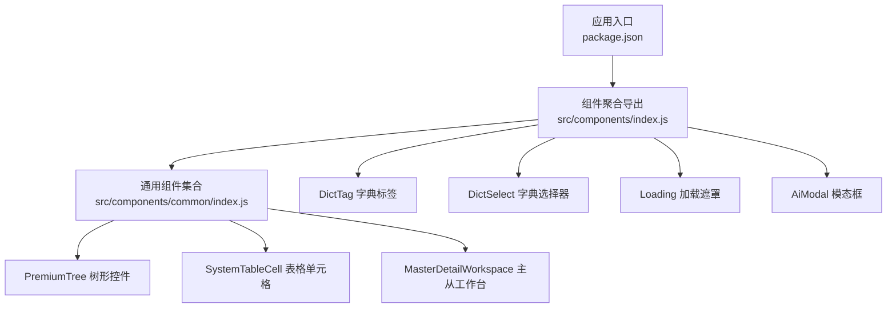
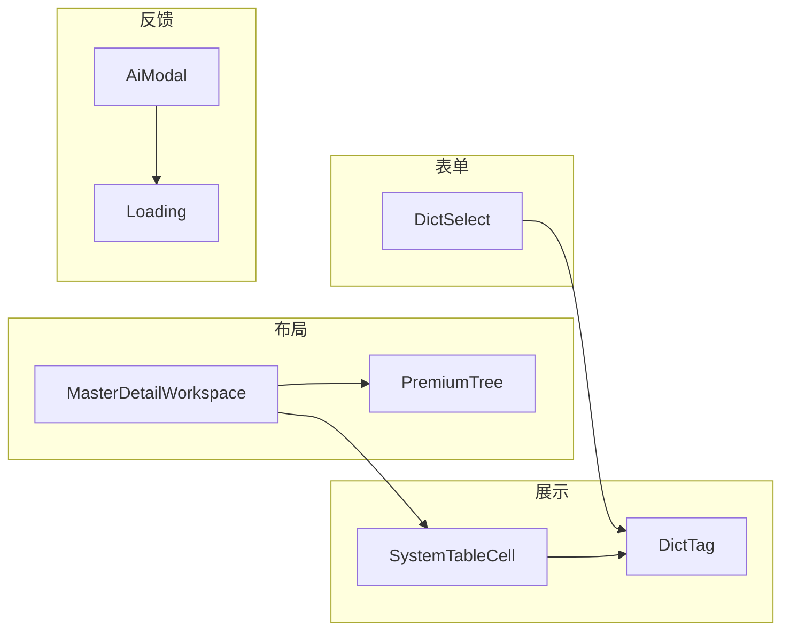
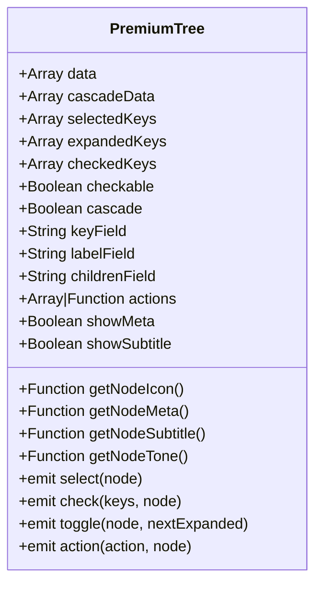
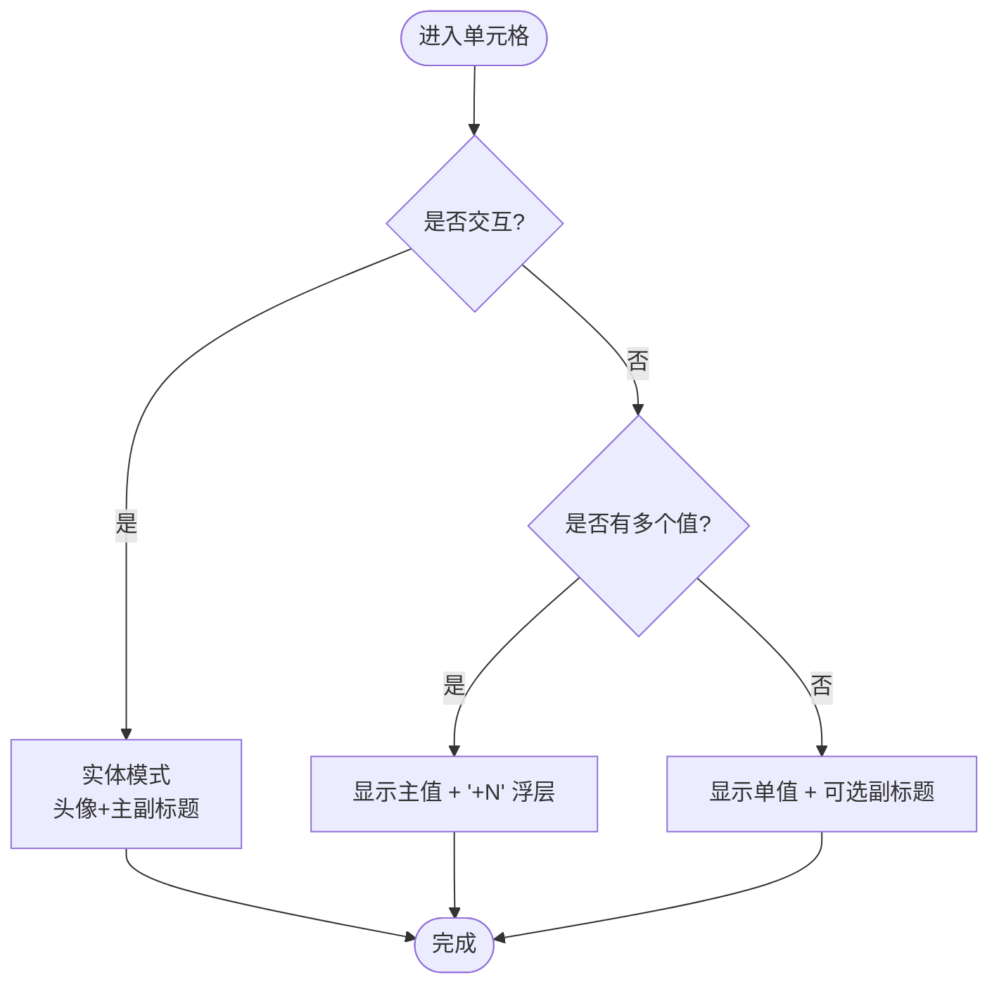
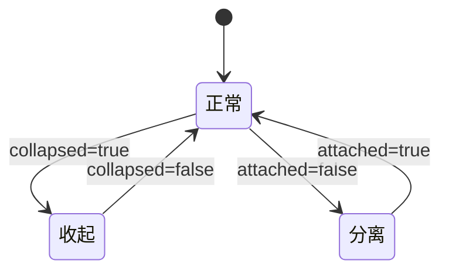
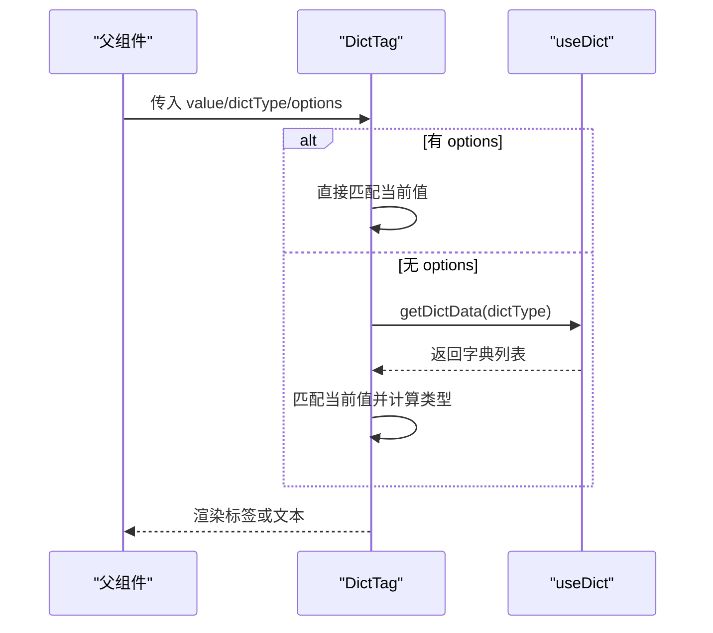
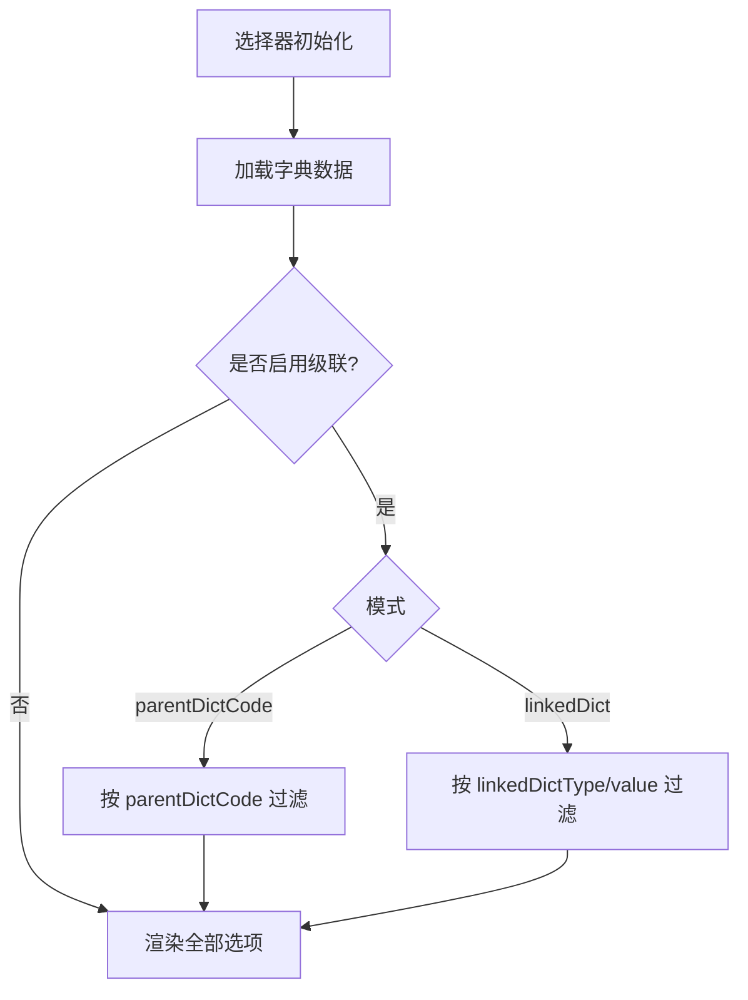
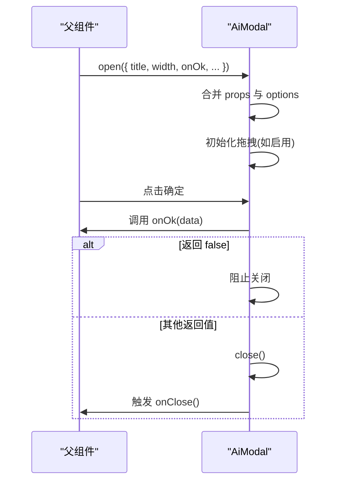
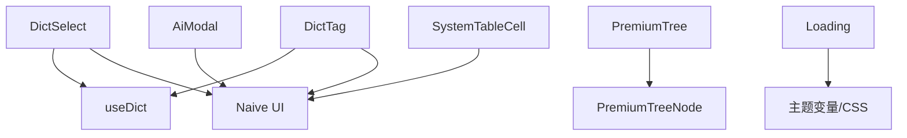

# 基础组件库

<cite>
**本文引用的文件**
- [package.json](file://forge-admin-ui/package.json)
- [DESIGN.md](file://forge-admin-ui/DESIGN.md)
- [components/index.js](file://forge-admin-ui/src/components/index.js)
- [components/common/index.js](file://forge-admin-ui/src/components/common/index.js)
- [PremiumTree.vue](file://forge-admin-ui/src/components/common/PremiumTree.vue)
- [SystemTableCell.vue](file://forge-admin-ui/src/components/common/SystemTableCell.vue)
- [MasterDetailWorkspace.vue](file://forge-admin-ui/src/components/common/MasterDetailWorkspace.vue)
- [DictTag.vue](file://forge-admin-ui/src/components/DictTag.vue)
- [DictSelect.vue](file://forge-admin-ui/src/components/DictSelect.vue)
- [Loading.vue](file://forge-admin-ui/src/components/Loading.vue)
- [ai-modal/index.vue](file://forge-admin-ui/src/components/ai-modal/index.vue)
</cite>

## 目录
1. [简介](#简介)
2. [项目结构](#项目结构)
3. [核心组件](#核心组件)
4. [架构总览](#架构总览)
5. [详细组件分析](#详细组件分析)
6. [依赖关系分析](#依赖关系分析)
7. [性能考虑](#性能考虑)
8. [故障排查指南](#故障排查指南)
9. [结论](#结论)
10. [附录](#附录)

## 简介
本文件为 Forge Admin 基础组件库的权威文档，聚焦通用 UI 组件的设计原则、实现方案与使用方式。内容覆盖：
- 表单类组件：输入、选择器（含字典级联）、日期等
- 数据展示类组件：表格单元格、树形控件、标签等
- 反馈类组件：对话框、通知增强、加载状态等
同时说明 API 接口、配置项、事件机制、样式定制（主题、响应式、国际化适配）、组合模式与最佳实践，并给出性能优化与可访问性建议。

## 项目结构
前端工程基于 Vue 3 + Naive UI + UnoCSS，组件集中在 forge-admin-ui/src/components，公共页面与工作区在 common 子目录，导出入口统一通过 index.js 暴露。

图表来源
- [package.json:1-107](file://forge-admin-ui/package.json#L1-L107)
- [components/index.js:1-8](file://forge-admin-ui/src/components/index.js#L1-L8)
- [components/common/index.js:1-13](file://forge-admin-ui/src/components/common/index.js#L1-L13)

章节来源
- [package.json:1-107](file://forge-admin-ui/package.json#L1-L107)
- [components/index.js:1-8](file://forge-admin-ui/src/components/index.js#L1-L8)
- [components/common/index.js:1-13](file://forge-admin-ui/src/components/common/index.js#L1-L13)

## 核心组件
- PremiumTree：高性能树形控件，支持多选、级联、展开、自定义图标/副标题/元信息、动作扩展。
- SystemTableCell：统一列表单元格，支持实体模式（头像+主副标题）、关联模式（主值+“+N”查看）。
- MasterDetailWorkspace：主从布局容器，左侧对象区与右侧工作区，支持收起、分离、响应式堆叠。
- DictTag：字典值渲染为标签或纯文本，自动映射类型，支持关闭事件。
- DictSelect：字典选择器，支持单选/多选、搜索、清空、级联过滤（父字典码/关联字典）。
- Loading：区域或全屏加载遮罩，支持文案、颜色、字号、背景透明度。
- AiModal：可拖拽、可配置头部/底部插槽、异步确认/取消、生命周期回调的模态框。

章节来源
- [PremiumTree.vue:1-283](file://forge-admin-ui/src/components/common/PremiumTree.vue#L1-L283)
- [SystemTableCell.vue:1-205](file://forge-admin-ui/src/components/common/SystemTableCell.vue#L1-L205)
- [MasterDetailWorkspace.vue:1-152](file://forge-admin-ui/src/components/common/MasterDetailWorkspace.vue#L1-L152)
- [DictTag.vue:1-280](file://forge-admin-ui/src/components/DictTag.vue#L1-L280)
- [DictSelect.vue:1-220](file://forge-admin-ui/src/components/DictSelect.vue#L1-L220)
- [Loading.vue:1-146](file://forge-admin-ui/src/components/Loading.vue#L1-L146)
- [ai-modal/index.vue:1-441](file://forge-admin-ui/src/components/ai-modal/index.vue#L1-L441)

## 架构总览
组件以“原子能力 + 组合布局”的方式构建：
- 原子能力：DictTag/DictSelect、SystemTableCell、Loading、AiModal
- 组合布局：MasterDetailWorkspace 组织树与列表/详情；PremiumTree 作为左侧对象区
- 设计约束：遵循 DESIGN.md 的视觉密度、交互边界、滚动与动效规范

图表来源
- [MasterDetailWorkspace.vue:1-152](file://forge-admin-ui/src/components/common/MasterDetailWorkspace.vue#L1-L152)
- [PremiumTree.vue:1-283](file://forge-admin-ui/src/components/common/PremiumTree.vue#L1-L283)
- [DictSelect.vue:1-220](file://forge-admin-ui/src/components/DictSelect.vue#L1-L220)
- [SystemTableCell.vue:1-205](file://forge-admin-ui/src/components/common/SystemTableCell.vue#L1-L205)
- [DictTag.vue:1-280](file://forge-admin-ui/src/components/DictTag.vue#L1-L280)
- [Loading.vue:1-146](file://forge-admin-ui/src/components/Loading.vue#L1-L146)
- [ai-modal/index.vue:1-441](file://forge-admin-ui/src/components/ai-modal/index.vue#L1-L441)

## 详细组件分析

### PremiumTree 树形控件
- 设计目标：紧凑、可扫读、支持多选级联、可扩展图标/副标题/元信息、支持动作。
- 关键特性：
  - 多选与级联：checkedKeys 与 cascadeData 配合，自动计算半选状态
  - 展开控制：expandedKeys 受控
  - 自定义渲染：getNodeIcon/getNodeSubtitle/getNodeMeta/getNodeTone
  - 事件：select/check/toggle/action
- 复杂度：级联状态收集与归一化遍历 O(n)，查找节点 O(n)

图表来源
- [PremiumTree.vue:37-108](file://forge-admin-ui/src/components/common/PremiumTree.vue#L37-L108)
- [PremiumTree.vue:140-184](file://forge-admin-ui/src/components/common/PremiumTree.vue#L140-L184)
- [PremiumTree.vue:201-274](file://forge-admin-ui/src/components/common/PremiumTree.vue#L201-L274)

章节来源
- [PremiumTree.vue:1-283](file://forge-admin-ui/src/components/common/PremiumTree.vue#L1-L283)

### SystemTableCell 表格单元格
- 设计目标：统一实体/关联/普通列的显示规则，避免过度装饰。
- 关键特性：
  - 实体模式：avatar + 主标题 + 副标题，点击触发 activate
  - 关联模式：values 去重后展示主值与“+N”，点击弹出全部值
  - 可访问性：按钮语义、aria-label、焦点可见
- 复杂度：O(1) 渲染，values 去重 O(n)

图表来源
- [SystemTableCell.vue:1-29](file://forge-admin-ui/src/components/common/SystemTableCell.vue#L1-L29)
- [SystemTableCell.vue:72-81](file://forge-admin-ui/src/components/common/SystemTableCell.vue#L72-L81)

章节来源
- [SystemTableCell.vue:1-205](file://forge-admin-ui/src/components/common/SystemTableCell.vue#L1-L205)

### MasterDetailWorkspace 主从工作台
- 设计目标：左侧对象区 + 右侧工作区的连体布局，支持收起、分离、响应式上下堆叠。
- 关键特性：
  - 宽度变量：asideWidth/collapsedAsideWidth/mainWidth
  - 分隔线：attached 时显示细分隔线
  - 响应式：窄屏切换为纵向堆叠
- 复杂度：纯布局，O(1)

图表来源
- [MasterDetailWorkspace.vue:25-57](file://forge-admin-ui/src/components/common/MasterDetailWorkspace.vue#L25-L57)
- [MasterDetailWorkspace.vue:64-152](file://forge-admin-ui/src/components/common/MasterDetailWorkspace.vue#L64-L152)

章节来源
- [MasterDetailWorkspace.vue:1-152](file://forge-admin-ui/src/components/common/MasterDetailWorkspace.vue#L1-L152)

### DictTag 字典标签
- 设计目标：将字典值渲染为标签或纯文本，自动映射类型，支持关闭。
- 关键特性：
  - 选项来源：options 优先，否则按 dictType 动态加载
  - 类型映射：listClass -> tagType（兼容旧命名）
  - 文本模式：当 listClass=default 且未强制 type 时显示纯文本
- 复杂度：匹配 O(n)，n 为字典项数量

图表来源
- [DictTag.vue:105-191](file://forge-admin-ui/src/components/DictTag.vue#L105-L191)

章节来源
- [DictTag.vue:1-280](file://forge-admin-ui/src/components/DictTag.vue#L1-L280)

### DictSelect 字典选择器
- 设计目标：提供带字典数据的下拉选择，支持多选、搜索、清空、级联过滤。
- 关键特性：
  - 级联模式：parentDictCode 或 linkedDict，支持 sourceField/sourceDictType/linkedDictType/linkedDictValue/matchMode
  - 静态级联：无需 formData，直接根据传入条件过滤
  - 禁用策略：status=0 的选项禁用
- 复杂度：过滤 O(n)

图表来源
- [DictSelect.vue:116-129](file://forge-admin-ui/src/components/DictSelect.vue#L116-L129)
- [DictSelect.vue:167-204](file://forge-admin-ui/src/components/DictSelect.vue#L167-L204)

章节来源
- [DictSelect.vue:1-220](file://forge-admin-ui/src/components/DictSelect.vue#L1-L220)

### Loading 加载遮罩
- 设计目标：区域或全屏加载提示，支持文案、颜色、字号、背景透明度。
- 关键特性：
  - fullscreen：固定定位覆盖全屏，锁定 body 滚动
  - 响应式：小屏缩小尺寸与字号
- 复杂度：O(1)

章节来源
- [Loading.vue:1-146](file://forge-admin-ui/src/components/Loading.vue#L1-L146)

### AiModal 模态框
- 设计目标：可拖拽、可配置头部/底部插槽、异步确认/取消、生命周期回调。
- 关键特性：
  - open/close/handleOk/handleCancel 暴露方法
  - okLoading 控制确定按钮加载状态
  - 拖拽：header 可拖拽移动
  - 生命周期：onOk/onCancel/onClose
- 复杂度：O(1)

图表来源
- [ai-modal/index.vue:279-337](file://forge-admin-ui/src/components/ai-modal/index.vue#L279-L337)
- [ai-modal/index.vue:350-385](file://forge-admin-ui/src/components/ai-modal/index.vue#L350-L385)

章节来源
- [ai-modal/index.vue:1-441](file://forge-admin-ui/src/components/ai-modal/index.vue#L1-L441)

## 依赖关系分析
- 外部依赖：Naive UI（NModal/NButton/NSelect/NTag/NPopover）、Vue 3 响应式、UnoCSS 原子化样式
- 内部依赖：DictTag/DictSelect 依赖 useDict 获取字典数据；PremiumTree 依赖 PremiumTreeNode 递归渲染
- 耦合度：组件间低耦合，通过 props/events 通信；布局组件 MasterDetailWorkspace 仅负责结构

图表来源
- [DictSelect.vue:25-28](file://forge-admin-ui/src/components/DictSelect.vue#L25-L28)
- [DictTag.vue:34-37](file://forge-admin-ui/src/components/DictTag.vue#L34-L37)
- [PremiumTree.vue:31-35](file://forge-admin-ui/src/components/common/PremiumTree.vue#L31-L35)
- [ai-modal/index.vue:106-109](file://forge-admin-ui/src/components/ai-modal/index.vue#L106-L109)
- [SystemTableCell.vue:31-33](file://forge-admin-ui/src/components/common/SystemTableCell.vue#L31-L33)
- [Loading.vue:62-146](file://forge-admin-ui/src/components/Loading.vue#L62-L146)

章节来源
- [package.json:19-73](file://forge-admin-ui/package.json#L19-L73)
- [components/index.js:1-8](file://forge-admin-ui/src/components/index.js#L1-L8)
- [components/common/index.js:1-13](file://forge-admin-ui/src/components/common/index.js#L1-L13)

## 性能考虑
- 列表与树：
  - 大数据量下使用服务端分页与懒加载树节点，避免全量展开与扁平渲染同时存在
  - 使用 computed/Set 缓存选中/展开/半选状态，减少重复计算
- 渲染优化：
  - 字典数据按需加载与缓存，避免重复请求
  - 表格单元格避免复杂嵌套与过多动画
- 交互体验：
  - 区域级 Loading 优先于全局 Loading，减少阻塞感
  - 限制动画属性与时长，避免影响首屏与滚动性能

[本节为通用指导，不直接分析具体文件]

## 故障排查指南
- 字典相关：
  - 未传 dictType 或未传 options：控制台告警，检查传入参数
  - 级联无效：检查 mode/sourceField/linkedDictType/linkedDictValue 是否正确
- 树形控件：
  - 多选级联异常：确认 cascadeData/data 结构与 keyField/childrenField 一致
  - 半选状态不正确：检查 normalizeCascadeCheckedKeys 与 collectCascadeState 逻辑
- 模态框：
  - 确定按钮一直 loading：确保 onOk 正确 return 或在 catch 中重置 okLoading
  - 拖拽失效：确认 header 可点击区域与 DOM 已挂载后再初始化
- 加载遮罩：
  - 全屏遮罩无法滚动：确认 fullscreen 模式下 onUnmounted 恢复 body 滚动

章节来源
- [DictSelect.vue:141-160](file://forge-admin-ui/src/components/DictSelect.vue#L141-L160)
- [DictTag.vue:171-191](file://forge-admin-ui/src/components/DictTag.vue#L171-L191)
- [PremiumTree.vue:201-274](file://forge-admin-ui/src/components/common/PremiumTree.vue#L201-L274)
- [ai-modal/index.vue:320-367](file://forge-admin-ui/src/components/ai-modal/index.vue#L320-L367)
- [Loading.vue:47-59](file://forge-admin-ui/src/components/Loading.vue#L47-L59)

## 结论
Forge Admin 基础组件库围绕“高信息密度、克制视觉、稳定交互”的原则，提供了表单、数据展示与反馈三类常用组件。通过 MasterDetailWorkspace 与 PremiumTree 的组合，能够快速搭建主从管理界面；DictTag/DictSelect 统一了字典数据的展示与选择；Loading/AiModal 完善了用户反馈闭环。建议在业务中严格遵循 DESIGN.md 的约束，结合组件的 API 与事件机制进行组合与扩展，以获得一致、可维护且高性能的管理后台体验。

[本节为总结，不直接分析具体文件]

## 附录

### 设计与约束要点（来自设计规范）
- 页面与信息密度：保持中高信息密度，明确当前对象与操作范围
- 颜色与文字：单一主题强调色，合理字号层级，禁止营销式大标题与重阴影
- 布局与滚动：三栏工作区各自独立滚动，禁止隐藏溢出却无内部滚动容器
- 工具栏与操作：贴近对象放置，最多两个常用直显操作，其余折叠
- 树与列表：默认只渲染必要层级，数据增长后改为懒加载与服务端分页
- 加载/空态/错误：区域级 Loading，空态贴近区域，错误提示明确失败动作
- 动效：仅允许少量属性变化，时长 120–180ms，禁止持续动画

章节来源
- [DESIGN.md:7-31](file://forge-admin-ui/DESIGN.md#L7-L31)
- [DESIGN.md:33-80](file://forge-admin-ui/DESIGN.md#L33-L80)
- [DESIGN.md:139-155](file://forge-admin-ui/DESIGN.md#L139-L155)

### 组件 API 速查
- PremiumTree
  - Props：data/cascadeData/selectedKeys/expandedKeys/checkedKeys/checkable/cascade/keyField/labelField/childrenField/getNodeIcon/getNodeMeta/getNodeSubtitle/getNodeTone/actions/showMeta/showSubtitle
  - Events：update:selected-keys/update:expanded-keys/update:checked-keys/select/check/toggle/action
- SystemTableCell
  - Props：title/subtitle/values/tooltip/interactive/avatar/avatarText
  - Events：activate
- MasterDetailWorkspace
  - Props：asideWidth/collapsedAsideWidth/mainWidth/collapsed/attached
- DictTag
  - Props：options/dictType/value/dictValue/type/size/round/bordered/closable/forceTag
  - Events：close
- DictSelect
  - Props：value/dictType/placeholder/disabled/clearable/filterable/multiple/formData/cascade/parentDictCode/linkedDictType/linkedDictValue/sourceField/sourceDictType/matchMode
  - Events：update:value
- Loading
  - Props：fullscreen/background/text/color/fontSize
- AiModal
  - 方法：open/close/handleOk/handleCancel
  - 属性：okLoading/options/show
  - Props：width/title/closable/maskClosable/cancelText/okText/showFooter/showCancel/showOk/cancelType/okType/cancelGhost/okGhost/modalStyle/contentStyle/segmented/draggable/showHeader/showHeaderExtra/onOk/onCancel/onClose

章节来源
- [PremiumTree.vue:37-108](file://forge-admin-ui/src/components/common/PremiumTree.vue#L37-L108)
- [SystemTableCell.vue:37-70](file://forge-admin-ui/src/components/common/SystemTableCell.vue#L37-L70)
- [MasterDetailWorkspace.vue:25-57](file://forge-admin-ui/src/components/common/MasterDetailWorkspace.vue#L25-L57)
- [DictTag.vue:38-99](file://forge-admin-ui/src/components/DictTag.vue#L38-L99)
- [DictSelect.vue:29-109](file://forge-admin-ui/src/components/DictSelect.vue#L29-L109)
- [Loading.vue:24-45](file://forge-admin-ui/src/components/Loading.vue#L24-L45)
- [ai-modal/index.vue:115-226](file://forge-admin-ui/src/components/ai-modal/index.vue#L115-L226)

### 样式定制与国际化
- 主题：通过 CSS 变量（如 --primary-color、--bg-primary、--text-primary、--border-light）统一控制；暗色模式通过 :global(.dark) 覆盖
- 响应式：组件内置媒体查询（如 MasterDetailWorkspace 窄屏堆叠、Loading 小屏缩放）
- 国际化：组件内文案建议使用外部 i18n 资源；当前部分组件包含中文硬编码文案，可在业务层替换

章节来源
- [DESIGN.md:16-31](file://forge-admin-ui/DESIGN.md#L16-L31)
- [MasterDetailWorkspace.vue:115-152](file://forge-admin-ui/src/components/common/MasterDetailWorkspace.vue#L115-L152)
- [Loading.vue:62-146](file://forge-admin-ui/src/components/Loading.vue#L62-L146)

### 可访问性建议
- 语义化元素：按钮用于可点击单元格与操作，避免用 div 模拟交互
- 键盘可达：确保焦点可见（focus-visible），提供 aria-label 描述图标按钮
- 屏幕阅读器：为重要交互提供有意义的标题与提示

章节来源
- [SystemTableCell.vue:1-29](file://forge-admin-ui/src/components/common/SystemTableCell.vue#L1-L29)
- [SystemTableCell.vue:196-199](file://forge-admin-ui/src/components/common/SystemTableCell.vue#L196-L199)