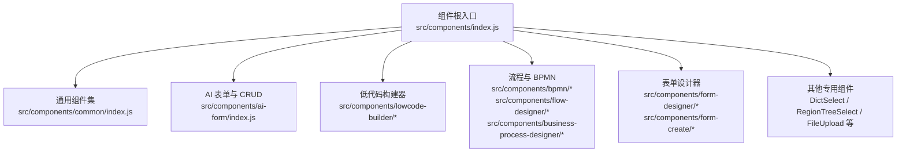
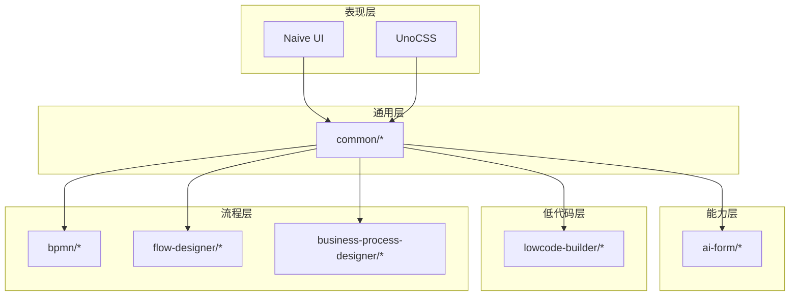
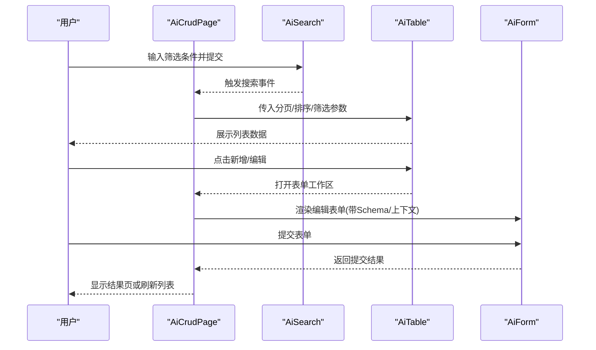
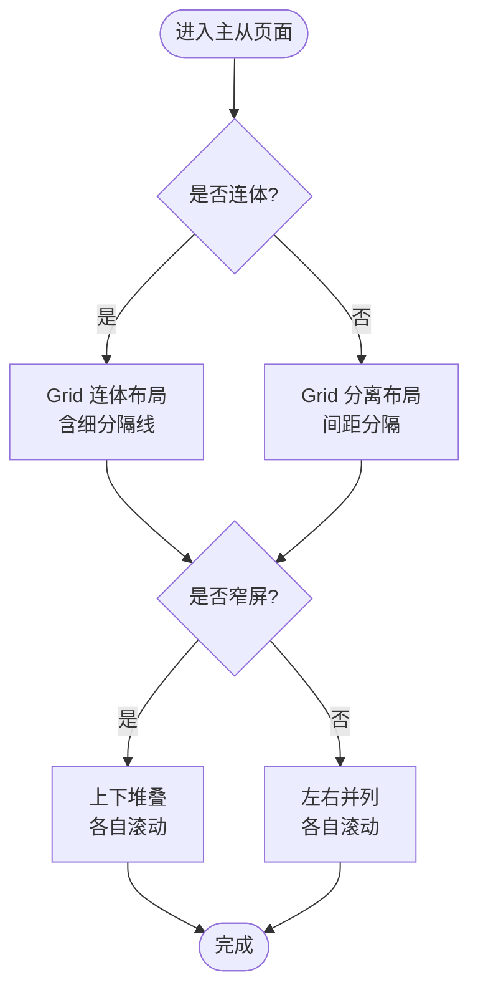
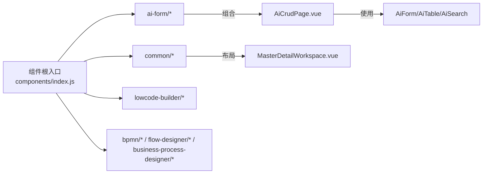

# 组件体系设计

<cite>
**本文引用的文件**
- [DESIGN.md](file://forge-admin-ui/DESIGN.md)
- [Forge Admin前端开发与组件规范.md](file://forge-admin-ui/Forge%20Admin%E5%89%8D%E7%AB%AF%E5%BC%80%E5%8F%91%E4%B8%8E%E7%BB%84%E4%BB%B6%E8%A7%84%E8%8C%83.md)
- [components/index.js](file://forge-admin-ui/src/components/index.js)
- [common/index.js](file://forge-admin-ui/src/components/common/index.js)
- [ai-form/index.js](file://forge-admin-ui/src/components/ai-form/index.js)
- [AiCrudPage.vue](file://forge-admin-ui/src/components/ai-form/AiCrudPage.vue)
- [MasterDetailWorkspace.vue](file://forge-admin-ui/src/components/common/MasterDetailWorkspace.vue)
</cite>

## 目录
1. [引言](#引言)
2. [项目结构](#项目结构)
3. [核心组件](#核心组件)
4. [架构总览](#架构总览)
5. [详细组件分析](#详细组件分析)
6. [依赖关系分析](#依赖关系分析)
7. [性能考虑](#性能考虑)
8. [故障排查指南](#故障排查指南)
9. [结论](#结论)
10. [附录](#附录)

## 引言
本文件面向 Forge Admin 前端组件体系，系统化说明分层架构、通用组件库、低代码相关组件、组件通信模式、样式管理与测试策略。目标是帮助开发者快速理解并正确使用基础组件、业务组件与页面组件，同时为扩展与重构提供一致的设计原则与实践指引。

## 项目结构
- 组件根入口位于 `src/components`，按能力域划分：
  - ai-form：配置化 CRUD、表单、表格、搜索等能力集合
  - common：跨页面复用的工作台、主题、树、图片鉴权等通用组件
  - lowcode-builder：低代码页面构建器、模型设计器、预览与发布面板
  - bpmn / flow-designer / business-process-designer：流程与 BPMN 设计器相关组件
  - form-designer / form-create：表单设计器与渲染桥接
  - 其他：字典选择、区域树、文件上传、作业调度等专用组件
- 公共导出通过各子目录的 index.js 聚合，便于按需引入与统一版本管理。

**图表来源**
- [components/index.js:1-8](file://forge-admin-ui/src/components/index.js#L1-L8)
- [common/index.js:1-13](file://forge-admin-ui/src/components/common/index.js#L1-L13)
- [ai-form/index.js:1-44](file://forge-admin-ui/src/components/ai-form/index.js#L1-L44)

**章节来源**
- [Forge Admin前端开发与组件规范.md:20-39](file://forge-admin-ui/Forge%20Admin%E5%89%8D%E7%AB%AF%E5%BC%80%E5%8F%91%E4%B8%8E%E7%BB%84%E4%BB%B6%E8%A7%84%E8%8C%83.md#L20-L39)

## 核心组件
- AiCrudPage：配置化 CRUD 页面容器，整合搜索、工具栏、表格、表单与结果页；支持仅表单模式、内嵌工作区、Tab 工作区、离线草稿提示等。
- MasterDetailWorkspace：主从工作台布局，左侧对象区 + 右侧工作区，支持收起、连体/分离、窄屏堆叠与滚动边界控制。
- 通用导出：DictSelect、DictTag、RegionTreeSelect 等高频 UI 能力在组件根入口集中暴露。

职责划分与设计原则
- 基础组件：负责最小粒度的展示与交互（如按钮、标签、选择器），遵循主题变量与无障碍要求。
- 业务组件：封装领域内常见组合（如 AiForm、AiTable、AiSearch），对外暴露稳定 Props/Events。
- 页面组件：以 AiCrudPage 为代表，编排业务数据流与交互状态，不处理页面级外边距与背景。

**章节来源**
- [AiCrudPage.vue:1-200](file://forge-admin-ui/src/components/ai-form/AiCrudPage.vue#L1-L200)
- [MasterDetailWorkspace.vue:1-152](file://forge-admin-ui/src/components/common/MasterDetailWorkspace.vue#L1-L152)
- [components/index.js:1-8](file://forge-admin-ui/src/components/index.js#L1-L8)

## 架构总览
组件体系采用“分层 + 领域”组织：
- 表现层：Naive UI + UnoCSS，统一主题变量与原子样式
- 通用层：common 下的工作台、主题、树、图片鉴权等
- 能力层：ai-form 提供的配置化 CRUD、表单、表格、搜索
- 低代码层：lowcode-builder 提供页面/模型设计器、预览与发布
- 流程层：bpmn / flow-designer / business-process-designer 提供流程图设计与运行态展示

**图表来源**
- [DESIGN.md:1-31](file://forge-admin-ui/DESIGN.md#L1-L31)
- [Forge Admin前端开发与组件规范.md:121-129](file://forge-admin-ui/Forge%20Admin%E5%89%8D%E7%AB%AF%E5%BC%80%E5%8F%91%E4%B8%8E%E7%BB%84%E4%BB%B6%E8%A7%84%E8%8C%83.md#L121-L129)

## 详细组件分析

### AiCrudPage：配置化 CRUD 页面容器
- 职责：聚合搜索、表格、新增/编辑/删除、导入导出、表单与结果页；支持仅表单模式、内嵌工作区与 Tab 工作区。
- 关键行为：
  - 搜索区：基于 Schema 渲染查询表单，透传插槽扩展操作
  - 表格区：集成选中、展开、列配置、批量操作
  - 表单区：支持网格布局、标签宽度/对齐、尺寸、间距、反馈开关、上下文注入
  - 结果区：提交成功后的引导与继续填报
- 与 Layout 的关系：不负责页面级外边距与背景，由 SystemPageLayout 或 MasterDetailWorkspace 统一处理

**图表来源**
- [AiCrudPage.vue:1-200](file://forge-admin-ui/src/components/ai-form/AiCrudPage.vue#L1-L200)

**章节来源**
- [AiCrudPage.vue:1-200](file://forge-admin-ui/src/components/ai-form/AiCrudPage.vue#L1-L200)
- [DESIGN.md:105-111](file://forge-admin-ui/DESIGN.md#L105-L111)

### MasterDetailWorkspace：主从工作台布局
- 职责：提供“左侧对象区 + 右侧工作区”的统一布局，支持收起、连体/分离、窄屏上下堆叠与各自滚动边界。
- 关键特性：
  - CSS Grid 布局，通过 CSS 变量控制侧栏宽度
  - 连体模式使用细分隔线，分离模式使用间距
  - 窄屏自动切换为上下堆叠，避免双重滚动
- 使用建议：当左侧树/分类决定右侧内容时优先使用该组件，避免重复实现响应式逻辑

**图表来源**
- [MasterDetailWorkspace.vue:1-152](file://forge-admin-ui/src/components/common/MasterDetailWorkspace.vue#L1-L152)

**章节来源**
- [MasterDetailWorkspace.vue:1-152](file://forge-admin-ui/src/components/common/MasterDetailWorkspace.vue#L1-L152)
- [DESIGN.md:43-79](file://forge-admin-ui/DESIGN.md#L43-L79)

### 低代码相关组件：页面/模型/流程设计器
- 低代码构建器（lowcode-builder）：
  - 页面构建：BuilderCanvas、BuilderZone、ListPageGridDesigner 等
  - 模型设计：LowcodeModelDesigner、DomainEditorDrawer 等
  - 预览与发布：LowcodePreviewPane、PublishPanel、VersionTimeline
  - 共享能力：运行时规则编辑器、字段类型选择、表单布局解析等
- 流程与 BPMN：
  - bpmn：BpmnModeler、ProcessDiagramViewer、InteractiveProcessDiagram 等
  - flow-designer：DingFlowDesigner、节点/画布/属性面板等
  - business-process-designer：BusinessProcessDesigner、Canvas、NodeRenderer 等

这些组件共同构成“设计-预览-发布-运行”的低代码闭环，支撑表单、表格、页面与流程的可视化构建。

**章节来源**
- [ai-form/index.js:1-44](file://forge-admin-ui/src/components/ai-form/index.js#L1-L44)
- [DESIGN.md:179-255](file://forge-admin-ui/DESIGN.md#L179-L255)

### 通用组件库：表单、表格、对话框、按钮等
- 表单：AiForm、AiFormItem、AiFormGroupTitle、AiFormSectionTitle，配合 Schema 驱动渲染与校验
- 表格：AiTable、AiTableFilter，支持密度、列配置、批量操作与空态
- 对话框：AiModal（通过 common/index.js 暴露）
- 按钮：基于 Naive UI 的 Button，结合项目语义色与可访问性约束
- 字典与选择：DictSelect、DictTag、RegionTreeSelect，统一枚举与行政区划能力

设计原则
- 优先使用 Naive UI Props 与 UnoCSS 原子类，减少自定义 CSS
- 所有交互控件需支持亮/暗主题与键盘可访问性
- 图标按钮必须提供 title 或 aria-label

**章节来源**
- [components/index.js:1-8](file://forge-admin-ui/src/components/index.js#L1-L8)
- [common/index.js:1-13](file://forge-admin-ui/src/components/common/index.js#L1-L13)
- [DESIGN.md:121-129](file://forge-admin-ui/DESIGN.md#L121-L129)

### 组件通信模式
- Props/Events：组件间通过明确定义的 Props 与事件传递数据与动作，例如 AiCrudPage 向 AiForm/AiTable 传递配置与回调
- Provide/Inject：适用于跨层级共享上下文（如表单上下文、主题、权限），避免逐层透传
- 状态共享：
  - 局部状态：ref/computed 用于单组件内部
  - 跨路由/全局状态：Pinia Store（如用户、主题、会话）
- 约定：
  - 事件名使用动词开头的 kebab-case，描述已发生的业务结果
  - 组件不直接修改父组件传入的对象/数组，通过事件上抛或复制后提交

**章节来源**
- [Forge Admin前端开发与组件规范.md:113-120](file://forge-admin-ui/Forge%20Admin%E5%89%8D%E7%AB%AF%E5%BC%80%E5%8F%91%E4%B8%8E%E7%BB%84%E4%BB%B6%E8%A7%84%E8%8C%83.md#L113-L120)
- [Forge Admin前端开发与组件规范.md:171-184](file://forge-admin-ui/Forge%20Admin%E5%89%8D%E7%AB%AF%E5%BC%80%E5%8F%91%E4%B8%8E%E7%BB%84%E4%BB%B6%E8%A7%84%E8%8C%83.md#L171-L184)

### 样式管理：模块化、主题定制、响应式
- 主题变量：统一使用 --primary-color、--bg-primary、--border-light、--text-primary、--text-tertiary
- 样式层次：
  1) Naive UI Props 优先
  2) UnoCSS 原子类表达局部布局与间距
  3) 组件 scoped style 处理结构与复杂交互
  4) src/styles 存放跨业务域的视觉变量与重置
- 响应式：
  - 断点优先使用现有 960px、768px 规则
  - 窄屏下工作台由左右切为上下，表格/树/卡片容器需配置溢出策略
- 动效：仅允许 color、background、border、opacity、transform，时长 120–180ms

**章节来源**
- [DESIGN.md:16-31](file://forge-admin-ui/DESIGN.md#L16-L31)
- [DESIGN.md:148-155](file://forge-admin-ui/DESIGN.md#L148-L155)
- [Forge Admin前端开发与组件规范.md:247-267](file://forge-admin-ui/Forge%20Admin%E5%89%8D%E7%AB%AF%E5%BC%80%E5%8F%91%E4%B8%8E%E7%BB%84%E4%BB%B6%E8%A7%84%E8%8C%83.md#L247-L267)

### 组件测试策略
- 单元测试：针对组件逻辑、计算属性、事件处理进行覆盖，确保边界条件与异常路径
- 集成测试：验证组件组合行为（如 AiCrudPage 中搜索→表格→表单提交流程）
- 视觉回归测试：对关键页面与组件在不同主题与分辨率下的渲染一致性进行快照比对
- 最小验证矩阵：
  - Vue/JS/CSS：ESLint + 构建
  - CRUD：列表、查询、重置、分页、增改删、空态
  - 字典：异步加载、下拉回显、表格标签回显
  - 文件：上传、编辑回显、鉴权预览、下载
  - 主从工作台：左侧选择、收起、右侧刷新、窄屏堆叠
  - 权限：无权限隐藏/禁用、接口失败提示、权限变更后刷新

**章节来源**
- [Forge Admin前端开发与组件规范.md:268-289](file://forge-admin-ui/Forge%20Admin%E5%89%8D%E7%AB%AF%E5%BC%80%E5%8F%91%E4%B8%8E%E7%BB%84%E4%BB%B6%E8%A7%84%E8%8C%83.md#L268-L289)

## 依赖关系分析
- 组件根入口聚合各子模块导出，形成稳定的外部契约
- AiCrudPage 依赖 AiForm、AiTable、AiSearch 等能力组件，并通过插槽与上下文扩展
- MasterDetailWorkspace 作为布局容器，被多个页面复用，降低重复样式与响应式逻辑
- 低代码构建器与流程设计器依赖通用组件与主题系统，保证一致的视觉与交互体验

**图表来源**
- [components/index.js:1-8](file://forge-admin-ui/src/components/index.js#L1-L8)
- [ai-form/index.js:1-44](file://forge-admin-ui/src/components/ai-form/index.js#L1-L44)
- [AiCrudPage.vue:1-200](file://forge-admin-ui/src/components/ai-form/AiCrudPage.vue#L1-L200)
- [MasterDetailWorkspace.vue:1-152](file://forge-admin-ui/src/components/common/MasterDetailWorkspace.vue#L1-L152)

**章节来源**
- [components/index.js:1-8](file://forge-admin-ui/src/components/index.js#L1-L8)
- [ai-form/index.js:1-44](file://forge-admin-ui/src/components/ai-form/index.js#L1-L44)

## 性能考虑
- 列表与表格：
  - 默认密度 medium，仅在审计/日志等高密度场景使用 small
  - 分页与服务端排序/筛选，避免前端假分页造成 DOM 与传输压力
- 树与菜单：
  - 首次进入默认展开当前层级，避免全量展开深层树
  - 大数据量时改用 parentId 懒加载
- 加载与空态：
  - 普通请求使用区域级 Loading，阻塞性操作才使用全局 Loading
  - 空态贴近对应区域，区分“暂无数据”与“没有匹配结果”
- 动画：
  - 仅允许 transform/opacity/color/background/border，时长 120–180ms
  - 禁止动画 width/height/top/left

**章节来源**
- [DESIGN.md:139-155](file://forge-admin-ui/DESIGN.md#L139-L155)
- [DESIGN.md:179-255](file://forge-admin-ui/DESIGN.md#L179-L255)

## 故障排查指南
- 常见问题定位：
  - 列表为空：检查筛选条件、分页参数、后端接口返回结构
  - 表单无法提交：确认 beforeSubmit 是否返回 false、异步逻辑是否 await
  - 主题异常：确认是否使用了固定颜色而非主题变量
  - 滚动异常：检查容器是否设置 min-height: 0 与 overflow: auto
- 调试建议：
  - 使用浏览器控制台查看网络请求与错误信息
  - 通过 ESLint 与构建脚本提前发现语法与类型问题
  - 对关键变更执行最小验证矩阵中的必做验证项

**章节来源**
- [Forge Admin前端开发与组件规范.md:130-136](file://forge-admin-ui/Forge%20Admin%E5%89%8D%E7%AB%AF%E5%BC%80%E5%8F%91%E4%B8%8E%E7%BB%84%E4%BB%B6%E8%A7%84%E8%8C%83.md#L130-L136)
- [Forge Admin前端开发与组件规范.md:268-289](file://forge-admin-ui/Forge%20Admin%E5%89%8D%E7%AB%AF%E5%BC%80%E5%8F%91%E4%B8%8E%E7%BB%84%E4%BB%B6%E8%A7%84%E8%8C%83.md#L268-L289)

## 结论
Forge Admin 组件体系以“分层 + 领域”为核心，通过通用组件、能力组件与低代码构建器的协同，实现了高内聚、低耦合的前端工程化实践。AiCrudPage 与 MasterDetailWorkspace 分别承担了 CRUD 编排与主从布局的关键角色；低代码与流程设计器则提供了强大的可视化构建能力。配合统一的样式与测试策略，团队可以在保证一致性的前提下高效迭代。

## 附录
- 推荐实践清单：
  - 新组件明确 Props/Events/Slots/空态/加载态/可访问性
  - 优先复用现有组件与组合式函数，避免重复实现
  - 提交前执行 ESLint、构建与最小验证矩阵
  - 保持亮/暗主题与窄屏下的可读性与可用性