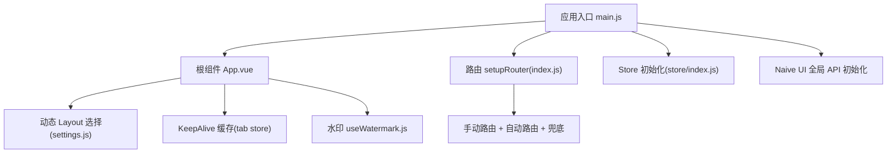
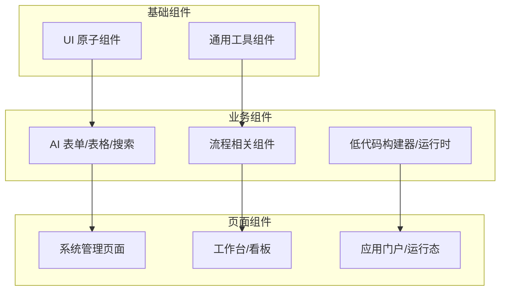
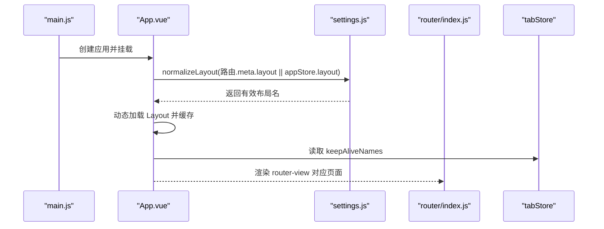
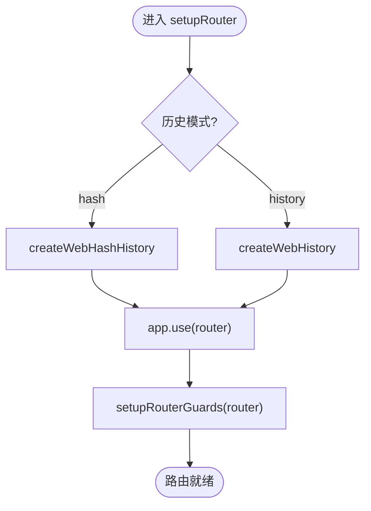
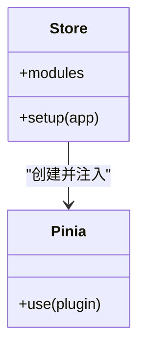
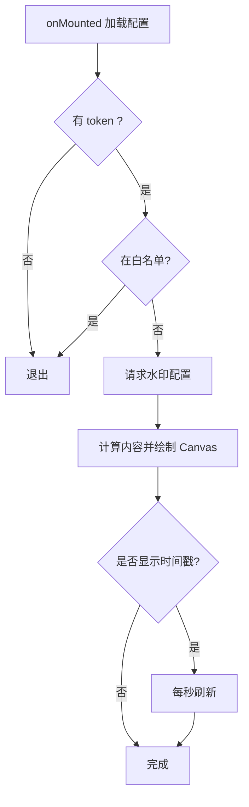
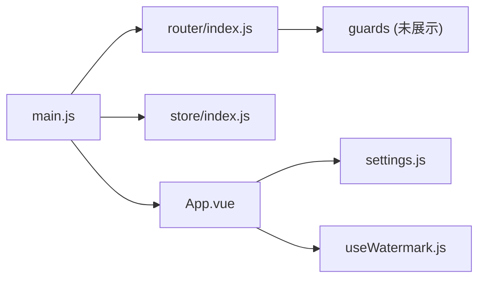

# 组件架构设计

<cite>
**本文引用的文件**
- [App.vue](file://forge-admin-ui/src/App.vue)
- [main.js](file://forge-admin-ui/src/main.js)
- [package.json](file://forge-admin-ui/package.json)
- [index.js（路由）](file://forge-admin-ui/src/router/index.js)
- [index.js（Store 初始化）](file://forge-admin-ui/src/store/index.js)
- [settings.js](file://forge-admin-ui/src/settings.js)
- [components/index.js](file://forge-admin-ui/src/components/index.js)
- [useWatermark.js](file://forge-admin-ui/src/composables/useWatermark.js)
- [DESIGN.md](file://forge-admin-ui/DESIGN.md)
</cite>

## 目录
1. [简介](#简介)
2. [项目结构](#项目结构)
3. [核心组件](#核心组件)
4. [架构总览](#架构总览)
5. [详细组件分析](#详细组件分析)
6. [依赖关系分析](#依赖关系分析)
7. [性能考量](#性能考量)
8. [故障排查指南](#故障排查指南)
9. [结论](#结论)
10. [附录](#附录)

## 简介
本文件面向 Forge Admin 前端工程，系统化阐述其组件分层架构、通信模式、生命周期与资源管理、样式体系、测试策略以及开发规范。目标是帮助读者快速理解“基础组件—业务组件—页面组件”的职责边界与协作方式，并掌握在复杂后台系统中稳定扩展与维护的实践方法。

## 项目结构
Forge Admin 采用基于 Vue 3 + Vite 的前端工程组织方式，入口负责应用启动、全局能力装配与主题初始化；路由负责页面导航与守卫；Store 提供全局状态；组件按“通用/业务/低代码/流程”等维度分目录组织；布局通过动态加载实现多套框架外壳；样式通过 UnoCSS 与设计令牌统一。

图表来源
- [main.js:20-50](file://forge-admin-ui/src/main.js#L20-L50)
- [App.vue:1-40](file://forge-admin-ui/src/App.vue#L1-L40)
- [index.js（路由）:263-286](file://forge-admin-ui/src/router/index.js#L263-L286)
- [index.js（Store 初始化）:4-8](file://forge-admin-ui/src/store/index.js#L4-L8)
- [settings.js:21-114](file://forge-admin-ui/src/settings.js#L21-L114)

章节来源
- [main.js:20-50](file://forge-admin-ui/src/main.js#L20-L50)
- [App.vue:1-40](file://forge-admin-ui/src/App.vue#L1-L40)
- [index.js（路由）:263-286](file://forge-admin-ui/src/router/index.js#L263-L286)
- [index.js（Store 初始化）:4-8](file://forge-admin-ui/src/store/index.js#L4-L8)
- [settings.js:21-114](file://forge-admin-ui/src/settings.js#L21-L114)

## 核心组件
- 应用根组件 App.vue：挂载 Naive UI 配置提供者、消息/对话框上下文、全局加载遮罩、水印层；根据路由元信息动态切换 Layout；使用 KeepAlive 控制页面缓存；监听主题变化并应用响应式字体。
- 布局系统：通过 settings.js 定义可用布局集合与默认值；App.vue 以 Map 缓存已加载的异步 Layout 组件，避免重复加载导致的闪烁。
- 路由系统：合并手动路由与自动生成路由，提供 404/403 兜底；支持 hash/history 两种历史模式；集中注册登录、SSO、应用门户、工作区等关键路由。
- Store 系统：使用 Pinia 作为全局状态容器，启用持久化插件；模块按功能划分（应用、权限、用户、标签页、租户、路由等）。
- 通用组件导出：components/index.js 统一暴露常用组件（如字典选择、行政区划树选择等），便于上层页面按需引入。
- 水印能力：useWatermark composable 提供可配置的水印渲染、内容解析、定时刷新与生命周期清理。

章节来源
- [App.vue:1-150](file://forge-admin-ui/src/App.vue#L1-L150)
- [settings.js:21-114](file://forge-admin-ui/src/settings.js#L21-L114)
- [index.js（路由）:24-286](file://forge-admin-ui/src/router/index.js#L24-L286)
- [index.js（Store 初始化）:4-8](file://forge-admin-ui/src/store/index.js#L4-L8)
- [components/index.js:1-8](file://forge-admin-ui/src/components/index.js#L1-L8)
- [useWatermark.js:1-315](file://forge-admin-ui/src/composables/useWatermark.js#L1-L315)

## 架构总览
Forge Admin 的组件分层遵循“基础组件—业务组件—页面组件”的分治原则：
- 基础组件：UI 原子能力（按钮、表单控件、图标、表格单元格等），无业务语义，高内聚、低耦合。
- 业务组件：封装领域逻辑（如 AI CRUD、流程审批、数据可视化、低代码构建器等），复用基础组件，对外暴露稳定的 props/events。
- 页面组件：组合业务组件与布局，承载具体路由视图，协调状态与交互流程。

[此图为概念性架构图，不直接映射到具体源码文件]

## 详细组件分析

### 应用根组件与布局系统（App.vue + settings.js）
- 职责
  - 提供全局主题、语言、消息与对话框上下文。
  - 根据路由 meta.layout 或 appStore 配置动态选择 Layout，并使用 Map 缓存异步组件实例。
  - 通过 KeepAlive 与 tabStore 控制页面缓存与重渲染。
  - 集成水印层与全局加载遮罩。
- 关键点
  - 布局归一化：normalizeLayout 确保仅使用合法布局名。
  - 懒加载与缓存：defineAsyncComponent + Map 防止重复加载。
  - 主题联动：watchEffect 监听主题色与暗色模式变化，调用 store 更新主题覆盖。
  - 响应式字体：onMounted 中初始化响应式字体并同步到 Naive UI 主题覆盖。

图表来源
- [App.vue:67-99](file://forge-admin-ui/src/App.vue#L67-L99)
- [settings.js:111-114](file://forge-admin-ui/src/settings.js#L111-L114)
- [index.js（路由）:274-286](file://forge-admin-ui/src/router/index.js#L274-L286)

章节来源
- [App.vue:1-150](file://forge-admin-ui/src/App.vue#L1-L150)
- [settings.js:21-114](file://forge-admin-ui/src/settings.js#L21-L114)

### 路由系统与守卫（router/index.js）
- 职责
  - 合并手动路由与自动路由，提供 404/403 兜底。
  - 支持 hash/history 模式切换。
  - 集中定义登录、回调、应用门户、工作区等关键路由及其 meta。
- 关键点
  - 兼容旧版数据范围参数跳转。
  - 应用门户与运行态路由设置 preserveOnQuery，保证查询变更不触发不必要的重建。
  - setupRouter 中安装路由并注册守卫。

图表来源
- [index.js（路由）:274-286](file://forge-admin-ui/src/router/index.js#L274-L286)

章节来源
- [index.js（路由）:24-286](file://forge-admin-ui/src/router/index.js#L24-L286)

### Store 与全局状态（store/index.js）
- 职责
  - 初始化 Pinia 并启用持久化插件。
  - 将 store 注入到 Vue 应用实例。
- 关键点
  - 通过模块化拆分（app/auth/permission/tab/tenant/router/user）实现关注点分离。
  - 持久化插件保障关键状态跨会话保留。

图表来源
- [index.js（Store 初始化）:4-8](file://forge-admin-ui/src/store/index.js#L4-L8)

章节来源
- [index.js（Store 初始化）:4-8](file://forge-admin-ui/src/store/index.js#L4-L8)

### 水印能力（composables/useWatermark.js）
- 职责
  - 提供可配置的水印渲染，支持文本/字典内容解析、时间戳显示、旋转与间距。
  - 监听用户信息与配置变化，自动更新水印。
  - 在卸载时清理定时器，避免内存泄漏。
- 关键点
  - 白名单路由跳过水印。
  - 通过 Canvas 生成背景图，避免 DOM 污染。
  - 提供 registerContentParser 扩展自定义内容解析器。

图表来源
- [useWatermark.js:174-246](file://forge-admin-ui/src/composables/useWatermark.js#L174-L246)

章节来源
- [useWatermark.js:1-315](file://forge-admin-ui/src/composables/useWatermark.js#L1-315)

### 组件通信模式
- Props/事件传递
  - 页面组件向业务组件传入配置与数据，业务组件通过事件回调通知父级状态变更。
- provide/inject
  - 在布局或页面层级提供共享上下文（如主题、用户信息、权限），子组件按需注入，减少 prop drilling。
- 全局状态共享
  - 通过 Pinia 模块化管理用户、权限、标签页、租户等状态，跨组件共享且可持久化。
- 事件总线
  - 对于跨层级、弱耦合的通知场景，可使用轻量事件机制（例如消息通知增强组件），但应优先使用 Store 或路由事件以保持可追踪性。

章节来源
- [App.vue:18-38](file://forge-admin-ui/src/App.vue#L18-L38)
- [index.js（Store 初始化）:4-8](file://forge-admin-ui/src/store/index.js#L4-L8)
- [useWatermark.js:159-311](file://forge-admin-ui/src/composables/useWatermark.js#L159-L311)

### 生命周期管理与资源管理
- 应用启动
  - main.js 中依次执行调试面板、加密配置、Store 初始化、Naive UI 全局 API、指令、主题、企微免登、路由挂载与挂载根节点。
- 组件生命周期
  - App.vue onMounted 初始化响应式字体并更新主题；watchEffect 响应主题变化；watch 监听布局变化并动态切换 Layout。
  - useWatermark onMounted 加载配置，onUnmounted 清理定时器。
- 资源管理
  - 动态导入 Layout 并缓存，避免重复加载。
  - KeepAlive 控制页面缓存，结合 tabStore 精确管理缓存列表。
  - 水印 Canvas 与定时器在卸载时释放。

章节来源
- [main.js:20-50](file://forge-admin-ui/src/main.js#L20-L50)
- [App.vue:90-149](file://forge-admin-ui/src/App.vue#L90-L149)
- [useWatermark.js:290-298](file://forge-admin-ui/src/composables/useWatermark.js#L290-L298)

### 样式架构
- CSS 模块化与原子化
  - 使用 UnoCSS 进行原子化样式，配合 design-tokens.css 与 theme.css 统一管理设计令牌与主题变量。
- 主题系统
  - 通过 Naive UI 的 config-provider 与 theme-overrides 实现主题覆盖；App.vue 监听主题变化并应用。
- 样式隔离
  - 组件使用 scoped 样式或 CSS Modules 风格隔离；全局样式集中在 styles 目录。
- 响应式设计
  - 响应式字体与主题变量驱动；布局在不同屏幕下自适应（如 MasterDetailWorkspace 的窄屏堆叠）。

章节来源
- [main.js:12-18](file://forge-admin-ui/src/main.js#L12-L18)
- [App.vue:144-149](file://forge-admin-ui/src/App.vue#L144-L149)
- [DESIGN.md:16-31](file://forge-admin-ui/DESIGN.md#L16-L31)

### 测试策略
- 单元测试
  - 针对 composables（如 useWatermark）与纯函数进行断言，验证配置解析、Canvas 输出与定时器行为。
- 集成测试
  - 对路由守卫、布局切换、KeepAlive 缓存策略进行端到端验证，确保页面切换与状态一致性。
- 视觉回归测试
  - 基于截图对比验证主题切换、布局切换与水印渲染的视觉稳定性。
- 实践建议
  - 使用 Vitest 与 @vue/test-utils 编写组件测试；利用 Mock 外部依赖（API、Store）提升测试稳定性。

章节来源
- [package.json:75-104](file://forge-admin-ui/package.json#L75-L104)

### 开发规范与最佳实践
- 组件职责清晰
  - 基础组件无业务语义；业务组件封装领域逻辑；页面组件组合编排。
- 通信约定
  - 优先 props/events；跨层级共享用 provide/inject；全局状态用 Store；避免滥用事件总线。
- 样式规范
  - 遵循 DESIGN.md 的颜色、字号、间距与动效约束；使用设计令牌与主题变量；保持亮/暗色与窄屏适配。
- 性能优化
  - 动态加载 Layout；KeepAlive 精准缓存；局部 Loading；避免全量展开树与列表。
- 可维护性
  - 统一导出组件入口；命名与目录结构一致；注释与文档完善。

章节来源
- [DESIGN.md:7-31](file://forge-admin-ui/DESIGN.md#L7-L31)
- [DESIGN.md:81-155](file://forge-admin-ui/DESIGN.md#L81-L155)
- [DESIGN.md:156-277](file://forge-admin-ui/DESIGN.md#L156-L277)

## 依赖关系分析
- 应用入口依赖
  - main.js 依赖路由、Store、指令、主题配置、全局样式与第三方库（如 axios、naive-ui、pinia）。
- 组件依赖
  - App.vue 依赖 settings.js 的布局配置；依赖 store 中的 appStore、tabStore、userStore、permissionStore；依赖 composables/useWatermark。
- 路由依赖
  - router/index.js 依赖手动路由与自动路由，并在 setupRouter 中注册守卫。
- Store 依赖
  - store/index.js 依赖 Pinia 与持久化插件。

图表来源
- [main.js:20-50](file://forge-admin-ui/src/main.js#L20-L50)
- [App.vue:43-55](file://forge-admin-ui/src/App.vue#L43-L55)
- [index.js（路由）:283-286](file://forge-admin-ui/src/router/index.js#L283-L286)
- [index.js（Store 初始化）:4-8](file://forge-admin-ui/src/store/index.js#L4-L8)

章节来源
- [main.js:20-50](file://forge-admin-ui/src/main.js#L20-L50)
- [App.vue:43-55](file://forge-admin-ui/src/App.vue#L43-L55)
- [index.js（路由）:283-286](file://forge-admin-ui/src/router/index.js#L283-L286)
- [index.js（Store 初始化）:4-8](file://forge-admin-ui/src/store/index.js#L4-L8)

## 性能考量
- 动态加载与缓存
  - Layout 组件通过 defineAsyncComponent 与 Map 缓存，避免重复加载与闪烁。
- 页面缓存
  - KeepAlive 结合 tabStore 的 cacheViews，精确控制缓存范围，减少重复渲染。
- 主题与字体
  - 响应式字体与主题变量减少重排；按需更新 Naive UI 主题覆盖。
- 水印性能
  - 使用 Canvas 生成背景图，避免大量 DOM 操作；仅在必要时刷新时间戳。
- 路由与守卫
  - 合理设置 preserveOnQuery，减少不必要的重建；兜底路由避免异常路径导致崩溃。

章节来源
- [App.vue:67-99](file://forge-admin-ui/src/App.vue#L67-L99)
- [App.vue:124-128](file://forge-admin-ui/src/App.vue#L124-L128)
- [App.vue:135-149](file://forge-admin-ui/src/App.vue#L135-L149)
- [useWatermark.js:229-246](file://forge-admin-ui/src/composables/useWatermark.js#L229-L246)
- [index.js（路由）:125-140](file://forge-admin-ui/src/router/index.js#L125-L140)

## 故障排查指南
- 主题不生效
  - 检查 applyThemeConfig 调用时机与主题覆盖是否正确；确认 watchEffect 监听主题变化。
- 布局切换闪烁
  - 确认 Layout 缓存是否命中；检查 normalizeLayout 返回值是否为合法布局名。
- 水印不显示
  - 检查是否有 token、是否在白名单、配置是否 enable；确认 Canvas 绘制成功与样式应用。
- 页面缓存异常
  - 核对 tabStore.cacheViews 与 KeepAlive include；检查 resolveRouteViewKey 逻辑。
- 路由守卫阻塞
  - 检查 routeGuardCompleted 标志位；确认菜单数据加载完成后再解除 loading。

章节来源
- [App.vue:144-149](file://forge-admin-ui/src/App.vue#L144-L149)
- [App.vue:67-99](file://forge-admin-ui/src/App.vue#L67-L99)
- [useWatermark.js:174-246](file://forge-admin-ui/src/composables/useWatermark.js#L174-L246)
- [App.vue:124-128](file://forge-admin-ui/src/App.vue#L124-L128)
- [App.vue:101-122](file://forge-admin-ui/src/App.vue#L101-L122)

## 结论
Forge Admin 的组件架构以清晰的层次划分、稳定的通信模式与完善的样式体系为基础，结合动态布局、页面缓存与水印等能力，提供了可扩展、高性能、易维护的后台管理前端方案。遵循设计规范与最佳实践，可在保证一致性的同时快速迭代业务需求。

## 附录
- 设计与公共组件约束详见 DESIGN.md，涵盖颜色、文字、页面边界、CRUD 列规范、工具栏与对象归属、树与性能、加载空态错误动效、系统页面约束、流程资产卡片规范与交付检查清单。

章节来源
- [DESIGN.md:7-31](file://forge-admin-ui/DESIGN.md#L7-L31)
- [DESIGN.md:81-155](file://forge-admin-ui/DESIGN.md#L81-L155)
- [DESIGN.md:156-277](file://forge-admin-ui/DESIGN.md#L156-L277)