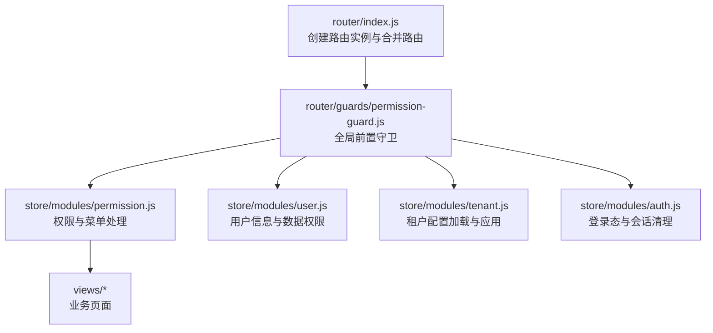
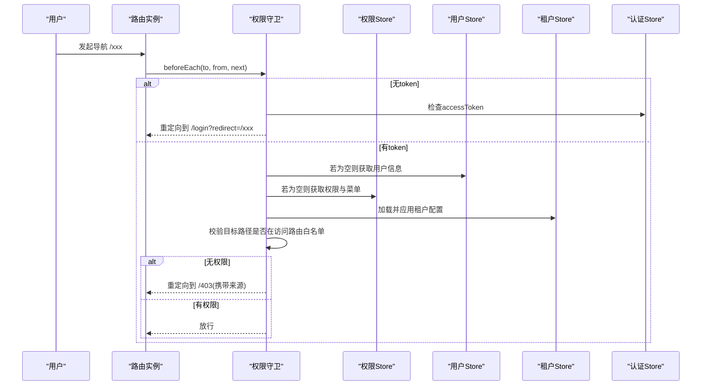
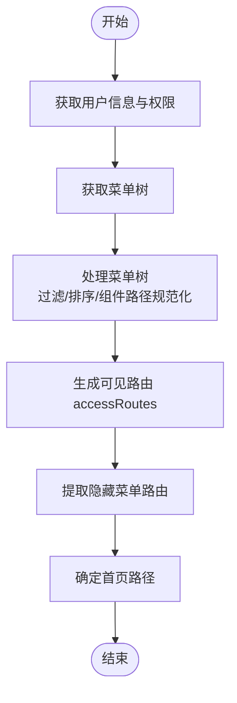
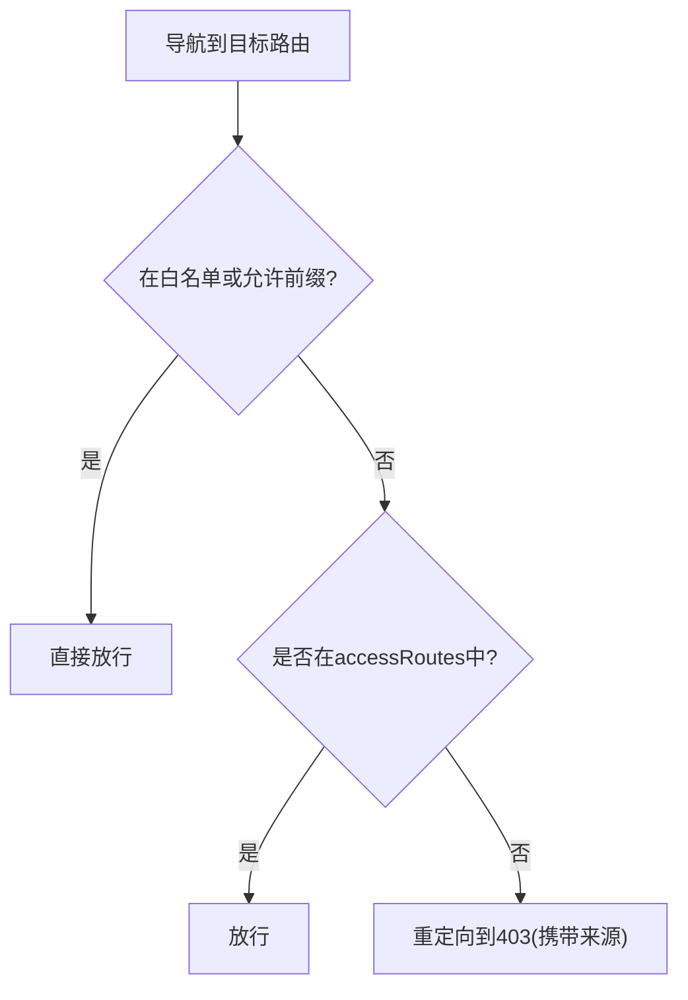
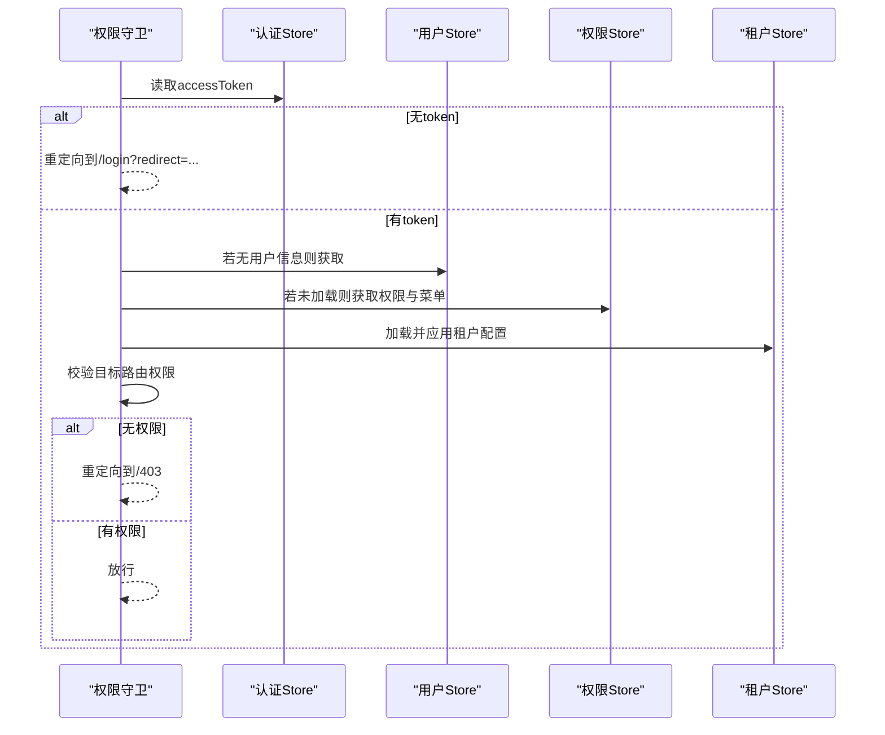
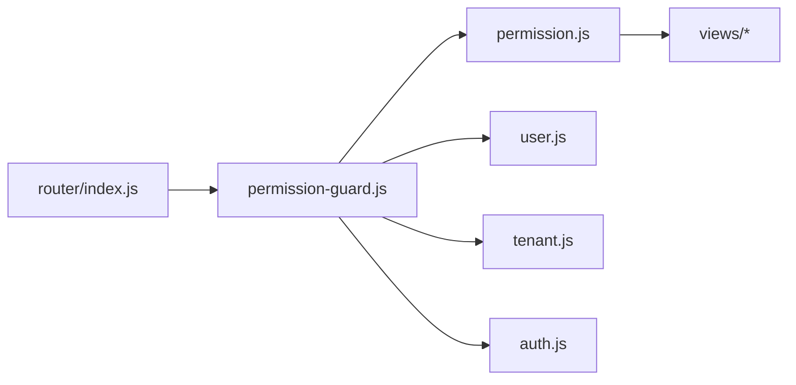

# 路由权限设计

<cite>
**本文引用的文件**
- [src/router/index.js](file://forge-admin-ui/src/router/index.js)
- [src/router/guards/permission-guard.js](file://forge-admin-ui/src/router/guards/permission-guard.js)
- [src/router/guards/auth-bootstrap-recovery.js](file://forge-admin-ui/src/router/guards/auth-bootstrap-recovery.js)
- [src/store/modules/permission.js](file://forge-admin-ui/src/store/modules/permission.js)
- [src/store/modules/auth.js](file://forge-admin-ui/src/store/modules/auth.js)
- [src/store/modules/user.js](file://forge-admin-ui/src/store/modules/user.js)
- [src/store/modules/tenant.js](file://forge-admin-ui/src/store/modules/tenant.js)
</cite>

## 目录
1. [简介](#简介)
2. [项目结构](#项目结构)
3. [核心组件](#核心组件)
4. [架构总览](#架构总览)
5. [详细组件分析](#详细组件分析)
6. [依赖关系分析](#依赖关系分析)
7. [性能考量](#性能考量)
8. [故障排查指南](#故障排查指南)
9. [结论](#结论)
10. [附录](#附录)

## 简介
本文件面向 Forge Admin 前端的路由与权限体系，系统性说明动态路由生成、权限控制（路由级、按钮级、API级）、路由守卫、会话管理、多租户隔离以及移动端适配等关键机制。文档以仓库中的实际实现为依据，提供可追溯的源码定位与可视化图示，帮助读者快速理解并落地相关能力。

## 项目结构
- 路由定义与初始化：位于 router 目录，包含手动路由、自动路由合并、历史模式选择与守卫注册。
- 路由守卫：guards 目录下包含权限校验、页面加载、标题设置、标签页控制及认证恢复逻辑。
- 状态管理：store/modules 下包含权限、用户、租户、认证等模块，负责菜单数据、访问路由、用户信息、租户配置与会话生命周期。
- 工具与配置：白名单、加密密钥交换、WebSocket 客户端、本地存储等辅助能力在 utils 中提供。

图表来源
- [src/router/index.js:1-287](file://forge-admin-ui/src/router/index.js#L1-L287)
- [src/router/guards/permission-guard.js:1-275](file://forge-admin-ui/src/router/guards/permission-guard.js#L1-L275)
- [src/store/modules/permission.js:1-368](file://forge-admin-ui/src/store/modules/permission.js#L1-L368)
- [src/store/modules/user.js:1-137](file://forge-admin-ui/src/store/modules/user.js#L1-L137)
- [src/store/modules/tenant.js:1-86](file://forge-admin-ui/src/store/modules/tenant.js#L1-L86)
- [src/store/modules/auth.js:1-112](file://forge-admin-ui/src/store/modules/auth.js#L1-L112)

章节来源
- [src/router/index.js:1-287](file://forge-admin-ui/src/router/index.js#L1-L287)

## 核心组件
- 路由入口与合并：支持 Hash/History 两种历史模式；合并“手动路由 + 自动路由 + 兜底 404”。
- 权限守卫：统一拦截未登录、无权限、强制改密、白名单放行、首次拉取用户信息与菜单等流程。
- 权限与菜单 Store：将后端菜单树转换为前端可见路由集合，同时维护隐藏路由与按钮权限元信息。
- 用户与租户 Store：承载用户信息、数据权限、租户配置，并在守卫中按需加载与应用。
- 认证 Store：管理 token、登出清理、角色切换、重置登录态等。

章节来源
- [src/router/index.js:24-287](file://forge-admin-ui/src/router/index.js#L24-L287)
- [src/router/guards/permission-guard.js:87-275](file://forge-admin-ui/src/router/guards/permission-guard.js#L87-L275)
- [src/store/modules/permission.js:14-368](file://forge-admin-ui/src/store/modules/permission.js#L14-L368)
- [src/store/modules/user.js:26-137](file://forge-admin-ui/src/store/modules/user.js#L26-L137)
- [src/store/modules/tenant.js:4-86](file://forge-admin-ui/src/store/modules/tenant.js#L4-L86)
- [src/store/modules/auth.js:7-112](file://forge-admin-ui/src/store/modules/auth.js#L7-L112)

## 架构总览
下图展示一次导航从触发到渲染的完整链路，包括鉴权、菜单与租户配置加载、路由放行或重定向。

图表来源
- [src/router/guards/permission-guard.js:87-275](file://forge-admin-ui/src/router/guards/permission-guard.js#L87-L275)
- [src/store/modules/permission.js:14-368](file://forge-admin-ui/src/store/modules/permission.js#L14-L368)
- [src/store/modules/user.js:26-137](file://forge-admin-ui/src/store/modules/user.js#L26-L137)
- [src/store/modules/tenant.js:4-86](file://forge-admin-ui/src/store/modules/tenant.js#L4-L86)
- [src/store/modules/auth.js:7-112](file://forge-admin-ui/src/store/modules/auth.js#L7-L112)

## 详细组件分析

### 动态路由生成机制
- 菜单数据获取：在首次进入或菜单未加载时，守卫并行拉取用户信息与权限，随后调用菜单接口获取菜单树，并存入权限 Store。
- 路由表构建：权限 Store 将后端菜单树转换为前端可见路由数组 accessRoutes；对外链、隐藏菜单、排序、组件路径等进行规范化处理。
- 嵌套路由处理：递归遍历菜单 children，为每个有效菜单项生成对应路由；隐藏菜单也会生成路由以保证 meta.title 等元信息可用。
- 首页策略：若配置的 homePath 不存在于菜单中，则回退到第一个叶子节点路径或环境变量默认值。

图表来源
- [src/router/guards/permission-guard.js:150-204](file://forge-admin-ui/src/router/guards/permission-guard.js#L150-L204)
- [src/store/modules/permission.js:92-146](file://forge-admin-ui/src/store/modules/permission.js#L92-L146)
- [src/store/modules/permission.js:148-303](file://forge-admin-ui/src/store/modules/permission.js#L148-L303)

章节来源
- [src/router/guards/permission-guard.js:150-204](file://forge-admin-ui/src/router/guards/permission-guard.js#L150-L204)
- [src/store/modules/permission.js:92-146](file://forge-admin-ui/src/store/modules/permission.js#L92-L146)
- [src/store/modules/permission.js:148-303](file://forge-admin-ui/src/store/modules/permission.js#L148-L303)

### 权限控制实现（路由级、按钮级、API级）
- 路由级权限：
  - 白名单与允许前缀：部分路径无需鉴权（如登录、首页、个人中心等）。
  - 访问路由匹配：通过 normalizeRoutePath 与 isSameRoutePath 进行精确或参数化路径匹配，判断是否在 accessRoutes 中。
  - 无权限处理：统一重定向到 403，并保留来源以便返回。
- 按钮级权限：
  - 菜单项可携带 perms 字段，用于按钮级显示/禁用控制（由上层 UI 根据当前用户权限集判定）。
- API级权限：
  - 请求头携带 Authorization（Bearer Token），服务端基于令牌鉴权与资源权限校验。
  - 用户信息中包含 apiPermissions，供前端做细粒度接口级控制（如是否显示某操作按钮或调用某接口）。

图表来源
- [src/router/guards/permission-guard.js:24-81](file://forge-admin-ui/src/router/guards/permission-guard.js#L24-L81)
- [src/router/guards/permission-guard.js:258-266](file://forge-admin-ui/src/router/guards/permission-guard.js#L258-L266)
- [src/store/modules/permission.js:92-146](file://forge-admin-ui/src/store/modules/permission.js#L92-L146)
- [src/store/modules/user.js:94-106](file://forge-admin-ui/src/store/modules/user.js#L94-L106)
- [src/store/modules/auth.js:14-27](file://forge-admin-ui/src/store/modules/auth.js#L14-L27)

章节来源
- [src/router/guards/permission-guard.js:24-81](file://forge-admin-ui/src/router/guards/permission-guard.js#L24-L81)
- [src/router/guards/permission-guard.js:258-266](file://forge-admin-ui/src/router/guards/permission-guard.js#L258-L266)
- [src/store/modules/permission.js:92-146](file://forge-admin-ui/src/store/modules/permission.js#L92-L146)
- [src/store/modules/user.js:94-106](file://forge-admin-ui/src/store/modules/user.js#L94-L106)
- [src/store/modules/auth.js:14-27](file://forge-admin-ui/src/store/modules/auth.js#L14-L27)

### 路由守卫设计（登录检查、权限验证、重定向）
- 无 token：直接跳转登录页，携带 redirect 以便登录后返回。
- 已登录但访问登录页：尝试验证 token，有效则重定向到首页，无效则清空 token 并放行登录页。
- 白名单路径：直接放行。
- 首次加载：并行获取用户信息与权限，加载租户配置，初始化 WebSocket 客户端，然后重新导航以触发自动路由匹配。
- 强制改密：当用户标记需要修改密码时，强制跳转到修改密码页。
- 认证失败恢复：捕获异常后清理登录态并重定向到登录页。

图表来源
- [src/router/guards/permission-guard.js:87-275](file://forge-admin-ui/src/router/guards/permission-guard.js#L87-L275)
- [src/router/guards/auth-bootstrap-recovery.js:1-12](file://forge-admin-ui/src/router/guards/auth-bootstrap-recovery.js#L1-L12)

章节来源
- [src/router/guards/permission-guard.js:87-275](file://forge-admin-ui/src/router/guards/permission-guard.js#L87-L275)
- [src/router/guards/auth-bootstrap-recovery.js:1-12](file://forge-admin-ui/src/router/guards/auth-bootstrap-recovery.js#L1-L12)

### 用户会话管理（token存储、自动刷新、登出清理）
- Token 存储：认证 Store 维护 accessToken，并通过 getAuthHeaders 注入请求头。
- 自动刷新：当前实现未在守卫中内置刷新逻辑；建议在网络层拦截 401 时触发刷新流程（例如刷新 token 后重试）。
- 登出清理：resetLoginState 会重置路由、用户、权限、Tabs、租户配置、账号状态、本地缓存、WebSocket 连接与密钥交换状态，并跳转登录页。
- 持久化：认证与用户、租户信息按租户维度持久化，避免刷新丢失。

章节来源
- [src/store/modules/auth.js:7-112](file://forge-admin-ui/src/store/modules/auth.js#L7-L112)
- [src/store/modules/user.js:26-137](file://forge-admin-ui/src/store/modules/user.js#L26-L137)
- [src/store/modules/tenant.js:4-86](file://forge-admin-ui/src/store/modules/tenant.js#L4-L86)

### 多租户路由隔离（标识传递、参数校验、数据隔离）
- 租户标识传递：用户信息中包含 tenantId，租户 Store 据此加载租户配置；配置项影响系统名称、主题、布局等。
- 路由参数校验：路由路径中的参数（如 applicationCode、processId 等）由具体页面组件负责校验与容错；守卫层不做强约束。
- 数据隔离：通过用户上下文中的 tenantId 与 dataPermission 在服务端进行数据范围控制；前端在列表查询、导出等操作中需带上租户与数据权限参数。

章节来源
- [src/store/modules/user.js:63-68](file://forge-admin-ui/src/store/modules/user.js#L63-L68)
- [src/store/modules/tenant.js:50-77](file://forge-admin-ui/src/store/modules/tenant.js#L50-L77)
- [src/router/index.js:118-191](file://forge-admin-ui/src/router/index.js#L118-L191)

### 移动端路由适配（H5差异、小程序限制、跨端兼容）
- H5 路由：使用 Vue Router 的 createWebHistory 或 createWebHashHistory，可通过环境变量切换；滚动行为统一归零。
- 小程序路由：小程序平台通常不支持浏览器 History API，建议使用 Hash 模式或平台原生路由方案；本项目在运行时根据环境变量选择历史模式，便于在不同部署环境切换。
- 跨端兼容：对于需要嵌入第三方页面的场景，提供 iframe 路由；对外链菜单项统一通过 iframe 容器打开，保证一致体验。

章节来源
- [src/router/index.js:274-281](file://forge-admin-ui/src/router/index.js#L274-L281)
- [src/router/index.js:64-69](file://forge-admin-ui/src/router/index.js#L64-L69)
- [src/store/modules/permission.js:110-116](file://forge-admin-ui/src/store/modules/permission.js#L110-L116)

## 依赖关系分析
- 路由入口依赖守卫注册；守卫依赖多个 Store 与工具函数。
- 权限 Store 依赖菜单数据结构与外部工具（外链判断、路径规范化）。
- 用户 Store 提供角色、权限、租户等上下文；租户 Store 提供界面与行为配置。
- 认证 Store 与其他 Store 协作完成登出与状态重置。

图表来源
- [src/router/index.js:1-287](file://forge-admin-ui/src/router/index.js#L1-L287)
- [src/router/guards/permission-guard.js:1-275](file://forge-admin-ui/src/router/guards/permission-guard.js#L1-L275)
- [src/store/modules/permission.js:1-368](file://forge-admin-ui/src/store/modules/permission.js#L1-L368)
- [src/store/modules/user.js:1-137](file://forge-admin-ui/src/store/modules/user.js#L1-L137)
- [src/store/modules/tenant.js:1-86](file://forge-admin-ui/src/store/modules/tenant.js#L1-L86)
- [src/store/modules/auth.js:1-112](file://forge-admin-ui/src/store/modules/auth.js#L1-L112)

章节来源
- [src/router/index.js:1-287](file://forge-admin-ui/src/router/index.js#L1-L287)
- [src/router/guards/permission-guard.js:1-275](file://forge-admin-ui/src/router/guards/permission-guard.js#L1-L275)
- [src/store/modules/permission.js:1-368](file://forge-admin-ui/src/store/modules/permission.js#L1-L368)
- [src/store/modules/user.js:1-137](file://forge-admin-ui/src/store/modules/user.js#L1-L137)
- [src/store/modules/tenant.js:1-86](file://forge-admin-ui/src/store/modules/tenant.js#L1-L86)
- [src/store/modules/auth.js:1-112](file://forge-admin-ui/src/store/modules/auth.js#L1-L112)

## 性能考量
- 并发拉取：首次进入时并行获取用户信息与权限，减少首屏等待时间。
- 懒加载：路由组件采用异步导入，降低初始包体积。
- 路由匹配优化：normalizeRoutePath 与正则匹配仅在必要时执行，避免重复计算。
- 缓存策略：用户信息、权限、菜单、租户配置在 Store 中缓存，避免重复请求。
- 建议：在网络层增加 401 自动刷新与重试机制，减少因 token 过期导致的二次跳转。

[本节为通用指导，不直接分析具体文件]

## 故障排查指南
- 无法进入页面且被重定向到登录：
  - 检查是否有 accessToken；确认白名单与允许前缀是否正确。
  - 查看用户信息与权限是否成功加载。
- 进入页面后提示无权限：
  - 检查目标路径是否在 accessRoutes 中；确认路径规范化与参数化匹配逻辑。
- 菜单不显示或顺序不对：
  - 检查后端菜单树结构与排序字段；确认 processMenuData 与 generateAccessRoutesFromMenus 的处理结果。
- 租户配置未生效：
  - 检查 tenantId 是否正确；确认 loadTenantConfig 返回值与 applyTenantConfig 的应用逻辑。
- 登出不彻底：
  - 确认 resetLoginState 是否被调用；检查本地存储、WebSocket、密钥交换状态是否清理。

章节来源
- [src/router/guards/permission-guard.js:87-275](file://forge-admin-ui/src/router/guards/permission-guard.js#L87-L275)
- [src/store/modules/permission.js:92-146](file://forge-admin-ui/src/store/modules/permission.js#L92-L146)
- [src/store/modules/tenant.js:50-77](file://forge-admin-ui/src/store/modules/tenant.js#L50-L77)
- [src/store/modules/auth.js:61-106](file://forge-admin-ui/src/store/modules/auth.js#L61-L106)

## 结论
Forge Admin 的前端路由与权限体系以“守卫驱动 + Store 管理”为核心，实现了从菜单到路由的动态生成、严格的权限校验、完善的会话管理与多租户隔离。通过合理的并发与缓存策略，兼顾了用户体验与系统性能。后续可在网络层增强 token 自动刷新与错误统一处理，进一步提升健壮性。

[本节为总结性内容，不直接分析具体文件]

## 附录
- 关键流程参考路径：
  - 路由定义与守卫注册：[src/router/index.js](file://forge-admin-ui/src/router/index.js)
  - 权限守卫与重定向逻辑：[src/router/guards/permission-guard.js](file://forge-admin-ui/src/router/guards/permission-guard.js)
  - 认证恢复：[src/router/guards/auth-bootstrap-recovery.js](file://forge-admin-ui/src/router/guards/auth-bootstrap-recovery.js)
  - 权限与菜单处理：[src/store/modules/permission.js](file://forge-admin-ui/src/store/modules/permission.js)
  - 用户与租户上下文：[src/store/modules/user.js](file://forge-admin-ui/src/store/modules/user.js), [src/store/modules/tenant.js](file://forge-admin-ui/src/store/modules/tenant.js)
  - 认证与会话管理：[src/store/modules/auth.js](file://forge-admin-ui/src/store/modules/auth.js)

[本节为索引性内容，不直接分析具体文件]