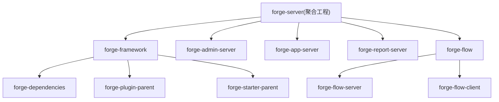
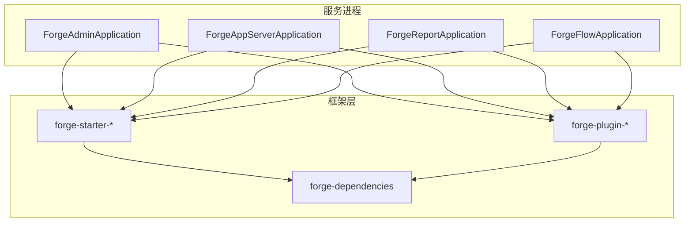
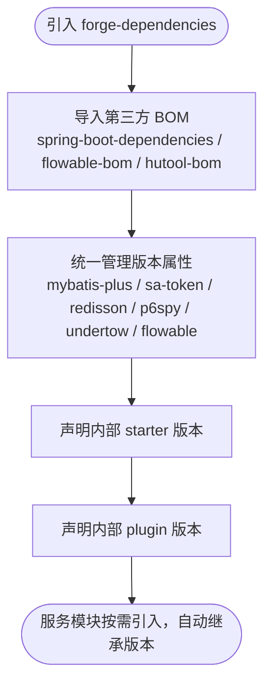
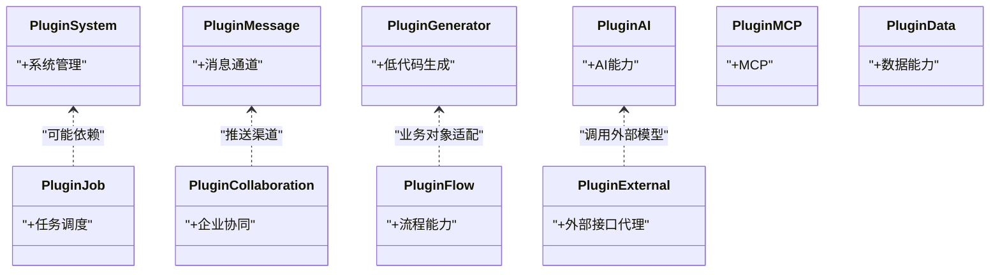
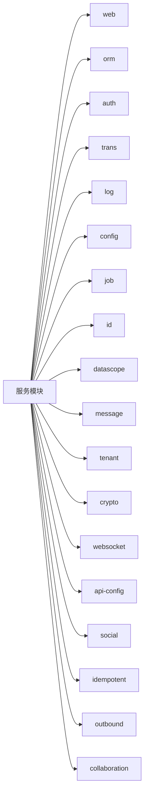
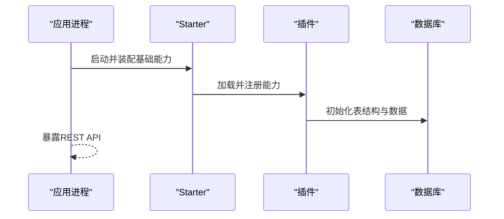
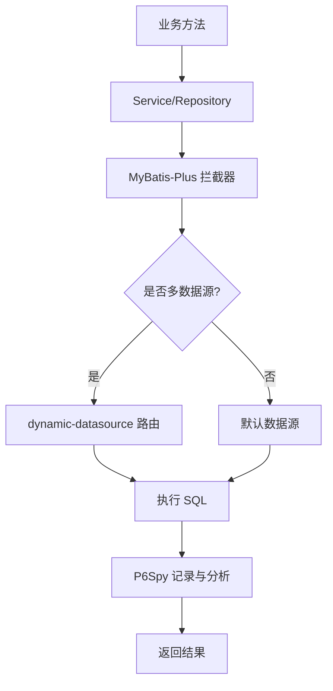
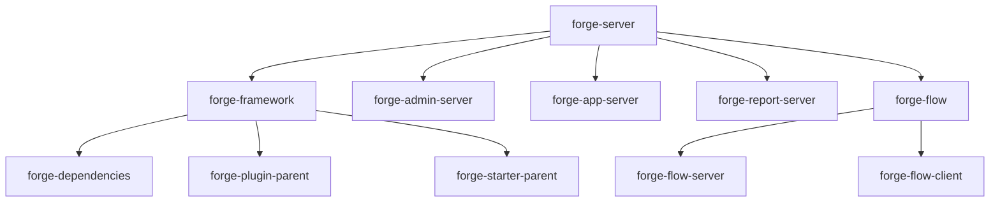

# 后端架构设计

<cite>
**本文引用的文件**
- [forge-server/pom.xml](file://forge-server/pom.xml)
- [forge-framework/pom.xml](file://forge-server/forge-framework/pom.xml)
- [forge-dependencies/pom.xml](file://forge-server/forge-framework/forge-dependencies/pom.xml)
- [forge-plugin-parent/pom.xml](file://forge-server/forge-framework/forge-plugin-parent/pom.xml)
- [forge-starter-parent/pom.xml](file://forge-server/forge-framework/forge-starter-parent/pom.xml)
- [forge-admin-server/pom.xml](file://forge-server/forge-admin-server/pom.xml)
- [forge-app-server/pom.xml](file://forge-server/forge-app-server/pom.xml)
- [forge-report-server/pom.xml](file://forge-server/forge-report-server/pom.xml)
- [forge-flow/pom.xml](file://forge-server/forge-flow/pom.xml)
- [forge-flow-server/pom.xml](file://forge-server/forge-flow/forge-flow-server/pom.xml)
- [ForgeAdminApplication.java](file://forge-server/forge-admin-server/src/main/java/com/mdframe/forge/admin/ForgeAdminApplication.java)
- [ForgeAppServerApplication.java](file://forge-server/forge-app-server/src/main/java/com/mdframe/forge/app/server/ForgeAppServerApplication.java)
- [ForgeFlowApplication.java](file://forge-server/forge-flow/forge-flow-server/src/main/java/com/mdframe/forge/flow/ForgeFlowApplication.java)
- [ForgeReportApplication.java](file://forge-server/forge-report-server/src/main/java/com/mdframe/forge/report/ForgeReportApplication.java)
</cite>

## 目录
1. [简介](#简介)
2. [项目结构](#项目结构)
3. [核心组件](#核心组件)
4. [架构总览](#架构总览)
5. [详细组件分析](#详细组件分析)
6. [依赖关系分析](#依赖关系分析)
7. [性能与可观测性](#性能与可观测性)
8. [故障排查指南](#故障排查指南)
9. [结论](#结论)
10. [附录](#附录)

## 简介
本设计文档面向 Forge Admin 后端，基于 Spring Boot 3.x + Java 17 技术栈，采用多模块 Maven 工程组织。通过 forge-framework 框架层提供统一的依赖管理、插件体系与 Starter 组件体系；服务层拆分为管理后台（forge-admin-server）、移动端 API（forge-app-server）、报表服务（forge-report-server）与工作流服务（forge-flow）。文档重点阐述分层设计、插件化机制、数据库访问层（MyBatis-Plus + 动态数据源）、横切关注点（事务、异常、日志、监控）以及各服务职责边界。

## 项目结构
仓库采用顶层聚合工程 forge-server，统一管理版本与构建配置，并包含以下子模块：
- forge-framework：框架层，包含依赖管理 forge-dependencies、插件父工程 forge-plugin-parent、Starter 父工程 forge-starter-parent
- 服务模块：forge-admin-server、forge-app-server、forge-report-server、forge-flow（含 server/client）
- 业务模块：forge-business（核心业务能力）

图表来源
- [forge-server/pom.xml:186-193](file://forge-server/pom.xml#L186-L193)
- [forge-framework/pom.xml:30-34](file://forge-server/forge-framework/pom.xml#L30-L34)
- [forge-flow/pom.xml:16-19](file://forge-server/forge-flow/pom.xml#L16-L19)

章节来源
- [forge-server/pom.xml:12-72](file://forge-server/pom.xml#L12-L72)
- [forge-framework/pom.xml:17-28](file://forge-server/forge-framework/pom.xml#L17-L28)

## 核心组件
- 依赖管理（forge-dependencies）
  - 集中声明第三方库版本（Spring Boot、MyBatis-Plus、Sa-Token、Redisson、P6Spy、Undertow、Flowable 等），并通过 dependencyManagement 统一收敛版本，避免冲突
- 插件体系（forge-plugin-parent）
  - 以插件形式封装领域能力（系统、任务、消息、协同、生成器、AI、MCP、外部接口代理、数据等），按功能域解耦，便于按需装配
- Starter 组件体系（forge-starter-parent）
  - 将通用能力（Web、ORM、缓存、认证、日志、事务、文件、Excel、配置、租户、加解密、WebSocket、API 配置、社交、幂等、出站调用、协同等）封装为可插拔的 starter，服务模块按需引入
- 服务模块
  - forge-admin-server：管理后台，集成 Web、认证、Excel、配置、任务、ID、加密、消息、协同、生成器、AI、MCP、能力平台、外部代理、数据等能力
  - forge-app-server：移动端 API，侧重轻量接入，包含 Web、认证、配置、ID、加密、消息、协同、生成器、FlowClient、API 配置、Actuator
  - forge-report-server：报表服务，聚焦数据可视化，集成 Web、认证、ORM、租户、API 配置、加密、系统、AI、外部代理、数据等
  - forge-flow：工作流服务，基于 Flowable，提供流程定义、执行、监控等能力，并提供客户端供其他服务调用

章节来源
- [forge-dependencies/pom.xml:76-527](file://forge-server/forge-framework/forge-dependencies/pom.xml#L76-L527)
- [forge-plugin-parent/pom.xml:18-30](file://forge-server/forge-framework/forge-plugin-parent/pom.xml#L18-L30)
- [forge-starter-parent/pom.xml:15-39](file://forge-server/forge-framework/forge-starter-parent/pom.xml#L15-L39)
- [forge-admin-server/pom.xml:14-155](file://forge-server/forge-admin-server/pom.xml#L14-L155)
- [forge-app-server/pom.xml:16-101](file://forge-server/forge-app-server/pom.xml#L16-L101)
- [forge-report-server/pom.xml:15-83](file://forge-server/forge-report-server/pom.xml#L15-L83)
- [forge-flow-server/pom.xml:16-107](file://forge-server/forge-flow/forge-flow-server/pom.xml#L16-L107)

## 架构总览
整体采用“聚合工程 + 框架层 + 服务模块”的分层架构：
- 顶层聚合工程负责版本与构建策略统一
- 框架层提供依赖治理、插件与 Starter 抽象
- 服务模块通过组合 Starter 与插件实现业务场景
- 启动类统一扫描包路径、开启 Mapper 扫描与 AOP 代理

图表来源
- [ForgeAdminApplication.java:8-10](file://forge-server/forge-admin-server/src/main/java/com/mdframe/forge/admin/ForgeAdminApplication.java#L8-L10)
- [ForgeAppServerApplication.java:8-10](file://forge-server/forge-app-server/src/main/java/com/mdframe/forge/app/server/ForgeAppServerApplication.java#L8-L10)
- [ForgeReportApplication.java:11-13](file://forge-server/forge-report-server/src/main/java/com/mdframe/forge/report/ForgeReportApplication.java#L11-L13)
- [ForgeFlowApplication.java:12-13](file://forge-server/forge-flow/forge-flow-server/src/main/java/com/mdframe/forge/flow/ForgeFlowApplication.java#L12-L13)
- [forge-starter-parent/pom.xml:15-39](file://forge-server/forge-framework/forge-starter-parent/pom.xml#L15-L39)
- [forge-plugin-parent/pom.xml:18-30](file://forge-server/forge-framework/forge-plugin-parent/pom.xml#L18-L30)
- [forge-dependencies/pom.xml:76-527](file://forge-server/forge-framework/forge-dependencies/pom.xml#L76-L527)

## 详细组件分析

### 依赖管理与版本治理（forge-dependencies）
- 通过 dependencyManagement 集中声明 Spring Boot、MyBatis-Plus、Sa-Token、Redisson、P6Spy、Undertow、Flowable、Fastjson2、Hutool 等关键依赖版本
- 引入 Spring AI / Alibaba 扩展 BOM，便于后续 AI 能力演进
- 对内部 starter 与 plugin 进行版本收敛，确保跨模块一致性

图表来源
- [forge-dependencies/pom.xml:76-527](file://forge-server/forge-framework/forge-dependencies/pom.xml#L76-L527)

章节来源
- [forge-dependencies/pom.xml:13-73](file://forge-server/forge-framework/forge-dependencies/pom.xml#L13-L73)
- [forge-dependencies/pom.xml:76-527](file://forge-server/forge-framework/forge-dependencies/pom.xml#L76-L527)

### 插件体系（forge-plugin-parent）
- 插件按领域划分：系统、任务、消息、协同、生成器、AI、MCP、外部接口代理、数据、Flow 等
- 每个插件独立打包，具备完整资源（Mapper、SQL、配置），通过依赖注入到宿主应用
- 插件之间通过公共接口或事件协作，降低耦合度

图表来源
- [forge-plugin-parent/pom.xml:18-30](file://forge-server/forge-framework/forge-plugin-parent/pom.xml#L18-L30)

章节来源
- [forge-plugin-parent/pom.xml:18-30](file://forge-server/forge-framework/forge-plugin-parent/pom.xml#L18-L30)

### Starter 组件体系（forge-starter-parent）
- 将横切能力模块化：Web、ORM、缓存、认证、日志、事务、文件、Excel、配置、任务、ID、数据范围、消息、租户、加解密、WebSocket、API 配置、社交、幂等、出站调用、协同等
- 服务模块通过引入对应 starter 快速装配能力，减少样板配置

图表来源
- [forge-starter-parent/pom.xml:15-39](file://forge-server/forge-framework/forge-starter-parent/pom.xml#L15-L39)

章节来源
- [forge-starter-parent/pom.xml:15-39](file://forge-server/forge-framework/forge-starter-parent/pom.xml#L15-L39)

### 服务模块职责边界
- forge-admin-server（管理后台）
  - 职责：提供管理端 API，涵盖系统管理、权限、任务、消息、协同、生成器、AI、MCP、能力平台、外部代理、数据等
  - 关键依赖：web、auth、excel、config、job、id、crypto、message、collaboration、generator、ai、mcp、capability-platform/actions/high-risk-approval、external、data、flyway、actuator
- forge-app-server（移动端 API）
  - 职责：对外暴露移动端所需 API，复用已发布配置、动态 CRUD、字段事件与业务动作协议，支持 H5/企微运行时
  - 关键依赖：web、auth、config、id、crypto、message、collaboration、generator、flow-client、api-config、actuator
- forge-report-server（报表服务）
  - 职责：数据可视化大屏后端，提供查询与聚合能力
  - 关键依赖：web、auth、orm、tenant、api-config、crypto、system、ai、external、data
- forge-flow（工作流服务）
  - 职责：基于 Flowable 的流程引擎服务，提供流程定义、执行、监控；同时提供客户端供其他服务调用
  - 关键依赖：plugin-flow、flow-client、orm、tenant、web、auth、id、ai、generator、collaboration、redis

章节来源
- [forge-admin-server/pom.xml:14-155](file://forge-server/forge-admin-server/pom.xml#L14-L155)
- [forge-app-server/pom.xml:16-101](file://forge-server/forge-app-server/pom.xml#L16-L101)
- [forge-report-server/pom.xml:15-83](file://forge-server/forge-report-server/pom.xml#L15-L83)
- [forge-flow-server/pom.xml:16-107](file://forge-server/forge-flow/forge-flow-server/pom.xml#L16-L107)

### 插件化架构的实现机制
- 插件注册
  - 通过 Maven 依赖引入插件，Spring Boot 自动发现并装配插件中的 Bean、Mapper、SQL 等资源
- 生命周期管理
  - 插件在应用启动时完成初始化，按依赖顺序加载；可通过条件注解控制启用/禁用
- 依赖注入
  - 插件间通过接口与事件解耦，使用 Spring 容器进行依赖注入；必要时通过 Redis 或消息通道进行跨进程协作
- 典型流程（以管理后台为例）
  - 启动应用 -> 扫描包 -> 装配 Starter 与插件 -> 初始化数据源/缓存/任务 -> 暴露 API

图表来源
- [ForgeAdminApplication.java:8-10](file://forge-server/forge-admin-server/src/main/java/com/mdframe/forge/admin/ForgeAdminApplication.java#L8-L10)
- [forge-admin-server/pom.xml:14-155](file://forge-server/forge-admin-server/pom.xml#L14-L155)

章节来源
- [forge-admin-server/pom.xml:14-155](file://forge-server/forge-admin-server/pom.xml#L14-L155)

### 数据库访问层设计
- MyBatis-Plus 集成
  - 通过 ORM Starter 引入 MyBatis-Plus，提供通用 CRUD、分页、逻辑删除、自动填充等能力
- 多数据源支持
  - 通过 dynamic-datasource-spring-boot3-starter 实现多数据源切换，支持 MySQL/Oracle 等
- 动态 SQL 生成
  - 结合 MyBatis-Plus 的条件构造器与插件能力，实现复杂查询的动态拼装
- 性能分析与连接池
  - 使用 P6Spy 进行 SQL 性能分析；连接池由 Spring Boot 默认管理，可按需优化

图表来源
- [forge-dependencies/pom.xml:166-214](file://forge-server/forge-framework/forge-dependencies/pom.xml#L166-L214)

章节来源
- [forge-dependencies/pom.xml:166-214](file://forge-server/forge-framework/forge-dependencies/pom.xml#L166-L214)

### 事务管理
- 通过事务 Starter 统一配置声明式事务
- 跨服务调用（如 Flow 客户端）采用本地事务与分布式补偿策略结合
- 建议：长事务拆分、批量操作分批提交、读写分离场景注意隔离级别

章节来源
- [forge-starter-parent/pom.xml:15-39](file://forge-server/forge-framework/forge-starter-parent/pom.xml#L15-L39)

### 异常处理
- 全局异常处理器统一捕获并返回标准化响应
- 业务异常分类处理（参数校验、权限、数据不存在等）
- 建议：异常码规范、错误信息脱敏、审计日志记录

章节来源
- [forge-starter-parent/pom.xml:15-39](file://forge-server/forge-framework/forge-starter-parent/pom.xml#L15-L39)

### 日志记录
- 使用日志 Starter 统一输出请求、响应、异常、耗时等信息
- 结合链路追踪（TLog）提升问题定位效率
- 建议：敏感信息脱敏、日志分级、异步落盘

章节来源
- [forge-dependencies/pom.xml:69-72](file://forge-server/forge-framework/forge-dependencies/pom.xml#L69-L72)
- [forge-starter-parent/pom.xml:15-39](file://forge-server/forge-framework/forge-starter-parent/pom.xml#L15-L39)

### 性能监控
- Actuator 暴露健康检查、指标与端点
- P6Spy 分析慢 SQL，配合索引优化
- Undertow 作为高性能 Servlet 容器，适合高并发场景
- 建议：JVM 参数调优、GC 策略、连接池大小、缓存命中率监控

章节来源
- [forge-dependencies/pom.xml:249-263](file://forge-server/forge-framework/forge-dependencies/pom.xml#L249-L263)
- [forge-admin-server/pom.xml:151-153](file://forge-server/forge-admin-server/pom.xml#L151-L153)
- [forge-app-server/pom.xml:97-99](file://forge-server/forge-app-server/pom.xml#L97-L99)

## 依赖关系分析
- 顶层聚合工程统一管理版本与模块
- 框架层提供依赖治理与能力抽象
- 服务模块通过组合 Starter 与插件实现业务
- 工作流服务提供 Flowable 能力，其他服务通过客户端调用

图表来源
- [forge-server/pom.xml:186-193](file://forge-server/pom.xml#L186-L193)
- [forge-framework/pom.xml:30-34](file://forge-server/forge-framework/pom.xml#L30-L34)
- [forge-flow/pom.xml:16-19](file://forge-server/forge-flow/pom.xml#L16-L19)

章节来源
- [forge-server/pom.xml:186-193](file://forge-server/pom.xml#L186-L193)
- [forge-framework/pom.xml:30-34](file://forge-server/forge-framework/pom.xml#L30-L34)
- [forge-flow/pom.xml:16-19](file://forge-server/forge-flow/pom.xml#L16-L19)

## 性能与可观测性
- 容器选择：Undertow 提供更高吞吐与更低内存占用
- SQL 分析：P6Spy 记录慢查询，辅助索引优化
- 缓存与锁：Redisson + lock4j 提供分布式锁与缓存能力
- 监控：Actuator 暴露健康与指标，结合日志与链路追踪形成闭环
- 建议：热点数据缓存、批量操作、连接池与线程池调优、慢查询告警

章节来源
- [forge-dependencies/pom.xml:216-227](file://forge-server/forge-framework/forge-dependencies/pom.xml#L216-L227)
- [forge-dependencies/pom.xml:249-263](file://forge-server/forge-framework/forge-dependencies/pom.xml#L249-L263)
- [forge-dependencies/pom.xml:209-214](file://forge-server/forge-framework/forge-dependencies/pom.xml#L209-L214)

## 故障排查指南
- 启动失败
  - 检查包扫描路径与 MapperScan 配置是否正确
  - 确认依赖版本一致，避免冲突
- 数据库连接异常
  - 核对数据源配置与驱动版本
  - 使用 P6Spy 查看实际执行的 SQL
- 权限与认证问题
  - 检查 Sa-Token 配置与 Token 传递
  - 验证角色与权限绑定
- 任务调度不生效
  - 确认 job 插件已引入且配置正确
  - 检查任务状态与日志
- 工作流调用失败
  - 确认 FlowClient 配置与服务可达
  - 查看流程实例与任务状态

章节来源
- [ForgeAdminApplication.java:8-10](file://forge-server/forge-admin-server/src/main/java/com/mdframe/forge/admin/ForgeAdminApplication.java#L8-L10)
- [ForgeAppServerApplication.java:8-10](file://forge-server/forge-app-server/src/main/java/com/mdframe/forge/app/server/ForgeAppServerApplication.java#L8-L10)
- [ForgeReportApplication.java:11-13](file://forge-server/forge-report-server/src/main/java/com/mdframe/forge/report/ForgeReportApplication.java#L11-L13)
- [ForgeFlowApplication.java:12-13](file://forge-server/forge-flow/forge-flow-server/src/main/java/com/mdframe/forge/flow/ForgeFlowApplication.java#L12-L13)

## 结论
Forge Admin 后端采用清晰的分层与模块化设计，通过依赖管理、插件体系与 Starter 组件体系实现了高内聚、低耦合的能力复用。服务模块职责明确，易于扩展与维护。数据库访问层基于 MyBatis-Plus 与动态数据源，满足多数据源与复杂查询需求。横切关注点（事务、异常、日志、监控）通过 Starter 统一治理，提升了系统的稳定性与可观测性。未来可在性能调优、缓存策略与分布式事务方面持续深化。

## 附录
- 版本参考
  - Spring Boot：3.5.13
  - Java：17
  - MyBatis-Plus：3.5.7
  - Sa-Token：1.38.0
  - Redisson：3.50.0
  - P6Spy：3.9.1
  - Undertow：2.3.15.Final
  - Flowable：7.0.1
- 仓库镜像
  - 中央仓库、阿里云、华为云镜像用于加速依赖下载

章节来源
- [forge-server/pom.xml:12-72](file://forge-server/pom.xml#L12-L72)
- [forge-dependencies/pom.xml:13-73](file://forge-server/forge-framework/forge-dependencies/pom.xml#L13-L73)
- [forge-server/pom.xml:301-367](file://forge-server/pom.xml#L301-L367)