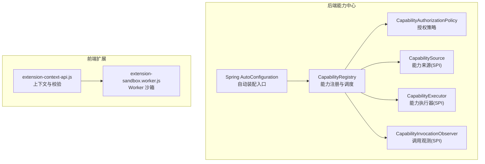
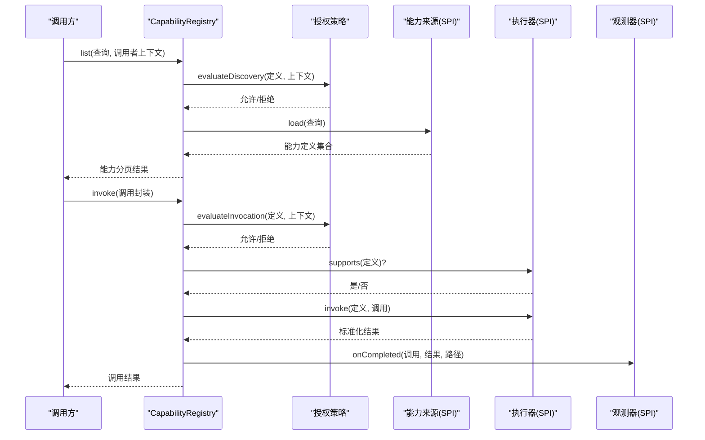
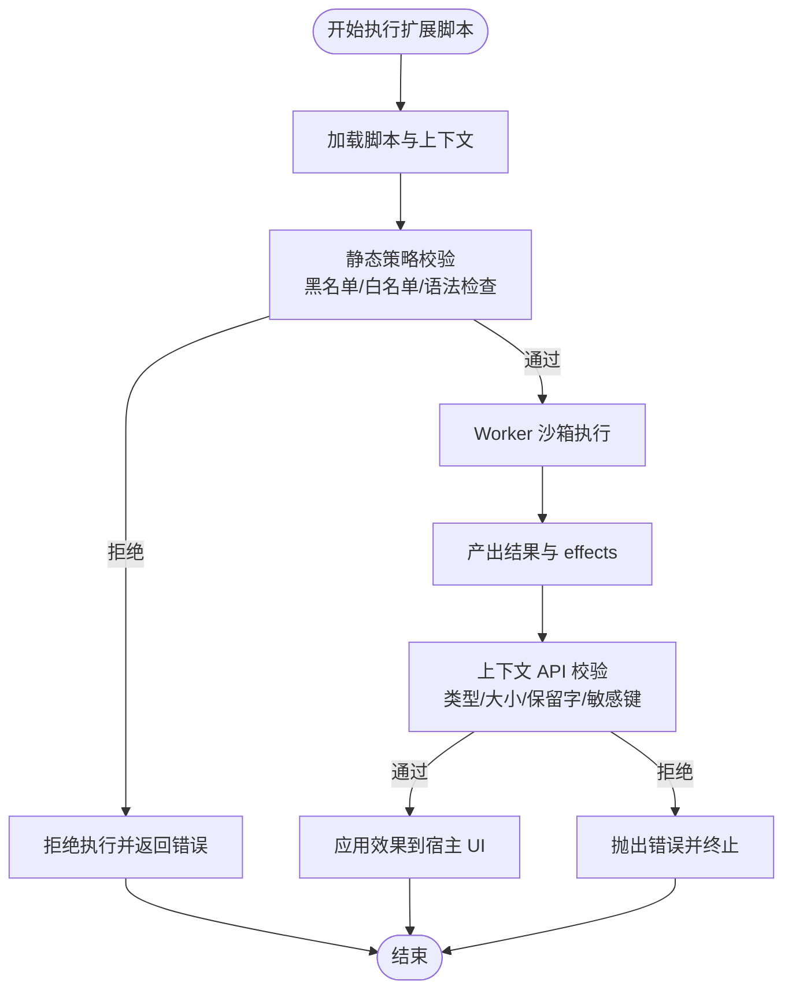
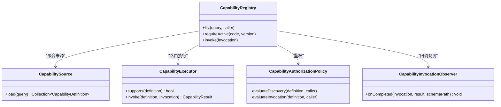

# 插件系统设计

<cite>
**本文引用的文件**
- [CapabilitySource.java](file://forge-server/forge-framework/forge-plugin-parent/forge-plugin-capability-parent/forge-plugin-capability-core/src/main/java/com/mdframe/forge/plugin/capability/spi/CapabilitySource.java)
- [CapabilityExecutor.java](file://forge-server/forge-framework/forge-plugin-parent/forge-plugin-capability-parent/forge-plugin-capability-core/src/main/java/com/mdframe/forge/plugin/capability/spi/CapabilityExecutor.java)
- [CapabilityRegistry.java](file://forge-server/forge-framework/forge-plugin-parent/forge-plugin-capability-parent/forge-plugin-capability-core/src/main/java/com/mdframe/forge/plugin/capability/registry/CapabilityRegistry.java)
- [CapabilityAuthorizationPolicy.java](file://forge-server/forge-framework/forge-plugin-parent/forge-plugin-capability-parent/forge-plugin-capability-core/src/main/java/com/mdframe/forge/plugin/capability/spi/CapabilityAuthorizationPolicy.java)
- [ScopeBasedCapabilityAuthorizationPolicy.java](file://forge-server/forge-framework/forge-plugin-parent/forge-plugin-capability-parent/forge-plugin-capability-core/src/main/java/com/mdframe/forge/plugin/capability/spi/ScopeBasedCapabilityAuthorizationPolicy.java)
- [CapabilityInvocationObserver.java](file://forge-server/forge-framework/forge-plugin-parent/forge-plugin-capability-parent/forge-plugin-capability-core/src/main/java/com/mdframe/forge/plugin/capability/spi/CapabilityInvocationObserver.java)
- [AutoConfiguration.imports](file://forge-server/forge-framework/forge-plugin-parent/forge-plugin-capability-parent/forge-plugin-capability-core/src/main/resources/META-INF/spring/org.springframework.boot.autoconfigure.AutoConfiguration.imports)
- [extension-context-api.js](file://forge-admin-ui/src/components/lowcode-extension/js/extension-context-api.js)
- [extension-sandbox.worker.js](file://forge-admin-ui/src/components/lowcode-extension/js/extension-sandbox.worker.js)
</cite>

## 目录
1. [简介](#简介)
2. [项目结构](#项目结构)
3. [核心组件](#核心组件)
4. [架构总览](#架构总览)
5. [详细组件分析](#详细组件分析)
6. [依赖关系分析](#依赖关系分析)
7. [性能考虑](#性能考虑)
8. [故障排查指南](#故障排查指南)
9. [结论](#结论)
10. [附录](#附录)

## 简介
本文件面向 Forge Admin 的插件系统，围绕“能力（Capability）”这一核心抽象，系统化阐述插件化架构的设计理念与实现要点。内容覆盖：
- 插件接口定义、生命周期管理、依赖注入机制
- 插件注册与发现机制（SPI 服务加载、元数据管理）
- 插件间通信协议（事件总线、消息传递、状态共享）
- 配置管理（隔离、热更新、版本兼容）
- 安全机制（权限控制、沙箱隔离、资源限制）
- 开发规范（接口约定、命名规范、测试要求）
- 打包部署（依赖管理、冲突解决、升级策略）

## 项目结构
Forge 的插件体系以“能力中心”为核心，通过 SPI 暴露扩展点，由框架统一编排发现、授权、执行与观测。前端低代码扩展提供安全的脚本沙箱，用于页面级行为增强。

图表来源
- [CapabilityRegistry.java:1-18](file://forge-server/forge-framework/forge-plugin-parent/forge-plugin-capability-parent/forge-plugin-capability-core/src/main/java/com/mdframe/forge/plugin/capability/registry/CapabilityRegistry.java#L1-L18)
- [CapabilityAuthorizationPolicy.java:1-25](file://forge-server/forge-framework/forge-plugin-parent/forge-plugin-capability-parent/forge-plugin-capability-core/src/main/java/com/mdframe/forge/plugin/capability/spi/CapabilityAuthorizationPolicy.java#L1-L25)
- [CapabilitySource.java:1-13](file://forge-server/forge-framework/forge-plugin-parent/forge-plugin-capability-parent/forge-plugin-capability-core/src/main/java/com/mdframe/forge/plugin/capability/spi/CapabilitySource.java#L1-L13)
- [CapabilityExecutor.java:1-13](file://forge-server/forge-framework/forge-plugin-parent/forge-plugin-capability-parent/forge-plugin-capability-core/src/main/java/com/mdframe/forge/plugin/capability/spi/CapabilityExecutor.java#L1-L13)
- [CapabilityInvocationObserver.java:1-14](file://forge-server/forge-framework/forge-plugin-parent/forge-plugin-capability-parent/forge-plugin-capability-core/src/main/java/com/mdframe/forge/plugin/capability/spi/CapabilityInvocationObserver.java#L1-L14)
- [AutoConfiguration.imports:1-1](file://forge-server/forge-framework/forge-plugin-parent/forge-plugin-capability-parent/forge-plugin-capability-core/src/main/resources/META-INF/spring/org.springframework.boot.autoconfigure.AutoConfiguration.imports#L1-L1)
- [extension-context-api.js:1-219](file://forge-admin-ui/src/components/lowcode-extension/js/extension-context-api.js#L1-L219)
- [extension-sandbox.worker.js:126-180](file://forge-admin-ui/src/components/lowcode-extension/js/extension-sandbox.worker.js#L126-L180)

章节来源
- [CapabilityRegistry.java:1-18](file://forge-server/forge-framework/forge-plugin-parent/forge-plugin-capability-parent/forge-plugin-capability-core/src/main/java/com/mdframe/forge/plugin/capability/registry/CapabilityRegistry.java#L1-L18)
- [AutoConfiguration.imports:1-1](file://forge-server/forge-framework/forge-plugin-parent/forge-plugin-capability-parent/forge-plugin-capability-core/src/main/resources/META-INF/spring/org.springframework.boot.autoconfigure.AutoConfiguration.imports#L1-L1)

## 核心组件
- 能力注册表（CapabilityRegistry）
  - 职责：能力列表查询、按编码与版本获取活跃能力、统一调用入口。
  - 关键方法：list、requireActive、invoke。
- 能力来源（CapabilitySource，SPI）
  - 职责：根据查询条件加载能力定义集合，支持多来源聚合。
- 能力执行器（CapabilityExecutor，SPI）
  - 职责：判断是否支持某能力定义并执行，返回标准化结果。
- 授权策略（CapabilityAuthorizationPolicy，SPI）
  - 职责：对能力的“发现”和“调用”进行鉴权决策，内置范围（scope）策略。
- 调用观测器（CapabilityInvocationObserver，SPI）
  - 职责：在能力调用完成后记录审计或指标。
- Spring 自动装配（AutoConfiguration.imports）
  - 职责：声明能力中心的自动装配入口，使 SPI 实现可被容器发现。

章节来源
- [CapabilityRegistry.java:1-18](file://forge-server/forge-framework/forge-plugin-parent/forge-plugin-capability-parent/forge-plugin-capability-core/src/main/java/com/mdframe/forge/plugin/capability/registry/CapabilityRegistry.java#L1-L18)
- [CapabilitySource.java:1-13](file://forge-server/forge-framework/forge-plugin-parent/forge-plugin-capability-parent/forge-plugin-capability-core/src/main/java/com/mdframe/forge/plugin/capability/spi/CapabilitySource.java#L1-L13)
- [CapabilityExecutor.java:1-13](file://forge-server/forge-framework/forge-plugin-parent/forge-plugin-capability-parent/forge-plugin-capability-core/src/main/java/com/mdframe/forge/plugin/capability/spi/CapabilityExecutor.java#L1-L13)
- [CapabilityAuthorizationPolicy.java:1-25](file://forge-server/forge-framework/forge-plugin-parent/forge-plugin-capability-parent/forge-plugin-capability-core/src/main/java/com/mdframe/forge/plugin/capability/spi/CapabilityAuthorizationPolicy.java#L1-L25)
- [CapabilityInvocationObserver.java:1-14](file://forge-server/forge-framework/forge-plugin-parent/forge-plugin-capability-parent/forge-plugin-capability-core/src/main/java/com/mdframe/forge/plugin/capability/spi/CapabilityInvocationObserver.java#L1-L14)
- [AutoConfiguration.imports:1-1](file://forge-server/forge-framework/forge-plugin-parent/forge-plugin-capability-parent/forge-plugin-capability-core/src/main/resources/META-INF/spring/org.springframework.boot.autoconfigure.AutoConfiguration.imports#L1-L1)

## 架构总览
能力中心采用“SPI + 注册表 + 策略”的分层设计：
- SPI 层：能力来源、执行器、授权策略、调用观测器均为可扩展接口。
- 注册表层：聚合 SPI 实现，提供统一的发现、选择与调用入口。
- 策略层：基于 scope 的细粒度权限控制，贯穿发现与调用。
- 前端侧：低代码扩展通过 Worker 沙箱运行用户脚本，严格限制全局对象与网络能力，并通过上下文 API 做输入输出校验。

图表来源
- [CapabilityRegistry.java:1-18](file://forge-server/forge-framework/forge-plugin-parent/forge-plugin-capability-parent/forge-plugin-capability-core/src/main/java/com/mdframe/forge/plugin/capability/registry/CapabilityRegistry.java#L1-L18)
- [CapabilityAuthorizationPolicy.java:1-25](file://forge-server/forge-framework/forge-plugin-parent/forge-plugin-capability-parent/forge-plugin-capability-core/src/main/java/com/mdframe/forge/plugin/capability/spi/CapabilityAuthorizationPolicy.java#L1-L25)
- [CapabilitySource.java:1-13](file://forge-server/forge-framework/forge-plugin-parent/forge-plugin-capability-parent/forge-plugin-capability-core/src/main/java/com/mdframe/forge/plugin/capability/spi/CapabilitySource.java#L1-L13)
- [CapabilityExecutor.java:1-13](file://forge-server/forge-framework/forge-plugin-parent/forge-plugin-capability-parent/forge-plugin-capability-core/src/main/java/com/mdframe/forge/plugin/capability/spi/CapabilityExecutor.java#L1-L13)
- [CapabilityInvocationObserver.java:1-14](file://forge-server/forge-framework/forge-plugin-parent/forge-plugin-capability-parent/forge-plugin-capability-core/src/main/java/com/mdframe/forge/plugin/capability/spi/CapabilityInvocationObserver.java#L1-L14)

## 详细组件分析

### 能力注册表（CapabilityRegistry）
- 设计要点
  - 对外暴露三大能力：列表查询、按编码+版本强取活跃能力、统一调用。
  - 内部协调授权、来源、执行器与观测器，形成闭环。
- 复杂度与性能
  - 列表查询通常涉及多来源聚合与分页，建议缓存热点能力定义。
  - 调用路径短平快，注意避免重复解析与重复鉴权。
- 错误处理
  - 未找到或版本不匹配时，应返回明确错误码；调用失败需透传至观测器。

章节来源
- [CapabilityRegistry.java:1-18](file://forge-server/forge-framework/forge-plugin-parent/forge-plugin-capability-parent/forge-plugin-capability-core/src/main/java/com/mdframe/forge/plugin/capability/registry/CapabilityRegistry.java#L1-L18)

### 能力来源（CapabilitySource，SPI）
- 设计要点
  - 函数式接口，便于以 Lambda 或轻量类实现。
  - 支持按查询条件过滤，利于多源合并与去重。
- 扩展方式
  - 通过 Spring 自动装配发现实现类，注册到注册表。
- 注意事项
  - 避免在 load 中执行重型 I/O；必要时异步预取与缓存。

章节来源
- [CapabilitySource.java:1-13](file://forge-server/forge-framework/forge-plugin-parent/forge-plugin-capability-parent/forge-plugin-capability-core/src/main/java/com/mdframe/forge/plugin/capability/spi/CapabilitySource.java#L1-L13)

### 能力执行器（CapabilityExecutor，SPI）
- 设计要点
  - supports 决定路由到哪个执行器；invoke 负责具体业务执行。
  - 返回值标准化为 CapabilityResult，便于统一处理。
- 扩展方式
  - 每个能力类型或提供方均可实现独立执行器，解耦业务逻辑。
- 性能建议
  - supports 应为 O(1) 快速判断；invoke 内避免阻塞操作。

章节来源
- [CapabilityExecutor.java:1-13](file://forge-server/forge-framework/forge-plugin-parent/forge-plugin-capability-parent/forge-plugin-capability-core/src/main/java/com/mdframe/forge/plugin/capability/spi/CapabilityExecutor.java#L1-L13)

### 授权策略（CapabilityAuthorizationPolicy，SPI）
- 设计要点
  - 区分“发现”与“调用”两个阶段的鉴权。
  - 内置 ScopeBasedCapabilityAuthorizationPolicy 支持通配与精确 scope。
- 安全模型
  - 身份校验：必须包含 machineClientId、tenantId、activeOrgId 等上下文信息。
  - 范围控制：capability:*、capability:discover、capability:invoke 及按能力编码的细粒度 scope。
- 扩展方式
  - 自定义策略可实现更复杂的 RBAC/ABAC 规则。

章节来源
- [CapabilityAuthorizationPolicy.java:1-25](file://forge-server/forge-framework/forge-plugin-parent/forge-plugin-capability-parent/forge-plugin-capability-core/src/main/java/com/mdframe/forge/plugin/capability/spi/CapabilityAuthorizationPolicy.java#L1-L25)
- [ScopeBasedCapabilityAuthorizationPolicy.java:1-58](file://forge-server/forge-framework/forge-plugin-parent/forge-plugin-capability-parent/forge-plugin-capability-core/src/main/java/com/mdframe/forge/plugin/capability/spi/ScopeBasedCapabilityAuthorizationPolicy.java#L1-L58)

### 调用观测器（CapabilityInvocationObserver，SPI）
- 设计要点
  - 在调用完成后回调，适合审计日志、指标上报、链路追踪。
- 使用建议
  - 观测器不应影响主流程，异常需吞掉或异步处理。

章节来源
- [CapabilityInvocationObserver.java:1-14](file://forge-server/forge-framework/forge-plugin-parent/forge-plugin-capability-parent/forge-plugin-capability-core/src/main/java/com/mdframe/forge/plugin/capability/spi/CapabilityInvocationObserver.java#L1-L14)

### 前端低代码扩展沙箱
- 设计要点
  - 通过 Web Worker 隔离执行环境，冻结/移除危险原型链与全局对象。
  - 静态白名单/黑名单校验，禁止 eval、动态 import、网络请求等高危能力。
  - 输出结果经上下文 API 校验，限制 effect 类型、字段保留字与大小上限。
- 安全边界
  - 最大脚本字节数、最大输出字节数、嵌套深度限制。
  - 敏感键过滤与深拷贝保护。

图表来源
- [extension-context-api.js:1-219](file://forge-admin-ui/src/components/lowcode-extension/js/extension-context-api.js#L1-L219)
- [extension-sandbox.worker.js:126-180](file://forge-admin-ui/src/components/lowcode-extension/js/extension-sandbox.worker.js#L126-L180)

章节来源
- [extension-context-api.js:1-219](file://forge-admin-ui/src/components/lowcode-extension/js/extension-context-api.js#L1-L219)
- [extension-sandbox.worker.js:126-180](file://forge-admin-ui/src/components/lowcode-extension/js/extension-sandbox.worker.js#L126-L180)

## 依赖关系分析
- 模块耦合
  - CapabilityRegistry 作为中枢，依赖 SPI 实现（Source/Executor/Auth/Obs），松耦合、高内聚。
  - 前端沙箱与后端能力中心无直接耦合，通过标准协议交互（能力定义/调用/结果）。
- 外部依赖
  - Spring Boot 自动装配用于发现 SPI 实现。
  - 前端依赖浏览器 Worker API 与安全特性。

图表来源
- [CapabilityRegistry.java:1-18](file://forge-server/forge-framework/forge-plugin-parent/forge-plugin-capability-parent/forge-plugin-capability-core/src/main/java/com/mdframe/forge/plugin/capability/registry/CapabilityRegistry.java#L1-L18)
- [CapabilitySource.java:1-13](file://forge-server/forge-framework/forge-plugin-parent/forge-plugin-capability-parent/forge-plugin-capability-core/src/main/java/com/mdframe/forge/plugin/capability/spi/CapabilitySource.java#L1-L13)
- [CapabilityExecutor.java:1-13](file://forge-server/forge-framework/forge-plugin-parent/forge-plugin-capability-parent/forge-plugin-capability-core/src/main/java/com/mdframe/forge/plugin/capability/spi/CapabilityExecutor.java#L1-L13)
- [CapabilityAuthorizationPolicy.java:1-25](file://forge-server/forge-framework/forge-plugin-parent/forge-plugin-capability-parent/forge-plugin-capability-core/src/main/java/com/mdframe/forge/plugin/capability/spi/CapabilityAuthorizationPolicy.java#L1-L25)
- [CapabilityInvocationObserver.java:1-14](file://forge-server/forge-framework/forge-plugin-parent/forge-plugin-capability-parent/forge-plugin-capability-core/src/main/java/com/mdframe/forge/plugin/capability/spi/CapabilityInvocationObserver.java#L1-L14)

章节来源
- [CapabilityRegistry.java:1-18](file://forge-server/forge-framework/forge-plugin-parent/forge-plugin-capability-parent/forge-plugin-capability-core/src/main/java/com/mdframe/forge/plugin/capability/registry/CapabilityRegistry.java#L1-L18)

## 性能考虑
- 能力发现与调用
  - 对能力定义与执行器进行本地缓存，减少重复扫描与实例化。
  - 列表查询支持分页与索引优化，避免全量拉取。
- 授权与观测
  - 授权策略尽量无状态、O(1) 判定；观测器异步落盘或上报。
- 前端沙箱
  - 限制脚本大小与输出大小，防止内存与 CPU 滥用。
  - 冻结原型链与危险全局对象，降低逃逸风险。

[本节为通用性能建议，不直接分析具体文件]

## 故障排查指南
- 能力不可见或无法调用
  - 检查调用者上下文是否包含必要身份与租户信息。
  - 核对 scope 是否包含 capability:discover 或 capability:invoke，以及按能力编码的细粒度 scope。
- 执行器未命中
  - 确认 supports 逻辑是否正确；检查能力定义与执行器注册是否生效。
- 前端扩展被拒绝
  - 查看是否触发黑名单（如 window、eval、fetch 等）或超出输出大小限制。
  - 检查 Worker 是否被超时终止或全局对象被冻结导致异常。

章节来源
- [ScopeBasedCapabilityAuthorizationPolicy.java:1-58](file://forge-server/forge-framework/forge-plugin-parent/forge-plugin-capability-parent/forge-plugin-capability-core/src/main/java/com/mdframe/forge/plugin/capability/spi/ScopeBasedCapabilityAuthorizationPolicy.java#L1-L58)
- [extension-context-api.js:1-219](file://forge-admin-ui/src/components/lowcode-extension/js/extension-context-api.js#L1-L219)
- [extension-sandbox.worker.js:126-180](file://forge-admin-ui/src/components/lowcode-extension/js/extension-sandbox.worker.js#L126-L180)

## 结论
Forge 的插件系统以“能力”为中心，通过 SPI 将扩展点解耦，借助注册表统一编排发现、授权、执行与观测，形成稳定可扩展的插件生态。前端低代码扩展通过严格的沙箱策略保障安全可控。该设计兼顾了灵活性与安全性，适合在企业级平台中规模化演进。

[本节为总结性内容，不直接分析具体文件]

## 附录

### 插件接口约定与命名规范
- 接口约定
  - 所有 SPI 实现需遵循对应接口契约，方法签名与返回值语义保持一致。
  - 能力定义与调用封装需保持向后兼容，新增字段默认值需合理。
- 命名规范
  - 能力编码建议使用小写英文与下划线，避免歧义。
  - 执行器与来源类名体现领域含义，便于定位与维护。

[本节为通用规范说明，不直接分析具体文件]

### 测试要求
- 单元测试
  - 对执行器的 supports/invoke、授权策略的 evaluate* 方法覆盖正常与异常分支。
  - 对前端沙箱的白/黑名单与输出校验用例覆盖边界场景。
- 集成测试
  - 验证 SPI 自动装配是否生效，能力列表与调用链路是否完整。

[本节为通用测试建议，不直接分析具体文件]

### 打包与部署
- 依赖管理
  - 通过 Maven 多模块组织，能力相关 SPI 与实现分离，避免循环依赖。
- 冲突解决
  - 能力编码唯一；版本化发布，注册表按版本选择活跃能力。
- 升级策略
  - 灰度发布与回滚预案；能力定义变更需评估兼容性。

[本节为通用运维建议，不直接分析具体文件]