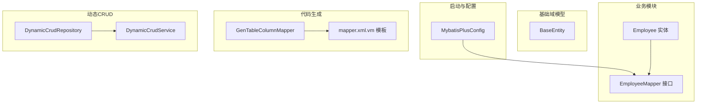
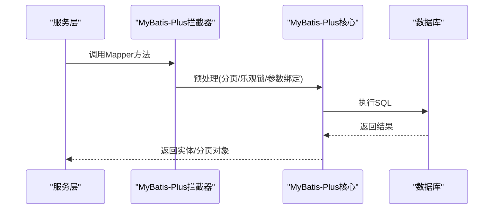
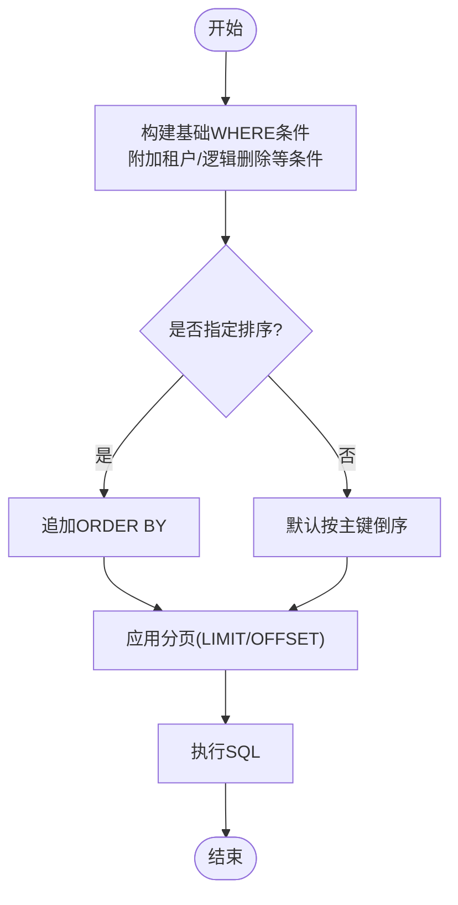
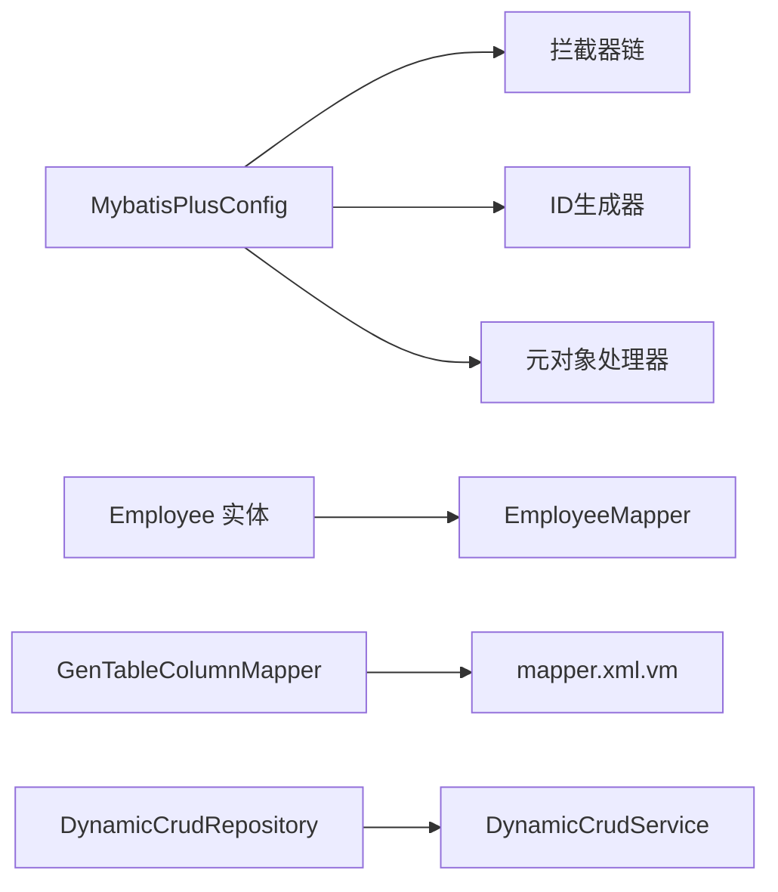

# ORM框架集成

<cite>
**本文引用的文件**
- [MybatisPlusConfig.java](file://forge-server/forge-framework/forge-starter-parent/forge-starter-orm/src/main/java/com/mdframe/forge/starter/orm/config/MybatisPlusConfig.java)
- [BaseEntity.java](file://forge-server/forge-framework/forge-starter-parent/forge-starter-core/src/main/java/com/mdframe/forge/starter/core/domain/BaseEntity.java)
- [Employee.java](file://forge-server/forge-admin-server/src/main/java/com/mdframe/forge/employee/entity/Employee.java)
- [EmployeeMapper.java](file://forge-server/forge-admin-server/src/main/java/com/mdframe/forge/employee/mapper/EmployeeMapper.java)
- [GenTableColumnMapper.java](file://forge-server/forge-framework/forge-plugin-parent/forge-plugin-generator/src/main/java/com/mdframe/forge/plugin/generator/mapper/GenTableColumnMapper.java)
- [mapper.xml.vm](file://forge-server/forge-framework/forge-plugin-parent/forge-plugin-generator/src/main/resources/templates/vm/mapper.xml.vm)
- [DynamicCrudRepository.java](file://forge-server/forge-framework/forge-plugin-parent/forge-plugin-generator/src/main/java/com/mdframe/forge/plugin/generator/service/DynamicCrudRepository.java)
- [DynamicCrudService.java](file://forge-server/forge-framework/forge-plugin-parent/forge-plugin-generator/src/main/java/com/mdframe/forge/plugin/generator/service/DynamicCrudService.java)
- [LowcodeDdlService.java](file://forge-server/forge-framework/forge-plugin-parent/forge-plugin-generator/src/main/java/com/mdframe/forge/plugin/generator/service/lowcode/LowcodeDdlService.java)
- [BusinessObjectTableMappingService.java](file://forge-server/forge-framework/forge-plugin-parent/forge-plugin-generator/src/main/java/com/mdframe/forge/plugin/generator/service/businessapp/BusinessObjectTableMappingService.java)
- [DataDatasetController.java](file://forge-server/forge-framework/forge-plugin-parent/forge-plugin-data/src/main/java/com/mdframe/forge/plugin/data/controller/DataDatasetController.java)
</cite>

## 目录
1. [简介](#简介)
2. [项目结构](#项目结构)
3. [核心组件](#核心组件)
4. [架构总览](#架构总览)
5. [详细组件分析](#详细组件分析)
6. [依赖关系分析](#依赖关系分析)
7. [性能考虑](#性能考虑)
8. [故障排查指南](#故障排查指南)
9. [结论](#结论)
10. [附录](#附录)

## 简介
本文件面向Forge Admin的ORM框架集成，聚焦于MyBatis-Plus的落地方案与最佳实践。内容涵盖：
- 实体类映射配置、Mapper接口设计模式
- 自动代码生成机制（模板与元数据）
- BaseEntity基类通用字段与自动填充策略
- 动态SQL生成机制（条件查询构建器、分页查询、批量操作优化）
- 实体关系映射（一对一、一对多、多对多）的配置思路与处理建议
- 自定义TypeHandler的使用场景与扩展点
- 数据库方言适配（MySQL、PostgreSQL等）
- 完整示例路径与可操作的实践清单

## 项目结构
本项目将ORM能力下沉到starter层，通过自动装配注入MyBatis-Plus拦截器、ID生成器、元对象处理器；业务模块以“实体+Mapper”的方式使用；代码生成插件提供模板化生成与运行时动态CRUD能力。

图表来源
- [MybatisPlusConfig.java:27-90](file://forge-server/forge-framework/forge-starter-parent/forge-starter-orm/src/main/java/com/mdframe/forge/starter/orm/config/MybatisPlusConfig.java#L27-L90)
- [BaseEntity.java:15-51](file://forge-server/forge-framework/forge-starter-parent/forge-starter-core/src/main/java/com/mdframe/forge/starter/core/domain/BaseEntity.java#L15-L51)
- [Employee.java:20-105](file://forge-server/forge-admin-server/src/main/java/com/mdframe/forge/employee/entity/Employee.java#L20-L105)
- [EmployeeMapper.java:13-16](file://forge-server/forge-admin-server/src/main/java/com/mdframe/forge/employee/mapper/EmployeeMapper.java#L13-L16)
- [GenTableColumnMapper.java:14-48](file://forge-server/forge-framework/forge-plugin-parent/forge-plugin-generator/src/main/java/com/mdframe/forge/plugin/generator/mapper/GenTableColumnMapper.java#L14-L48)
- [mapper.xml.vm:1-22](file://forge-server/forge-framework/forge-plugin-parent/forge-plugin-generator/src/main/resources/templates/vm/mapper.xml.vm#L1-L22)
- [DynamicCrudRepository.java:786-847](file://forge-server/forge-framework/forge-plugin-parent/forge-plugin-generator/src/main/java/com/mdframe/forge/plugin/generator/service/DynamicCrudRepository.java#L786-L847)
- [DynamicCrudService.java:591-613](file://forge-server/forge-framework/forge-plugin-parent/forge-plugin-generator/src/main/java/com/mdframe/forge/plugin/generator/service/DynamicCrudService.java#L591-L613)

章节来源
- [MybatisPlusConfig.java:27-90](file://forge-server/forge-framework/forge-starter-parent/forge-starter-orm/src/main/java/com/mdframe/forge/starter/orm/config/MybatisPlusConfig.java#L27-L90)
- [BaseEntity.java:15-51](file://forge-server/forge-framework/forge-starter-parent/forge-starter-core/src/main/java/com/mdframe/forge/starter/core/domain/BaseEntity.java#L15-L51)
- [Employee.java:20-105](file://forge-server/forge-admin-server/src/main/java/com/mdframe/forge/employee/entity/Employee.java#L20-L105)
- [EmployeeMapper.java:13-16](file://forge-server/forge-admin-server/src/main/java/com/mdframe/forge/employee/mapper/EmployeeMapper.java#L13-L16)
- [GenTableColumnMapper.java:14-48](file://forge-server/forge-framework/forge-plugin-parent/forge-plugin-generator/src/main/java/com/mdframe/forge/plugin/generator/mapper/GenTableColumnMapper.java#L14-L48)
- [mapper.xml.vm:1-22](file://forge-server/forge-framework/forge-plugin-parent/forge-plugin-generator/src/main/resources/templates/vm/mapper.xml.vm#L1-L22)
- [DynamicCrudRepository.java:786-847](file://forge-server/forge-framework/forge-plugin-parent/forge-plugin-generator/src/main/java/com/mdframe/forge/plugin/generator/service/DynamicCrudRepository.java#L786-L847)
- [DynamicCrudService.java:591-613](file://forge-server/forge-framework/forge-plugin-parent/forge-plugin-generator/src/main/java/com/mdframe/forge/plugin/generator/service/DynamicCrudService.java#L591-L613)

## 核心组件
- MyBatis-Plus启动配置：注册拦截器（分页、乐观锁）、全局ID生成器、元对象处理器，统一扫描Mapper包。
- 基础实体：定义创建人、创建时间、更新人、更新时间等通用审计字段，配合自动填充。
- 业务实体与Mapper：以注解方式完成表映射、主键策略、逻辑删除、字典翻译与脱敏等。
- 代码生成：基于模板生成Mapper XML与ResultMap，结合元数据驱动字段映射。
- 动态CRUD：在低代码/业务应用中，按配置动态拼装SQL、分页、排序与批量操作。

章节来源
- [MybatisPlusConfig.java:27-90](file://forge-server/forge-framework/forge-starter-parent/forge-starter-orm/src/main/java/com/mdframe/forge/starter/orm/config/MybatisPlusConfig.java#L27-L90)
- [BaseEntity.java:15-51](file://forge-server/forge-framework/forge-starter-parent/forge-starter-core/src/main/java/com/mdframe/forge/starter/core/domain/BaseEntity.java#L15-L51)
- [Employee.java:20-105](file://forge-server/forge-admin-server/src/main/java/com/mdframe/forge/employee/entity/Employee.java#L20-L105)
- [EmployeeMapper.java:13-16](file://forge-server/forge-admin-server/src/main/java/com/mdframe/forge/employee/mapper/EmployeeMapper.java#L13-L16)
- [mapper.xml.vm:1-22](file://forge-server/forge-framework/forge-plugin-parent/forge-plugin-generator/src/main/resources/templates/vm/mapper.xml.vm#L1-L22)
- [DynamicCrudRepository.java:786-847](file://forge-server/forge-framework/forge-plugin-parent/forge-plugin-generator/src/main/java/com/mdframe/forge/plugin/generator/service/DynamicCrudRepository.java#L786-L847)
- [DynamicCrudService.java:591-613](file://forge-server/forge-framework/forge-plugin-parent/forge-plugin-generator/src/main/java/com/mdframe/forge/plugin/generator/service/DynamicCrudService.java#L591-L613)

## 架构总览
下图展示从请求到持久化的关键路径：控制器调用Mapper，MyBatis-Plus拦截器执行分页/乐观锁，实体字段由MetaObjectHandler自动填充，最终落库。

图表来源
- [MybatisPlusConfig.java:38-76](file://forge-server/forge-framework/forge-starter-parent/forge-starter-orm/src/main/java/com/mdframe/forge/starter/orm/config/MybatisPlusConfig.java#L38-L76)

## 详细组件分析

### MyBatis-Plus配置与拦截器
- 拦截器链：优先加载其他模块提供的InnerInterceptor，再追加分页与乐观锁拦截器。
- 分页：使用自定义CountOnePaginationInnerInterceptor，减少count查询开销。
- 乐观锁：默认启用OptimisticLockerInnerInterceptor。
- ID生成：基于网卡信息的DefaultIdentifierGenerator，避免集群重复。
- 元对象处理器：InjectionMetaObjectHandler用于自动填充审计字段。

章节来源
- [MybatisPlusConfig.java:32-90](file://forge-server/forge-framework/forge-starter-parent/forge-starter-orm/src/main/java/com/mdframe/forge/starter/orm/config/MybatisPlusConfig.java#L32-L90)

### 实体基类BaseEntity与审计字段
- 通用字段：createBy、createTime、createDept、updateBy、updateTime。
- 自动填充：通过@TableField(fill=...)与MetaObjectHandler配合，在插入/更新时自动写入。
- 序列化：createTime/updateTime使用JSON格式化输出。

章节来源
- [BaseEntity.java:15-51](file://forge-server/forge-framework/forge-starter-parent/forge-starter-core/src/main/java/com/mdframe/forge/starter/core/domain/BaseEntity.java#L15-L51)

### 实体映射与Mapper设计模式
- 表映射：@TableName指定物理表名。
- 主键策略：@TableId(value, type)控制自增或雪花等策略。
- 逻辑删除：@TableLogic(value, delval)实现软删除语义。
- 非持久字段：@TableField(exist=false)用于关联显示字段。
- Mapper接口：继承BaseMapper<T>获得通用CRUD能力，复杂查询可扩展XML或LambdaQueryWrapper。

章节来源
- [Employee.java:20-105](file://forge-server/forge-admin-server/src/main/java/com/mdframe/forge/employee/entity/Employee.java#L20-L105)
- [EmployeeMapper.java:13-16](file://forge-server/forge-admin-server/src/main/java/com/mdframe/forge/employee/mapper/EmployeeMapper.java#L13-L16)

### 自动代码生成机制
- 模板生成：mapper.xml.vm根据列信息生成ResultMap与BaseColumns片段，支持树形字段映射。
- 元数据驱动：GenTableColumnMapper提供按表名/表ID查询字段配置的能力，保障生成一致性与安全性。
- 索引与约束：DDL服务根据模型配置生成索引定义，并考虑逻辑删除列的类型兼容。

章节来源
- [mapper.xml.vm:1-22](file://forge-server/forge-framework/forge-plugin-parent/forge-plugin-generator/src/main/resources/templates/vm/mapper.xml.vm#L1-L22)
- [GenTableColumnMapper.java:14-48](file://forge-server/forge-framework/forge-plugin-parent/forge-plugin-generator/src/main/java/com/mdframe/forge/plugin/generator/mapper/GenTableColumnMapper.java#L14-L48)
- [LowcodeDdlService.java:465-489](file://forge-server/forge-framework/forge-plugin-parent/forge-plugin-generator/src/main/java/com/mdframe/forge/plugin/generator/service/lowcode/LowcodeDdlService.java#L465-L489)

### 动态SQL生成机制
- 条件构建：DynamicCrudRepository负责组装基础WHERE条件、排序、分页与逻辑删除过滤，确保参数安全与标识符校验。
- 分页实现：通过paginateSql封装方言无关的分页语句，结合ORDER BY与LIMIT/OFFSET。
- 批量操作：DynamicCrudService提供批量ID归一化、主键解析与批量更新/删除流程，提升吞吐。

图表来源
- [DynamicCrudRepository.java:786-847](file://forge-server/forge-framework/forge-plugin-parent/forge-plugin-generator/src/main/java/com/mdframe/forge/plugin/generator/service/DynamicCrudRepository.java#L786-L847)

章节来源
- [DynamicCrudRepository.java:786-847](file://forge-server/forge-framework/forge-plugin-parent/forge-plugin-generator/src/main/java/com/mdframe/forge/plugin/generator/service/DynamicCrudRepository.java#L786-L847)
- [DynamicCrudService.java:591-613](file://forge-server/forge-framework/forge-plugin-parent/forge-plugin-generator/src/main/java/com/mdframe/forge/plugin/generator/service/DynamicCrudService.java#L591-L613)

### 实体关系映射（一对一、一对多、多对多）
- 一对一：通常通过外键字段与@TableField(exist=false)的关联名称字段组合，或在查询时通过JOIN/子查询补充。
- 一对多：父实体持有子实体的集合字段，查询时使用嵌套查询或延迟加载；写操作需保证事务一致性。
- 多对多：引入中间表维护关系，通过独立Mapper进行关联维护；查询时可借助视图或联合查询。
- 低代码建模：前端ER关系类型会映射为后端的一对多/多对多语义，便于可视化设计与生成。

章节来源
- [Employee.java:51-52](file://forge-server/forge-admin-server/src/main/java/com/mdframe/forge/employee/entity/Employee.java#L51-L52)
- [BusinessRelationDesigner.vue:2394-2434](file://forge-admin-ui/src/views/app-center/components/designer/BusinessRelationDesigner.vue#L2394-L2434)

### 自定义TypeHandler的使用
- 适用场景：特殊数据类型转换（如加密/解密、枚举映射、JSON序列化）。
- 扩展方式：实现TypeHandler并在MyBatis-Plus中注册；或通过@TableField(typeHandler=...)在字段级指定。
- 建议：优先在数据访问层集中处理，保持实体纯净；对敏感字段结合脱敏/加密策略。

[本节为通用指导，不直接分析具体文件]

### 数据库方言适配
- 分页方言：通过RuntimeDatabaseDialect与paginate方法适配不同数据库的分页语法。
- 类型映射：DataDatasetController提供数据库类型到系统类型的映射，便于低代码渲染与校验。
- 标识符引用：方言提供quote方法，确保跨库的表/列名安全引用。

章节来源
- [DataDatasetController.java:617-655](file://forge-server/forge-framework/forge-plugin-parent/forge-plugin-data/src/main/java/com/mdframe/forge/plugin/data/controller/DataDatasetController.java#L617-L655)
- [LowcodeCryptoMigrationRepositoryTest.java:210-257](file://forge-server/forge-framework/forge-plugin-parent/forge-plugin-generator/src/test/java/com/mdframe/forge/plugin/generator/service/crypto/LowcodeCryptoMigrationRepositoryTest.java#L210-L257)

## 依赖关系分析
- 配置依赖：MybatisPlusConfig依赖拦截器列表、分页与乐观锁插件、ID生成器与MetaObjectHandler。
- 实体依赖：业务实体继承BaseEntity，复用审计字段；通过注解声明表映射与逻辑删除。
- 生成依赖：代码生成器依赖元数据Mapper与模板，产出一致的Mapper XML与ResultMap。
- 动态CRUD依赖：DynamicCrudRepository与DynamicCrudService协作，完成SQL拼装、分页与批量操作。

图表来源
- [MybatisPlusConfig.java:32-90](file://forge-server/forge-framework/forge-starter-parent/forge-starter-orm/src/main/java/com/mdframe/forge/starter/orm/config/MybatisPlusConfig.java#L32-L90)
- [Employee.java:20-105](file://forge-server/forge-admin-server/src/main/java/com/mdframe/forge/employee/entity/Employee.java#L20-L105)
- [EmployeeMapper.java:13-16](file://forge-server/forge-admin-server/src/main/java/com/mdframe/forge/employee/mapper/EmployeeMapper.java#L13-L16)
- [GenTableColumnMapper.java:14-48](file://forge-server/forge-framework/forge-plugin-parent/forge-plugin-generator/src/main/java/com/mdframe/forge/plugin/generator/mapper/GenTableColumnMapper.java#L14-L48)
- [mapper.xml.vm:1-22](file://forge-server/forge-framework/forge-plugin-parent/forge-plugin-generator/src/main/resources/templates/vm/mapper.xml.vm#L1-L22)
- [DynamicCrudRepository.java:786-847](file://forge-server/forge-framework/forge-plugin-parent/forge-plugin-generator/src/main/java/com/mdframe/forge/plugin/generator/service/DynamicCrudRepository.java#L786-L847)
- [DynamicCrudService.java:591-613](file://forge-server/forge-framework/forge-plugin-parent/forge-plugin-generator/src/main/java/com/mdframe/forge/plugin/generator/service/DynamicCrudService.java#L591-L613)

章节来源
- [MybatisPlusConfig.java:32-90](file://forge-server/forge-framework/forge-starter-parent/forge-starter-orm/src/main/java/com/mdframe/forge/starter/orm/config/MybatisPlusConfig.java#L32-L90)
- [Employee.java:20-105](file://forge-server/forge-admin-server/src/main/java/com/mdframe/forge/employee/entity/Employee.java#L20-L105)
- [EmployeeMapper.java:13-16](file://forge-server/forge-admin-server/src/main/java/com/mdframe/forge/employee/mapper/EmployeeMapper.java#L13-L16)
- [GenTableColumnMapper.java:14-48](file://forge-server/forge-framework/forge-plugin-parent/forge-plugin-generator/src/main/java/com/mdframe/forge/plugin/generator/mapper/GenTableColumnMapper.java#L14-L48)
- [mapper.xml.vm:1-22](file://forge-server/forge-framework/forge-plugin-parent/forge-plugin-generator/src/main/resources/templates/vm/mapper.xml.vm#L1-L22)
- [DynamicCrudRepository.java:786-847](file://forge-server/forge-framework/forge-plugin-parent/forge-plugin-generator/src/main/java/com/mdframe/forge/plugin/generator/service/DynamicCrudRepository.java#L786-L847)
- [DynamicCrudService.java:591-613](file://forge-server/forge-framework/forge-plugin-parent/forge-plugin-generator/src/main/java/com/mdframe/forge/plugin/generator/service/DynamicCrudService.java#L591-L613)

## 性能考虑
- 分页优化：使用CountOne分页插件减少count查询次数；合理设置pageSize避免大结果集。
- 批量操作：优先使用批量插入/更新/删除，减少网络往返与事务边界。
- 索引策略：依据查询条件与排序字段建立合适索引；避免过度索引影响写性能。
- 逻辑删除：合理使用逻辑删除，注意查询条件与索引命中；必要时使用生成列约束未删除记录。
- 类型映射：确保数据库类型与Java类型匹配，避免隐式转换带来的性能损耗。

[本节为通用指导，不直接分析具体文件]

## 故障排查指南
- 分页异常：检查分页插件是否生效、SQL是否被正确改写、数据库方言是否正确识别。
- 自动填充失效：确认MetaObjectHandler已注册，字段是否标注fill策略，上下文是否包含用户/部门信息。
- 逻辑删除问题：核对@TableLogic配置与数据库列值约定；迁移脚本是否补齐逻辑删除列。
- 批量更新失败：检查主键解析、最小值校验与期望条件是否正确传入；确认事务边界与并发冲突。
- 类型映射错误：核对DataDatasetController中的类型映射规则，确保前端渲染与后端存储一致。

章节来源
- [MybatisPlusConfig.java:32-90](file://forge-server/forge-framework/forge-starter-parent/forge-starter-orm/src/main/java/com/mdframe/forge/starter/orm/config/MybatisPlusConfig.java#L32-L90)
- [Employee.java:96-100](file://forge-server/forge-admin-server/src/main/java/com/mdframe/forge/employee/entity/Employee.java#L96-L100)
- [DynamicCrudRepository.java:786-847](file://forge-server/forge-framework/forge-plugin-parent/forge-plugin-generator/src/main/java/com/mdframe/forge/plugin/generator/service/DynamicCrudRepository.java#L786-L847)
- [DynamicCrudService.java:591-613](file://forge-server/forge-framework/forge-plugin-parent/forge-plugin-generator/src/main/java/com/mdframe/forge/plugin/generator/service/DynamicCrudService.java#L591-L613)
- [DataDatasetController.java:617-655](file://forge-server/forge-framework/forge-plugin-parent/forge-plugin-data/src/main/java/com/mdframe/forge/plugin/data/controller/DataDatasetController.java#L617-L655)

## 结论
本项目以MyBatis-Plus为核心，构建了统一的ORM基础设施：通过拦截器链实现分页与乐观锁，通过BaseEntity与MetaObjectHandler实现审计字段自动化，通过代码生成与动态CRUD提升开发效率与灵活性。在此基础上，结合方言适配与类型映射，能够稳定支撑MySQL、PostgreSQL等多数据库环境。建议在业务中遵循“实体简洁、Mapper轻量、复杂逻辑下沉至服务层”的原则，持续优化索引与SQL，保障系统性能与可维护性。

[本节为总结性内容，不直接分析具体文件]

## 附录
- 示例路径参考
  - 实体与Mapper：[Employee.java](file://forge-server/forge-admin-server/src/main/java/com/mdframe/forge/employee/entity/Employee.java)、[EmployeeMapper.java](file://forge-server/forge-admin-server/src/main/java/com/mdframe/forge/employee/mapper/EmployeeMapper.java)
  - 配置与基类：[MybatisPlusConfig.java](file://forge-server/forge-framework/forge-starter-parent/forge-starter-orm/src/main/java/com/mdframe/forge/starter/orm/config/MybatisPlusConfig.java)、[BaseEntity.java](file://forge-server/forge-framework/forge-starter-parent/forge-starter-core/src/main/java/com/mdframe/forge/starter/core/domain/BaseEntity.java)
  - 代码生成：[GenTableColumnMapper.java](file://forge-server/forge-framework/forge-plugin-parent/forge-plugin-generator/src/main/java/com/mdframe/forge/plugin/generator/mapper/GenTableColumnMapper.java)、[mapper.xml.vm](file://forge-server/forge-framework/forge-plugin-parent/forge-plugin-generator/src/main/resources/templates/vm/mapper.xml.vm)
  - 动态CRUD：[DynamicCrudRepository.java](file://forge-server/forge-framework/forge-plugin-parent/forge-plugin-generator/src/main/java/com/mdframe/forge/plugin/generator/service/DynamicCrudRepository.java)、[DynamicCrudService.java](file://forge-server/forge-framework/forge-plugin-parent/forge-plugin-generator/src/main/java/com/mdframe/forge/plugin/generator/service/DynamicCrudService.java)
  - 方言与类型映射：[DataDatasetController.java](file://forge-server/forge-framework/forge-plugin-parent/forge-plugin-data/src/main/java/com/mdframe/forge/plugin/data/controller/DataDatasetController.java)

[本节为导航与参考，不直接分析具体文件]