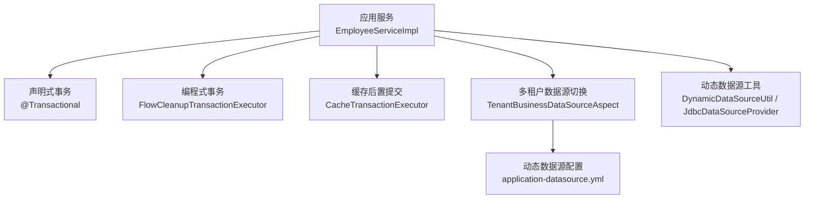
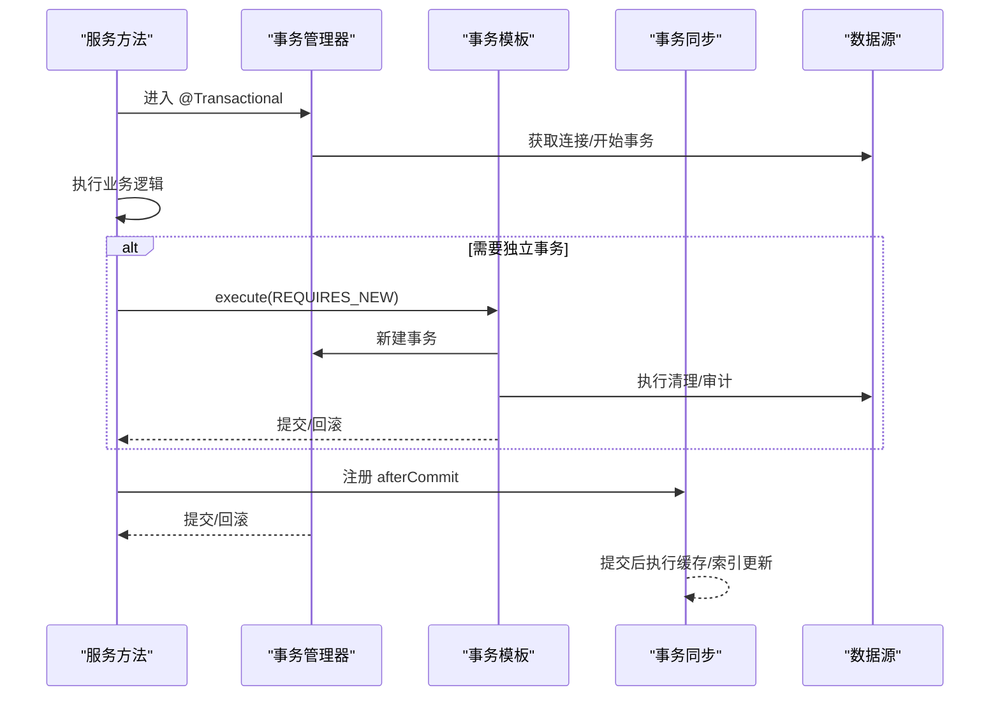
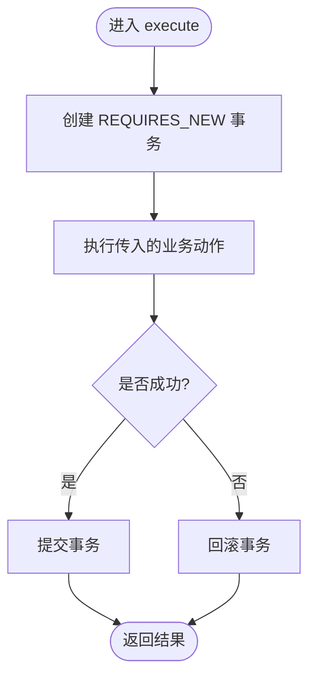
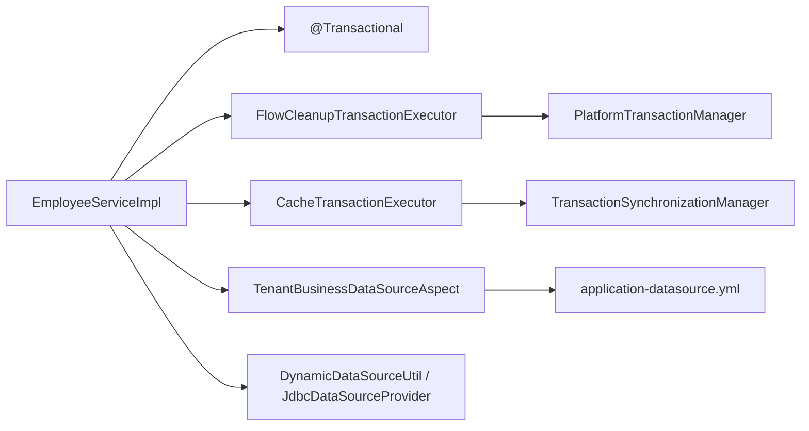

# 事务管理机制

<cite>
**本文引用的文件**
- [EmployeeServiceImpl.java](file://forge-server/forge-admin-server/src/main/java/com/mdframe/forge/employee/service/impl/EmployeeServiceImpl.java)
- [FlowCleanupTransactionExecutor.java](file://forge-server/forge-framework/forge-plugin-parent/forge-plugin-flow/src/main/java/com/mdframe/forge/starter/flow/service/support/FlowCleanupTransactionExecutor.java)
- [CacheTransactionExecutor.java](file://forge-server/forge-framework/forge-starter-parent/forge-starter-cache/src/main/java/com/mdframe/forge/starter/cache/managed/transaction/CacheTransactionExecutor.java)
- [TenantBusinessDataSourceAspect.java](file://forge-server/forge-framework/forge-starter-parent/forge-starter-tenant/src/main/java/com/mdframe/forge/starter/tenant/datasource/TenantBusinessDataSourceAspect.java)
- [application-datasource.yml](file://docker-forge-admin/application-datasource.yml)
- [JdbcDataSourceProvider.java](file://forge-server/forge-framework/forge-plugin-parent/forge-plugin-data/src/main/java/com/mdframe/forge/plugin/data/support/JdbcDataSourceProvider.java)
- [DynamicDataSourceUtil.java](file://forge-server/forge-framework/forge-plugin-parent/forge-plugin-generator/src/main/java/com/mdframe/forge/plugin/generator/util/DynamicDataSourceUtil.java)
- [FlowActionExecutionLogService.java](file://forge-server/forge-framework/forge-plugin-parent/forge-plugin-capability-parent/forge-plugin-capability-actions/src/main/java/com/mdframe/forge/plugin/capability/flowaction/service/FlowActionExecutionLogService.java)
- [BusinessActionExecutionService.java](file://forge-server/forge-framework/forge-plugin-parent/forge-plugin-generator/src/main/java/com/mdframe/forge/plugin/generator/service/businessapp/BusinessActionExecutionService.java)
</cite>

## 目录
1. [简介](#简介)
2. [项目结构](#项目结构)
3. [核心组件](#核心组件)
4. [架构总览](#架构总览)
5. [详细组件分析](#详细组件分析)
6. [依赖关系分析](#依赖关系分析)
7. [性能考虑](#性能考虑)
8. [故障排查指南](#故障排查指南)
9. [结论](#结论)
10. [附录](#附录)

## 简介
本文件面向 Forge Admin 的事务管理机制，聚焦以下主题：声明式事务配置（@Transactional）、编程式事务管理（PlatformTransactionTemplate、手动控制与异常策略）、分布式事务方案（Seata/Saga/TCC 的适用性说明）、事务边界设计原则（粒度、嵌套、长事务优化）、事务监控与审计（日志、性能、死锁检测），以及特殊场景（异步、消息、补偿）下的事务处理。文档同时提供可操作的配置示例路径与排障清单，帮助读者在真实工程中正确落地。

## 项目结构
Forge Admin 采用多模块分层架构，事务能力贯穿服务层、插件与基础设施层：
- 服务层使用 Spring 声明式事务注解进行业务方法级事务控制。
- 插件层通过编程式事务模板实现“独立提交”或“后置提交”等细粒度控制。
- 数据源与多租户模块在事务边界内完成数据源切换与一致性校验。
- 配置中心集中管理连接池与数据库相关参数，便于统一调优。

图表来源
- [EmployeeServiceImpl.java:58-83](file://forge-server/forge-admin-server/src/main/java/com/mdframe/forge/employee/service/impl/EmployeeServiceImpl.java#L58-L83)
- [FlowCleanupTransactionExecutor.java:17-21](file://forge-server/forge-framework/forge-plugin-parent/forge-plugin-flow/src/main/java/com/mdframe/forge/starter/flow/service/support/FlowCleanupTransactionExecutor.java#L17-L21)
- [CacheTransactionExecutor.java:8-20](file://forge-server/forge-framework/forge-starter-parent/forge-starter-cache/src/main/java/com/mdframe/forge/starter/cache/managed/transaction/CacheTransactionExecutor.java#L8-L20)
- [TenantBusinessDataSourceAspect.java:27-45](file://forge-server/forge-framework/forge-starter-parent/forge-starter-tenant/src/main/java/com/mdframe/forge/starter/tenant/datasource/TenantBusinessDataSourceAspect.java#L27-L45)
- [application-datasource.yml:1-21](file://docker-forge-admin/application-datasource.yml#L1-L21)

章节来源
- [EmployeeServiceImpl.java:58-83](file://forge-server/forge-admin-server/src/main/java/com/mdframe/forge/employee/service/impl/EmployeeServiceImpl.java#L58-L83)
- [application-datasource.yml:1-21](file://docker-forge-admin/application-datasource.yml#L1-L21)

## 核心组件
- 声明式事务：在服务方法上使用 @Transactional(rollbackFor = Exception.class)，确保写操作在异常时回滚。
- 编程式事务：通过 PlatformTransactionManager + TransactionTemplate 创建独立传播行为的事务，用于清理、审计等需要隔离的场景。
- 事务同步回调：基于 TransactionSynchronizationManager.registerSynchronization 实现“提交后执行”，保证缓存/索引等副作用在事务成功后发生。
- 多租户数据源切换：在事务开启前解析并切换到目标租户数据源，并在已有事务中做一致性校验，避免跨数据源混用导致的不一致。
- 动态数据源：运行时构建 HikariDataSource 并复用连接池，支撑多数据源访问。

章节来源
- [EmployeeServiceImpl.java:58-83](file://forge-server/forge-admin-server/src/main/java/com/mdframe/forge/employee/service/impl/EmployeeServiceImpl.java#L58-L83)
- [FlowCleanupTransactionExecutor.java:17-21](file://forge-server/forge-framework/forge-plugin-parent/forge-plugin-flow/src/main/java/com/mdframe/forge/starter/flow/service/support/FlowCleanupTransactionExecutor.java#L17-L21)
- [CacheTransactionExecutor.java:8-20](file://forge-server/forge-framework/forge-starter-parent/forge-starter-cache/src/main/java/com/mdframe/forge/starter/cache/managed/transaction/CacheTransactionExecutor.java#L8-L20)
- [TenantBusinessDataSourceAspect.java:27-45](file://forge-server/forge-framework/forge-starter-parent/forge-starter-tenant/src/main/java/com/mdframe/forge/starter/tenant/datasource/TenantBusinessDataSourceAspect.java#L27-L45)
- [JdbcDataSourceProvider.java:36-55](file://forge-server/forge-framework/forge-plugin-parent/forge-plugin-data/src/main/java/com/mdframe/forge/plugin/data/support/JdbcDataSourceProvider.java#L36-L55)
- [DynamicDataSourceUtil.java:30-49](file://forge-server/forge-framework/forge-plugin-parent/forge-plugin-generator/src/main/java/com/mdframe/forge/plugin/generator/util/DynamicDataSourceUtil.java#L30-L49)

## 架构总览
下图展示了从业务方法到事务边界的调用链，包括声明式事务、编程式事务与事务同步回调的组合使用。

图表来源
- [EmployeeServiceImpl.java:58-83](file://forge-server/forge-admin-server/src/main/java/com/mdframe/forge/employee/service/impl/EmployeeServiceImpl.java#L58-L83)
- [FlowCleanupTransactionExecutor.java:17-21](file://forge-server/forge-framework/forge-plugin-parent/forge-plugin-flow/src/main/java/com/mdframe/forge/starter/flow/service/support/FlowCleanupTransactionExecutor.java#L17-L21)
- [CacheTransactionExecutor.java:8-20](file://forge-server/forge-framework/forge-starter-parent/forge-starter-cache/src/main/java/com/mdframe/forge/starter/cache/managed/transaction/CacheTransactionExecutor.java#L8-L20)

## 详细组件分析

### 声明式事务：@Transactional 的使用与最佳实践
- 典型用法：在写操作方法上标注 @Transactional(rollbackFor = Exception.class)，确保所有受检与非受检异常均触发回滚。
- 建议：
  - 将同一业务原子操作收敛到单一方法，减少跨方法调用导致的代理失效问题。
  - 对读多写少的查询方法保持只读语义，避免不必要的写事务开销。
  - 结合多租户数据源切换，确保事务内数据源上下文稳定。

章节来源
- [EmployeeServiceImpl.java:58-83](file://forge-server/forge-admin-server/src/main/java/com/mdframe/forge/employee/service/impl/EmployeeServiceImpl.java#L58-L83)
- [TenantBusinessDataSourceAspect.java:27-45](file://forge-server/forge-framework/forge-starter-parent/forge-starter-tenant/src/main/java/com/mdframe/forge/starter/tenant/datasource/TenantBusinessDataSourceAspect.java#L27-L45)

### 编程式事务：PlatformTransactionTemplate 与手动控制
- 独立事务：通过 TransactionTemplate 设置 PROPAGATION_REQUIRES_NEW，将清理、审计等动作放入新事务，避免与主事务相互影响。
- 异常策略：在 execute 回调中捕获并分类处理异常，必要时记录上下文信息以便追踪。
- 适用场景：流程清理、审计日志写入、外部系统幂等保障等需要强隔离的操作。

图表来源
- [FlowCleanupTransactionExecutor.java:17-21](file://forge-server/forge-framework/forge-plugin-parent/forge-plugin-flow/src/main/java/com/mdframe/forge/starter/flow/service/support/FlowCleanupTransactionExecutor.java#L17-L21)

章节来源
- [FlowCleanupTransactionExecutor.java:17-21](file://forge-server/forge-framework/forge-plugin-parent/forge-plugin-flow/src/main/java/com/mdframe/forge/starter/flow/service/support/FlowCleanupTransactionExecutor.java#L17-L21)

### 事务同步回调：afterCommit 的可靠执行
- 机制：在事务活跃且同步激活时，注册 TransactionSynchronization，在事务提交后执行缓存失效、索引重建等副作用。
- 优势：避免“先写库再写缓存”带来的不一致；若事务回滚，副作用不会执行。
- 注意：需确保同步已激活，否则直接执行以避免阻塞。

章节来源
- [CacheTransactionExecutor.java:8-20](file://forge-server/forge-framework/forge-starter-parent/forge-starter-cache/src/main/java/com/mdframe/forge/starter/cache/managed/transaction/CacheTransactionExecutor.java#L8-L20)

### 多租户数据源切换与事务边界
- 切换时机：在事务开启前解析并切换到当前租户的数据源，确保后续 SQL 走正确的库。
- 一致性校验：若已在其他数据源事务中，禁止再次切换，抛出业务异常防止脏读/脏写。
- 配置：通过动态数据源配置定义主库与连接池参数，便于统一管理与调优。

章节来源
- [TenantBusinessDataSourceAspect.java:27-45](file://forge-server/forge-framework/forge-starter-parent/forge-starter-tenant/src/main/java/com/mdframe/forge/starter/tenant/datasource/TenantBusinessDataSourceAspect.java#L27-L45)
- [application-datasource.yml:1-21](file://docker-forge-admin/application-datasource.yml#L1-L21)

### 动态数据源与连接池
- 运行时数据源：根据配置动态创建 HikariDataSource，并缓存复用，降低创建成本。
- 连接池参数：合理设置最大连接数、空闲超时、连接生命周期等，匹配并发与慢查询特征。
- 工具类：提供便捷 API 获取连接与数据源对象，简化上层使用。

章节来源
- [JdbcDataSourceProvider.java:36-55](file://forge-server/forge-framework/forge-plugin-parent/forge-plugin-data/src/main/java/com/mdframe/forge/plugin/data/support/JdbcDataSourceProvider.java#L36-L55)
- [DynamicDataSourceUtil.java:30-49](file://forge-server/forge-framework/forge-plugin-parent/forge-plugin-generator/src/main/java/com/mdframe/forge/plugin/generator/util/DynamicDataSourceUtil.java#L30-L49)

### 事务监控与审计
- 执行日志：在业务动作执行过程中记录请求摘要、耗时、租户、关联ID等关键信息，便于定位问题。
- 审计字段：状态变更、变更摘要等结构化存储，支持按租户与对象维度检索。
- 保留策略：设置审计记录的保留截止时间，满足合规与存储成本平衡。

章节来源
- [BusinessActionExecutionService.java:626-690](file://forge-server/forge-framework/forge-plugin-parent/forge-plugin-generator/src/main/java/com/mdframe/forge/plugin/generator/service/businessapp/BusinessActionExecutionService.java#L626-L690)
- [FlowActionExecutionLogService.java:347-372](file://forge-server/forge-framework/forge-plugin-parent/forge-plugin-capability-parent/forge-plugin-capability-actions/src/main/java/com/mdframe/forge/plugin/capability/flowaction/service/FlowActionExecutionLogService.java#L347-L372)

### 分布式事务处理方案（概念性说明）
- Seata 集成：适用于跨服务/跨库的强一致性需求，常见于订单、支付等核心链路。
- Saga 模式：适合长事务、最终一致性场景，通过正向操作与补偿操作编排业务流程。
- TCC 模式：适用于高性能、可控补偿能力的场景，要求业务接口具备 Try/Confirm/Cancel 三阶段能力。
- 选型建议：优先评估本地事务+消息的最终一致性；当强一致不可妥协时引入 Seata，并结合 Saga/TCC 细化补偿策略。

[本节为概念性说明，不直接分析具体代码文件]

### 事务边界设计原则
- 粒度控制：以“一个业务用例”为单位划分事务，避免过大事务造成锁竞争与长事务。
- 嵌套事务：谨慎使用嵌套事务，尽量拆分为多个独立事务，降低耦合度与风险。
- 长事务优化：将非必要的 I/O 移出事务，或使用 REQUIRES_NEW 拆分步骤，缩短持有锁的时间。
- 多租户一致性：确保事务内数据源不变，或在明确边界内切换并校验。

[本节为通用设计指导，不直接分析具体代码文件]

### 特殊场景下的事务处理
- 异步事务：对于不需要强一致的副作用（如通知、统计），可在事务外异步执行，或通过 afterCommit 延迟执行。
- 消息事务：结合消息中间件的事务消息或最终一致性方案，确保消息与状态变更的一致性。
- 补偿事务：在 Saga/TCC 中设计明确的补偿逻辑，保证失败可恢复。

[本节为通用实践指导，不直接分析具体代码文件]

## 依赖关系分析

图表来源
- [EmployeeServiceImpl.java:58-83](file://forge-server/forge-admin-server/src/main/java/com/mdframe/forge/employee/service/impl/EmployeeServiceImpl.java#L58-L83)
- [FlowCleanupTransactionExecutor.java:17-21](file://forge-server/forge-framework/forge-plugin-parent/forge-plugin-flow/src/main/java/com/mdframe/forge/starter/flow/service/support/FlowCleanupTransactionExecutor.java#L17-L21)
- [CacheTransactionExecutor.java:8-20](file://forge-server/forge-framework/forge-starter-parent/forge-starter-cache/src/main/java/com/mdframe/forge/starter/cache/managed/transaction/CacheTransactionExecutor.java#L8-L20)
- [TenantBusinessDataSourceAspect.java:27-45](file://forge-server/forge-framework/forge-starter-parent/forge-starter-tenant/src/main/java/com/mdframe/forge/starter/tenant/datasource/TenantBusinessDataSourceAspect.java#L27-L45)
- [application-datasource.yml:1-21](file://docker-forge-admin/application-datasource.yml#L1-L21)
- [JdbcDataSourceProvider.java:36-55](file://forge-server/forge-framework/forge-plugin-parent/forge-plugin-data/src/main/java/com/mdframe/forge/plugin/data/support/JdbcDataSourceProvider.java#L36-L55)
- [DynamicDataSourceUtil.java:30-49](file://forge-server/forge-framework/forge-plugin-parent/forge-plugin-generator/src/main/java/com/mdframe/forge/plugin/generator/util/DynamicDataSourceUtil.java#L30-L49)

章节来源
- [EmployeeServiceImpl.java:58-83](file://forge-server/forge-admin-server/src/main/java/com/mdframe/forge/employee/service/impl/EmployeeServiceImpl.java#L58-L83)
- [application-datasource.yml:1-21](file://docker-forge-admin/application-datasource.yml#L1-L21)

## 性能考虑
- 连接池调优：依据并发与慢查询情况调整最大连接数、空闲超时与连接生命周期，避免连接耗尽或频繁创建销毁。
- 事务粒度：缩小事务范围，减少锁持有时间，提升吞吐。
- 副作用后置：将缓存失效、索引重建等非核心操作放在 afterCommit 中执行，避免阻塞主事务。
- 多租户切换：在事务边界外完成数据源解析，避免在事务中频繁切换。

[本节提供通用性能建议，不直接分析具体代码文件]

## 故障排查指南
- 事务未生效：
  - 检查方法是否被 Spring 代理调用（同类自调用会绕过代理）。
  - 确认 @Transactional 的 rollbackFor 配置是否正确。
- 数据源切换异常：
  - 若在已有事务中尝试切换数据源，会抛出业务异常，需在事务边界外完成切换。
- 缓存不一致：
  - 确认是否在 afterCommit 中执行缓存失效，避免提前失效导致脏读。
- 审计缺失：
  - 检查审计写入是否处于独立事务或 afterCommit 中，确保主事务失败不影响审计记录。
- 连接池问题：
  - 观察连接池指标，调整 Hikari 参数，避免连接泄漏或超时。

章节来源
- [TenantBusinessDataSourceAspect.java:27-45](file://forge-server/forge-framework/forge-starter-parent/forge-starter-tenant/src/main/java/com/mdframe/forge/starter/tenant/datasource/TenantBusinessDataSourceAspect.java#L27-L45)
- [CacheTransactionExecutor.java:8-20](file://forge-server/forge-framework/forge-starter-parent/forge-starter-cache/src/main/java/com/mdframe/forge/starter/cache/managed/transaction/CacheTransactionExecutor.java#L8-L20)
- [application-datasource.yml:14-21](file://docker-forge-admin/application-datasource.yml#L14-L21)

## 结论
Forge Admin 在事务管理方面兼顾了声明式与编程式两种范式，并通过事务同步回调与多租户数据源切换，实现了高内聚、低耦合的事务边界设计。结合审计日志与连接池调优，能够在保证一致性的同时提升系统性能与可观测性。对于分布式场景，建议在评估本地事务与消息最终一致性的基础上，按需引入 Seata 及 Saga/TCC 模式，完善补偿与幂等机制。

[本节为总结性内容，不直接分析具体代码文件]

## 附录
- 配置示例路径：
  - 数据源与连接池：[application-datasource.yml:1-21](file://docker-forge-admin/application-datasource.yml#L1-L21)
- 参考实现路径：
  - 声明式事务：[EmployeeServiceImpl.java:58-83](file://forge-server/forge-admin-server/src/main/java/com/mdframe/forge/employee/service/impl/EmployeeServiceImpl.java#L58-L83)
  - 编程式事务：[FlowCleanupTransactionExecutor.java:17-21](file://forge-server/forge-framework/forge-plugin-parent/forge-plugin-flow/src/main/java/com/mdframe/forge/starter/flow/service/support/FlowCleanupTransactionExecutor.java#L17-L21)
  - 事务同步回调：[CacheTransactionExecutor.java:8-20](file://forge-server/forge-framework/forge-starter-parent/forge-starter-cache/src/main/java/com/mdframe/forge/starter/cache/managed/transaction/CacheTransactionExecutor.java#L8-L20)
  - 多租户数据源切换：[TenantBusinessDataSourceAspect.java:27-45](file://forge-server/forge-framework/forge-starter-parent/forge-starter-tenant/src/main/java/com/mdframe/forge/starter/tenant/datasource/TenantBusinessDataSourceAspect.java#L27-L45)
  - 动态数据源：[JdbcDataSourceProvider.java:36-55](file://forge-server/forge-framework/forge-plugin-parent/forge-plugin-data/src/main/java/com/mdframe/forge/plugin/data/support/JdbcDataSourceProvider.java#L36-L55), [DynamicDataSourceUtil.java:30-49](file://forge-server/forge-framework/forge-plugin-parent/forge-plugin-generator/src/main/java/com/mdframe/forge/plugin/generator/util/DynamicDataSourceUtil.java#L30-L49)
  - 审计与日志：[BusinessActionExecutionService.java:626-690](file://forge-server/forge-framework/forge-plugin-parent/forge-plugin-generator/src/main/java/com/mdframe/forge/plugin/generator/service/businessapp/BusinessActionExecutionService.java#L626-L690), [FlowActionExecutionLogService.java:347-372](file://forge-server/forge-framework/forge-plugin-parent/forge-plugin-capability-parent/forge-plugin-capability-actions/src/main/java/com/mdframe/forge/plugin/capability/flowaction/service/FlowActionExecutionLogService.java#L347-L372)