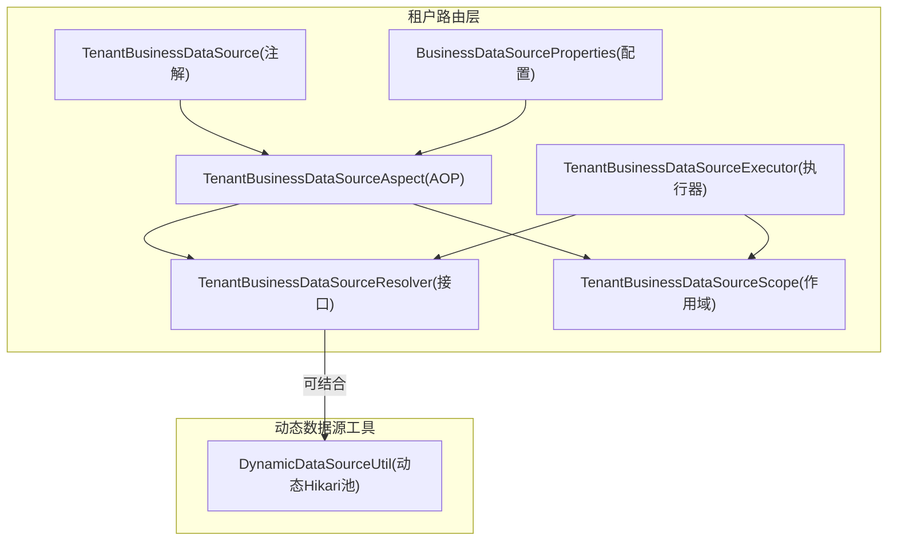
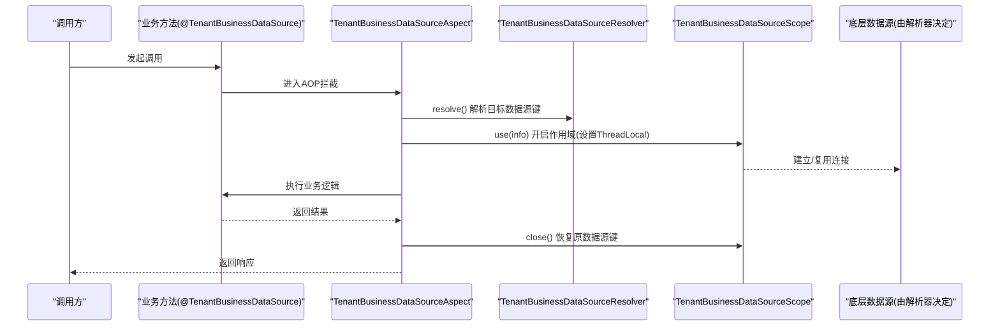
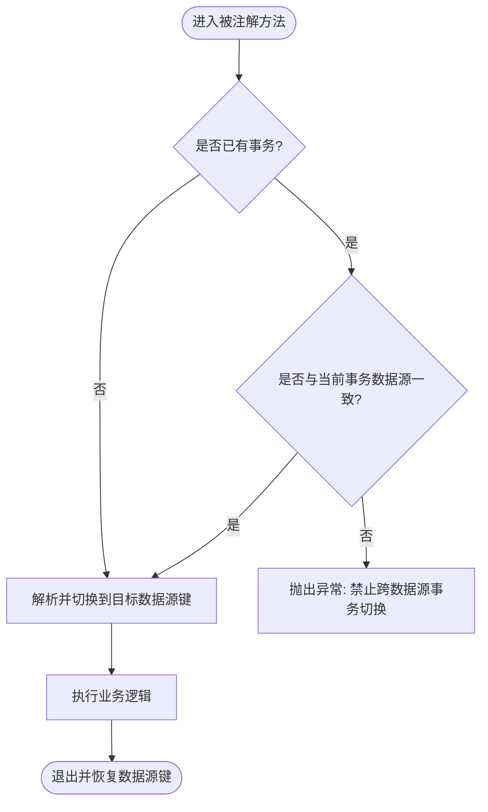
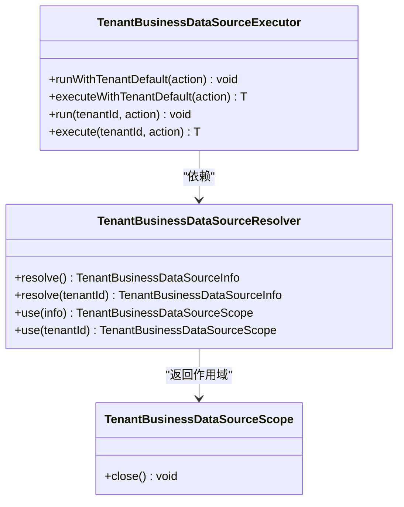
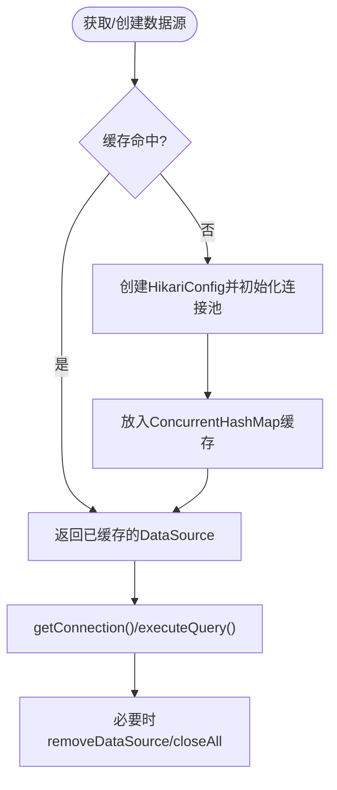
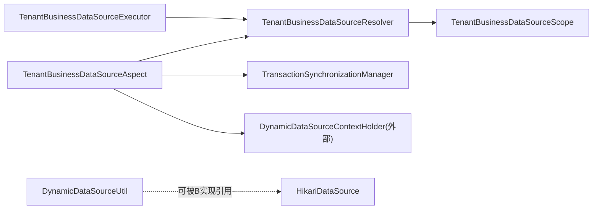

# 多数据源设计

<cite>
**本文引用的文件**
- [DynamicDataSourceUtil.java](file://forge-server/forge-framework/forge-plugin-parent/forge-plugin-generator/src/main/java/com/mdframe/forge/plugin/generator/util/DynamicDataSourceUtil.java)
- [TenantBusinessDataSourceAspect.java](file://forge-server/forge-framework/forge-starter-parent/forge-starter-tenant/src/main/java/com/mdframe/forge/starter/tenant/datasource/TenantBusinessDataSourceAspect.java)
- [TenantBusinessDataSourceResolver.java](file://forge-server/forge-framework/forge-starter-parent/forge-starter-tenant/src/main/java/com/mdframe/forge/starter/tenant/datasource/TenantBusinessDataSourceResolver.java)
- [TenantBusinessDataSourceExecutor.java](file://forge-server/forge-framework/forge-starter-parent/forge-starter-tenant/src/main/java/com/mdframe/forge/starter/tenant/datasource/TenantBusinessDataSourceExecutor.java)
- [TenantBusinessDataSourceScope.java](file://forge-server/forge-framework/forge-starter-parent/forge-starter-tenant/src/main/java/com/mdframe/forge/starter/tenant/datasource/TenantBusinessDataSourceScope.java)
- [TenantBusinessDataSource.java](file://forge-server/forge-framework/forge-starter-parent/forge-starter-tenant/src/main/java/com/mdframe/forge/starter/tenant/datasource/TenantBusinessDataSource.java)
- [BusinessDataSourceProperties.java](file://forge-server/forge-framework/forge-starter-parent/forge-starter-tenant/src/main/java/com/mdframe/forge/starter/tenant/datasource/BusinessDataSourceProperties.java)
- [application-datasource.yml](file://docker-forge-admin/application-datasource.yml)
</cite>

## 目录
1. [简介](#简介)
2. [项目结构](#项目结构)
3. [核心组件](#核心组件)
4. [架构总览](#架构总览)
5. [详细组件分析](#详细组件分析)
6. [依赖关系分析](#依赖关系分析)
7. [性能与连接池调优](#性能与连接池调优)
8. [事务管理在多数据源环境下的方案](#事务管理在多数据源环境下的方案)
9. [监控与健康检查](#监控与健康检查)
10. [故障转移与负载均衡](#故障转移与负载均衡)
11. [配置示例](#配置示例)
12. [故障排查指南](#故障排查指南)
13. [结论](#结论)

## 简介
本文件面向 Forge Admin 的多数据源设计，围绕主从数据库配置、读写分离策略、数据源路由机制、动态数据源实现原理（基于 ThreadLocal 的切换）、配置管理与连接池参数调优、事务处理、监控与健康检查、故障转移与负载均衡等主题进行系统化说明。文档同时提供完整配置示例与故障排查指南，帮助读者在生产环境中正确落地与维护多数据源能力。

## 项目结构
本项目将“租户业务数据源路由”和“动态数据源工具”解耦为两个层次：
- 租户侧路由层：通过注解 + AOP + 解析器 + 作用域执行器，在业务代码中按租户或默认策略切换到目标数据源键。
- 动态数据源工具层：提供运行时创建、缓存、测试、关闭 Hikari 连接池的能力，便于按需构建数据源实例。

图表来源
- [TenantBusinessDataSource.java:1-15](file://forge-server/forge-framework/forge-starter-parent/forge-starter-tenant/src/main/java/com/mdframe/forge/starter/tenant/datasource/TenantBusinessDataSource.java#L1-L15)
- [TenantBusinessDataSourceAspect.java:1-47](file://forge-server/forge-framework/forge-starter-parent/forge-starter-tenant/src/main/java/com/mdframe/forge/starter/tenant/datasource/TenantBusinessDataSourceAspect.java#L1-L47)
- [TenantBusinessDataSourceResolver.java:1-16](file://forge-server/forge-framework/forge-starter-parent/forge-starter-tenant/src/main/java/com/mdframe/forge/starter/tenant/datasource/TenantBusinessDataSourceResolver.java#L1-L16)
- [TenantBusinessDataSourceExecutor.java:1-50](file://forge-server/forge-framework/forge-starter-parent/forge-starter-tenant/src/main/java/com/mdframe/forge/starter/tenant/datasource/TenantBusinessDataSourceExecutor.java#L1-L50)
- [TenantBusinessDataSourceScope.java:1-11](file://forge-server/forge-framework/forge-starter-parent/forge-starter-tenant/src/main/java/com/mdframe/forge/starter/tenant/datasource/TenantBusinessDataSourceScope.java#L1-L11)
- [BusinessDataSourceProperties.java:1-26](file://forge-server/forge-framework/forge-starter-parent/forge-starter-tenant/src/main/java/com/mdframe/forge/starter/tenant/datasource/BusinessDataSourceProperties.java#L1-L26)
- [DynamicDataSourceUtil.java:1-137](file://forge-server/forge-framework/forge-plugin-parent/forge-plugin-generator/src/main/java/com/mdframe/forge/plugin/generator/util/DynamicDataSourceUtil.java#L1-L137)

章节来源
- [TenantBusinessDataSource.java:1-15](file://forge-server/forge-framework/forge-starter-parent/forge-starter-tenant/src/main/java/com/mdframe/forge/starter/tenant/datasource/TenantBusinessDataSource.java#L1-L15)
- [TenantBusinessDataSourceAspect.java:1-47](file://forge-server/forge-framework/forge-starter-parent/forge-starter-tenant/src/main/java/com/mdframe/forge/starter/tenant/datasource/TenantBusinessDataSourceAspect.java#L1-L47)
- [TenantBusinessDataSourceResolver.java:1-16](file://forge-server/forge-framework/forge-starter-parent/forge-starter-tenant/src/main/java/com/mdframe/forge/starter/tenant/datasource/TenantBusinessDataSourceResolver.java#L1-L16)
- [TenantBusinessDataSourceExecutor.java:1-50](file://forge-server/forge-framework/forge-starter-parent/forge-starter-tenant/src/main/java/com/mdframe/forge/starter/tenant/datasource/TenantBusinessDataSourceExecutor.java#L1-L50)
- [TenantBusinessDataSourceScope.java:1-11](file://forge-server/forge-framework/forge-starter-parent/forge-starter-tenant/src/main/java/com/mdframe/forge/starter/tenant/datasource/TenantBusinessDataSourceScope.java#L1-L11)
- [BusinessDataSourceProperties.java:1-26](file://forge-server/forge-framework/forge-starter-parent/forge-starter-tenant/src/main/java/com/mdframe/forge/starter/tenant/datasource/BusinessDataSourceProperties.java#L1-L26)
- [DynamicDataSourceUtil.java:1-137](file://forge-server/forge-framework/forge-plugin-parent/forge-plugin-generator/src/main/java/com/mdframe/forge/plugin/generator/util/DynamicDataSourceUtil.java#L1-L137)

## 核心组件
- 注解 TenantBusinessDataSource：标记方法或类，表示该范围使用当前租户默认业务数据源。
- AOP 切面 TenantBusinessDataSourceAspect：在方法执行前解析并切换到目标数据源键，校验事务边界，避免跨数据源事务混用。
- 解析器接口 TenantBusinessDataSourceResolver：定义如何根据上下文（如租户ID）解析出目标数据源信息与作用域。
- 执行器 TenantBusinessDataSourceExecutor：提供 runWithTenantDefault / executeWithTenantDefault / execute 等便捷 API，封装解析与切换流程。
- 作用域 TenantBusinessDataSourceScope：AutoCloseable 句柄，确保切换在 try-with-resources 结束时恢复。
- 配置 BusinessDataSourceProperties：开关与默认行为控制，如是否启用租户路由、未配置时是否默认启用。
- 动态数据源工具 DynamicDataSourceUtil：基于 Hikari 的动态数据源创建、缓存、测试、关闭与查询执行。

章节来源
- [TenantBusinessDataSource.java:1-15](file://forge-server/forge-framework/forge-starter-parent/forge-starter-tenant/src/main/java/com/mdframe/forge/starter/tenant/datasource/TenantBusinessDataSource.java#L1-L15)
- [TenantBusinessDataSourceAspect.java:1-47](file://forge-server/forge-framework/forge-starter-parent/forge-starter-tenant/src/main/java/com/mdframe/forge/starter/tenant/datasource/TenantBusinessDataSourceAspect.java#L1-L47)
- [TenantBusinessDataSourceResolver.java:1-16](file://forge-server/forge-framework/forge-starter-parent/forge-starter-tenant/src/main/java/com/mdframe/forge/starter/tenant/datasource/TenantBusinessDataSourceResolver.java#L1-L16)
- [TenantBusinessDataSourceExecutor.java:1-50](file://forge-server/forge-framework/forge-starter-parent/forge-starter-tenant/src/main/java/com/mdframe/forge/starter/tenant/datasource/TenantBusinessDataSourceExecutor.java#L1-L50)
- [TenantBusinessDataSourceScope.java:1-11](file://forge-server/forge-framework/forge-starter-parent/forge-starter-tenant/src/main/java/com/mdframe/forge/starter/tenant/datasource/TenantBusinessDataSourceScope.java#L1-L11)
- [BusinessDataSourceProperties.java:1-26](file://forge-server/forge-framework/forge-starter-parent/forge-starter-tenant/src/main/java/com/mdframe/forge/starter/tenant/datasource/BusinessDataSourceProperties.java#L1-L26)
- [DynamicDataSourceUtil.java:1-137](file://forge-server/forge-framework/forge-plugin-parent/forge-plugin-generator/src/main/java/com/mdframe/forge/plugin/generator/util/DynamicDataSourceUtil.java#L1-L137)

## 架构总览
下图展示了请求进入后，如何通过注解与 AOP 完成数据源键的解析与切换，并在事务边界内保证一致性。

图表来源
- [TenantBusinessDataSourceAspect.java:1-47](file://forge-server/forge-framework/forge-starter-parent/forge-starter-tenant/src/main/java/com/mdframe/forge/starter/tenant/datasource/TenantBusinessDataSourceAspect.java#L1-L47)
- [TenantBusinessDataSourceResolver.java:1-16](file://forge-server/forge-framework/forge-starter-parent/forge-starter-tenant/src/main/java/com/mdframe/forge/starter/tenant/datasource/TenantBusinessDataSourceResolver.java#L1-L16)
- [TenantBusinessDataSourceScope.java:1-11](file://forge-server/forge-framework/forge-starter-parent/forge-starter-tenant/src/main/java/com/mdframe/forge/starter/tenant/datasource/TenantBusinessDataSourceScope.java#L1-L11)

## 详细组件分析

### 注解与AOP：TenantBusinessDataSource 与 TenantBusinessDataSourceAspect
- 职责：在标注的方法或类上，于事务开始前解析并切换到目标数据源键；若已在其他数据源的事务中，则拒绝切换，抛出异常以保障事务一致性。
- 关键点：
  - 使用 AOP 在最高优先级附近拦截，确保先切换数据源再进入业务。
  - 通过 TransactionSynchronizationManager 判断是否已有事务活跃，并结合当前数据源键做一致性校验。
  - 使用 TenantBusinessDataSourceScope 作为 AutoCloseable 资源，确保线程本地状态在退出时恢复。

图表来源
- [TenantBusinessDataSourceAspect.java:1-47](file://forge-server/forge-framework/forge-starter-parent/forge-starter-tenant/src/main/java/com/mdframe/forge/starter/tenant/datasource/TenantBusinessDataSourceAspect.java#L1-L47)

章节来源
- [TenantBusinessDataSourceAspect.java:1-47](file://forge-server/forge-framework/forge-starter-parent/forge-starter-tenant/src/main/java/com/mdframe/forge/starter/tenant/datasource/TenantBusinessDataSourceAspect.java#L1-L47)

### 解析器与执行器：TenantBusinessDataSourceResolver 与 TenantBusinessDataSourceExecutor
- 解析器接口：定义 resolve/use 等方法，用于根据租户上下文或默认策略解析目标数据源信息与作用域。
- 执行器：封装常见用法，支持无参默认租户、指定租户ID两种场景，内部委托解析器完成切换。

图表来源
- [TenantBusinessDataSourceResolver.java:1-16](file://forge-server/forge-framework/forge-starter-parent/forge-starter-tenant/src/main/java/com/mdframe/forge/starter/tenant/datasource/TenantBusinessDataSourceResolver.java#L1-L16)
- [TenantBusinessDataSourceExecutor.java:1-50](file://forge-server/forge-framework/forge-starter-parent/forge-starter-tenant/src/main/java/com/mdframe/forge/starter/tenant/datasource/TenantBusinessDataSourceExecutor.java#L1-L50)
- [TenantBusinessDataSourceScope.java:1-11](file://forge-server/forge-framework/forge-starter-parent/forge-starter-tenant/src/main/java/com/mdframe/forge/starter/tenant/datasource/TenantBusinessDataSourceScope.java#L1-L11)

章节来源
- [TenantBusinessDataSourceResolver.java:1-16](file://forge-server/forge-framework/forge-starter-parent/forge-starter-tenant/src/main/java/com/mdframe/forge/starter/tenant/datasource/TenantBusinessDataSourceResolver.java#L1-L16)
- [TenantBusinessDataSourceExecutor.java:1-50](file://forge-server/forge-framework/forge-starter-parent/forge-starter-tenant/src/main/java/com/mdframe/forge/starter/tenant/datasource/TenantBusinessDataSourceExecutor.java#L1-L50)
- [TenantBusinessDataSourceScope.java:1-11](file://forge-server/forge-framework/forge-starter-parent/forge-starter-tenant/src/main/java/com/mdframe/forge/starter/tenant/datasource/TenantBusinessDataSourceScope.java#L1-L11)

### 动态数据源工具：DynamicDataSourceUtil
- 职责：在运行时根据配置创建 Hikari 连接池，维护全局缓存，提供连接获取、测试、关闭与简单查询执行能力。
- 关键点：
  - 使用 ConcurrentHashMap 缓存 DataSource，避免重复创建。
  - 连接池参数（最大连接数、空闲超时、最大生命周期、连接测试语句）集中配置。
  - 支持按数据库类型自动选择测试 SQL（如 Oracle 的 SELECT 1 FROM DUAL）。
  - 提供 removeDataSource/clearAll 用于释放资源。

图表来源
- [DynamicDataSourceUtil.java:1-137](file://forge-server/forge-framework/forge-plugin-parent/forge-plugin-generator/src/main/java/com/mdframe/forge/plugin/generator/util/DynamicDataSourceUtil.java#L1-L137)

章节来源
- [DynamicDataSourceUtil.java:1-137](file://forge-server/forge-framework/forge-plugin-parent/forge-plugin-generator/src/main/java/com/mdframe/forge/plugin/generator/util/DynamicDataSourceUtil.java#L1-L137)

## 依赖关系分析
- 租户路由层依赖 Spring AOP、事务同步管理器以及第三方动态数据源上下文（如 DynamicDataSourceContextHolder），用于设置/读取当前数据源键。
- 解析器与执行器解耦了“如何解析”和“如何使用”，便于扩展不同租户策略。
- 动态数据源工具独立于租户路由层，可被任意模块复用，适合低代码生成、临时任务等场景。

图表来源
- [TenantBusinessDataSourceAspect.java:1-47](file://forge-server/forge-framework/forge-starter-parent/forge-starter-tenant/src/main/java/com/mdframe/forge/starter/tenant/datasource/TenantBusinessDataSourceAspect.java#L1-L47)
- [TenantBusinessDataSourceExecutor.java:1-50](file://forge-server/forge-framework/forge-starter-parent/forge-starter-tenant/src/main/java/com/mdframe/forge/starter/tenant/datasource/TenantBusinessDataSourceExecutor.java#L1-L50)
- [DynamicDataSourceUtil.java:1-137](file://forge-server/forge-framework/forge-plugin-parent/forge-plugin-generator/src/main/java/com/mdframe/forge/plugin/generator/util/DynamicDataSourceUtil.java#L1-L137)

章节来源
- [TenantBusinessDataSourceAspect.java:1-47](file://forge-server/forge-framework/forge-starter-parent/forge-starter-tenant/src/main/java/com/mdframe/forge/starter/tenant/datasource/TenantBusinessDataSourceAspect.java#L1-L47)
- [TenantBusinessDataSourceExecutor.java:1-50](file://forge-server/forge-framework/forge-starter-parent/forge-starter-tenant/src/main/java/com/mdframe/forge/starter/tenant/datasource/TenantBusinessDataSourceExecutor.java#L1-L50)
- [DynamicDataSourceUtil.java:1-137](file://forge-server/forge-framework/forge-plugin-parent/forge-plugin-generator/src/main/java/com/mdframe/forge/plugin/generator/util/DynamicDataSourceUtil.java#L1-L137)

## 性能与连接池调优
- 连接池参数建议（参考 DynamicDataSourceUtil 中的默认值）：
  - 最大连接数：根据并发与数据库承载能力设定，避免过大导致数据库压力。
  - 最小空闲：保持一定空闲连接以降低冷启动延迟。
  - 连接超时：合理设置等待连接的超时时间，避免线程长时间阻塞。
  - 空闲超时与最大生命周期：定期回收连接，防止长连接泄漏或失效。
  - 连接测试语句：针对不同数据库选择合适的探测 SQL，提升连接可用性检测准确性。
- 缓存策略：使用并发安全的 Map 缓存 DataSource，减少重复创建开销。
- 资源释放：在配置变更或应用关闭时，务必调用关闭方法释放连接池。

章节来源
- [DynamicDataSourceUtil.java:54-73](file://forge-server/forge-framework/forge-plugin-parent/forge-plugin-generator/src/main/java/com/mdframe/forge/plugin/generator/util/DynamicDataSourceUtil.java#L54-L73)
- [DynamicDataSourceUtil.java:93-112](file://forge-server/forge-framework/forge-plugin-parent/forge-plugin-generator/src/main/java/com/mdframe/forge/plugin/generator/util/DynamicDataSourceUtil.java#L93-L112)

## 事务管理在多数据源环境下的方案
- 本地事务优先：在同一事务内，必须保证所有操作访问同一数据源键。切面会在事务活跃时校验当前数据源键与目标键一致，不一致则拒绝切换，避免跨库事务导致的复杂性与风险。
- 分布式事务：若确需跨数据源提交，应引入分布式事务框架（如 Seata），并通过业务编排保证各分支事务的一致性。注意：本项目的切面仅保护本地事务内的数据源一致性，不替代分布式事务。
- 最佳实践：
  - 将读多写少的报表/分析类操作尽量放在只读副本或从库。
  - 对强一致性的写入操作，限定在主库或单一数据源键下。
  - 尽量避免在一个事务中混合多个数据源键。

章节来源
- [TenantBusinessDataSourceAspect.java:37-45](file://forge-server/forge-framework/forge-starter-parent/forge-starter-tenant/src/main/java/com/mdframe/forge/starter/tenant/datasource/TenantBusinessDataSourceAspect.java#L37-L45)

## 监控与健康检查
- 健康检查：
  - 使用 DynamicDataSourceUtil.testConnection 对动态数据源进行连通性测试，适用于配置校验与运维自检。
  - 针对 Oracle 等数据库自动选择合适测试语句，提高兼容性。
- 指标收集：
  - 建议接入连接池指标（如 Hikari 暴露的 JMX/Micrometer 指标），监控连接池使用率、等待时间、失败率等。
  - 在 AOP 切面中埋点记录数据源切换耗时与异常，辅助定位问题。
- 告警策略：
  - 连接池耗尽、连接超时、连接失败率突增等阈值触发告警。
  - 动态数据源新增/删除/更新事件纳入审计日志。

章节来源
- [DynamicDataSourceUtil.java:78-88](file://forge-server/forge-framework/forge-plugin-parent/forge-plugin-generator/src/main/java/com/mdframe/forge/plugin/generator/util/DynamicDataSourceUtil.java#L78-L88)
- [DynamicDataSourceUtil.java:127-135](file://forge-server/forge-framework/forge-plugin-parent/forge-plugin-generator/src/main/java/com/mdframe/forge/plugin/generator/util/DynamicDataSourceUtil.java#L127-L135)

## 故障转移与负载均衡
- 故障转移：
  - 在解析器实现中可加入健康检查与快速失败逻辑，当主库不可用时自动切换到备用库。
  - 结合重试与退避策略，降低瞬时抖动影响。
- 负载均衡：
  - 对于读多写少场景，可在解析器中实现轮询/加权随机策略，将读请求分发到多个从库。
  - 结合连接池隔离不同数据源键，避免相互影响。
- 注意事项：
  - 切换策略需考虑数据一致性要求，避免将写请求误路由到从库。
  - 对热点数据源实施限流与熔断，保护后端数据库。

[本节为概念性说明，不直接分析具体文件]

## 配置示例
- 启用租户业务数据源路由：
  - 通过配置项 forge.business.datasource.enabled 控制是否启用。
  - 可通过 forge.business.datasource.tenant-routing-enabled-default 设置 sys_config 未配置时的默认行为。
- 动态数据源连接池参数：
  - 在创建 HikariConfig 时设置最大连接数、空闲超时、连接超时、最大生命周期等。
  - 根据数据库类型配置合适的连接测试语句。
- 配置文件位置参考：
  - 应用级数据源配置示例可参考 docker-forge-admin/application-datasource.yml。

章节来源
- [BusinessDataSourceProperties.java:10-23](file://forge-server/forge-framework/forge-starter-parent/forge-starter-tenant/src/main/java/com/mdframe/forge/starter/tenant/datasource/BusinessDataSourceProperties.java#L10-L23)
- [DynamicDataSourceUtil.java:54-73](file://forge-server/forge-framework/forge-plugin-parent/forge-plugin-generator/src/main/java/com/mdframe/forge/plugin/generator/util/DynamicDataSourceUtil.java#L54-L73)
- [application-datasource.yml](file://docker-forge-admin/application-datasource.yml)

## 故障排查指南
- 现象：切换数据源时报错“不能在已开启的其他数据源事务中切换到租户业务数据源”。
  - 原因：当前事务已绑定到其他数据源键，不允许切换。
  - 解决：拆分事务或在同一事务内统一数据源键；必要时引入分布式事务。
- 现象：动态数据源连接失败。
  - 排查：检查 JDBC URL、用户名、密码、驱动类名是否正确；确认网络可达与数据库服务状态；查看连接测试语句是否适配数据库类型。
- 现象：连接池耗尽或高延迟。
  - 排查：调整最大连接数、连接超时、空闲超时等参数；观察连接池指标；检查是否存在慢查询或未释放连接。
- 现象：应用关闭后仍有连接占用。
  - 排查：确保调用 removeDataSource/clearAll 释放连接池；检查是否有后台任务持有连接。

章节来源
- [TenantBusinessDataSourceAspect.java:37-45](file://forge-server/forge-framework/forge-starter-parent/forge-starter-tenant/src/main/java/com/mdframe/forge/starter/tenant/datasource/TenantBusinessDataSourceAspect.java#L37-L45)
- [DynamicDataSourceUtil.java:78-88](file://forge-server/forge-framework/forge-plugin-parent/forge-plugin-generator/src/main/java/com/mdframe/forge/plugin/generator/util/DynamicDataSourceUtil.java#L78-L88)
- [DynamicDataSourceUtil.java:93-112](file://forge-server/forge-framework/forge-plugin-parent/forge-plugin-generator/src/main/java/com/mdframe/forge/plugin/generator/util/DynamicDataSourceUtil.java#L93-L112)

## 结论
Forge Admin 的多数据源设计通过“注解+AOP+解析器+作用域”的组合，实现了灵活、安全的数据源切换；配合动态数据源工具，可在运行时按需创建与管理连接池。生产环境建议结合连接池指标与监控告警，制定合理的故障转移与负载均衡策略，并在事务层面严格约束数据源一致性，以确保系统的高可用与稳定性。