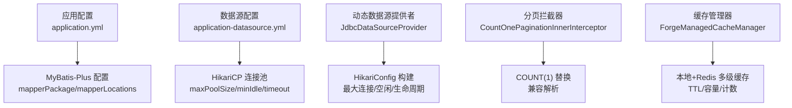
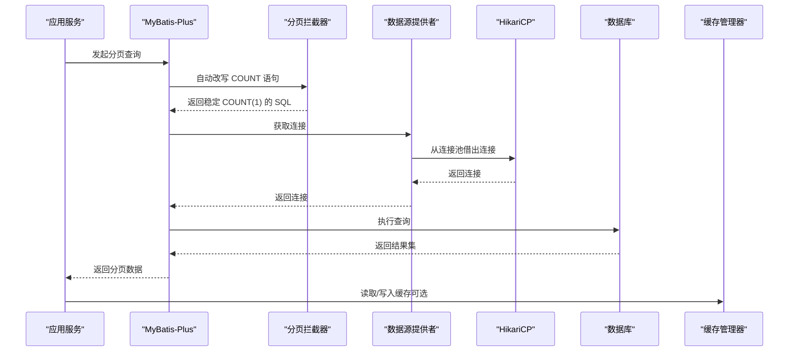
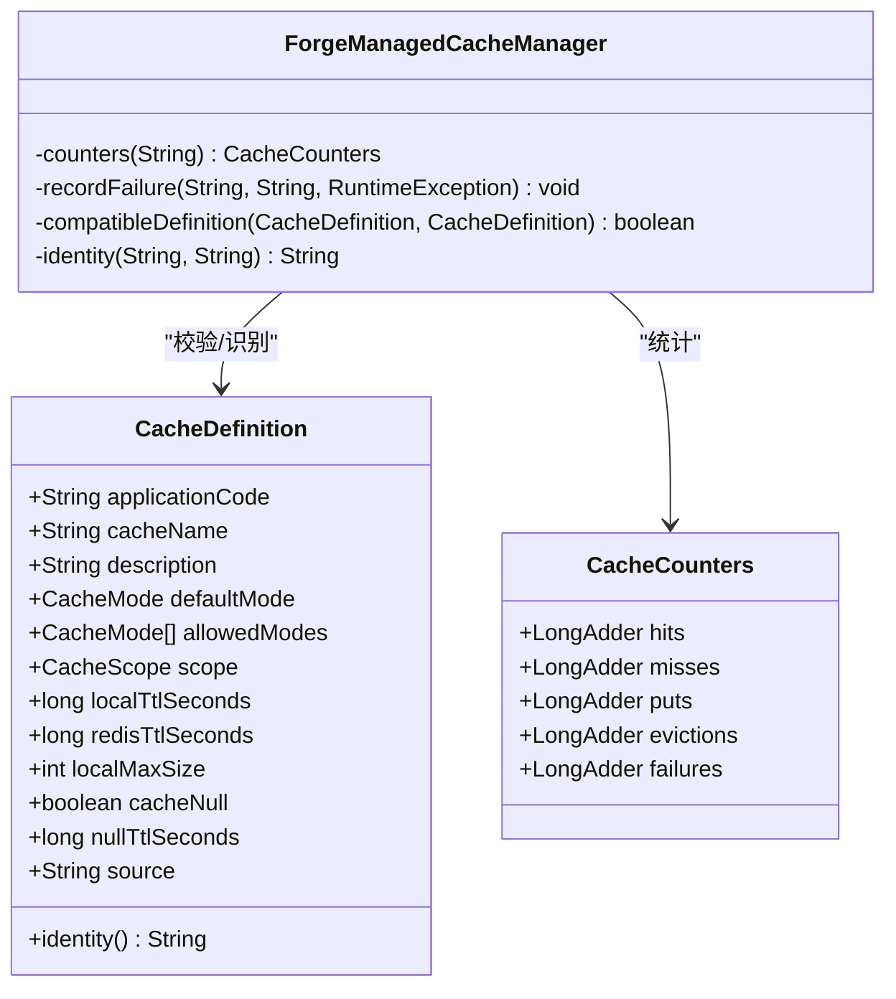
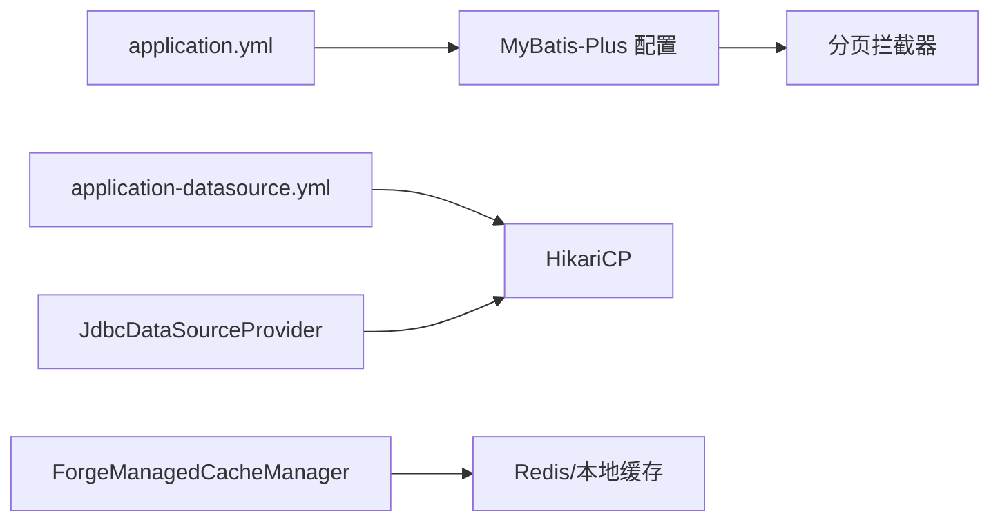

# 性能优化策略

<cite>
**本文引用的文件**
- [JdbcDataSourceProvider.java](file://forge-server/forge-framework/forge-plugin-parent/forge-plugin-data/src/main/java/com/mdframe/forge/plugin/data/support/JdbcDataSourceProvider.java)
- [application-datasource.yml](file://docker-forge-admin/application-datasource.yml)
- [application.yml](file://forge-server/forge-admin-server/src/main/resources/application.yml)
- [ForgeManagedCacheManager.java](file://forge-server/forge-framework/forge-starter-parent/forge-starter-cache/src/main/java/com/mdframe/forge/starter/cache/managed/ForgeManagedCacheManager.java)
- [CacheDefinition.java](file://forge-server/forge-framework/forge-starter-parent/forge-starter-cache/src/main/java/com/mdframe/forge/starter/cache/managed/model/CacheDefinition.java)
- [CountOnePaginationInnerInterceptor.java](file://forge-server/forge-framework/forge-starter-parent/forge-starter-orm/src/main/java/com/mdframe/forge/starter/orm/interceptor/CountOnePaginationInnerInterceptor.java)
- [spec.md（后端数据库性能与注入加固）](file://code-copilot/changes/backend-db-perf-and-injection-hardening/spec.md)
- [execution-log.md（全表检索查询收敛）](file://code-copilot/changes/query-full-scan-hardening/execution-log.md)
</cite>

## 目录
1. [简介](#简介)
2. [项目结构](#项目结构)
3. [核心组件](#核心组件)
4. [架构总览](#架构总览)
5. [详细组件分析](#详细组件分析)
6. [依赖关系分析](#依赖关系分析)
7. [性能考量](#性能考量)
8. [故障排查指南](#故障排查指南)
9. [结论](#结论)
10. [附录](#附录)

## 简介
本文件聚焦 Forge Admin 数据访问层性能优化，覆盖以下主题：
- 数据库连接池配置优化（HikariCP 参数调优、连接数、超时）
- SQL 执行优化（慢查询分析、索引建议、查询计划）
- 缓存策略设计（Redis 集成、多级缓存、一致性保证）
- 批量操作优化（插入、更新、删除）
- 分页查询优化（深度分页、游标分页、覆盖索引）
- 连接监控与指标收集（连接池监控、SQL 统计、慢查询日志）
- 性能测试方法与调优工具使用指南

## 项目结构
本项目在数据访问层涉及的关键位置包括：
- 动态数据源与 HikariCP 配置：应用级 datasource 与业务数据源提供者
- MyBatis-Plus 分页拦截器：统一 COUNT 生成策略
- 缓存管理：本地+Redis 多级缓存定义与计数器
- 规范与变更记录：批量改造、N+1 消除、LIKE/FIND_IN_SET 优化等

图表来源
- [application.yml:97-111](file://forge-server/forge-admin-server/src/main/resources/application.yml#L97-L111)
- [application-datasource.yml:1-21](file://docker-forge-admin/application-datasource.yml#L1-L21)
- [JdbcDataSourceProvider.java:43-55](file://forge-server/forge-framework/forge-plugin-parent/forge-plugin-data/src/main/java/com/mdframe/forge/plugin/data/support/JdbcDataSourceProvider.java#L43-L55)
- [CountOnePaginationInnerInterceptor.java:14-31](file://forge-server/forge-framework/forge-starter-parent/forge-starter-orm/src/main/java/com/mdframe/forge/starter/orm/interceptor/CountOnePaginationInnerInterceptor.java#L14-L31)
- [ForgeManagedCacheManager.java:488-521](file://forge-server/forge-framework/forge-starter-parent/forge-starter-cache/src/main/java/com/mdframe/forge/starter/cache/managed/ForgeManagedCacheManager.java#L488-L521)

章节来源
- [application.yml:97-111](file://forge-server/forge-admin-server/src/main/resources/application.yml#L97-L111)
- [application-datasource.yml:1-21](file://docker-forge-admin/application-datasource.yml#L1-L21)
- [JdbcDataSourceProvider.java:27-55](file://forge-server/forge-framework/forge-plugin-parent/forge-plugin-data/src/main/java/com/mdframe/forge/plugin/data/support/JdbcDataSourceProvider.java#L27-L55)
- [CountOnePaginationInnerInterceptor.java:14-31](file://forge-server/forge-framework/forge-starter-parent/forge-starter-orm/src/main/java/com/mdframe/forge/starter/orm/interceptor/CountOnePaginationInnerInterceptor.java#L14-L31)
- [ForgeManagedCacheManager.java:488-521](file://forge-server/forge-framework/forge-starter-parent/forge-starter-cache/src/main/java/com/mdframe/forge/starter/cache/managed/ForgeManagedCacheManager.java#L488-L521)

## 核心组件
- 动态数据源提供者：为每个业务数据连接创建并缓存 HikariDataSource，提供连接获取与关闭能力。
- 应用级数据源配置：集中配置主库 HikariCP 参数与 Redis 客户端参数。
- 分页拦截器：将默认 COUNT(*) 替换为 COUNT(1)，提升复杂条件下的解析稳定性。
- 缓存管理器：统一管理本地与 Redis 缓存的 TTL、容量、作用域，并统计命中/未命中/失败等指标。

章节来源
- [JdbcDataSourceProvider.java:27-69](file://forge-server/forge-framework/forge-plugin-parent/forge-plugin-data/src/main/java/com/mdframe/forge/plugin/data/support/JdbcDataSourceProvider.java#L27-L69)
- [application-datasource.yml:14-21](file://docker-forge-admin/application-datasource.yml#L14-L21)
- [CountOnePaginationInnerInterceptor.java:14-31](file://forge-server/forge-framework/forge-starter-parent/forge-starter-orm/src/main/java/com/mdframe/forge/starter/orm/interceptor/CountOnePaginationInnerInterceptor.java#L14-L31)
- [ForgeManagedCacheManager.java:488-521](file://forge-server/forge-framework/forge-starter-parent/forge-starter-cache/src/main/java/com/mdframe/forge/starter/cache/managed/ForgeManagedCacheManager.java#L488-L521)

## 架构总览
下图展示从请求到数据访问与缓存的关键路径，以及连接池与分页拦截器的介入点。

图表来源
- [CountOnePaginationInnerInterceptor.java:14-31](file://forge-server/forge-framework/forge-starter-parent/forge-starter-orm/src/main/java/com/mdframe/forge/starter/orm/interceptor/CountOnePaginationInnerInterceptor.java#L14-L31)
- [JdbcDataSourceProvider.java:27-69](file://forge-server/forge-framework/forge-plugin-parent/forge-plugin-data/src/main/java/com/mdframe/forge/plugin/data/support/JdbcDataSourceProvider.java#L27-L69)
- [application-datasource.yml:14-21](file://docker-forge-admin/application-datasource.yml#L14-L21)
- [ForgeManagedCacheManager.java:488-521](file://forge-server/forge-framework/forge-starter-parent/forge-starter-cache/src/main/java/com/mdframe/forge/starter/cache/managed/ForgeManagedCacheManager.java#L488-L521)

## 详细组件分析

### 数据库连接池优化（HikariCP）
- 主数据源（应用级）
  - 最大连接数、最小空闲、连接超时、验证超时、空闲超时、最大生命周期、保活时间等参数已集中配置，便于按环境调整。
  - JDBC URL 包含批处理重写等优化开关，有助于批量写入性能。
- 动态数据源（业务数据连接）
  - 每个连接独立 HikariConfig，设置最大连接、最小空闲、空闲超时、连接超时、最大生命周期与连接测试语句。
  - 通过内存缓存维护 HikariDataSource，避免重复创建；支持显式关闭与全部关闭。

调优建议
- 根据并发与数据库承载能力，逐步提高 maxPoolSize，观察等待队列与连接泄漏。
- 合理设置 idleTimeout 与 maxLifetime，确保与数据库侧连接回收策略一致。
- 对高延迟网络，适当增大 connectionTimeout 与 validationTimeout，降低误判。
- 对写多读少场景，结合 rewriteBatchedStatements 与批量 API，减少往返。

章节来源
- [application-datasource.yml:14-21](file://docker-forge-admin/application-datasource.yml#L14-L21)
- [JdbcDataSourceProvider.java:43-55](file://forge-server/forge-framework/forge-plugin-parent/forge-plugin-data/src/main/java/com/mdframe/forge/plugin/data/support/JdbcDataSourceProvider.java#L43-L55)
- [JdbcDataSourceProvider.java:63-78](file://forge-server/forge-framework/forge-plugin-parent/forge-plugin-data/src/main/java/com/mdframe/forge/plugin/data/support/JdbcDataSourceProvider.java#L63-L78)

### SQL 执行优化
- 分页 COUNT 稳定性：通过拦截器将 COUNT(*) 替换为 COUNT(1)，规避复杂条件下的解析问题。
- 慢查询治理：记录全表扫描收敛的执行日志，作为回归基线；建议在上线前开启慢查询日志并定期分析。
- 索引与查询计划：
  - 优先使用覆盖索引减少回表。
  - 对高频过滤列建立合适索引，避免函数或隐式类型转换导致索引失效。
  - 对 LIKE 模糊匹配，尽量使用前缀匹配或使用全文检索替代。
  - 对逗号分隔字段匹配，采用 FIND_IN_SET 或规范化存储，避免多路 OR LIKE。
- N+1 查询与子查询：
  - 分页后循环单条查询改为 IN 批量查询 + Map 组装。
  - 子查询改 LEFT JOIN 派生表聚合，先聚合再 JOIN，避免结果膨胀。

章节来源
- [CountOnePaginationInnerInterceptor.java:14-31](file://forge-server/forge-framework/forge-starter-parent/forge-starter-orm/src/main/java/com/mdframe/forge/starter/orm/interceptor/CountOnePaginationInnerInterceptor.java#L14-L31)
- [execution-log.md:1-20](file://code-copilot/changes/query-full-scan-hardening/execution-log.md#L1-L20)
- [spec.md:58-148](file://code-copilot/changes/backend-db-perf-and-injection-hardening/spec.md#L58-L148)

### 缓存策略设计（多级缓存）
- 缓存定义：包含应用码、缓存名、默认模式、允许模式、作用域、本地与 Redis TTL、本地最大容量、是否缓存空值及空值 TTL。
- 管理器：提供兼容性校验、身份标识、计数器（命中/未命中/写入/淘汰/失败），用于观测与告警。
- 一致性保障：
  - 通过合理的 TTL 与失效策略降低不一致窗口。
  - 写路径先更新缓存再更新数据库，或采用延迟双删/订阅变更事件，结合业务幂等性保证最终一致。
  - 对热点键加分布式锁，避免缓存击穿。

图表来源
- [CacheDefinition.java:9-31](file://forge-server/forge-framework/forge-starter-parent/forge-starter-cache/src/main/java/com/mdframe/forge/starter/cache/managed/model/CacheDefinition.java#L9-L31)
- [ForgeManagedCacheManager.java:488-521](file://forge-server/forge-framework/forge-starter-parent/forge-starter-cache/src/main/java/com/mdframe/forge/starter/cache/managed/ForgeManagedCacheManager.java#L488-L521)

章节来源
- [CacheDefinition.java:9-31](file://forge-server/forge-framework/forge-starter-parent/forge-starter-cache/src/main/java/com/mdframe/forge/starter/cache/managed/model/CacheDefinition.java#L9-L31)
- [ForgeManagedCacheManager.java:488-521](file://forge-server/forge-framework/forge-starter-parent/forge-starter-cache/src/main/java/com/mdframe/forge/starter/cache/managed/ForgeManagedCacheManager.java#L488-L521)

### 批量操作优化
- 原则：将循环单条操作改为批量 API（如 saveBatch/updateBatchById/IN 批量），减少事务边界与网络往返。
- 约束：
  - 显式限定租户 ID，防止跨租户污染。
  - 空列表不生成空 IN SQL，避免语法错误。
  - 顺序一致性：批量查询需保持与原实现一致的顺序。
- 实践参考：
  - 消息投递结果批量更新、采购单状态对账、用户角色/岗位批量绑定等场景均纳入改造范围。

章节来源
- [spec.md:58-148](file://code-copilot/changes/backend-db-perf-and-injection-hardening/spec.md#L58-L148)

### 分页查询优化
- 统一 COUNT 改写：使用 COUNT(1) 提升复杂条件解析稳定性。
- 深度分页：
  - 优先使用基于游标的分页（以唯一排序键为界），避免大偏移量带来的性能退化。
  - 若必须使用 LIMIT/OFFSET，限制最大页深并提供“下一页”游标。
- 覆盖索引：
  - 针对常用查询条件与排序字段建立复合索引，尽量做到“只查索引”。
- 查询计划：
  - 对关键查询使用 EXPLAIN 分析，关注 type、key、rows、Extra 中的 Using filesort/Using temporary 等。

章节来源
- [CountOnePaginationInnerInterceptor.java:14-31](file://forge-server/forge-framework/forge-starter-parent/forge-starter-orm/src/main/java/com/mdframe/forge/starter/orm/interceptor/CountOnePaginationInnerInterceptor.java#L14-L31)
- [spec.md:58-148](file://code-copilot/changes/backend-db-perf-and-injection-hardening/spec.md#L58-L148)

### 连接监控与性能指标
- 连接池监控：
  - 关注 active connections、idle connections、pending requests、connection timeout 次数。
  - 结合 maxLifetime/idleTimeout 观察连接回收是否及时。
- SQL 统计：
  - 通过 MyBatis-Plus 日志输出 SQL 与耗时，配合慢查询日志定位热点。
- 缓存指标：
  - 利用管理器内置计数器（命中/未命中/写入/淘汰/失败）评估缓存有效性。
- 慢查询日志：
  - 开启数据库慢查询日志，设定阈值，定期导出分析 TOP SQL。

章节来源
- [application-datasource.yml:14-21](file://docker-forge-admin/application-datasource.yml#L14-L21)
- [application.yml:97-111](file://forge-server/forge-admin-server/src/main/resources/application.yml#L97-L111)
- [ForgeManagedCacheManager.java:505-521](file://forge-server/forge-framework/forge-starter-parent/forge-starter-cache/src/main/java/com/mdframe/forge/starter/cache/managed/ForgeManagedCacheManager.java#L505-L521)

## 依赖关系分析
- 应用配置驱动数据源与 ORM 行为：
  - application.yml 启用 MyBatis-Plus 包扫描与 XML 映射，影响 SQL 加载与执行。
  - application-datasource.yml 决定 HikariCP 行为与 Redis 客户端参数。
- 数据源提供者依赖加密服务解密密码，确保动态连接安全。
- 分页拦截器与 MyBatis-Plus 插件体系耦合，影响所有分页查询的 COUNT 生成。
- 缓存管理器与 Redis/本地缓存实现解耦，通过定义与计数器暴露可观测性。

图表来源
- [application.yml:97-111](file://forge-server/forge-admin-server/src/main/resources/application.yml#L97-L111)
- [application-datasource.yml:1-21](file://docker-forge-admin/application-datasource.yml#L1-L21)
- [JdbcDataSourceProvider.java:27-55](file://forge-server/forge-framework/forge-plugin-parent/forge-plugin-data/src/main/java/com/mdframe/forge/plugin/data/support/JdbcDataSourceProvider.java#L27-L55)
- [CountOnePaginationInnerInterceptor.java:14-31](file://forge-server/forge-framework/forge-starter-parent/forge-starter-orm/src/main/java/com/mdframe/forge/starter/orm/interceptor/CountOnePaginationInnerInterceptor.java#L14-L31)
- [ForgeManagedCacheManager.java:488-521](file://forge-server/forge-framework/forge-starter-parent/forge-starter-cache/src/main/java/com/mdframe/forge/starter/cache/managed/ForgeManagedCacheManager.java#L488-L521)

章节来源
- [application.yml:97-111](file://forge-server/forge-admin-server/src/main/resources/application.yml#L97-L111)
- [application-datasource.yml:1-21](file://docker-forge-admin/application-datasource.yml#L1-L21)
- [JdbcDataSourceProvider.java:27-55](file://forge-server/forge-framework/forge-plugin-parent/forge-plugin-data/src/main/java/com/mdframe/forge/plugin/data/support/JdbcDataSourceProvider.java#L27-L55)
- [CountOnePaginationInnerInterceptor.java:14-31](file://forge-server/forge-framework/forge-starter-parent/forge-starter-orm/src/main/java/com/mdframe/forge/starter/orm/interceptor/CountOnePaginationInnerInterceptor.java#L14-L31)
- [ForgeManagedCacheManager.java:488-521](file://forge-server/forge-framework/forge-starter-parent/forge-starter-cache/src/main/java/com/mdframe/forge/starter/cache/managed/ForgeManagedCacheManager.java#L488-L521)

## 性能考量
- 连接池容量与线程模型匹配：确保 worker/io 线程数与连接池大小协调，避免线程饥饿或连接争用。
- 批量写入：充分利用 rewriteBatchedStatements 与批量 API，减少事务开销。
- 缓存命中率：通过计数器持续观测，必要时调整 TTL 与容量。
- 分页与索引：优先覆盖索引与游标分页，避免大偏移量导致的性能抖动。
- 慢查询治理：建立基线与回归测试，确保优化效果可度量。

[本节为通用指导，无需特定文件引用]

## 故障排查指南
- 连接池异常
  - 现象：连接耗尽、超时频繁。
  - 排查：检查 active/pending、连接泄漏、maxLifetime 与数据库侧连接回收是否一致。
- SQL 解析失败
  - 现象：复杂分页 COUNT 解析报错。
  - 排查：确认拦截器生效，COUNT(1) 已替换；检查租户/数据权限拦截器是否干扰。
- 缓存不一致
  - 现象：读旧数据或缓存击穿。
  - 排查：核对 TTL、写入顺序、空值缓存策略与分布式锁；观察失败计数器。
- 慢查询定位
  - 现象：接口响应变慢。
  - 排查：开启慢查询日志，结合 EXPLAIN 分析；对照规范中的 N+1、LIKE、JOIN 优化项逐项核查。

章节来源
- [application-datasource.yml:14-21](file://docker-forge-admin/application-datasource.yml#L14-L21)
- [CountOnePaginationInnerInterceptor.java:14-31](file://forge-server/forge-framework/forge-starter-parent/forge-starter-orm/src/main/java/com/mdframe/forge/starter/orm/interceptor/CountOnePaginationInnerInterceptor.java#L14-L31)
- [ForgeManagedCacheManager.java:505-521](file://forge-server/forge-framework/forge-starter-parent/forge-starter-cache/src/main/java/com/mdframe/forge/starter/cache/managed/ForgeManagedCacheManager.java#L505-L521)
- [spec.md:58-148](file://code-copilot/changes/backend-db-perf-and-injection-hardening/spec.md#L58-L148)

## 结论
通过对连接池、SQL、缓存、批量与分页的系统化优化，并结合监控与回归测试，可在不改变对外 API 的前提下显著提升数据访问层的吞吐与稳定性。建议持续跟踪关键指标，按阶段推进优化与治理。

[本节为总结，无需特定文件引用]

## 附录
- 性能测试方法
  - 压测工具：使用 JMeter/Locust 模拟典型读写场景，关注 P95/P99 时延与错误率。
  - 基准对比：以“全表扫描收敛”的执行日志为基线，对比优化前后 QPS/时延/慢查询数量。
- 调优工具
  - 数据库：开启慢查询日志，使用 EXPLAIN/EXPLAIN ANALYZE 分析计划。
  - 应用：采集连接池指标与缓存计数器，结合日志定位瓶颈。
  - 代码：依据规范中的批量与 N+1 优化清单逐项落地。

[本节为通用指导，无需特定文件引用]