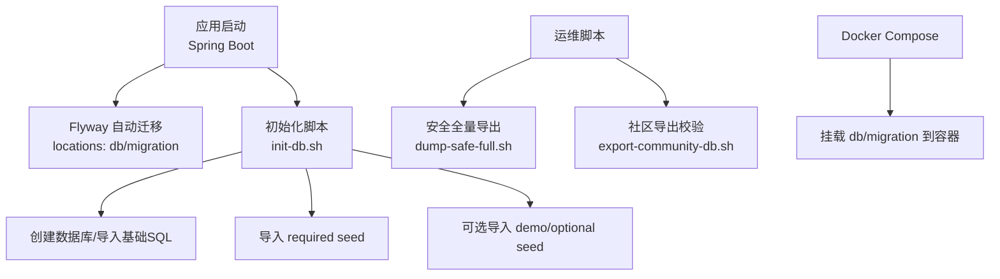
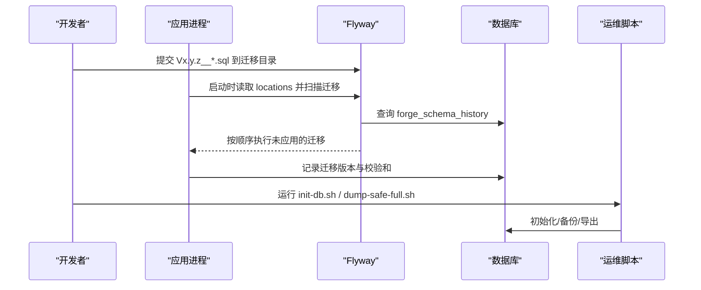
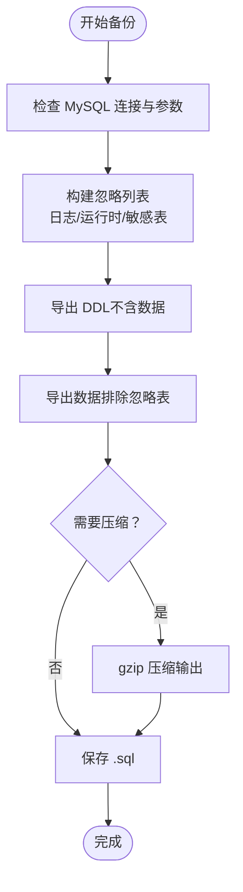
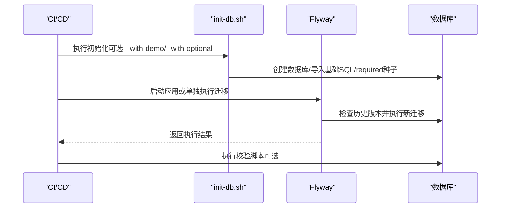
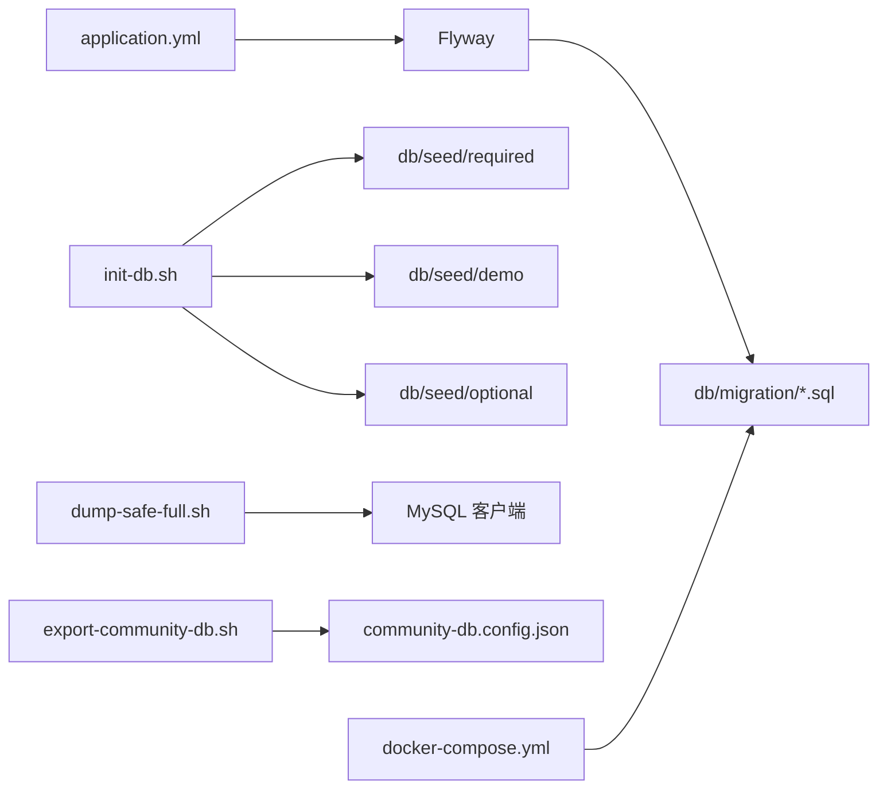

# 数据库迁移管理

<cite>
**本文引用的文件**
- [application.yml](file://forge-server/forge-admin-server/src/main/resources/application.yml)
- [README.md](file://forge-server/db/README.md)
- [V1.0.0__baseline.sql](file://forge-server/db/migration/V1.0.0__baseline.sql)
- [V1.0.1__add_org_scoped_role_permission.sql](file://forge-server/db/migration/V1.0.1__add_org_scoped_role_permission.sql)
- [init-db.sh](file://forge-server/scripts/db/init-db.sh)
- [dump-safe-full.sh](file://forge-server/scripts/db/dump-safe-full.sh)
- [export-community-db.sh](file://forge-server/scripts/db/export-community-db.sh)
- [export-community-schema.js](file://forge-server/scripts/db/export-community-schema.js)
- [community-db.config.json](file://forge-server/scripts/db/community-db.config.json)
- [docker-compose.yml](file://docker-forge-admin/docker-compose.yml)
</cite>

## 目录
1. [简介](#简介)
2. [项目结构](#项目结构)
3. [核心组件](#核心组件)
4. [架构总览](#架构总览)
5. [详细组件分析](#详细组件分析)
6. [依赖关系分析](#依赖关系分析)
7. [性能考虑](#性能考虑)
8. [故障排查指南](#故障排查指南)
9. [结论](#结论)
10. [附录](#附录)

## 简介
本文件面向 Forge Admin 的数据库迁移与版本化管理，围绕 Flyway 的版本控制机制、迁移脚本规范、多环境配置、备份恢复策略、执行流程与最佳实践进行系统化说明。文档同时提供可操作的运维命令与流程图示，帮助团队在开发、测试、生产环境中安全、可控地推进数据库变更。

## 项目结构
Forge Admin 将数据库迁移与数据初始化分离为清晰的目录与脚本：
- 迁移脚本：forge-server/db/migration（Flyway 管理的版本化 DDL/DML）
- 种子数据：forge-server/db/seed（required/demo/optional 三类初始化数据）
- 初始化脚本：forge-server/scripts/db/init-db.sh（一键建库并导入必要数据）
- 备份导出：forge-server/scripts/db/dump-safe-full.sh（安全全量导出）
- 社区导出：forge-server/scripts/db/export-community-db.sh（校验并导出迁移与种子）
- 应用配置：forge-server/forge-admin-server/src/main/resources/application.yml（Flyway 开关、位置、基线等）
- 容器挂载：docker-forge-admin/docker-compose.yml（将 db/migration 挂载到容器内路径）

图表来源
- [application.yml:65-72](file://forge-server/forge-admin-server/src/main/resources/application.yml#L65-L72)
- [init-db.sh:93-133](file://forge-server/scripts/db/init-db.sh#L93-L133)
- [dump-safe-full.sh:219-455](file://forge-server/scripts/db/dump-safe-full.sh#L219-L455)
- [export-community-db.sh:21-35](file://forge-server/scripts/db/export-community-db.sh#L21-L35)
- [docker-compose.yml:87-133](file://docker-forge-admin/docker-compose.yml#L87-L133)

章节来源
- [application.yml:65-72](file://forge-server/forge-admin-server/src/main/resources/application.yml#L65-L72)
- [README.md:129-165](file://forge-server/db/README.md#L129-L165)
- [init-db.sh:16-133](file://forge-server/scripts/db/init-db.sh#L16-L133)
- [dump-safe-full.sh:24-58](file://forge-server/scripts/db/dump-safe-full.sh#L24-L58)
- [export-community-db.sh:1-35](file://forge-server/scripts/db/export-community-db.sh#L1-L35)
- [docker-compose.yml:87-133](file://docker-forge-admin/docker-compose.yml#L87-L133)

## 核心组件
- Flyway 配置与基线
  - 启用方式：通过环境变量 FORGE_FLYWAY_ENABLED 控制是否开启自动迁移。
  - 扫描位置：支持多个 filesystem 路径，默认包含当前目录、上级目录以及 forge-server/db/migration。
  - 基线策略：baseline-on-migrate=true，baseline-version=1.0.0，历史结构由初始化脚本提供，新变更以版本化脚本追加。
  - 历史记录表：使用自定义表名 forge_schema_history。
- 迁移脚本目录与命名
  - 目录：forge-server/db/migration
  - 命名：V主版本.次版本.修订版本__描述.sql（例如 V1.0.1__xxx.sql）
  - 基线脚本：V1.0.0__baseline.sql 仅声明基线，实际结构来自初始化 SQL。
- 种子数据与初始化
  - required：系统必需数据，随 init-db.sh 默认导入。
  - demo：演示数据，需显式 --with-demo。
  - optional：可选模块数据，需显式 --with-optional。
- 备份与导出
  - 安全全量导出：dump-safe-full.sh 生成包含 DDL 与安全 INSERT 的 SQL，默认跳过日志/运行时/敏感表数据，支持 gzip、dry-run、忽略规则。
  - 社区导出：export-community-db.sh 调用 schema/seed 导出与敏感数据检查，输出摘要。

章节来源
- [application.yml:65-72](file://forge-server/forge-admin-server/src/main/resources/application.yml#L65-L72)
- [README.md:129-165](file://forge-server/db/README.md#L129-L165)
- [V1.0.0__baseline.sql:1-4](file://forge-server/db/migration/V1.0.0__baseline.sql#L1-L4)
- [V1.0.1__add_org_scoped_role_permission.sql:1-94](file://forge-server/db/migration/V1.0.1__add_org_scoped_role_permission.sql#L1-L94)
- [init-db.sh:93-133](file://forge-server/scripts/db/init-db.sh#L93-L133)
- [dump-safe-full.sh:219-455](file://forge-server/scripts/db/dump-safe-full.sh#L219-L455)
- [export-community-db.sh:21-35](file://forge-server/scripts/db/export-community-db.sh#L21-L35)

## 架构总览
下图展示应用启动时 Flyway 与初始化脚本的协作关系，以及运维脚本对迁移与数据的保障。

图表来源
- [application.yml:65-72](file://forge-server/forge-admin-server/src/main/resources/application.yml#L65-L72)
- [init-db.sh:93-133](file://forge-server/scripts/db/init-db.sh#L93-L133)
- [dump-safe-full.sh:219-455](file://forge-server/scripts/db/dump-safe-full.sh#L219-L455)

## 详细组件分析

### Flyway 版本控制与回滚策略
- 版本控制
  - 版本号：采用语义化三段式（主.次.修），严格递增，禁止复用。
  - 不可变性：已落库的脚本内容禁止修改；修正必须新增更高版本。
  - 基线：baseline-on-migrate=true，baseline-version=1.0.0，确保存量库能平滑接入版本化迁移。
- 回滚策略
  - 仓库未提供 flyway.undo 或 R 前缀回滚脚本；建议通过“正向修复”的方式演进，即新增更高版本脚本实现目标状态。
  - 若需回滚，优先基于备份恢复或使用导出脚本重建目标版本。
- 校验与失败处理
  - 校验失败常见原因：脚本被修改导致 checksum 不一致；本地与线上版本不同步。
  - 建议：CI 中强制校验迁移命名与内容一致性；发布前 dry-run 验证。

章节来源
- [application.yml:65-72](file://forge-server/forge-admin-server/src/main/resources/application.yml#L65-L72)
- [README.md:166-196](file://forge-server/db/README.md#L166-L196)
- [V1.0.0__baseline.sql:1-4](file://forge-server/db/migration/V1.0.0__baseline.sql#L1-L4)

### 迁移脚本编写规范
- 命名规范
  - 格式：V主版本.次版本.修订版本__描述.sql
  - 字符限制：小写英文、数字、下划线；避免中文文件名。
- DDL 标准
  - 新建表需包含框架标准字段（如租户、审计字段等）。
  - 索引设计：为高频查询列建立合适索引，避免过度索引。
  - 字符集与排序规则：统一 utf8mb4，注意 collation 一致性。
- DML 数据处理
  - 幂等性：INSERT 使用 SELECT ... WHERE NOT EXISTS 或条件判断，避免重复插入。
  - 数据迁移：跨表更新需考虑事务与锁，尽量分批处理大表。
- 数据校验脚本
  - 建议在关键变更后添加校验步骤（如计数、范围、唯一性），可在 CI 或发布后任务中执行。
- 示例参考
  - 基线脚本：V1.0.0__baseline.sql
  - 增量脚本：V1.0.1__add_org_scoped_role_permission.sql（含建表与幂等插入）

章节来源
- [README.md:166-196](file://forge-server/db/README.md#L166-L196)
- [V1.0.0__baseline.sql:1-4](file://forge-server/db/migration/V1.0.0__baseline.sql#L1-L4)
- [V1.0.1__add_org_scoped_role_permission.sql:1-94](file://forge-server/db/migration/V1.0.1__add_org_scoped_role_permission.sql#L1-L94)

### 多环境迁移管理
- 开发/测试/生产差异
  - 通过环境变量控制 Flyway 开关与扫描路径：FORGE_FLYWAY_ENABLED、FORGE_FLYWAY_LOCATIONS。
  - 容器化部署：docker-compose 将 db/migration 挂载至容器内路径，保证各环境一致。
- 推荐做法
  - 开发环境：可开启自动迁移便于快速迭代。
  - 测试/生产环境：建议关闭自动迁移，改为流水线手动触发或受控执行，降低误操作风险。
  - 使用独立数据库实例与环境变量隔离配置。

章节来源
- [application.yml:65-72](file://forge-server/forge-admin-server/src/main/resources/application.yml#L65-L72)
- [docker-compose.yml:87-133](file://docker-forge-admin/docker-compose.yml#L87-L133)

### 备份恢复策略
- 全量备份
  - 工具：dump-safe-full.sh
  - 特点：
    - 输出单一 SQL，包含 DDL 与安全 INSERT 数据。
    - 默认跳过日志/运行时/敏感表数据，可通过参数调整。
    - 支持 gzip 压缩、dry-run 预览、忽略规则扩展。
- 增量备份
  - 仓库未提供专用增量备份脚本；建议结合数据库 binlog 或云厂商增量能力实现。
- 数据导出导入
  - 社区导出：export-community-db.sh 用于导出迁移与种子并做敏感数据检查，适用于社区版分发。
  - 导入：mysql < database.sql 或应用启动时由 Flyway 执行迁移。

图表来源
- [dump-safe-full.sh:219-455](file://forge-server/scripts/db/dump-safe-full.sh#L219-L455)

章节来源
- [dump-safe-full.sh:24-58](file://forge-server/scripts/db/dump-safe-full.sh#L24-L58)
- [dump-safe-full.sh:219-455](file://forge-server/scripts/db/dump-safe-full.sh#L219-L455)
- [export-community-db.sh:21-35](file://forge-server/scripts/db/export-community-db.sh#L21-L35)

### 迁移执行流程
- 自动化部署
  - 应用启动时 Flyway 根据 locations 扫描并执行未应用的迁移。
  - 可通过环境变量控制开关与路径，适配不同环境。
- 手动执行
  - 初始化：init-db.sh 创建数据库并导入 required 种子数据，支持 demo/optional 选项。
  - 社区导出：export-community-db.sh 校验并导出迁移与种子，生成摘要。
- 错误处理与重试
  - 脚本均设置 set -euo pipefail，遇错立即退出，便于 CI 捕获。
  - 建议：在流水线中增加重试与告警，失败时回滚到上一稳定版本。

图表来源
- [init-db.sh:93-133](file://forge-server/scripts/db/init-db.sh#L93-L133)
- [application.yml:65-72](file://forge-server/forge-admin-server/src/main/resources/application.yml#L65-L72)

章节来源
- [init-db.sh:16-133](file://forge-server/scripts/db/init-db.sh#L16-L133)
- [application.yml:65-72](file://forge-server/forge-admin-server/src/main/resources/application.yml#L65-L72)

### 数据迁移最佳实践
- 零停机迁移
  - 先加字段/索引，再改代码逻辑，最后删除旧字段/索引，分阶段推进。
  - 大表变更分批执行，避免长时间锁表。
- 数据一致性保证
  - 所有 DML 具备幂等性；复杂变更使用事务包裹。
  - 变更前后进行数据校验（计数、范围、关联完整性）。
- 迁移验证方法
  - 本地/测试环境先行验证；CI 中执行 dry-run 与敏感数据检查。
  - 发布后执行健康检查与业务回归用例。

[本节为通用实践指导，不直接分析具体文件]

## 依赖关系分析
- 应用与 Flyway
  - application.yml 定义 Flyway 开关、扫描路径、基线与历史表。
- 脚本与目录
  - init-db.sh 依赖 db/seed/required 与可选目录。
  - dump-safe-full.sh 依赖 mysqldump/mysql 客户端与数据库权限。
  - export-community-db.sh 依赖 Node.js 与 community-db.config.json。
- 容器与挂载
  - docker-compose.yml 将 db/migration 挂载到容器内路径，确保应用能读取迁移脚本。

图表来源
- [application.yml:65-72](file://forge-server/forge-admin-server/src/main/resources/application.yml#L65-L72)
- [init-db.sh:93-133](file://forge-server/scripts/db/init-db.sh#L93-L133)
- [dump-safe-full.sh:219-455](file://forge-server/scripts/db/dump-safe-full.sh#L219-L455)
- [export-community-db.sh:21-35](file://forge-server/scripts/db/export-community-db.sh#L21-L35)
- [community-db.config.json:1-47](file://forge-server/scripts/db/community-db.config.json#L1-L47)
- [docker-compose.yml:87-133](file://docker-forge-admin/docker-compose.yml#L87-L133)

章节来源
- [application.yml:65-72](file://forge-server/forge-admin-server/src/main/resources/application.yml#L65-L72)
- [community-db.config.json:1-47](file://forge-server/scripts/db/community-db.config.json#L1-L47)
- [docker-compose.yml:87-133](file://docker-forge-admin/docker-compose.yml#L87-L133)

## 性能考虑
- 迁移脚本
  - 避免在大表上频繁 DDL；必要时分批处理。
  - 合理使用索引与统计信息，减少全表扫描。
- 备份导出
  - 使用单事务与 skip-lock-tables 提升导出稳定性与并发友好性。
  - 对大库启用 gzip 压缩以减少存储与传输成本。
- 应用启动
  - 生产环境建议关闭自动迁移，改为流水线受控执行，缩短启动时间。

[本节为通用性能指导，不直接分析具体文件]

## 故障排查指南
- Flyway 校验失败
  - 现象：checksum mismatch 或版本冲突。
  - 排查：确认脚本未被修改；核对本地与线上版本；查看 forge_schema_history。
- 初始化失败
  - 现象：init-db.sh 报错退出。
  - 排查：检查 mysql 客户端、网络连通、权限与字符集；查看脚本输出定位失败语句。
- 备份导出异常
  - 现象：mysqldump 错误或输出为空。
  - 排查：确认 mysqldump 可用、SSL 模式、忽略规则是否正确；使用 --dry-run 预览。
- 社区导出校验失败
  - 现象：敏感数据检查失败。
  - 排查：依据 community-db.config.json 中的敏感字段与模式，清理或过滤敏感数据。

章节来源
- [application.yml:65-72](file://forge-server/forge-admin-server/src/main/resources/application.yml#L65-L72)
- [init-db.sh:83-133](file://forge-server/scripts/db/init-db.sh#L83-L133)
- [dump-safe-full.sh:167-180](file://forge-server/scripts/db/dump-safe-full.sh#L167-L180)
- [community-db.config.json:24-45](file://forge-server/scripts/db/community-db.config.json#L24-L45)

## 结论
Forge Admin 通过 Flyway 实现了严格的数据库版本化管理，配合清晰的分层目录与脚本，形成了从初始化、迁移、备份到导出的完整闭环。遵循“不可变迁移、幂等数据、分阶段演进”的原则，可以在多环境下安全高效地推进数据库变更。建议在生产环境关闭自动迁移，采用流水线受控执行，并结合备份与校验机制，确保变更的可追溯性与可恢复性。

## 附录
- 常用命令
  - 初始化数据库：bash forge/scripts/db/init-db.sh --database forge_admin --user root --password your_password
  - 导入演示数据：在上述命令追加 --with-demo
  - 导入可选模块：在上述命令追加 --with-optional
  - 安全全量备份：bash forge/scripts/db/dump-safe-full.sh --host 127.0.0.1 --port 3306 --database forge_admin_new --user root --ssl-mode REQUIRED
  - 社区导出校验：bash forge/scripts/db/export-community-db.sh --dry-run
  - 正式导出：bash forge/scripts/db/export-community-db.sh

章节来源
- [README.md:350-410](file://forge-server/db/README.md#L350-L410)
- [init-db.sh:16-133](file://forge-server/scripts/db/init-db.sh#L16-L133)
- [dump-safe-full.sh:24-58](file://forge-server/scripts/db/dump-safe-full.sh#L24-L58)
- [export-community-db.sh:1-35](file://forge-server/scripts/db/export-community-db.sh#L1-L35)