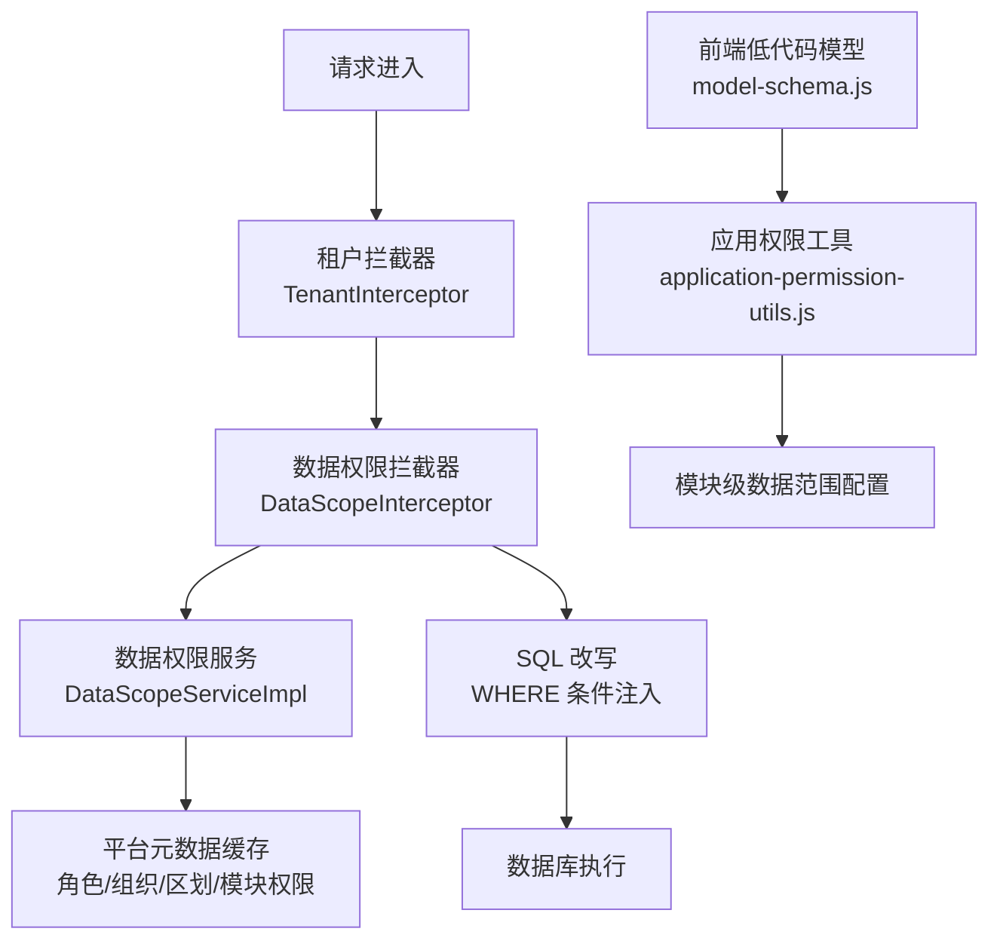
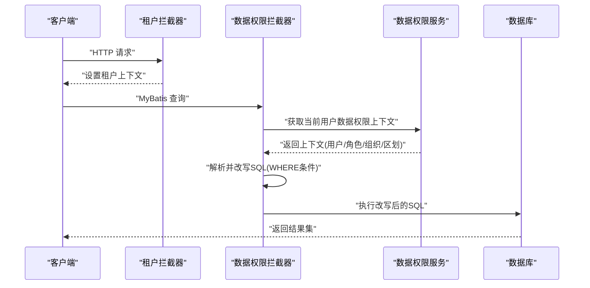
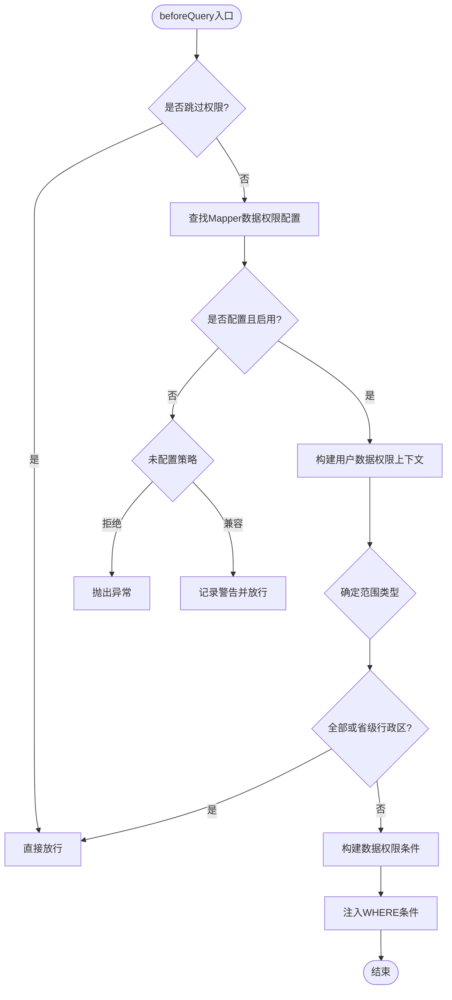
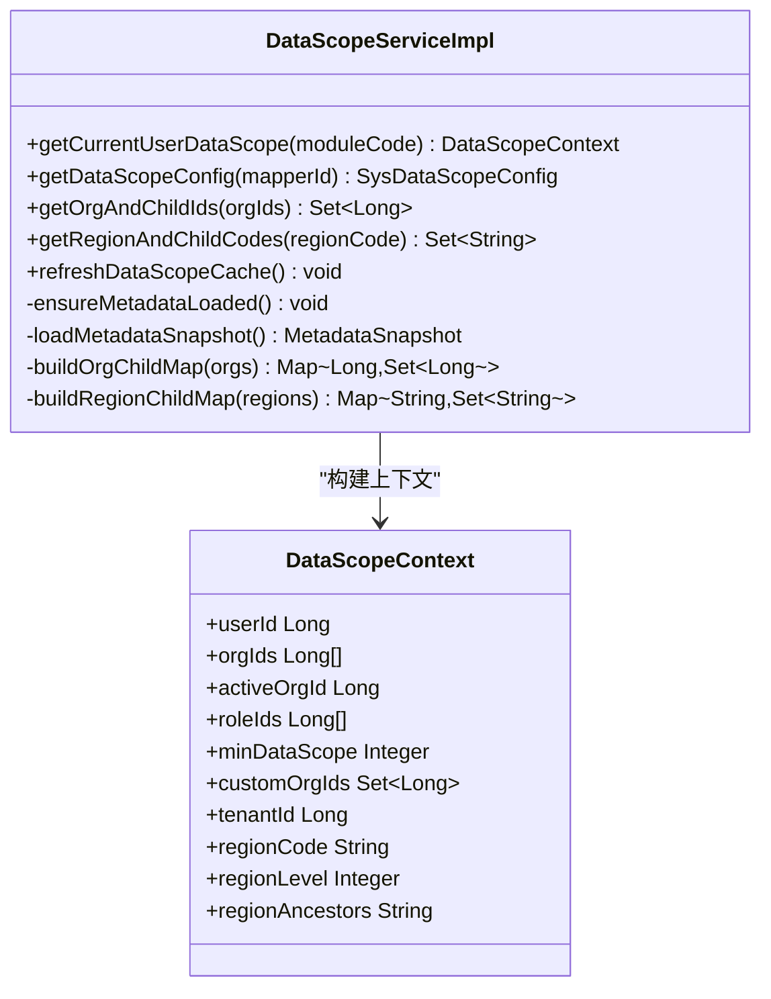
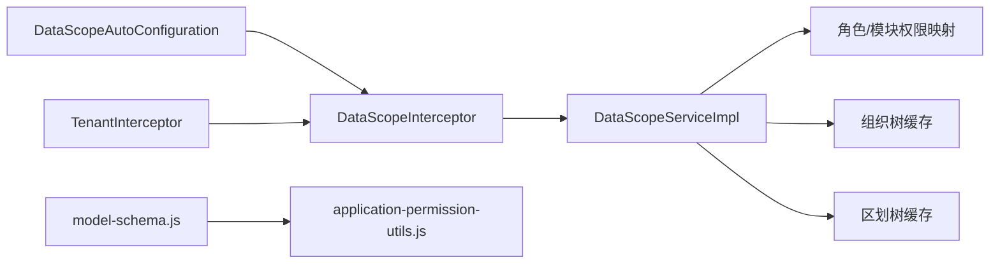

# 数据权限控制

<cite>
**本文引用的文件**
- [DataScopeInterceptor.java](file://forge-server/forge-framework/forge-starter-parent/forge-starter-datascope/src/main/java/com/mdframe/forge/starter/datascope/handler/DataScopeInterceptor.java)
- [DataScopeType.java](file://forge-server/forge-framework/forge-starter-parent/forge-starter-datascope/src/main/java/com/mdframe/forge/starter/datascope/enums/DataScopeType.java)
- [DataScopeAutoConfiguration.java](file://forge-server/forge-framework/forge-starter-parent/forge-starter-datascope/src/main/java/com/mdframe/forge/starter/datascope/config/DataScopeAutoConfiguration.java)
- [DataScopeContext.java](file://forge-server/forge-framework/forge-starter-parent/forge-starter-datascope/src/main/java/com/mdframe/forge/starter/datascope/context/DataScopeContext.java)
- [DataScopeServiceImpl.java](file://forge-server/forge-framework/forge-starter-parent/forge-starter-datascope/src/main/java/com/mdframe/forge/starter/datascope/service/impl/DataScopeServiceImpl.java)
- [TenantInterceptor.java](file://forge-server/forge-framework/forge-starter-parent/forge-starter-tenant/src/main/java/com/mdframe/forge/starter/tenant/interceptor/TenantInterceptor.java)
- [DataDatasetRowScopeServiceImpl.java](file://forge-server/forge-framework/forge-plugin-parent/forge-plugin-data/src/main/java/com/mdframe/forge/plugin/data/service/impl/DataDatasetRowScopeServiceImpl.java)
- [model-schema.js](file://forge-admin-ui/src/components/lowcode-builder/model/model-schema.js)
- [application-permission-utils.js](file://forge-admin-ui/src/views/app-center/application-permission-utils.js)
</cite>

## 目录
1. [简介](#简介)
2. [项目结构](#项目结构)
3. [核心组件](#核心组件)
4. [架构总览](#架构总览)
5. [详细组件分析](#详细组件分析)
6. [依赖关系分析](#依赖关系分析)
7. [性能考量](#性能考量)
8. [故障排查指南](#故障排查指南)
9. [结论](#结论)
10. [附录：配置与测试要点](#附录：配置与测试要点)

## 简介
本文件面向 Forge Admin 的数据权限控制，系统性阐述以下能力：
- 租户隔离机制：通过请求级拦截器注入租户上下文，并在数据权限服务中优先从主库（或指定元数据源）加载平台元数据快照，避免跨库访问风险。
- 行级权限过滤：基于 MyBatis-Plus InnerInterceptor 在 SQL 执行前解析并改写 SELECT 语句，按角色/组织/租户/行政区划等维度动态追加 WHERE 条件。
- 字段级权限控制：低代码模型层提供 dataScope 归一化与策略字段解析，用于前端与后端协同的可见性、可编辑性与导出范围控制。
- DataScope 注解与配置：通过 Mapper 方法维度的数据权限配置（表别名、租户/用户/组织/区划字段），结合运行时上下文生成安全 SQL。
- 基于角色的数据权限模型：支持全部、本人、本组织、本组织及子组织、自定义组织集合、租户全部、行政区划等多类型；模块级覆盖与最小权限收敛。
- 多租户数据隔离：会话/请求级租户注入、忽略标记、工作区租户策略与平台元数据缓存。
- 部门级数据权限：组织架构树遍历、上下级关系判断、数据范围计算（含祖先链与下级集合）。
- 复杂业务场景：跨租户访问、临时授权、审计日志等实践建议与注意事项。

## 项目结构
数据权限相关代码主要分布在以下模块：
- 数据权限启动器：自动装配、拦截器注册、属性配置、上下文与枚举定义。
- 数据权限服务：当前用户数据权限上下文构建、角色/组织/区划/模块权限聚合、平台元数据缓存。
- 租户拦截器：请求级租户上下文注入与清理。
- 数据集行级权限：针对数据集查询的额外行级过滤（如数据集维度下的范围判定）。
- 前端低代码模型：dataScope 归一化与策略字段解析，配合应用权限工具进行模块级数据范围设置。

图表来源
- [TenantInterceptor.java:28-109](file://forge-server/forge-framework/forge-starter-parent/forge-starter-tenant/src/main/java/com/mdframe/forge/starter/tenant/interceptor/TenantInterceptor.java#L28-L109)
- [DataScopeInterceptor.java:69-155](file://forge-server/forge-framework/forge-starter-parent/forge-starter-datascope/src/main/java/com/mdframe/forge/starter/datascope/handler/DataScopeInterceptor.java#L69-L155)
- [DataScopeServiceImpl.java:84-157](file://forge-server/forge-framework/forge-starter-parent/forge-starter-datascope/src/main/java/com/mdframe/forge/starter/datascope/service/impl/DataScopeServiceImpl.java#L84-L157)
- [model-schema.js:281-317](file://forge-admin-ui/src/components/lowcode-builder/model/model-schema.js#L281-L317)
- [application-permission-utils.js:142-166](file://forge-admin-ui/src/views/app-center/application-permission-utils.js#L142-L166)

章节来源
- [DataScopeAutoConfiguration.java:17-41](file://forge-server/forge-framework/forge-starter-parent/forge-starter-datascope/src/main/java/com/mdframe/forge/starter/datascope/config/DataScopeAutoConfiguration.java#L17-L41)
- [TenantInterceptor.java:28-109](file://forge-server/forge-framework/forge-starter-parent/forge-starter-tenant/src/main/java/com/mdframe/forge/starter/tenant/interceptor/TenantInterceptor.java#L28-L109)
- [DataScopeInterceptor.java:69-155](file://forge-server/forge-framework/forge-starter-parent/forge-starter-datascope/src/main/java/com/mdframe/forge/starter/datascope/handler/DataScopeInterceptor.java#L69-L155)
- [DataScopeServiceImpl.java:84-157](file://forge-server/forge-framework/forge-starter-parent/forge-starter-datascope/src/main/java/com/mdframe/forge/starter/datascope/service/impl/DataScopeServiceImpl.java#L84-L157)
- [model-schema.js:281-317](file://forge-admin-ui/src/components/lowcode-builder/model/model-schema.js#L281-L317)
- [application-permission-utils.js:142-166](file://forge-admin-ui/src/views/app-center/application-permission-utils.js#L142-L166)

## 核心组件
- 数据权限拦截器：在 MyBatis-Plus 查询前拦截，根据 Mapper 配置与当前用户上下文，解析并改写 SQL，实现行级过滤。
- 数据权限服务：负责构建当前用户数据权限上下文（用户、组织、角色、租户、区划）、加载并缓存平台元数据（角色数据范围、组织树、区划树、模块覆盖）。
- 租户拦截器：从会话或请求头提取租户 ID，设置到上下文，并在请求结束时清理。
- 数据集行级权限服务：对数据集查询进行额外的行级条件构建，支持租户、组织、本人、区域等范围。
- 前端低代码模型与权限工具：归一化 dataScope、解析策略字段、生成模块级数据范围配置。

章节来源
- [DataScopeInterceptor.java:69-155](file://forge-server/forge-framework/forge-starter-parent/forge-starter-datascope/src/main/java/com/mdframe/forge/starter/datascope/handler/DataScopeInterceptor.java#L69-L155)
- [DataScopeServiceImpl.java:84-157](file://forge-server/forge-framework/forge-starter-parent/forge-starter-datascope/src/main/java/com/mdframe/forge/starter/datascope/service/impl/DataScopeServiceImpl.java#L84-L157)
- [TenantInterceptor.java:28-109](file://forge-server/forge-framework/forge-starter-parent/forge-starter-tenant/src/main/java/com/mdframe/forge/starter/tenant/interceptor/TenantInterceptor.java#L28-L109)
- [DataDatasetRowScopeServiceImpl.java:58-125](file://forge-server/forge-framework/forge-plugin-parent/forge-plugin-data/src/main/java/com/mdframe/forge/plugin/data/service/impl/DataDatasetRowScopeServiceImpl.java#L58-L125)
- [model-schema.js:281-317](file://forge-admin-ui/src/components/lowcode-builder/model/model-schema.js#L281-L317)
- [application-permission-utils.js:142-166](file://forge-admin-ui/src/views/app-center/application-permission-utils.js#L142-L166)

## 架构总览
数据权限整体流程如下：
- 请求进入后，先由租户拦截器建立租户上下文。
- 数据权限拦截器在 SQL 执行前检查是否跳过、是否已配置、是否启用。
- 数据权限服务根据登录态与角色/模块配置计算最小数据范围，并填充组织、区划等信息。
- 拦截器根据范围类型生成对应 SQL 条件（等值、IN、OR 组合、自定义模板），并通过 JSqlParser 注入到原查询。
- 前端低代码模型与应用权限工具协同完成模块级数据范围配置与展示。

图表来源
- [TenantInterceptor.java:28-109](file://forge-server/forge-framework/forge-starter-parent/forge-starter-tenant/src/main/java/com/mdframe/forge/starter/tenant/interceptor/TenantInterceptor.java#L28-L109)
- [DataScopeInterceptor.java:69-155](file://forge-server/forge-framework/forge-starter-parent/forge-starter-datascope/src/main/java/com/mdframe/forge/starter/datascope/handler/DataScopeInterceptor.java#L69-L155)
- [DataScopeServiceImpl.java:84-157](file://forge-server/forge-framework/forge-starter-parent/forge-starter-datascope/src/main/java/com/mdframe/forge/starter/datascope/service/impl/DataScopeServiceImpl.java#L84-L157)

## 详细组件分析

### 数据权限拦截器（DataScopeInterceptor）
- 职责：在 MyBatis-Plus 查询前拦截，依据 Mapper 配置与用户上下文，将数据权限条件注入到 SELECT 的 WHERE 子句。
- 关键点：
  - 支持跳过标记（后台任务等场景）。
  - 处理分页 count 查询，定位真正需要改写的子查询。
  - 根据范围类型生成等值、IN、OR 组合或自定义 SQL 表达式。
  - 使用 JSqlParser 解析 SQL 并安全注入条件。
  - 未配置或禁用时的策略：严格拒绝或兼容放行。

图表来源
- [DataScopeInterceptor.java:69-155](file://forge-server/forge-framework/forge-starter-parent/forge-starter-datascope/src/main/java/com/mdframe/forge/starter/datascope/handler/DataScopeInterceptor.java#L69-L155)
- [DataScopeInterceptor.java:176-207](file://forge-server/forge-framework/forge-starter-parent/forge-starter-datascope/src/main/java/com/mdframe/forge/starter/datascope/handler/DataScopeInterceptor.java#L176-L207)
- [DataScopeInterceptor.java:232-287](file://forge-server/forge-framework/forge-starter-parent/forge-starter-datascope/src/main/java/com/mdframe/forge/starter/datascope/handler/DataScopeInterceptor.java#L232-L287)

章节来源
- [DataScopeInterceptor.java:69-155](file://forge-server/forge-framework/forge-starter-parent/forge-starter-datascope/src/main/java/com/mdframe/forge/starter/datascope/handler/DataScopeInterceptor.java#L69-L155)
- [DataScopeInterceptor.java:176-207](file://forge-server/forge-framework/forge-starter-parent/forge-starter-datascope/src/main/java/com/mdframe/forge/starter/datascope/handler/DataScopeInterceptor.java#L176-L207)
- [DataScopeInterceptor.java:232-287](file://forge-server/forge-framework/forge-starter-parent/forge-starter-datascope/src/main/java/com/mdframe/forge/starter/datascope/handler/DataScopeInterceptor.java#L232-L287)
- [DataScopeInterceptor.java:289-460](file://forge-server/forge-framework/forge-starter-parent/forge-starter-datascope/src/main/java/com/mdframe/forge/starter/datascope/handler/DataScopeInterceptor.java#L289-L460)
- [DataScopeInterceptor.java:462-598](file://forge-server/forge-framework/forge-starter-parent/forge-starter-datascope/src/main/java/com/mdframe/forge/starter/datascope/handler/DataScopeInterceptor.java#L462-L598)

### 数据权限服务（DataScopeServiceImpl）
- 职责：构建当前用户数据权限上下文，加载并缓存平台元数据（角色数据范围、组织树、区划树、模块覆盖），提供组织/区划范围计算。
- 关键点：
  - 管理员/租户管理员/无角色用户的默认范围处理。
  - 模块级数据范围覆盖（moduleCode -> scope）。
  - 组织祖先链与下级集合缓存，提升性能。
  - 区划编码与下级集合缓存，避免重复解析。
  - 元数据源切换：在主库或指定元数据源加载 sys_* 平台表，避免业务库切分导致的安全问题。

图表来源
- [DataScopeServiceImpl.java:84-157](file://forge-server/forge-framework/forge-starter-parent/forge-starter-datascope/src/main/java/com/mdframe/forge/starter/datascope/service/impl/DataScopeServiceImpl.java#L84-L157)
- [DataScopeServiceImpl.java:237-282](file://forge-server/forge-framework/forge-starter-parent/forge-starter-datascope/src/main/java/com/mdframe/forge/starter/datascope/service/impl/DataScopeServiceImpl.java#L237-L282)
- [DataScopeServiceImpl.java:358-389](file://forge-server/forge-framework/forge-starter-parent/forge-starter-datascope/src/main/java/com/mdframe/forge/starter/datascope/service/impl/DataScopeServiceImpl.java#L358-L389)
- [DataScopeContext.java:10-67](file://forge-server/forge-framework/forge-starter-parent/forge-starter-datascope/src/main/java/com/mdframe/forge/starter/datascope/context/DataScopeContext.java#L10-L67)

章节来源
- [DataScopeServiceImpl.java:84-157](file://forge-server/forge-framework/forge-starter-parent/forge-starter-datascope/src/main/java/com/mdframe/forge/starter/datascope/service/impl/DataScopeServiceImpl.java#L84-L157)
- [DataScopeServiceImpl.java:237-282](file://forge-server/forge-framework/forge-starter-parent/forge-starter-datascope/src/main/java/com/mdframe/forge/starter/datascope/service/impl/DataScopeServiceImpl.java#L237-L282)
- [DataScopeServiceImpl.java:358-389](file://forge-server/forge-framework/forge-starter-parent/forge-starter-datascope/src/main/java/com/mdframe/forge/starter/datascope/service/impl/DataScopeServiceImpl.java#L358-L389)
- [DataScopeContext.java:10-67](file://forge-server/forge-framework/forge-starter-parent/forge-starter-datascope/src/main/java/com/mdframe/forge/starter/datascope/context/DataScopeContext.java#L10-L67)

### 租户拦截器（TenantInterceptor）
- 职责：从会话或请求头提取租户 ID，设置到上下文；支持忽略标记与工作区租户策略；请求结束后清理上下文。
- 关键点：
  - 支持 @IgnoreTenant 注解与方法/类级别忽略。
  - Capability OAuth/OpenAPI 入口跳过租户设置。
  - 超级管理员也按 Session 租户隔离业务表。

章节来源
- [TenantInterceptor.java:28-109](file://forge-server/forge-framework/forge-starter-parent/forge-starter-tenant/src/main/java/com/mdframe/forge/starter/tenant/interceptor/TenantInterceptor.java#L28-L109)
- [TenantInterceptor.java:111-122](file://forge-server/forge-framework/forge-starter-parent/forge-starter-tenant/src/main/java/com/mdframe/forge/starter/tenant/interceptor/TenantInterceptor.java#L111-L122)
- [TenantInterceptor.java:129-136](file://forge-server/forge-framework/forge-starter-parent/forge-starter-tenant/src/main/java/com/mdframe/forge/starter/tenant/interceptor/TenantInterceptor.java#L129-L136)

### 数据集行级权限（DataDatasetRowScopeServiceImpl）
- 职责：为数据集查询构建行级条件，支持租户、组织、本人、区域等范围；管理员或全量范围时禁用过滤。
- 关键点：
  - 根据登录用户角色与数据集配置决定范围类型。
  - 构造 AND 条件并绑定参数（如租户列）。

章节来源
- [DataDatasetRowScopeServiceImpl.java:58-125](file://forge-server/forge-framework/forge-plugin-parent/forge-plugin-data/src/main/java/com/mdframe/forge/plugin/data/service/impl/DataDatasetRowScopeServiceImpl.java#L58-L125)

### 前端低代码模型与权限工具
- model-schema.js：归一化 dataScope（如 SYSTEM_DATA_SCOPE -> FOLLOW_SYSTEM），解析策略字段映射。
- application-permission-utils.js：构建与应用的模块级数据范围设置，支持默认范围与模块覆盖。

章节来源
- [model-schema.js:281-317](file://forge-admin-ui/src/components/lowcode-builder/model/model-schema.js#L281-L317)
- [application-permission-utils.js:142-166](file://forge-admin-ui/src/views/app-center/application-permission-utils.js#L142-L166)

## 依赖关系分析
- 自动装配：数据权限自动配置类以最高优先级注册拦截器 Bean，等待 MyBatis-Plus 统一注册。
- 拦截器链：租户拦截器先于数据权限拦截器执行，确保 SQL 改写时租户上下文可用。
- 服务依赖：数据权限服务依赖角色、组织、区划、模块权限映射，以及平台元数据源。
- 前端依赖：低代码模型与权限工具共同维护模块级数据范围配置，影响后端行为。

图表来源
- [DataScopeAutoConfiguration.java:17-41](file://forge-server/forge-framework/forge-starter-parent/forge-starter-datascope/src/main/java/com/mdframe/forge/starter/datascope/config/DataScopeAutoConfiguration.java#L17-L41)
- [DataScopeInterceptor.java:69-155](file://forge-server/forge-framework/forge-starter-parent/forge-starter-datascope/src/main/java/com/mdframe/forge/starter/datascope/handler/DataScopeInterceptor.java#L69-L155)
- [DataScopeServiceImpl.java:237-282](file://forge-server/forge-framework/forge-starter-parent/forge-starter-datascope/src/main/java/com/mdframe/forge/starter/datascope/service/impl/DataScopeServiceImpl.java#L237-L282)
- [TenantInterceptor.java:28-109](file://forge-server/forge-framework/forge-starter-parent/forge-starter-tenant/src/main/java/com/mdframe/forge/starter/tenant/interceptor/TenantInterceptor.java#L28-L109)
- [model-schema.js:281-317](file://forge-admin-ui/src/components/lowcode-builder/model/model-schema.js#L281-L317)
- [application-permission-utils.js:142-166](file://forge-admin-ui/src/views/app-center/application-permission-utils.js#L142-L166)

章节来源
- [DataScopeAutoConfiguration.java:17-41](file://forge-server/forge-framework/forge-starter-parent/forge-starter-datascope/src/main/java/com/mdframe/forge/starter/datascope/config/DataScopeAutoConfiguration.java#L17-L41)
- [DataScopeServiceImpl.java:237-282](file://forge-server/forge-framework/forge-starter-parent/forge-starter-datascope/src/main/java/com/mdframe/forge/starter/datascope/service/impl/DataScopeServiceImpl.java#L237-L282)

## 性能考量
- 元数据缓存：角色数据范围、组织祖先链、区划下级集合均缓存至内存，避免每次请求重复查询。
- 懒加载与预热：应用启动时预热平台元数据，首次使用时快速响应。
- SQL 改写优化：仅对 SELECT 语句进行解析与改写，分页 count 查询定位到子查询以避免外层包裹导致的别名问题。
- 租户上下文清理：请求结束后清理租户上下文，防止内存泄漏。

[本节为通用性能指导，不直接分析具体文件]

## 故障排查指南
- 未配置数据权限：若未配置且策略为严格拒绝，将抛出异常；否则记录警告并放行。
- SQL 改写失败：当解析或注入条件异常时，记录错误并根据配置决定是否放行。
- 租户上下文缺失：未登录或公开协议入口可能跳过租户设置，需确认接口是否允许匿名访问。
- 组织/区划为空：当用户无组织或区划信息时，相应范围会强制无数据，需检查用户与角色配置。

章节来源
- [DataScopeInterceptor.java:157-171](file://forge-server/forge-framework/forge-starter-parent/forge-starter-datascope/src/main/java/com/mdframe/forge/starter/datascope/handler/DataScopeInterceptor.java#L157-L171)
- [DataScopeInterceptor.java:176-207](file://forge-server/forge-framework/forge-starter-parent/forge-starter-datascope/src/main/java/com/mdframe/forge/starter/datascope/handler/DataScopeInterceptor.java#L176-L207)
- [TenantInterceptor.java:62-109](file://forge-server/forge-framework/forge-starter-parent/forge-starter-tenant/src/main/java/com/mdframe/forge/starter/tenant/interceptor/TenantInterceptor.java#L62-L109)

## 结论
Forge Admin 的数据权限控制通过“租户上下文 + 数据权限拦截 + 平台元数据缓存”的组合，实现了灵活、安全、高性能的行级与字段级权限控制。其设计兼顾了多租户隔离、角色继承与模块覆盖、组织与区划层级计算，以及前端低代码模型的协同配置。在生产环境中，建议严格配置未命中策略、完善角色与组织数据、关注 SQL 改写日志与性能指标，并结合审计日志追踪权限变更与访问行为。

[本节为总结性内容，不直接分析具体文件]

## 附录：配置与测试要点
- 数据权限范围类型：
  - 全部、本人、本组织、本组织及子组织、自定义组织集合、租户全部、行政区划。
  - 历史编码兼容：角色数据范围新旧两套编码映射。
- 模块级覆盖：
  - 通过模块代码覆盖默认数据范围，支持前端构建与后端应用。
- 测试要点：
  - 验证未配置策略（拒绝/兼容）。
  - 验证分页 count 查询的 SQL 改写位置。
  - 验证管理员/租户管理员/无角色用户的默认范围。
  - 验证组织与区划范围计算的正确性。
  - 验证前端 lowcode 模型 dataScope 归一化与策略字段解析。

章节来源
- [DataScopeType.java:11-90](file://forge-server/forge-framework/forge-starter-parent/forge-starter-datascope/src/main/java/com/mdframe/forge/starter/datascope/enums/DataScopeType.java#L11-L90)
- [application-permission-utils.js:142-166](file://forge-admin-ui/src/views/app-center/application-permission-utils.js#L142-L166)
- [model-schema.js:281-317](file://forge-admin-ui/src/components/lowcode-builder/model/model-schema.js#L281-L317)