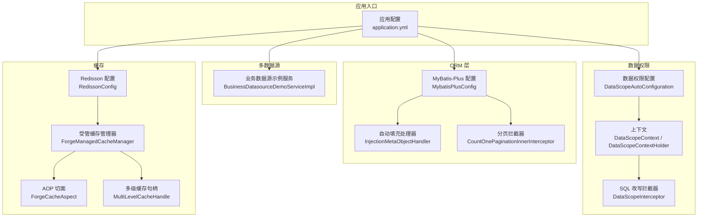
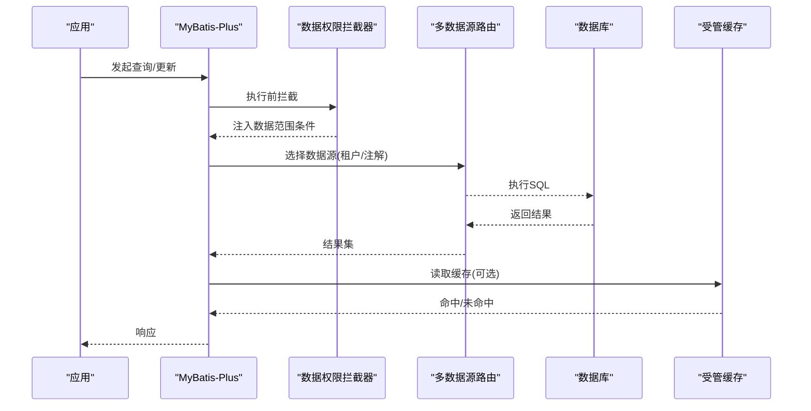
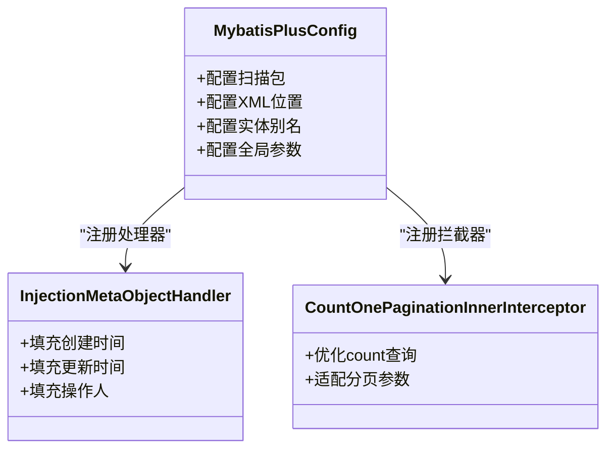
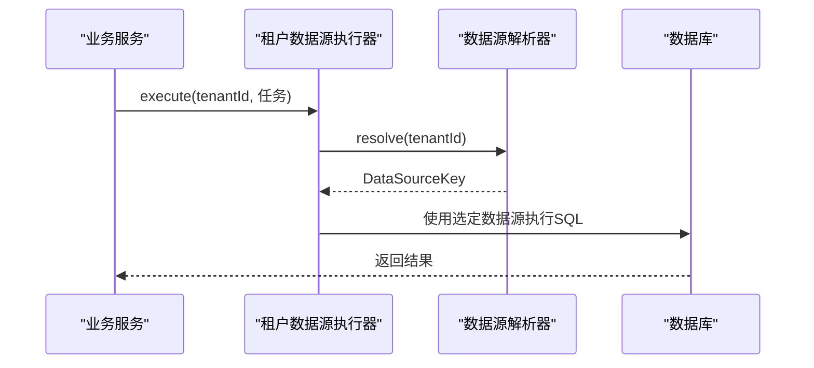
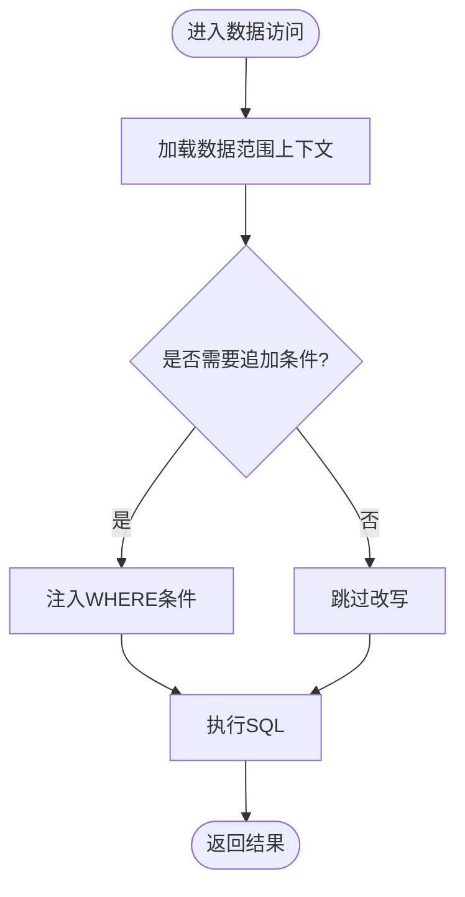
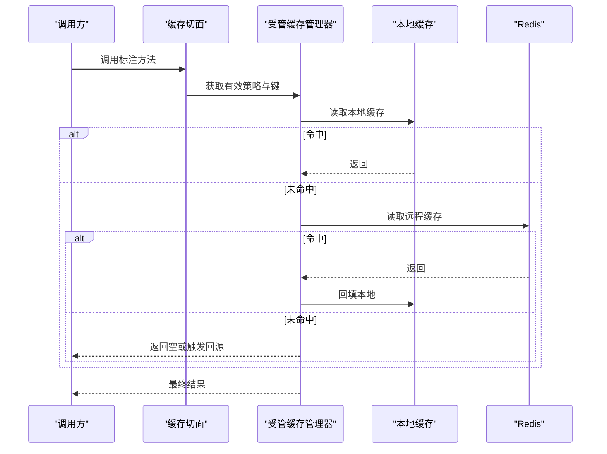
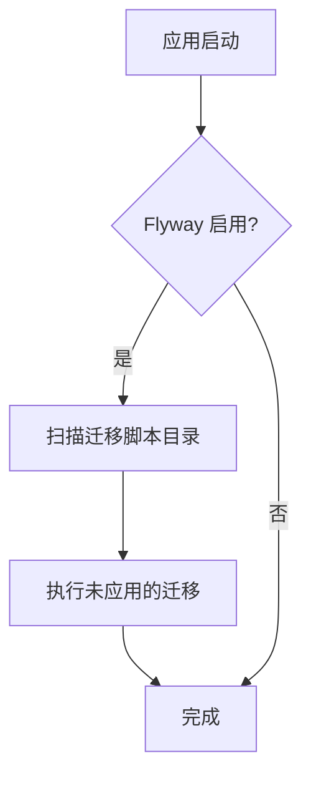
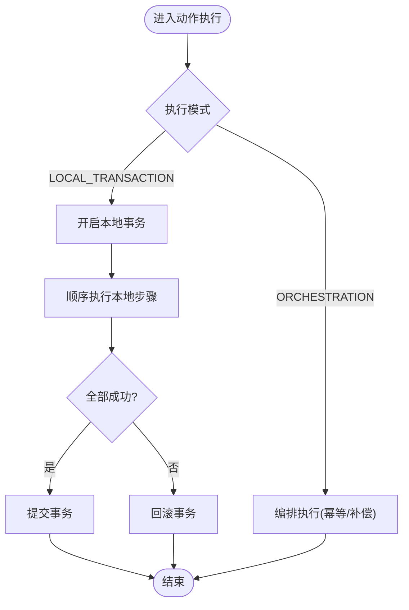
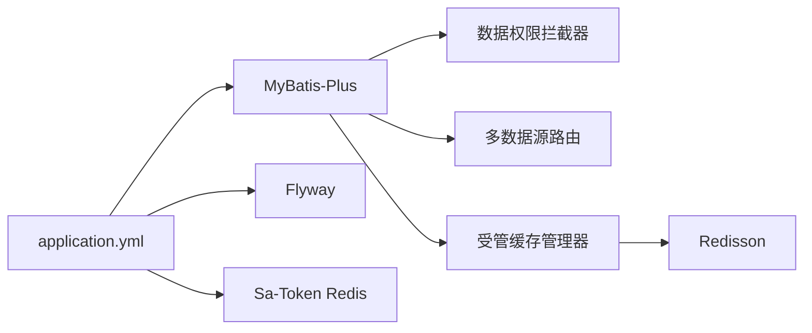

# 数据访问层设计

<cite>
**本文引用的文件**
- [application.yml](file://forge-server/forge-admin-server/src/main/resources/application.yml)
- [application-datascope-example.yml](file://forge-server/forge-framework/forge-starter-parent/forge-starter-datascope/src/main/resources/application-datascope-example.yml)
- [MybatisPlusConfig.java](file://forge-server/forge-framework/forge-starter-parent/forge-starter-orm/src/main/java/com/mdframe/forge/starter/orm/config/MybatisPlusConfig.java)
- [InjectionMetaObjectHandler.java](file://forge-server/forge-framework/forge-starter-parent/forge-starter-orm/src/main/java/com/mdframe/forge/starter/orm/handler/InjectionMetaObjectHandler.java)
- [CountOnePaginationInnerInterceptor.java](file://forge-server/forge-framework/forge-starter-parent/forge-starter-orm/src/main/java/com/mdframe/forge/starter/orm/interceptor/CountOnePaginationInnerInterceptor.java)
- [DataScopeAutoConfiguration.java](file://forge-server/forge-framework/forge-starter-parent/forge-starter-datascope/src/main/java/com/mdframe/forge/starter/datascope/config/DataScopeAutoConfiguration.java)
- [DataScopeProperties.java](file://forge-server/forge-framework/forge-starter-parent/forge-starter-datascope/src/main/java/com/mdframe/forge/starter/datascope/config/DataScopeProperties.java)
- [DataScopeContext.java](file://forge-server/forge-framework/forge-starter-parent/forge-starter-datascope/src/main/java/com/mdframe/forge/starter/datascope/context/DataScopeContext.java)
- [DataScopeContextHolder.java](file://forge-server/forge-framework/forge-starter-parent/forge-starter-datascope/src/main/java/com/mdframe/forge/starter/datascope/context/DataScopeContextHolder.java)
- [DataScopeInterceptor.java](file://forge-server/forge-framework/forge-starter-parent/forge-starter-datascope/src/main/java/com/mdframe/forge/starter/datascope/handler/DataScopeInterceptor.java)
- [BusinessDatasourceDemoServiceImpl.java](file://forge-server/forge-business/forge-business-core/src/main/java/com/mdframe/forge/business/core/demo/service/impl/BusinessDatasourceDemoServiceImpl.java)
- [RedissonConfig.java](file://forge-server/forge-framework/forge-starter-parent/forge-starter-cache/src/main/java/com/mdframe/forge/starter/cache/config/RedissonConfig.java)
- [ForgeManagedCacheManager.java](file://forge-server/forge-framework/forge-starter-parent/forge-starter-cache/src/main/java/com/mdframe/forge/starter/cache/managed/ForgeManagedCacheManager.java)
- [ForgeCacheAspect.java](file://forge-server/forge-framework/forge-starter-parent/forge-starter-cache/src/main/java/com/mdframe/forge/starter/cache/managed/aop/ForgeCacheAspect.java)
- [MultiLevelCacheHandle.java](file://forge-server/forge-framework/forge-starter-parent/forge-starter-cache/src/main/java/com/mdframe/forge/starter/cache/managed/store/MultiLevelCacheHandle.java)
- [RedisCacheHandle.java](file://forge-server/forge-framework/forge-starter-parent/forge-starter-cache/src/main/java/com/mdframe/forge/starter/cache/managed/store/RedisCacheHandle.java)
- [LocalCacheHandle.java](file://forge-server/forge-framework/forge-starter-parent/forge-starter-cache/src/main/java/com/mdframe/forge/starter/cache/managed/store/LocalCacheHandle.java)
- [FlowModelMapperSqlContractTest.java](file://forge-server/forge-framework/forge-plugin-parent/forge-plugin-flow/src/test/java/com/mdframe/forge/starter/flow/mapper/FlowModelMapperSqlContractTest.java)
- [BusinessExtensionMapperTest.java](file://forge-server/forge-framework/forge-plugin-parent/forge-plugin-generator/src/test/java/com/mdframe/forge/plugin/generator/mapper/BusinessExtensionMapperTest.java)
- [BusinessApplicationMapperTest.java](file://forge-server/forge-framework/forge-plugin-parent/forge-plugin-generator/src/test/java/com/mdframe/forge/plugin/generator/mapper/BusinessApplicationMapperTest.java)
</cite>

## 目录
1. [简介](#简介)
2. [项目结构](#项目结构)
3. [核心组件](#核心组件)
4. [架构总览](#架构总览)
5. [详细组件分析](#详细组件分析)
6. [依赖关系分析](#依赖关系分析)
7. [性能考虑](#性能考虑)
8. [故障排查指南](#故障排查指南)
9. [结论](#结论)
10. [附录](#附录)

## 简介
本文件面向 Forge Admin 的数据访问层，系统性说明 MyBatis-Plus 集成、多数据源与读写分离、数据权限控制、连接池与 SQL 优化、Flyway 数据库迁移、缓存策略以及事务管理。文档以仓库中的实际配置与实现为依据，配合可视化图示帮助读者快速理解整体设计与关键流程。

## 项目结构
数据访问能力由多个 starter 与 plugin 模块共同构成：
- ORM 基础能力：MyBatis-Plus 全局配置、自动填充、分页拦截器等
- 数据权限：基于注解与拦截器的行级/字段级数据范围控制
- 多数据源：租户维度的数据源路由与执行器
- 缓存：本地+Redis 多级缓存、受管缓存策略与一致性保障
- 事务：声明式与编程式事务、动作命令的本地事务边界
- 迁移：Flyway 版本化迁移脚本管理

图表来源
- [application.yml:97-118](file://forge-server/forge-admin-server/src/main/resources/application.yml#L97-L118)
- [MybatisPlusConfig.java](file://forge-server/forge-framework/forge-starter-parent/forge-starter-orm/src/main/java/com/mdframe/forge/starter/orm/config/MybatisPlusConfig.java)
- [InjectionMetaObjectHandler.java](file://forge-server/forge-framework/forge-starter-parent/forge-starter-orm/src/main/java/com/mdframe/forge/starter/orm/handler/InjectionMetaObjectHandler.java)
- [CountOnePaginationInnerInterceptor.java](file://forge-server/forge-framework/forge-starter-parent/forge-starter-orm/src/main/java/com/mdframe/forge/starter/orm/interceptor/CountOnePaginationInnerInterceptor.java)
- [DataScopeAutoConfiguration.java](file://forge-server/forge-framework/forge-starter-parent/forge-starter-datascope/src/main/java/com/mdframe/forge/starter/datascope/config/DataScopeAutoConfiguration.java)
- [DataScopeContext.java](file://forge-server/forge-framework/forge-starter-parent/forge-starter-datascope/src/main/java/com/mdframe/forge/starter/datascope/context/DataScopeContext.java)
- [DataScopeContextHolder.java](file://forge-server/forge-framework/forge-starter-parent/forge-starter-datascope/src/main/java/com/mdframe/forge/starter/datascope/context/DataScopeContextHolder.java)
- [DataScopeInterceptor.java](file://forge-server/forge-framework/forge-starter-parent/forge-starter-datascope/src/main/java/com/mdframe/forge/starter/datascope/handler/DataScopeInterceptor.java)
- [BusinessDatasourceDemoServiceImpl.java:35-66](file://forge-server/forge-business/forge-business-core/src/main/java/com/mdframe/forge/business/core/demo/service/impl/BusinessDatasourceDemoServiceImpl.java#L35-L66)
- [RedissonConfig.java](file://forge-server/forge-framework/forge-starter-parent/forge-starter-cache/src/main/java/com/mdframe/forge/starter/cache/config/RedissonConfig.java)
- [ForgeManagedCacheManager.java:212-521](file://forge-server/forge-framework/forge-starter-parent/forge-starter-cache/src/main/java/com/mdframe/forge/starter/cache/managed/ForgeManagedCacheManager.java#L212-L521)
- [ForgeCacheAspect.java](file://forge-server/forge-framework/forge-starter-parent/forge-starter-cache/src/main/java/com/mdframe/forge/starter/cache/managed/aop/ForgeCacheAspect.java)
- [MultiLevelCacheHandle.java](file://forge-server/forge-framework/forge-starter-parent/forge-starter-cache/src/main/java/com/mdframe/forge/starter/cache/managed/store/MultiLevelCacheHandle.java)

章节来源
- [application.yml:97-118](file://forge-server/forge-admin-server/src/main/resources/application.yml#L97-L118)

## 核心组件
- MyBatis-Plus 集成
  - Mapper 包扫描、XML 位置、实体别名、驼峰映射、日志输出等全局配置
  - 主键生成策略、逻辑删除、分页插件等通过配置或拦截器注入
- 数据权限（DataScope）
  - 开关、SQL 打印、API 暴露等配置项
  - 上下文持有当前数据范围，拦截器在 SQL 执行前动态改写条件
- 多数据源与租户路由
  - 通过注解或执行器在方法级切换数据源，支持按租户隔离
- 缓存
  - Redisson 客户端、受管缓存管理器、AOP 注解驱动、多级缓存句柄
- 迁移
  - Flyway 启用、脚本路径、基线版本、历史表名等
- 事务
  - 声明式事务（Spring @Transactional）、编程式事务（TransactionTemplate），以及动作命令的本地事务模式

章节来源
- [application.yml:65-72](file://forge-server/forge-admin-server/src/main/resources/application.yml#L65-L72)
- [application.yml:97-118](file://forge-server/forge-admin-server/src/main/resources/application.yml#L97-L118)
- [application-datascope-example.yml:1-10](file://forge-server/forge-framework/forge-starter-parent/forge-starter-datascope/src/main/resources/application-datascope-example.yml#L1-L10)
- [BusinessDatasourceDemoServiceImpl.java:35-66](file://forge-server/forge-business/forge-business-core/src/main/java/com/mdframe/forge/business/core/demo/service/impl/BusinessDatasourceDemoServiceImpl.java#L35-L66)
- [ForgeManagedCacheManager.java:212-521](file://forge-server/forge-framework/forge-starter-parent/forge-starter-cache/src/main/java/com/mdframe/forge/starter/cache/managed/ForgeManagedCacheManager.java#L212-L521)

## 架构总览
下图展示了从请求进入后，数据访问的关键路径：ORM 配置与拦截器、数据权限改写、多数据源路由、缓存命中与回源、以及 Flyway 迁移。

图表来源
- [MybatisPlusConfig.java](file://forge-server/forge-framework/forge-starter-parent/forge-starter-orm/src/main/java/com/mdframe/forge/starter/orm/config/MybatisPlusConfig.java)
- [DataScopeInterceptor.java](file://forge-server/forge-framework/forge-starter-parent/forge-starter-datascope/src/main/java/com/mdframe/forge/starter/datascope/handler/DataScopeInterceptor.java)
- [BusinessDatasourceDemoServiceImpl.java:35-66](file://forge-server/forge-business/forge-business-core/src/main/java/com/mdframe/forge/business/core/demo/service/impl/BusinessDatasourceDemoServiceImpl.java#L35-L66)
- [ForgeManagedCacheManager.java:212-521](file://forge-server/forge-framework/forge-starter-parent/forge-starter-cache/src/main/java/com/mdframe/forge/starter/cache/managed/ForgeManagedCacheManager.java#L212-L521)

## 详细组件分析

### MyBatis-Plus 集成与动态 SQL
- 全局配置要点
  - Mapper 包扫描、XML 扫描路径、实体别名包
  - 驼峰转换、缓存开关、自增键、执行器类型、日志实现
  - 主键策略为雪花 ID，便于分布式环境唯一性
- 自动填充
  - 通过元对象处理器统一注入创建/更新时间、操作人等审计字段
- 分页与计数优化
  - 自定义分页拦截器对 count 查询进行优化，减少全表扫描开销
- 动态 SQL 与租户/逻辑删除约束
  - 测试用例强制要求关键查询显式包含租户边界与逻辑删除过滤，确保数据安全

图表来源
- [MybatisPlusConfig.java](file://forge-server/forge-framework/forge-starter-parent/forge-starter-orm/src/main/java/com/mdframe/forge/starter/orm/config/MybatisPlusConfig.java)
- [InjectionMetaObjectHandler.java](file://forge-server/forge-framework/forge-starter-parent/forge-starter-orm/src/main/java/com/mdframe/forge/starter/orm/handler/InjectionMetaObjectHandler.java)
- [CountOnePaginationInnerInterceptor.java](file://forge-server/forge-framework/forge-starter-parent/forge-starter-orm/src/main/java/com/mdframe/forge/starter/orm/interceptor/CountOnePaginationInnerInterceptor.java)

章节来源
- [application.yml:97-118](file://forge-server/forge-admin-server/src/main/resources/application.yml#L97-L118)
- [FlowModelMapperSqlContractTest.java:13-26](file://forge-server/forge-framework/forge-plugin-parent/forge-plugin-flow/src/test/java/com/mdframe/forge/starter/flow/mapper/FlowModelMapperSqlContractTest.java#L13-L26)
- [BusinessExtensionMapperTest.java:16-29](file://forge-server/forge-framework/forge-plugin-parent/forge-plugin-generator/src/test/java/com/mdframe/forge/plugin/generator/mapper/BusinessExtensionMapperTest.java#L16-L29)
- [BusinessApplicationMapperTest.java:36-52](file://forge-server/forge-framework/forge-plugin-parent/forge-plugin-generator/src/test/java/com/mdframe/forge/plugin/generator/mapper/BusinessApplicationMapperTest.java#L36-L52)

### 多数据源支持与读写分离
- 租户数据源路由
  - 通过注解或执行器在方法级别指定目标数据源，结合租户上下文完成路由
  - 示例服务演示了两种用法：注解方式与显式执行器方式
- 读写分离策略
  - 读请求可路由至只读库，写请求路由至主库；具体策略由数据源解析器与执行器决定
- 路由机制
  - 线程级数据源上下文保证同一调用链内数据源一致

图表来源
- [BusinessDatasourceDemoServiceImpl.java:35-66](file://forge-server/forge-business/forge-business-core/src/main/java/com/mdframe/forge/business/core/demo/service/impl/BusinessDatasourceDemoServiceImpl.java#L35-L66)

章节来源
- [BusinessDatasourceDemoServiceImpl.java:35-66](file://forge-server/forge-business/forge-business-core/src/main/java/com/mdframe/forge/business/core/demo/service/impl/BusinessDatasourceDemoServiceImpl.java#L35-L66)

### 数据权限控制
- 配置项
  - 是否启用、是否打印 SQL 改写、是否暴露 API
- 上下文
  - 线程安全的数据范围上下文，保存角色、组织、区域等维度信息
- 拦截器
  - 在 SQL 执行前根据上下文注入 WHERE 条件，实现行级过滤
- 最佳实践
  - 所有查询需具备明确的租户边界与逻辑删除过滤，避免越权与脏数据

图表来源
- [DataScopeAutoConfiguration.java](file://forge-server/forge-framework/forge-starter-parent/forge-starter-datascope/src/main/java/com/mdframe/forge/starter/datascope/config/DataScopeAutoConfiguration.java)
- [DataScopeContext.java](file://forge-server/forge-framework/forge-starter-parent/forge-starter-datascope/src/main/java/com/mdframe/forge/starter/datascope/context/DataScopeContext.java)
- [DataScopeContextHolder.java](file://forge-server/forge-framework/forge-starter-parent/forge-starter-datascope/src/main/java/com/mdframe/forge/starter/datascope/context/DataScopeContextHolder.java)
- [DataScopeInterceptor.java](file://forge-server/forge-framework/forge-starter-parent/forge-starter-datascope/src/main/java/com/mdframe/forge/starter/datascope/handler/DataScopeInterceptor.java)

章节来源
- [application-datascope-example.yml:1-10](file://forge-server/forge-framework/forge-starter-parent/forge-starter-datascope/src/main/resources/application-datascope-example.yml#L1-L10)
- [DataScopeAutoConfiguration.java](file://forge-server/forge-framework/forge-starter-parent/forge-starter-datascope/src/main/java/com/mdframe/forge/starter/datascope/config/DataScopeAutoConfiguration.java)
- [DataScopeContext.java](file://forge-server/forge-framework/forge-starter-parent/forge-starter-datascope/src/main/java/com/mdframe/forge/starter/datascope/context/DataScopeContext.java)
- [DataScopeContextHolder.java](file://forge-server/forge-framework/forge-starter-parent/forge-starter-datascope/src/main/java/com/mdframe/forge/starter/datascope/context/DataScopeContextHolder.java)
- [DataScopeInterceptor.java](file://forge-server/forge-framework/forge-starter-parent/forge-starter-datascope/src/main/java/com/mdframe/forge/starter/datascope/handler/DataScopeInterceptor.java)

### 缓存策略与一致性
- 缓存组件
  - Redisson 客户端配置
  - 受管缓存管理器：定义、策略覆盖、本地快照、失败统计
  - AOP 注解：@ForgeCacheable/@ForgeCachePut/@ForgeCacheEvict
  - 多级缓存：本地缓存 + Redis 缓存句柄
- 一致性保障
  - 策略快照定期刷新，异常时降级到本地策略
  - 控制面消息用于失效与校准
- 热点数据优化
  - 本地缓存优先，降低 Redis 压力
  - TTL、最大容量、空值缓存等策略可调

图表来源
- [RedissonConfig.java](file://forge-server/forge-framework/forge-starter-parent/forge-starter-cache/src/main/java/com/mdframe/forge/starter/cache/config/RedissonConfig.java)
- [ForgeManagedCacheManager.java:212-521](file://forge-server/forge-framework/forge-starter-parent/forge-starter-cache/src/main/java/com/mdframe/forge/starter/cache/managed/ForgeManagedCacheManager.java#L212-L521)
- [ForgeCacheAspect.java](file://forge-server/forge-framework/forge-starter-parent/forge-starter-cache/src/main/java/com/mdframe/forge/starter/cache/managed/aop/ForgeCacheAspect.java)
- [MultiLevelCacheHandle.java](file://forge-server/forge-framework/forge-starter-parent/forge-starter-cache/src/main/java/com/mdframe/forge/starter/cache/managed/store/MultiLevelCacheHandle.java)
- [RedisCacheHandle.java](file://forge-server/forge-framework/forge-starter-parent/forge-starter-cache/src/main/java/com/mdframe/forge/starter/cache/managed/store/RedisCacheHandle.java)
- [LocalCacheHandle.java](file://forge-server/forge-framework/forge-starter-parent/forge-starter-cache/src/main/java/com/mdframe/forge/starter/cache/managed/store/LocalCacheHandle.java)

章节来源
- [ForgeManagedCacheManager.java:212-521](file://forge-server/forge-framework/forge-starter-parent/forge-starter-cache/src/main/java/com/mdframe/forge/starter/cache/managed/ForgeManagedCacheManager.java#L212-L521)

### 数据库迁移管理（Flyway）
- 启用与定位
  - 通过环境变量控制启用与脚本路径，支持多目录扫描
- 基线与历史表
  - 设置基线版本与历史表名，兼容存量系统
- 占位符替换
  - 关闭占位符替换以避免意外替换

图表来源
- [application.yml:65-72](file://forge-server/forge-admin-server/src/main/resources/application.yml#L65-L72)

章节来源
- [application.yml:65-72](file://forge-server/forge-admin-server/src/main/resources/application.yml#L65-L72)

### 事务管理机制
- 声明式事务
  - 通过 Spring 事务注解管理边界，适用于大多数业务场景
- 编程式事务
  - 通过 TransactionTemplate 精确控制事务传播与隔离级别
- 动作命令的本地事务
  - 对于仅涉及本地数据步骤的动作，采用 LOCAL_TRANSACTION 模式，保证单事务原子性；跨系统交互使用 ORCHESTRATION 模式，依赖幂等与补偿

图表来源
- [BusinessActionCommandPolicy.java](file://forge-server/forge-framework/forge-plugin-parent/forge-plugin-generator/src/main/java/com/mdframe/forge/plugin/generator/service/businessapp/BusinessActionCommandPolicy.java)
- [spec.md:21-64](file://code-copilot/changes/lowcode-transactional-commands/spec.md#L21-L64)

章节来源
- [spec.md:21-64](file://code-copilot/changes/lowcode-transactional-commands/spec.md#L21-L64)

## 依赖关系分析
- 配置依赖
  - application.yml 集中声明 MyBatis-Plus、Flyway、Sa-Token Redis、业务数据源开关等
- 组件耦合
  - ORM 层与数据权限拦截器解耦，通过 MyBatis 拦截点接入
  - 多数据源与业务服务通过注解/执行器协作，不侵入业务代码
  - 缓存与业务通过 AOP 注解解耦，管理器负责策略与一致性
- 外部依赖
  - Redisson 提供分布式缓存与发布订阅能力
  - Flyway 负责数据库版本演进

图表来源
- [application.yml:65-72](file://forge-server/forge-admin-server/src/main/resources/application.yml#L65-L72)
- [application.yml:97-118](file://forge-server/forge-admin-server/src/main/resources/application.yml#L97-L118)
- [RedissonConfig.java](file://forge-server/forge-framework/forge-starter-parent/forge-starter-cache/src/main/java/com/mdframe/forge/starter/cache/config/RedissonConfig.java)
- [DataScopeInterceptor.java](file://forge-server/forge-framework/forge-starter-parent/forge-starter-datascope/src/main/java/com/mdframe/forge/starter/datascope/handler/DataScopeInterceptor.java)
- [BusinessDatasourceDemoServiceImpl.java:35-66](file://forge-server/forge-business/forge-business-core/src/main/java/com/mdframe/forge/business/core/demo/service/impl/BusinessDatasourceDemoServiceImpl.java#L35-L66)
- [ForgeManagedCacheManager.java:212-521](file://forge-server/forge-framework/forge-starter-parent/forge-starter-cache/src/main/java/com/mdframe/forge/starter/cache/managed/ForgeManagedCacheManager.java#L212-L521)

章节来源
- [application.yml:65-72](file://forge-server/forge-admin-server/src/main/resources/application.yml#L65-L72)
- [application.yml:97-118](file://forge-server/forge-admin-server/src/main/resources/application.yml#L97-L118)

## 性能考虑
- 连接池与执行器
  - 合理设置连接池大小、超时与空闲回收；使用 SIMPLE 执行器提升批处理性能
- SQL 优化
  - 分页 count 优化、避免 SELECT *、利用索引与覆盖索引
  - 强制租户边界与逻辑删除过滤，减少无效扫描
- 慢查询监控
  - 开启 MyBatis 日志输出，结合数据库慢查询日志与指标采集
- 缓存优化
  - 热点数据本地缓存优先，合理设置 TTL 与最大容量
  - 策略快照定期刷新，异常降级保证可用性
- 多数据源
  - 读多写少场景下将读路由至只读库，减轻主库压力

[本节为通用指导，不直接分析具体文件]

## 故障排查指南
- 数据权限问题
  - 检查是否启用数据权限、SQL 改写日志是否开启
  - 确认上下文是否正确设置，拦截器是否生效
- 多数据源路由错误
  - 校验租户上下文与注解/执行器参数
  - 检查数据源解析器是否能正确解析目标数据源
- 缓存不一致
  - 查看策略快照刷新是否成功，是否存在异常导致回退本地策略
  - 核对本地与 Redis 的 TTL 与容量配置
- 迁移失败
  - 检查 Flyway 启用状态、脚本路径与基线版本
  - 查看迁移历史表记录，定位未执行脚本

章节来源
- [application-datascope-example.yml:1-10](file://forge-server/forge-framework/forge-starter-parent/forge-starter-datascope/src/main/resources/application-datascope-example.yml#L1-L10)
- [BusinessDatasourceDemoServiceImpl.java:35-66](file://forge-server/forge-business/forge-business-core/src/main/java/com/mdframe/forge/business/core/demo/service/impl/BusinessDatasourceDemoServiceImpl.java#L35-L66)
- [ForgeManagedCacheManager.java:212-521](file://forge-server/forge-framework/forge-starter-parent/forge-starter-cache/src/main/java/com/mdframe/forge/starter/cache/managed/ForgeManagedCacheManager.java#L212-L521)
- [application.yml:65-72](file://forge-server/forge-admin-server/src/main/resources/application.yml#L65-L72)

## 结论
本数据访问层以 MyBatis-Plus 为核心，结合数据权限、多数据源、缓存与 Flyway 迁移，形成完整、可扩展且安全的数据库访问体系。通过拦截器与注解实现低侵入扩展，借助受管缓存与策略快照保障一致性与可用性，配合严格的 SQL 契约测试确保数据安全。建议在生产环境中持续优化连接池、SQL 与缓存策略，并完善慢查询监控与告警。

## 附录
- 关键配置清单
  - MyBatis-Plus：mapperPackage、mapperLocations、typeAliasesPackage、global-config.dbConfig.idType
  - Flyway：enabled、locations、baseline-on-migrate、baseline-version、table
  - Sa-Token Redis：host、port、password、timeout
  - 数据权限：enabled、print-sql、enable-api
  - 业务数据源：enabled、tenant-routing-enabled-default

章节来源
- [application.yml:65-72](file://forge-server/forge-admin-server/src/main/resources/application.yml#L65-L72)
- [application.yml:97-118](file://forge-server/forge-admin-server/src/main/resources/application.yml#L97-L118)
- [application-datascope-example.yml:1-10](file://forge-server/forge-framework/forge-starter-parent/forge-starter-datascope/src/main/resources/application-datascope-example.yml#L1-L10)