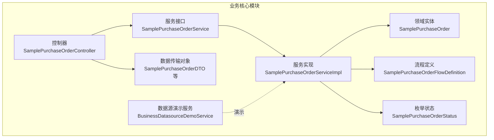
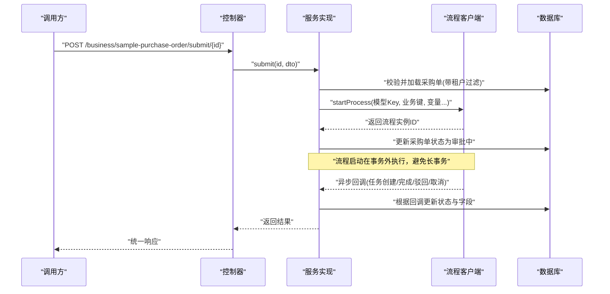
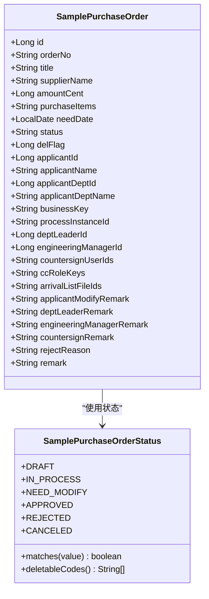
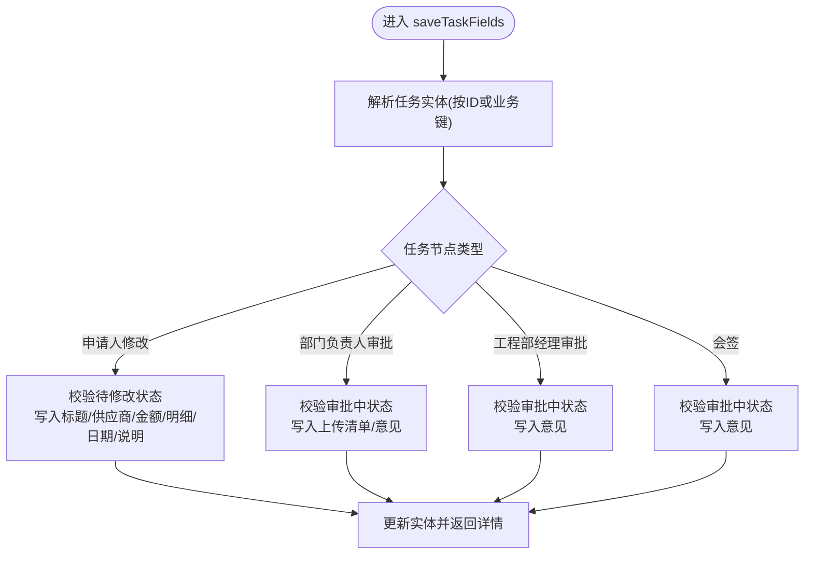
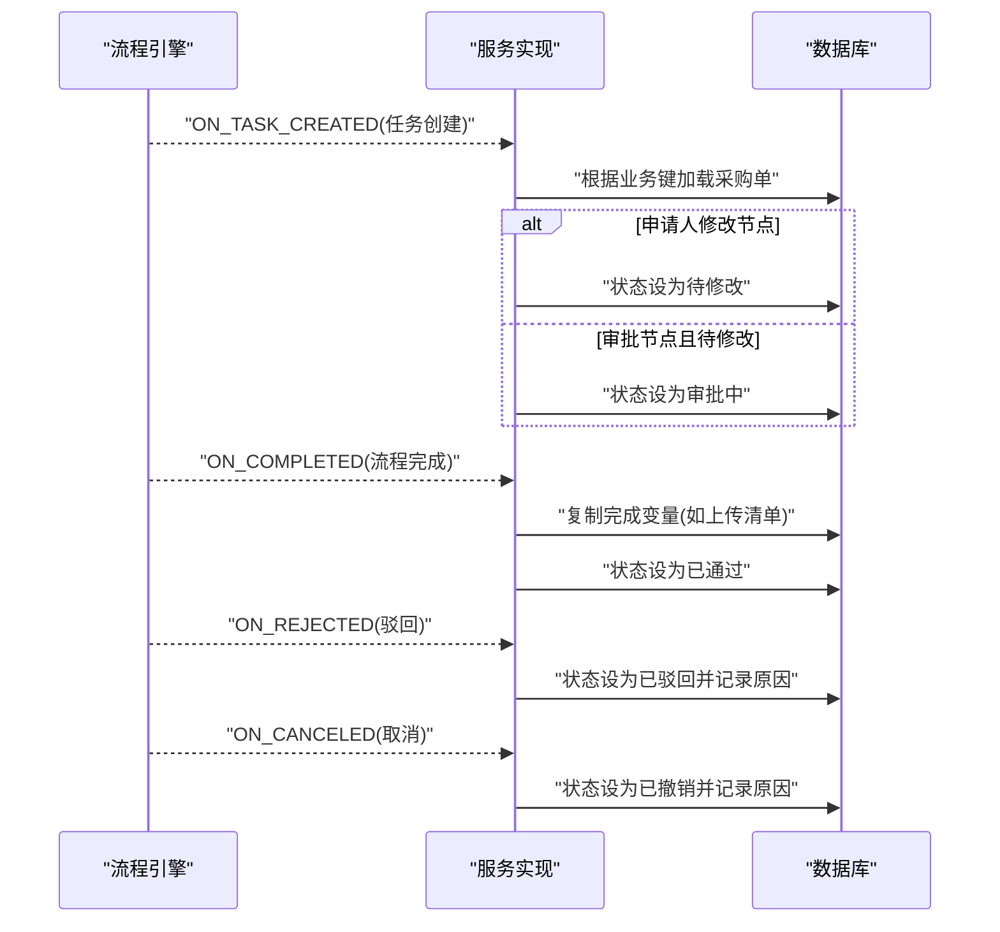
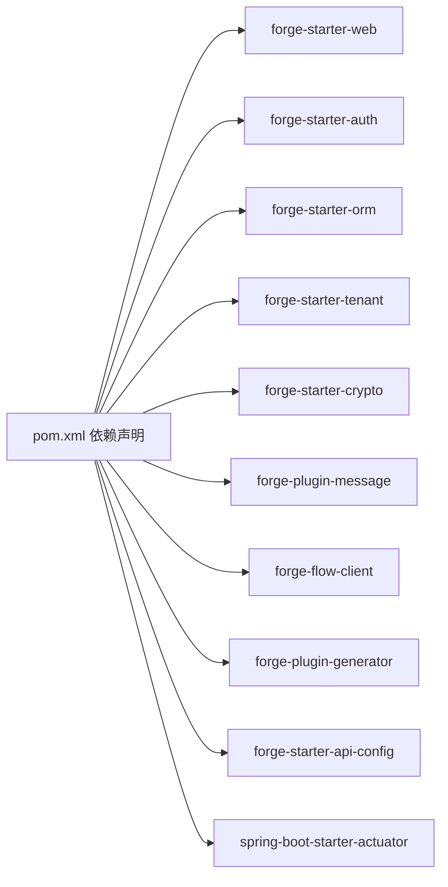

# 业务核心模块

<cite>
**本文引用的文件**
- [SamplePurchaseOrder.java](file://forge-server/forge-business/forge-business-core/src/main/java/com/mdframe/forge/business/core/purchase/domain/SamplePurchaseOrder.java)
- [SamplePurchaseOrderService.java](file://forge-server/forge-business/forge-business-core/src/main/java/com/mdframe/forge/business/core/purchase/service/SamplePurchaseOrderService.java)
- [SamplePurchaseOrderServiceImpl.java](file://forge-server/forge-business/forge-business-core/src/main/java/com/mdframe/forge/business/core/purchase/service/impl/SamplePurchaseOrderServiceImpl.java)
- [SamplePurchaseOrderController.java](file://forge-server/forge-business/forge-business-core/src/main/java/com/mdframe/forge/business/core/purchase/controller/SamplePurchaseOrderController.java)
- [SamplePurchaseOrderFlowDefinition.java](file://forge-server/forge-business/forge-business-core/src/main/java/com/mdframe/forge/business/core/purchase/support/SamplePurchaseOrderFlowDefinition.java)
- [SamplePurchaseOrderStatus.java](file://forge-server/forge-business/forge-business-core/src/main/java/com/mdframe/forge/business/core/purchase/enums/SamplePurchaseOrderStatus.java)
- [SamplePurchaseOrderDTO.java](file://forge-server/forge-business/forge-business-core/src/main/java/com/mdframe/forge/business/core/purchase/dto/SamplePurchaseOrderDTO.java)
- [BusinessDatasourceDemoService.java](file://forge-server/forge-business/forge-business-core/src/main/java/com/mdframe/forge/business/core/demo/service/BusinessDatasourceDemoService.java)
- [pom.xml](file://forge-server/forge-business/forge-business-core/pom.xml)
</cite>

## 目录
1. [简介](#简介)
2. [项目结构](#项目结构)
3. [核心组件](#核心组件)
4. [架构总览](#架构总览)
5. [详细组件分析](#详细组件分析)
6. [依赖关系分析](#依赖关系分析)
7. [性能与一致性](#性能与一致性)
8. [故障排查指南](#故障排查指南)
9. [结论](#结论)
10. [附录](#附录)

## 简介
本文件聚焦 Forge Admin 的“业务核心模块”（forge-business-core），以采购单审批示例为主线，系统阐述领域模型抽象、DDD 组织方式、事件驱动流程、跨服务事务策略、能力复用机制、外部系统集成、多存储后端持久化以及监控审计等关键主题。该模块通过控制器暴露 API，服务层封装业务规则并与工作流客户端交互，领域实体承载聚合根语义，支持多租户隔离与操作日志审计。

## 项目结构
- 包组织采用按业务能力划分：controller、service、domain、dto、vo、enums、support、mapper 等分层清晰。
- 示例包含两类能力：
  - 采购单审批：完整的 CRUD、流程发起、任务字段保存、状态对账与回调处理。
  - 数据源演示：展示租户级数据源路由能力（接口定义）。
- 构建配置声明了 Web、认证、ORM、多租户、加密、消息、流程客户端、代码生成器、API 配置、Actuator 等依赖，体现“Starter + Plugin”的插件化体系。

**图表来源**
- [SamplePurchaseOrderController.java:1-93](file://forge-server/forge-business/forge-business-core/src/main/java/com/mdframe/forge/business/core/purchase/controller/SamplePurchaseOrderController.java#L1-L93)
- [SamplePurchaseOrderService.java:1-57](file://forge-server/forge-business/forge-business-core/src/main/java/com/mdframe/forge/business/core/purchase/service/SamplePurchaseOrderService.java#L1-L57)
- [SamplePurchaseOrderServiceImpl.java:1-811](file://forge-server/forge-business/forge-business-core/src/main/java/com/mdframe/forge/business/core/purchase/service/impl/SamplePurchaseOrderServiceImpl.java#L1-L811)
- [SamplePurchaseOrder.java:1-79](file://forge-server/forge-business/forge-business-core/src/main/java/com/mdframe/forge/business/core/purchase/domain/SamplePurchaseOrder.java#L1-L79)
- [SamplePurchaseOrderFlowDefinition.java:1-530](file://forge-server/forge-business/forge-business-core/src/main/java/com/mdframe/forge/business/core/purchase/support/SamplePurchaseOrderFlowDefinition.java#L1-L530)
- [SamplePurchaseOrderStatus.java:1-36](file://forge-server/forge-business/forge-business-core/src/main/java/com/mdframe/forge/business/core/purchase/enums/SamplePurchaseOrderStatus.java#L1-L36)
- [SamplePurchaseOrderDTO.java:1-39](file://forge-server/forge-business/forge-business-core/src/main/java/com/mdframe/forge/business/core/purchase/dto/SamplePurchaseOrderDTO.java#L1-L39)
- [BusinessDatasourceDemoService.java:1-22](file://forge-server/forge-business/forge-business-core/src/main/java/com/mdframe/forge/business/core/demo/service/BusinessDatasourceDemoService.java#L1-L22)

**章节来源**
- [pom.xml:1-98](file://forge-server/forge-business/forge-business-core/pom.xml#L1-L98)

## 核心组件
- 控制器层：提供分页查询、详情获取、新增、修改、删除、提交审批、保存待办节点字段、初始化流程等 REST 接口，统一返回包装并记录操作日志。
- 服务层：封装业务规则（校验、状态机）、与流程客户端交互（启动流程、回调处理）、与 ORM 交互（CRUD、分页、按业务键查询）、与租户上下文交互（多租户隔离）。
- 领域层：聚合根 SamplePurchaseOrder 承载采购单主数据；SamplePurchaseOrderStatus 表达状态机；SamplePurchaseOrderFlowDefinition 集中定义流程常量、表单资产、字段权限、摘要与业务键解析等。
- 传输层：DTO/VO 用于入参出参解耦，避免直接暴露实体。
- 支撑层：流程定义与 BPMN 模板、代码表单提供者、流程绑定配置读取、标题模板渲染等。

**章节来源**
- [SamplePurchaseOrderController.java:1-93](file://forge-server/forge-business/forge-business-core/src/main/java/com/mdframe/forge/business/core/purchase/controller/SamplePurchaseOrderController.java#L1-L93)
- [SamplePurchaseOrderService.java:1-57](file://forge-server/forge-business/forge-business-core/src/main/java/com/mdframe/forge/business/core/purchase/service/SamplePurchaseOrderService.java#L1-L57)
- [SamplePurchaseOrderServiceImpl.java:1-811](file://forge-server/forge-business/forge-business-core/src/main/java/com/mdframe/forge/business/core/purchase/service/impl/SamplePurchaseOrderServiceImpl.java#L1-L811)
- [SamplePurchaseOrder.java:1-79](file://forge-server/forge-business/forge-business-core/src/main/java/com/mdframe/forge/business/core/purchase/domain/SamplePurchaseOrder.java#L1-L79)
- [SamplePurchaseOrderFlowDefinition.java:1-530](file://forge-server/forge-business/forge-business-core/src/main/java/com/mdframe/forge/business/core/purchase/support/SamplePurchaseOrderFlowDefinition.java#L1-L530)
- [SamplePurchaseOrderStatus.java:1-36](file://forge-server/forge-business/forge-business-core/src/main/java/com/mdframe/forge/business/core/purchase/enums/SamplePurchaseOrderStatus.java#L1-L36)
- [SamplePurchaseOrderDTO.java:1-39](file://forge-server/forge-business/forge-business-core/src/main/java/com/mdframe/forge/business/core/purchase/dto/SamplePurchaseOrderDTO.java#L1-L39)

## 架构总览
- 分层职责清晰：控制器仅负责参数接收、日志与响应包装；服务层承载业务编排与规则；领域实体与枚举表达领域概念；流程定义集中管理流程元数据与表单资产。
- 事件驱动：通过 FlowClient 远程调用流程服务，使用 @FlowCallback 异步回调更新单据状态，保证业务流程与数据状态最终一致。
- 多租户与审计：基于 TenantEntity 与 SessionHelper/TenantContextHolder 实现租户隔离；控制器方法标注操作日志，便于审计追踪。
- 插件化集成：依赖 forge-starter-* 与 forge-plugin-*，如 web、auth、orm、tenant、crypto、message、flow-client、generator 等，体现微内核+插件扩展。

**图表来源**
- [SamplePurchaseOrderController.java:75-91](file://forge-server/forge-business/forge-business-core/src/main/java/com/mdframe/forge/business/core/purchase/controller/SamplePurchaseOrderController.java#L75-L91)
- [SamplePurchaseOrderServiceImpl.java:161-226](file://forge-server/forge-business/forge-business-core/src/main/java/com/mdframe/forge/business/core/purchase/service/impl/SamplePurchaseOrderServiceImpl.java#L161-L226)
- [SamplePurchaseOrderServiceImpl.java:330-372](file://forge-server/forge-business/forge-business-core/src/main/java/com/mdframe/forge/business/core/purchase/service/impl/SamplePurchaseOrderServiceImpl.java#L330-L372)

**章节来源**
- [pom.xml:14-86](file://forge-server/forge-business/forge-business-core/pom.xml#L14-L86)

## 详细组件分析

### 领域模型与聚合根
- 聚合根：SamplePurchaseOrder 作为采购单的聚合根，承载订单号、主题、供应商、金额、明细、期望到货日期、状态、申请人信息、流程关联字段、审批意见等。
- 值对象与枚举：SamplePurchaseOrderStatus 表达状态机，提供匹配与可删除状态集合，约束业务流转。
- 多租户：继承 TenantEntity，结合服务层的租户解析逻辑，确保数据隔离。
- 软删除：使用表逻辑删除标记，保障数据安全。

**图表来源**
- [SamplePurchaseOrder.java:1-79](file://forge-server/forge-business/forge-business-core/src/main/java/com/mdframe/forge/business/core/purchase/domain/SamplePurchaseOrder.java#L1-L79)
- [SamplePurchaseOrderStatus.java:1-36](file://forge-server/forge-business/forge-business-core/src/main/java/com/mdframe/forge/business/core/purchase/enums/SamplePurchaseOrderStatus.java#L1-L36)

**章节来源**
- [SamplePurchaseOrder.java:1-79](file://forge-server/forge-business/forge-business-core/src/main/java/com/mdframe/forge/business/core/purchase/domain/SamplePurchaseOrder.java#L1-L79)
- [SamplePurchaseOrderStatus.java:1-36](file://forge-server/forge-business/forge-business-core/src/main/java/com/mdframe/forge/business/core/purchase/enums/SamplePurchaseOrderStatus.java#L1-L36)

### 服务层与业务规则
- 创建/更新/删除：严格的状态校验，仅允许草稿或待修改状态编辑，仅允许特定状态删除。
- 提交审批：组装流程变量（业务键、对象编码、记录ID、发起人、审批人、会签人员、抄送角色等），调用流程客户端启动流程，成功后更新单据状态为审批中。
- 任务字段保存：根据任务节点类型（申请人修改、部门负责人审批、工程部经理审批、会签）进行差异化校验与字段写入，并在必要时自动修复状态（如从待修改恢复到审批中）。
- 状态对账：列表与详情查询后，根据当前活动任务节点修正本地状态，保证显示与流程引擎一致。
- 流程模型初始化：若模型不存在或未发布，则创建并发布默认 BPMN 模型，保留设计器配置。

**图表来源**
- [SamplePurchaseOrderServiceImpl.java:228-274](file://forge-server/forge-business/forge-business-core/src/main/java/com/mdframe/forge/business/core/purchase/service/impl/SamplePurchaseOrderServiceImpl.java#L228-L274)
- [SamplePurchaseOrderFlowDefinition.java:405-430](file://forge-server/forge-business/forge-business-core/src/main/java/com/mdframe/forge/business/core/purchase/support/SamplePurchaseOrderFlowDefinition.java#L405-L430)

**章节来源**
- [SamplePurchaseOrderServiceImpl.java:114-226](file://forge-server/forge-business/forge-business-core/src/main/java/com/mdframe/forge/business/core/purchase/service/impl/SamplePurchaseOrderServiceImpl.java#L114-L226)
- [SamplePurchaseOrderServiceImpl.java:228-274](file://forge-server/forge-business/forge-business-core/src/main/java/com/mdframe/forge/business/core/purchase/service/impl/SamplePurchaseOrderServiceImpl.java#L228-L274)
- [SamplePurchaseOrderServiceImpl.java:465-523](file://forge-server/forge-business/forge-business-core/src/main/java/com/mdframe/forge/business/core/purchase/service/impl/SamplePurchaseOrderServiceImpl.java#L465-L523)

### 事件驱动与流程集成
- 流程绑定：服务类通过注解绑定模型Key与业务类型，使流程框架能识别业务对象。
- 回调处理：监听任务创建、任务完成、流程完成、驳回、取消等事件，依据事件类型更新采购单状态与字段，保持数据与流程一致。
- 标题模板：支持从绑定配置读取标题模板，动态替换业务字段，提升可读性。

**图表来源**
- [SamplePurchaseOrderServiceImpl.java:330-372](file://forge-server/forge-business/forge-business-core/src/main/java/com/mdframe/forge/business/core/purchase/service/impl/SamplePurchaseOrderServiceImpl.java#L330-L372)
- [SamplePurchaseOrderServiceImpl.java:374-410](file://forge-server/forge-business/forge-business-core/src/main/java/com/mdframe/forge/business/core/purchase/service/impl/SamplePurchaseOrderServiceImpl.java#L374-L410)
- [SamplePurchaseOrderServiceImpl.java:544-552](file://forge-server/forge-business/forge-business-core/src/main/java/com/mdframe/forge/business/core/purchase/service/impl/SamplePurchaseOrderServiceImpl.java#L544-L552)

**章节来源**
- [SamplePurchaseOrderServiceImpl.java:330-372](file://forge-server/forge-business/forge-business-core/src/main/java/com/mdframe/forge/business/core/purchase/service/impl/SamplePurchaseOrderServiceImpl.java#L330-L372)
- [SamplePurchaseOrderServiceImpl.java:558-605](file://forge-server/forge-business/forge-business-core/src/main/java/com/mdframe/forge/business/core/purchase/service/impl/SamplePurchaseOrderServiceImpl.java#L558-L605)

### 控制器与API设计
- 接口覆盖：分页查询、详情（支持ID或业务键）、新增、修改、删除、提交审批、保存任务字段、初始化流程。
- 安全与审计：启用接口加解密注解，统一操作日志记录，便于安全与审计追踪。
- 响应封装：统一 RespInfo 返回结构，简化前端处理。

**章节来源**
- [SamplePurchaseOrderController.java:1-93](file://forge-server/forge-business/forge-business-core/src/main/java/com/mdframe/forge/business/core/purchase/controller/SamplePurchaseOrderController.java#L1-L93)

### 流程定义与表单资产
- 常量集中：模型Key、业务类型、节点Key、变量名、动作、字段名等集中定义，降低耦合。
- 表单资产：提供字段定义、权限控制、任务表单上下文构建、记录数据映射、摘要生成等能力。
- 条件表达式：提供驳回条件与会签完成条件的表达式构造，便于BPMN配置。

**章节来源**
- [SamplePurchaseOrderFlowDefinition.java:1-530](file://forge-server/forge-business/forge-business-core/src/main/java/com/mdframe/forge/business/core/purchase/support/SamplePurchaseOrderFlowDefinition.java#L1-L530)

### 数据源演示（多租户数据源路由）
- 提供当前数据源、指定租户数据源、准备数据、列表查询等接口，用于演示多租户场景下的数据源切换能力。
- 虽为演示服务，但体现了业务核心模块对多数据源的扩展点。

**章节来源**
- [BusinessDatasourceDemoService.java:1-22](file://forge-server/forge-business/forge-business-core/src/main/java/com/mdframe/forge/business/core/demo/service/BusinessDatasourceDemoService.java#L1-L22)

## 依赖关系分析
- 技术栈依赖：Web、认证、ORM、多租户、加密、消息、流程客户端、代码生成器、API 配置、Actuator。
- 外部集成：通过 forge-flow-client 与流程服务通信；通过 generator 插件读取业务绑定配置；通过 starter-* 获得通用能力。
- 模块内依赖：控制器依赖服务；服务依赖领域实体、枚举、流程定义、ORM Mapper、租户上下文、会话助手、异常工具等。

**图表来源**
- [pom.xml:14-86](file://forge-server/forge-business/forge-business-core/pom.xml#L14-L86)

**章节来源**
- [pom.xml:14-86](file://forge-server/forge-business/forge-business-core/pom.xml#L14-L86)

## 性能与一致性
- 事务边界：创建、更新、删除、提交审批、任务字段保存等方法使用事务注解，保证本地数据一致性；流程启动在事务外执行，避免长事务占用连接。
- 状态对账：查询时根据活动任务节点对账本地状态，减少状态不一致导致的展示问题。
- 批量优化：分页查询与批量详情查询，减少网络往返；去重与空集合快速返回，避免无效计算。
- 资源释放：流程启动失败或状态更新失败时记录错误日志，便于人工干预与补偿。

[本节为通用指导，不直接分析具体文件]

## 故障排查指南
- 流程启动失败：检查流程模型是否存在、是否已发布；查看 FlowResult 返回信息与日志。
- 状态不一致：确认活动任务节点是否与本地状态匹配；必要时触发状态对账修复。
- 任务字段保存失败：检查当前状态是否符合节点要求；核对必填字段与校验规则。
- 回调未生效：确认回调方法是否正确注册；检查业务键解析与租户上下文是否正确传递。
- 多租户问题：确认请求上下文中租户ID是否正确设置；验证查询是否携带租户过滤。

**章节来源**
- [SamplePurchaseOrderServiceImpl.java:195-226](file://forge-server/forge-business/forge-business-core/src/main/java/com/mdframe/forge/business/core/purchase/service/impl/SamplePurchaseOrderServiceImpl.java#L195-L226)
- [SamplePurchaseOrderServiceImpl.java:465-523](file://forge-server/forge-business/forge-business-core/src/main/java/com/mdframe/forge/business/core/purchase/service/impl/SamplePurchaseOrderServiceImpl.java#L465-L523)
- [SamplePurchaseOrderServiceImpl.java:330-372](file://forge-server/forge-business/forge-business-core/src/main/java/com/mdframe/forge/business/core/purchase/service/impl/SamplePurchaseOrderServiceImpl.java#L330-L372)

## 结论
forge-business-core 以采购单审批为例，展示了基于 DDD 的业务建模与实现：聚合根与状态机明确领域边界；服务层编排业务规则与流程协作；事件驱动保证最终一致性；多租户与审计贯穿全链路；插件化依赖使能力可复用与可扩展。该模块为后续更多业务领域的接入提供了稳定、清晰的范式。

## 附录
- 术语说明：
  - 聚合根：领域模型中协调内部对象与业务规则的入口。
  - 值对象：无唯一标识、不可变或弱可变的数据抽象。
  - 事件驱动：通过异步事件解耦业务流程，提高弹性与可维护性。
  - 多租户：同一实例下不同租户数据隔离与访问控制。
  - 插件化：通过 Starter/Plugin 组合能力，按需装配系统功能。

[本节为概念性内容，不直接分析具体文件]