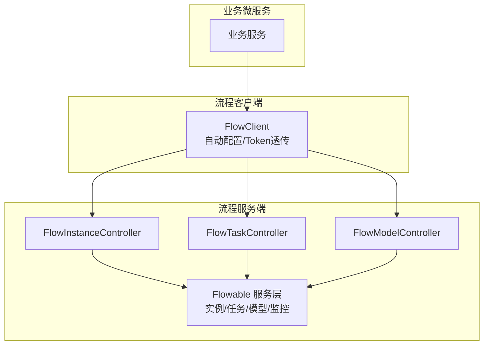
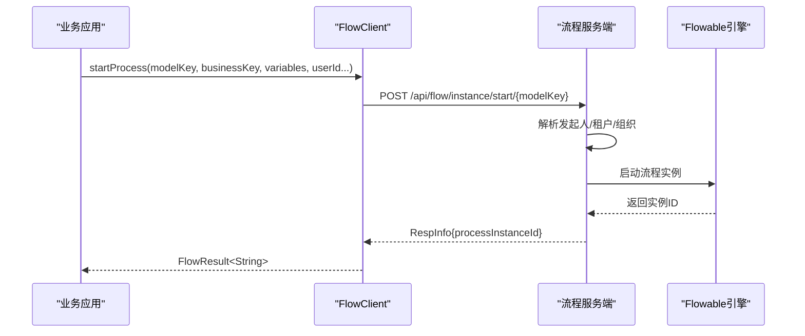
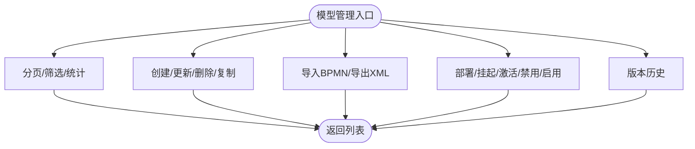
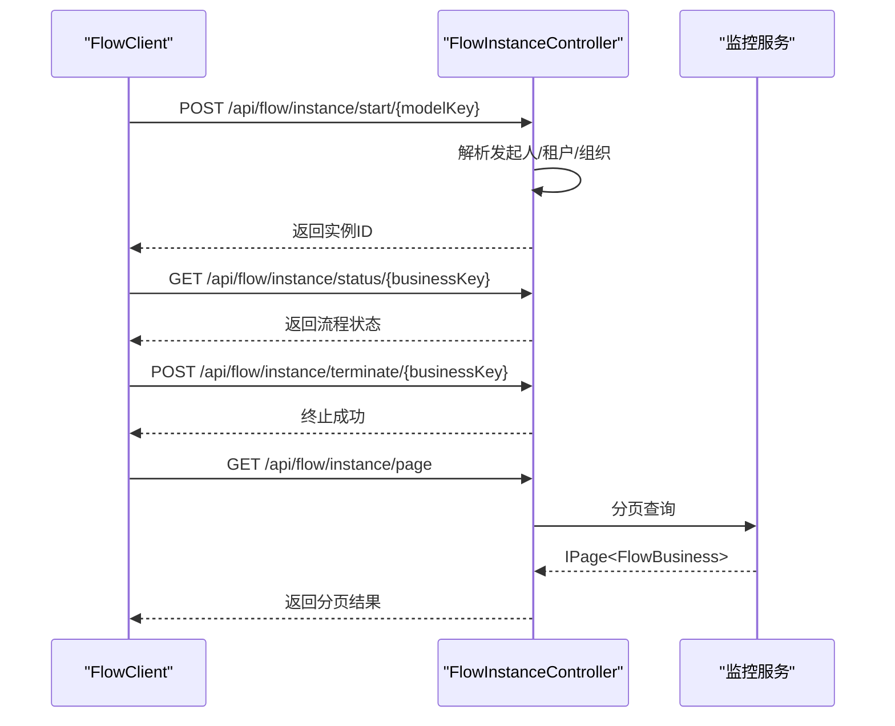
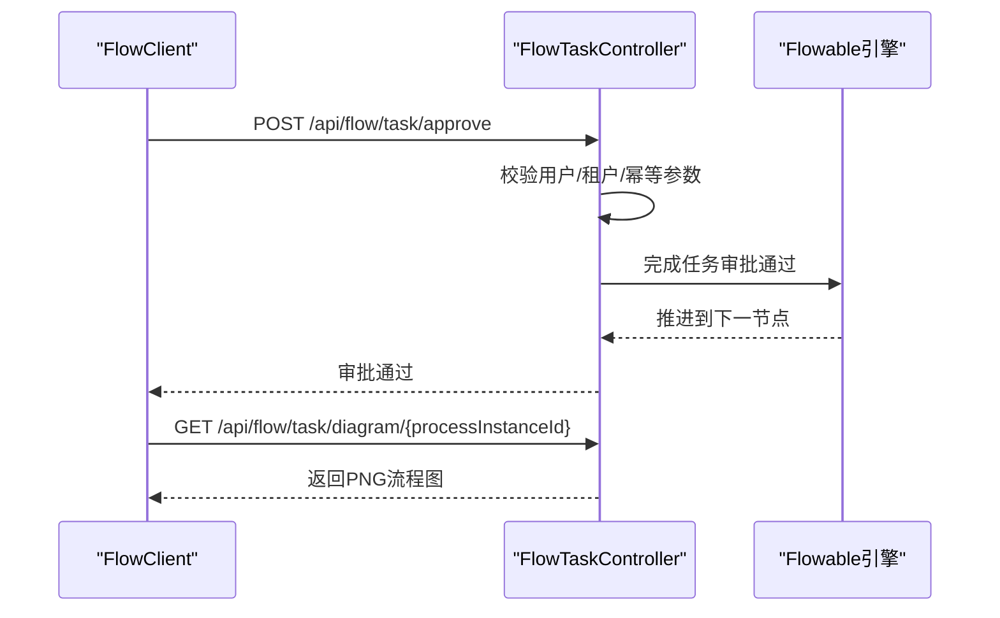
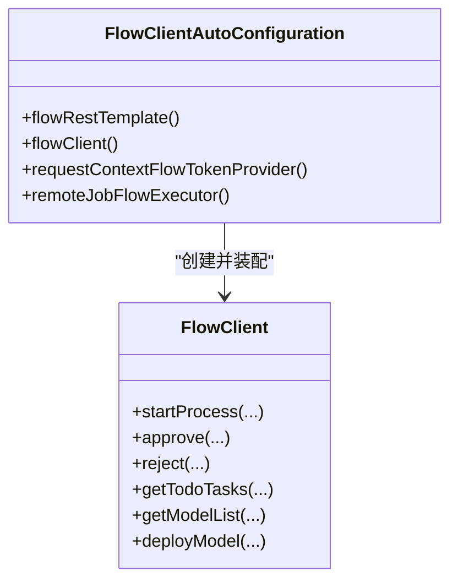
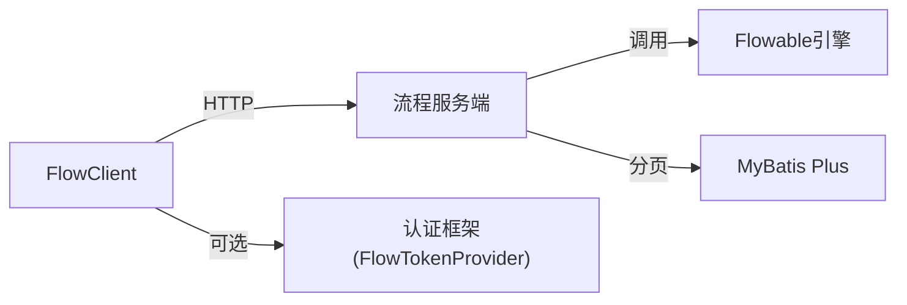
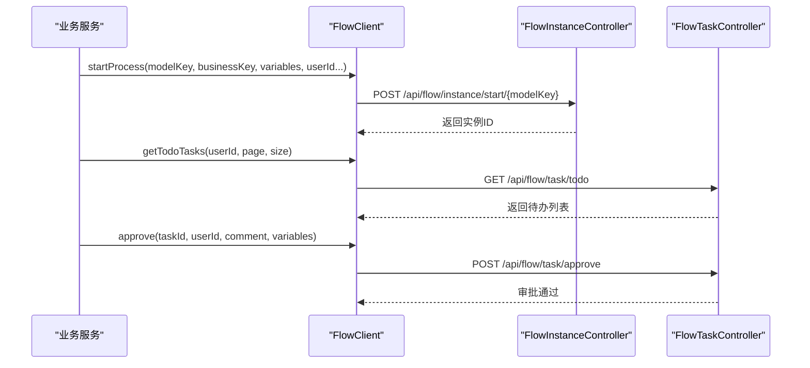

# 工作流服务模块

<cite>
**本文引用的文件**
- [FlowClient.java](file://forge-server/forge-flow/forge-flow-client/src/main/java/com/mdframe/forge/flow/client/FlowClient.java)
- [FlowClientAutoConfiguration.java](file://forge-server/forge-flow/forge-flow-client/src/main/java/com/mdframe/forge/flow/client/FlowClientAutoConfiguration.java)
- [FlowInstanceController.java](file://forge-server/forge-flow/forge-flow-server/src/main/java/com/mdframe/forge/flow/controller/FlowInstanceController.java)
- [FlowModelController.java](file://forge-server/forge-flow/forge-flow-server/src/main/java/com/mdframe/forge/flow/controller/FlowModelController.java)
- [FlowTaskController.java](file://forge-server/forge-flow/forge-flow-server/src/main/java/com/mdframe/forge/flow/controller/FlowTaskController.java)
</cite>

## 目录
1. [简介](#简介)
2. [项目结构](#项目结构)
3. [核心组件](#核心组件)
4. [架构总览](#架构总览)
5. [详细组件分析](#详细组件分析)
6. [依赖关系分析](#依赖关系分析)
7. [性能与扩展性](#性能与扩展性)
8. [故障排查指南](#故障排查指南)
9. [结论](#结论)
10. [附录](#附录)

## 简介
本模块基于 Flowable 引擎提供企业级工作流能力，覆盖流程建模、版本管理、部署发布、实例生命周期、任务审批（会签/或签/转办等）、监控追踪以及与业务系统的事件驱动集成。通过 forge-flow-client 与 forge-flow-server 的清晰分层，对外暴露统一的 HTTP API，对内封装 Flowable 运行态与持久化细节，便于在多租户、分布式环境下稳定运行。

## 项目结构
- 客户端模块（forge-flow-client）：面向业务微服务的轻量 HTTP 客户端，负责发起流程、任务操作、模型查询等调用，并自动注入鉴权 Token。
- 服务端模块（forge-flow-server）：基于 Spring Boot 暴露 REST API，编排 Flowable 引擎能力，提供流程模型、实例、任务、监控等管理能力。

**图表来源**
- [FlowClient.java:16-60](file://forge-server/forge-flow/forge-flow-client/src/main/java/com/mdframe/forge/flow/client/FlowClient.java#L16-L60)
- [FlowClientAutoConfiguration.java:26-86](file://forge-server/forge-flow/forge-flow-client/src/main/java/com/mdframe/forge/flow/client/FlowClientAutoConfiguration.java#L26-L86)
- [FlowInstanceController.java:27-42](file://forge-server/forge-flow/forge-flow-server/src/main/java/com/mdframe/forge/flow/controller/FlowInstanceController.java#L27-L42)
- [FlowTaskController.java:32-44](file://forge-server/forge-flow/forge-flow-server/src/main/java/com/mdframe/forge/flow/controller/FlowTaskController.java#L32-L44)
- [FlowModelController.java:20-31](file://forge-server/forge-flow/forge-flow-server/src/main/java/com/mdframe/forge/flow/controller/FlowModelController.java#L20-L31)

**章节来源**
- [FlowClient.java:16-60](file://forge-server/forge-flow/forge-flow-client/src/main/java/com/mdframe/forge/flow/client/FlowClient.java#L16-L60)
- [FlowClientAutoConfiguration.java:26-86](file://forge-server/forge-flow/forge-flow-client/src/main/java/com/mdframe/forge/flow/client/FlowClientAutoConfiguration.java#L26-L86)
- [FlowInstanceController.java:27-42](file://forge-server/forge-flow/forge-flow-server/src/main/java/com/mdframe/forge/flow/controller/FlowInstanceController.java#L27-L42)
- [FlowTaskController.java:32-44](file://forge-server/forge-flow/forge-flow-server/src/main/java/com/mdframe/forge/flow/controller/FlowTaskController.java#L32-L44)
- [FlowModelController.java:20-31](file://forge-server/forge-flow/forge-flow-server/src/main/java/com/mdframe/forge/flow/controller/FlowModelController.java#L20-L31)

## 核心组件
- 流程客户端 FlowClient：统一封装对流程服务的 HTTP 调用，支持静态 Token 与动态 TokenProvider 透传，内置 RestTemplate 超时与 JSON 序列化。
- 自动配置 FlowClientAutoConfiguration：按需装配 RestTemplate、FlowClient、远程作业执行器，并在存在安全框架时自动注入 TokenProvider。
- 流程实例控制器 FlowInstanceController：提供启动、状态查询、终止、变量读写、分页与详情等接口。
- 流程任务控制器 FlowTaskController：提供待办/已办/我发起的任务列表、签收、审批、驳回、退回、转办、改派、撤回、催办、流程图与表单信息等。
- 流程模型控制器 FlowModelController：提供模型 CRUD、启用/禁用、挂起/激活、导入导出、版本历史、统计与列表等。

**章节来源**
- [FlowClient.java:16-60](file://forge-server/forge-flow/forge-flow-client/src/main/java/com/mdframe/forge/flow/client/FlowClient.java#L16-L60)
- [FlowClientAutoConfiguration.java:26-86](file://forge-server/forge-flow/forge-flow-client/src/main/java/com/mdframe/forge/flow/client/FlowClientAutoConfiguration.java#L26-L86)
- [FlowInstanceController.java:27-42](file://forge-server/forge-flow/forge-flow-server/src/main/java/com/mdframe/forge/flow/controller/FlowInstanceController.java#L27-L42)
- [FlowTaskController.java:32-44](file://forge-server/forge-flow/forge-flow-server/src/main/java/com/mdframe/forge/flow/controller/FlowTaskController.java#L32-L44)
- [FlowModelController.java:20-31](file://forge-server/forge-flow/forge-flow-server/src/main/java/com/mdframe/forge/flow/controller/FlowModelController.java#L20-L31)

## 架构总览
整体采用“客户端-服务端”解耦模式：
- 客户端侧：通过 FlowClient 以 HTTP 方式调用流程服务；支持在 Web 上下文中从请求头获取 Token 并透传，或在非 Web 上下文降级为静态 Token。
- 服务端侧：控制器接收请求，校验身份与租户，委托 Flowable 服务层完成流程建模、实例与任务编排，并返回统一响应体。

**图表来源**
- [FlowClient.java:88-124](file://forge-server/forge-flow/forge-flow-client/src/main/java/com/mdframe/forge/flow/client/FlowClient.java#L88-L124)
- [FlowInstanceController.java:44-145](file://forge-server/forge-flow/forge-flow-server/src/main/java/com/mdframe/forge/flow/controller/FlowInstanceController.java#L44-L145)

**章节来源**
- [FlowClient.java:88-124](file://forge-server/forge-flow/forge-flow-client/src/main/java/com/mdframe/forge/flow/client/FlowClient.java#L88-L124)
- [FlowInstanceController.java:44-145](file://forge-server/forge-flow/forge-flow-server/src/main/java/com/mdframe/forge/flow/controller/FlowInstanceController.java#L44-L145)

## 详细组件分析

### 流程建模与版本管理（FlowModelController）
- 功能要点
  - 模型分页、按分类/状态筛选、启用模型列表、状态统计。
  - 模型创建、更新、删除、复制、检查 Key 唯一性。
  - 导入/导出 BPMN XML，便于建模工具协同。
  - 部署、挂起/激活、禁用/启用控制模型生命周期。
  - 版本历史查询，支撑回滚与审计。
- 关键接口路径
  - GET /api/flow/model/page
  - GET /api/flow/model/enabled
  - GET /api/flow/model/statistics
  - GET /api/flow/model/{id}
  - GET /api/flow/model/key/{modelKey}
  - GET /api/flow/model/key/{modelKey}/start-config
  - POST /api/flow/model
  - PUT /api/flow/model
  - DELETE /api/flow/model/{id}
  - POST /api/flow/model/{id}/deploy
  - POST /api/flow/model/{id}/suspend
  - POST /api/flow/model/{id}/activate
  - POST /api/flow/model/{id}/disable
  - POST /api/flow/model/{id}/enable
  - GET /api/flow/model/{modelKey}/versions
  - POST /api/flow/model/import
  - GET /api/flow/model/{id}/export
  - POST /api/flow/model/{id}/copy
  - GET /api/flow/model/checkKey
  - GET /api/flow/model/list

**图表来源**
- [FlowModelController.java:33-231](file://forge-server/forge-flow/forge-flow-server/src/main/java/com/mdframe/forge/flow/controller/FlowModelController.java#L33-L231)

**章节来源**
- [FlowModelController.java:33-231](file://forge-server/forge-flow/forge-flow-server/src/main/java/com/mdframe/forge/flow/controller/FlowModelController.java#L33-L231)

### 流程实例生命周期（FlowInstanceController）
- 功能要点
  - 启动流程：支持普通发起与可信委托发起（高风险审批专用）。
  - 状态查询：根据业务键获取流程状态。
  - 终止/删除：支持终止与物理删除。
  - 变量读写：运行时变量获取与更新。
  - 分页与详情：基于监控服务进行实例列表与详情查询。
- 关键接口路径
  - POST /api/flow/instance/start/{modelKey}
  - POST /api/flow/instance/start-delegated/{modelKey}
  - POST /api/flow/instance/start-delegated-approval/{modelKey}
  - GET /api/flow/instance/status/{businessKey}
  - POST /api/flow/instance/terminate/{businessKey}
  - DELETE /api/flow/instance/{businessKey}
  - GET /api/flow/instance/variables/{businessKey}
  - PUT /api/flow/instance/variables/{businessKey}
  - GET /api/flow/instance/page
  - GET /api/flow/instance/detail/{processInstanceId}

**图表来源**
- [FlowInstanceController.java:44-239](file://forge-server/forge-flow/forge-flow-server/src/main/java/com/mdframe/forge/flow/controller/FlowInstanceController.java#L44-L239)

**章节来源**
- [FlowInstanceController.java:44-239](file://forge-server/forge-flow/forge-flow-server/src/main/java/com/mdframe/forge/flow/controller/FlowInstanceController.java#L44-L239)

### 任务分配与审批机制（FlowTaskController）
- 功能要点
  - 任务列表：我的待办、已办、我发起的、候选任务（未签收）。
  - 任务操作：签收、审批通过、驳回（含驳回至发起人修改路径）、退回上一节点、转办、改派、终结、撤回、催办。
  - 可视化：获取高亮流程图、流程图详情（含节点信息）、任务表单信息、流程关联表单信息。
  - 逾期提醒：手动触发扫描发送。
- 关键接口路径
  - GET /api/flow/task/todo
  - GET /api/flow/task/done
  - GET /api/flow/task/started
  - GET /api/flow/task/candidate
  - POST /api/flow/task/claim
  - POST /api/flow/task/approve
  - POST /api/flow/task/reject
  - POST /api/flow/task/reject-to-start
  - POST /api/flow/task/return
  - POST /api/flow/task/delegate
  - POST /api/flow/task/reassign
  - POST /api/flow/task/terminate
  - POST /api/flow/task/withdraw
  - GET /api/flow/task/{taskId}
  - GET /api/flow/task/diagram/{processInstanceId}
  - GET /api/flow/task/diagram-info/{processInstanceId}
  - POST /api/flow/task/remind
  - POST /api/flow/task/overdue-reminder/scan
  - GET /api/flow/task/history/{processInstanceId}
  - GET /api/flow/task/form/{taskId}
  - GET /api/flow/task/form

**图表来源**
- [FlowTaskController.java:123-165](file://forge-server/forge-flow/forge-flow-server/src/main/java/com/mdframe/forge/flow/controller/FlowTaskController.java#L123-L165)
- [FlowTaskController.java:282-315](file://forge-server/forge-flow/forge-flow-server/src/main/java/com/mdframe/forge/flow/controller/FlowTaskController.java#L282-L315)

**章节来源**
- [FlowTaskController.java:46-373](file://forge-server/forge-flow/forge-flow-server/src/main/java/com/mdframe/forge/flow/controller/FlowTaskController.java#L46-L373)

### 客户端集成与鉴权透传（FlowClient + AutoConfiguration）
- 功能要点
  - 统一封装 HTTP 调用，支持 GET/POST/PUT，自动设置 Content-Type 与内部调用标识。
  - 动态 Token 优先：若容器中存在 FlowTokenProvider（如引入认证框架），则从当前请求上下文提取 Authorization 并透传；否则使用静态 token。
  - 超时与异常：RestTemplate 可配置连接/读取超时；网络或空响应体时抛出 FlowClientException。
  - 远程作业执行：可选启用远程 JobFlowExecutor，用于定时任务场景下的流程调用。
- 关键配置与行为
  - 自动装配 RestTemplate（名称 flowRestTemplate）。
  - 条件装配 RequestContextFlowTokenProvider（仅在 Web 上下文可用）。
  - 条件装配 RemoteJobFlowExecutor（当开启远程作业属性时）。

**图表来源**
- [FlowClient.java:33-60](file://forge-server/forge-flow/forge-flow-client/src/main/java/com/mdframe/forge/flow/client/FlowClient.java#L33-L60)
- [FlowClientAutoConfiguration.java:26-86](file://forge-server/forge-flow/forge-flow-client/src/main/java/com/mdframe/forge/flow/client/FlowClientAutoConfiguration.java#L26-L86)

**章节来源**
- [FlowClient.java:517-599](file://forge-server/forge-flow/forge-flow-client/src/main/java/com/mdframe/forge/flow/client/FlowClient.java#L517-L599)
- [FlowClientAutoConfiguration.java:26-86](file://forge-server/forge-flow/forge-flow-client/src/main/java/com/mdframe/forge/flow/client/FlowClientAutoConfiguration.java#L26-L86)

## 依赖关系分析
- 客户端依赖
  - Spring Web（RestTemplate、HttpHeaders）
  - Jackson（JSON 序列化）
  - 可选：认证框架（Sa-Token）提供的 FlowTokenProvider
- 服务端依赖
  - Spring Boot Web
  - Flowable 引擎（由 starter 提供）
  - MyBatis Plus（分页）
  - 安全注解（权限控制）
  - 加解密注解（API 加解密）

**图表来源**
- [FlowClient.java:1-15](file://forge-server/forge-flow/forge-flow-client/src/main/java/com/mdframe/forge/flow/client/FlowClient.java#L1-L15)
- [FlowInstanceController.java:1-23](file://forge-server/forge-flow/forge-flow-server/src/main/java/com/mdframe/forge/flow/controller/FlowInstanceController.java#L1-L23)
- [FlowTaskController.java:1-28](file://forge-server/forge-flow/forge-flow-server/src/main/java/com/mdframe/forge/flow/controller/FlowTaskController.java#L1-L28)
- [FlowModelController.java:1-19](file://forge-server/forge-flow/forge-flow-server/src/main/java/com/mdframe/forge/flow/controller/FlowModelController.java#L1-L19)

**章节来源**
- [FlowClient.java:1-15](file://forge-server/forge-flow/forge-flow-client/src/main/java/com/mdframe/forge/flow/client/FlowClient.java#L1-L15)
- [FlowInstanceController.java:1-23](file://forge-server/forge-flow/forge-flow-server/src/main/java/com/mdframe/forge/flow/controller/FlowInstanceController.java#L1-L23)
- [FlowTaskController.java:1-28](file://forge-server/forge-flow/forge-flow-server/src/main/java/com/mdframe/forge/flow/controller/FlowTaskController.java#L1-L28)
- [FlowModelController.java:1-19](file://forge-server/forge-flow/forge-flow-server/src/main/java/com/mdframe/forge/flow/controller/FlowModelController.java#L1-L19)

## 性能与扩展性
- 客户端性能
  - RestTemplate 连接/读取超时可配置，避免长尾阻塞。
  - 批量任务建议分片调用，结合幂等键减少重复提交。
- 服务端性能
  - 分页查询使用 MyBatis Plus，合理设置 pageSize。
  - 流程图生成与详情接口在高并发下注意缓存策略（如图片缓存、只读数据缓存）。
- 扩展点
  - 自定义 FlowTokenProvider 实现更细粒度的身份透传。
  - 通过 Flowable 服务层扩展节点行为（如网关、服务任务、脚本任务）。
  - 接入消息队列或事件总线，实现异步通知与补偿。

[本节为通用指导，不直接分析具体文件]

## 故障排查指南
- 常见问题
  - 空响应体：客户端在 GET/POST/PUT 收到空响应体会抛出 FlowClientException，需检查服务端日志与网络连通性。
  - 身份缺失：委托发起需要可信会话，缺少用户/租户/组织信息将抛出非法参数异常。
  - 租户不一致：任务操作要求租户一致，否则拒绝。
  - 流程图不存在：当无对应流程图时会返回未找到。
- 定位建议
  - 核对 FlowClient 配置的 URL、Token 与超时。
  - 在服务端控制器中查看入参校验与异常堆栈。
  - 使用流程图详情接口确认节点与执行路径。

**章节来源**
- [FlowClient.java:549-599](file://forge-server/forge-flow/forge-flow-client/src/main/java/com/mdframe/forge/flow/client/FlowClient.java#L549-L599)
- [FlowInstanceController.java:94-120](file://forge-server/forge-flow/forge-flow-server/src/main/java/com/mdframe/forge/flow/controller/FlowInstanceController.java#L94-L120)
- [FlowTaskController.java:167-176](file://forge-server/forge-flow/forge-flow-server/src/main/java/com/mdframe/forge/flow/controller/FlowTaskController.java#L167-L176)
- [FlowTaskController.java:287-299](file://forge-server/forge-flow/forge-flow-server/src/main/java/com/mdframe/forge/flow/controller/FlowTaskController.java#L287-L299)

## 结论
本工作流服务模块以 Flowable 为核心，通过客户端与服务端分层设计，提供了完整的流程建模、版本管理、实例生命周期、任务审批与监控能力。借助统一的 HTTP API 与灵活的鉴权透传机制，能够便捷地与企业现有系统集成，满足多租户与分布式环境下的稳定性与可扩展需求。

[本节为总结性内容，不直接分析具体文件]

## 附录

### 业务流程时序示例（启动与审批）

**图表来源**
- [FlowClient.java:88-124](file://forge-server/forge-flow/forge-flow-client/src/main/java/com/mdframe/forge/flow/client/FlowClient.java#L88-L124)
- [FlowInstanceController.java:44-145](file://forge-server/forge-flow/forge-flow-server/src/main/java/com/mdframe/forge/flow/controller/FlowInstanceController.java#L44-L145)
- [FlowTaskController.java:123-165](file://forge-server/forge-flow/forge-flow-server/src/main/java/com/mdframe/forge/flow/controller/FlowTaskController.java#L123-L165)