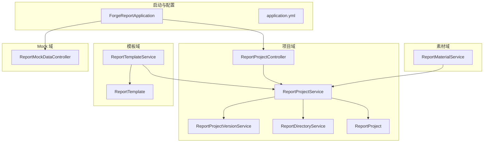
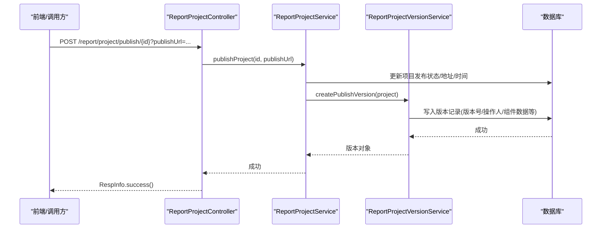
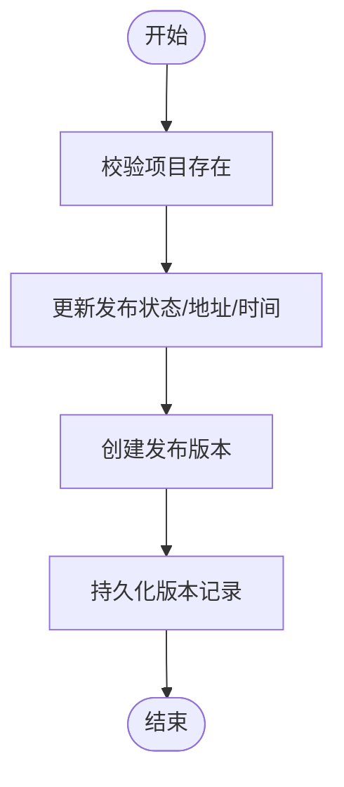
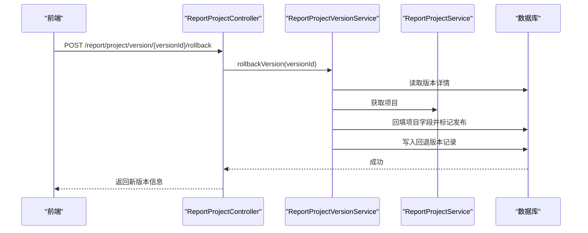
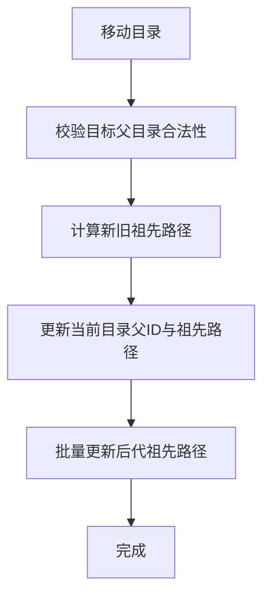
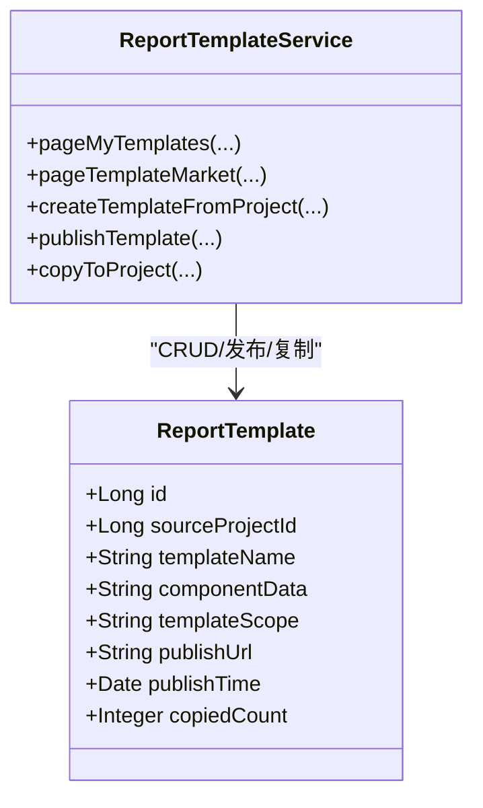
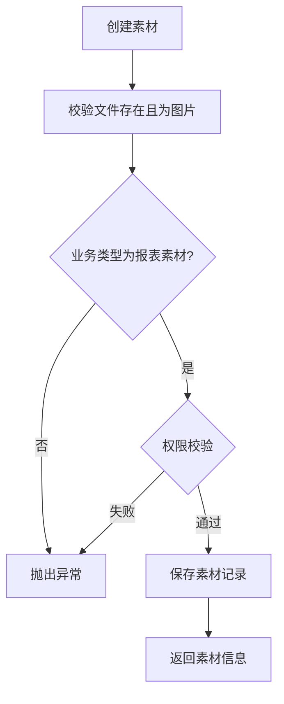
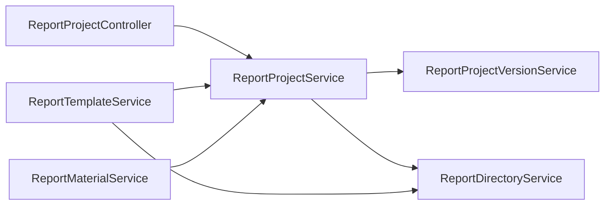

# 报表服务模块

<cite>
**本文引用的文件**
- [ForgeReportApplication.java](file://forge-server/forge-report-server/src/main/java/com/mdframe/forge/report/ForgeReportApplication.java)
- [application.yml](file://forge-server/forge-report-server/src/main/resources/application.yml)
- [ReportProjectController.java](file://forge-server/forge-report-server/src/main/java/com/mdframe/forge/report/project/controller/ReportProjectController.java)
- [ReportProjectService.java](file://forge-server/forge-report-server/src/main/java/com/mdframe/forge/report/project/service/ReportProjectService.java)
- [ReportProjectVersionService.java](file://forge-server/forge-report-server/src/main/java/com/mdframe/forge/report/project/service/ReportProjectVersionService.java)
- [ReportDirectoryService.java](file://forge-server/forge-report-server/src/main/java/com/mdframe/forge/report/project/directory/service/ReportDirectoryService.java)
- [ReportTemplateService.java](file://forge-server/forge-report-server/src/main/java/com/mdframe/forge/report/project/template/service/ReportTemplateService.java)
- [ReportMaterialService.java](file://forge-server/forge-report-server/src/main/java/com/mdframe/forge/report/material/service/ReportMaterialService.java)
- [ReportMockDataController.java](file://forge-server/forge-report-server/src/main/java/com/mdframe/forge/report/mock/controller/ReportMockDataController.java)
- [ReportProject.java](file://forge-server/forge-report-server/src/main/java/com/mdframe/forge/report/project/domain/ReportProject.java)
- [ReportTemplate.java](file://forge-server/forge-report-server/src/main/java/com/mdframe/forge/report/project/template/domain/ReportTemplate.java)
</cite>

## 目录
1. [简介](#简介)
2. [项目结构](#项目结构)
3. [核心组件](#核心组件)
4. [架构总览](#架构总览)
5. [详细组件分析](#详细组件分析)
6. [依赖关系分析](#依赖关系分析)
7. [性能与优化](#性能与优化)
8. [故障排查指南](#故障排查指南)
9. [结论](#结论)
10. [附录](#附录)

## 简介
本模块为 Forge Admin 的 AI 报表服务后端，聚焦于“AI 数据可视化大屏”的支撑能力。当前实现覆盖：
- 报表项目管理、发布与版本回退
- 模板市场与复制创建项目
- 素材库（图片）管理
- 目录组织与树形导航
- Mock 数据接口用于前端联调预览
- 应用级配置（端口、上下文路径、日志、MyBatis-Plus、Sa-Token 等）

说明：
- “AI 辅助设计”“自然语言生成可视化报表”“SQL 生成优化”“查询结果缓存”“大数据量处理”“图表类型动态渲染”“权限控制与分享机制”“前端编辑器交互协议”“性能监控与资源占用优化”等能力在当前代码中未见直接实现或明确入口，将在“性能与优化”和“附录”给出建议性方案，便于后续扩展。

## 项目结构
后端采用 Spring Boot + MyBatis-Plus 分层架构，按领域划分包：
- 启动类：扫描基础包、启用 AOP、默认 profile 设置
- 项目域：项目 CRUD、发布、版本管理、目录树
- 模板域：模板市场、私有/公开范围、从模板复制项目
- 素材域：图片素材入库、重命名、删除、权限校验
- Mock 域：提供示例数据集供前端联调
- 配置：Undertow、MyBatis-Plus、Sa-Token、加密开关等

**图示来源**
- [ForgeReportApplication.java:1-26](file://forge-server/forge-report-server/src/main/java/com/mdframe/forge/report/ForgeReportApplication.java#L1-L26)
- [application.yml:1-96](file://forge-server/forge-report-server/src/main/resources/application.yml#L1-L96)
- [ReportProjectController.java:1-110](file://forge-server/forge-report-server/src/main/java/com/mdframe/forge/report/project/controller/ReportProjectController.java#L1-L110)
- [ReportProjectService.java:1-206](file://forge-server/forge-report-server/src/main/java/com/mdframe/forge/report/project/service/ReportProjectService.java#L1-L206)
- [ReportProjectVersionService.java:1-146](file://forge-server/forge-report-server/src/main/java/com/mdframe/forge/report/project/service/ReportProjectVersionService.java#L1-L146)
- [ReportDirectoryService.java:1-232](file://forge-server/forge-report-server/src/main/java/com/mdframe/forge/report/project/directory/service/ReportDirectoryService.java#L1-L232)
- [ReportTemplateService.java:1-356](file://forge-server/forge-report-server/src/main/java/com/mdframe/forge/report/project/template/service/ReportTemplateService.java#L1-L356)
- [ReportMaterialService.java:1-219](file://forge-server/forge-report-server/src/main/java/com/mdframe/forge/report/material/service/ReportMaterialService.java#L1-L219)
- [ReportMockDataController.java:1-57](file://forge-server/forge-report-server/src/main/java/com/mdframe/forge/report/mock/controller/ReportMockDataController.java#L1-L57)
- [ReportProject.java:1-100](file://forge-server/forge-report-server/src/main/java/com/mdframe/forge/report/project/domain/ReportProject.java#L1-L100)
- [ReportTemplate.java:1-130](file://forge-server/forge-report-server/src/main/java/com/mdframe/forge/report/project/template/domain/ReportTemplate.java#L1-L130)

**章节来源**
- [ForgeReportApplication.java:1-26](file://forge-server/forge-report-server/src/main/java/com/mdframe/forge/report/ForgeReportApplication.java#L1-L26)
- [application.yml:1-96](file://forge-server/forge-report-server/src/main/resources/application.yml#L1-L96)

## 核心组件
- 项目服务：分页查询、创建/更新/删除、发布、封面图归一化、目录校验
- 版本服务：发布时生成版本、历史版本分页与详情、回滚到指定版本
- 目录服务：树形构建、移动（含祖先路径批量更新）、删除保护（子目录/项目占用）
- 模板服务：我的模板/模板市场分页、详情、从项目创建模板、更新/删除、发布到市场、基于模板复制新项目
- 素材服务：图片素材入库、重命名、删除；权限校验（管理员/作者）
- Mock 数据：财务月度营收支出示例数据，跨域开放给前端联调

**章节来源**
- [ReportProjectService.java:1-206](file://forge-server/forge-report-server/src/main/java/com/mdframe/forge/report/project/service/ReportProjectService.java#L1-L206)
- [ReportProjectVersionService.java:1-146](file://forge-server/forge-report-server/src/main/java/com/mdframe/forge/report/project/service/ReportProjectVersionService.java#L1-L146)
- [ReportDirectoryService.java:1-232](file://forge-server/forge-report-server/src/main/java/com/mdframe/forge/report/project/directory/service/ReportDirectoryService.java#L1-L232)
- [ReportTemplateService.java:1-356](file://forge-server/forge-report-server/src/main/java/com/mdframe/forge/report/project/template/service/ReportTemplateService.java#L1-L356)
- [ReportMaterialService.java:1-219](file://forge-server/forge-report-server/src/main/java/com/mdframe/forge/report/material/service/ReportMaterialService.java#L1-L219)
- [ReportMockDataController.java:1-57](file://forge-server/forge-report-server/src/main/java/com/mdframe/forge/report/mock/controller/ReportMockDataController.java#L1-L57)

## 架构总览
- 启动与装配：Spring Boot 应用扫描 com.mdframe.forge 包，MapperScan 自动注册报表相关 Mapper，启用 AOP
- 请求链路：Controller -> Service -> Mapper/外部客户端（如文件客户端）-> 数据库/文件存储
- 安全与认证：Sa-Token 通过 Redis 存储会话；API 加解密注解支持；部分路径排除鉴权
- 配置要点：Undertow 线程与缓冲、MyBatis-Plus 全局配置、Jackson 序列化、多环境 Profile

**图示来源**
- [ReportProjectController.java:93-100](file://forge-server/forge-report-server/src/main/java/com/mdframe/forge/report/project/controller/ReportProjectController.java#L93-L100)
- [ReportProjectService.java:122-136](file://forge-server/forge-report-server/src/main/java/com/mdframe/forge/report/project/service/ReportProjectService.java#L122-L136)
- [ReportProjectVersionService.java:58-61](file://forge-server/forge-report-server/src/main/java/com/mdframe/forge/report/project/service/ReportProjectVersionService.java#L58-L61)

## 详细组件分析

### 项目与发布流程
- 项目实体包含画布尺寸、背景色、组件 JSON、发布状态/地址/时间等
- 发布时统一更新项目并发布版本，便于回滚与审计
- 封面图 URL 归一化：支持 forge-file://、下载链接、对象存储路径转 fileId

**图示来源**
- [ReportProjectService.java:122-136](file://forge-server/forge-report-server/src/main/java/com/mdframe/forge/report/project/service/ReportProjectService.java#L122-L136)
- [ReportProjectVersionService.java:58-61](file://forge-server/forge-report-server/src/main/java/com/mdframe/forge/report/project/service/ReportProjectVersionService.java#L58-L61)
- [ReportProject.java:20-99](file://forge-server/forge-report-server/src/main/java/com/mdframe/forge/report/project/domain/ReportProject.java#L20-L99)

**章节来源**
- [ReportProjectController.java:27-108](file://forge-server/forge-report-server/src/main/java/com/mdframe/forge/report/project/controller/ReportProjectController.java#L27-L108)
- [ReportProjectService.java:32-136](file://forge-server/forge-report-server/src/main/java/com/mdframe/forge/report/project/service/ReportProjectService.java#L32-L136)
- [ReportProjectVersionService.java:35-88](file://forge-server/forge-report-server/src/main/java/com/mdframe/forge/report/project/service/ReportProjectVersionService.java#L35-L88)
- [ReportProject.java:20-99](file://forge-server/forge-report-server/src/main/java/com/mdframe/forge/report/project/domain/ReportProject.java#L20-L99)

### 版本管理与回退
- 版本号自增，记录操作类型（发布/回退）、发布者、发布时间、组件数据快照
- 回退时将目标版本的字段回填至项目并标记已发布，同时记录回退版本

**图示来源**
- [ReportProjectController.java:102-108](file://forge-server/forge-report-server/src/main/java/com/mdframe/forge/report/project/controller/ReportProjectController.java#L102-L108)
- [ReportProjectVersionService.java:63-88](file://forge-server/forge-report-server/src/main/java/com/mdframe/forge/report/project/service/ReportProjectVersionService.java#L63-L88)

**章节来源**
- [ReportProjectVersionService.java:35-123](file://forge-server/forge-report-server/src/main/java/com/mdframe/forge/report/project/service/ReportProjectVersionService.java#L35-L123)

### 目录组织与树形结构
- 支持创建、更新、移动、删除目录
- 移动时维护 ancestors 路径，并批量更新子节点路径
- 删除前校验无子目录且无项目占用

**图示来源**
- [ReportDirectoryService.java:83-127](file://forge-server/forge-report-server/src/main/java/com/mdframe/forge/report/project/directory/service/ReportDirectoryService.java#L83-L127)

**章节来源**
- [ReportDirectoryService.java:34-175](file://forge-server/forge-report-server/src/main/java/com/mdframe/forge/report/project/directory/service/ReportDirectoryService.java#L34-L175)

### 模板市场与复制
- 我的模板/模板市场分页查询，支持名称过滤
- 从项目创建模板：合并字段、恢复软删模板、设置默认值
- 发布模板：设置公开范围与发布地址
- 基于模板复制项目：优先使用模板组件数据，落盘新项目并统计复制次数

**图示来源**
- [ReportTemplateService.java:35-236](file://forge-server/forge-report-server/src/main/java/com/mdframe/forge/report/project/template/service/ReportTemplateService.java#L35-L236)
- [ReportTemplate.java:20-129](file://forge-server/forge-report-server/src/main/java/com/mdframe/forge/report/project/template/domain/ReportTemplate.java#L20-L129)

**章节来源**
- [ReportTemplateService.java:35-236](file://forge-server/forge-report-server/src/main/java/com/mdframe/forge/report/project/template/service/ReportTemplateService.java#L35-L236)
- [ReportTemplate.java:20-129](file://forge-server/forge-report-server/src/main/java/com/mdframe/forge/report/project/template/domain/ReportTemplate.java#L20-L129)

### 素材库（图片）管理
- 仅支持图片类型，业务类型需为报表素材
- 支持私有/公共素材，管理员可维护公共素材，普通用户仅能维护自己创建的私有素材
- 删除素材同步删除底层文件

**图示来源**
- [ReportMaterialService.java:54-103](file://forge-server/forge-report-server/src/main/java/com/mdframe/forge/report/material/service/ReportMaterialService.java#L54-L103)
- [ReportMaterialService.java:159-190](file://forge-server/forge-report-server/src/main/java/com/mdframe/forge/report/material/service/ReportMaterialService.java#L159-L190)

**章节来源**
- [ReportMaterialService.java:33-137](file://forge-server/forge-report-server/src/main/java/com/mdframe/forge/report/material/service/ReportMaterialService.java#L33-L137)

### Mock 数据接口
- 提供财务月度营收支出示例数据，跨域允许本地开发调试
- 数据结构包含维度与行数据，便于前端图表渲染

**章节来源**
- [ReportMockDataController.java:17-57](file://forge-server/forge-report-server/src/main/java/com/mdframe/forge/report/mock/controller/ReportMockDataController.java#L17-L57)

## 依赖关系分析
- Controller 依赖 Service，Service 组合多个领域服务（项目、目录、版本、模板、素材）
- 版本服务依赖项目 Mapper 与版本 Mapper
- 目录服务依赖项目 Mapper 以检查占用
- 模板服务依赖项目服务与目录服务
- 素材服务依赖文件客户端（通用文件接口）

**图示来源**
- [ReportProjectController.java:1-25](file://forge-server/forge-report-server/src/main/java/com/mdframe/forge/report/project/controller/ReportProjectController.java#L1-L25)
- [ReportProjectService.java:25-31](file://forge-server/forge-report-server/src/main/java/com/mdframe/forge/report/project/service/ReportProjectService.java#L25-L31)
- [ReportProjectVersionService.java:23-33](file://forge-server/forge-report-server/src/main/java/com/mdframe/forge/report/project/service/ReportProjectVersionService.java#L23-L33)
- [ReportDirectoryService.java:25-33](file://forge-server/forge-report-server/src/main/java/com/mdframe/forge/report/project/directory/service/ReportDirectoryService.java#L25-L33)
- [ReportTemplateService.java:28-34](file://forge-server/forge-report-server/src/main/java/com/mdframe/forge/report/project/template/service/ReportTemplateService.java#L28-L34)
- [ReportMaterialService.java:22-32](file://forge-server/forge-report-server/src/main/java/com/mdframe/forge/report/material/service/ReportMaterialService.java#L22-L32)

**章节来源**
- [ReportProjectService.java:25-31](file://forge-server/forge-report-server/src/main/java/com/mdframe/forge/report/project/service/ReportProjectService.java#L25-L31)
- [ReportProjectVersionService.java:23-33](file://forge-server/forge-report-server/src/main/java/com/mdframe/forge/report/project/service/ReportProjectVersionService.java#L23-L33)
- [ReportDirectoryService.java:25-33](file://forge-server/forge-report-server/src/main/java/com/mdframe/forge/report/project/directory/service/ReportDirectoryService.java#L25-L33)
- [ReportTemplateService.java:28-34](file://forge-server/forge-report-server/src/main/java/com/mdframe/forge/report/project/template/service/ReportTemplateService.java#L28-L34)
- [ReportMaterialService.java:22-32](file://forge-server/forge-report-server/src/main/java/com/mdframe/forge/report/material/service/ReportMaterialService.java#L22-L32)

## 性能与优化
- 查询分页：项目、模板、版本均使用分页参数，避免全表扫描
- 目录树构建：内存中组装树，减少多次往返
- 版本快照：发布/回退时记录组件数据，避免重复计算
- 大文件上传：multipart 限制单文件与请求大小，防止内存溢出
- Undertow 线程池：IO 与 Worker 线程数可调，适合高并发场景
- 日志级别：生产建议关闭 SQL 日志，降低 IO 压力

建议扩展（当前未实现）：
- SQL 生成优化：引入查询计划分析与慢查询告警
- 查询结果缓存：对热点模板/项目元数据增加 Redis 缓存层
- 大数据量处理：对组件数据分片加载、懒渲染、服务端聚合
- 指标监控：接入 Prometheus/Grafana 暴露 QPS、耗时、错误率
- 资源占用优化：连接池、线程池、GC 调优与压测

[本节为通用指导，不直接分析具体文件]

## 故障排查指南
- 项目不存在/无权访问：检查 ID 与租户隔离逻辑
- 目录移动失败：确认目标父目录存在且非自身子树
- 模板发布失败：确保组件数据非空且范围设置正确
- 素材删除失败：确认素材存在且具备操作权限
- 版本回退失败：检查版本是否存在且项目未被并发修改

**章节来源**
- [ReportProjectService.java:75-117](file://forge-server/forge-report-server/src/main/java/com/mdframe/forge/report/project/service/ReportProjectService.java#L75-L117)
- [ReportDirectoryService.java:83-152](file://forge-server/forge-report-server/src/main/java/com/mdframe/forge/report/project/directory/service/ReportDirectoryService.java#L83-L152)
- [ReportTemplateService.java:178-191](file://forge-server/forge-report-server/src/main/java/com/mdframe/forge/report/project/template/service/ReportTemplateService.java#L178-L191)
- [ReportMaterialService.java:108-137](file://forge-server/forge-report-server/src/main/java/com/mdframe/forge/report/material/service/ReportMaterialService.java#L108-L137)
- [ReportProjectVersionService.java:63-88](file://forge-server/forge-report-server/src/main/java/com/mdframe/forge/report/project/service/ReportProjectVersionService.java#L63-L88)

## 结论
该报表服务模块提供了完整的大屏项目生命周期管理能力：项目与目录组织、模板市场与复用、素材管理、版本发布与回退、以及 Mock 数据联调。整体结构清晰、职责分明，具备良好的可扩展性。后续可在 AI 能力集成、查询优化、缓存与监控等方面持续增强，以满足更复杂的可视化大屏场景。

[本节为总结性内容，不直接分析具体文件]

## 附录
- 与 AI 能力中心的集成方式（建议）：在模板创建/项目初始化阶段增加“自然语言描述 -> 组件配置”的转换步骤，将生成的组件 JSON 写入 componentData
- 前端编辑器交互协议（建议）：定义拖拽组件配置、实时预览更新的 WebSocket 或 SSE 通道，配合后端增量校验与缓存
- 权限与分享（建议）：在项目/模板维度增加分享令牌与访问白名单，结合 Sa-Token 进行细粒度鉴权
- 图表类型动态渲染（建议）：在 componentData 中约定图表类型与数据绑定，前端根据类型选择渲染器，后端提供数据适配接口

[本节为概念性内容，不直接分析具体文件]