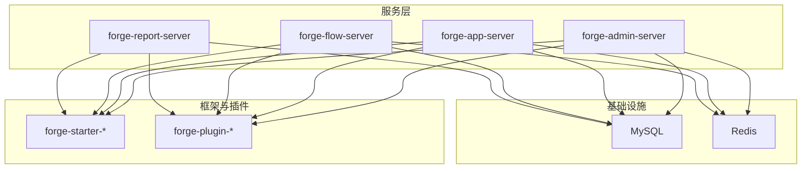
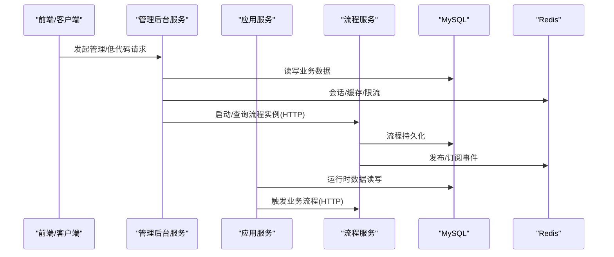
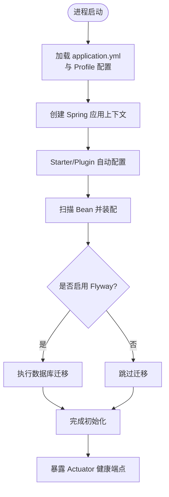
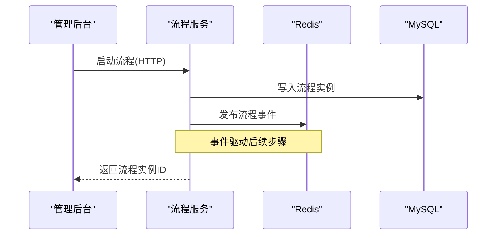
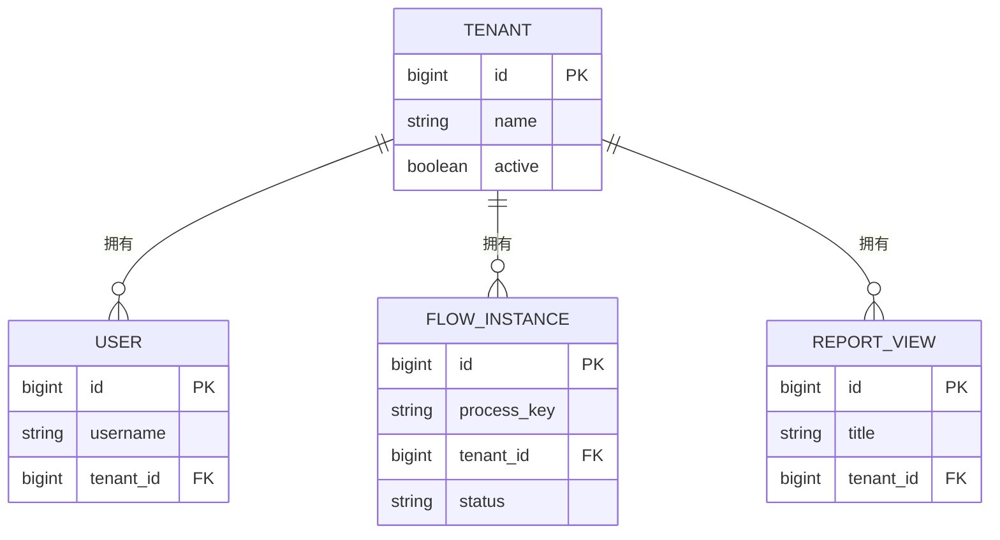
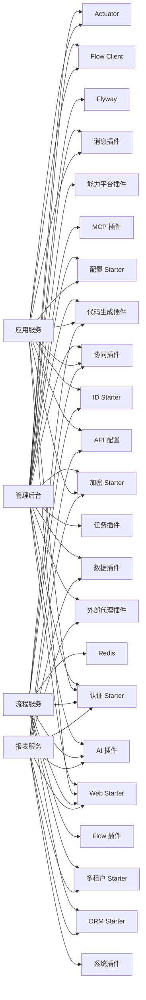

# 服务模块设计

<cite>
**本文引用的文件**
- [forge-admin-server/pom.xml](file://forge-server/forge-admin-server/pom.xml)
- [forge-app-server/pom.xml](file://forge-server/forge-app-server/pom.xml)
- [forge-flow-server/pom.xml](file://forge-server/forge-flow/forge-flow-server/pom.xml)
- [forge-report-server/pom.xml](file://forge-server/forge-report-server/pom.xml)
- [ForgeAdminApplication.java](file://forge-server/forge-admin-server/src/main/java/com/mdframe/forge/admin/ForgeAdminApplication.java)
- [ForgeAppServerApplication.java](file://forge-server/forge-app-server/src/main/java/com/mdframe/forge/app/server/ForgeAppServerApplication.java)
- [ForgeFlowApplication.java](file://forge-server/forge-flow/forge-flow-server/src/main/java/com/mdframe/forge/flow/ForgeFlowApplication.java)
- [ForgeReportApplication.java](file://forge-server/forge-report-server/src/main/java/com/mdframe/forge/report/ForgeReportApplication.java)
- [application.yml（管理后台）](file://forge-server/forge-admin-server/src/main/resources/application.yml)
- [application-dev.example.yml（管理后台开发示例）](file://forge-server/forge-admin-server/src/main/resources/application-dev.example.yml)
- [Dockerfile.admin](file://docker/Dockerfile.admin)
- [docker-compose.yml](file://docker/docker-compose.yml)
</cite>

## 目录
1. [简介](#简介)
2. [项目结构](#项目结构)
3. [核心组件](#核心组件)
4. [架构总览](#架构总览)
5. [详细组件分析](#详细组件分析)
6. [依赖关系分析](#依赖关系分析)
7. [性能与可观测性](#性能与可观测性)
8. [故障排查指南](#故障排查指南)
9. [结论](#结论)
10. [附录：部署与运维要点](#附录部署与运维要点)

## 简介
本设计文档面向 Forge Admin 的服务模块，围绕以下四个服务展开：
- forge-admin-server：主管理后台服务，承载系统管理与低代码平台能力。
- forge-app-server：移动端 API 服务，提供 H5/企微等运行时接口。
- forge-flow：基于 Flowable 的独立流程服务，被其他服务通过 HTTP 调用。
- forge-report-server：AI 数据报表服务，负责可视化大屏后端能力。

本文重点说明各服务的职责边界、Spring Boot 启动与上下文初始化、Bean 装配机制、服务间通信方式（REST、消息、分布式事务）、以及服务发现与注册、负载均衡、熔断降级等治理策略，并给出容器化部署与环境变量管理的运维建议。

## 项目结构
仓库采用多模块 Maven 工程组织，核心服务位于 forge-server 下，每个服务拥有独立的启动类与资源配置；公共能力以插件与 starter 形式沉淀在 forge-framework。

图表来源
- [forge-admin-server/pom.xml:14-154](file://forge-server/forge-admin-server/pom.xml#L14-L154)
- [forge-app-server/pom.xml:16-101](file://forge-server/forge-app-server/pom.xml#L16-L101)
- [forge-flow-server/pom.xml:16-107](file://forge-server/forge-flow/forge-flow-server/pom.xml#L16-L107)
- [forge-report-server/pom.xml:15-83](file://forge-server/forge-report-server/pom.xml#L15-L83)

章节来源
- [forge-admin-server/pom.xml:1-190](file://forge-server/forge-admin-server/pom.xml#L1-L190)
- [forge-app-server/pom.xml:1-136](file://forge-server/forge-app-server/pom.xml#L1-L136)
- [forge-flow-server/pom.xml:1-127](file://forge-server/forge-flow/forge-flow-server/pom.xml#L1-L127)
- [forge-report-server/pom.xml:1-118](file://forge-server/forge-report-server/pom.xml#L1-L118)

## 核心组件
- 管理后台服务（forge-admin-server）
  - 职责：系统管理、低代码平台、能力开放网关、MCP Server、外部代理转发、数据源路由等。
  - 关键依赖：Web、认证、Excel、配置中心、任务调度、ID 生成、加密、消息、协同、代码生成、Flow Client、社交登录、AI、MCP、能力平台、高风险审批、外部代理、数据插件、Flyway、Actuator。
- 应用服务（forge-app-server）
  - 职责：移动端/H5/企微运行时 API，复用已发布低代码配置、动态 CRUD、字段事件与业务动作协议。
  - 关键依赖：Web、认证、配置、ID、加密、消息、协同、代码生成、Flow Client、API 配置、Actuator。
- 流程服务（forge-flow-server）
  - 职责：基于 Flowable 的流程编排与执行，提供 REST 接口供其他服务调用。
  - 关键依赖：Flowable 插件、ORM、多租户、Web、认证、ID、AI、低代码对象适配、企业协同、Redis Pub/Sub。
- 报表服务（forge-report-server）
  - 职责：数据可视化大屏后端，聚合 AI 能力与数据访问能力。
  - 关键依赖：Web、认证、ORM、多租户、API 配置、加密、系统插件、AI、外部代理、数据插件。

章节来源
- [forge-admin-server/pom.xml:14-154](file://forge-server/forge-admin-server/pom.xml#L14-L154)
- [forge-app-server/pom.xml:16-101](file://forge-server/forge-app-server/pom.xml#L16-L101)
- [forge-flow-server/pom.xml:16-107](file://forge-server/forge-flow/forge-flow-server/pom.xml#L16-L107)
- [forge-report-server/pom.xml:15-83](file://forge-server/forge-report-server/pom.xml#L15-L83)

## 架构总览
服务之间通过 RESTful API 进行同步调用，其中管理后台与应用服务通过 Flow Client 调用流程服务；流程服务内部使用 Redis 进行事件发布订阅；所有服务共享 MySQL 与 Redis 作为持久化与缓存中间件。

图表来源
- [application.yml（管理后台）:32-228](file://forge-server/forge-admin-server/src/main/resources/application.yml#L32-L228)
- [Dockerfile.admin:14-38](file://docker/Dockerfile.admin#L14-L38)
- [docker-compose.yml:61-132](file://docker/docker-compose.yml#L61-L132)

## 详细组件分析

### Spring Boot 启动与上下文初始化
- 启动入口
  - 管理后台：通过 @SpringBootApplication 扫描 com.mdframe.forge 包，启用 MyBatis Mapper 扫描与 AspectJ 自动代理。
  - 应用服务：同上，统一扫描范围与代理策略。
  - 流程服务：同样启用扫描与 Mapper 扫描。
  - 报表服务：默认激活 dev profile（若未显式指定）。
- 上下文初始化关键点
  - 通过 Starter 与 Plugin 的自动配置加载 Web、认证、ORM、多租户、加密、消息、协同、AI、MCP、能力平台等能力。
  - 配置文件优先级：application.yml + Profile 配置（如 application-dev.example.yml）+ 环境变量/JVM 参数覆盖。
  - Flyway 迁移：按配置路径执行数据库版本升级。
  - Actuator：暴露健康检查端点用于就绪探测。

图表来源
- [ForgeAdminApplication.java:8-15](file://forge-server/forge-admin-server/src/main/java/com/mdframe/forge/admin/ForgeAdminApplication.java#L8-L15)
- [ForgeAppServerApplication.java:8-15](file://forge-server/forge-app-server/src/main/java/com/mdframe/forge/app/server/ForgeAppServerApplication.java#L8-L15)
- [ForgeFlowApplication.java:12-18](file://forge-server/forge-flow/forge-flow-server/pom.xml#L12-L18)
- [ForgeReportApplication.java:11-23](file://forge-server/forge-report-server/src/main/java/com/mdframe/forge/report/ForgeReportApplication.java#L11-L23)
- [application.yml（管理后台）:65-72](file://forge-server/forge-admin-server/src/main/resources/application.yml#L65-L72)
- [application.yml（管理后台）:220-228](file://forge-server/forge-admin-server/src/main/resources/application.yml#L220-L228)

章节来源
- [ForgeAdminApplication.java:1-18](file://forge-server/forge-admin-server/src/main/java/com/mdframe/forge/admin/ForgeAdminApplication.java#L1-L18)
- [ForgeAppServerApplication.java:1-18](file://forge-server/forge-app-server/src/main/java/com/mdframe/forge/app/server/ForgeAppServerApplication.java#L1-L18)
- [ForgeFlowApplication.java:1-20](file://forge-server/forge-flow/forge-flow-server/src/main/java/com/mdframe/forge/flow/ForgeFlowApplication.java#L1-L20)
- [ForgeReportApplication.java:1-26](file://forge-server/forge-report-server/src/main/java/com/mdframe/forge/report/ForgeReportApplication.java#L1-L26)
- [application.yml（管理后台）:1-228](file://forge-server/forge-admin-server/src/main/resources/application.yml#L1-L228)

### 服务间通信机制
- RESTful API
  - 管理后台与应用服务通过 HTTP 调用流程服务（Flow Client），支持远程 URL、Token 等配置。
  - 报表服务通过系统插件与数据插件访问数据源，并可调用外部代理转发插件。
- 消息队列异步通信
  - 流程服务集成 Redis Pub/Sub 进行事件发布，实现跨服务的事件驱动解耦。
- 分布式事务处理
  - 当前可见配置未引入分布式事务框架；跨服务一致性通过“本地事务 + 最终一致”模式实现（例如流程状态变更与业务数据落库分别在本服务内保证一致性，跨服务通过事件补偿）。

图表来源
- [application.yml（管理后台）:141-146](file://forge-server/forge-admin-server/src/main/resources/application.yml#L141-L146)
- [forge-flow-server/pom.xml:89-93](file://forge-server/forge-flow/forge-flow-server/pom.xml#L89-L93)

章节来源
- [application.yml（管理后台）:134-219](file://forge-server/forge-admin-server/src/main/resources/application.yml#L134-L219)
- [forge-flow-server/pom.xml:89-93](file://forge-server/forge-flow/forge-flow-server/pom.xml#L89-L93)

### 服务发现与注册、负载均衡、熔断降级
- 服务发现与注册
  - 当前仓库未包含 Nacos/Eureka 等注册中心依赖；服务通过 Docker Compose 网络与固定端口进行直连。
- 负载均衡
  - 单实例运行或通过反向代理（Nginx）对外暴露；Compose 中未定义多副本与负载均衡策略。
- 熔断降级
  - 未引入 Sentinel/Hystrix 等熔断组件；可通过外部网关或重试/超时策略保障稳定性。

章节来源
- [docker-compose.yml:61-132](file://docker/docker-compose.yml#L61-L132)
- [Dockerfile.admin:14-38](file://docker/Dockerfile.admin#L14-L38)

### 数据模型与实体关系（概念）
- 管理后台与应用服务均依赖 ORM 与多租户能力，流程服务维护流程相关表；报表服务聚合数据并提供可视化接口。
- 以下为概念性 ER 图，展示典型实体关系（非精确映射）：

[此图为概念示意，不直接对应具体源码结构]

## 依赖关系分析
- 管理后台服务依赖广泛，涵盖 Web、认证、配置、任务、加密、消息、协同、代码生成、Flow Client、AI、MCP、能力平台、外部代理、数据插件、Flyway、Actuator。
- 应用服务聚焦运行时 API，依赖 Web、认证、配置、ID、加密、消息、协同、代码生成、Flow Client、API 配置、Actuator。
- 流程服务专注流程引擎，依赖 Flowable 插件、ORM、多租户、Web、认证、ID、AI、低代码对象适配、协同、Redis。
- 报表服务聚焦数据可视化，依赖 Web、认证、ORM、多租户、API 配置、加密、系统插件、AI、外部代理、数据插件。

图表来源
- [forge-admin-server/pom.xml:14-154](file://forge-server/forge-admin-server/pom.xml#L14-L154)
- [forge-app-server/pom.xml:16-101](file://forge-server/forge-app-server/pom.xml#L16-L101)
- [forge-flow-server/pom.xml:16-107](file://forge-server/forge-flow/forge-flow-server/pom.xml#L16-L107)
- [forge-report-server/pom.xml:15-83](file://forge-server/forge-report-server/pom.xml#L15-L83)

章节来源
- [forge-admin-server/pom.xml:14-154](file://forge-server/forge-admin-server/pom.xml#L14-L154)
- [forge-app-server/pom.xml:16-101](file://forge-server/forge-app-server/pom.xml#L16-L101)
- [forge-flow-server/pom.xml:16-107](file://forge-server/forge-flow/forge-flow-server/pom.xml#L16-L107)
- [forge-report-server/pom.xml:15-83](file://forge-server/forge-report-server/pom.xml#L15-L83)

## 性能与可观测性
- 服务器与线程池
  - 管理后台使用 Undertow，配置 IO 线程与工作线程池，适合高并发场景。
- 连接池与缓存
  - HikariCP 连接池参数可调；Redis 通过 Redisson 配置连接池与超时，提升缓存与锁性能。
- 可观测性
  - Actuator 暴露健康端点，便于容器编排中的就绪探测与监控集成。
- 日志
  - 通过 logback 配置输出级别与日志文件位置，便于问题定位。

章节来源
- [application.yml（管理后台）:2-30](file://forge-server/forge-admin-server/src/main/resources/application.yml#L2-L30)
- [application.yml（管理后台）:220-228](file://forge-server/forge-admin-server/src/main/resources/application.yml#L220-L228)
- [application-dev.example.yml:19-63](file://forge-server/forge-admin-server/src/main/resources/application-dev.example.yml#L19-L63)

## 故障排查指南
- 启动失败
  - 检查数据库与 Redis 连通性；确认环境变量与 Profile 配置正确。
  - 若开启能力开放网关但未启用 Identity 运行底座，可能导致启动失败；需确保依赖模块条件满足。
- 流程调用失败
  - 校验 Flow Client 的远程 URL 与 Token 配置；确认流程服务已启动且端口可达。
- 权限与认证
  - 检查 Sa-Token 与 Redis 配置；确认 Session 存储正常。
- 数据迁移
  - 确认 Flyway 启用与迁移脚本路径；必要时调整 baseline 与历史表名。

章节来源
- [application.yml（管理后台）:65-72](file://forge-server/forge-admin-server/src/main/resources/application.yml#L65-L72)
- [application.yml（管理后台）:118-131](file://forge-server/forge-admin-server/src/main/resources/application.yml#L118-L131)
- [application.yml（管理后台）:141-146](file://forge-server/forge-admin-server/src/main/resources/application.yml#L141-L146)

## 结论
Forge Admin 服务模块通过清晰的职责划分与模块化设计，实现了管理后台、移动端运行时、流程引擎与报表能力的解耦与协作。服务间以 REST 为主、Redis 事件为辅的通信模式，结合 Starter/Plugin 的自动装配机制，降低了集成复杂度。当前部署形态为容器化单实例编排，具备扩展至多实例与引入注册中心、负载均衡、熔断降级的基础。

## 附录：部署与运维要点
- 容器化构建
  - 使用 Dockerfile 构建 JAR 并设置 JVM 内存、Profile、数据库与 Redis 连接参数，以及 Flow Client 地址。
- 编排与服务依赖
  - docker-compose 定义 MySQL、Redis、流程服务、管理后台与前端 Nginx，并通过 depends_on 控制启动顺序。
- 环境变量管理
  - 通过环境变量注入数据库、Redis、加密密钥、能力开关等敏感配置；生产环境建议使用密钥管理服务。
- 安全与合规
  - 加密与能力模块支持 Pepper 与密钥轮换；生产需启用 HTTPS 与严格的 Origin 白名单。

章节来源
- [Dockerfile.admin:14-38](file://docker/Dockerfile.admin#L14-L38)
- [docker-compose.yml:61-132](file://docker/docker-compose.yml#L61-L132)
- [application.yml（管理后台）:151-219](file://forge-server/forge-admin-server/src/main/resources/application.yml#L151-L219)