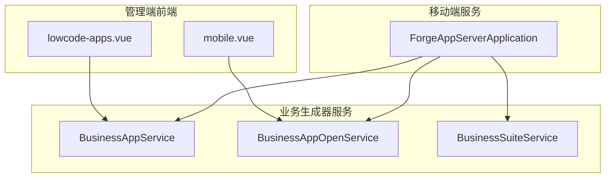
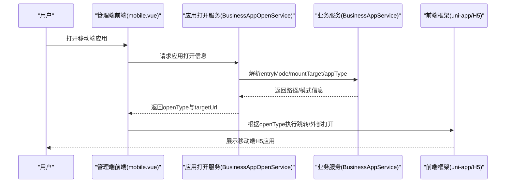
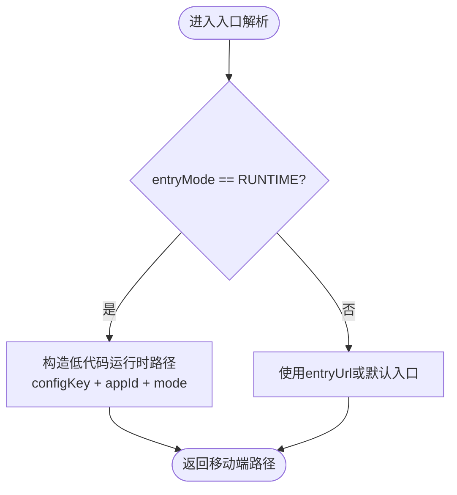
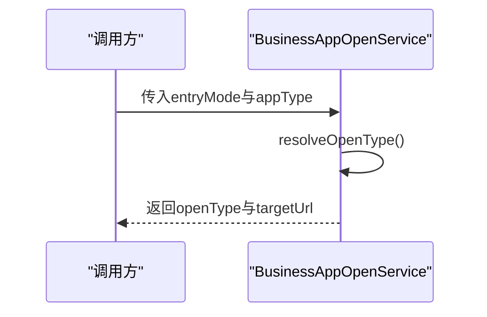
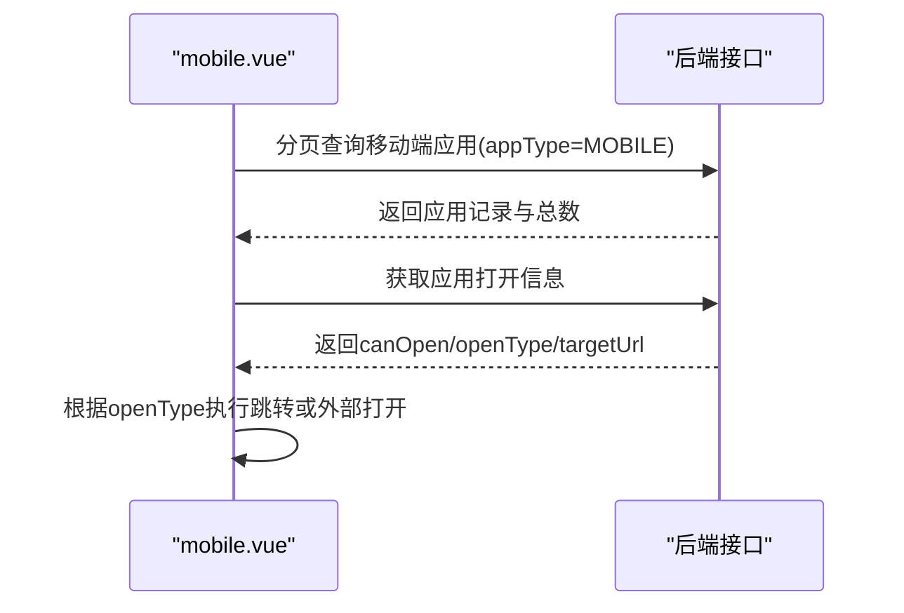
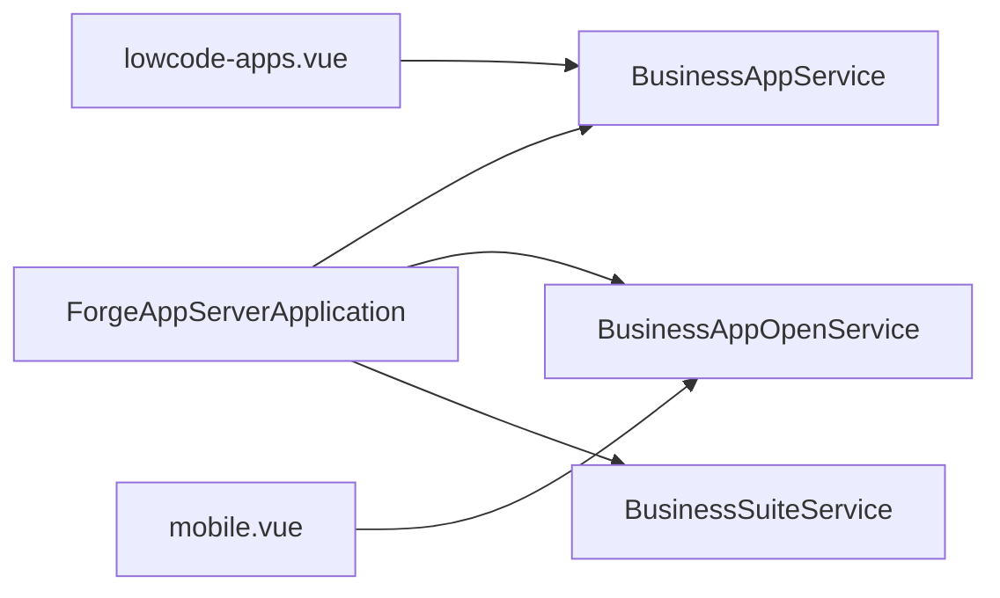

# 移动端服务模块

<cite>
**本文引用的文件**
- [ForgeAppServerApplication.java](file://forge-server/forge-app-server/src/main/java/com/mdframe/forge/app/server/ForgeAppServerApplication.java)
- [BusinessAppService.java](file://forge-server/forge-framework/forge-plugin-parent/forge-plugin-generator/src/main/java/com/mdframe/forge/plugin/generator/service/businessapp/BusinessAppService.java)
- [BusinessAppOpenService.java](file://forge-server/forge-framework/forge-plugin-parent/forge-plugin-generator/src/main/java/com/mdframe/forge/plugin/generator/service/businessapp/BusinessAppOpenService.java)
- [BusinessSuiteService.java](file://forge-server/forge-framework/forge-plugin-parent/forge-plugin-generator/src/main/java/com/mdframe/forge/plugin/generator/service/businessapp/BusinessSuiteService.java)
- [mobile.vue](file://forge-admin-ui/src/views/app-center/mobile.vue)
- [lowcode-apps.vue](file://forge-admin-ui/src/views/ai/lowcode-apps.vue)
</cite>

## 目录
1. [简介](#简介)
2. [项目结构](#项目结构)
3. [核心组件](#核心组件)
4. [架构总览](#架构总览)
5. [详细组件分析](#详细组件分析)
6. [依赖关系分析](#依赖关系分析)
7. [性能考虑](#性能考虑)
8. [故障排查指南](#故障排查指南)
9. [结论](#结论)
10. [附录](#附录)

## 简介
本章节面向 Forge Admin 的移动端服务模块，聚焦 forge-app-server 为移动端 H5 应用提供 API 的服务设计。文档从系统架构、组件职责、数据流与处理逻辑、集成点、错误处理、性能特性等维度展开，并结合代码级图示说明后端如何与前端（uni-app）对接，以及内部服务间通信机制。同时给出移动端安全认证、轻量数据格式、离线同步策略、推送通知、地理位置、设备信息等能力的设计建议与实践路径。

## 项目结构
- 启动入口：forge-app-server 提供 Spring Boot 应用入口，启用扫描与 AOP，并扫描 MyBatis Mapper。
- 业务生成器与服务：通过插件化生成器暴露移动端相关能力，如移动入口解析、挂载目标判定、打开方式选择等。
- 管理端界面：管理端用于配置与应用发布，包含移动端应用列表、分页查询、打开信息获取等。

图表来源
- [ForgeAppServerApplication.java:1-18](file://forge-server/forge-app-server/src/main/java/com/mdframe/forge/app/server/ForgeAppServerApplication.java#L1-L18)
- [BusinessAppService.java:499-526](file://forge-server/forge-framework/forge-plugin-parent/forge-plugin-generator/src/main/java/com/mdframe/forge/plugin/generator/service/businessapp/BusinessAppService.java#L499-L526)
- [BusinessAppOpenService.java:385-417](file://forge-server/forge-framework/forge-plugin-parent/forge-plugin-generator/src/main/java/com/mdframe/forge/plugin/generator/service/businessapp/BusinessAppOpenService.java#L385-L417)
- [BusinessSuiteService.java:463-489](file://forge-server/forge-framework/forge-plugin-parent/forge-plugin-generator/src/main/java/com/mdframe/forge/plugin/generator/service/businessapp/BusinessSuiteService.java#L463-L489)
- [mobile.vue:123-185](file://forge-admin-ui/src/views/app-center/mobile.vue#L123-L185)
- [lowcode-apps.vue:1090-1138](file://forge-admin-ui/src/views/ai/lowcode-apps.vue#L1090-L1138)

章节来源
- [ForgeAppServerApplication.java:1-18](file://forge-server/forge-app-server/src/main/java/com/mdframe/forge/app/server/ForgeAppServerApplication.java#L1-L18)

## 核心组件
- 应用启动器：负责装配 Spring 上下文、AOP 代理、Mapper 扫描，为移动端服务提供运行环境。
- 移动端菜单与入口解析：根据应用的 entryMode、mountTarget、appType 等属性，决定移动端路由与打开方式。
- 应用打开服务：统一计算 openType（H5、ROUTE、IFRAME、EXTERNAL、API），并返回可打开的目标地址或类型。
- 套件与服务聚合：提供移动端挂载目标判断、运行时模式识别、权限标识构建等能力。
- 管理端页面：提供移动端应用的分页查询、详情加载、打开入口控制等交互。

章节来源
- [BusinessAppService.java:499-526](file://forge-server/forge-framework/forge-plugin-parent/forge-plugin-generator/src/main/java/com/mdframe/forge/plugin/generator/service/businessapp/BusinessAppService.java#L499-L526)
- [BusinessAppOpenService.java:385-417](file://forge-server/forge-framework/forge-plugin-parent/forge-plugin-generator/src/main/java/com/mdframe/forge/plugin/generator/service/businessapp/BusinessAppOpenService.java#L385-L417)
- [BusinessSuiteService.java:463-489](file://forge-server/forge-framework/forge-plugin-parent/forge-plugin-generator/src/main/java/com/mdframe/forge/plugin/generator/service/businessapp/BusinessSuiteService.java#L463-L489)
- [mobile.vue:123-185](file://forge-admin-ui/src/views/app-center/mobile.vue#L123-L185)
- [lowcode-apps.vue:1090-1138](file://forge-admin-ui/src/views/ai/lowcode-apps.vue#L1090-L1138)

## 架构总览
移动端 H5 应用通过管理端进行配置与发布，后端由 forge-app-server 提供服务，结合插件化生成器完成移动端菜单、入口与打开方式的计算。管理端前端调用后端接口获取应用列表与打开信息，用户点击后根据 openType 决定跳转或外部打开。

图表来源
- [BusinessAppOpenService.java:385-417](file://forge-server/forge-framework/forge-plugin-parent/forge-plugin-generator/src/main/java/com/mdframe/forge/plugin/generator/service/businessapp/BusinessAppOpenService.java#L385-L417)
- [BusinessAppService.java:499-526](file://forge-server/forge-framework/forge-plugin-parent/forge-plugin-generator/src/main/java/com/mdframe/forge/plugin/generator/service/businessapp/BusinessAppService.java#L499-L526)
- [mobile.vue:123-185](file://forge-admin-ui/src/views/app-center/mobile.vue#L123-L185)

## 详细组件分析

### 应用启动器（ForgeAppServerApplication）
- 作用：初始化 Spring Boot 应用，启用 AOP 代理与 MyBatis Mapper 扫描，为移动端服务提供基础运行环境。
- 关键点：扫描包范围覆盖 forge 相关模块，确保后续生成的控制器、服务、适配器等能被正确发现与注册。

章节来源
- [ForgeAppServerApplication.java:1-18](file://forge-server/forge-app-server/src/main/java/com/mdframe/forge/app/server/ForgeAppServerApplication.java#L1-L18)

### 移动端菜单与入口解析（BusinessAppService）
- 功能：根据 entryMode 与 mountTarget 推导移动端菜单路径；当 entryMode 为 RUNTIME 且存在 configKey 时，构造低代码运行时页面路径，支持 create/detail 模式。
- 移动端挂载：通过 isMobileMount 判断是否挂载到移动端；deriveMountTarget 根据 appType 与 entryMode 推导挂载目标（MOBILE/API/ADMIN）。
- 客户端代码：resolveMenuClientCode 区分 h5 与 pc 客户端代码，便于前端资源加载与路由匹配。

图表来源
- [BusinessAppService.java:499-526](file://forge-server/forge-framework/forge-plugin-parent/forge-plugin-generator/src/main/java/com/mdframe/forge/plugin/generator/service/businessapp/BusinessAppService.java#L499-L526)

章节来源
- [BusinessAppService.java:499-526](file://forge-server/forge-framework/forge-plugin-parent/forge-plugin-generator/src/main/java/com/mdframe/forge/plugin/generator/service/businessapp/BusinessAppService.java#L499-L526)

### 应用打开服务（BusinessAppOpenService）
- 功能：统一计算 openType（H5、ROUTE、IFRAME、EXTERNAL、API），并在特定条件下将 MOBILE+RUNTIME 映射为 H5。
- 权限与租户：在解析过程中尝试读取当前会话权限与租户 ID，保证多租户隔离与权限校验。

图表来源
- [BusinessAppOpenService.java:385-417](file://forge-server/forge-framework/forge-plugin-parent/forge-plugin-generator/src/main/java/com/mdframe/forge/plugin/generator/service/businessapp/BusinessAppOpenService.java#L385-L417)

章节来源
- [BusinessAppOpenService.java:385-417](file://forge-server/forge-framework/forge-plugin-parent/forge-plugin-generator/src/main/java/com/mdframe/forge/plugin/generator/service/businessapp/BusinessAppOpenService.java#L385-L417)

### 套件与服务聚合（BusinessSuiteService）
- 功能：提供移动端挂载目标判断、运行时模式识别、权限标识构建等能力，支撑移动端应用的生命周期管理与权限控制。
- 关键点：isMobileMount 与 deriveMountTarget 共同决定应用是否以移动端形式呈现；buildAppMenuPerms 生成菜单权限标识，便于细粒度授权。

章节来源
- [BusinessSuiteService.java:463-489](file://forge-server/forge-framework/forge-plugin-parent/forge-plugin-generator/src/main/java/com/mdframe/forge/plugin/generator/service/businessapp/BusinessSuiteService.java#L463-L489)

### 管理端前端对接（mobile.vue 与 lowcode-apps.vue）
- mobile.vue：提供移动端应用的分页查询与打开流程，调用后端接口获取应用列表与打开信息，并根据 openType 决定是否外部打开或路由跳转。
- lowcode-apps.vue：展示标准 CRUD 接口约定（page/detail/create/update/delete），便于前后端对齐数据契约。

图表来源
- [mobile.vue:123-185](file://forge-admin-ui/src/views/app-center/mobile.vue#L123-L185)
- [lowcode-apps.vue:1090-1138](file://forge-admin-ui/src/views/ai/lowcode-apps.vue#L1090-L1138)

章节来源
- [mobile.vue:123-185](file://forge-admin-ui/src/views/app-center/mobile.vue#L123-L185)
- [lowcode-apps.vue:1090-1138](file://forge-admin-ui/src/views/ai/lowcode-apps.vue#L1090-L1138)

## 依赖关系分析
- 启动器依赖 Spring Boot 与 MyBatis，扫描 forge 包下的所有组件。
- 业务生成器服务被启动器所在的应用上下文加载，提供移动端菜单、入口与打开方式的能力。
- 管理端前端依赖后端提供的分页与打开信息接口，形成“配置—发布—打开”的闭环。

图表来源
- [ForgeAppServerApplication.java:1-18](file://forge-server/forge-app-server/src/main/java/com/mdframe/forge/app/server/ForgeAppServerApplication.java#L1-L18)
- [BusinessAppService.java:499-526](file://forge-server/forge-framework/forge-plugin-parent/forge-plugin-generator/src/main/java/com/mdframe/forge/plugin/generator/service/businessapp/BusinessAppService.java#L499-L526)
- [BusinessAppOpenService.java:385-417](file://forge-server/forge-framework/forge-plugin-parent/forge-plugin-generator/src/main/java/com/mdframe/forge/plugin/generator/service/businessapp/BusinessAppOpenService.java#L385-L417)
- [BusinessSuiteService.java:463-489](file://forge-server/forge-framework/forge-plugin-parent/forge-plugin-generator/src/main/java/com/mdframe/forge/plugin/generator/service/businessapp/BusinessSuiteService.java#L463-L489)
- [mobile.vue:123-185](file://forge-admin-ui/src/views/app-center/mobile.vue#L123-L185)
- [lowcode-apps.vue:1090-1138](file://forge-admin-ui/src/views/ai/lowcode-apps.vue#L1090-L1138)

章节来源
- [ForgeAppServerApplication.java:1-18](file://forge-server/forge-app-server/src/main/java/com/mdframe/forge/app/server/ForgeAppServerApplication.java#L1-L18)

## 性能考虑
- 数据分页：管理端前端采用分页查询移动端应用，减少首屏数据量，提升加载速度。
- 轻量数据格式：后端应仅返回移动端所需字段，避免冗余传输；对图片等资源采用压缩与懒加载。
- 缓存策略：对不频繁变化的元数据（如菜单、应用配置）进行服务端缓存；前端利用本地存储与网络缓存降低重复请求。
- 连接复用与超时：合理设置 HTTP 连接池与超时时间，避免移动端弱网环境下的阻塞。
- 增量同步：针对离线场景，采用增量更新与冲突合并策略，减少全量同步开销。

[本节为通用性能建议，不直接分析具体文件]

## 故障排查指南
- 打开失败：检查 openType 与 targetUrl 是否正确返回；确认 canOpen 标志位与权限校验结果。
- 路由异常：核对 entryMode 与 mountTarget 的推导逻辑，确保低代码运行时路径参数完整。
- 权限问题：验证 SessionHelper 是否能正常读取权限与租户 ID；必要时增加日志输出定位。
- 前端跳转：确认 uni-app 路由配置与 targetUrl 一致；外部打开需检查浏览器安全策略。

章节来源
- [BusinessAppOpenService.java:385-417](file://forge-server/forge-framework/forge-plugin-parent/forge-plugin-generator/src/main/java/com/mdframe/forge/plugin/generator/service/businessapp/BusinessAppOpenService.java#L385-L417)
- [BusinessAppService.java:499-526](file://forge-server/forge-framework/forge-plugin-parent/forge-plugin-generator/src/main/java/com/mdframe/forge/plugin/generator/service/businessapp/BusinessAppService.java#L499-L526)
- [mobile.vue:123-185](file://forge-admin-ui/src/views/app-center/mobile.vue#L123-L185)

## 结论
forge-app-server 作为移动端服务的启动载体，结合插件化生成器提供的菜单与入口解析能力，实现了移动端 H5 应用的统一接入与管理。通过 openType 的统一计算与前端跳转策略，保证了移动端体验的一致性。建议在后续迭代中完善移动端鉴权、离线同步、推送通知与设备信息采集等能力，进一步提升用户体验与系统健壮性。

[本节为总结性内容，不直接分析具体文件]

## 附录

### 移动端特有 API 接口设计建议
- 轻量数据格式：仅返回必要字段，使用简洁键名；对枚举值使用稳定编码。
- 分页与过滤：统一 page/pageSize 与排序字段；支持按状态、时间范围过滤。
- 错误码规范：统一错误码与消息结构，便于前端统一处理。

[本节为通用设计规范，不直接分析具体文件]

### 移动端安全认证与会话保持
- Token 管理：登录成功后下发 Token，前端在请求头携带；服务端校验 Token 有效性。
- 会话保持：基于 Token 的无状态会话；必要时结合刷新令牌机制延长有效期。
- 安全传输：全站 HTTPS；敏感字段加密传输；防重放与签名校验。

[本节为通用安全建议，不直接分析具体文件]

### 离线数据同步策略
- 增量同步：记录最后同步时间戳，服务端返回变更数据。
- 冲突解决：采用乐观锁或版本号；定义冲突优先级与合并规则。
- 重试与补偿：网络异常时自动重试；失败任务进入队列补偿。

[本节为通用同步策略，不直接分析具体文件]

### 推送通知、地理位置与设备信息
- 推送通知：集成厂商通道（APNs/FCM/华为/小米等），服务端统一推送，前端监听并展示。
- 地理位置：按需获取位置权限；缓存最近位置；支持手动刷新。
- 设备信息：采集设备型号、系统版本、网络状态；用于统计与兼容性处理。

[本节为通用能力建议，不直接分析具体文件]

### 与 uni-app 前端的对接规范与错误处理
- 接口契约：遵循标准 CRUD 约定（page/detail/create/update/delete），统一响应结构。
- 路由对接：根据 openType 决定 uni-app 路由跳转或外部打开；确保路径与参数一致。
- 错误处理：前端统一拦截错误码，提示用户并降级处理；服务端记录错误日志以便排查。

章节来源
- [lowcode-apps.vue:1090-1138](file://forge-admin-ui/src/views/ai/lowcode-apps.vue#L1090-L1138)
- [mobile.vue:123-185](file://forge-admin-ui/src/views/app-center/mobile.vue#L123-L185)