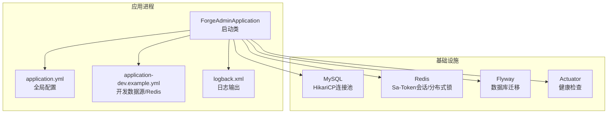
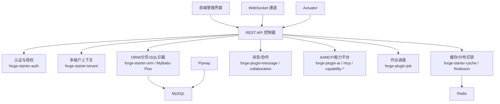
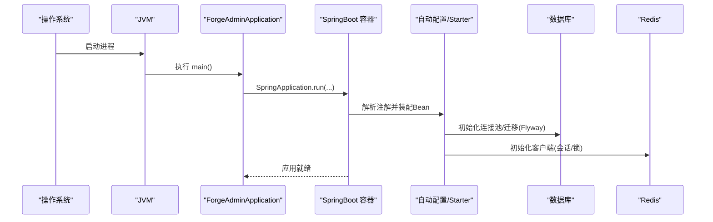
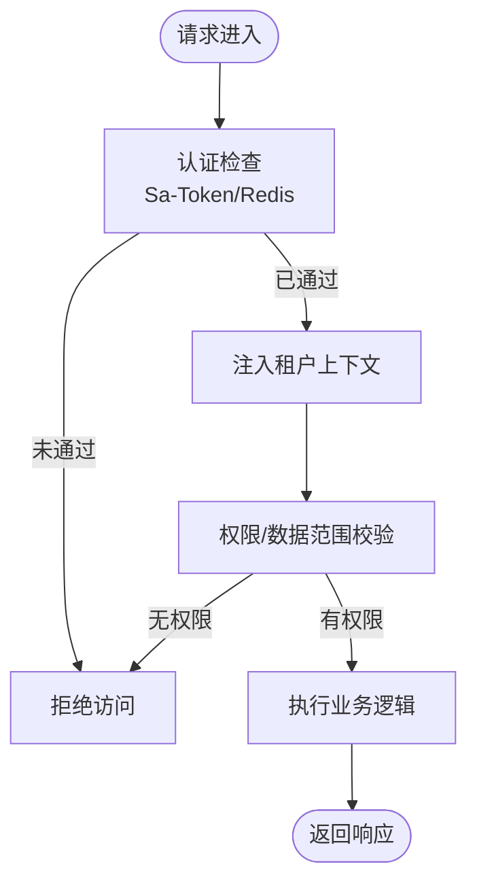
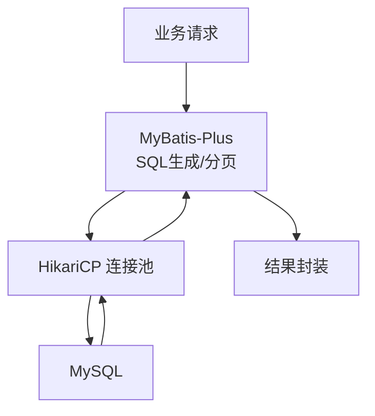
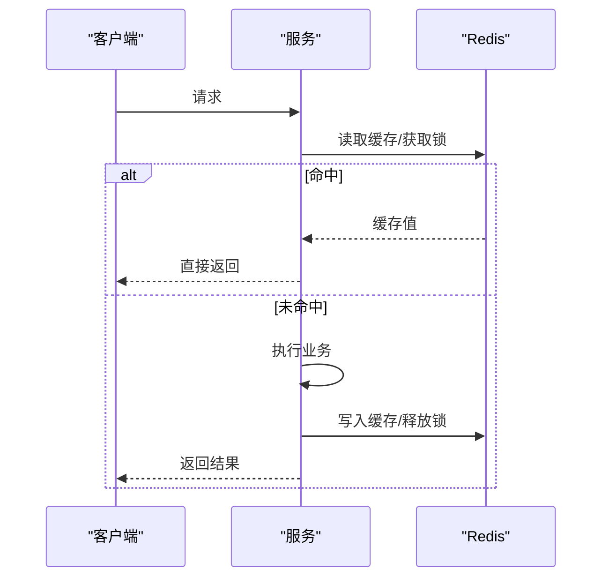
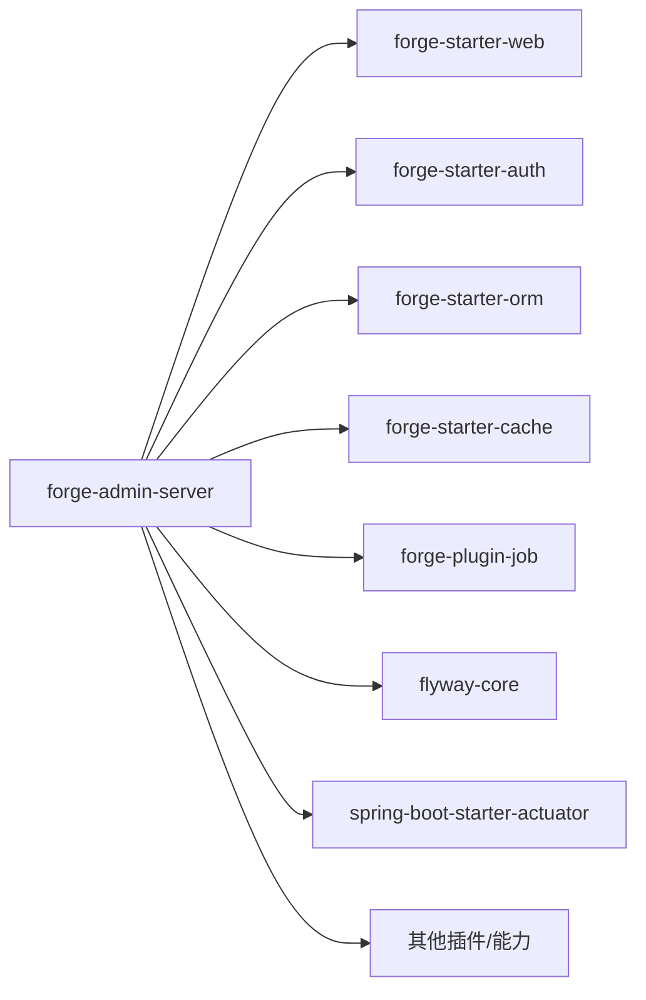

# 管理后台服务模块

<cite>
**本文引用的文件**
- [ForgeAdminApplication.java](file://forge-server/forge-admin-server/src/main/java/com/mdframe/forge/admin/ForgeAdminApplication.java)
- [application.yml](file://forge-server/forge-admin-server/src/main/resources/application.yml)
- [application-dev.example.yml](file://forge-server/forge-admin-server/src/main/resources/application-dev.example.yml)
- [pom.xml](file://forge-server/forge-admin-server/pom.xml)
- [logback.xml](file://forge-server/forge-admin-server/src/main/resources/logback.xml)
- [EmployeeController.java](file://forge-server/forge-admin-server/src/main/java/com/mdframe/forge/employee/controller/EmployeeController.java)
- [LeaveRequestController.java](file://forge-server/forge-admin-server/src/main/java/com/mdframe/forge/leave/controller/LeaveRequestController.java)
- [ReportMockDataController.java](file://forge-server/forge-admin-server/src/main/java/com/mdframe/forge/mock/controller/ReportMockDataController.java)
- [OnlineUserCleanTask.java](file://forge-server/forge-admin-server/src/main/java/com/mdframe/forge/task/OnlineUserCleanTask.java)
</cite>

## 目录
1. [简介](#简介)
2. [项目结构](#项目结构)
3. [核心组件](#核心组件)
4. [架构总览](#架构总览)
5. [详细组件分析](#详细组件分析)
6. [依赖分析](#依赖分析)
7. [性能考虑](#性能考虑)
8. [故障排查指南](#故障排查指南)
9. [结论](#结论)
10. [附录](#附录)

## 简介
本模块为 Forge Admin 的管理后台服务，提供系统管理、低代码平台后端支撑、用户权限控制、租户管理等能力。服务基于 Spring Boot 构建，通过自研 Starter 与插件体系集成认证、缓存、ORM、多租户、消息、协作、AI、MCP、开放网关等能力，并以 RESTful API 对外暴露管理能力，配合 Actuator 进行健康检查与运维监控。

## 项目结构
- 应用入口：Spring Boot 启动类位于 admin 包下，启用扫描、MyBatis Mapper 扫描与 AOP。
- 配置中心：application.yml 集中管理服务器、日志、Flyway、MyBatis-Plus、Sa-Token、能力开关、加密与 Actuator 等；开发环境数据源与 Redis 配置在 application-dev.example.yml。
- 业务示例：员工、请假、报表模拟数据等控制器用于演示 CRUD 与业务流程。
- 任务：在线用户清理定时任务。
- 依赖装配：pom.xml 引入 Web、认证、Excel、配置、ID、加解密、消息、协作、生成器、Flow Client、社交、AI、MCP、能力平台、外部代理、数据、Flyway、Actuator 等依赖。

图表来源
- [ForgeAdminApplication.java:8-15](file://forge-server/forge-admin-server/src/main/java/com/mdframe/forge/admin/ForgeAdminApplication.java#L8-L15)
- [application.yml:1-228](file://forge-server/forge-admin-server/src/main/resources/application.yml#L1-L228)
- [application-dev.example.yml:1-89](file://forge-server/forge-admin-server/src/main/resources/application-dev.example.yml#L1-L89)
- [pom.xml:14-155](file://forge-server/forge-admin-server/pom.xml#L14-L155)

章节来源
- [ForgeAdminApplication.java:8-15](file://forge-server/forge-admin-server/src/main/java/com/mdframe/forge/admin/ForgeAdminApplication.java#L8-L15)
- [application.yml:1-228](file://forge-server/forge-admin-server/src/main/resources/application.yml#L1-L228)
- [application-dev.example.yml:1-89](file://forge-server/forge-admin-server/src/main/resources/application-dev.example.yml#L1-L89)
- [pom.xml:14-155](file://forge-server/forge-admin-server/pom.xml#L14-L155)

## 核心组件
- 应用启动与装配
  - @SpringBootApplication 指定扫描基础包，统一装配各 Starter 与插件。
  - @MapperScan 自动注册 MyBatis Mapper。
  - @EnableAspectJAutoProxy 开启 AOP，支持切面式横切逻辑（如鉴权、审计、限流）。
- 配置与运行期
  - 服务器 Undertow 线程与缓冲参数优化吞吐。
  - Flyway 管理数据库版本演进。
  - Sa-Token 使用 Redis 存储会话，结合 forge-starter-auth 实现认证授权。
  - MyBatis-Plus 配置实体映射、主键策略与 SQL 日志。
  - Actuator 暴露健康检查端点。
- 插件化与 Starter 集成
  - 通过 pom.xml 引入 forge-starter-* 与 forge-plugin-*，以“按需装配”的方式组合能力。
  - 能力开关通过环境变量或配置文件控制，便于灰度与多环境差异化。

章节来源
- [ForgeAdminApplication.java:8-15](file://forge-server/forge-admin-server/src/main/java/com/mdframe/forge/admin/ForgeAdminApplication.java#L8-L15)
- [application.yml:97-153](file://forge-server/forge-admin-server/src/main/resources/application.yml#L97-L153)
- [application.yml:220-228](file://forge-server/forge-admin-server/src/main/resources/application.yml#L220-L228)
- [pom.xml:14-155](file://forge-server/forge-admin-server/pom.xml#L14-L155)

## 架构总览
管理后台服务采用分层与插件化结合的架构：
- 接入层：RESTful API（控制器）与 WebSocket（由 starter/websocket 提供扩展点）。
- 领域层：业务 Service/Mapper/DTO/Entity。
- 基础设施层：Starter/Plugin 提供的认证、缓存、ORM、多租户、消息、协作、AI、MCP、能力平台、外部代理、数据、作业调度等。
- 运行时：Undertow + HikariCP + Redis + MySQL + Flyway + Actuator。

图表来源
- [pom.xml:14-155](file://forge-server/forge-admin-server/pom.xml#L14-L155)
- [application.yml:97-153](file://forge-server/forge-admin-server/src/main/resources/application.yml#L97-L153)
- [application.yml:220-228](file://forge-server/forge-admin-server/src/main/resources/application.yml#L220-L228)

## 详细组件分析

### 应用启动流程与自动装配
- 启动入口：main 方法调用 SpringApplication.run，触发自动配置。
- 扫描范围：@SpringBootApplication 指定 com.mdframe.forge 作为扫描根包，确保 Starter/Plugin 的自动配置类与 Bean 被加载。
- MyBatis 装配：@MapperScan 扫描 mapper 包，注册数据访问接口。
- AOP 启用：@EnableAspectJAutoProxy 开启基于类的代理，支持注解式切面。

图表来源
- [ForgeAdminApplication.java:8-15](file://forge-server/forge-admin-server/src/main/java/com/mdframe/forge/admin/ForgeAdminApplication.java#L8-L15)
- [application.yml:65-72](file://forge-server/forge-admin-server/src/main/resources/application.yml#L65-L72)
- [application.yml:118-131](file://forge-server/forge-admin-server/src/main/resources/application.yml#L118-L131)

章节来源
- [ForgeAdminApplication.java:8-15](file://forge-server/forge-admin-server/src/main/java/com/mdframe/forge/admin/ForgeAdminApplication.java#L8-L15)

### 认证、权限与多租户
- 认证与会话：Sa-Token 通过 alone-redis 将会话持久化到 Redis，结合 forge-starter-auth 完成登录、鉴权、权限校验。
- 多租户：通过 forge-starter-tenant 与业务配置项（如 business.datasource.tenant-routing-enabled-default）控制租户路由默认行为。
- 安全增强：crypto 模块提供密钥管理与敏感数据处理；open-gateway 提供统一开放网关与限流、幂等保护。

图表来源
- [application.yml:118-131](file://forge-server/forge-admin-server/src/main/resources/application.yml#L118-L131)
- [application.yml:215-218](file://forge-server/forge-admin-server/src/main/resources/application.yml#L215-L218)

章节来源
- [application.yml:118-131](file://forge-server/forge-admin-server/src/main/resources/application.yml#L118-L131)
- [application.yml:215-218](file://forge-server/forge-admin-server/src/main/resources/application.yml#L215-L218)

### 数据访问与数据库迁移
- ORM：MyBatis-Plus 配置实体扫描、驼峰映射、主键策略、SQL 日志；通过 starter/orm 增强拦截与分页。
- 连接池：HikariCP 最大连接数、空闲超时、生命周期等参数可调。
- 迁移：Flyway 按位置扫描脚本，支持基线版本与表名自定义。

图表来源
- [application.yml:97-117](file://forge-server/forge-admin-server/src/main/resources/application.yml#L97-L117)
- [application-dev.example.yml:1-34](file://forge-server/forge-admin-server/src/main/resources/application-dev.example.yml#L1-L34)
- [application.yml:65-72](file://forge-server/forge-admin-server/src/main/resources/application.yml#L65-L72)

章节来源
- [application.yml:97-117](file://forge-server/forge-admin-server/src/main/resources/application.yml#L97-L117)
- [application-dev.example.yml:1-34](file://forge-server/forge-admin-server/src/main/resources/application-dev.example.yml#L1-L34)
- [application.yml:65-72](file://forge-server/forge-admin-server/src/main/resources/application.yml#L65-L72)

### 缓存与分布式能力
- 缓存：starter/cache 提供声明式缓存能力；Redisson 用于分布式锁与集群模式扩展。
- 会话：Sa-Token 会话存于 Redis，支持跨实例共享。
- 限流与幂等：open-gateway 提供读/写令牌桶限流与幂等快照保留。

图表来源
- [application.yml:118-131](file://forge-server/forge-admin-server/src/main/resources/application.yml#L118-L131)
- [application-dev.example.yml:35-63](file://forge-server/forge-admin-server/src/main/resources/application-dev.example.yml#L35-L63)
- [application.yml:192-199](file://forge-server/forge-admin-server/src/main/resources/application.yml#L192-L199)

章节来源
- [application.yml:118-131](file://forge-server/forge-admin-server/src/main/resources/application.yml#L118-L131)
- [application-dev.example.yml:35-63](file://forge-server/forge-admin-server/src/main/resources/application-dev.example.yml#L35-L63)
- [application.yml:192-199](file://forge-server/forge-admin-server/src/main/resources/application.yml#L192-L199)

### 文件存储与上传
- 上传限制：单文件与请求体大小在 application.yml 中配置。
- 存储方案：starter/file 提供统一文件抽象，可对接本地、对象存储或 RustFS 等后端（具体策略由 starter 与配置决定）。

章节来源
- [application.yml:42-48](file://forge-server/forge-admin-server/src/main/resources/application.yml#L42-L48)

### 实时通信（WebSocket）
- 能力来源：starter/websocket 提供 WebSocket 自动装配与安全集成扩展点。
- 典型用法：在业务模块中注册处理器与拦截器，结合认证上下文实现房间级广播与鉴权。

章节来源
- [pom.xml:14-155](file://forge-server/forge-admin-server/pom.xml#L14-L155)

### 作业调度与异步处理
- 作业：forge-plugin-job 提供作业定义与调度能力，可通过注解或配置编排任务。
- 示例：OnlineUserCleanTask 演示在线用户清理任务的挂载方式。

章节来源
- [OnlineUserCleanTask.java](file://forge-server/forge-admin-server/src/main/java/com/mdframe/forge/task/OnlineUserCleanTask.java)
- [pom.xml:47-50](file://forge-server/forge-admin-server/pom.xml#L47-L50)

### RESTful API 设计模式与统一异常
- 控制器组织：按领域划分 controller 包，职责单一，便于维护与测试。
- 统一响应与异常：starter/core 通常提供统一响应体与全局异常处理；结合日志切面记录关键路径。
- 日志规范：logback.xml 与 application.yml 中的 logging.level 控制输出级别与目标。

章节来源
- [EmployeeController.java](file://forge-server/forge-admin-server/src/main/java/com/mdframe/forge/employee/controller/EmployeeController.java)
- [LeaveRequestController.java](file://forge-server/forge-admin-server/src/main/java/com/mdframe/forge/leave/controller/LeaveRequestController.java)
- [ReportMockDataController.java](file://forge-server/forge-admin-server/src/main/java/com/mdframe/forge/mock/controller/ReportMockDataController.java)
- [application.yml:23-30](file://forge-server/forge-admin-server/src/main/resources/application.yml#L23-L30)
- [logback.xml](file://forge-server/forge-admin-server/src/main/resources/logback.xml)

### 与前端交互协议
- 认证：通过 Sa-Token 签发/校验 Token，前端在请求头携带凭证。
- 数据格式：JSON，日期格式化由 Jackson 配置；统一响应体由 starter 约定。
- 文件上传：multipart/form-data，受 max-file-size 与 max-request-size 限制。
- 实时：WebSocket 通道用于通知、协作等场景。

章节来源
- [application.yml:54-64](file://forge-server/forge-admin-server/src/main/resources/application.yml#L54-L64)
- [application.yml:42-48](file://forge-server/forge-admin-server/src/main/resources/application.yml#L42-L48)

## 依赖分析
- 核心依赖
  - Web：spring-boot-starter-web 与 undertow 线程模型。
  - 认证：forge-starter-auth + Sa-Token + Redis。
  - ORM：MyBatis-Plus + HikariCP + MySQL。
  - 缓存：starter/cache + Redisson。
  - 迁移：Flyway。
  - 监控：Actuator。
  - 能力：AI、MCP、能力平台、外部代理、消息、协作、作业、Excel、ID、加解密、社交等。
- 依赖关系图

图表来源
- [pom.xml:14-155](file://forge-server/forge-admin-server/pom.xml#L14-L155)

章节来源
- [pom.xml:14-155](file://forge-server/forge-admin-server/pom.xml#L14-L155)

## 性能考虑
- 服务器
  - Undertow IO 线程与 worker 线程池根据 CPU 与负载调优。
  - 关闭不必要的调试日志，仅保留必要级别。
- 数据库
  - HikariCP 连接池大小、空闲与生命周期参数按 QPS 与并发调整。
  - 批处理语句重写已开启，注意批量操作对数据库的影响。
- 缓存
  - 合理设置缓存 TTL 与失效策略，避免雪崩与穿透。
  - 分布式锁粒度尽量小，减少竞争。
- 迁移
  - Flyway 基线与增量脚本分离，生产谨慎回滚策略。
- 监控
  - Actuator 仅暴露 health，避免泄露内部信息。

章节来源
- [application.yml:8-21](file://forge-server/forge-admin-server/src/main/resources/application.yml#L8-L21)
- [application.yml:23-30](file://forge-server/forge-admin-server/src/main/resources/application.yml#L23-L30)
- [application-dev.example.yml:19-34](file://forge-server/forge-admin-server/src/main/resources/application-dev.example.yml#L19-L34)
- [application.yml:220-228](file://forge-server/forge-admin-server/src/main/resources/application.yml#L220-L228)

## 故障排查指南
- 启动失败
  - 检查数据库连接、Redis 地址与密码是否正确。
  - 确认 Flyway 迁移脚本是否存在且可执行。
- 认证失败
  - 核对 Sa-Token Redis 配置与网络连通性。
  - 检查 Token 是否过期或跨域问题。
- 性能瓶颈
  - 观察 Undertow 线程池与 HikariCP 连接池使用情况。
  - 定位慢 SQL 与热点缓存键。
- 日志定位
  - 调整 logging.level 提升详细度，结合 logback.xml 输出到文件。
  - 关注错误堆栈与上下文信息。

章节来源
- [application.yml:23-30](file://forge-server/forge-admin-server/src/main/resources/application.yml#L23-L30)
- [application-dev.example.yml:1-89](file://forge-server/forge-admin-server/src/main/resources/application-dev.example.yml#L1-L89)
- [logback.xml](file://forge-server/forge-admin-server/src/main/resources/logback.xml)

## 结论
Forge Admin 管理后台服务以 Spring Boot 为核心，借助 Starter 与插件体系实现了开箱即用的认证、缓存、ORM、多租户、消息、协作、AI、MCP、能力平台与作业调度等能力。通过合理的配置与监控手段，可在保证安全与可扩展性的同时，满足高并发与易运维的生产需求。

## 附录
- 关键配置项速查
  - 服务器：端口、上下文路径、Undertow 线程与缓冲。
  - 日志：级别与配置文件路径。
  - 数据库：动态数据源、HikariCP 参数、MyBatis-Plus 配置。
  - 缓存：Redis 地址、Redisson 配置。
  - 迁移：Flyway 位置、基线版本。
  - 认证：Sa-Token Redis 配置。
  - 能力：AI/MCP/开放网关开关与令牌策略。
  - 监控：Actuator 健康端点。

章节来源
- [application.yml:1-228](file://forge-server/forge-admin-server/src/main/resources/application.yml#L1-L228)
- [application-dev.example.yml:1-89](file://forge-server/forge-admin-server/src/main/resources/application-dev.example.yml#L1-L89)