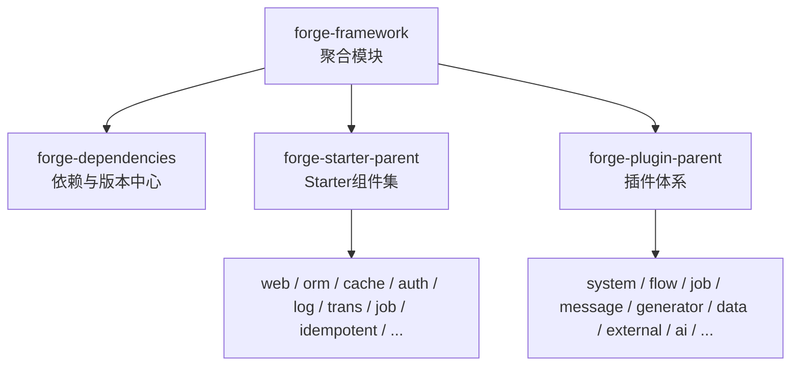
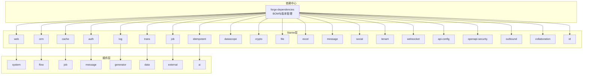
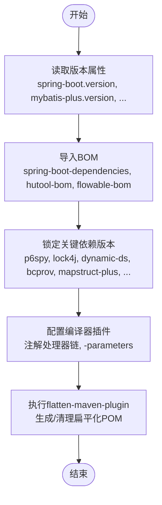
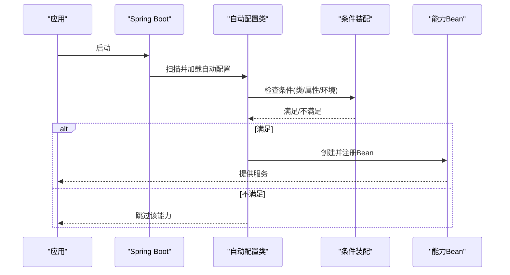
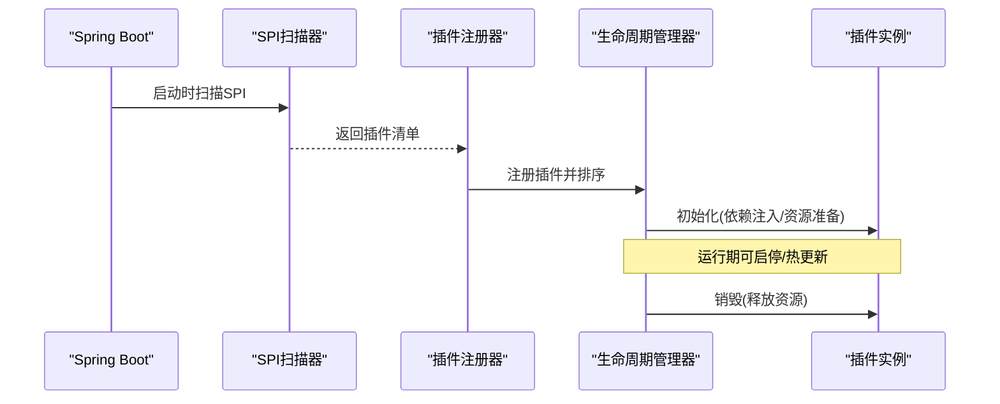
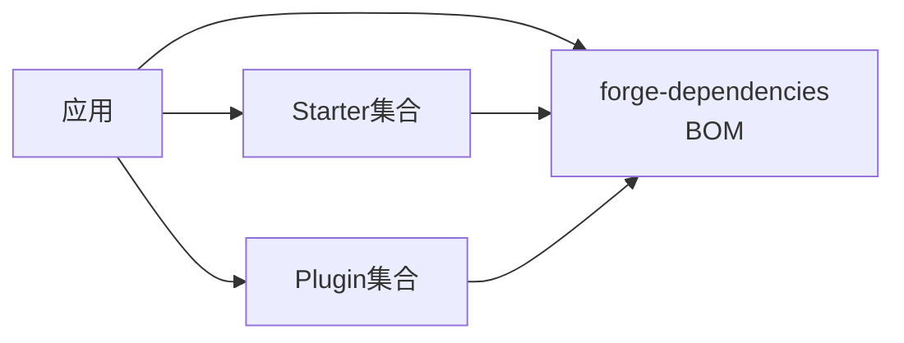

# 框架层设计

<cite>
**本文引用的文件**
- [forge-framework/pom.xml](file://forge-server/forge-framework/pom.xml)
- [forge-dependencies/pom.xml](file://forge-server/forge-framework/forge-dependencies/pom.xml)
- [forge-starter-parent/pom.xml](file://forge-server/forge-framework/forge-starter-parent/pom.xml)
- [forge-plugin-parent/pom.xml](file://forge-server/forge-framework/forge-plugin-parent/pom.xml)
- [forge-starter-core/pom.xml](file://forge-server/forge-framework/forge-starter-parent/forge-starter-core/pom.xml)
- [forge-starter-web/pom.xml](file://forge-server/forge-framework/forge-starter-parent/forge-starter-web/pom.xml)
- [forge-starter-auth/pom.xml](file://forge-server/forge-framework/forge-starter-parent/forge-starter-auth/pom.xml)
- [forge-starter-log/pom.xml](file://forge-server/forge-framework/forge-starter-parent/forge-starter-log/pom.xml)
- [forge-starter-orm/pom.xml](file://forge-server/forge-framework/forge-starter-parent/forge-starter-orm/pom.xml)
- [forge-starter-config/pom.xml](file://forge-server/forge-framework/forge-starter-parent/forge-starter-config/pom.xml)
- [forge-starter-cache/pom.xml](file://forge-server/forge-framework/forge-starter-parent/forge-starter-cache/pom.xml)
- [forge-starter-trans/pom.xml](file://forge-server/forge-framework/forge-starter-parent/forge-starter-trans/pom.xml)
- [forge-starter-job/pom.xml](file://forge-server/forge-framework/forge-starter-parent/forge-starter-job/pom.xml)
- [forge-starter-idempotent/pom.xml](file://forge-server/forge-framework/forge-starter-parent/forge-starter-idempotent/pom.xml)
- [forge-starter-datascope/pom.xml](file://forge-server/forge-framework/forge-starter-parent/forge-starter-datascope/pom.xml)
- [forge-starter-crypto/pom.xml](file://forge-server/forge-framework/forge-starter-parent/forge-starter-crypto/pom.xml)
- [forge-starter-file/pom.xml](file://forge-server/forge-framework/forge-starter-parent/forge-starter-file/pom.xml)
- [forge-starter-excel/pom.xml](file://forge-server/forge-framework/forge-starter-parent/forge-starter-excel/pom.xml)
- [forge-starter-message/pom.xml](file://forge-server/forge-framework/forge-starter-parent/forge-starter-message/pom.xml)
- [forge-starter-social/pom.xml](file://forge-server/forge-framework/forge-starter-parent/forge-starter-social/pom.xml)
- [forge-starter-tenant/pom.xml](file://forge-server/forge-framework/forge-starter-parent/forge-starter-tenant/pom.xml)
- [forge-starter-websocket/pom.xml](file://forge-server/forge-framework/forge-starter-parent/forge-starter-websocket/pom.xml)
- [forge-starter-api-config/pom.xml](file://forge-server/forge-framework/forge-starter-parent/forge-starter-api-config/pom.xml)
- [forge-starter-openapi-security/pom.xml](file://forge-server/forge-framework/forge-starter-parent/forge-starter-openapi-security/pom.xml)
- [forge-starter-outbound/pom.xml](file://forge-server/forge-framework/forge-starter-parent/forge-starter-outbound/pom.xml)
- [forge-starter-collaboration/pom.xml](file://forge-server/forge-framework/forge-starter-parent/forge-starter-collaboration/pom.xml)
- [forge-starter-id/pom.xml](file://forge-server/forge-framework/forge-starter-parent/forge-starter-id/pom.xml)
- [forge-plugin-system/pom.xml](file://forge-server/forge-framework/forge-plugin-parent/forge-plugin-system/pom.xml)
- [forge-plugin-flow/pom.xml](file://forge-server/forge-framework/forge-plugin-parent/forge-plugin-flow/pom.xml)
- [forge-plugin-job/pom.xml](file://forge-server/forge-framework/forge-plugin-parent/forge-plugin-job/pom.xml)
- [forge-plugin-message/pom.xml](file://forge-server/forge-framework/forge-plugin-parent/forge-plugin-message/pom.xml)
- [forge-plugin-generator/pom.xml](file://forge-server/forge-framework/forge-plugin-parent/forge-plugin-generator/pom.xml)
- [forge-plugin-data/pom.xml](file://forge-server/forge-framework/forge-plugin-parent/forge-plugin-data/pom.xml)
- [forge-plugin-external/pom.xml](file://forge-server/forge-framework/forge-plugin-parent/forge-plugin-external/pom.xml)
- [forge-plugin-ai/pom.xml](file://forge-server/forge-framework/forge-plugin-parent/forge-plugin-ai/pom.xml)
</cite>

## 目录
1. [简介](#简介)
2. [项目结构](#项目结构)
3. [核心组件](#核心组件)
4. [架构总览](#架构总览)
5. [详细组件分析](#详细组件分析)
6. [依赖关系分析](#依赖关系分析)
7. [性能考量](#性能考量)
8. [故障排查指南](#故障排查指南)
9. [结论](#结论)
10. [附录](#附录)

## 简介
本文件面向Forge Admin的框架层设计，聚焦forge-framework模块的三层架构：
- forge-dependencies：统一依赖与版本管理（BOM），收敛第三方库版本，降低冲突风险。
- forge-starter-parent：Starter组件体系，提供可插拔的基础能力（Web、ORM、缓存、安全、日志、事务、任务等）。
- forge-plugin-parent：插件体系，实现业务功能模块化（系统、流程、消息、作业、生成器、数据、外部集成、AI等）。

文档将详细说明Maven多模块构建配置、依赖版本控制策略、编译插件配置（Lombok、MapStruct-Plus等），并解释Starter组件的自动配置、条件装配、SPI机制等核心技术；同时描述插件系统的注册机制、生命周期管理、依赖注入与扩展点设计；最后覆盖横切关注点的封装与复用（异常处理、日志、监控、安全认证等）。

## 项目结构
forge-framework采用三层分层组织：
- 顶层聚合模块：forge-framework，声明子模块与统一的编译/版本策略。
- 依赖中心：forge-dependencies，集中声明所有第三方依赖及版本，并通过dependencyManagement对外暴露。
- Starter与Plugin两大子域：
  - starter：以“能力”为粒度拆分，每个starter通过Spring Boot自动装配对外暴露能力。
  - plugin：以“业务域”为粒度拆分，基于SPI与扩展点实现可插拔的业务能力。

图表来源
- [forge-framework/pom.xml:30-34](file://forge-server/forge-framework/pom.xml#L30-L34)

章节来源
- [forge-framework/pom.xml:1-121](file://forge-server/forge-framework/pom.xml#L1-L121)

## 核心组件
- 依赖管理（forge-dependencies）
  - 统一管理Spring Boot、MyBatis-Plus、Sa-Token、Redisson、Flowable、EasyExcel、Hutool、Undertow、SMS4J等关键依赖版本。
  - 通过BOM导入spring-boot-dependencies与hutool-bom、flowable-bom，确保生态内版本一致。
  - 集中声明框架自研starter与plugin的版本，便于上层应用按需引入。
- Starter组件（forge-starter-parent）
  - 按能力拆分为独立starter，如web、orm、cache、auth、log、trans、job、idempotent、datascope、crypto、file、excel、message、social、tenant、websocket、api-config、openapi-security、outbound、collaboration、id等。
  - 每个starter遵循Spring Boot自动装配约定，通过@AutoConfiguration、@ConditionalOnXxx、SPI（META-INF/spring/org.springframework.boot.autoconfigure.AutoConfiguration.imports）进行条件化装配。
- 插件体系（forge-plugin-parent）
  - 按业务域拆分为system、flow、job、message、generator、data、external、ai等插件。
  - 插件通过SPI暴露扩展点，由框架在启动期扫描并注册，支持热插拔与组合编排。

章节来源
- [forge-dependencies/pom.xml:13-73](file://forge-server/forge-framework/forge-dependencies/pom.xml#L13-L73)
- [forge-dependencies/pom.xml:75-527](file://forge-server/forge-framework/forge-dependencies/pom.xml#L75-L527)
- [forge-starter-parent/pom.xml](file://forge-server/forge-framework/forge-starter-parent/pom.xml)
- [forge-plugin-parent/pom.xml](file://forge-server/forge-framework/forge-plugin-parent/pom.xml)

## 架构总览
整体采用“依赖中心 + Starter + Plugin”的分层模式：
- 依赖中心负责版本收敛与生态对齐，避免版本漂移。
- Starter提供横切能力，通过自动装配与条件装配最小化接入成本。
- Plugin承载业务域能力，通过SPI与扩展点实现解耦与可插拔。

图表来源
- [forge-dependencies/pom.xml:75-527](file://forge-server/forge-framework/forge-dependencies/pom.xml#L75-L527)
- [forge-starter-parent/pom.xml](file://forge-server/forge-framework/forge-starter-parent/pom.xml)
- [forge-plugin-parent/pom.xml](file://forge-server/forge-framework/forge-plugin-parent/pom.xml)

## 详细组件分析

### 依赖管理与构建配置（forge-dependencies）
- 版本策略
  - 通过properties集中声明各组件版本（如Spring Boot、MyBatis-Plus、Sa-Token、Redisson、Flowable、EasyExcel、Hutool、Undertow、SMS4J等）。
  - 使用BOM导入spring-boot-dependencies、hutool-bom、flowable-bom，保证生态内版本一致性。
- 依赖声明
  - 对常用三方库进行显式版本锁定（如p6spy、lock4j、dynamic-ds、bcprov、mapstruct-plus、ip2region、fastjson2、uid-generator等）。
  - 对框架自研starter与plugin进行版本声明，供上层应用按需引入。
- 构建插件
  - maven-compiler-plugin：启用注解处理器链（therapi-runtime-javadoc-scribe、lombok、spring-boot-configuration-processor、mapstruct-plus-processor、lombok-mapstruct-binding），并开启参数保留（-parameters）。
  - flatten-maven-plugin：在process-resources阶段生成扁平化POM，clean阶段清理，便于CI友好发布。

图表来源
- [forge-dependencies/pom.xml:13-73](file://forge-server/forge-framework/forge-dependencies/pom.xml#L13-L73)
- [forge-dependencies/pom.xml:75-527](file://forge-server/forge-framework/forge-dependencies/pom.xml#L75-L527)
- [forge-dependencies/pom.xml:529-598](file://forge-server/forge-framework/forge-dependencies/pom.xml#L529-L598)

章节来源
- [forge-dependencies/pom.xml:13-73](file://forge-server/forge-framework/forge-dependencies/pom.xml#L13-L73)
- [forge-dependencies/pom.xml:75-527](file://forge-server/forge-framework/forge-dependencies/pom.xml#L75-L527)
- [forge-dependencies/pom.xml:529-598](file://forge-server/forge-framework/forge-dependencies/pom.xml#L529-L598)

### Starter组件体系（forge-starter-parent）
- 设计目标
  - 将横切能力按领域拆分为独立starter，遵循“单一职责、可插拔、零侵入”原则。
  - 通过Spring Boot自动装配与条件装配，使应用仅引入所需starter即可启用能力。
- 典型Starter与职责
  - web：Web基础能力（请求处理、响应包装、全局异常、跨域、序列化等）。
  - orm：数据库访问（MyBatis-Plus、动态数据源、SQL性能分析、分页、审计等）。
  - cache：缓存抽象（Redis/本地缓存、序列化、分布式锁等）。
  - auth：认证授权（Sa-Token集成、JWT、会话管理、权限校验等）。
  - log：日志记录（结构化日志、链路追踪、脱敏、采样等）。
  - trans：事务管理（声明式事务、分布式事务协调等）。
  - job：任务调度（定时任务、重试、幂等、监控等）。
  - idempotent：接口幂等（防重放、去重键、状态机等）。
  - datascope：数据权限（行级数据范围控制）。
  - crypto：加解密（国密/对称/非对称、密钥管理等）。
  - file/excel：文件与表格（上传下载、导出导入、流式处理等）。
  - message/social/tenant/websocket/api-config/openapi-security/outbound/collaboration/id：其他横切能力。
- 自动装配与条件装配
  - 通过@AutoConfiguration标注配置类，结合@ConditionalOnClass/@ConditionalOnProperty等实现按需加载。
  - 通过SPI（META-INF/spring/org.springframework.boot.autoconfigure.AutoConfiguration.imports）声明自动配置类，由Spring Boot在启动时加载。
- 依赖注入与扩展点
  - 使用Spring容器进行依赖注入，通过接口+默认实现+自定义替换的方式提供扩展点。
  - 对于需要运行时扩展的能力，提供SPI接口与默认实现，允许用户通过配置文件或代码注册自定义实现。

图表来源
- [forge-starter-core/pom.xml](file://forge-server/forge-framework/forge-starter-parent/forge-starter-core/pom.xml)
- [forge-starter-web/pom.xml](file://forge-server/forge-framework/forge-starter-parent/forge-starter-web/pom.xml)
- [forge-starter-auth/pom.xml](file://forge-server/forge-framework/forge-starter-parent/forge-starter-auth/pom.xml)
- [forge-starter-log/pom.xml](file://forge-server/forge-framework/forge-starter-parent/forge-starter-log/pom.xml)
- [forge-starter-orm/pom.xml](file://forge-server/forge-framework/forge-starter-parent/forge-starter-orm/pom.xml)

章节来源
- [forge-starter-parent/pom.xml](file://forge-server/forge-framework/forge-starter-parent/pom.xml)
- [forge-starter-core/pom.xml](file://forge-server/forge-framework/forge-starter-parent/forge-starter-core/pom.xml)
- [forge-starter-web/pom.xml](file://forge-server/forge-framework/forge-starter-parent/forge-starter-web/pom.xml)
- [forge-starter-auth/pom.xml](file://forge-server/forge-framework/forge-starter-parent/forge-starter-auth/pom.xml)
- [forge-starter-log/pom.xml](file://forge-server/forge-framework/forge-starter-parent/forge-starter-log/pom.xml)
- [forge-starter-orm/pom.xml](file://forge-server/forge-framework/forge-starter-parent/forge-starter-orm/pom.xml)

### 插件体系（forge-plugin-parent）
- 设计目标
  - 将业务能力按领域拆分为插件，支持按需启用、组合编排与独立演进。
- 典型插件与职责
  - system：系统管理（用户、角色、菜单、字典等）。
  - flow：工作流（Flowable集成、模型定义、审批流、回调等）。
  - job：作业管理（任务注册、调度、监控、告警等）。
  - message：消息中心（站内信、邮件、短信、推送等）。
  - generator：代码生成（模板引擎、CRUD生成、API生成等）。
  - data：数据服务（数据建模、查询构建、报表等）。
  - external：外部集成（第三方API、网关、适配器）。
  - ai：AI能力（模型接入、提示词、工具调用等）。
- 注册机制与生命周期
  - 启动期：通过SPI扫描插件元信息，解析依赖关系，完成插件注册与初始化。
  - 运行期：根据配置启用/禁用插件，支持热更新与动态扩展。
  - 销毁期：释放资源、关闭连接、清理上下文。
- 依赖注入与扩展点
  - 插件内部使用Spring容器进行依赖注入。
  - 通过SPI暴露扩展点，允许用户实现自定义逻辑并注册到框架。

图表来源
- [forge-plugin-system/pom.xml](file://forge-server/forge-framework/forge-plugin-parent/forge-plugin-system/pom.xml)
- [forge-plugin-flow/pom.xml](file://forge-server/forge-framework/forge-plugin-parent/forge-plugin-flow/pom.xml)
- [forge-plugin-job/pom.xml](file://forge-server/forge-framework/forge-plugin-parent/forge-plugin-job/pom.xml)
- [forge-plugin-message/pom.xml](file://forge-server/forge-framework/forge-plugin-parent/forge-plugin-message/pom.xml)
- [forge-plugin-generator/pom.xml](file://forge-server/forge-framework/forge-plugin-parent/forge-plugin-generator/pom.xml)
- [forge-plugin-data/pom.xml](file://forge-server/forge-framework/forge-plugin-parent/forge-plugin-data/pom.xml)
- [forge-plugin-external/pom.xml](file://forge-server/forge-framework/forge-plugin-parent/forge-plugin-external/pom.xml)
- [forge-plugin-ai/pom.xml](file://forge-server/forge-framework/forge-plugin-parent/forge-plugin-ai/pom.xml)

章节来源
- [forge-plugin-parent/pom.xml](file://forge-server/forge-framework/forge-plugin-parent/pom.xml)
- [forge-plugin-system/pom.xml](file://forge-server/forge-framework/forge-plugin-parent/forge-plugin-system/pom.xml)
- [forge-plugin-flow/pom.xml](file://forge-server/forge-framework/forge-plugin-parent/forge-plugin-flow/pom.xml)
- [forge-plugin-job/pom.xml](file://forge-server/forge-framework/forge-plugin-parent/forge-plugin-job/pom.xml)
- [forge-plugin-message/pom.xml](file://forge-server/forge-framework/forge-plugin-parent/forge-plugin-message/pom.xml)
- [forge-plugin-generator/pom.xml](file://forge-server/forge-framework/forge-plugin-parent/forge-plugin-generator/pom.xml)
- [forge-plugin-data/pom.xml](file://forge-server/forge-framework/forge-plugin-parent/forge-plugin-data/pom.xml)
- [forge-plugin-external/pom.xml](file://forge-server/forge-framework/forge-plugin-parent/forge-plugin-external/pom.xml)
- [forge-plugin-ai/pom.xml](file://forge-server/forge-framework/forge-plugin-parent/forge-plugin-ai/pom.xml)

### 横切关注点实现
- 统一异常处理
  - 通过web starter提供全局异常处理器，统一错误码、错误信息与堆栈脱敏。
  - 结合log starter输出结构化错误日志，便于问题定位。
- 日志记录
  - 通过log starter实现结构化日志、链路追踪、敏感信息脱敏、采样与异步写入。
- 性能监控
  - 通过orm starter集成SQL性能分析（如p6spy），结合cache starter统计命中率与延迟。
  - 通过job starter监控任务执行耗时与失败率。
- 安全认证
  - 通过auth starter集成Sa-Token，提供JWT、会话管理、权限校验、接口鉴权。
  - 通过openapi-security starter保护OpenAPI文档与调试接口。

章节来源
- [forge-starter-web/pom.xml](file://forge-server/forge-framework/forge-starter-parent/forge-starter-web/pom.xml)
- [forge-starter-log/pom.xml](file://forge-server/forge-framework/forge-starter-parent/forge-starter-log/pom.xml)
- [forge-starter-orm/pom.xml](file://forge-server/forge-framework/forge-starter-parent/forge-starter-orm/pom.xml)
- [forge-starter-cache/pom.xml](file://forge-server/forge-framework/forge-starter-parent/forge-starter-cache/pom.xml)
- [forge-starter-auth/pom.xml](file://forge-server/forge-framework/forge-starter-parent/forge-starter-auth/pom.xml)
- [forge-starter-openapi-security/pom.xml](file://forge-server/forge-framework/forge-starter-parent/forge-starter-openapi-security/pom.xml)

## 依赖关系分析
- 依赖中心（forge-dependencies）作为BOM，被forge-framework聚合模块引入，并在其dependencyManagement中声明所有starter与plugin版本。
- Starter与Plugin均依赖forge-dependencies提供的版本约束，确保生态一致性。
- 应用层通过引入所需starter与plugin，获得对应能力，无需关心具体版本。

图表来源
- [forge-framework/pom.xml:36-46](file://forge-server/forge-framework/pom.xml#L36-L46)
- [forge-dependencies/pom.xml:75-527](file://forge-server/forge-framework/forge-dependencies/pom.xml#L75-L527)

章节来源
- [forge-framework/pom.xml:36-46](file://forge-server/forge-framework/pom.xml#L36-L46)
- [forge-dependencies/pom.xml:75-527](file://forge-server/forge-framework/forge-dependencies/pom.xml#L75-L527)

## 性能考量
- 编译期优化
  - 使用MapStruct-Plus进行对象映射，减少运行时反射开销。
  - 启用注解处理器链，提前生成代码，提升启动与运行性能。
- 运行期优化
  - 通过cache starter合理使用缓存，降低数据库压力。
  - 通过orm starter优化SQL与分页，避免全表扫描。
  - 通过job starter合理设置并发与重试策略，避免资源争用。
- 监控与调优
  - 通过log starter采集关键指标，结合openapi-security限制调试接口暴露面。
  - 通过datascope starter实现数据权限过滤，减少不必要的数据传输。

[本节为通用指导，不直接分析具体文件]

## 故障排查指南
- 启动失败
  - 检查自动配置是否被条件装配排除（@ConditionalOnXxx）。
  - 检查SPI文件是否正确声明自动配置类。
  - 检查依赖版本是否与BOM一致，避免版本冲突。
- 运行时异常
  - 查看全局异常处理器输出的错误码与信息。
  - 查看结构化日志中的链路ID与堆栈信息。
  - 检查缓存、数据库、任务调度等中间件配置。
- 性能问题
  - 通过SQL性能分析定位慢查询。
  - 检查缓存命中率与过期策略。
  - 调整任务并发与批处理大小。

章节来源
- [forge-starter-web/pom.xml](file://forge-server/forge-framework/forge-starter-parent/forge-starter-web/pom.xml)
- [forge-starter-log/pom.xml](file://forge-server/forge-framework/forge-starter-parent/forge-starter-log/pom.xml)
- [forge-starter-orm/pom.xml](file://forge-server/forge-framework/forge-starter-parent/forge-starter-orm/pom.xml)
- [forge-starter-cache/pom.xml](file://forge-server/forge-framework/forge-starter-parent/forge-starter-cache/pom.xml)
- [forge-starter-job/pom.xml](file://forge-server/forge-framework/forge-starter-parent/forge-starter-job/pom.xml)

## 结论
forge-framework通过“依赖中心 + Starter + Plugin”的三层架构，实现了版本统一、能力解耦与业务模块化。依赖中心收敛版本，Starter提供横切能力，Plugin承载业务域能力。借助自动装配、条件装配与SPI机制，框架具备高可扩展性与低耦合性。配合统一的异常处理、日志、监控与安全认证，为上层应用提供了稳定、高效、易用的基础平台。

[本节为总结性内容，不直接分析具体文件]

## 附录
- 构建与发布
  - 使用maven-compiler-plugin配置注解处理器链，确保编译期代码生成正确。
  - 使用flatten-maven-plugin生成扁平化POM，便于CI发布。
- 最佳实践
  - 优先引入所需starter，避免冗余依赖。
  - 通过配置开关启用/禁用能力，保持环境差异最小化。
  - 使用插件体系扩展业务功能，避免修改核心代码。

[本节为补充说明，不直接分析具体文件]