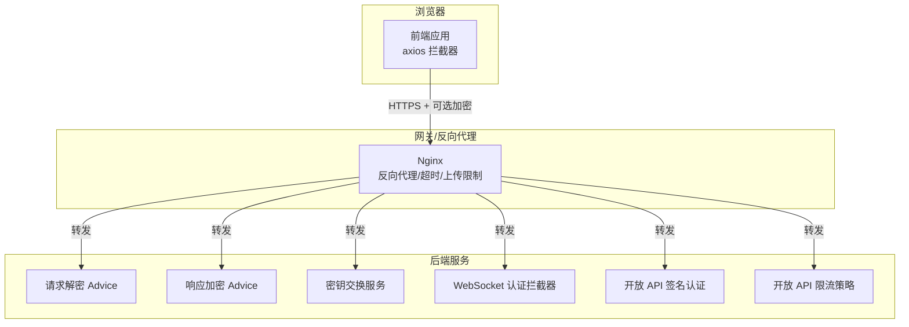
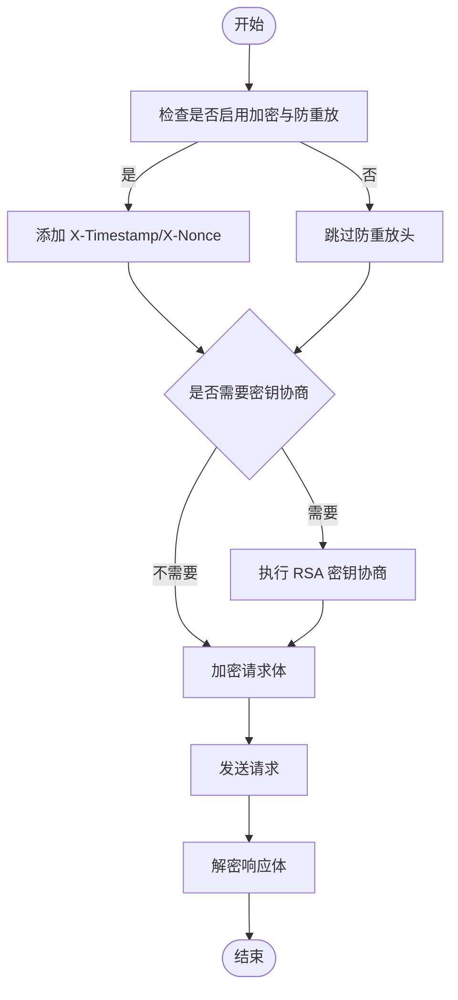
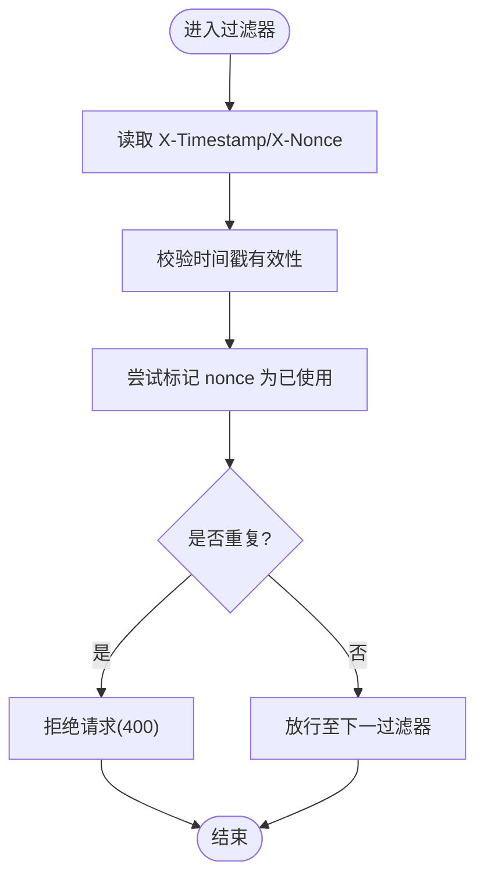
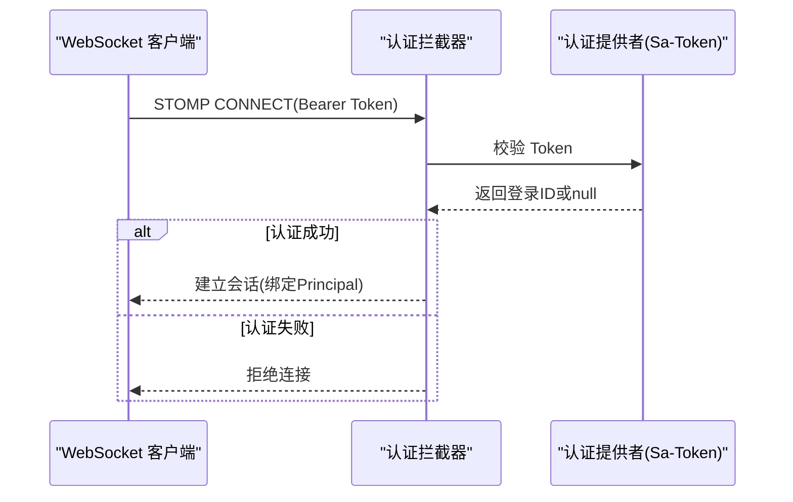
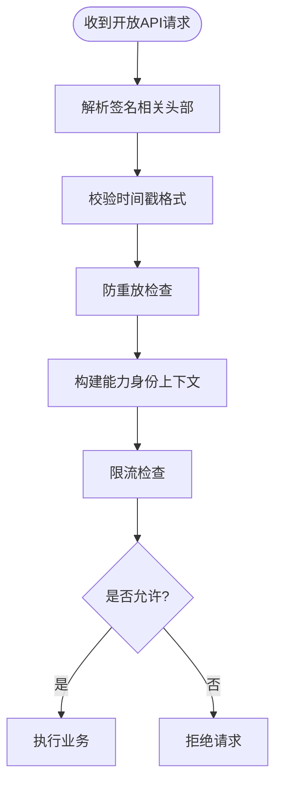
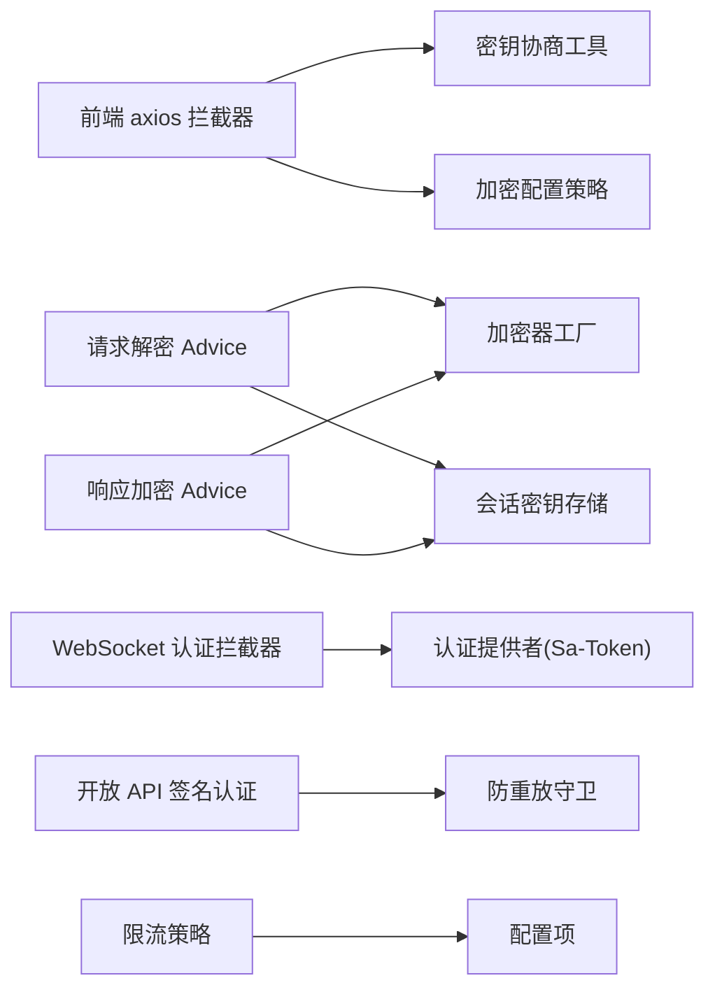

# 传输安全

<cite>
**本文引用的文件**
- [DecryptRequestBodyAdvice.java](file://forge-server/forge-framework/forge-starter-parent/forge-starter-crypto/src/main/java/com/mdframe/forge/starter/crypto/advice/DecryptRequestBodyAdvice.java)
- [EncryptResponseBodyAdvice.java](file://forge-server/forge-framework/forge-starter-parent/forge-starter-crypto/src/main/java/com/mdframe/forge/starter/crypto/advice/EncryptResponseBodyAdvice.java)
- [KeyExchangeService.java](file://forge-server/forge-framework/forge-starter-parent/forge-starter-crypto/src/main/java/com/mdframe/forge/starter/crypto/keyexchange/KeyExchangeService.java)
- [key-exchange.js](file://forge-admin-ui/src/utils/crypto/key-exchange.js)
- [axios.ts](file://forge-admin-ui/src/api/axios.ts)
- [crypto-config.ts](file://forge-report-ui/src/utils/api-crypto/crypto-config.ts)
- [AuthenticatedWebSocketChannelInterceptor.java](file://forge-server/forge-framework/forge-starter-parent/forge-starter-websocket/src/main/java/com/mdframe/forge/starter/websocket/security/AuthenticatedWebSocketChannelInterceptor.java)
- [SaTokenWebSocketAuthenticationConfiguration.java](file://forge-server/forge-framework/forge-starter-parent/forge-starter-auth/src/main/java/com/mdframe/forge/starter/auth/config/SaTokenWebSocketAuthenticationConfiguration.java)
- [OpenGatewayAuthenticator.java](file://forge-server/forge-framework/forge-plugin-parent/forge-plugin-capability-parent/forge-plugin-capability-platform/src/main/java/com/mdframe/forge/plugin/capability/opengateway/auth/OpenGatewayAuthenticator.java)
- [RateLimitPolicy.java](file://forge-server/forge-framework/forge-starter-parent/forge-starter-openapi-security/src/main/java/com/mdframe/forge/starter/openapi/security/ratelimit/RateLimitPolicy.java)
- [ReplayAttackFilterTest.java](file://forge-server/forge-framework/forge-starter-parent/forge-starter-crypto/src/test/java/com/mdframe/forge/starter/crypto/filter/ReplayAttackFilterTest.java)
- [nginx.conf（docker）](file://docker/nginx.conf)
- [nginx.conf（docker-forge-admin）](file://docker-forge-admin/nginx.conf)
</cite>

## 目录
1. [简介](#简介)
2. [项目结构](#项目结构)
3. [核心组件](#核心组件)
4. [架构总览](#架构总览)
5. [详细组件分析](#详细组件分析)
6. [依赖关系分析](#依赖关系分析)
7. [性能考量](#性能考量)
8. [故障排查指南](#故障排查指南)
9. [结论](#结论)
10. [附录：配置示例与安全最佳实践](#附录配置示例与安全最佳实践)

## 简介
本文件聚焦 Forge Admin 的“传输安全”，覆盖 HTTPS 与 TLS、端到端请求加密与响应解密、防重放与签名校验、WebSocket 连接安全、API 接口安全（签名、来源校验、限流）、以及常见威胁防护（XSS、CSRF、SQL 注入等）的实践建议。文档基于仓库中现有实现进行梳理，并提供可操作的配置指引与排错要点。

## 项目结构
与传输安全直接相关的代码分布在以下模块：
- 前端（Vue 应用）：在 axios 拦截器中统一处理防重放头、密钥协商、请求加密与响应解密；提供加密开关与路径白/黑名单策略。
- 后端（Spring Boot Starter）：提供请求体自动解密、响应体自动加密、RSA 会话密钥交换、防重放过滤器、WebSocket 认证拦截器、开放 API 签名认证与限流策略等能力。
- 部署层（Nginx）：反向代理与超时、上传大小限制、Gzip 压缩等基础网络配置（HTTPS/TLS 证书与协议版本需结合生产环境 Nginx 配置）。

**图表来源**
- [nginx.conf（docker）:1-42](file://docker/nginx.conf#L1-L42)
- [nginx.conf（docker-forge-admin）:1-42](file://docker-forge-admin/nginx.conf#L1-L42)
- [DecryptRequestBodyAdvice.java:1-256](file://forge-server/forge-framework/forge-starter-parent/forge-starter-crypto/src/main/java/com/mdframe/forge/starter/crypto/advice/DecryptRequestBodyAdvice.java#L1-L256)
- [EncryptResponseBodyAdvice.java:1-246](file://forge-server/forge-framework/forge-starter-parent/forge-starter-crypto/src/main/java/com/mdframe/forge/starter/crypto/advice/EncryptResponseBodyAdvice.java#L1-L246)
- [KeyExchangeService.java:1-45](file://forge-server/forge-framework/forge-starter-parent/forge-starter-crypto/src/main/java/com/mdframe/forge/starter/crypto/keyexchange/KeyExchangeService.java#L1-L45)
- [AuthenticatedWebSocketChannelInterceptor.java:1-104](file://forge-server/forge-framework/forge-starter-parent/forge-starter-websocket/src/main/java/com/mdframe/forge/starter/websocket/security/AuthenticatedWebSocketChannelInterceptor.java#L1-L104)
- [OpenGatewayAuthenticator.java:100-161](file://forge-server/forge-framework/forge-plugin-parent/forge-plugin-capability-parent/forge-plugin-capability-platform/src/main/java/com/mdframe/forge/plugin/capability/opengateway/auth/OpenGatewayAuthenticator.java#L100-L161)
- [RateLimitPolicy.java:1-19](file://forge-server/forge-framework/forge-starter-parent/forge-starter-openapi-security/src/main/java/com/mdframe/forge/starter/openapi/security/ratelimit/RateLimitPolicy.java#L1-L19)

**章节来源**
- [nginx.conf（docker）:1-42](file://docker/nginx.conf#L1-L42)
- [nginx.conf（docker-forge-admin）:1-42](file://docker-forge-admin/nginx.conf#L1-L42)

## 核心组件
- 端到端加密通道
  - 前端：axios 拦截器负责添加防重放头、触发密钥协商、对请求体加密、对响应体解密。
  - 后端：请求体自动解密、响应体自动加密，支持动态会话密钥与默认密钥两种模式。
- 密钥协商
  - 前端通过 RSA 公钥获取并生成会话密钥，使用私钥在后端存储会话密钥，后续通信使用该会话密钥加解密。
- 防重放攻击
  - 前端在开启防重放时添加时间戳与随机数；后端通过过滤器校验非重复 nonce 与时间窗口。
- WebSocket 安全
  - STOMP CONNECT 必须携带 Bearer Token，服务端通过认证提供者校验登录态，限制订阅目标与应用前缀。
- 开放 API 安全
  - 签名认证：要求 AppId、Timestamp、Nonce、Signature 等头部，校验时间戳与防重放，构建能力身份上下文。
  - 限流：按每分钟允许请求数进行限流控制。

**章节来源**
- [axios.ts:81-117](file://forge-admin-ui/src/api/axios.ts#L81-L117)
- [key-exchange.js:134-182](file://forge-admin-ui/src/utils/crypto/key-exchange.js#L134-L182)
- [crypto-config.ts:126-137](file://forge-report-ui/src/utils/api-crypto/crypto-config.ts#L126-L137)
- [KeyExchangeService.java:1-45](file://forge-server/forge-framework/forge-starter-parent/forge-starter-crypto/src/main/java/com/mdframe/forge/starter/crypto/keyexchange/KeyExchangeService.java#L1-L45)
- [DecryptRequestBodyAdvice.java:61-149](file://forge-server/forge-framework/forge-starter-parent/forge-starter-crypto/src/main/java/com/mdframe/forge/starter/crypto/advice/DecryptRequestBodyAdvice.java#L61-L149)
- [EncryptResponseBodyAdvice.java:59-169](file://forge-server/forge-framework/forge-starter-parent/forge-starter-crypto/src/main/java/com/mdframe/forge/starter/crypto/advice/EncryptResponseBodyAdvice.java#L59-L169)
- [AuthenticatedWebSocketChannelInterceptor.java:18-104](file://forge-server/forge-framework/forge-starter-parent/forge-starter-websocket/src/main/java/com/mdframe/forge/starter/websocket/security/AuthenticatedWebSocketChannelInterceptor.java#L18-L104)
- [OpenGatewayAuthenticator.java:100-161](file://forge-server/forge-framework/forge-plugin-parent/forge-plugin-capability-parent/forge-plugin-capability-platform/src/main/java/com/mdframe/forge/plugin/capability/opengateway/auth/OpenGatewayAuthenticator.java#L100-L161)
- [RateLimitPolicy.java:1-19](file://forge-server/forge-framework/forge-starter-parent/forge-starter-openapi-security/src/main/java/com/mdframe/forge/starter/openapi/security/ratelimit/RateLimitPolicy.java#L1-L19)

## 架构总览
下图展示一次受保护的 HTTP 请求从前端到后端的完整流程，包括密钥协商、请求加密、后端解密、业务处理、响应加密与前端解密。

```mermaid
sequenceDiagram
participant FE as "前端应用"
participant AX as "axios 拦截器"
participant NG as "Nginx"
participant BE as "后端服务"
participant DEC as "请求解密 Advice"
participant ENC as "响应加密 Advice"
FE->>AX : 发起请求
AX->>AX : 添加防重放头(可选)
AX->>FE : 如需则执行密钥协商
AX->>NG : 发送加密请求体
NG->>BE : 转发请求
BE->>DEC : 解析并解密请求体
DEC-->>BE : 明文数据
BE->>BE : 执行业务逻辑
BE->>ENC : 序列化响应体
ENC-->>BE : 返回加密响应
BE-->>NG : 加密响应
NG-->>AX : 返回响应
AX->>AX : 解密响应体
AX-->>FE : 明文数据
```

**图表来源**
- [axios.ts:81-117](file://forge-admin-ui/src/api/axios.ts#L81-L117)
- [key-exchange.js:134-182](file://forge-admin-ui/src/utils/crypto/key-exchange.js#L134-L182)
- [KeyExchangeService.java:1-45](file://forge-server/forge-framework/forge-starter-parent/forge-starter-crypto/src/main/java/com/mdframe/forge/starter/crypto/keyexchange/KeyExchangeService.java#L1-L45)
- [DecryptRequestBodyAdvice.java:61-149](file://forge-server/forge-framework/forge-starter-parent/forge-starter-crypto/src/main/java/com/mdframe/forge/starter/crypto/advice/DecryptRequestBodyAdvice.java#L61-L149)
- [EncryptResponseBodyAdvice.java:59-169](file://forge-server/forge-framework/forge-starter-parent/forge-starter-crypto/src/main/java/com/mdframe/forge/starter/crypto/advice/EncryptResponseBodyAdvice.java#L59-L169)

## 详细组件分析

### 端到端加密与密钥协商
- 前端密钥协商
  - 获取后端 RSA 公钥，生成会话密钥，用公钥加密会话密钥并发送到后端指定端点，成功后将会话密钥写入本地状态并更新加密配置。
  - 在需要加密的请求上，确保已完成密钥协商后再进行加密。
- 后端密钥交换
  - 接收前端加密的会话密钥，使用 RSA 私钥解密并存储到会话键值存储，供后续请求解密与响应加密使用。
- 请求解密
  - 根据注解或 API 配置决定是否解密；若启用动态密钥，优先从会话标识（Authorization/Bearer token、X-Session-Id、HTTP Session ID）获取会话密钥进行解密。
- 响应加密
  - 根据注解或 API 配置决定是否加密；同样优先使用动态会话密钥进行加密，避免敏感信息明文传输。

**图表来源**
- [axios.ts:81-117](file://forge-admin-ui/src/api/axios.ts#L81-L117)
- [key-exchange.js:134-182](file://forge-admin-ui/src/utils/crypto/key-exchange.js#L134-L182)
- [KeyExchangeService.java:1-45](file://forge-server/forge-framework/forge-starter-parent/forge-starter-crypto/src/main/java/com/mdframe/forge/starter/crypto/keyexchange/KeyExchangeService.java#L1-L45)
- [DecryptRequestBodyAdvice.java:61-149](file://forge-server/forge-framework/forge-starter-parent/forge-starter-crypto/src/main/java/com/mdframe/forge/starter/crypto/advice/DecryptRequestBodyAdvice.java#L61-L149)
- [EncryptResponseBodyAdvice.java:59-169](file://forge-server/forge-framework/forge-starter-parent/forge-starter-crypto/src/main/java/com/mdframe/forge/starter/crypto/advice/EncryptResponseBodyAdvice.java#L59-L169)

**章节来源**
- [key-exchange.js:134-182](file://forge-admin-ui/src/utils/crypto/key-exchange.js#L134-L182)
- [KeyExchangeService.java:1-45](file://forge-server/forge-framework/forge-starter-parent/forge-starter-crypto/src/main/java/com/mdframe/forge/starter/crypto/keyexchange/KeyExchangeService.java#L1-L45)
- [DecryptRequestBodyAdvice.java:61-149](file://forge-server/forge-framework/forge-starter-parent/forge-starter-crypto/src/main/java/com/mdframe/forge/starter/crypto/advice/DecryptRequestBodyAdvice.java#L61-L149)
- [EncryptResponseBodyAdvice.java:59-169](file://forge-server/forge-framework/forge-starter-parent/forge-starter-crypto/src/main/java/com/mdframe/forge/starter/crypto/advice/EncryptResponseBodyAdvice.java#L59-L169)

### 防重放攻击防护
- 前端
  - 当启用防重放时，为请求添加时间戳与随机数头，用于后端去重校验。
- 后端
  - 过滤器读取时间戳与随机数，基于缓存标记防止重复 nonce 在时间窗口内被重用；测试用例验证了重复 nonce 会被拒绝。

**图表来源**
- [ReplayAttackFilterTest.java:1-70](file://forge-server/forge-framework/forge-starter-parent/forge-starter-crypto/src/test/java/com/mdframe/forge/starter/crypto/filter/ReplayAttackFilterTest.java#L1-L70)

**章节来源**
- [axios.ts:81-117](file://forge-admin-ui/src/api/axios.ts#L81-L117)
- [ReplayAttackFilterTest.java:1-70](file://forge-server/forge-framework/forge-starter-parent/forge-starter-crypto/src/test/java/com/mdframe/forge/starter/crypto/filter/ReplayAttackFilterTest.java#L1-L70)

### WebSocket 连接安全
- 连接认证
  - STOMP CONNECT 必须包含 Bearer Token；拦截器提取并调用认证提供者校验登录态，失败则抛出异常。
- 订阅与发布限制
  - 仅允许客户端订阅配置的前缀目标，禁止直接向消息 Broker 发送消息。
- 认证提供者
  - 通过 Sa-Token 集成，将 Token 映射为登录用户 ID，作为 Principal 绑定到会话。

**图表来源**
- [AuthenticatedWebSocketChannelInterceptor.java:18-104](file://forge-server/forge-framework/forge-starter-parent/forge-starter-websocket/src/main/java/com/mdframe/forge/starter/websocket/security/AuthenticatedWebSocketChannelInterceptor.java#L18-L104)
- [SaTokenWebSocketAuthenticationConfiguration.java:1-23](file://forge-server/forge-framework/forge-starter-parent/forge-starter-auth/src/main/java/com/mdframe/forge/starter/auth/config/SaTokenWebSocketAuthenticationConfiguration.java#L1-L23)

**章节来源**
- [AuthenticatedWebSocketChannelInterceptor.java:18-104](file://forge-server/forge-framework/forge-starter-parent/forge-starter-websocket/src/main/java/com/mdframe/forge/starter/websocket/security/AuthenticatedWebSocketChannelInterceptor.java#L18-L104)
- [SaTokenWebSocketAuthenticationConfiguration.java:1-23](file://forge-server/forge-framework/forge-starter-parent/forge-starter-auth/src/main/java/com/mdframe/forge/starter/auth/config/SaTokenWebSocketAuthenticationConfiguration.java#L1-L23)

### 开放 API 接口安全（签名与限流）
- 签名认证
  - 要求 AppId、Timestamp、Nonce、Signature 等头部；校验时间戳格式与防重放，构造能力身份上下文，限定作用域。
- 限流策略
  - 以每分钟允许请求数为粒度进行限流，非法配置会抛出异常。

**图表来源**
- [OpenGatewayAuthenticator.java:100-161](file://forge-server/forge-framework/forge-plugin-parent/forge-plugin-capability-parent/forge-plugin-capability-platform/src/main/java/com/mdframe/forge/plugin/capability/opengateway/auth/OpenGatewayAuthenticator.java#L100-L161)
- [RateLimitPolicy.java:1-19](file://forge-server/forge-framework/forge-starter-parent/forge-starter-openapi-security/src/main/java/com/mdframe/forge/starter/openapi/security/ratelimit/RateLimitPolicy.java#L1-L19)

**章节来源**
- [OpenGatewayAuthenticator.java:100-161](file://forge-server/forge-framework/forge-plugin-parent/forge-plugin-capability-parent/forge-plugin-capability-platform/src/main/java/com/mdframe/forge/plugin/capability/opengateway/auth/OpenGatewayAuthenticator.java#L100-L161)
- [RateLimitPolicy.java:1-19](file://forge-server/forge-framework/forge-starter-parent/forge-starter-openapi-security/src/main/java/com/mdframe/forge/starter/openapi/security/ratelimit/RateLimitPolicy.java#L1-L19)

### 网络安全防护措施（XSS、CSRF、SQL 注入）
- XSS 防护
  - 建议在 Nginx 层设置安全响应头（如 Content-Security-Policy），并在前端渲染层对用户输入进行转义与校验。当前仓库中存在 CSP 相关提示，表明前端具备 CSP 意识。
- CSRF 防护
  - 对于表单提交类操作，建议使用同源策略、SameSite Cookie、CSRF Token 校验；后端可通过请求来源校验与令牌机制增强防护。
- SQL 注入防护
  - 使用参数化查询与 ORM 框架，避免拼接 SQL；对输入进行严格类型与长度校验；对导出/导入脚本进行安全扫描与过滤。

[本节为通用安全建议，不直接分析具体代码文件]

## 依赖关系分析
- 前端依赖
  - axios 拦截器依赖加密配置与密钥协商工具；加密范围由 include/exclude 路径策略控制。
- 后端依赖
  - 解密/加密 Advice 依赖加密器工厂、会话密钥存储、API 配置管理器与内部调用校验器。
  - WebSocket 认证依赖认证提供者（Sa-Token 实现）。
  - 开放 API 认证依赖签名校验与防重放守卫。
  - 限流策略依赖配置项并进行合法性校验。

**图表来源**
- [axios.ts:81-117](file://forge-admin-ui/src/api/axios.ts#L81-L117)
- [crypto-config.ts:126-137](file://forge-report-ui/src/utils/api-crypto/crypto-config.ts#L126-L137)
- [DecryptRequestBodyAdvice.java:61-149](file://forge-server/forge-framework/forge-starter-parent/forge-starter-crypto/src/main/java/com/mdframe/forge/starter/crypto/advice/DecryptRequestBodyAdvice.java#L61-L149)
- [EncryptResponseBodyAdvice.java:59-169](file://forge-server/forge-framework/forge-starter-parent/forge-starter-crypto/src/main/java/com/mdframe/forge/starter/crypto/advice/EncryptResponseBodyAdvice.java#L59-L169)
- [AuthenticatedWebSocketChannelInterceptor.java:18-104](file://forge-server/forge-framework/forge-starter-parent/forge-starter-websocket/src/main/java/com/mdframe/forge/starter/websocket/security/AuthenticatedWebSocketChannelInterceptor.java#L18-L104)
- [SaTokenWebSocketAuthenticationConfiguration.java:1-23](file://forge-server/forge-framework/forge-starter-parent/forge-starter-auth/src/main/java/com/mdframe/forge/starter/auth/config/SaTokenWebSocketAuthenticationConfiguration.java#L1-L23)
- [OpenGatewayAuthenticator.java:100-161](file://forge-server/forge-framework/forge-plugin-parent/forge-plugin-capability-parent/forge-plugin-capability-platform/src/main/java/com/mdframe/forge/plugin/capability/opengateway/auth/OpenGatewayAuthenticator.java#L100-L161)
- [RateLimitPolicy.java:1-19](file://forge-server/forge-framework/forge-starter-parent/forge-starter-openapi-security/src/main/java/com/mdframe/forge/starter/openapi/security/ratelimit/RateLimitPolicy.java#L1-L19)

**章节来源**
- [axios.ts:81-117](file://forge-admin-ui/src/api/axios.ts#L81-L117)
- [crypto-config.ts:126-137](file://forge-report-ui/src/utils/api-crypto/crypto-config.ts#L126-L137)
- [DecryptRequestBodyAdvice.java:61-149](file://forge-server/forge-framework/forge-starter-parent/forge-starter-crypto/src/main/java/com/mdframe/forge/starter/crypto/advice/DecryptRequestBodyAdvice.java#L61-L149)
- [EncryptResponseBodyAdvice.java:59-169](file://forge-server/forge-framework/forge-starter-parent/forge-starter-crypto/src/main/java/com/mdframe/forge/starter/crypto/advice/EncryptResponseBodyAdvice.java#L59-L169)
- [AuthenticatedWebSocketChannelInterceptor.java:18-104](file://forge-server/forge-framework/forge-starter-parent/forge-starter-websocket/src/main/java/com/mdframe/forge/starter/websocket/security/AuthenticatedWebSocketChannelInterceptor.java#L18-L104)
- [SaTokenWebSocketAuthenticationConfiguration.java:1-23](file://forge-server/forge-framework/forge-starter-parent/forge-starter-auth/src/main/java/com/mdframe/forge/starter/auth/config/SaTokenWebSocketAuthenticationConfiguration.java#L1-L23)
- [OpenGatewayAuthenticator.java:100-161](file://forge-server/forge-framework/forge-plugin-parent/forge-plugin-capability-parent/forge-plugin-capability-platform/src/main/java/com/mdframe/forge/plugin/capability/opengateway/auth/OpenGatewayAuthenticator.java#L100-L161)
- [RateLimitPolicy.java:1-19](file://forge-server/forge-framework/forge-starter-parent/forge-starter-openapi-security/src/main/java/com/mdframe/forge/starter/openapi/security/ratelimit/RateLimitPolicy.java#L1-L19)

## 性能考量
- 加密开销
  - RSA 密钥协商仅在首次或必要时执行；后续使用对称会话密钥加解密，降低 CPU 消耗。
- 动态密钥
  - 启用动态密钥可减少长期密钥泄露风险，但需保证会话键值存储的性能与一致性。
- 防重放
  - 时间窗口与缓存容量需合理配置，避免过多内存占用；在高并发场景下考虑分布式缓存方案。
- WebSocket
  - 认证与订阅限制在连接建立时完成，减少后续消息处理开销。
- 限流
  - 按分钟粒度限流适合大多数 API 场景；可根据业务峰值调整 permitsPerMinute。

[本节为通用性能建议，不直接分析具体代码文件]

## 故障排查指南
- 密钥协商失败
  - 检查前端是否正确获取 RSA 公钥并完成会话密钥交换；确认后端会话键值存储可用。
  - 参考路径：[key-exchange.js:134-182](file://forge-admin-ui/src/utils/crypto/key-exchange.js#L134-L182)、[KeyExchangeService.java:1-45](file://forge-server/forge-framework/forge-starter-parent/forge-starter-crypto/src/main/java/com/mdframe/forge/starter/crypto/keyexchange/KeyExchangeService.java#L1-L45)
- 请求解密失败
  - 检查是否启用了 API 加密、是否传入了正确的会话标识（Authorization/Bearer、X-Session-Id、HTTP Session ID）。
  - 参考路径：[DecryptRequestBodyAdvice.java:61-149](file://forge-server/forge-framework/forge-starter-parent/forge-starter-crypto/src/main/java/com/mdframe/forge/starter/crypto/advice/DecryptRequestBodyAdvice.java#L61-L149)
- 响应加密失败
  - 检查排除路径配置、二进制响应类型是否被错误加密。
  - 参考路径：[EncryptResponseBodyAdvice.java:59-169](file://forge-server/forge-framework/forge-starter-parent/forge-starter-crypto/src/main/java/com/mdframe/forge/starter/crypto/advice/EncryptResponseBodyAdvice.java#L59-L169)
- WebSocket 连接被拒
  - 确认 CONNECT 请求包含有效 Bearer Token；检查订阅目标是否匹配允许前缀。
  - 参考路径：[AuthenticatedWebSocketChannelInterceptor.java:18-104](file://forge-server/forge-framework/forge-starter-parent/forge-starter-websocket/src/main/java/com/mdframe/forge/starter/websocket/security/AuthenticatedWebSocketChannelInterceptor.java#L18-L104)
- 开放 API 签名无效
  - 检查 AppId、Timestamp、Nonce、Signature 是否齐全且格式正确；确认防重放未被拒绝。
  - 参考路径：[OpenGatewayAuthenticator.java:100-161](file://forge-server/forge-framework/forge-plugin-parent/forge-plugin-capability-parent/forge-plugin-capability-platform/src/main/java/com/mdframe/forge/plugin/capability/opengateway/auth/OpenGatewayAuthenticator.java#L100-L161)
- 限流触发
  - 检查 permitsPerMinute 配置是否合法；根据业务需求调整限流阈值。
  - 参考路径：[RateLimitPolicy.java:1-19](file://forge-server/forge-framework/forge-starter-parent/forge-starter-openapi-security/src/main/java/com/mdframe/forge/starter/openapi/security/ratelimit/RateLimitPolicy.java#L1-L19)

**章节来源**
- [key-exchange.js:134-182](file://forge-admin-ui/src/utils/crypto/key-exchange.js#L134-L182)
- [KeyExchangeService.java:1-45](file://forge-server/forge-framework/forge-starter-parent/forge-starter-crypto/src/main/java/com/mdframe/forge/starter/crypto/keyexchange/KeyExchangeService.java#L1-L45)
- [DecryptRequestBodyAdvice.java:61-149](file://forge-server/forge-framework/forge-starter-parent/forge-starter-crypto/src/main/java/com/mdframe/forge/starter/crypto/advice/DecryptRequestBodyAdvice.java#L61-L149)
- [EncryptResponseBodyAdvice.java:59-169](file://forge-server/forge-framework/forge-starter-parent/forge-starter-crypto/src/main/java/com/mdframe/forge/starter/crypto/advice/EncryptResponseBodyAdvice.java#L59-L169)
- [AuthenticatedWebSocketChannelInterceptor.java:18-104](file://forge-server/forge-framework/forge-starter-parent/forge-starter-websocket/src/main/java/com/mdframe/forge/starter/websocket/security/AuthenticatedWebSocketChannelInterceptor.java#L18-L104)
- [OpenGatewayAuthenticator.java:100-161](file://forge-server/forge-framework/forge-plugin-parent/forge-plugin-capability-parent/forge-plugin-capability-platform/src/main/java/com/mdframe/forge/plugin/capability/opengateway/auth/OpenGatewayAuthenticator.java#L100-L161)
- [RateLimitPolicy.java:1-19](file://forge-server/forge-framework/forge-starter-parent/forge-starter-openapi-security/src/main/java/com/mdframe/forge/starter/openapi/security/ratelimit/RateLimitPolicy.java#L1-L19)

## 结论
Forge Admin 在传输安全方面提供了较为完整的端到端保护：前端统一拦截器负责防重放与加解密，后端通过 Advice 自动处理请求/响应，密钥协商采用 RSA+会话密钥组合，WebSocket 强制认证与目标限制，开放 API 具备签名认证与限流能力。部署层 Nginx 提供反向代理与基础网络配置。建议在生产环境中结合 HTTPS/TLS 证书与协议版本、安全响应头等加固整体传输安全。

[本节为总结性内容，不直接分析具体代码文件]

## 附录：配置示例与安全最佳实践
- HTTPS 与 TLS
  - 在 Nginx 中启用 HTTPS，配置 SSL 证书与支持的 TLS 版本（推荐 TLS 1.2/1.3），禁用不安全协议与弱密码套件。
  - 参考路径：[nginx.conf（docker）:1-42](file://docker/nginx.conf#L1-L42)、[nginx.conf（docker-forge-admin）:1-42](file://docker-forge-admin/nginx.conf#L1-L42)
- 安全响应头
  - 建议设置 Content-Security-Policy、Strict-Transport-Security、X-Content-Type-Options、X-Frame-Options 等，增强浏览器侧防护。
- 前端加密配置
  - 启用加密与防重放，配置 include/exclude 路径策略，确保关键接口参与加密。
  - 参考路径：[axios.ts:81-117](file://forge-admin-ui/src/api/axios.ts#L81-L117)、[crypto-config.ts:126-137](file://forge-report-ui/src/utils/api-crypto/crypto-config.ts#L126-L137)
- 后端加密配置
  - 启用 API 加密与动态密钥，配置排除路径，确保敏感接口被加密。
  - 参考路径：[DecryptRequestBodyAdvice.java:61-149](file://forge-server/forge-framework/forge-starter-parent/forge-starter-crypto/src/main/java/com/mdframe/forge/starter/crypto/advice/DecryptRequestBodyAdvice.java#L61-L149)、[EncryptResponseBodyAdvice.java:59-169](file://forge-server/forge-framework/forge-starter-parent/forge-starter-crypto/src/main/java/com/mdframe/forge/starter/crypto/advice/EncryptResponseBodyAdvice.java#L59-L169)
- WebSocket 安全
  - 强制 Bearer Token 认证，限制订阅前缀，避免客户端直连消息 Broker。
  - 参考路径：[AuthenticatedWebSocketChannelInterceptor.java:18-104](file://forge-server/forge-framework/forge-starter-parent/forge-starter-websocket/src/main/java/com/mdframe/forge/starter/websocket/security/AuthenticatedWebSocketChannelInterceptor.java#L18-L104)
- 开放 API 安全
  - 要求签名头部齐全，校验时间戳与防重放，配置合理的每分钟请求限额。
  - 参考路径：[OpenGatewayAuthenticator.java:100-161](file://forge-server/forge-framework/forge-plugin-parent/forge-plugin-capability-parent/forge-plugin-capability-platform/src/main/java/com/mdframe/forge/plugin/capability/opengateway/auth/OpenGatewayAuthenticator.java#L100-L161)、[RateLimitPolicy.java:1-19](file://forge-server/forge-framework/forge-starter-parent/forge-starter-openapi-security/src/main/java/com/mdframe/forge/starter/openapi/security/ratelimit/RateLimitPolicy.java#L1-L19)
- 常见威胁防护建议
  - XSS：启用 CSP，前端对用户输入进行转义与校验。
  - CSRF：使用 SameSite Cookie、CSRF Token、同源校验。
  - SQL 注入：参数化查询、严格输入校验、避免拼接 SQL。

[本节为通用配置与实践建议，不直接分析具体代码文件]