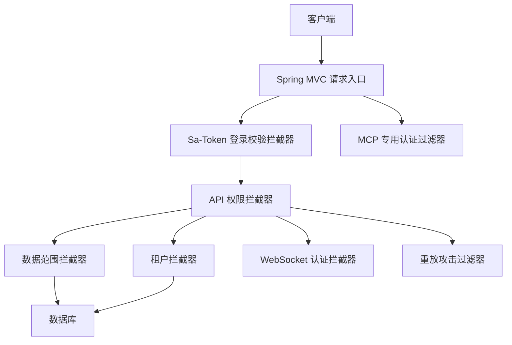
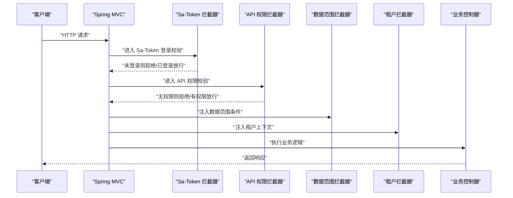
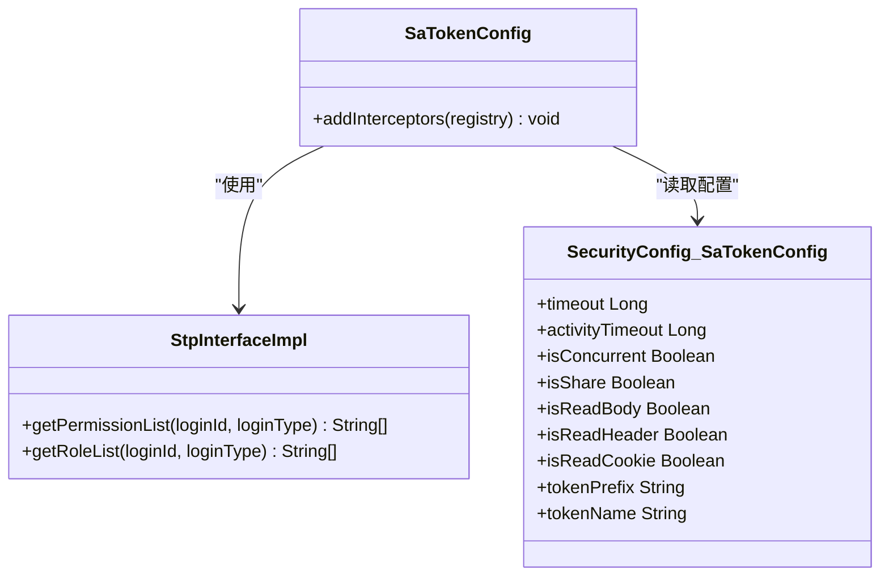
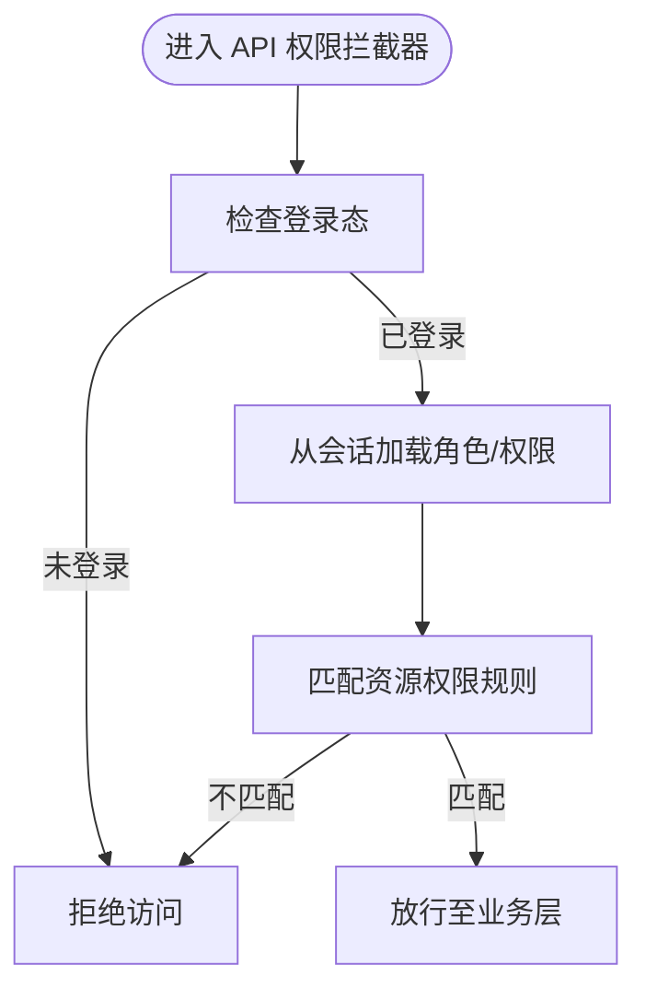
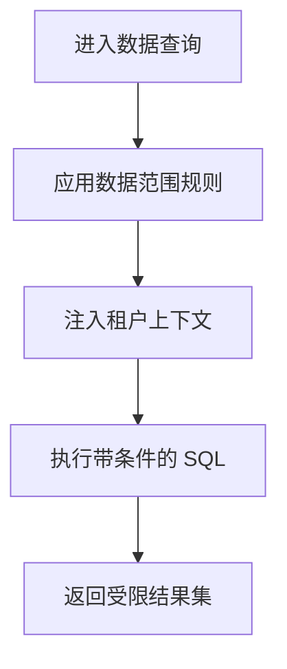
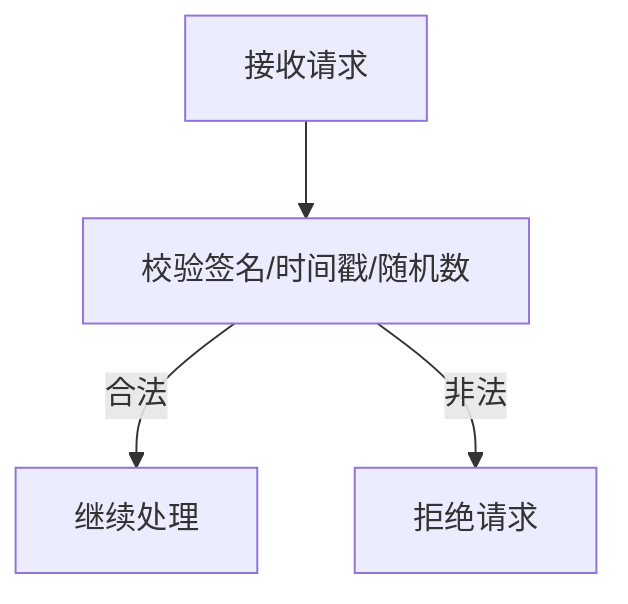
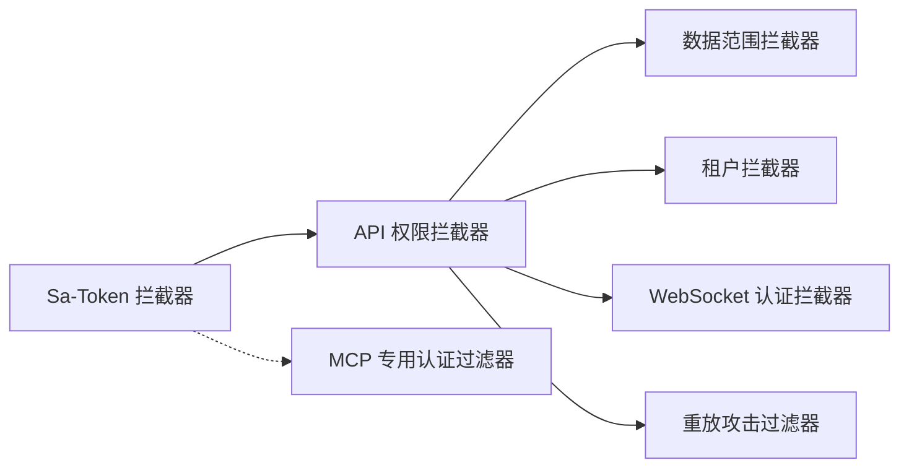

# 安全架构设计

<cite>
**本文引用的文件**
- [SaTokenConfig.java](file://forge-server/forge-framework/forge-starter-parent/forge-starter-auth/src/main/java/com/mdframe/forge/starter/auth/config/SaTokenConfig.java)
- [StpInterfaceImpl.java](file://forge-server/forge-framework/forge-starter-parent/forge-starter-auth/src/main/java/com/mdframe/forge/starter/auth/config/StpInterfaceImpl.java)
- [SecurityConfig.java](file://forge-server/forge-framework/forge-starter-parent/forge-starter-config/src/main/java/com/mdframe/forge/starter/config/config/SecurityConfig.java)
- [ApiPermissionInterceptor.java](file://forge-server/forge-framework/forge-starter-parent/forge-starter-auth/src/main/java/com/mdframe/forge/starter/auth/interceptor/ApiPermissionInterceptor.java)
- [DataScopeInterceptor.java](file://forge-server/forge-framework/forge-starter-parent/forge-starter-datascope/src/main/java/com/mdframe/forge/starter/datascope/handler/DataScopeInterceptor.java)
- [TenantInterceptor.java](file://forge-server/forge-framework/forge-starter-parent/forge-starter-tenant/src/main/java/com/mdframe/forge/starter/tenant/interceptor/TenantInterceptor.java)
- [AuthenticatedWebSocketChannelInterceptor.java](file://forge-server/forge-framework/forge-starter-parent/forge-starter-websocket/src/main/java/com/mdframe/forge/starter/websocket/security/AuthenticatedWebSocketChannelInterceptor.java)
- [ReplayAttackFilter.java](file://forge-server/forge-framework/forge-starter-parent/forge-starter-crypto/src/main/java/com/mdframe/forge/starter/crypto/filter/ReplayAttackFilter.java)
- [ForgeMcpAuthenticationFilter.java](file://forge-server/forge-framework/forge-plugin-parent/forge-plugin-mcp/src/main/java/com/mdframe/forge/plugin/mcp/security/ForgeMcpAuthenticationFilter.java)
</cite>

## 目录
1. [简介](#简介)
2. [项目结构](#项目结构)
3. [核心组件](#核心组件)
4. [架构总览](#架构总览)
5. [详细组件分析](#详细组件分析)
6. [依赖关系分析](#依赖关系分析)
7. [性能与安全权衡](#性能与安全权衡)
8. [故障排查指南](#故障排查指南)
9. [结论](#结论)
10. [附录](#附录)

## 简介
本安全架构设计文档面向 Forge Admin，围绕基于 Sa-Token 的认证授权体系展开，覆盖用户登录、Token 管理、会话控制、权限验证等核心机制；阐述 RBAC 权限模型在菜单、按钮、API 接口等多层次的安全实现；说明数据权限控制（组织架构范围、行政区划过滤、自定义 SQL）与数据传输安全（HTTPS、请求加密 SM4/AES、响应解密、敏感信息脱敏）；并给出网络安全防护（XSS、CSRF、SQL 注入、文件上传安全）与审计日志（操作日志、登录日志、安全事件审计）的落地方案。

## 项目结构
本项目将安全能力以“starter”和“plugin”形式解耦：
- 认证与会话：通过 Sa-Token 拦截器链统一鉴权入口，结合 API 权限拦截器进行资源级校验。
- 数据权限：通过数据范围拦截器在查询层自动注入数据范围条件。
- 多租户隔离：通过租户拦截器在请求上下文中注入租户上下文。
- 传输安全：通过重放攻击过滤器等组件增强请求安全性。
- 扩展认证：MCP 模块提供专用认证过滤器，避免通用鉴权链重复处理。

图表来源
- [SaTokenConfig.java:29-100](file://forge-server/forge-framework/forge-starter-parent/forge-starter-auth/src/main/java/com/mdframe/forge/starter/auth/config/SaTokenConfig.java#L29-L100)
- [ApiPermissionInterceptor.java](file://forge-server/forge-framework/forge-starter-parent/forge-starter-auth/src/main/java/com/mdframe/forge/starter/auth/interceptor/ApiPermissionInterceptor.java)
- [DataScopeInterceptor.java](file://forge-server/forge-framework/forge-starter-parent/forge-starter-datascope/src/main/java/com/mdframe/forge/starter/datascope/handler/DataScopeInterceptor.java)
- [TenantInterceptor.java](file://forge-server/forge-framework/forge-starter-parent/forge-starter-tenant/src/main/java/com/mdframe/forge/starter/tenant/interceptor/TenantInterceptor.java)
- [AuthenticatedWebSocketChannelInterceptor.java](file://forge-server/forge-framework/forge-starter-parent/forge-starter-websocket/src/main/java/com/mdframe/forge/starter/websocket/security/AuthenticatedWebSocketChannelInterceptor.java)
- [ReplayAttackFilter.java](file://forge-server/forge-framework/forge-starter-parent/forge-starter-crypto/src/main/java/com/mdframe/forge/starter/crypto/filter/ReplayAttackFilter.java)
- [ForgeMcpAuthenticationFilter.java](file://forge-server/forge-framework/forge-plugin-parent/forge-plugin-mcp/src/main/java/com/mdframe/forge/plugin/mcp/security/ForgeMcpAuthenticationFilter.java)

章节来源
- [SaTokenConfig.java:29-100](file://forge-server/forge-framework/forge-starter-parent/forge-starter-auth/src/main/java/com/mdframe/forge/starter/auth/config/SaTokenConfig.java#L29-L100)

## 核心组件
- Sa-Token 配置与拦截器链：统一登录校验、白名单排除、API 权限校验顺序。
- 权限接口扩展：从会话中读取角色与权限集合，供 Sa-Token 决策。
- 安全配置：Token 有效期、并发登录策略、读取位置（Header/Cookie/Body）、密码策略。
- 数据范围拦截器：按组织/区域/自定义规则注入数据访问边界。
- 租户拦截器：在多租户场景下隔离数据与上下文。
- WebSocket 认证拦截器：保障实时通信通道的身份可信。
- 重放攻击过滤器：对关键请求进行防重放保护。
- MCP 专用认证过滤器：为 MCP 通道提供独立认证流程，避免与通用鉴权链冲突。

章节来源
- [SaTokenConfig.java:29-100](file://forge-server/forge-framework/forge-starter-parent/forge-starter-auth/src/main/java/com/mdframe/forge/starter/auth/config/SaTokenConfig.java#L29-L100)
- [StpInterfaceImpl.java:20-33](file://forge-server/forge-framework/forge-starter-parent/forge-starter-auth/src/main/java/com/mdframe/forge/starter/auth/config/StpInterfaceImpl.java#L20-L33)
- [SecurityConfig.java:24-70](file://forge-server/forge-framework/forge-starter-parent/forge-starter-config/src/main/java/com/mdframe/forge/starter/config/config/SecurityConfig.java#L24-L70)
- [SecurityConfig.java:75-111](file://forge-server/forge-framework/forge-starter-parent/forge-starter-config/src/main/java/com/mdframe/forge/starter/config/config/SecurityConfig.java#L75-L111)

## 架构总览
下图展示一次受保护的 API 请求在框架中的安全处理路径：先由 Sa-Token 完成登录态校验，再由 API 权限拦截器进行资源级权限判定，随后进入数据范围与租户隔离，最终到达业务控制器。

图表来源
- [SaTokenConfig.java:29-100](file://forge-server/forge-framework/forge-starter-parent/forge-starter-auth/src/main/java/com/mdframe/forge/starter/auth/config/SaTokenConfig.java#L29-L100)
- [ApiPermissionInterceptor.java](file://forge-server/forge-framework/forge-starter-parent/forge-starter-auth/src/main/java/com/mdframe/forge/starter/auth/interceptor/ApiPermissionInterceptor.java)
- [DataScopeInterceptor.java](file://forge-server/forge-framework/forge-starter-parent/forge-starter-datascope/src/main/java/com/mdframe/forge/starter/datascope/handler/DataScopeInterceptor.java)
- [TenantInterceptor.java](file://forge-server/forge-framework/forge-starter-parent/forge-starter-tenant/src/main/java/com/mdframe/forge/starter/tenant/interceptor/TenantInterceptor.java)

## 详细组件分析

### 认证与会话（Sa-Token）
- 登录校验拦截器：对所有路径进行登录态检查，并通过白名单排除登录、注册、验证码、静态资源、健康检查、OAuth/MCP/OpenAPI 等特定端点。
- 权限接口扩展：从会话中获取当前用户的角色键与权限码集合，供 Sa-Token 的注解式鉴权使用。
- Token 管理：支持超时、活动超时、并发登录控制、共享 token、读取位置（Header/Cookie/Body）以及 Bearer 前缀与参数名配置。
- 密码策略：最小长度、复杂度要求、过期天数、历史密码数量等。

图表来源
- [SaTokenConfig.java:29-100](file://forge-server/forge-framework/forge-starter-parent/forge-starter-auth/src/main/java/com/mdframe/forge/starter/auth/config/SaTokenConfig.java#L29-L100)
- [StpInterfaceImpl.java:20-33](file://forge-server/forge-framework/forge-starter-parent/forge-starter-auth/src/main/java/com/mdframe/forge/starter/auth/config/StpInterfaceImpl.java#L20-L33)
- [SecurityConfig.java:24-70](file://forge-server/forge-framework/forge-starter-parent/forge-starter-config/src/main/java/com/mdframe/forge/starter/config/config/SecurityConfig.java#L24-L70)

章节来源
- [SaTokenConfig.java:29-100](file://forge-server/forge-framework/forge-starter-parent/forge-starter-auth/src/main/java/com/mdframe/forge/starter/auth/config/SaTokenConfig.java#L29-L100)
- [StpInterfaceImpl.java:20-33](file://forge-server/forge-framework/forge-starter-parent/forge-starter-auth/src/main/java/com/mdframe/forge/starter/auth/config/StpInterfaceImpl.java#L20-L33)
- [SecurityConfig.java:24-70](file://forge-server/forge-framework/forge-starter-parent/forge-starter-config/src/main/java/com/mdframe/forge/starter/config/config/SecurityConfig.java#L24-L70)
- [SecurityConfig.java:75-111](file://forge-server/forge-framework/forge-starter-parent/forge-starter-config/src/main/java/com/mdframe/forge/starter/config/config/SecurityConfig.java#L75-L111)

### 权限验证（RBAC）
- 资源级权限：通过 API 权限拦截器基于数据库资源表配置进行细粒度校验，配合 Sa-Token 的注解式鉴权完成菜单、按钮、接口的权限控制。
- 会话权限源：权限与角色来源于会话，确保登录后一次性加载、运行时高效判断。

图表来源
- [ApiPermissionInterceptor.java](file://forge-server/forge-framework/forge-starter-parent/forge-starter-auth/src/main/java/com/mdframe/forge/starter/auth/interceptor/ApiPermissionInterceptor.java)
- [StpInterfaceImpl.java:20-33](file://forge-server/forge-framework/forge-starter-parent/forge-starter-auth/src/main/java/com/mdframe/forge/starter/auth/config/StpInterfaceImpl.java#L20-L33)

章节来源
- [ApiPermissionInterceptor.java](file://forge-server/forge-framework/forge-starter-parent/forge-starter-auth/src/main/java/com/mdframe/forge/starter/auth/interceptor/ApiPermissionInterceptor.java)
- [StpInterfaceImpl.java:20-33](file://forge-server/forge-framework/forge-starter-parent/forge-starter-auth/src/main/java/com/mdframe/forge/starter/auth/config/StpInterfaceImpl.java#L20-L33)

### 数据权限控制
- 数据范围拦截器：在查询阶段自动注入数据范围条件，实现基于组织架构、行政区划或自定义 SQL 的数据过滤。
- 多租户隔离：租户拦截器在请求上下文中注入租户标识，确保跨租户数据隔离。

图表来源
- [DataScopeInterceptor.java](file://forge-server/forge-framework/forge-starter-parent/forge-starter-datascope/src/main/java/com/mdframe/forge/starter/datascope/handler/DataScopeInterceptor.java)
- [TenantInterceptor.java](file://forge-server/forge-framework/forge-starter-parent/forge-starter-tenant/src/main/java/com/mdframe/forge/starter/tenant/interceptor/TenantInterceptor.java)

章节来源
- [DataScopeInterceptor.java](file://forge-server/forge-framework/forge-starter-parent/forge-starter-datascope/src/main/java/com/mdframe/forge/starter/datascope/handler/DataScopeInterceptor.java)
- [TenantInterceptor.java](file://forge-server/forge-framework/forge-starter-parent/forge-starter-tenant/src/main/java/com/mdframe/forge/starter/tenant/interceptor/TenantInterceptor.java)

### 传输安全与防重放
- 重放攻击防护：通过重放攻击过滤器对关键请求进行签名/时间戳/随机数校验，防止请求被恶意重放。
- HTTPS 建议：在生产环境启用 HTTPS，结合前端加密（SM4/AES）与后端解密，降低中间人窃听风险。
- 敏感信息脱敏：建议在输出层对敏感字段进行脱敏，减少泄露面。

图表来源
- [ReplayAttackFilter.java](file://forge-server/forge-framework/forge-starter-parent/forge-starter-crypto/src/main/java/com/mdframe/forge/starter/crypto/filter/ReplayAttackFilter.java)

章节来源
- [ReplayAttackFilter.java](file://forge-server/forge-framework/forge-starter-parent/forge-starter-crypto/src/main/java/com/mdframe/forge/starter/crypto/filter/ReplayAttackFilter.java)

### WebSocket 安全
- 认证通道：WebSocket 连接建立时通过认证拦截器校验会话，确保仅已认证用户可建立实时通信通道。

章节来源
- [AuthenticatedWebSocketChannelInterceptor.java](file://forge-server/forge-framework/forge-starter-parent/forge-starter-websocket/src/main/java/com/mdframe/forge/starter/websocket/security/AuthenticatedWebSocketChannelInterceptor.java)

### MCP 专用认证
- 专用过滤器：MCP 通道由专用认证过滤器处理，避免与通用 Sa-Token 鉴权链重复处理，保证认证一致性与可控性。

章节来源
- [ForgeMcpAuthenticationFilter.java](file://forge-server/forge-framework/forge-plugin-parent/forge-plugin-mcp/src/main/java/com/mdframe/forge/plugin/mcp/security/ForgeMcpAuthenticationFilter.java)

## 依赖关系分析
- 登录校验与权限校验分离：Sa-Token 负责登录态，API 权限拦截器负责资源级权限，二者协同形成“先身份后权限”的强约束。
- 数据权限与租户隔离作为横切关注点：在业务逻辑之前注入数据范围与租户上下文，确保数据访问的最小化与隔离。
- 传输安全与认证通道：重放攻击过滤器与 WebSocket 认证拦截器分别在 HTTP 与 WebSocket 层面提供安全保障；MCP 专用认证过滤器提供独立认证路径。

图表来源
- [SaTokenConfig.java:29-100](file://forge-server/forge-framework/forge-starter-parent/forge-starter-auth/src/main/java/com/mdframe/forge/starter/auth/config/SaTokenConfig.java#L29-L100)
- [ApiPermissionInterceptor.java](file://forge-server/forge-framework/forge-starter-parent/forge-starter-auth/src/main/java/com/mdframe/forge/starter/auth/interceptor/ApiPermissionInterceptor.java)
- [DataScopeInterceptor.java](file://forge-server/forge-framework/forge-starter-parent/forge-starter-datascope/src/main/java/com/mdframe/forge/starter/datascope/handler/DataScopeInterceptor.java)
- [TenantInterceptor.java](file://forge-server/forge-framework/forge-starter-parent/forge-starter-tenant/src/main/java/com/mdframe/forge/starter/tenant/interceptor/TenantInterceptor.java)
- [AuthenticatedWebSocketChannelInterceptor.java](file://forge-server/forge-framework/forge-starter-parent/forge-starter-websocket/src/main/java/com/mdframe/forge/starter/websocket/security/AuthenticatedWebSocketChannelInterceptor.java)
- [ReplayAttackFilter.java](file://forge-server/forge-framework/forge-starter-parent/forge-starter-crypto/src/main/java/com/mdframe/forge/starter/crypto/filter/ReplayAttackFilter.java)
- [ForgeMcpAuthenticationFilter.java](file://forge-server/forge-framework/forge-plugin-parent/forge-plugin-mcp/src/main/java/com/mdframe/forge/plugin/mcp/security/ForgeMcpAuthenticationFilter.java)

章节来源
- [SaTokenConfig.java:29-100](file://forge-server/forge-framework/forge-starter-parent/forge-starter-auth/src/main/java/com/mdframe/forge/starter/auth/config/SaTokenConfig.java#L29-L100)

## 性能与安全权衡
- 会话缓存：登录后一次性加载角色与权限到会话，减少每次请求的权限计算开销。
- 拦截器顺序：登录校验优先于权限校验，避免无效请求进入后续链路。
- 数据范围与租户隔离：在 SQL 层注入条件，减少应用层过滤成本。
- 传输安全：重放攻击校验增加少量 CPU 开销，但显著提升安全性。
- 并发与共享：根据业务需求调整并发登录与共享 token 策略，平衡用户体验与安全。

## 故障排查指南
- 登录失败或频繁登出：检查 Sa-Token 白名单配置是否正确，确认登录/登出接口未被误拦截。
- 权限不足：核对会话中角色与权限是否加载成功，确认 API 权限拦截器的资源匹配规则。
- 数据越界：检查数据范围规则与租户上下文是否正确注入，确认 SQL 条件生成是否符合预期。
- 重放攻击拦截：确认请求签名、时间戳、随机数是否有效，检查客户端与服务端时间同步。
- WebSocket 连接失败：确认握手阶段已通过认证拦截器，检查会话状态与令牌有效性。
- MCP 通道异常：确认专用认证过滤器配置正确，避免与通用鉴权链冲突。

章节来源
- [SaTokenConfig.java:29-100](file://forge-server/forge-framework/forge-starter-parent/forge-starter-auth/src/main/java/com/mdframe/forge/starter/auth/config/SaTokenConfig.java#L29-L100)
- [ApiPermissionInterceptor.java](file://forge-server/forge-framework/forge-starter-parent/forge-starter-auth/src/main/java/com/mdframe/forge/starter/auth/interceptor/ApiPermissionInterceptor.java)
- [DataScopeInterceptor.java](file://forge-server/forge-framework/forge-starter-parent/forge-starter-datascope/src/main/java/com/mdframe/forge/starter/datascope/handler/DataScopeInterceptor.java)
- [TenantInterceptor.java](file://forge-server/forge-framework/forge-starter-parent/forge-starter-tenant/src/main/java/com/mdframe/forge/starter/tenant/interceptor/TenantInterceptor.java)
- [ReplayAttackFilter.java](file://forge-server/forge-framework/forge-starter-parent/forge-starter-crypto/src/main/java/com/mdframe/forge/starter/crypto/filter/ReplayAttackFilter.java)
- [AuthenticatedWebSocketChannelInterceptor.java](file://forge-server/forge-framework/forge-starter-parent/forge-starter-websocket/src/main/java/com/mdframe/forge/starter/websocket/security/AuthenticatedWebSocketChannelInterceptor.java)
- [ForgeMcpAuthenticationFilter.java](file://forge-server/forge-framework/forge-plugin-parent/forge-plugin-mcp/src/main/java/com/mdframe/forge/plugin/mcp/security/ForgeMcpAuthenticationFilter.java)

## 结论
本安全架构以 Sa-Token 为核心，构建了“登录态校验—资源权限—数据范围—租户隔离—传输安全”的分层防护体系。通过拦截器链与配置化策略，既保证了灵活的可扩展性，又实现了严格的安全边界。结合重放攻击防护、WebSocket 认证与 MCP 专用认证，进一步提升了整体系统的安全性与合规性。

## 附录
- 建议实践
  - 生产环境强制 HTTPS，启用证书管理与定期轮换。
  - 前端对敏感数据进行加密传输，后端进行解密与脱敏输出。
  - 对关键接口启用限流与风控策略，防范暴力破解与滥用。
  - 完善审计日志：记录登录、权限变更、数据访问与安全事件，满足合规要求。
  - 定期安全评估与渗透测试，持续优化安全策略。