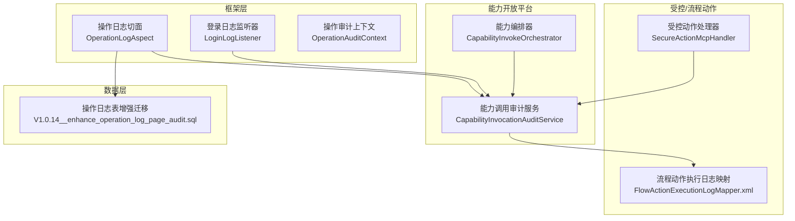
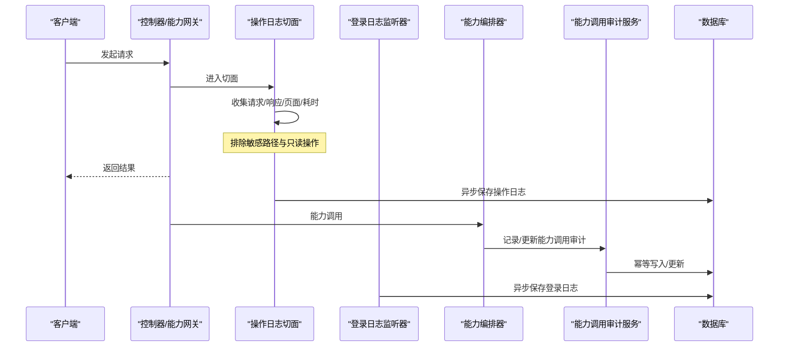
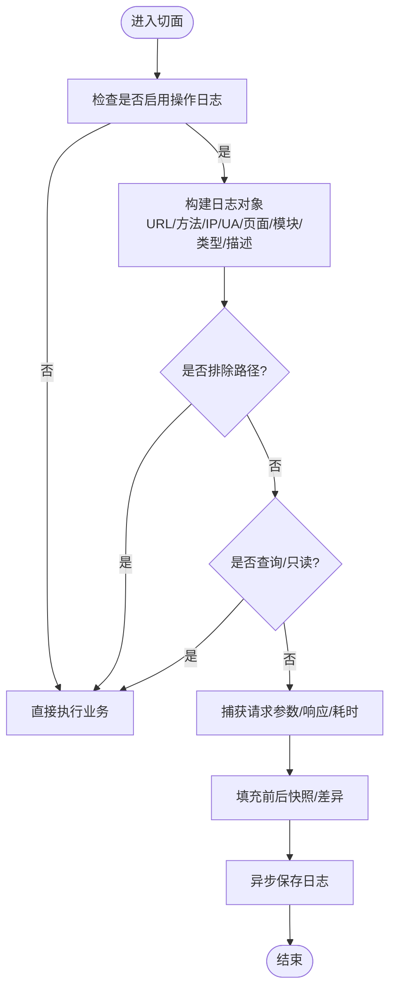
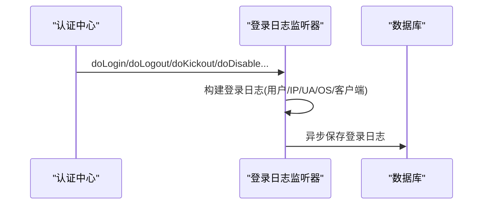
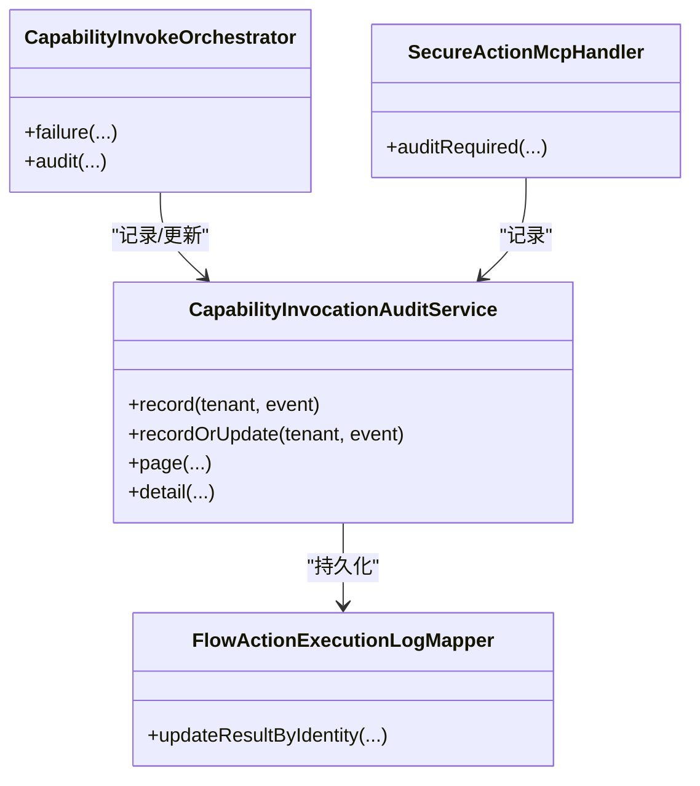
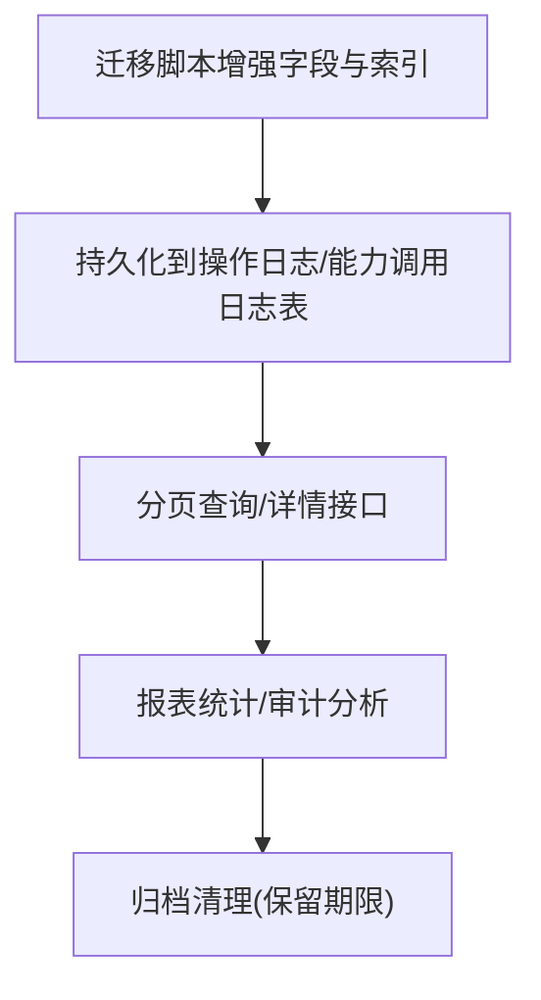
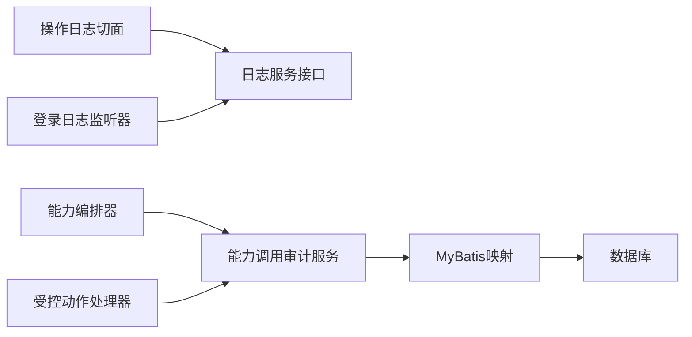

# 审计安全

<cite>
**本文引用的文件**
- [OperationLogAspect.java](file://forge-server/forge-framework/forge-starter-parent/forge-starter-log/src/main/java/com/mdframe/forge/starter/log/aspect/OperationLogAspect.java)
- [LoginLogListener.java](file://forge-server/forge-framework/forge-starter-parent/forge-starter-log/src/main/java/com/mdframe/forge/starter/log/listener/LoginLogListener.java)
- [CapabilityInvocationAuditService.java](file://forge-server/forge-framework/forge-plugin-parent/forge-plugin-capability-parent/forge-plugin-capability-platform/src/main/java/com/mdframe/forge/plugin/capability/controlplane/service/CapabilityInvocationAuditService.java)
- [CapabilityInvokeOrchestrator.java](file://forge-server/forge-framework/forge-plugin-parent/forge-plugin-capability-parent/forge-plugin-capability-platform/src/main/java/com/mdframe/forge/plugin/capability/opengateway/service/CapabilityInvokeOrchestrator.java)
- [SecureActionMcpHandler.java](file://forge-server/forge-framework/forge-plugin-parent/forge-plugin-capability-parent/forge-plugin-capability-actions/src/main/java/com/mdframe/forge/plugin/capability/secureaction/mcp/SecureActionMcpHandler.java)
- [FlowActionExecutionLogMapper.xml](file://forge-server/forge-framework/forge-plugin-parent/forge-plugin-capability-parent/forge-plugin-capability-actions/src/main/resources/mapper/FlowActionExecutionLogMapper.xml)
- [V1.0.14__enhance_operation_log_page_audit.sql](file://forge-server/db/migration/V1.0.14__enhance_operation_log_page_audit.sql)
- [BusinessActionExecutionService.java](file://forge-server/forge-framework/forge-plugin-parent/forge-plugin-generator/src/main/java/com/mdframe/forge/plugin/generator/service/businessapp/BusinessActionExecutionService.java)
</cite>

## 目录
1. [简介](#简介)
2. [项目结构](#项目结构)
3. [核心组件](#核心组件)
4. [架构总览](#架构总览)
5. [详细组件分析](#详细组件分析)
6. [依赖关系分析](#依赖关系分析)
7. [性能考虑](#性能考虑)
8. [故障排查指南](#故障排查指南)
9. [结论](#结论)
10. [附录：配置与合规清单](#附录：配置与合规清单)

## 简介
本文件面向 Forge Admin 的审计与安全能力，系统性说明操作日志记录、登录日志管理、安全事件审计、审计日志存储与管理以及合规性支持。内容基于代码库中的切面、监听器、服务与迁移脚本，覆盖用户操作审计、系统变更追踪、业务操作记录、登录成功失败记录、IP与设备信息、异常行为检测、权限变更审计、敏感操作记录、日志分级存储、查询分析、报表统计、归档清理等关键主题，并提供可操作的配置示例与合规检查清单，帮助企业满足 GDPR、等保2.0等要求。

## 项目结构
审计相关能力主要分布在以下模块：
- 框架层日志基础能力：操作日志切面、登录日志监听器、审计上下文
- 能力开放平台：能力调用审计服务与编排器
- 受控动作与流程动作：执行审计与持久化映射
- 数据库迁移：操作日志表增强字段与索引

图表来源
- [OperationLogAspect.java:89-242](file://forge-server/forge-framework/forge-starter-parent/forge-starter-log/src/main/java/com/mdframe/forge/starter/log/aspect/OperationLogAspect.java#L89-L242)
- [LoginLogListener.java:48-173](file://forge-server/forge-framework/forge-starter-parent/forge-starter-log/src/main/java/com/mdframe/forge/starter/log/listener/LoginLogListener.java#L48-L173)
- [CapabilityInvokeOrchestrator.java:288-420](file://forge-server/forge-framework/forge-plugin-parent/forge-plugin-capability-parent/forge-plugin-capability-platform/src/main/java/com/mdframe/forge/plugin/capability/opengateway/service/CapabilityInvokeOrchestrator.java#L288-L420)
- [CapabilityInvocationAuditService.java:40-107](file://forge-server/forge-framework/forge-plugin-parent/forge-plugin-capability-parent/forge-plugin-capability-platform/src/main/java/com/mdframe/forge/plugin/capability/controlplane/service/CapabilityInvocationAuditService.java#L40-L107)
- [SecureActionMcpHandler.java:276-298](file://forge-server/forge-framework/forge-plugin-parent/forge-plugin-capability-parent/forge-plugin-capability-actions/src/main/java/com/mdframe/forge/plugin/capability/secureaction/mcp/SecureActionMcpHandler.java#L276-L298)
- [FlowActionExecutionLogMapper.xml:26-50](file://forge-server/forge-framework/forge-plugin-parent/forge-plugin-capability-parent/forge-plugin-capability-actions/src/main/resources/mapper/FlowActionExecutionLogMapper.xml#L26-L50)
- [V1.0.14__enhance_operation_log_page_audit.sql:1-55](file://forge-server/db/migration/V1.0.14__enhance_operation_log_page_audit.sql#L1-L55)

章节来源
- [OperationLogAspect.java:89-242](file://forge-server/forge-framework/forge-starter-parent/forge-starter-log/src/main/java/com/mdframe/forge/starter/log/aspect/OperationLogAspect.java#L89-L242)
- [LoginLogListener.java:48-173](file://forge-server/forge-framework/forge-starter-parent/forge-starter-log/src/main/java/com/mdframe/forge/starter/log/listener/LoginLogListener.java#L48-L173)
- [CapabilityInvokeOrchestrator.java:288-420](file://forge-server/forge-framework/forge-plugin-parent/forge-plugin-capability-parent/forge-plugin-capability-platform/src/main/java/com/mdframe/forge/plugin/capability/opengateway/service/CapabilityInvokeOrchestrator.java#L288-L420)
- [CapabilityInvocationAuditService.java:40-107](file://forge-server/forge-framework/forge-plugin-parent/forge-plugin-capability-parent/forge-plugin-capability-platform/src/main/java/com/mdframe/forge/plugin/capability/controlplane/service/CapabilityInvocationAuditService.java#L40-L107)
- [SecureActionMcpHandler.java:276-298](file://forge-server/forge-framework/forge-plugin-parent/forge-plugin-capability-parent/forge-plugin-capability-actions/src/main/java/com/mdframe/forge/plugin/capability/secureaction/mcp/SecureActionMcpHandler.java#L276-L298)
- [FlowActionExecutionLogMapper.xml:26-50](file://forge-server/forge-framework/forge-plugin-parent/forge-plugin-capability-parent/forge-plugin-capability-actions/src/main/resources/mapper/FlowActionExecutionLogMapper.xml#L26-L50)
- [V1.0.14__enhance_operation_log_page_audit.sql:1-55](file://forge-server/db/migration/V1.0.14__enhance_operation_log_page_audit.sql#L1-L55)

## 核心组件
- 操作日志切面：拦截控制器方法，采集请求参数、响应结果、页面路径、操作类型、耗时、用户与IP、UA等信息，并异步落库；对敏感接口进行排除与脱敏处理。
- 登录日志监听器：监听认证生命周期事件（登录、登出、踢下线、封禁/解封等），记录登录状态、IP、浏览器与操作系统信息。
- 能力调用审计服务：统一校验、清洗、持久化能力调用审计事件，提供分页查询与详情能力，保障租户隔离与数据安全。
- 能力编排器与受控动作处理器：在能力调用失败或需要审批时记录审计事件，保证审计不丢失且不影响主流程。
- 流程动作执行日志映射：更新执行结果、快照、错误码、耗时等，支撑流程级审计追溯。
- 操作日志表增强迁移：为 sys_operation_log 补充页面、操作人、前后快照与差异字段，提升审计可读性与可追溯性。

章节来源
- [OperationLogAspect.java:89-242](file://forge-server/forge-framework/forge-starter-parent/forge-starter-log/src/main/java/com/mdframe/forge/starter/log/aspect/OperationLogAspect.java#L89-L242)
- [LoginLogListener.java:48-173](file://forge-server/forge-framework/forge-starter-parent/forge-starter-log/src/main/java/com/mdframe/forge/starter/log/listener/LoginLogListener.java#L48-L173)
- [CapabilityInvocationAuditService.java:40-107](file://forge-server/forge-framework/forge-plugin-parent/forge-plugin-capability-parent/forge-plugin-capability-platform/src/main/java/com/mdframe/forge/plugin/capability/controlplane/service/CapabilityInvocationAuditService.java#L40-L107)
- [CapabilityInvokeOrchestrator.java:288-420](file://forge-server/forge-framework/forge-plugin-parent/forge-plugin-capability-parent/forge-plugin-capability-platform/src/main/java/com/mdframe/forge/plugin/capability/opengateway/service/CapabilityInvokeOrchestrator.java#L288-L420)
- [SecureActionMcpHandler.java:276-298](file://forge-server/forge-framework/forge-plugin-parent/forge-plugin-capability-parent/forge-plugin-capability-actions/src/main/java/com/mdframe/forge/plugin/capability/secureaction/mcp/SecureActionMcpHandler.java#L276-L298)
- [FlowActionExecutionLogMapper.xml:26-50](file://forge-server/forge-framework/forge-plugin-parent/forge-plugin-capability-parent/forge-plugin-capability-actions/src/main/resources/mapper/FlowActionExecutionLogMapper.xml#L26-L50)
- [V1.0.14__enhance_operation_log_page_audit.sql:1-55](file://forge-server/db/migration/V1.0.14__enhance_operation_log_page_audit.sql#L1-L55)

## 架构总览
审计体系由“采集—处理—存储—查询”四层构成：
- 采集层：操作日志切面与登录日志监听器负责全量采集；能力编排器与受控动作处理器负责业务侧审计事件生成。
- 处理层：审计服务负责事件校验、脱敏、去重与幂等写入；上下文对象用于跨层传递快照。
- 存储层：通过 MyBatis 映射持久化到操作日志表与能力调用日志表；迁移脚本增强字段与索引。
- 查询层：提供分页查询与详情接口，便于报表统计与审计分析。

图表来源
- [OperationLogAspect.java:89-242](file://forge-server/forge-framework/forge-starter-parent/forge-starter-log/src/main/java/com/mdframe/forge/starter/log/aspect/OperationLogAspect.java#L89-L242)
- [CapabilityInvokeOrchestrator.java:288-420](file://forge-server/forge-framework/forge-plugin-parent/forge-plugin-capability-parent/forge-plugin-capability-platform/src/main/java/com/mdframe/forge/plugin/capability/opengateway/service/CapabilityInvokeOrchestrator.java#L288-L420)
- [CapabilityInvocationAuditService.java:40-107](file://forge-server/forge-framework/forge-plugin-parent/forge-plugin-capability-parent/forge-plugin-capability-platform/src/main/java/com/mdframe/forge/plugin/capability/controlplane/service/CapabilityInvocationAuditService.java#L40-L107)
- [LoginLogListener.java:48-173](file://forge-server/forge-framework/forge-starter-parent/forge-starter-log/src/main/java/com/mdframe/forge/starter/log/listener/LoginLogListener.java#L48-L173)

## 详细组件分析

### 操作日志记录机制
- 触发方式：通过切面拦截控制器方法，自动采集请求URL、方法、IP、UA、页面路径、操作模块、操作类型、描述、请求参数、响应结果、耗时、用户ID等。
- 过滤策略：跳过查询类操作与只读HTTP方法；对敏感认证路径进行硬排除；支持配置化排除路径。
- 快照与差异：通过操作审计上下文注入前后数据与差异，最终填充到操作日志中；若未显式设置，则根据请求/响应回退。
- 异步落库：使用线程池异步保存，避免影响业务性能；异常时记录错误但不中断主流程。
- 安全与脱敏：对带解密注解的请求体进行脱敏标记；对敏感路径不进行日志记录。

图表来源
- [OperationLogAspect.java:89-242](file://forge-server/forge-framework/forge-starter-parent/forge-starter-log/src/main/java/com/mdframe/forge/starter/log/aspect/OperationLogAspect.java#L89-L242)
- [OperationAuditContext.java:16-38](file://forge-server/forge-framework/forge-starter-parent/forge-starter-log/src/main/java/com/mdframe/forge/starter/log/context/OperationAuditContext.java#L16-L38)

章节来源
- [OperationLogAspect.java:89-242](file://forge-server/forge-framework/forge-starter-parent/forge-starter-log/src/main/java/com/mdframe/forge/starter/log/aspect/OperationLogAspect.java#L89-L242)
- [OperationAuditContext.java:16-38](file://forge-server/forge-framework/forge-starter-parent/forge-starter-log/src/main/java/com/mdframe/forge/starter/log/context/OperationAuditContext.java#L16-L38)

### 登录日志管理
- 事件覆盖：登录、登出、踢下线、顶下线、封禁、解封等认证生命周期事件。
- 采集信息：用户ID、登录类型、状态、消息、时间、IP、UA、浏览器、操作系统、客户端标识。
- 异步落库：通过线程池异步保存，确保高并发下不影响认证性能。
- 告警建议：可在外部监控系统中对失败登录、频繁失败、异地登录等进行告警。

图表来源
- [LoginLogListener.java:48-173](file://forge-server/forge-framework/forge-starter-parent/forge-starter-log/src/main/java/com/mdframe/forge/starter/log/listener/LoginLogListener.java#L48-L173)

章节来源
- [LoginLogListener.java:48-173](file://forge-server/forge-framework/forge-starter-parent/forge-starter-log/src/main/java/com/mdframe/forge/starter/log/listener/LoginLogListener.java#L48-L173)

### 安全事件审计
- 能力调用审计：在能力编排器中，无论成功或失败均记录审计事件，包含请求ID、租户、客户端、能力标识、版本、主体类型与ID、组织、结果状态、错误码、失败阶段、错误信息、Schema路径、耗时等。
- 幂等与一致性：审计服务支持按请求身份更新或插入，防止重复记录；严格校验关键字段格式与合法性。
- 受控动作审计：受控动作处理器在需要审批或执行时记录审计事件，确保高风险操作可追溯。
- 流程动作审计：流程动作执行日志支持更新执行结果、快照、错误码与耗时，形成端到端审计链。

图表来源
- [CapabilityInvokeOrchestrator.java:288-420](file://forge-server/forge-framework/forge-plugin-parent/forge-plugin-capability-parent/forge-plugin-capability-platform/src/main/java/com/mdframe/forge/plugin/capability/opengateway/service/CapabilityInvokeOrchestrator.java#L288-L420)
- [CapabilityInvocationAuditService.java:40-107](file://forge-server/forge-framework/forge-plugin-parent/forge-plugin-capability-parent/forge-plugin-capability-platform/src/main/java/com/mdframe/forge/plugin/capability/controlplane/service/CapabilityInvocationAuditService.java#L40-L107)
- [SecureActionMcpHandler.java:276-298](file://forge-server/forge-framework/forge-plugin-parent/forge-plugin-capability-parent/forge-plugin-capability-actions/src/main/java/com/mdframe/forge/plugin/capability/secureaction/mcp/SecureActionMcpHandler.java#L276-L298)
- [FlowActionExecutionLogMapper.xml:26-50](file://forge-server/forge-framework/forge-plugin-parent/forge-plugin-capability-parent/forge-plugin-capability-actions/src/main/resources/mapper/FlowActionExecutionLogMapper.xml#L26-L50)

章节来源
- [CapabilityInvokeOrchestrator.java:288-420](file://forge-server/forge-framework/forge-plugin-parent/forge-plugin-capability-parent/forge-plugin-capability-platform/src/main/java/com/mdframe/forge/plugin/capability/opengateway/service/CapabilityInvokeOrchestrator.java#L288-L420)
- [CapabilityInvocationAuditService.java:40-107](file://forge-server/forge-framework/forge-plugin-parent/forge-plugin-capability-parent/forge-plugin-capability-platform/src/main/java/com/mdframe/forge/plugin/capability/controlplane/service/CapabilityInvocationAuditService.java#L40-L107)
- [SecureActionMcpHandler.java:276-298](file://forge-server/forge-framework/forge-plugin-parent/forge-plugin-capability-parent/forge-plugin-capability-actions/src/main/java/com/mdframe/forge/plugin/capability/secureaction/mcp/SecureActionMcpHandler.java#L276-L298)
- [FlowActionExecutionLogMapper.xml:26-50](file://forge-server/forge-framework/forge-plugin-parent/forge-plugin-capability-parent/forge-plugin-capability-actions/src/main/resources/mapper/FlowActionExecutionLogMapper.xml#L26-L50)

### 审计日志的存储与管理
- 表结构增强：通过迁移脚本为 sys_operation_log 新增操作人姓名、页面路径、操作内容、前后数据、差异数据等字段，并创建复合索引以优化查询。
- 查询与分析：能力调用审计服务提供分页查询与详情接口，支持按租户、客户端、请求ID、能力标识、主体关键词、结果码筛选。
- 归档清理：业务动作执行日志支持保留期限字段，可按年计算到期时间，便于后续归档与清理任务。
- 数据隔离：审计服务在可信租户上下文中执行，确保多租户隔离与数据安全。

图表来源
- [V1.0.14__enhance_operation_log_page_audit.sql:1-55](file://forge-server/db/migration/V1.0.14__enhance_operation_log_page_audit.sql#L1-L55)
- [CapabilityInvocationAuditService.java:162-191](file://forge-server/forge-framework/forge-plugin-parent/forge-plugin-capability-parent/forge-plugin-capability-platform/src/main/java/com/mdframe/forge/plugin/capability/controlplane/service/CapabilityInvocationAuditService.java#L162-L191)
- [BusinessActionExecutionService.java:626-650](file://forge-server/forge-framework/forge-plugin-parent/forge-plugin-generator/src/main/java/com/mdframe/forge/plugin/generator/service/businessapp/BusinessActionExecutionService.java#L626-L650)

章节来源
- [V1.0.14__enhance_operation_log_page_audit.sql:1-55](file://forge-server/db/migration/V1.0.14__enhance_operation_log_page_audit.sql#L1-L55)
- [CapabilityInvocationAuditService.java:162-191](file://forge-server/forge-framework/forge-plugin-parent/forge-plugin-capability-parent/forge-plugin-capability-platform/src/main/java/com/mdframe/forge/plugin/capability/controlplane/service/CapabilityInvocationAuditService.java#L162-L191)
- [BusinessActionExecutionService.java:626-650](file://forge-server/forge-framework/forge-plugin-parent/forge-plugin-generator/src/main/java/com/mdframe/forge/plugin/generator/service/businessapp/BusinessActionExecutionService.java#L626-L650)

## 依赖关系分析
- 松耦合设计：切面与监听器通过统一的日志服务接口解耦，便于替换实现与扩展。
- 强校验与容错：能力调用审计服务对输入进行严格校验与脱敏，异常时不影响主流程；编排器在审计不可用时降级并抛出特定错误码。
- 租户隔离：审计服务在可信租户上下文中执行，避免越权访问。
- 幂等与一致性：通过请求身份唯一键进行更新或插入，避免重复记录。

图表来源
- [OperationLogAspect.java:89-242](file://forge-server/forge-framework/forge-starter-parent/forge-starter-log/src/main/java/com/mdframe/forge/starter/log/aspect/OperationLogAspect.java#L89-L242)
- [LoginLogListener.java:48-173](file://forge-server/forge-framework/forge-starter-parent/forge-starter-log/src/main/java/com/mdframe/forge/starter/log/listener/LoginLogListener.java#L48-L173)
- [CapabilityInvokeOrchestrator.java:288-420](file://forge-server/forge-framework/forge-plugin-parent/forge-plugin-capability-parent/forge-plugin-capability-platform/src/main/java/com/mdframe/forge/plugin/capability/opengateway/service/CapabilityInvokeOrchestrator.java#L288-L420)
- [CapabilityInvocationAuditService.java:40-107](file://forge-server/forge-framework/forge-plugin-parent/forge-plugin-capability-parent/forge-plugin-capability-platform/src/main/java/com/mdframe/forge/plugin/capability/controlplane/service/CapabilityInvocationAuditService.java#L40-L107)

章节来源
- [OperationLogAspect.java:89-242](file://forge-server/forge-framework/forge-starter-parent/forge-starter-log/src/main/java/com/mdframe/forge/starter/log/aspect/OperationLogAspect.java#L89-L242)
- [LoginLogListener.java:48-173](file://forge-server/forge-framework/forge-starter-parent/forge-starter-log/src/main/java/com/mdframe/forge/starter/log/listener/LoginLogListener.java#L48-L173)
- [CapabilityInvokeOrchestrator.java:288-420](file://forge-server/forge-framework/forge-plugin-parent/forge-plugin-capability-parent/forge-plugin-capability-platform/src/main/java/com/mdframe/forge/plugin/capability/opengateway/service/CapabilityInvokeOrchestrator.java#L288-L420)
- [CapabilityInvocationAuditService.java:40-107](file://forge-server/forge-framework/forge-plugin-parent/forge-plugin-capability-parent/forge-plugin-capability-platform/src/main/java/com/mdframe/forge/plugin/capability/controlplane/service/CapabilityInvocationAuditService.java#L40-L107)

## 性能考虑
- 异步落库：操作日志与登录日志均采用线程池异步保存，降低对主流程的影响。
- 只读与查询过滤：默认跳过查询类操作与只读HTTP方法，减少无效日志写入。
- 字符串截断：对请求参数、响应结果、错误信息等字段进行长度限制，避免大对象写入。
- 索引优化：为操作日志表新增复合索引，提升按页面与时间的查询效率。
- 幂等写入：能力调用审计支持按请求身份更新或插入，避免重复写入带来的性能损耗。

[本节为通用性能建议，无需具体文件引用]

## 故障排查指南
- 日志未记录：
  - 检查是否启用了操作日志或登录日志开关。
  - 确认请求是否命中排除路径（如认证相关路径）。
  - 查看是否被识别为查询/只读操作而被跳过。
- 审计缺失或冲突：
  - 核对能力调用审计事件的必填字段与格式校验。
  - 检查请求身份是否一致，避免重复或冲突记录。
- 性能问题：
  - 评估异步线程池容量与队列大小。
  - 检查日志字段长度与快照大小，必要时调整截断策略。
- 数据不一致：
  - 核查租户上下文是否正确设置。
  - 确认幂等键与更新逻辑是否符合预期。

章节来源
- [OperationLogAspect.java:89-242](file://forge-server/forge-framework/forge-starter-parent/forge-starter-log/src/main/java/com/mdframe/forge/starter/log/aspect/OperationLogAspect.java#L89-L242)
- [CapabilityInvocationAuditService.java:109-154](file://forge-server/forge-framework/forge-plugin-parent/forge-plugin-capability-parent/forge-plugin-capability-platform/src/main/java/com/mdframe/forge/plugin/capability/controlplane/service/CapabilityInvocationAuditService.java#L109-L154)
- [CapabilityInvokeOrchestrator.java:400-420](file://forge-server/forge-framework/forge-plugin-parent/forge-plugin-capability-parent/forge-plugin-capability-platform/src/main/java/com/mdframe/forge/plugin/capability/opengateway/service/CapabilityInvokeOrchestrator.java#L400-L420)

## 结论
Forge Admin 的审计安全体系通过切面与监听器实现无侵入采集，结合能力编排与受控动作处理器形成完整的安全事件审计链路；审计服务提供严格的校验、脱敏与幂等写入，保障数据质量与一致性；迁移脚本与索引优化提升了查询与分析效率；保留期限与归档清理机制满足长期合规需求。整体架构具备高可用、高性能与高可扩展性，能够有效支撑企业级审计与合规要求。

[本节为总结性内容，无需具体文件引用]

## 附录：配置与合规清单

### 审计配置示例
- 启用/禁用操作日志与登录日志：通过日志属性开关控制。
- 排除路径配置：支持配置化排除路径，结合硬编码的敏感认证路径，避免泄露敏感信息。
- 请求/响应长度限制：配置最大长度，避免大对象写入。
- 打印日志开关：调试时可开启控制台打印入参、出参与异常日志。
- 保留期限：为业务动作执行日志设置保留年限，便于归档清理。

章节来源
- [OperationLogAspect.java:89-242](file://forge-server/forge-framework/forge-starter-parent/forge-starter-log/src/main/java/com/mdframe/forge/starter/log/aspect/OperationLogAspect.java#L89-L242)
- [LoginLogListener.java:48-173](file://forge-server/forge-framework/forge-starter-parent/forge-starter-log/src/main/java/com/mdframe/forge/starter/log/listener/LoginLogListener.java#L48-L173)
- [BusinessActionExecutionService.java:626-650](file://forge-server/forge-framework/forge-plugin-parent/forge-plugin-generator/src/main/java/com/mdframe/forge/plugin/generator/service/businessapp/BusinessActionExecutionService.java#L626-L650)

### 合规性检查清单
- GDPR 合规
  - 最小化采集：仅采集必要字段，避免敏感信息泄露。
  - 数据主体权利：支持按用户ID查询与导出个人相关日志。
  - 数据保留：配置合理的保留期限与归档清理策略。
- 等保2.0 要求
  - 审计完整性：确保操作日志与登录日志完整、不可篡改。
  - 审计连续性：异步落库与异常保护，确保审计不中断。
  - 审计可追溯：关联请求ID、租户、主体、能力标识等关键信息。
- 审计报表生成
  - 分页查询：支持多维度筛选与排序。
  - 详情查看：提供单次调用的完整审计详情。
  - 统计分析：基于页面、模块、操作类型、结果码等维度生成报表。

章节来源
- [CapabilityInvocationAuditService.java:162-191](file://forge-server/forge-framework/forge-plugin-parent/forge-plugin-capability-parent/forge-plugin-capability-platform/src/main/java/com/mdframe/forge/plugin/capability/controlplane/service/CapabilityInvocationAuditService.java#L162-L191)
- [V1.0.14__enhance_operation_log_page_audit.sql:1-55](file://forge-server/db/migration/V1.0.14__enhance_operation_log_page_audit.sql#L1-L55)