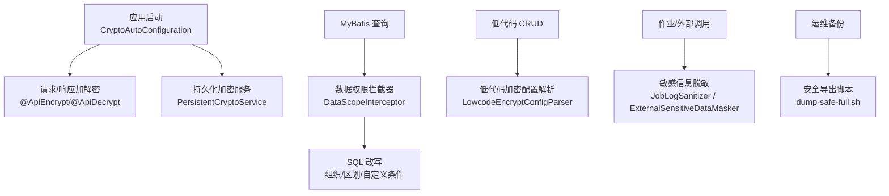
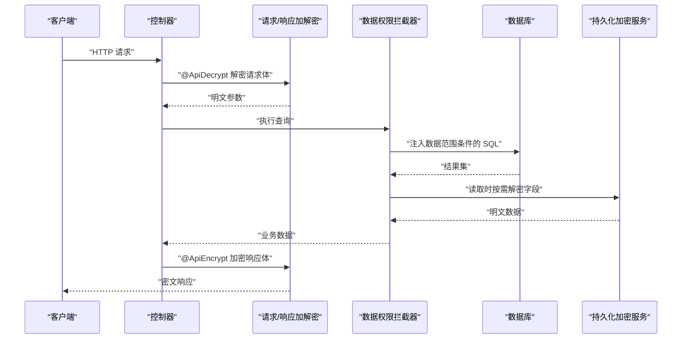
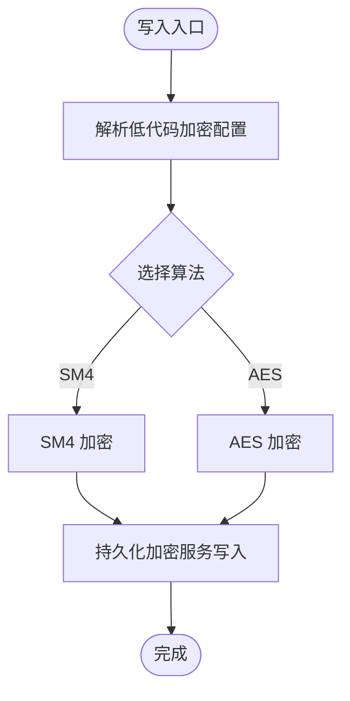
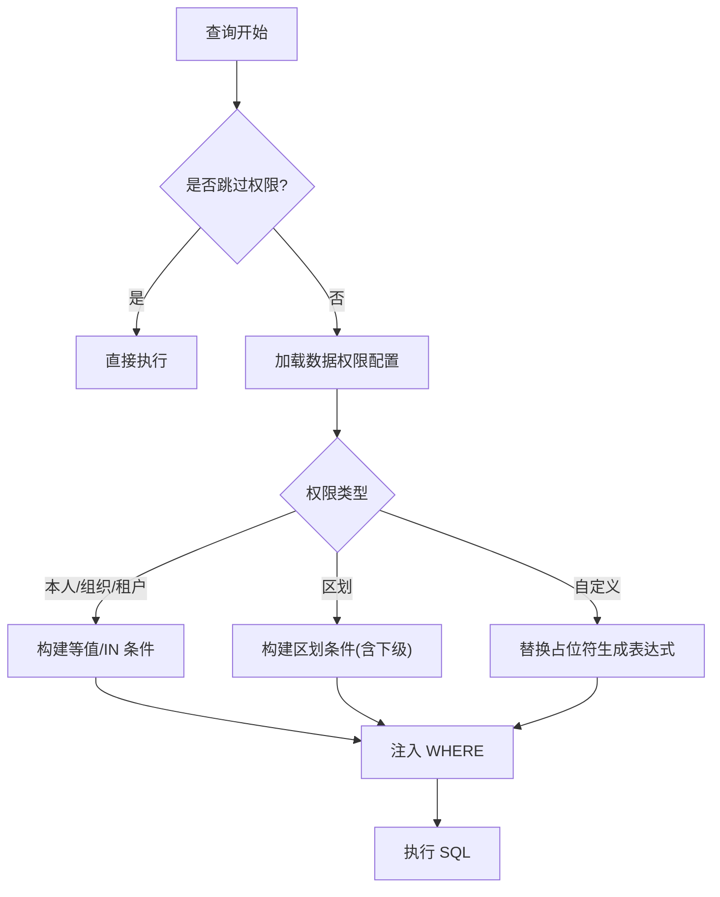
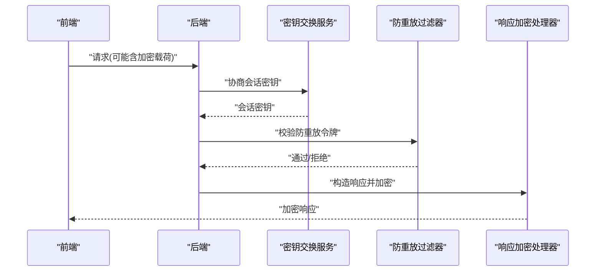
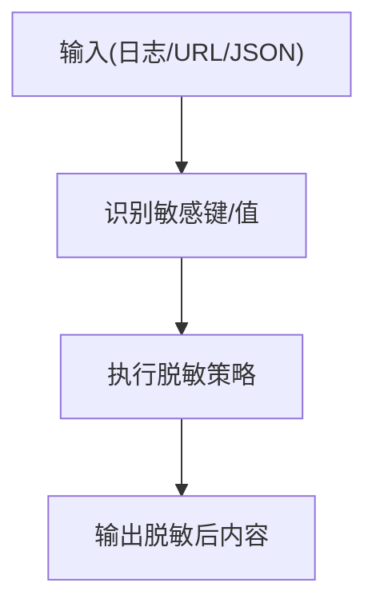
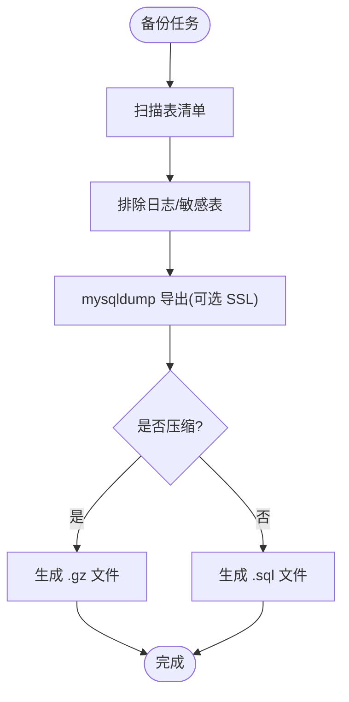
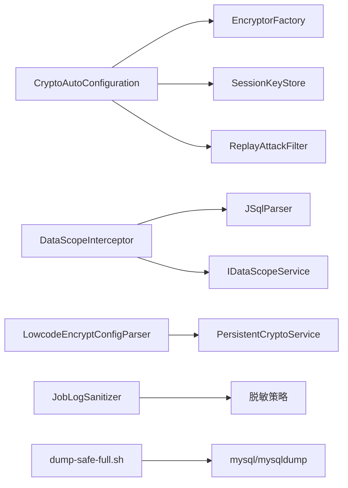

# 数据安全

<cite>
**本文引用的文件**
- [CryptoAutoConfiguration.java](file://forge-server/forge-framework/forge-starter-parent/forge-starter-crypto/src/main/java/com/mdframe/forge/starter/crypto/config/CryptoAutoConfiguration.java)
- [ApiEncrypt.java](file://forge-server/forge-framework/forge-starter-parent/forge-starter-core/src/main/java/com/mdframe/forge/starter/core/annotation/crypto/ApiEncrypt.java)
- [ApiDecrypt.java](file://forge-server/forge-framework/forge-starter-parent/forge-starter-core/src/main/java/com/mdframe/forge/starter/core/annotation/crypto/ApiDecrypt.java)
- [DataScopeInterceptor.java](file://forge-server/forge-framework/forge-starter-parent/forge-starter-datascope/src/main/java/com/mdframe/forge/starter/datascope/handler/DataScopeInterceptor.java)
- [datascope_tables.sql](file://forge-server/forge-framework/forge-starter-parent/forge-starter-datascope/sql/datascope_tables.sql)
- [LowcodeEncryptConfigParserTest.java](file://forge-server/forge-framework/forge-plugin-parent/forge-plugin-generator/src/test/java/com/mdframe/forge/plugin/generator/service/crypto/LowcodeEncryptConfigParserTest.java)
- [DynamicCrudCryptoLifecycleTest.java](file://forge-server/forge-framework/forge-plugin-parent/forge-plugin-generator/src/test/java/com/mdframe/forge/plugin/generator/service/DynamicCrudCryptoLifecycleTest.java)
- [DataConnectionServiceCryptoTest.java](file://forge-server/forge-framework/forge-plugin-parent/forge-plugin-data/src/test/java/com/mdframe/forge/plugin/data/service/DataConnectionServiceCryptoTest.java)
- [ExternalSensitiveDataMaskerTest.java](file://forge-server/forge-framework/forge-plugin-parent/forge-plugin-external/src/test/java/com/mdframe/forge/plugin/external/support/ExternalSensitiveDataMaskerTest.java)
- [JobLogSanitizer.java](file://forge-server/forge-framework/forge-plugin-parent/forge-plugin-job/src/main/java/com/mdframe/forge/plugin/job/support/JobLogSanitizer.java)
- [FormulaValueMaskerTest.java](file://forge-server/forge-framework/forge-plugin-parent/forge-plugin-generator/src/test/java/com/mdframe/forge/plugin/generator/service/formula/FormulaValueMaskerTest.java)
- [dump-safe-full.sh](file://forge-server/scripts/db/dump-safe-full.sh)
- [spec.md（框架加密密钥生命周期加固）](file://code-copilot/changes/framework-crypto-key-lifecycle-hardening/spec.md)
</cite>

## 目录
1. [简介](#简介)
2. [项目结构](#项目结构)
3. [核心组件](#核心组件)
4. [架构总览](#架构总览)
5. [详细组件分析](#详细组件分析)
6. [依赖关系分析](#依赖关系分析)
7. [性能考虑](#性能考虑)
8. [故障排查指南](#故障排查指南)
9. [结论](#结论)
10. [附录](#附录)

## 简介
本文件面向 Forge Admin 的数据安全，系统性说明数据在存储、传输、访问控制与脱敏等关键环节的安全机制，并给出配置要点与最佳实践。内容覆盖：
- 数据存储加密：敏感字段加密（SM4/AES）、数据库字段加密、配置文件加密与密钥生命周期管理
- 数据权限控制：基于组织架构、行政区划、自定义 SQL 的数据范围过滤
- 数据传输安全：请求参数加密、响应数据解密、防重放与中间人攻击防护
- 数据脱敏：日志脱敏、接口响应脱敏、导出文件脱敏
- 备份与恢复：加密备份、传输安全、存储安全与完整生命周期治理

## 项目结构
与安全相关的核心实现分布在以下模块：
- 加密与传输安全：starter-crypto 自动装配、注解驱动加解密、会话密钥交换、防重放过滤器
- 数据权限：starter-datascope 拦截器与配置表，支持组织、区划、自定义 SQL 等多维数据范围
- 低代码与业务数据加密：generator 插件中的低代码加密配置解析与动态 CRUD 生命周期
- 外部调用与日志脱敏：job、external 插件的日志与外部通信敏感信息脱敏
- 备份脚本：db 脚本提供安全全量导出，默认排除日志与敏感表数据

**图表来源**
- [CryptoAutoConfiguration.java:33-192](file://forge-server/forge-framework/forge-starter-parent/forge-starter-crypto/src/main/java/com/mdframe/forge/starter/crypto/config/CryptoAutoConfiguration.java#L33-L192)
- [DataScopeInterceptor.java:41-155](file://forge-server/forge-framework/forge-starter-parent/forge-starter-datascope/src/main/java/com/mdframe/forge/starter/datascope/handler/DataScopeInterceptor.java#L41-L155)
- [LowcodeEncryptConfigParserTest.java:17-42](file://forge-server/forge-framework/forge-plugin-parent/forge-plugin-generator/src/test/java/com/mdframe/forge/plugin/generator/service/crypto/LowcodeEncryptConfigParserTest.java#L17-L42)
- [JobLogSanitizer.java:53-116](file://forge-server/forge-framework/forge-plugin-parent/forge-plugin-job/src/main/java/com/mdframe/forge/plugin/job/support/JobLogSanitizer.java#L53-L116)
- [dump-safe-full.sh:229-312](file://forge-server/scripts/db/dump-safe-full.sh#L229-L312)

**章节来源**
- [CryptoAutoConfiguration.java:33-192](file://forge-server/forge-framework/forge-starter-parent/forge-starter-crypto/src/main/java/com/mdframe/forge/starter/crypto/config/CryptoAutoConfiguration.java#L33-L192)
- [DataScopeInterceptor.java:41-155](file://forge-server/forge-framework/forge-starter-parent/forge-starter-datascope/src/main/java/com/mdframe/forge/starter/datascope/handler/DataScopeInterceptor.java#L41-L155)
- [LowcodeEncryptConfigParserTest.java:17-42](file://forge-server/forge-framework/forge-plugin-parent/forge-plugin-generator/src/test/java/com/mdframe/forge/plugin/generator/service/crypto/LowcodeEncryptConfigParserTest.java#L17-L42)
- [JobLogSanitizer.java:53-116](file://forge-server/forge-framework/forge-plugin-parent/forge-plugin-job/src/main/java/com/mdframe/forge/plugin/job/support/JobLogSanitizer.java#L53-L116)
- [dump-safe-full.sh:229-312](file://forge-server/scripts/db/dump-safe-full.sh#L229-L312)

## 核心组件
- 加密自动装配与算法注册：统一注册 SM4、AES、AES_GCM 加密器，提供持久化加密服务与响应/请求加解密处理器
- 注解驱动的 API 加解密：通过 @ApiEncrypt 与 @ApiDecrypt 对接口进行声明式加解密
- 数据权限拦截器：基于 MyBatis Plus InnerInterceptor 在 SQL 执行前注入数据范围条件
- 低代码加密配置解析：按字段维度配置加密算法与目标列，并在 CRUD 生命周期中应用
- 敏感信息脱敏：日志、外部调用、公式值等场景的脱敏策略
- 安全备份导出：默认跳过日志与敏感配置表数据，支持 SSL 传输与可选压缩

**章节来源**
- [CryptoAutoConfiguration.java:100-164](file://forge-server/forge-framework/forge-starter-parent/forge-starter-crypto/src/main/java/com/mdframe/forge/starter/crypto/config/CryptoAutoConfiguration.java#L100-L164)
- [ApiEncrypt.java:1-20](file://forge-server/forge-framework/forge-starter-parent/forge-starter-core/src/main/java/com/mdframe/forge/starter/core/annotation/crypto/ApiEncrypt.java#L1-L20)
- [ApiDecrypt.java:1-20](file://forge-server/forge-framework/forge-starter-parent/forge-starter-core/src/main/java/com/mdframe/forge/starter/core/annotation/crypto/ApiDecrypt.java#L1-L20)
- [DataScopeInterceptor.java:69-155](file://forge-server/forge-framework/forge-starter-parent/forge-starter-datascope/src/main/java/com/mdframe/forge/starter/datascope/handler/DataScopeInterceptor.java#L69-L155)
- [LowcodeEncryptConfigParserTest.java:17-42](file://forge-server/forge-framework/forge-plugin-parent/forge-plugin-generator/src/test/java/com/mdframe/forge/plugin/generator/service/crypto/LowcodeEncryptConfigParserTest.java#L17-L42)
- [JobLogSanitizer.java:53-116](file://forge-server/forge-framework/forge-plugin-parent/forge-plugin-job/src/main/java/com/mdframe/forge/plugin/job/support/JobLogSanitizer.java#L53-L116)
- [dump-safe-full.sh:229-312](file://forge-server/scripts/db/dump-safe-full.sh#L229-L312)

## 架构总览
下图展示了从请求进入、数据权限过滤到持久化加密与返回响应的整体流程。

**图表来源**
- [CryptoAutoConfiguration.java:142-164](file://forge-server/forge-framework/forge-starter-parent/forge-starter-crypto/src/main/java/com/mdframe/forge/starter/crypto/config/CryptoAutoConfiguration.java#L142-L164)
- [DataScopeInterceptor.java:139-155](file://forge-server/forge-framework/forge-starter-parent/forge-starter-datascope/src/main/java/com/mdframe/forge/starter/datascope/handler/DataScopeInterceptor.java#L139-L155)

## 详细组件分析

### 数据存储加密（SM4/AES、数据库字段、配置文件）
- 算法与工厂：自动装配阶段注册 SM4、AES、AES_GCM 加密器，并提供 EncryptorFactory 供上层使用
- 持久化加密：通过 PersistentCryptoService（版本化实现）负责数据库密文的读写，支持活动 keyId 写入与历史 key 只读解密
- 低代码字段加密：通过 LowcodeEncryptConfigParser 解析字段级加密配置（如手机号用 SM4、身份证映射到指定列并用 AES），并在 DynamicCrud 生命周期中应用
- 数据连接密码：保存时由持久化加密服务处理，确保密码不落地为明文
- 密钥生命周期：根密钥与持久化 keyring 不得入库或落盘至仓库；仅允许通过环境变量或外部配置注入；新增版本化密文协议携带算法与 keyId；迁移需 dry-run 与显式执行

**图表来源**
- [CryptoAutoConfiguration.java:100-134](file://forge-server/forge-framework/forge-starter-parent/forge-starter-crypto/src/main/java/com/mdframe/forge/starter/crypto/config/CryptoAutoConfiguration.java#L100-L134)
- [LowcodeEncryptConfigParserTest.java:17-42](file://forge-server/forge-framework/forge-plugin-parent/forge-plugin-generator/src/test/java/com/mdframe/forge/plugin/generator/service/crypto/LowcodeEncryptConfigParserTest.java#L17-L42)
- [DynamicCrudCryptoLifecycleTest.java:33-94](file://forge-server/forge-framework/forge-plugin-parent/forge-plugin-generator/src/test/java/com/mdframe/forge/plugin/generator/service/DynamicCrudCryptoLifecycleTest.java#L33-L94)
- [DataConnectionServiceCryptoTest.java:23-33](file://forge-server/forge-framework/forge-plugin-parent/forge-plugin-data/src/test/java/com/mdframe/forge/plugin/data/service/DataConnectionServiceCryptoTest.java#L23-L33)
- [spec.md（框架加密密钥生命周期加固）:102-119](file://code-copilot/changes/framework-crypto-key-lifecycle-hardening/spec.md#L102-L119)

**章节来源**
- [CryptoAutoConfiguration.java:100-134](file://forge-server/forge-framework/forge-starter-parent/forge-starter-crypto/src/main/java/com/mdframe/forge/starter/crypto/config/CryptoAutoConfiguration.java#L100-L134)
- [LowcodeEncryptConfigParserTest.java:17-42](file://forge-server/forge-framework/forge-plugin-parent/forge-plugin-generator/src/test/java/com/mdframe/forge/plugin/generator/service/crypto/LowcodeEncryptConfigParserTest.java#L17-L42)
- [DynamicCrudCryptoLifecycleTest.java:33-94](file://forge-server/forge-framework/forge-plugin-parent/forge-plugin-generator/src/test/java/com/mdframe/forge/plugin/generator/service/DynamicCrudCryptoLifecycleTest.java#L33-L94)
- [DataConnectionServiceCryptoTest.java:23-33](file://forge-server/forge-framework/forge-plugin-parent/forge-plugin-data/src/test/java/com/mdframe/forge/plugin/data/service/DataConnectionServiceCryptoTest.java#L23-L33)
- [spec.md（框架加密密钥生命周期加固）:102-119](file://code-copilot/changes/framework-crypto-key-lifecycle-hardening/spec.md#L102-L119)

### 数据权限控制（组织架构、行政区划、自定义 SQL）
- 拦截时机：MyBatis Plus InnerInterceptor 在 beforeQuery 阶段拦截 SELECT
- 配置来源：sys_data_scope_config 表定义资源与方法级别的数据范围规则
- 权限类型：本人、本组织、本组织及下级、租户全部、自定义组织、行政区划（含本级与下级）
- SQL 改写：基于 JSqlParser 解析并注入 WHERE 条件，支持简单字段匹配与复杂 <sql> 模板
- 兜底策略：未配置 Mapper 的策略可配置为拒绝或兼容放行；失败关闭模式保障安全

**图表来源**
- [DataScopeInterceptor.java:69-155](file://forge-server/forge-framework/forge-starter-parent/forge-starter-datascope/src/main/java/com/mdframe/forge/starter/datascope/handler/DataScopeInterceptor.java#L69-L155)
- [DataScopeInterceptor.java:232-426](file://forge-server/forge-framework/forge-starter-parent/forge-starter-datascope/src/main/java/com/mdframe/forge/starter/datascope/handler/DataScopeInterceptor.java#L232-L426)
- [datascope_tables.sql:112-145](file://forge-server/forge-framework/forge-starter-parent/forge-starter-datascope/sql/datascope_tables.sql#L112-L145)

**章节来源**
- [DataScopeInterceptor.java:69-155](file://forge-server/forge-framework/forge-starter-parent/forge-starter-datascope/src/main/java/com/mdframe/forge/starter/datascope/handler/DataScopeInterceptor.java#L69-L155)
- [DataScopeInterceptor.java:232-426](file://forge-server/forge-framework/forge-starter-parent/forge-starter-datascope/src/main/java/com/mdframe/forge/starter/datascope/handler/DataScopeInterceptor.java#L232-L426)
- [datascope_tables.sql:112-145](file://forge-server/forge-framework/forge-starter-parent/forge-starter-datascope/sql/datascope_tables.sql#L112-L145)

### 数据传输安全（请求加密、响应解密、防重放与中间人防护）
- 请求/响应加解密：通过 @ApiDecrypt 与 @ApiEncrypt 注解驱动，自动装配中注册请求解密与响应加密 Advice
- 会话密钥协商：RSA 密钥对用于前端与后端协商动态会话密钥，提升传输层安全性
- 防重放攻击：ReplayAttackFilter 结合缓存令牌，防止重复提交
- 中间人防护：建议配合 HTTPS/TLS 使用；内部调用可通过 InternalCallRequestVerifier 校验

**图表来源**
- [CryptoAutoConfiguration.java:53-96](file://forge-server/forge-framework/forge-starter-parent/forge-starter-crypto/src/main/java/com/mdframe/forge/starter/crypto/config/CryptoAutoConfiguration.java#L53-L96)
- [CryptoAutoConfiguration.java:142-190](file://forge-server/forge-framework/forge-starter-parent/forge-starter-crypto/src/main/java/com/mdframe/forge/starter/crypto/config/CryptoAutoConfiguration.java#L142-L190)
- [ApiEncrypt.java:1-20](file://forge-server/forge-framework/forge-starter-parent/forge-starter-core/src/main/java/com/mdframe/forge/starter/core/annotation/crypto/ApiEncrypt.java#L1-L20)
- [ApiDecrypt.java:1-20](file://forge-server/forge-framework/forge-starter-parent/forge-starter-core/src/main/java/com/mdframe/forge/starter/core/annotation/crypto/ApiDecrypt.java#L1-L20)

**章节来源**
- [CryptoAutoConfiguration.java:53-96](file://forge-server/forge-framework/forge-starter-parent/forge-starter-crypto/src/main/java/com/mdframe/forge/starter/crypto/config/CryptoAutoConfiguration.java#L53-L96)
- [CryptoAutoConfiguration.java:142-190](file://forge-server/forge-framework/forge-starter-parent/forge-starter-crypto/src/main/java/com/mdframe/forge/starter/crypto/config/CryptoAutoConfiguration.java#L142-L190)
- [ApiEncrypt.java:1-20](file://forge-server/forge-framework/forge-starter-parent/forge-starter-core/src/main/java/com/mdframe/forge/starter/core/annotation/crypto/ApiEncrypt.java#L1-L20)
- [ApiDecrypt.java:1-20](file://forge-server/forge-framework/forge-starter-parent/forge-starter-core/src/main/java/com/mdframe/forge/starter/core/annotation/crypto/ApiDecrypt.java#L1-L20)

### 数据脱敏（日志、接口响应、导出文件）
- 日志脱敏：JobLogSanitizer 对 JSON 与文本中的敏感键与值进行掩码处理，并对超长输出截断
- 外部调用脱敏：ExternalSensitiveDataMasker 对 JSON、URL 与错误文本中的敏感信息进行脱敏
- 公式值脱敏：FormulaValueMasker 对包含手机号、身份证、银行卡等敏感值的字符串进行掩码
- 接口响应脱敏：可通过 DesensitizeStrategyFactory 与序列化器对响应字段进行脱敏

**图表来源**
- [JobLogSanitizer.java:53-116](file://forge-server/forge-framework/forge-plugin-parent/forge-plugin-job/src/main/java/com/mdframe/forge/plugin/job/support/JobLogSanitizer.java#L53-L116)
- [ExternalSensitiveDataMaskerTest.java:12-37](file://forge-server/forge-framework/forge-plugin-parent/forge-plugin-external/src/test/java/com/mdframe/forge/plugin/external/support/ExternalSensitiveDataMaskerTest.java#L12-L37)
- [FormulaValueMaskerTest.java:16-32](file://forge-server/forge-framework/forge-plugin-parent/forge-plugin-generator/src/test/java/com/mdframe/forge/plugin/generator/service/formula/FormulaValueMaskerTest.java#L16-L32)

**章节来源**
- [JobLogSanitizer.java:53-116](file://forge-server/forge-framework/forge-plugin-parent/forge-plugin-job/src/main/java/com/mdframe/forge/plugin/job/support/JobLogSanitizer.java#L53-L116)
- [ExternalSensitiveDataMaskerTest.java:12-37](file://forge-server/forge-framework/forge-plugin-parent/forge-plugin-external/src/test/java/com/mdframe/forge/plugin/external/support/ExternalSensitiveDataMaskerTest.java#L12-L37)
- [FormulaValueMaskerTest.java:16-32](file://forge-server/forge-framework/forge-plugin-parent/forge-plugin-generator/src/test/java/com/mdframe/forge/plugin/generator/service/formula/FormulaValueMaskerTest.java#L16-L32)

### 备份与恢复（加密备份、传输安全、存储安全）
- 安全导出：dump-safe-full.sh 默认跳过运行时与敏感配置表数据，避免泄露
- 传输安全：支持 --ssl-mode 参数以启用 MySQL 连接加密
- 存储安全：输出文件可压缩为 .gz，便于归档与传输；支持 dry-run 预检
- 恢复建议：在生产恢复前校验完整性与权限，必要时结合企业密钥管理系统对备份文件进行加密存储

**图表来源**
- [dump-safe-full.sh:229-312](file://forge-server/scripts/db/dump-safe-full.sh#L229-L312)
- [dump-safe-full.sh:173-179](file://forge-server/scripts/db/dump-safe-full.sh#L173-L179)
- [dump-safe-full.sh:385-449](file://forge-server/scripts/db/dump-safe-full.sh#L385-L449)

**章节来源**
- [dump-safe-full.sh:229-312](file://forge-server/scripts/db/dump-safe-full.sh#L229-L312)
- [dump-safe-full.sh:173-179](file://forge-server/scripts/db/dump-safe-full.sh#L173-L179)
- [dump-safe-full.sh:385-449](file://forge-server/scripts/db/dump-safe-full.sh#L385-L449)

## 依赖关系分析
- 加密模块依赖：EncryptorFactory、SessionKeyStore、ReplayTokenCache、InternalCallRequestVerifier
- 数据权限依赖：JSqlParser、MyBatis Plus InnerInterceptor、IDataScopeService
- 低代码加密依赖：LowcodeEncryptConfigParser、PersistentCryptoService
- 脱敏依赖：DesensitizeStrategyFactory、各脱敏策略实现
- 备份脚本依赖：mysql/mysqldump 客户端、可选 gzip

**图表来源**
- [CryptoAutoConfiguration.java:100-190](file://forge-server/forge-framework/forge-starter-parent/forge-starter-crypto/src/main/java/com/mdframe/forge/starter/crypto/config/CryptoAutoConfiguration.java#L100-L190)
- [DataScopeInterceptor.java:179-207](file://forge-server/forge-framework/forge-starter-parent/forge-starter-datascope/src/main/java/com/mdframe/forge/starter/datascope/handler/DataScopeInterceptor.java#L179-L207)
- [LowcodeEncryptConfigParserTest.java:17-42](file://forge-server/forge-framework/forge-plugin-parent/forge-plugin-generator/src/test/java/com/mdframe/forge/plugin/generator/service/crypto/LowcodeEncryptConfigParserTest.java#L17-L42)
- [JobLogSanitizer.java:53-116](file://forge-server/forge-framework/forge-plugin-parent/forge-plugin-job/src/main/java/com/mdframe/forge/plugin/job/support/JobLogSanitizer.java#L53-L116)
- [dump-safe-full.sh:167-179](file://forge-server/scripts/db/dump-safe-full.sh#L167-L179)

**章节来源**
- [CryptoAutoConfiguration.java:100-190](file://forge-server/forge-framework/forge-starter-parent/forge-starter-crypto/src/main/java/com/mdframe/forge/starter/crypto/config/CryptoAutoConfiguration.java#L100-L190)
- [DataScopeInterceptor.java:179-207](file://forge-server/forge-framework/forge-starter-parent/forge-starter-datascope/src/main/java/com/mdframe/forge/starter/datascope/handler/DataScopeInterceptor.java#L179-L207)
- [LowcodeEncryptConfigParserTest.java:17-42](file://forge-server/forge-framework/forge-plugin-parent/forge-plugin-generator/src/test/java/com/mdframe/forge/plugin/generator/service/crypto/LowcodeEncryptConfigParserTest.java#L17-L42)
- [JobLogSanitizer.java:53-116](file://forge-server/forge-framework/forge-plugin-parent/forge-plugin-job/src/main/java/com/mdframe/forge/plugin/job/support/JobLogSanitizer.java#L53-L116)
- [dump-safe-full.sh:167-179](file://forge-server/scripts/db/dump-safe-full.sh#L167-L179)

## 性能考虑
- 数据权限 SQL 改写：仅在需要时注入条件，分页 count 查询会定位子查询以避免重复计算
- 解析开销：JSqlParser 解析与表达式构建存在一定 CPU 消耗，建议合理配置数据权限范围，减少复杂 <sql> 模板
- 加密/解密：SM4/AES 对称加密性能较高；频繁加解密场景建议结合缓存与会话密钥降低 RSA 协商频率
- 脱敏：JSON 递归遍历与正则替换会带来额外开销，建议在批量导出或高频接口中谨慎启用

[本节为通用性能讨论，不直接分析具体文件]

## 故障排查指南
- 数据权限拦截失败：检查 sys_data_scope_config 是否配置对应 mapper_method；确认用户上下文是否包含 org/region 信息；查看日志中“数据权限 SQL 改写失败”提示
- 低代码加密异常：确认 encrypt_config 配置合法且算法受支持；若解密失败应视为安全错误，禁止将密文当明文
- 数据连接密码无法解密：核查持久化加密服务的活动 keyId 与历史 keyring；迁移前进行 dry-run 盘点
- 日志脱敏无效：检查敏感键名是否与内置白名单匹配；确认输出长度限制未被截断导致误判
- 备份失败：确认 mysql/mysqldump 可用；SSL 模式是否正确；敏感表排除是否符合预期

**章节来源**
- [DataScopeInterceptor.java:157-171](file://forge-server/forge-framework/forge-starter-parent/forge-starter-datascope/src/main/java/com/mdframe/forge/starter/datascope/handler/DataScopeInterceptor.java#L157-L171)
- [DynamicCrudCryptoLifecycleTest.java:45-67](file://forge-server/forge-framework/forge-plugin-parent/forge-plugin-generator/src/test/java/com/mdframe/forge/plugin/generator/service/DynamicCrudCryptoLifecycleTest.java#L45-L67)
- [DataConnectionServiceCryptoTest.java:23-33](file://forge-server/forge-framework/forge-plugin-parent/forge-plugin-data/src/test/java/com/mdframe/forge/plugin/data/service/DataConnectionServiceCryptoTest.java#L23-L33)
- [JobLogSanitizer.java:53-116](file://forge-server/forge-framework/forge-plugin-parent/forge-plugin-job/src/main/java/com/mdframe/forge/plugin/job/support/JobLogSanitizer.java#L53-L116)
- [dump-safe-full.sh:167-179](file://forge-server/scripts/db/dump-safe-full.sh#L167-L179)

## 结论
Forge Admin 在数据安全方面提供了端到端的保护能力：存储层采用 SM4/AES 与版本化持久化加密，传输层通过注解驱动加解密与会话密钥协商，访问控制层基于组织与行政区划的多维数据范围过滤，运行期通过多场景脱敏降低敏感信息暴露风险，运维侧提供安全备份导出工具。配合严格的密钥生命周期管理与失败关闭策略，可在生产环境中实现高可靠的数据安全治理。

[本节为总结性内容，不直接分析具体文件]

## 附录
- 配置建议
  - 启用 @ApiEncrypt/@ApiDecrypt 对敏感接口进行加解密
  - 为关键查询配置数据权限规则，优先使用组织与区划范围
  - 低代码字段加密按字段粒度配置算法与目标列
  - 开启防重放过滤器并结合 HTTPS 使用
  - 备份任务默认排除日志与敏感表，必要时显式包含并评估风险
- 最佳实践
  - 密钥仅通过环境变量或外部配置注入，禁止入库或落盘
  - 迁移前进行 dry-run 盘点，确保旧格式与未知格式为零
  - 对高频接口启用会话密钥协商，减少 RSA 协商开销
  - 日志与外部调用统一走脱敏通道，避免硬编码敏感信息

[本节为通用指导，不直接分析具体文件]