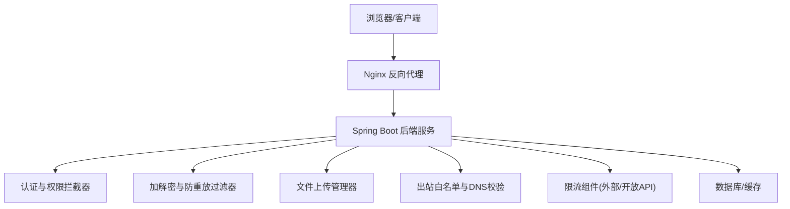
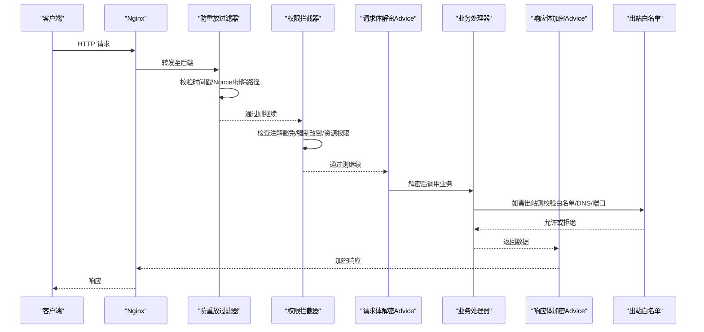
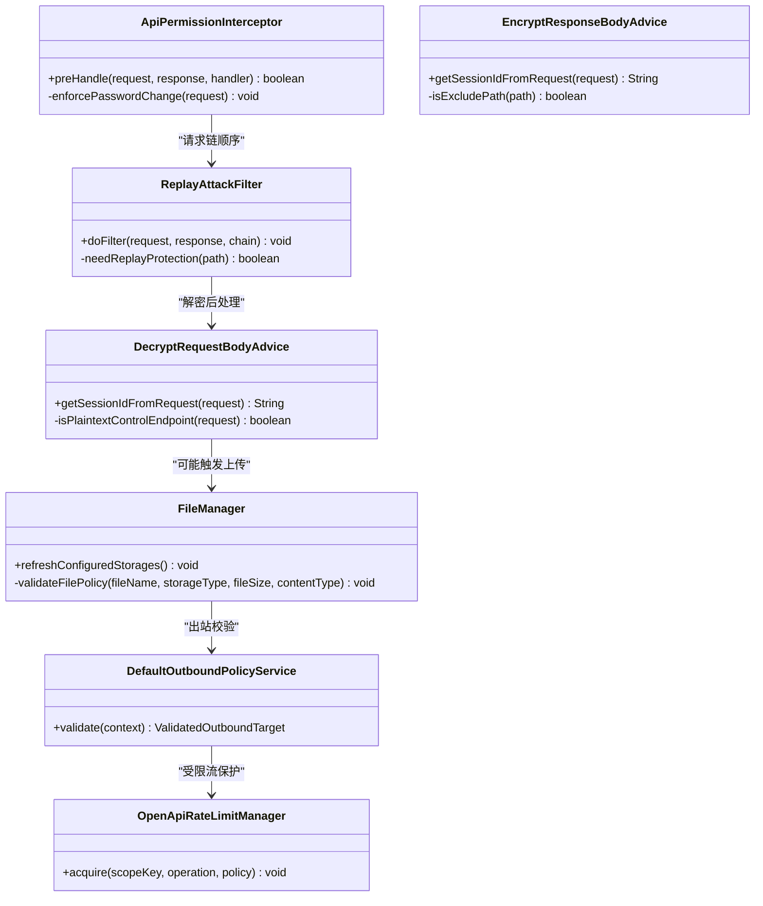

# 网络安全

<cite>
**本文引用的文件**
- [SecurityConfig.java](file://forge-server/forge-framework/forge-starter-parent/forge-starter-config/src/main/java/com/mdframe/forge/starter/config/config/SecurityConfig.java)
- [ApiPermissionInterceptor.java](file://forge-server/forge-framework/forge-starter-parent/forge-starter-auth/src/main/java/com/mdframe/forge/starter/auth/interceptor/ApiPermissionInterceptor.java)
- [ReplayAttackFilter.java](file://forge-server/forge-framework/forge-starter-parent/forge-starter-crypto/src/main/java/com/mdframe/forge/starter/crypto/filter/ReplayAttackFilter.java)
- [DecryptRequestBodyAdvice.java](file://forge-server/forge-framework/forge-starter-parent/forge-starter-crypto/src/main/java/com/mdframe/forge/starter/crypto/advice/DecryptRequestBodyAdvice.java)
- [EncryptResponseBodyAdvice.java](file://forge-server/forge-framework/forge-starter-parent/forge-starter-crypto/src/main/java/com/mdframe/forge/starter/crypto/advice/EncryptResponseBodyAdvice.java)
- [LocalFileStorageTest.java](file://forge-server/forge-framework/forge-starter-parent/forge-starter-file/src/test/java/com/mdframe/forge/starter/file/storage/impl/LocalFileStorageTest.java)
- [FileManager.java](file://forge-server/forge-framework/forge-starter-parent/forge-starter-file/src/main/java/com/mdframe/forge/starter/file/core/FileManager.java)
- [LoginTenantAssetController.java](file://forge-server/forge-framework/forge-plugin-parent/forge-plugin-system/src/main/java/com/mdframe/forge/plugin/system/controller/LoginTenantAssetController.java)
- [nginx.conf](file://docker/nginx.conf)
- [OutboundWhitelistServiceImpl.java](file://forge-server/forge-framework/forge-starter-parent/forge-starter-outbound/src/main/java/com/mdframe/forge/starter/outbound/service/impl/OutboundWhitelistServiceImpl.java)
- [DefaultOutboundPolicyService.java](file://forge-server/forge-framework/forge-starter-parent/forge-starter-outbound/src/main/java/com/mdframe/forge/starter/outbound/security/DefaultOutboundPolicyService.java)
- [OkHttpSecureOutboundClient.java](file://forge-server/forge-framework/forge-starter-parent/forge-starter-outbound/src/main/java/com/mdframe/forge/starter/outbound/client/OkHttpSecureOutboundClient.java)
- [ExternalRateLimitManager.java](file://forge-server/forge-framework/forge-plugin-parent/forge-plugin-external/src/main/java/com/mdframe/forge/plugin/external/support/ExternalRateLimitManager.java)
- [OpenApiRateLimitManager.java](file://forge-server/forge-framework/forge-starter-parent/forge-starter-openapi-security/src/main/java/com/mdframe/forge/starter/openapi/security/ratelimit/OpenApiRateLimitManager.java)
- [RateLimitPolicy.java](file://forge-server/forge-framework/forge-starter-parent/forge-starter-openapi-security/src/main/java/com/mdframe/forge/starter/openapi/security/ratelimit/RateLimitPolicy.java)
- [common-rules.md](file://forge-admin-ui/.turing_coder_rules/common-rules.md)
- [sanitize-html.js](file://forge-admin-ui/src/utils/sanitize-html.js)
- [page-widget-schema.js](file://forge-admin-ui/src/components/lowcode-builder/shared/page-widget-schema.js)
- [extension-context-api.js](file://forge-admin-ui/src/components/lowcode-extension/js/extension-context-api.js)
- [SaTokenWebSocketAuthenticationConfiguration.java](file://forge-server/forge-framework/forge-starter-parent/forge-starter-auth/src/main/java/com/mdframe/forge/starter/auth/config/SaTokenWebSocketAuthenticationConfiguration.java)
</cite>

## 目录
1. [简介](#简介)
2. [项目结构](#项目结构)
3. [核心组件](#核心组件)
4. [架构总览](#架构总览)
5. [详细组件分析](#详细组件分析)
6. [依赖关系分析](#依赖关系分析)
7. [性能与安全权衡](#性能与安全权衡)
8. [故障排查指南](#故障排查指南)
9. [结论](#结论)
10. [附录：安全配置与渗透测试指引](#附录安全配置与渗透测试指引)

## 简介
本文件面向Forge Admin的网络安全，覆盖Web应用防护（XSS、CSRF、点击劫持）、API接口安全（鉴权、参数校验、输入过滤、输出编码）、文件上传安全、网络层安全（Nginx代理、出站白名单、CORS建议）、以及DDoS/限流防护。文档基于仓库中的实际实现进行梳理，并提供可落地的配置示例与渗透测试建议，帮助开发者构建安全的网络环境。

## 项目结构
本项目在前后端分离架构下提供多层安全防护：
- 前端（forge-admin-ui）：XSS防护、敏感信息清理、沙箱执行限制等。
- 网关/反向代理（docker/nginx.conf）：请求大小限制、路径转发、基础访问控制。
- 后端（forge-server）：认证鉴权、防重放、加解密、文件上传策略、出站流量白名单、开放API限流等。

图表来源
- [nginx.conf:1-42](file://docker/nginx.conf#L1-L42)
- [ApiPermissionInterceptor.java:1-141](file://forge-server/forge-framework/forge-starter-parent/forge-starter-auth/src/main/java/com/mdframe/forge/starter/auth/interceptor/ApiPermissionInterceptor.java#L1-L141)
- [ReplayAttackFilter.java:1-145](file://forge-server/forge-framework/forge-starter-parent/forge-starter-crypto/src/main/java/com/mdframe/forge/starter/crypto/filter/ReplayAttackFilter.java#L1-L145)
- [FileManager.java:439-542](file://forge-server/forge-framework/forge-starter-parent/forge-starter-file/src/main/java/com/mdframe/forge/starter/file/core/FileManager.java#L439-L542)
- [DefaultOutboundPolicyService.java:1-29](file://forge-server/forge-framework/forge-starter-parent/forge-starter-outbound/src/main/java/com/mdframe/forge/starter/outbound/security/DefaultOutboundPolicyService.java#L1-L29)
- [OpenApiRateLimitManager.java:1-64](file://forge-server/forge-framework/forge-starter-parent/forge-starter-openapi-security/src/main/java/com/mdframe/forge/starter/openapi/security/ratelimit/OpenApiRateLimitManager.java#L1-L64)

章节来源
- [nginx.conf:1-42](file://docker/nginx.conf#L1-L42)
- [ApiPermissionInterceptor.java:1-141](file://forge-server/forge-framework/forge-starter-parent/forge-starter-auth/src/main/java/com/mdframe/forge/starter/auth/interceptor/ApiPermissionInterceptor.java#L1-L141)

## 核心组件
- 认证与权限：基于Sa-Token的会话管理与API级权限拦截，支持强制改密、注解豁免、动态资源表匹配。
- 防重放与加解密：通过过滤器校验时间戳与随机数，结合请求体/响应体的加解密Advice，保障传输安全。
- 文件上传安全：统一校验扩展名、危险类型、大小限制、MIME一致性，并拒绝目录穿越。
- 出站安全：域名/IP白名单、协议与端口校验、DNS解析与私网地址分类、超时上限控制。
- 限流与抗DDoS：外部接口与开放API的Redisson限流，失败降级保护。
- 前端安全：XSS清洗、敏感键值过滤、沙箱输出限制。

章节来源
- [SecurityConfig.java:1-113](file://forge-server/forge-framework/forge-starter-parent/forge-starter-config/src/main/java/com/mdframe/forge/starter/config/config/SecurityConfig.java#L1-L113)
- [ApiPermissionInterceptor.java:1-141](file://forge-server/forge-framework/forge-starter-parent/forge-starter-auth/src/main/java/com/mdframe/forge/starter/auth/interceptor/ApiPermissionInterceptor.java#L1-L141)
- [ReplayAttackFilter.java:1-145](file://forge-server/forge-framework/forge-starter-parent/forge-starter-crypto/src/main/java/com/mdframe/forge/starter/crypto/filter/ReplayAttackFilter.java#L1-L145)
- [DecryptRequestBodyAdvice.java:190-217](file://forge-server/forge-framework/forge-starter-parent/forge-starter-crypto/src/main/java/com/mdframe/forge/starter/crypto/advice/DecryptRequestBodyAdvice.java#L190-L217)
- [EncryptResponseBodyAdvice.java:205-245](file://forge-server/forge-framework/forge-starter-parent/forge-starter-crypto/src/main/java/com/mdframe/forge/starter/crypto/advice/EncryptResponseBodyAdvice.java#L205-L245)
- [FileManager.java:439-542](file://forge-server/forge-framework/forge-starter-parent/forge-starter-file/src/main/java/com/mdframe/forge/starter/file/core/FileManager.java#L439-L542)
- [LocalFileStorageTest.java:24-40](file://forge-server/forge-framework/forge-starter-parent/forge-starter-file/src/test/java/com/mdframe/forge/starter/file/storage/impl/LocalFileStorageTest.java#L24-L40)
- [DefaultOutboundPolicyService.java:1-29](file://forge-server/forge-framework/forge-starter-parent/forge-starter-outbound/src/main/java/com/mdframe/forge/starter/outbound/security/DefaultOutboundPolicyService.java#L1-L29)
- [OpenApiRateLimitManager.java:1-64](file://forge-server/forge-framework/forge-starter-parent/forge-starter-openapi-security/src/main/java/com/mdframe/forge/starter/openapi/security/ratelimit/OpenApiRateLimitManager.java#L1-L64)
- [sanitize-html.js:1-69](file://forge-admin-ui/src/utils/sanitize-html.js#L1-L69)

## 架构总览
下图展示一次受保护的HTTP请求从进入Nginx到后端处理的完整链路，包括认证、权限、防重放、加解密、文件上传与出站校验等关键节点。

图表来源
- [ReplayAttackFilter.java:35-107](file://forge-server/forge-framework/forge-starter-parent/forge-starter-crypto/src/main/java/com/mdframe/forge/starter/crypto/filter/ReplayAttackFilter.java#L35-L107)
- [ApiPermissionInterceptor.java:44-112](file://forge-server/forge-framework/forge-starter-parent/forge-starter-auth/src/main/java/com/mdframe/forge/starter/auth/interceptor/ApiPermissionInterceptor.java#L44-L112)
- [DecryptRequestBodyAdvice.java:190-217](file://forge-server/forge-framework/forge-starter-parent/forge-starter-crypto/src/main/java/com/mdframe/forge/starter/crypto/advice/DecryptRequestBodyAdvice.java#L190-L217)
- [EncryptResponseBodyAdvice.java:205-245](file://forge-server/forge-framework/forge-starter-parent/forge-starter-crypto/src/main/java/com/mdframe/forge/starter/crypto/advice/EncryptResponseBodyAdvice.java#L205-L245)
- [DefaultOutboundPolicyService.java:1-29](file://forge-server/forge-framework/forge-starter-parent/forge-starter-outbound/src/main/java/com/mdframe/forge/starter/outbound/security/DefaultOutboundPolicyService.java#L1-L29)

## 详细组件分析

### Web应用安全（XSS/CSRF/点击劫持）
- XSS防护
  - 前端使用HTML清洗工具移除危险标签与事件属性，并对文本进行转义；低代码场景对脚本注入进行额外净化。
  - 参考实现：[sanitize-html.js:1-69](file://forge-admin-ui/src/utils/sanitize-html.js#L1-L69)、[page-widget-schema.js:344-368](file://forge-admin-ui/src/components/lowcode-builder/shared/page-widget-schema.js#L344-L368)。
- CSRF防护
  - 前端规范建议使用CSRF令牌、SameSite Cookie与后端校验；登录态管理由Sa-Token负责。
  - 参考规则：[common-rules.md:516-536](file://forge-admin-ui/.turing_coder_rules/common-rules.md#L516-L536)。
- 点击劫持防护
  - 建议在Nginx中设置X-Frame-Options/Content-Security-Policy以限制iframe嵌入；当前仓库未包含该配置，可按需补充。

章节来源
- [sanitize-html.js:1-69](file://forge-admin-ui/src/utils/sanitize-html.js#L1-L69)
- [page-widget-schema.js:344-368](file://forge-admin-ui/src/components/lowcode-builder/shared/page-widget-schema.js#L344-L368)
- [common-rules.md:516-536](file://forge-admin-ui/.turing_coder_rules/common-rules.md#L516-L536)

### API接口安全（鉴权/参数验证/输入过滤/输出编码）
- 鉴权与权限
  - 基于Sa-Token的会话管理，支持token有效期、并发登录控制、读取位置（Header/Cookie/Body）。
  - 接口级权限拦截：支持注解豁免、强制改密、按URI+Method的资源表匹配。
  - 参考实现：[SecurityConfig.java:1-113](file://forge-server/forge-framework/forge-starter-parent/forge-starter-config/src/main/java/com/mdframe/forge/starter/config/config/SecurityConfig.java#L1-L113)、[ApiPermissionInterceptor.java:1-141](file://forge-server/forge-framework/forge-starter-parent/forge-starter-auth/src/main/java/com/mdframe/forge/starter/auth/interceptor/ApiPermissionInterceptor.java#L1-L141)。
- 参数验证与输入过滤
  - 文件上传：严格校验扩展名、危险类型、大小限制、MIME一致性；拒绝空配置与非法类型。
  - 出站请求：URL规范化、协议/端口校验、禁止私网例外场景、DNS解析与IP分类。
  - 参考实现：[FileManager.java:439-542](file://forge-server/forge-framework/forge-starter-parent/forge-starter-file/src/main/java/com/mdframe/forge/starter/file/core/FileManager.java#L439-L542)、[OutboundWhitelistServiceImpl.java:83-98](file://forge-server/forge-framework/forge-starter-parent/forge-starter-outbound/src/main/java/com/mdframe/forge/starter/outbound/service/impl/OutboundWhitelistServiceImpl.java#L83-L98)、[DefaultOutboundPolicyService.java:1-29](file://forge-server/forge-framework/forge-starter-parent/forge-starter-outbound/src/main/java/com/mdframe/forge/starter/outbound/security/DefaultOutboundPolicyService.java#L1-L29)。
- 输出编码与脱敏
  - 日志与任务参数中对敏感字段进行掩码处理，避免泄露凭证与个人信息。
  - 参考实现：[JobLogSanitizer:29-55](file://forge-server/forge-framework/forge-plugin-parent/forge-plugin-job/src/main/java/com/mdframe/forge/plugin/job/support/JobLogSanitizer.java#L29-L55)。

章节来源
- [SecurityConfig.java:1-113](file://forge-server/forge-framework/forge-starter-parent/forge-starter-config/src/main/java/com/mdframe/forge/starter/config/config/SecurityConfig.java#L1-L113)
- [ApiPermissionInterceptor.java:1-141](file://forge-server/forge-framework/forge-starter-parent/forge-starter-auth/src/main/java/com/mdframe/forge/starter/auth/interceptor/ApiPermissionInterceptor.java#L1-L141)
- [FileManager.java:439-542](file://forge-server/forge-framework/forge-starter-parent/forge-starter-file/src/main/java/com/mdframe/forge/starter/file/core/FileManager.java#L439-L542)
- [OutboundWhitelistServiceImpl.java:83-98](file://forge-server/forge-framework/forge-starter-parent/forge-starter-outbound/src/main/java/com/mdframe/forge/starter/outbound/service/impl/OutboundWhitelistServiceImpl.java#L83-L98)
- [DefaultOutboundPolicyService.java:1-29](file://forge-server/forge-framework/forge-starter-parent/forge-starter-outbound/src/main/java/com/mdframe/forge/starter/outbound/security/DefaultOutboundPolicyService.java#L1-L29)

### 文件上传安全
- 类型与大小限制：仅允许配置的扩展名，拒绝危险类型，限制最大文件大小。
- MIME一致性：根据扩展名校验MIME，防止伪装。
- 存储隔离与路径安全：本地存储拒绝目录穿越，确保文件保存在基目录下。
- 图片安全：对SVG等高风险类型进行拒绝，合理推断Content-Type。
- 参考实现：
  - [FileManager.java:439-542](file://forge-server/forge-framework/forge-starter-parent/forge-starter-file/src/main/java/com/mdframe/forge/starter/file/core/FileManager.java#L439-L542)
  - [LocalFileStorageTest.java:24-40](file://forge-server/forge-framework/forge-starter-parent/forge-starter-file/src/test/java/com/mdframe/forge/starter/file/storage/impl/LocalFileStorageTest.java#L24-L40)
  - [LoginTenantAssetController.java:150-195](file://forge-server/forge-framework/forge-plugin-parent/forge-plugin-system/src/main/java/com/mdframe/forge/plugin/system/controller/LoginTenantAssetController.java#L150-L195)

章节来源
- [FileManager.java:439-542](file://forge-server/forge-framework/forge-starter-parent/forge-starter-file/src/main/java/com/mdframe/forge/starter/file/core/FileManager.java#L439-L542)
- [LocalFileStorageTest.java:24-40](file://forge-server/forge-framework/forge-starter-parent/forge-starter-file/src/test/java/com/mdframe/forge/starter/file/storage/impl/LocalFileStorageTest.java#L24-L40)
- [LoginTenantAssetController.java:150-195](file://forge-server/forge-framework/forge-plugin-parent/forge-plugin-system/src/main/java/com/mdframe/forge/plugin/system/controller/LoginTenantAssetController.java#L150-L195)

### 网络安全配置（防火墙/白名单/域名绑定/CORS）
- Nginx反向代理
  - 限制请求体大小、转发路径、设置超时与压缩；可作为第一道防线。
  - 参考：[nginx.conf:1-42](file://docker/nginx.conf#L1-L42)
- 出站白名单与DNS校验
  - 对外发起的请求需命中白名单规则，支持协议/端口/主机规范化与私网地址分类，拒绝不安全URL形式。
  - 参考：[DefaultOutboundPolicyService.java:1-29](file://forge-server/forge-framework/forge-starter-parent/forge-starter-outbound/src/main/java/com/mdframe/forge/starter/outbound/security/DefaultOutboundPolicyService.java#L1-L29)、[OutboundWhitelistServiceImpl.java:83-98](file://forge-server/forge-framework/forge-starter-parent/forge-starter-outbound/src/main/java/com/mdframe/forge/starter/outbound/service/impl/OutboundWhitelistServiceImpl.java#L83-L98)
- CORS配置建议
  - 建议在Nginx或后端添加严格的Origin白名单、方法限制与凭据策略；当前仓库未包含具体CORS实现，可按需补充。

章节来源
- [nginx.conf:1-42](file://docker/nginx.conf#L1-L42)
- [DefaultOutboundPolicyService.java:1-29](file://forge-server/forge-framework/forge-starter-parent/forge-starter-outbound/src/main/java/com/mdframe/forge/starter/outbound/security/DefaultOutboundPolicyService.java#L1-L29)
- [OutboundWhitelistServiceImpl.java:83-98](file://forge-server/forge-framework/forge-starter-parent/forge-starter-outbound/src/main/java/com/mdframe/forge/starter/outbound/service/impl/OutboundWhitelistServiceImpl.java#L83-L98)

### DDoS攻击防护（限流/异常检测/自动封禁）
- 外部接口限流
  - 基于Redisson RRateLimiter，按租户与接口维度限制QPS，超限抛出业务异常。
  - 参考：[ExternalRateLimitManager.java:18-52](file://forge-server/forge-framework/forge-plugin-parent/forge-plugin-external/src/main/java/com/mdframe/forge/plugin/external/support/ExternalRateLimitManager.java#L18-L52)
- 开放API限流
  - 通用限流组件，按每分钟许可数控制，Redis不可用时返回503，超限返回429。
  - 参考：[OpenApiRateLimitManager.java:1-64](file://forge-server/forge-framework/forge-starter-parent/forge-starter-openapi-security/src/main/java/com/mdframe/forge/starter/openapi/security/ratelimit/OpenApiRateLimitManager.java#L1-L64)、[RateLimitPolicy.java:1-19](file://forge-server/forge-framework/forge-starter-parent/forge-starter-openapi-security/src/main/java/com/mdframe/forge/starter/openapi/security/ratelimit/RateLimitPolicy.java#L1-L19)
- 出站连接安全与超时
  - 出站客户端对超时与连接参数进行上限约束，防止资源耗尽。
  - 参考：[OkHttpSecureOutboundClient.java:284-317](file://forge-server/forge-framework/forge-starter-parent/forge-starter-outbound/src/main/java/com/mdframe/forge/starter/outbound/client/OkHttpSecureOutboundClient.java#L284-L317)

章节来源
- [ExternalRateLimitManager.java:18-52](file://forge-server/forge-framework/forge-plugin-parent/forge-plugin-external/src/main/java/com/mdframe/forge/plugin/external/support/ExternalRateLimitManager.java#L18-L52)
- [OpenApiRateLimitManager.java:1-64](file://forge-server/forge-framework/forge-starter-parent/forge-starter-openapi-security/src/main/java/com/mdframe/forge/starter/openapi/security/ratelimit/OpenApiRateLimitManager.java#L1-L64)
- [RateLimitPolicy.java:1-19](file://forge-server/forge-framework/forge-starter-parent/forge-starter-openapi-security/src/main/java/com/mdframe/forge/starter/openapi/security/ratelimit/RateLimitPolicy.java#L1-L19)
- [OkHttpSecureOutboundClient.java:284-317](file://forge-server/forge-framework/forge-starter-parent/forge-starter-outbound/src/main/java/com/mdframe/forge/starter/outbound/client/OkHttpSecureOutboundClient.java#L284-L317)

### WebSocket安全
- 通过Sa-Token为WebSocket提供认证能力，未携带有效Bearer Token的连接将被拒绝。
- 参考：[SaTokenWebSocketAuthenticationConfiguration.java:1-23](file://forge-server/forge-framework/forge-starter-parent/forge-starter-auth/src/main/java/com/mdframe/forge/starter/auth/config/SaTokenWebSocketAuthenticationConfiguration.java#L1-L23)

章节来源
- [SaTokenWebSocketAuthenticationConfiguration.java:1-23](file://forge-server/forge-framework/forge-starter-parent/forge-starter-auth/src/main/java/com/mdframe/forge/starter/auth/config/SaTokenWebSocketAuthenticationConfiguration.java#L1-L23)

## 依赖关系分析
- 认证与权限模块依赖Sa-Token与会话上下文，拦截器在请求进入控制器前完成鉴权与强制改密检查。
- 加解密与防重放过滤器位于请求链早期，确保后续处理的数据可信且未被重放。
- 文件上传与出站模块分别对输入与输出进行严格校验，降低恶意载荷传播风险。
- 限流组件依赖Redisson，提供分布式限流能力，并在依赖不可用时快速失败。

图表来源
- [ApiPermissionInterceptor.java:1-141](file://forge-server/forge-framework/forge-starter-parent/forge-starter-auth/src/main/java/com/mdframe/forge/starter/auth/interceptor/ApiPermissionInterceptor.java#L1-L141)
- [ReplayAttackFilter.java:1-145](file://forge-server/forge-framework/forge-starter-parent/forge-starter-crypto/src/main/java/com/mdframe/forge/starter/crypto/filter/ReplayAttackFilter.java#L1-L145)
- [DecryptRequestBodyAdvice.java:190-217](file://forge-server/forge-framework/forge-starter-parent/forge-starter-crypto/src/main/java/com/mdframe/forge/starter/crypto/advice/DecryptRequestBodyAdvice.java#L190-L217)
- [EncryptResponseBodyAdvice.java:205-245](file://forge-server/forge-framework/forge-starter-parent/forge-starter-crypto/src/main/java/com/mdframe/forge/starter/crypto/advice/EncryptResponseBodyAdvice.java#L205-L245)
- [FileManager.java:439-542](file://forge-server/forge-framework/forge-starter-parent/forge-starter-file/src/main/java/com/mdframe/forge/starter/file/core/FileManager.java#L439-L542)
- [DefaultOutboundPolicyService.java:1-29](file://forge-server/forge-framework/forge-starter-parent/forge-starter-outbound/src/main/java/com/mdframe/forge/starter/outbound/security/DefaultOutboundPolicyService.java#L1-L29)
- [OpenApiRateLimitManager.java:1-64](file://forge-server/forge-framework/forge-starter-parent/forge-starter-openapi-security/src/main/java/com/mdframe/forge/starter/openapi/security/ratelimit/OpenApiRateLimitManager.java#L1-L64)

## 性能与安全权衡
- 防重放与加解密会增加请求处理开销，建议仅在敏感接口启用，并通过include/exclude路径精细控制。
- 限流在高并发场景下能有效抵御滥用，但需合理设置阈值以避免误伤正常用户。
- 文件上传与出站校验在安全与可用性之间需要平衡，建议在生产环境开启严格模式，并在开发环境适度放宽。

## 故障排查指南
- 防重放失败
  - 现象：返回“重复的请求”或“请求已过期”。
  - 排查：检查客户端是否携带正确的X-Timestamp与X-Nonce，确认时间窗口配置与服务时钟同步。
  - 参考：[ReplayAttackFilter.java:62-107](file://forge-server/forge-framework/forge-starter-parent/forge-starter-crypto/src/main/java/com/mdframe/forge/starter/crypto/filter/ReplayAttackFilter.java#L62-L107)
- 权限拦截失败
  - 现象：无权限访问接口或被强制改密拦截。
  - 排查：确认接口是否配置了资源权限、是否被注解豁免、用户是否处于强制改密状态。
  - 参考：[ApiPermissionInterceptor.java:44-139](file://forge-server/forge-framework/forge-starter-parent/forge-starter-auth/src/main/java/com/mdframe/forge/starter/auth/interceptor/ApiPermissionInterceptor.java#L44-L139)
- 文件上传被拒
  - 现象：提示不支持的文件类型或大小超限。
  - 排查：检查存储配置允许的扩展名、危险类型黑名单、MIME一致性。
  - 参考：[FileManager.java:479-534](file://forge-server/forge-framework/forge-starter-parent/forge-starter-file/src/main/java/com/mdframe/forge/starter/file/core/FileManager.java#L479-L534)
- 出站请求被拒
  - 现象：目标域名或协议不在白名单内。
  - 排查：核对白名单规则、协议与端口、DNS解析结果与私网地址分类。
  - 参考：[DefaultOutboundPolicyService.java:1-29](file://forge-server/forge-framework/forge-starter-parent/forge-starter-outbound/src/main/java/com/mdframe/forge/starter/outbound/security/DefaultOutboundPolicyService.java#L1-L29)

章节来源
- [ReplayAttackFilter.java:62-107](file://forge-server/forge-framework/forge-starter-parent/forge-starter-crypto/src/main/java/com/mdframe/forge/starter/crypto/filter/ReplayAttackFilter.java#L62-L107)
- [ApiPermissionInterceptor.java:44-139](file://forge-server/forge-framework/forge-starter-parent/forge-starter-auth/src/main/java/com/mdframe/forge/starter/auth/interceptor/ApiPermissionInterceptor.java#L44-L139)
- [FileManager.java:479-534](file://forge-server/forge-framework/forge-starter-parent/forge-starter-file/src/main/java/com/mdframe/forge/starter/file/core/FileManager.java#L479-L534)
- [DefaultOutboundPolicyService.java:1-29](file://forge-server/forge-framework/forge-starter-parent/forge-starter-outbound/src/main/java/com/mdframe/forge/starter/outbound/security/DefaultOutboundPolicyService.java#L1-L29)

## 结论
Forge Admin在认证鉴权、防重放、加解密、文件上传、出站安全与限流等方面提供了完善的安全能力。通过合理配置与持续监控，可有效抵御常见Web威胁与分布式攻击。建议在生产环境中启用严格策略，并结合渗透测试与审计机制持续加固。

## 附录：安全配置与渗透测试指引

### 安全配置示例
- Sa-Token配置
  - token有效期、并发登录、读取位置、前缀与名称等可通过配置调整。
  - 参考：[SecurityConfig.java:1-113](file://forge-server/forge-framework/forge-starter-parent/forge-starter-config/src/main/java/com/mdframe/forge/starter/config/config/SecurityConfig.java#L1-L113)
- Nginx代理与上传限制
  - 设置client_max_body_size限制上传大小，合理配置location与超时。
  - 参考：[nginx.conf:1-42](file://docker/nginx.conf#L1-L42)
- 出站白名单
  - 配置场景、协议、主机、端口与私网例外标志，确保出站请求合法。
  - 参考：[OutboundWhitelistServiceImpl.java:83-98](file://forge-server/forge-framework/forge-starter-parent/forge-starter-outbound/src/main/java/com/mdframe/forge/starter/outbound/service/impl/OutboundWhitelistServiceImpl.java#L83-L98)
- 开放API限流
  - 定义每分钟许可数策略，按调用方维度限流，Redis不可用返回503。
  - 参考：[OpenApiRateLimitManager.java:1-64](file://forge-server/forge-framework/forge-starter-parent/forge-starter-openapi-security/src/main/java/com/mdframe/forge/starter/openapi/security/ratelimit/OpenApiRateLimitManager.java#L1-L64)、[RateLimitPolicy.java:1-19](file://forge-server/forge-framework/forge-starter-parent/forge-starter-openapi-security/src/main/java/com/mdframe/forge/starter/openapi/security/ratelimit/RateLimitPolicy.java#L1-L19)

### 渗透测试指导
- XSS测试
  - 在前端输入框与富文本区域插入<script>、onerror等payload，验证是否被清洗或转义。
  - 参考：[sanitize-html.js:1-69](file://forge-admin-ui/src/utils/sanitize-html.js#L1-L69)
- CSRF测试
  - 构造跨站请求，验证是否要求CSRF令牌与SameSite策略生效。
  - 参考：[common-rules.md:516-536](file://forge-admin-ui/.turing_coder_rules/common-rules.md#L516-L536)
- 文件上传测试
  - 尝试上传危险扩展名、超大文件、伪造MIME与目录穿越路径，验证拒绝逻辑。
  - 参考：[FileManager.java:479-534](file://forge-server/forge-framework/forge-starter-parent/forge-starter-file/src/main/java/com/mdframe/forge/starter/file/core/FileManager.java#L479-L534)、[LocalFileStorageTest.java:24-40](file://forge-server/forge-framework/forge-starter-parent/forge-starter-file/src/test/java/com/mdframe/forge/starter/file/storage/impl/LocalFileStorageTest.java#L24-L40)
- 出站安全测试
  - 尝试访问私有地址、非白名单域名、非法URL形式，验证拒绝与日志记录。
  - 参考：[DefaultOutboundPolicyService.java:1-29](file://forge-server/forge-framework/forge-starter-parent/forge-starter-outbound/src/main/java/com/mdframe/forge/starter/outbound/security/DefaultOutboundPolicyService.java#L1-L29)
- 限流与DDoS测试
  - 高频调用外部接口与开放API，验证限流生效与错误码（429/503）。
  - 参考：[ExternalRateLimitManager.java:18-52](file://forge-server/forge-framework/forge-plugin-parent/forge-plugin-external/src/main/java/com/mdframe/forge/plugin/external/support/ExternalRateLimitManager.java#L18-L52)、[OpenApiRateLimitManager.java:1-64](file://forge-server/forge-framework/forge-starter-parent/forge-starter-openapi-security/src/main/java/com/mdframe/forge/starter/openapi/security/ratelimit/OpenApiRateLimitManager.java#L1-L64)