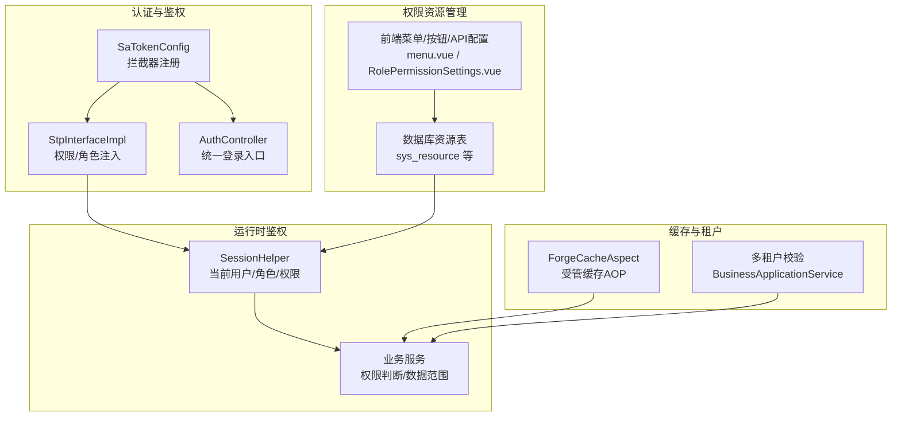
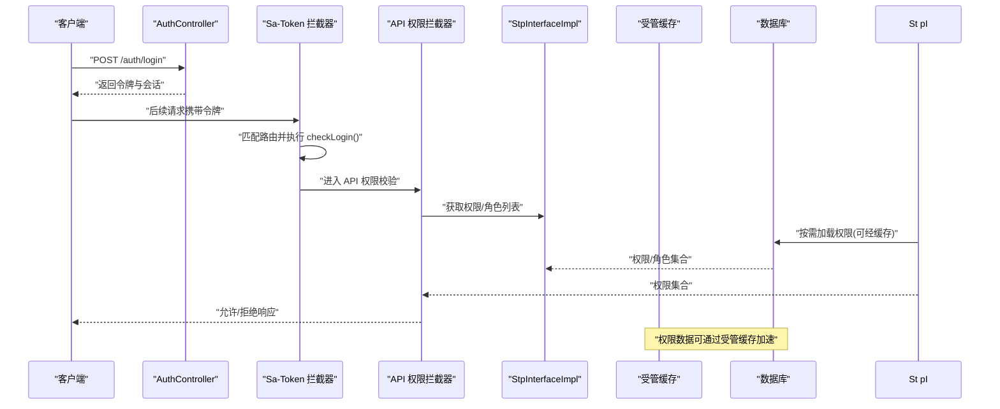
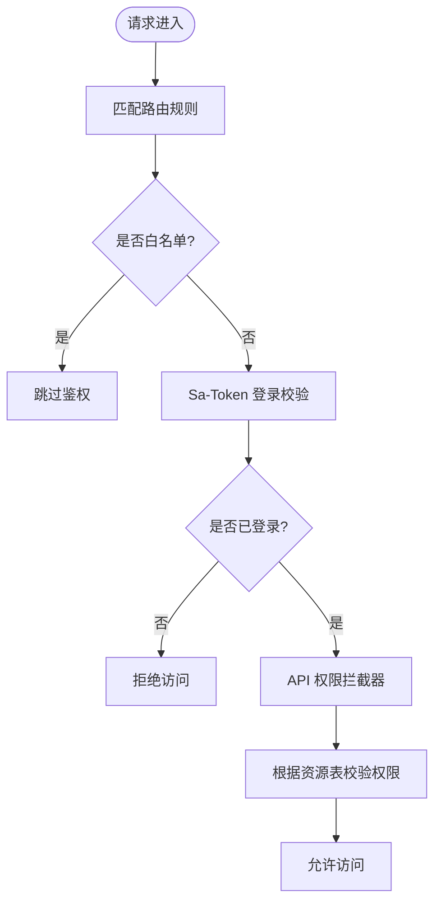
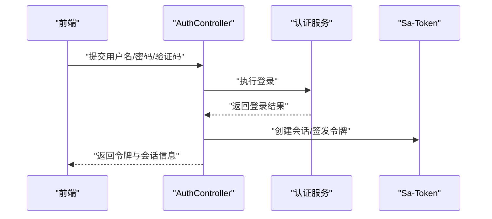
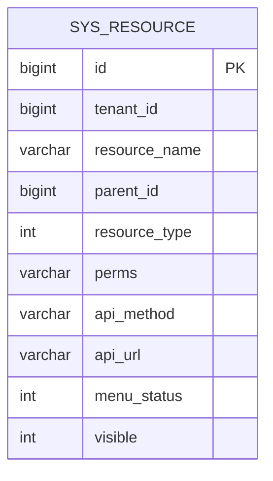
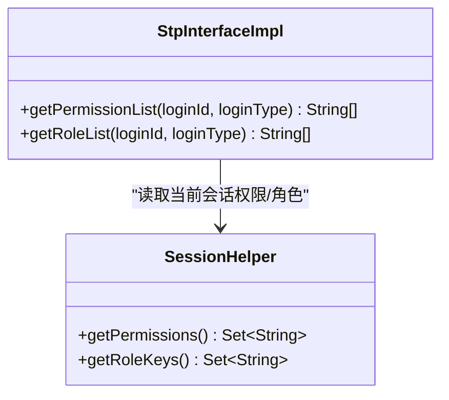
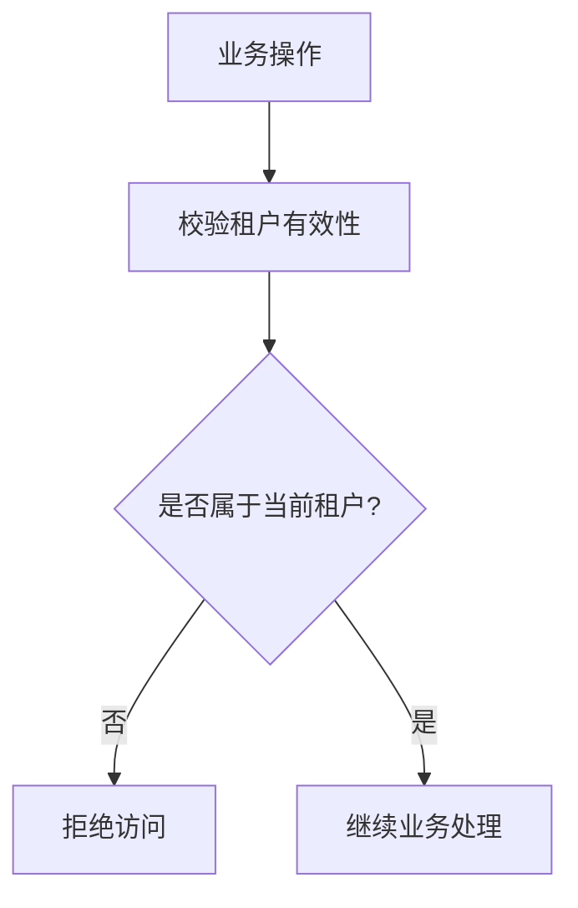
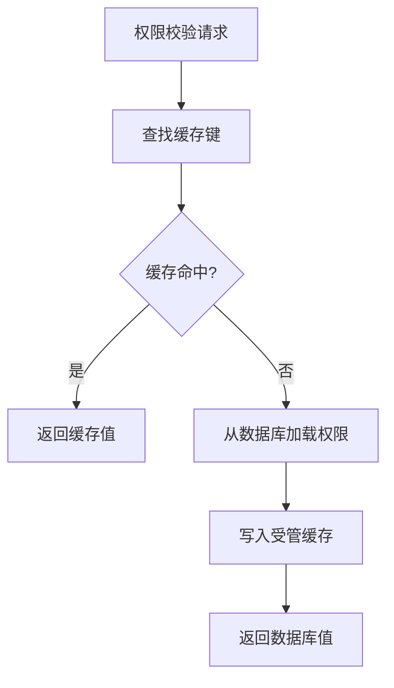
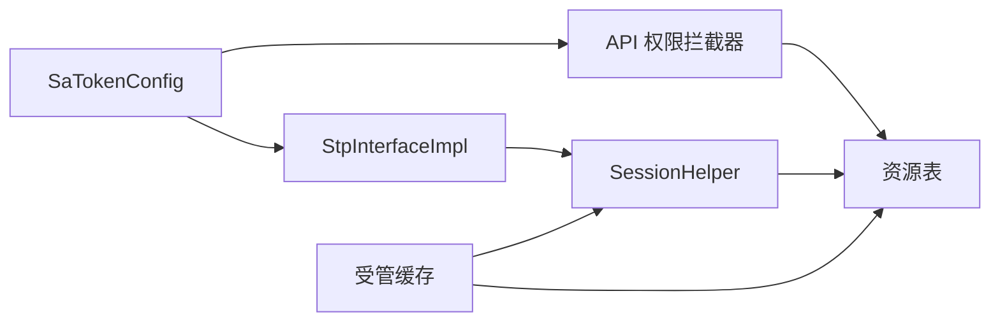

# 认证授权安全

<cite>
**本文引用的文件**
- [SaTokenConfig.java](file://forge-server/forge-framework/forge-starter-parent/forge-starter-auth/src/main/java/com/mdframe/forge/starter/auth/config/SaTokenConfig.java)
- [StpInterfaceImpl.java](file://forge-server/forge-framework/forge-starter-parent/forge-starter-auth/src/main/java/com/mdframe/forge/starter/auth/config/StpInterfaceImpl.java)
- [AuthController.java](file://forge-server/forge-framework/forge-starter-parent/forge-starter-auth/src/main/java/com/mdframe/forge/starter/auth/controller/AuthController.java)
- [RolePermissionSettings.vue](file://forge-admin-ui/src/views/system/components/RolePermissionSettings.vue)
- [menu.vue](file://forge-admin-ui/src/views/system/menu.vue)
- [test_auth_data.sql](file://forge-server/forge-admin-server/src/main/resources/sql/test_auth_data.sql)
- [V1.0.99__add_role_module_data_scopes.sql](file://forge-server/db/migration/V1.0.99__add_role_module_data_scopes.sql)
- [BusinessApplicationService.java](file://forge-server/forge-framework/forge-plugin-parent/forge-plugin-generator/src/main/java/com/mdframe/forge/plugin/generator/service/businessapp/BusinessApplicationService.java)
- [BusinessPermissionService.java](file://forge-server/forge-framework/forge-plugin-parent/forge-plugin-generator/src/main/java/com/mdframe/forge/plugin/generator/service/businessapp/BusinessPermissionService.java)
- [ForgeCacheAspect.java](file://forge-server/forge-framework/forge-starter-parent/forge-starter-cache/src/main/java/com/mdframe/forge/starter/cache/managed/aop/ForgeCacheAspect.java)
</cite>

## 目录
1. [简介](#简介)
2. [项目结构](#项目结构)
3. [核心组件](#核心组件)
4. [架构总览](#架构总览)
5. [详细组件分析](#详细组件分析)
6. [依赖关系分析](#依赖关系分析)
7. [性能考虑](#性能考虑)
8. [故障排查指南](#故障排查指南)
9. [结论](#结论)
10. [附录](#附录)

## 简介
本文件系统性阐述 Forge Admin 的认证与授权安全体系，围绕基于 Sa-Token 的认证机制、RBAC 权限模型、多端登录控制、注解式与动态权限校验、缓存策略以及多租户隔离等关键能力展开。文档面向开发者与运维人员，既提供高层架构视图，也给出代码级流程说明与配置要点，帮助快速理解并落地安全的认证授权方案。

## 项目结构
本项目在“认证授权”相关能力上采用分层与插件化组织：
- 认证基础能力位于 starter-auth 模块，负责 Sa-Token 集成、拦截器注册、会话上下文扩展与统一认证入口。
- RBAC 资源与菜单管理在前端系统管理中完成配置（菜单、按钮、API 资源），并通过数据库持久化。
- 业务侧通过 SessionHelper 获取当前用户、角色与权限，结合注解或拦截器进行鉴权。
- 缓存层通过受管缓存 AOP 对高频权限数据进行缓存，降低重复查询开销。
- 多租户场景下，权限数据与访问控制均按租户维度隔离，并在多处校验租户有效性。

图表来源
- [SaTokenConfig.java:29-100](file://forge-server/forge-framework/forge-starter-parent/forge-starter-auth/src/main/java/com/mdframe/forge/starter/auth/config/SaTokenConfig.java#L29-L100)
- [StpInterfaceImpl.java:20-33](file://forge-server/forge-framework/forge-starter-parent/forge-starter-auth/src/main/java/com/mdframe/forge/starter/auth/config/StpInterfaceImpl.java#L20-L33)
- [AuthController.java:31-45](file://forge-server/forge-framework/forge-starter-parent/forge-starter-auth/src/main/java/com/mdframe/forge/starter/auth/controller/AuthController.java#L31-L45)
- [menu.vue:1898-1964](file://forge-admin-ui/src/views/system/menu.vue#L1898-L1964)
- [RolePermissionSettings.vue:779-837](file://forge-admin-ui/src/views/system/components/RolePermissionSettings.vue#L779-L837)
- [BusinessApplicationService.java:777-808](file://forge-server/forge-framework/forge-plugin-parent/forge-plugin-generator/src/main/java/com/mdframe/forge/plugin/generator/service/businessapp/BusinessApplicationService.java#L777-L808)
- [ForgeCacheAspect.java:65-94](file://forge-server/forge-framework/forge-starter-parent/forge-starter-cache/src/main/java/com/mdframe/forge/starter/cache/managed/aop/ForgeCacheAspect.java#L65-L94)

章节来源
- [SaTokenConfig.java:29-100](file://forge-server/forge-framework/forge-starter-parent/forge-starter-auth/src/main/java/com/mdframe/forge/starter/auth/config/SaTokenConfig.java#L29-L100)
- [AuthController.java:31-45](file://forge-server/forge-framework/forge-starter-parent/forge-starter-auth/src/main/java/com/mdframe/forge/starter/auth/controller/AuthController.java#L31-L45)
- [StpInterfaceImpl.java:20-33](file://forge-server/forge-framework/forge-starter-parent/forge-starter-auth/src/main/java/com/mdframe/forge/starter/auth/config/StpInterfaceImpl.java#L20-L33)
- [menu.vue:1898-1964](file://forge-admin-ui/src/views/system/menu.vue#L1898-L1964)
- [RolePermissionSettings.vue:779-837](file://forge-admin-ui/src/views/system/components/RolePermissionSettings.vue#L779-L837)
- [BusinessApplicationService.java:777-808](file://forge-server/forge-framework/forge-plugin-parent/forge-plugin-generator/src/main/java/com/mdframe/forge/plugin/generator/service/businessapp/BusinessApplicationService.java#L777-L808)
- [ForgeCacheAspect.java:65-94](file://forge-server/forge-framework/forge-starter-parent/forge-starter-cache/src/main/java/com/mdframe/forge/starter/cache/managed/aop/ForgeCacheAspect.java#L65-L94)

## 核心组件
- Sa-Token 配置与拦截器：集中注册登录校验与 API 权限校验拦截器，定义白名单路径，确保未登录请求被拦截，已登录请求进入细粒度权限校验。
- Stp 接口扩展：将当前会话中的角色与权限集合注入到 Sa-Token 上下文，供注解式鉴权使用。
- 统一认证入口：对外暴露统一的登录接口，支持多种认证方式，返回会话令牌与会话信息。
- 权限资源管理：前端提供菜单、按钮、API 资源的可视化配置，后端以资源表存储，形成 RBAC 的数据基础。
- 运行时权限读取：通过 SessionHelper 获取当前用户、角色与权限，支撑业务逻辑中的权限判断。
- 受管缓存：对高频权限数据提供注解式缓存能力，减少数据库压力。
- 多租户校验：在业务侧对租户内用户、角色、部门等进行有效性校验，保障跨租户访问隔离。

章节来源
- [SaTokenConfig.java:29-100](file://forge-server/forge-framework/forge-starter-parent/forge-starter-auth/src/main/java/com/mdframe/forge/starter/auth/config/SaTokenConfig.java#L29-L100)
- [StpInterfaceImpl.java:20-33](file://forge-server/forge-framework/forge-starter-parent/forge-starter-auth/src/main/java/com/mdframe/forge/starter/auth/config/StpInterfaceImpl.java#L20-L33)
- [AuthController.java:31-45](file://forge-server/forge-framework/forge-starter-parent/forge-starter-auth/src/main/java/com/mdframe/forge/starter/auth/controller/AuthController.java#L31-L45)
- [menu.vue:1898-1964](file://forge-admin-ui/src/views/system/menu.vue#L1898-L1964)
- [RolePermissionSettings.vue:779-837](file://forge-admin-ui/src/views/system/components/RolePermissionSettings.vue#L779-L837)
- [BusinessApplicationService.java:777-808](file://forge-server/forge-framework/forge-plugin-parent/forge-plugin-generator/src/main/java/com/mdframe/forge/plugin/generator/service/businessapp/BusinessApplicationService.java#L777-L808)
- [ForgeCacheAspect.java:65-94](file://forge-server/forge-framework/forge-starter-parent/forge-starter-cache/src/main/java/com/mdframe/forge/starter/cache/managed/aop/ForgeCacheAspect.java#L65-L94)

## 架构总览
下图展示了从请求进入到鉴权执行的完整链路，包括登录、权限加载、注解式校验与缓存命中路径。

图表来源
- [AuthController.java:31-45](file://forge-server/forge-framework/forge-starter-parent/forge-starter-auth/src/main/java/com/mdframe/forge/starter/auth/controller/AuthController.java#L31-L45)
- [SaTokenConfig.java:29-100](file://forge-server/forge-framework/forge-starter-parent/forge-starter-auth/src/main/java/com/mdframe/forge/starter/auth/config/SaTokenConfig.java#L29-L100)
- [StpInterfaceImpl.java:20-33](file://forge-server/forge-framework/forge-starter-parent/forge-starter-auth/src/main/java/com/mdframe/forge/starter/auth/config/StpInterfaceImpl.java#L20-L33)
- [ForgeCacheAspect.java:65-94](file://forge-server/forge-framework/forge-starter-parent/forge-starter-cache/src/main/java/com/mdframe/forge/starter/cache/managed/aop/ForgeCacheAspect.java#L65-L94)

## 详细组件分析

### Sa-Token 认证与拦截器
- 登录校验拦截器：对所有路径进行匹配，排除登录、登出、验证码、静态资源、健康检查、OAuth/MCP/开放平台等公开或专用认证链处理的端点，最终调用 Sa-Token 的登录校验。
- API 权限拦截器：在登录校验之后执行，依据数据库资源表配置进行更细粒度的权限控制，同样维护了白名单与排除路径。
- 优势：通过两层拦截器实现“先身份后权限”的清晰边界，便于扩展与维护。

图表来源
- [SaTokenConfig.java:29-100](file://forge-server/forge-framework/forge-starter-parent/forge-starter-auth/src/main/java/com/mdframe/forge/starter/auth/config/SaTokenConfig.java#L29-L100)

章节来源
- [SaTokenConfig.java:29-100](file://forge-server/forge-framework/forge-starter-parent/forge-starter-auth/src/main/java/com/mdframe/forge/starter/auth/config/SaTokenConfig.java#L29-L100)

### 统一登录流程
- 统一入口：/auth/login 接收登录请求，内部委托认证服务完成账号校验、生成会话令牌并返回结果。
- 多认证方式：支持密码、验证码等多种认证类型，便于扩展其他认证方式。
- 安全性：登录接口排除租户限制，避免登录前无法确定租户导致的上下文问题。

图表来源
- [AuthController.java:31-45](file://forge-server/forge-framework/forge-starter-parent/forge-starter-auth/src/main/java/com/mdframe/forge/starter/auth/controller/AuthController.java#L31-L45)

章节来源
- [AuthController.java:31-45](file://forge-server/forge-framework/forge-starter-parent/forge-starter-auth/src/main/java/com/mdframe/forge/starter/auth/controller/AuthController.java#L31-L45)

### 权限模型与资源管理（RBAC）
- 资源类型：菜单、按钮、API 等资源在前端可视化管理，后端以资源表存储，形成 RBAC 的数据基础。
- 权限标识：按钮与 API 资源通过权限标识（perms）进行绑定，用于前后端一致的权限控制。
- 数据范围：迁移脚本为角色新增数据权限相关 API 资源，体现细粒度数据范围控制。

图表来源
- [test_auth_data.sql:56-67](file://forge-server/forge-admin-server/src/main/resources/sql/test_auth_data.sql#L56-L67)
- [V1.0.99__add_role_module_data_scopes.sql:34-58](file://forge-server/db/migration/V1.0.99__add_role_module_data_scopes.sql#L34-L58)

章节来源
- [menu.vue:1898-1964](file://forge-admin-ui/src/views/system/menu.vue#L1898-L1964)
- [RolePermissionSettings.vue:779-837](file://forge-admin-ui/src/views/system/components/RolePermissionSettings.vue#L779-L837)
- [test_auth_data.sql:56-67](file://forge-server/forge-admin-server/src/main/resources/sql/test_auth_data.sql#L56-L67)
- [V1.0.99__add_role_module_data_scopes.sql:34-58](file://forge-server/db/migration/V1.0.99__add_role_module_data_scopes.sql#L34-L58)

### 注解式权限控制与动态权限加载
- 权限注入：通过 StpInterfaceImpl 将当前会话的角色与权限集合注入到 Sa-Token 上下文，供注解式鉴权使用。
- 动态加载：权限数据可从数据库动态加载，结合受管缓存提升性能。
- 使用建议：在需要权限控制的控制器或服务方法上使用 Sa-Token 提供的注解进行声明式鉴权。

图表来源
- [StpInterfaceImpl.java:20-33](file://forge-server/forge-framework/forge-starter-parent/forge-starter-auth/src/main/java/com/mdframe/forge/starter/auth/config/StpInterfaceImpl.java#L20-L33)

章节来源
- [StpInterfaceImpl.java:20-33](file://forge-server/forge-framework/forge-starter-parent/forge-starter-auth/src/main/java/com/mdframe/forge/starter/auth/config/StpInterfaceImpl.java#L20-L33)

### 多端登录控制与并发策略
- 并发登录：通过配置项控制是否允许同一用户并发登录，满足不同业务场景的安全与体验需求。
- 活动超时与 Token 超时：可配置 Token 有效期与活动超时时间，平衡安全性与用户体验。
- 前端配置：在系统配置中心中提供 Sa-Token 相关开关与参数，便于运营调整。

章节来源
- [SaTokenConfig.java:29-100](file://forge-server/forge-framework/forge-starter-parent/forge-starter-auth/src/main/java/com/mdframe/forge/starter/auth/config/SaTokenConfig.java#L29-L100)

### 多租户权限隔离
- 租户级权限配置：资源与权限数据包含租户标识，确保不同租户间的权限隔离。
- 跨租户访问控制：在业务侧对用户、角色、部门等实体进行租户有效性校验，防止越权访问。
- 应用可见性：门户/应用级别的可见性配置需校验所属租户且处于有效状态。

图表来源
- [BusinessApplicationService.java:777-808](file://forge-server/forge-framework/forge-plugin-parent/forge-plugin-generator/src/main/java/com/mdframe/forge/plugin/generator/service/businessapp/BusinessApplicationService.java#L777-L808)

章节来源
- [BusinessApplicationService.java:777-808](file://forge-server/forge-framework/forge-plugin-parent/forge-plugin-generator/src/main/java/com/mdframe/forge/plugin/generator/service/businessapp/BusinessApplicationService.java#L777-L808)

### 权限验证执行流程（含缓存优化）
- 首次访问：权限数据从数据库加载并写入受管缓存。
- 后续访问：命中缓存直接返回，减少数据库压力。
- 失效策略：当权限数据变更时，应清理对应缓存键，保证一致性。

图表来源
- [ForgeCacheAspect.java:65-94](file://forge-server/forge-framework/forge-starter-parent/forge-starter-cache/src/main/java/com/mdframe/forge/starter/cache/managed/aop/ForgeCacheAspect.java#L65-L94)

章节来源
- [ForgeCacheAspect.java:65-94](file://forge-server/forge-framework/forge-starter-parent/forge-starter-cache/src/main/java/com/mdframe/forge/starter/cache/managed/aop/ForgeCacheAspect.java#L65-L94)

## 依赖关系分析
- 认证与鉴权依赖：
  - Sa-Token 拦截器依赖路由匹配与白名单配置。
  - API 权限拦截器依赖资源表与权限标识。
  - Stp 接口扩展依赖会话上下文（SessionHelper）。
- 前端与后端协同：
  - 前端菜单/按钮/API 配置与后端资源表保持一致。
  - 前端权限展示与后端权限校验共用同一套权限标识。
- 缓存与数据库：
  - 受管缓存作为权限数据的中间层，降低数据库负载。

图表来源
- [SaTokenConfig.java:29-100](file://forge-server/forge-framework/forge-starter-parent/forge-starter-auth/src/main/java/com/mdframe/forge/starter/auth/config/SaTokenConfig.java#L29-L100)
- [StpInterfaceImpl.java:20-33](file://forge-server/forge-framework/forge-starter-parent/forge-starter-auth/src/main/java/com/mdframe/forge/starter/auth/config/StpInterfaceImpl.java#L20-L33)
- [ForgeCacheAspect.java:65-94](file://forge-server/forge-framework/forge-starter-parent/forge-starter-cache/src/main/java/com/mdframe/forge/starter/cache/managed/aop/ForgeCacheAspect.java#L65-L94)

章节来源
- [SaTokenConfig.java:29-100](file://forge-server/forge-framework/forge-starter-parent/forge-starter-auth/src/main/java/com/mdframe/forge/starter/auth/config/SaTokenConfig.java#L29-L100)
- [StpInterfaceImpl.java:20-33](file://forge-server/forge-framework/forge-starter-parent/forge-starter-auth/src/main/java/com/mdframe/forge/starter/auth/config/StpInterfaceImpl.java#L20-L33)
- [ForgeCacheAspect.java:65-94](file://forge-server/forge-framework/forge-starter-parent/forge-starter-cache/src/main/java/com/mdframe/forge/starter/cache/managed/aop/ForgeCacheAspect.java#L65-L94)

## 性能考虑
- 缓存优先：对高频权限数据启用受管缓存，显著降低数据库压力。
- 白名单优化：合理设置白名单路径，减少不必要的鉴权开销。
- 并发控制：根据业务需求配置并发登录策略，平衡安全与体验。
- 资源粒度：将权限颗粒度细化到按钮与 API，提高前端渲染与后端校验的效率。

[本节为通用性能建议，不直接分析具体文件]

## 故障排查指南
- 登录失败：
  - 检查 /auth/login 是否正确接收参数并返回令牌。
  - 确认白名单路径未被错误拦截。
- 权限不足：
  - 核对资源表中权限标识与前端按钮/API 配置是否一致。
  - 检查 Stp 接口是否正确注入当前用户的权限与角色。
- 缓存不一致：
  - 权限变更后需清理对应缓存键，确保后续请求加载最新数据。
- 多租户越权：
  - 确认业务侧对租户有效性进行了严格校验，避免跨租户访问。

章节来源
- [AuthController.java:31-45](file://forge-server/forge-framework/forge-starter-parent/forge-starter-auth/src/main/java/com/mdframe/forge/starter/auth/controller/AuthController.java#L31-L45)
- [SaTokenConfig.java:29-100](file://forge-server/forge-framework/forge-starter-parent/forge-starter-auth/src/main/java/com/mdframe/forge/starter/auth/config/SaTokenConfig.java#L29-L100)
- [StpInterfaceImpl.java:20-33](file://forge-server/forge-framework/forge-starter-parent/forge-starter-auth/src/main/java/com/mdframe/forge/starter/auth/config/StpInterfaceImpl.java#L20-L33)
- [BusinessApplicationService.java:777-808](file://forge-server/forge-framework/forge-plugin-parent/forge-plugin-generator/src/main/java/com/mdframe/forge/plugin/generator/service/businessapp/BusinessApplicationService.java#L777-L808)

## 结论
Forge Admin 的认证授权体系以 Sa-Token 为核心，结合 RBAC 资源模型、注解式鉴权、受管缓存与多租户隔离，形成了层次清晰、可扩展、高性能的安全框架。通过前端可视化配置与后端严格校验，实现了从菜单、按钮到 API 的多层次安全防护。建议在开发过程中遵循权限标识规范、合理使用缓存与白名单，并持续监控与审计权限变更，确保系统长期稳定与安全。

[本节为总结性内容，不直接分析具体文件]

## 附录
- 配置参考：
  - Sa-Token 相关参数（Token 超时、活动超时、并发登录）可在系统配置中心查看与调整。
- 资源管理：
  - 菜单、按钮、API 资源在前端系统管理中维护，确保权限标识与后端一致。
- 迁移脚本：
  - 通过数据库迁移脚本为角色新增数据权限相关 API 资源，完善数据范围控制。

章节来源
- [menu.vue:1898-1964](file://forge-admin-ui/src/views/system/menu.vue#L1898-L1964)
- [RolePermissionSettings.vue:779-837](file://forge-admin-ui/src/views/system/components/RolePermissionSettings.vue#L779-L837)
- [V1.0.99__add_role_module_data_scopes.sql:34-58](file://forge-server/db/migration/V1.0.99__add_role_module_data_scopes.sql#L34-L58)