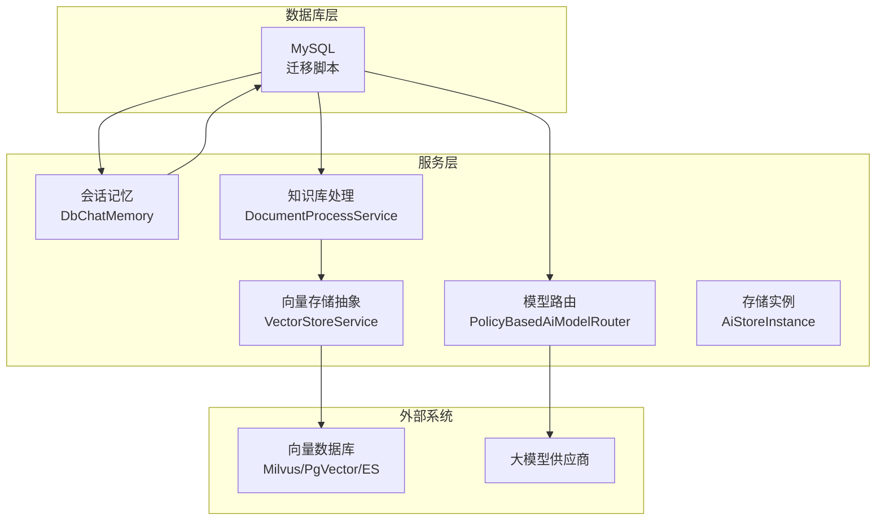
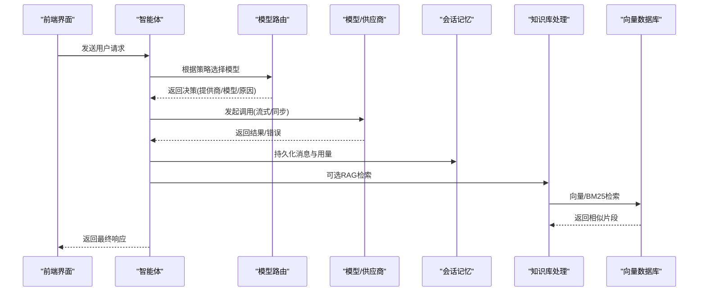
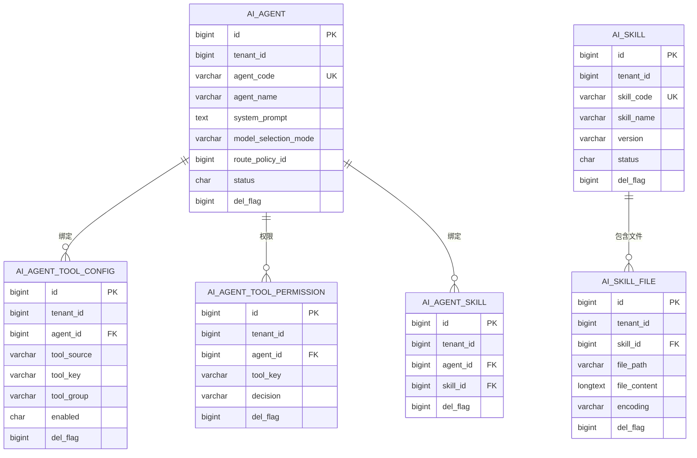
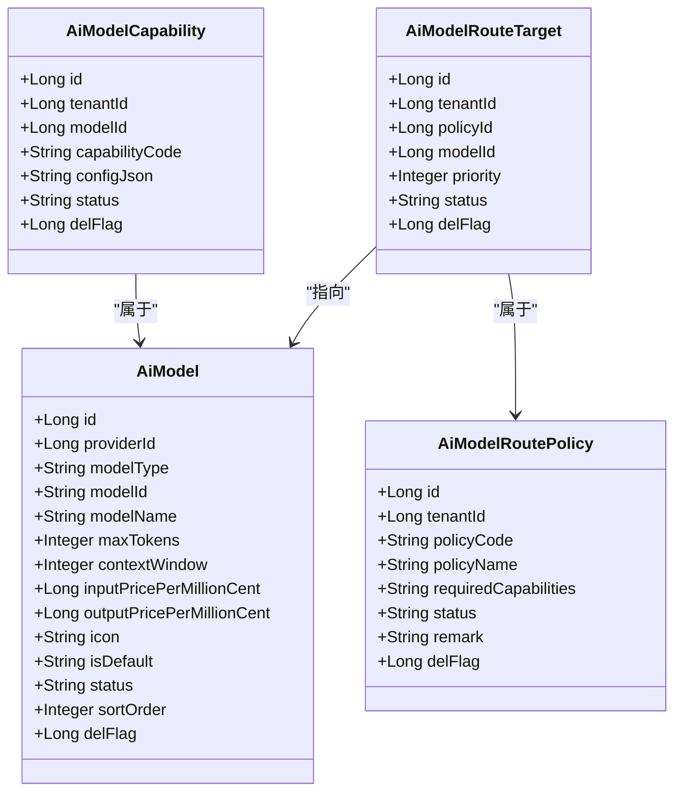
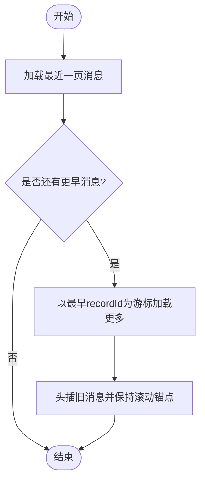
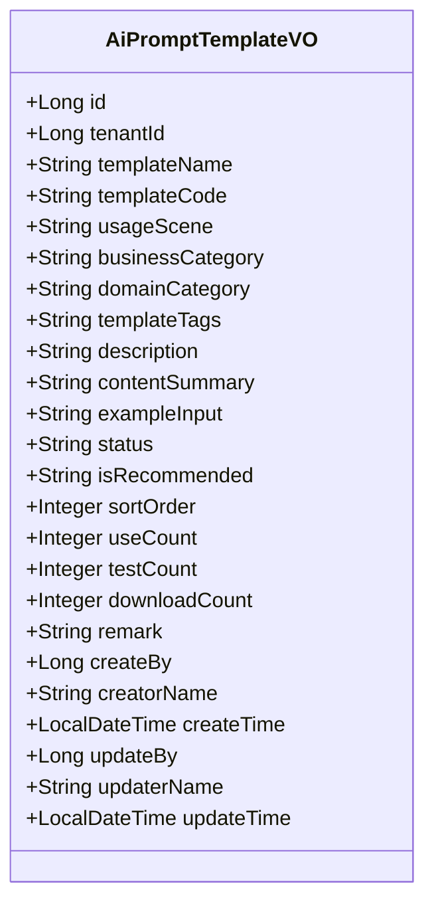
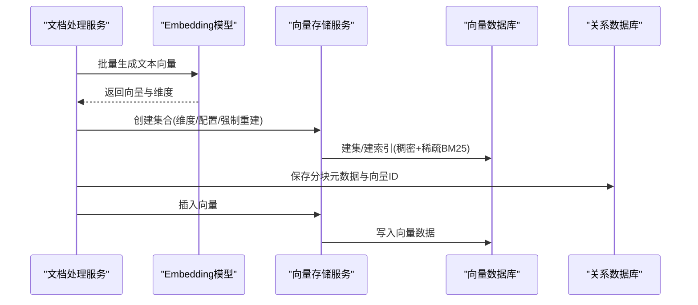
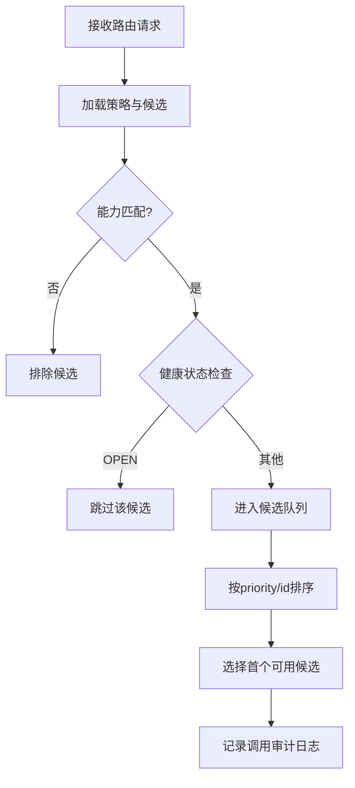
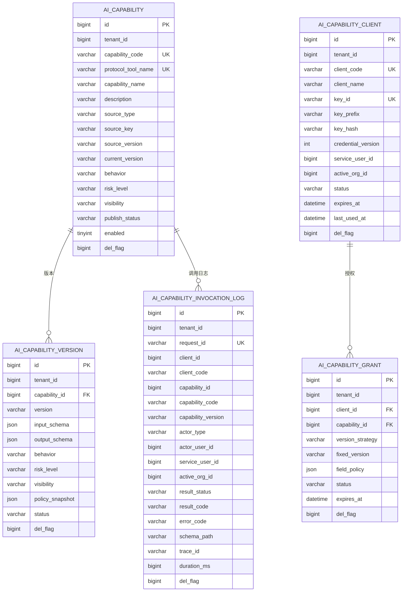
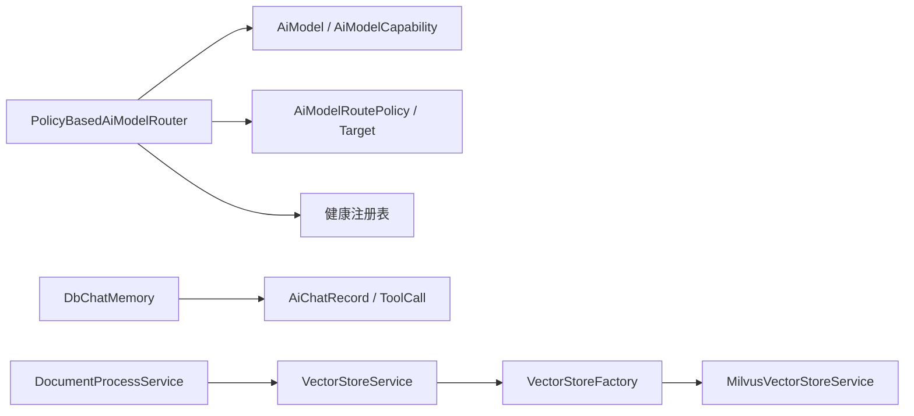

# AI能力数据设计

<cite>
**本文引用的文件**
- [V1.0.87__add_ai_knowledge_rag.sql](file://forge-server/db/migration/V1.0.87__add_ai_knowledge_rag.sql)
- [V1.0.88__add_agent_engine_event_skill.sql](file://forge-server/db/migration/V1.0.88__add_agent_engine_event_skill.sql)
- [V1.0.124__enhance_ai_chat_message_structure.sql](file://forge-server/db/migration/V1.0.124__enhance_ai_chat_message_structure.sql)
- [V1.0.18__add_ai_model_routing_governance.sql](file://forge-server/db/migration/V1.0.18__add_ai_model_routing_governance.sql)
- [V1.0.21__add_ai_capability_control_plane.sql](file://forge-server/db/migration/V1.0.21__add_ai_capability_control_plane.sql)
- [AiModel.java](file://forge-server/forge-framework/forge-plugin-parent/forge-plugin-ai/src/main/java/com/mdframe/forge/plugin/ai/model/domain/AiModel.java)
- [PolicyBasedAiModelRouter.java](file://forge-server/forge-framework/forge-plugin-parent/forge-plugin-ai/src/main/java/com/mdframe/forge/plugin/ai/routing/PolicyBasedAiModelRouter.java)
- [RouteDecision.java](file://forge-server/forge-framework/forge-plugin-parent/forge-plugin-ai/src/main/java/com/mdframe/forge/plugin/ai/routing/RouteDecision.java)
- [AiClientImpl.java](file://forge-server/forge-framework/forge-plugin-parent/forge-plugin-ai/src/main/java/com/mdframe/forge/plugin/ai/client/AiClientImpl.java)
- [DbChatMemory.java](file://forge-server/forge-framework/forge-plugin-parent/forge-plugin-ai/src/main/java/com/mdframe/forge/plugin/ai/chat/memory/DbChatMemory.java)
- [DocumentProcessService.java](file://forge-server/forge-framework/forge-plugin-parent/forge-plugin-ai/src/main/java/com/mdframe/forge/plugin/ai/knowledge/service/DocumentProcessService.java)
- [MilvusVectorStoreService.java](file://forge-server/forge-framework/forge-plugin-parent/forge-plugin-ai/src/main/java/com/mdframe/forge/plugin/ai/knowledge/vectorstore/MilvusVectorStoreService.java)
- [VectorStoreService.java](file://forge-server/forge-framework/forge-plugin-parent/forge-plugin-ai/src/main/java/com/mdframe/forge/plugin/ai/knowledge/vectorstore/VectorStoreService.java)
- [VectorStoreFactory.java](file://forge-server/forge-framework/forge-plugin-parent/forge-plugin-ai/src/main/java/com/mdframe/forge/plugin/ai/knowledge/vectorstore/VectorStoreFactory.java)
- [AiStoreInstance.java](file://forge-server/forge-framework/forge-plugin-parent/forge-plugin-ai/src/main/java/com/mdframe/forge/plugin/ai/knowledge/domain/AiStoreInstance.java)
- [AiPromptTemplateVO.java](file://forge-server/forge-framework/forge-plugin-parent/forge-plugin-ai/src/main/java/com/mdframe/forge/plugin/ai/prompt/vo/AiPromptTemplateVO.java)
- [agent.vue](file://forge-admin-ui/src/views/ai/agent.vue)
- [agent-chat.vue](file://forge-admin-ui/src/views/ai/agent-chat.vue)
</cite>

## 目录
1. [引言](#引言)
2. [项目结构](#项目结构)
3. [核心组件](#核心组件)
4. [架构总览](#架构总览)
5. [详细组件分析](#详细组件分析)
6. [依赖关系分析](#依赖关系分析)
7. [性能考虑](#性能考虑)
8. [故障排查指南](#故障排查指南)
9. [结论](#结论)
10. [附录](#附录)

## 引言
本文件面向Forge Admin的AI能力中心，聚焦“数据设计”视角，系统化梳理以下领域的数据模型与存储方案：
- AI智能体管理：智能体配置、工具集成、技能定义。
- AI供应商与模型：连接信息、API密钥、模型能力与路由治理。
- 会话管理：对话历史、消息记录、上下文持久化。
- 提示词模板库：分类、变量、版本管理。
- AI知识库：文档存储、向量检索、知识分片。
- 模型路由治理：选择规则、负载均衡、故障转移。
- 性能优化与安全策略：索引、审计、敏感信息保护等。

## 项目结构
仓库中与AI相关的数据设计与实现主要分布在以下位置：
- 数据库迁移脚本：位于 forge-server/db/migration，涵盖Agent、技能、知识库、会话、路由治理等表结构与字典初始化。
- Java实体与服务：位于 forge-server/forge-framework/forge-plugin-parent/forge-plugin-ai，包含模型、路由、会话记忆、知识库处理、向量存储适配等。
- 前端视图：位于 forge-admin-ui/src/views/ai，体现Agent配置、会话交互、提示词模板管理等UI侧字段映射。

图表来源
- [V1.0.18__add_ai_model_routing_governance.sql:1-192](file://forge-server/db/migration/V1.0.18__add_ai_model_routing_governance.sql#L1-L192)
- [V1.0.87__add_ai_knowledge_rag.sql:85-140](file://forge-server/db/migration/V1.0.87__add_ai_knowledge_rag.sql#L85-L140)
- [V1.0.124__enhance_ai_chat_message_structure.sql:1-116](file://forge-server/db/migration/V1.0.124__enhance_ai_chat_message_structure.sql#L1-L116)

章节来源
- [V1.0.18__add_ai_model_routing_governance.sql:1-192](file://forge-server/db/migration/V1.0.18__add_ai_model_routing_governance.sql#L1-L192)
- [V1.0.87__add_ai_knowledge_rag.sql:85-140](file://forge-server/db/migration/V1.0.87__add_ai_knowledge_rag.sql#L85-L140)
- [V1.0.124__enhance_ai_chat_message_structure.sql:1-116](file://forge-server/db/migration/V1.0.124__enhance_ai_chat_message_structure.sql#L1-L116)

## 核心组件
- 智能体与技能：通过Agent配置绑定工具与技能，支持权限控制与分组激活。
- 供应商与模型：维护模型元数据、能力、价格与上下文窗口；支持路由策略与调用审计。
- 会话与消息：结构化消息记录（含思考过程、用量、附件、状态），工具调用明细独立表。
- 提示词模板：模板元数据、分类、标签、使用统计与推荐标记。
- 知识库与向量检索：文档分块、向量维度校验、集合创建与BM25稀疏向量索引。
- 路由治理：显式候选、能力匹配、健康门控、确定性排序与调用日志。

章节来源
- [V1.0.88__add_agent_engine_event_skill.sql:105-165](file://forge-server/db/migration/V1.0.88__add_agent_engine_event_skill.sql#L105-L165)
- [V1.0.18__add_ai_model_routing_governance.sql:23-119](file://forge-server/db/migration/V1.0.18__add_ai_model_routing_governance.sql#L23-L119)
- [V1.0.124__enhance_ai_chat_message_structure.sql:92-116](file://forge-server/db/migration/V1.0.124__enhance_ai_chat_message_structure.sql#L92-L116)
- [AiPromptTemplateVO.java:1-63](file://forge-server/forge-framework/forge-plugin-parent/forge-plugin-ai/src/main/java/com/mdframe/forge/plugin/ai/prompt/vo/AiPromptTemplateVO.java#L1-L63)
- [V1.0.87__add_ai_knowledge_rag.sql:85-112](file://forge-server/db/migration/V1.0.87__add_ai_knowledge_rag.sql#L85-L112)

## 架构总览
下图展示AI能力中心在数据层面的关键交互：Agent通过路由策略选择模型，调用过程中记录治理日志；会话消息持久化到数据库；知识库将文档分块并写入向量数据库，同时保留分块元数据于关系型数据库。

图表来源
- [PolicyBasedAiModelRouter.java:1-31](file://forge-server/forge-framework/forge-plugin-parent/forge-plugin-ai/src/main/java/com/mdframe/forge/plugin/ai/routing/PolicyBasedAiModelRouter.java#L1-L31)
- [AiClientImpl.java:403-418](file://forge-server/forge-framework/forge-plugin-parent/forge-plugin-ai/src/main/java/com/mdframe/forge/plugin/ai/client/AiClientImpl.java#L403-L418)
- [DocumentProcessService.java:322-392](file://forge-server/forge-framework/forge-plugin-parent/forge-plugin-ai/src/main/java/com/mdframe/forge/plugin/ai/knowledge/service/DocumentProcessService.java#L322-L392)
- [MilvusVectorStoreService.java:132-181](file://forge-server/forge-framework/forge-plugin-parent/forge-plugin-ai/src/main/java/com/mdframe/forge/plugin/ai/knowledge/vectorstore/MilvusVectorStoreService.java#L132-L181)

## 详细组件分析

### 智能体、工具与技能数据模型
- 智能体工具绑定表：记录每个Agent启用的工具来源、标识、分组与启用状态，支持唯一键约束与逻辑删除。
- 智能体工具权限表：对工具访问进行ALLOW/ASK/DENY控制，按Agent与工具键建立唯一约束。
- 技能包与文件：技能主表与文件表分离，支持多文件内容存储与编码；Agent与技能多对多绑定。

图表来源
- [V1.0.88__add_agent_engine_event_skill.sql:105-165](file://forge-server/db/migration/V1.0.88__add_agent_engine_event_skill.sql#L105-L165)

章节来源
- [V1.0.88__add_agent_engine_event_skill.sql:105-165](file://forge-server/db/migration/V1.0.88__add_agent_engine_event_skill.sql#L105-L165)

### 供应商与模型数据模型
- 模型实体：包含供应商ID、模型类型、模型标识、显示名称、最大Token、上下文窗口、输入输出单价、图标、默认标记、状态与排序。
- 模型能力：以能力代码描述模型可路由能力（如流式、推理、工具调用、视觉、结构化输出）。
- 路由策略与目标：策略定义所需能力与显式候选模型优先级；目标表维护策略与模型的关联及顺序。
- 调用审计：记录请求ID、租户/用户/Agent/会话、路由来源与原因、提供商/模型/适配器、结果、错误分类、HTTP状态、耗时、Token用量与价格快照。

图表来源
- [AiModel.java:1-92](file://forge-server/forge-framework/forge-plugin-parent/forge-plugin-ai/src/main/java/com/mdframe/forge/plugin/ai/model/domain/AiModel.java#L1-L92)
- [V1.0.18__add_ai_model_routing_governance.sql:23-119](file://forge-server/db/migration/V1.0.18__add_ai_model_routing_governance.sql#L23-L119)

章节来源
- [AiModel.java:1-92](file://forge-server/forge-framework/forge-plugin-parent/forge-plugin-ai/src/main/java/com/mdframe/forge/plugin/ai/model/domain/AiModel.java#L1-L92)
- [V1.0.18__add_ai_model_routing_governance.sql:23-119](file://forge-server/db/migration/V1.0.18__add_ai_model_routing_governance.sql#L23-L119)

### 会话管理与消息持久化
- 会话记忆：基于数据库的ChatMemory实现，读取最近N条消息构建上下文，支持清空会话。
- 消息增强：为消息表增加思考过程、用量JSON、附件JSON、状态、中断ID、错误信息、更新时间与逻辑删除标志；新增工具调用明细表，按消息行记录每次工具调用的参数与结果。
- 前端交互：会话列表与消息分页加载，支持上滑加载更多、切换会话、删除会话等操作。

图表来源
- [DbChatMemory.java:1-93](file://forge-server/forge-framework/forge-plugin-parent/forge-plugin-ai/src/main/java/com/mdframe/forge/plugin/ai/chat/memory/DbChatMemory.java#L1-L93)
- [V1.0.124__enhance_ai_chat_message_structure.sql:14-116](file://forge-server/db/migration/V1.0.124__enhance_ai_chat_message_structure.sql#L14-L116)
- [agent-chat.vue:404-569](file://forge-admin-ui/src/views/ai/agent-chat.vue#L404-L569)

章节来源
- [DbChatMemory.java:1-93](file://forge-server/forge-framework/forge-plugin-parent/forge-plugin-ai/src/main/java/com/mdframe/forge/plugin/ai/chat/memory/DbChatMemory.java#L1-L93)
- [V1.0.124__enhance_ai_chat_message_structure.sql:14-116](file://forge-server/db/migration/V1.0.124__enhance_ai_chat_message_structure.sql#L14-L116)
- [agent-chat.vue:404-569](file://forge-admin-ui/src/views/ai/agent-chat.vue#L404-L569)

### 提示词模板库数据模型
- 模板元数据：名称、编码、适用场景、业务分类、领域分类、标签、描述、内容摘要、示例输入、状态、推荐标记、排序、使用/测试/下载次数、备注。
- 前端筛选：支持关键词、适用场景、业务/领域分类、状态、推荐等多维筛选。
- 导出与统计：支持Markdown导出模板内容，统计使用/测试/下载次数。

图表来源
- [AiPromptTemplateVO.java:1-63](file://forge-server/forge-framework/forge-plugin-parent/forge-plugin-ai/src/main/java/com/mdframe/forge/plugin/ai/prompt/vo/AiPromptTemplateVO.java#L1-L63)

章节来源
- [AiPromptTemplateVO.java:1-63](file://forge-server/forge-framework/forge-plugin-parent/forge-plugin-ai/src/main/java/com/mdframe/forge/plugin/ai/prompt/vo/AiPromptTemplateVO.java#L1-L63)

### AI知识库数据模型与向量检索
- 知识库分块：记录租户、知识库ID、文档ID、分块序号、内容、标题、Token数、向量ID、内容哈希、检索次数等；唯一键保证同一文档内分块不重复。
- 向量存储实例：维护向量存储/搜索引擎实例的名称、类别、类型、连接配置JSON、状态与逻辑删除。
- 向量服务抽象：提供集合创建、插入、删除、向量检索与BM25全文检索接口；工厂按类型路由到具体实现（当前Milvus已实现）。
- 处理流程：批量嵌入后按实际维度创建集合，保存分块到数据库并写入向量库，支持强制重建以应对维度不一致。

图表来源
- [DocumentProcessService.java:322-392](file://forge-server/forge-framework/forge-plugin-parent/forge-plugin-ai/src/main/java/com/mdframe/forge/plugin/ai/knowledge/service/DocumentProcessService.java#L322-L392)
- [MilvusVectorStoreService.java:132-181](file://forge-server/forge-framework/forge-plugin-parent/forge-plugin-ai/src/main/java/com/mdframe/forge/plugin/ai/knowledge/vectorstore/MilvusVectorStoreService.java#L132-L181)
- [VectorStoreService.java:1-50](file://forge-server/forge-framework/forge-plugin-parent/forge-plugin-ai/src/main/java/com/mdframe/forge/plugin/ai/knowledge/vectorstore/VectorStoreService.java#L1-L50)
- [VectorStoreFactory.java:1-44](file://forge-server/forge-framework/forge-plugin-parent/forge-plugin-ai/src/main/java/com/mdframe/forge/plugin/ai/knowledge/vectorstore/VectorStoreFactory.java#L1-L44)
- [AiStoreInstance.java:1-56](file://forge-server/forge-framework/forge-plugin-parent/forge-plugin-ai/src/main/java/com/mdframe/forge/plugin/ai/knowledge/domain/AiStoreInstance.java#L1-L56)
- [V1.0.87__add_ai_knowledge_rag.sql:85-140](file://forge-server/db/migration/V1.0.87__add_ai_knowledge_rag.sql#L85-L140)

章节来源
- [V1.0.87__add_ai_knowledge_rag.sql:85-140](file://forge-server/db/migration/V1.0.87__add_ai_knowledge_rag.sql#L85-L140)
- [DocumentProcessService.java:322-392](file://forge-server/forge-framework/forge-plugin-parent/forge-plugin-ai/src/main/java/com/mdframe/forge/plugin/ai/knowledge/service/DocumentProcessService.java#L322-L392)
- [MilvusVectorStoreService.java:132-181](file://forge-server/forge-framework/forge-plugin-parent/forge-plugin-ai/src/main/java/com/mdframe/forge/plugin/ai/knowledge/vectorstore/MilvusVectorStoreService.java#L132-L181)
- [VectorStoreService.java:1-50](file://forge-server/forge-framework/forge-plugin-parent/forge-plugin-ai/src/main/java/com/mdframe/forge/plugin/ai/knowledge/vectorstore/VectorStoreService.java#L1-L50)
- [VectorStoreFactory.java:1-44](file://forge-server/forge-framework/forge-plugin-parent/forge-plugin-ai/src/main/java/com/mdframe/forge/plugin/ai/knowledge/vectorstore/VectorStoreFactory.java#L1-L44)
- [AiStoreInstance.java:1-56](file://forge-server/forge-framework/forge-plugin-parent/forge-plugin-ai/src/main/java/com/mdframe/forge/plugin/ai/knowledge/domain/AiStoreInstance.java#L1-L56)

### 模型路由治理数据结构
- 路由策略：租户内唯一策略码，声明所需能力与显式候选模型优先级。
- 候选过滤与选择：仅从策略显式候选中选择，要求模型与供应商启用、未逻辑删除、能力满足；排序固定为priority升序、目标ID升序。
- 健康门控：UNKNOWN/HEALTHY/DEGRADED可被选中，OPEN熔断禁止新请求；HALF_OPEN允许一次试探调用。
- 调用审计：记录路由来源、策略、提供商/模型、适配器、结果、错误分类、HTTP状态、耗时、Token与价格快照。

图表来源
- [V1.0.18__add_ai_model_routing_governance.sql:42-119](file://forge-server/db/migration/V1.0.18__add_ai_model_routing_governance.sql#L42-L119)
- [PolicyBasedAiModelRouter.java:1-31](file://forge-server/forge-framework/forge-plugin-parent/forge-plugin-ai/src/main/java/com/mdframe/forge/plugin/ai/routing/PolicyBasedAiModelRouter.java#L1-L31)
- [RouteDecision.java:1-11](file://forge-server/forge-framework/forge-plugin-parent/forge-plugin-ai/src/main/java/com/mdframe/forge/plugin/ai/routing/RouteDecision.java#L1-L11)

章节来源
- [V1.0.18__add_ai_model_routing_governance.sql:42-119](file://forge-server/db/migration/V1.0.18__add_ai_model_routing_governance.sql#L42-L119)
- [PolicyBasedAiModelRouter.java:1-31](file://forge-server/forge-framework/forge-plugin-parent/forge-plugin-ai/src/main/java/com/mdframe/forge/plugin/ai/routing/PolicyBasedAiModelRouter.java#L1-L31)
- [RouteDecision.java:1-11](file://forge-server/forge-framework/forge-plugin-parent/forge-plugin-ai/src/main/java/com/mdframe/forge/plugin/ai/routing/RouteDecision.java#L1-L11)

### 能力中枢控制面数据模型
- 能力目录与版本：能力元数据、协议工具名、来源、版本、行为、风险等级、可见性、发布状态；不可变版本记录输入/输出Schema与策略快照。
- 机器客户端与授权：客户端代码、密钥ID与前缀、哈希、服务用户、组织、状态、过期时间；授权记录版本策略、固定版本、字段策略与有效期。
- 安全调用日志：记录请求ID、客户端/能力/版本、角色/用户/组织、结果状态、错误码、Schema路径、追踪ID、耗时。

图表来源
- [V1.0.21__add_ai_capability_control_plane.sql:3-145](file://forge-server/db/migration/V1.0.21__add_ai_capability_control_plane.sql#L3-L145)

章节来源
- [V1.0.21__add_ai_capability_control_plane.sql:3-145](file://forge-server/db/migration/V1.0.21__add_ai_capability_control_plane.sql#L3-L145)

## 依赖关系分析
- 路由模块依赖模型、供应商、策略与能力目录，结合健康注册表进行健康门控。
- 会话记忆依赖消息服务，读取最近N条消息构建上下文。
- 知识库处理依赖向量存储抽象与具体实现，按实例类型路由到Milvus等。
- 前端视图依赖后端API，映射Agent配置、会话消息与提示词模板字段。

图表来源
- [PolicyBasedAiModelRouter.java:1-31](file://forge-server/forge-framework/forge-plugin-parent/forge-plugin-ai/src/main/java/com/mdframe/forge/plugin/ai/routing/PolicyBasedAiModelRouter.java#L1-L31)
- [DbChatMemory.java:1-93](file://forge-server/forge-framework/forge-plugin-parent/forge-plugin-ai/src/main/java/com/mdframe/forge/plugin/ai/chat/memory/DbChatMemory.java#L1-L93)
- [DocumentProcessService.java:322-392](file://forge-server/forge-framework/forge-plugin-parent/forge-plugin-ai/src/main/java/com/mdframe/forge/plugin/ai/knowledge/service/DocumentProcessService.java#L322-L392)
- [VectorStoreFactory.java:1-44](file://forge-server/forge-framework/forge-plugin-parent/forge-plugin-ai/src/main/java/com/mdframe/forge/plugin/ai/knowledge/vectorstore/VectorStoreFactory.java#L1-L44)

章节来源
- [PolicyBasedAiModelRouter.java:1-31](file://forge-server/forge-framework/forge-plugin-parent/forge-plugin-ai/src/main/java/com/mdframe/forge/plugin/ai/routing/PolicyBasedAiModelRouter.java#L1-L31)
- [DbChatMemory.java:1-93](file://forge-server/forge-framework/forge-plugin-parent/forge-plugin-ai/src/main/java/com/mdframe/forge/plugin/ai/chat/memory/DbChatMemory.java#L1-L93)
- [DocumentProcessService.java:322-392](file://forge-server/forge-framework/forge-plugin-parent/forge-plugin-ai/src/main/java/com/mdframe/forge/plugin/ai/knowledge/service/DocumentProcessService.java#L322-L392)
- [VectorStoreFactory.java:1-44](file://forge-server/forge-framework/forge-plugin-parent/forge-plugin-ai/src/main/java/com/mdframe/forge/plugin/ai/knowledge/vectorstore/VectorStoreFactory.java#L1-L44)

## 性能考虑
- 索引优化：
  - 会话消息：按会话与逻辑删除标志复合索引加速过滤未删除消息。
  - 知识库分块：按文档与分块序号唯一约束，索引文档与知识库ID，内容哈希用于去重。
  - 路由日志：按租户时间、模型时间、Agent时间索引便于查询与清理。
- 向量检索：
  - 稠密向量索引（余弦相似度）与稀疏向量BM25索引组合，提升召回与相关性。
  - 集合维度动态确定，避免硬编码导致的重建成本。
- 路由确定性：
  - 固定排序规则（优先级、目标ID）确保可复跑与可解释性。
- 审计与清理：
  - 调用日志按天清理，默认保留90天，降低长期存储压力。

章节来源
- [V1.0.124__enhance_ai_chat_message_structure.sql:84-90](file://forge-server/db/migration/V1.0.124__enhance_ai_chat_message_structure.sql#L84-L90)
- [V1.0.87__add_ai_knowledge_rag.sql:85-112](file://forge-server/db/migration/V1.0.87__add_ai_knowledge_rag.sql#L85-L112)
- [V1.0.18__add_ai_model_routing_governance.sql:81-119](file://forge-server/db/migration/V1.0.18__add_ai_model_routing_governance.sql#L81-L119)
- [MilvusVectorStoreService.java:132-181](file://forge-server/forge-framework/forge-plugin-parent/forge-plugin-ai/src/main/java/com/mdframe/forge/plugin/ai/knowledge/vectorstore/MilvusVectorStoreService.java#L132-L181)

## 故障排查指南
- 路由失败：
  - 检查策略是否启用、能力是否满足、候选是否处于OPEN熔断状态。
  - 查看调用审计日志中的route_source、route_reason与error_category定位问题。
- 会话异常：
  - 检查消息状态是否为error或aborted，查看error_msg与usage_json确认用量与错误原因。
  - 工具调用明细表可按record_id与session_id查询具体工具执行状态。
- 知识库处理失败：
  - 核对Embedding模型输出维度与知识库配置维度是否一致，不一致会触发强制重建。
  - 检查向量存储实例配置JSON与类型是否正确，工厂路由不支持的类型会抛出业务异常。
- 提示词模板：
  - 确认模板状态与推荐标记，使用统计可用于评估模板质量。

章节来源
- [V1.0.18__add_ai_model_routing_governance.sql:81-119](file://forge-server/db/migration/V1.0.18__add_ai_model_routing_governance.sql#L81-L119)
- [V1.0.124__enhance_ai_chat_message_structure.sql:44-116](file://forge-server/db/migration/V1.0.124__enhance_ai_chat_message_structure.sql#L44-L116)
- [DocumentProcessService.java:322-392](file://forge-server/forge-framework/forge-plugin-parent/forge-plugin-ai/src/main/java/com/mdframe/forge/plugin/ai/knowledge/service/DocumentProcessService.java#L322-L392)
- [VectorStoreFactory.java:1-44](file://forge-server/forge-framework/forge-plugin-parent/forge-plugin-ai/src/main/java/com/mdframe/forge/plugin/ai/knowledge/vectorstore/VectorStoreFactory.java#L1-L44)

## 结论
本数据设计围绕AI能力中心的六大领域展开，形成以关系型数据库为核心、向量数据库为扩展的混合存储架构。通过明确的数据模型、严格的索引与审计机制，以及确定性的路由与健康治理，系统在可扩展性、可观测性与安全性方面具备良好基础。后续可根据业务演进持续完善向量存储类型支持与更细粒度的权限控制。

## 附录
- Agent配置字段参考：模型选择模式、路由策略ID、温度、最大Token、状态、知识ID集合、RAG模式、额外配置等。
- 会话消息分页：支持按recordId游标加载更多，保持视口稳定。
- 提示词模板导出：支持Markdown格式导出模板内容与说明。

章节来源
- [agent.vue:1093-1140](file://forge-admin-ui/src/views/ai/agent.vue#L1093-L1140)
- [agent-chat.vue:404-569](file://forge-admin-ui/src/views/ai/agent-chat.vue#L404-L569)