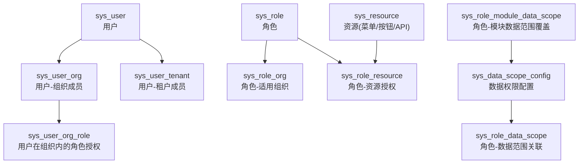
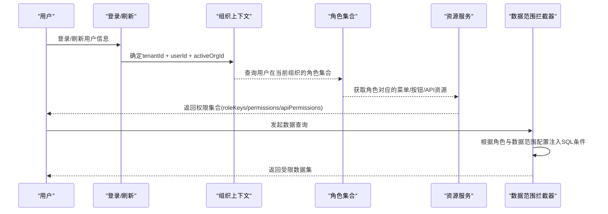
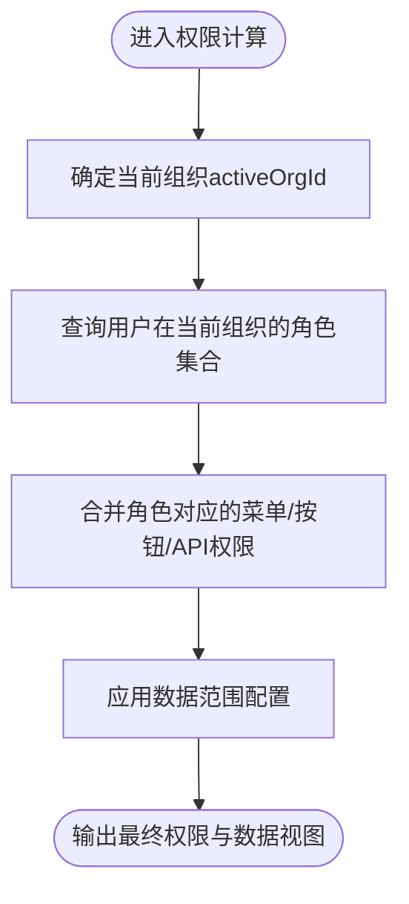
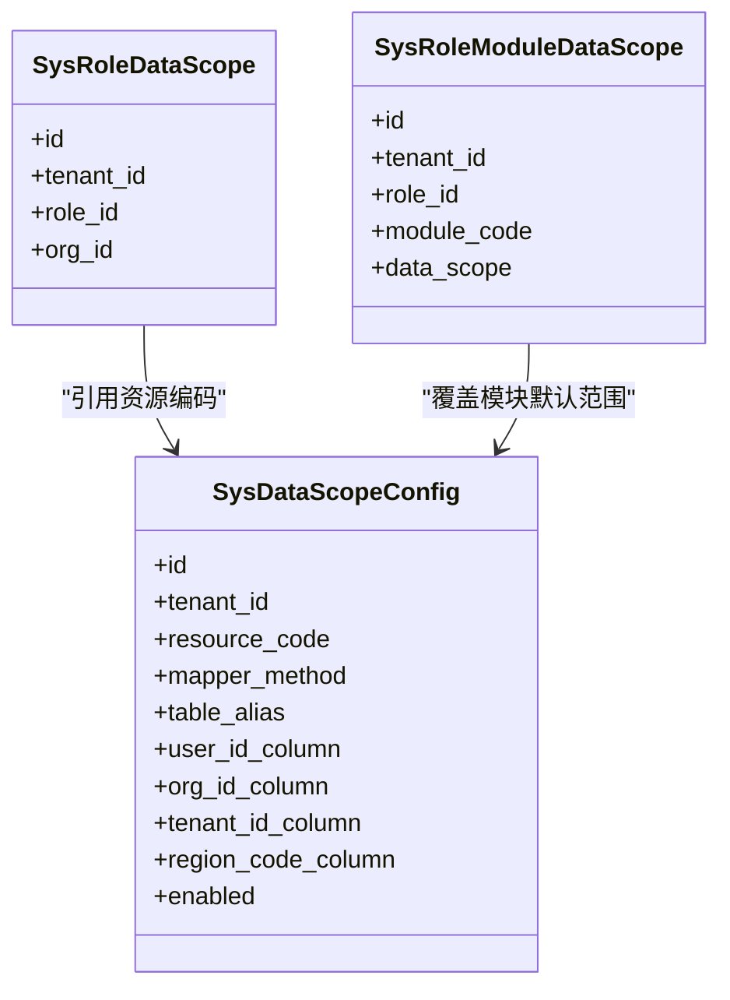
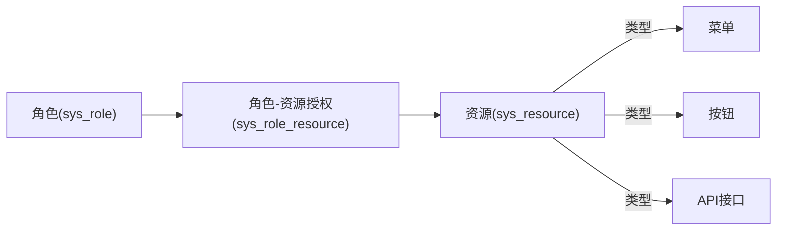
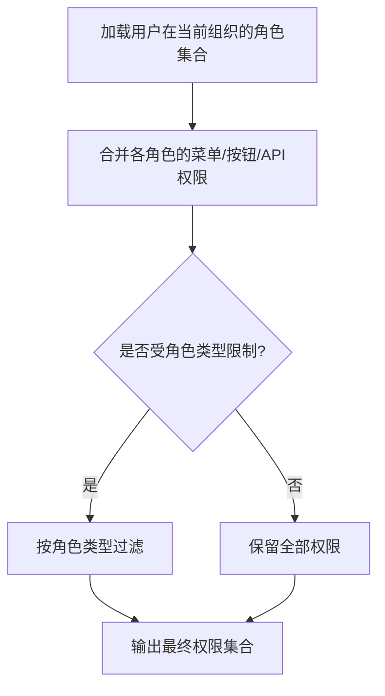
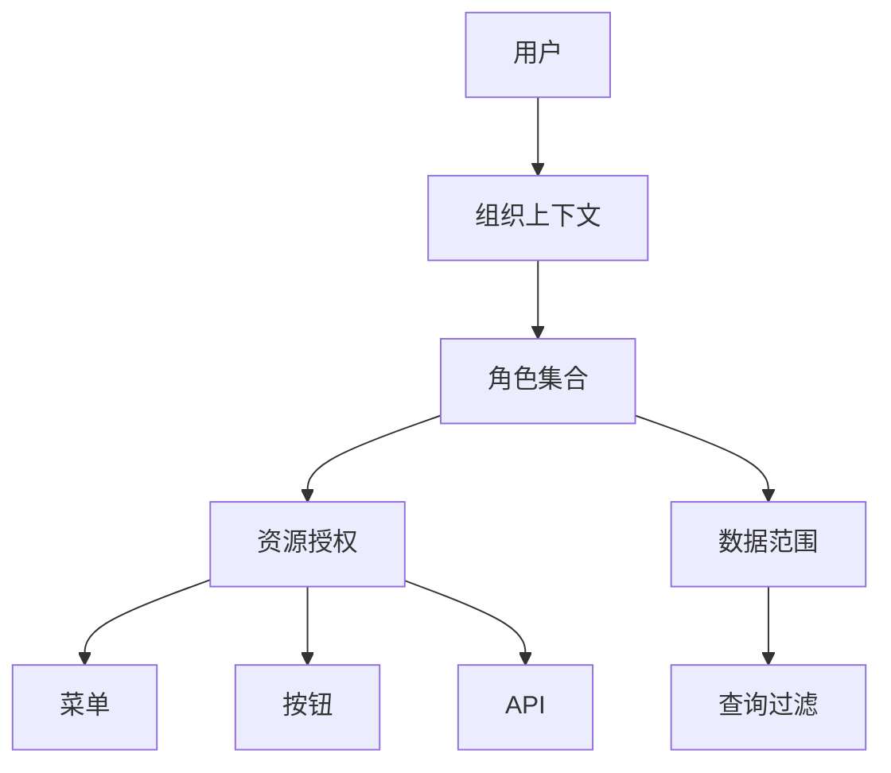

# RBAC权限模型设计

<cite>
**本文引用的文件**
- [V1.0.1__add_org_scoped_role_permission.sql](file://forge-server/db/migration/V1.0.1__add_org_scoped_role_permission.sql)
- [V1.0.20__add_role_org_scope_type.sql](file://forge-server/db/migration/V1.0.20__add_role_org_scope_type.sql)
- [V1.0.99__add_role_module_data_scopes.sql](file://forge-server/db/migration/V1.0.99__add_role_module_data_scopes.sql)
- [datascope_tables.sql](file://forge-server/forge-framework/forge-starter-parent/forge-starter-datascope/sql/datascope_tables.sql)
- [tech-org-scoped-role-permission.md](file://code-copilot/knowledge/tech-org-scoped-role-permission.md)
- [api_resources_example.sql](file://forge-server/forge-admin-server/src/main/resources/sql/api_resources_example.sql)
- [test_auth_data.sql](file://forge-server/forge-admin-server/src/main/resources/sql/test_auth_data.sql)
- [V1.0.48__add_sys_role_type.sql](file://forge-server/db/backup/V1.0.48__add_sys_role_type.sql)
- [V1.0.7__add_logic_delete_to_role_table.sql](file://forge-server/db/migration/V1.0.7__add_logic_delete_to_role_table.sql)
- [SysRoleMapper.xml](file://forge-server/forge-framework/forge-plugin-parent/forge-plugin-system/src/main/resources/mapper/SysRoleMapper.xml)
</cite>

## 目录
1. [简介](#简介)
2. [项目结构](#项目结构)
3. [核心组件](#核心组件)
4. [架构总览](#架构总览)
5. [详细组件分析](#详细组件分析)
6. [依赖关系分析](#依赖关系分析)
7. [性能考虑](#性能考虑)
8. [故障排查指南](#故障排查指南)
9. [结论](#结论)
10. [附录](#附录)

## 简介
本设计文档面向Forge Admin的RBAC（基于角色的访问控制）权限模型，聚焦数据库层面的用户、角色、资源与权限关联设计。重点说明：
- 组织范围的角色权限：通过组织上下文将“租户-组织-用户-角色”四层关系解耦，避免跨组织串权。
- 模块级数据权限：按业务模块覆盖默认数据范围，实现细粒度数据可见性控制。
- 菜单、按钮、API接口权限的存储方案：统一以资源为中心进行建模与授权。
- 权限继承与合并：基于角色集合在组织上下文中计算并合并权限。
- 扩展性与迁移版本管理：支持自定义权限类型与规则，提供可演进的迁移策略。

## 项目结构
与RBAC相关的数据库设计与迁移脚本主要分布在以下位置：
- 组织上下文与角色授权：迁移脚本新增组织维度的角色适用与用户组织内角色授权表。
- 数据权限配置：数据权限框架提供数据范围配置表与角色-数据范围关联表。
- 资源与权限：系统资源表承载菜单、按钮、API等资源；角色与资源的关联表完成授权。
- 角色能力增强：角色类型、逻辑删除、组织适用范围等字段演进。

图表来源
- [V1.0.1__add_org_scoped_role_permission.sql:4-39](file://forge-server/db/migration/V1.0.1__add_org_scoped_role_permission.sql#L4-L39)
- [datascope_tables.sql:2-38](file://forge-server/forge-framework/forge-starter-parent/forge-starter-datascope/sql/datascope_tables.sql#L2-L38)
- [V1.0.99__add_role_module_data_scopes.sql:3-18](file://forge-server/db/migration/V1.0.99__add_role_module_data_scopes.sql#L3-L18)

章节来源
- [V1.0.1__add_org_scoped_role_permission.sql:1-94](file://forge-server/db/migration/V1.0.1__add_org_scoped_role_permission.sql#L1-L94)
- [datascope_tables.sql:1-146](file://forge-server/forge-framework/forge-starter-parent/forge-starter-datascope/sql/datascope_tables.sql#L1-L146)
- [V1.0.99__add_role_module_data_scopes.sql:1-89](file://forge-server/db/migration/V1.0.99__add_role_module_data_scopes.sql#L1-L89)

## 核心组件
- 用户与组织成员关系：用户可在多个组织内存在成员关系，用于限定其可切换的组织集合。
- 角色与组织适用范围：角色可被限制在特定组织或租户全局范围内可用。
- 用户在组织内的角色授权：同一用户在不同组织可拥有不同角色，避免跨组织串权。
- 资源与权限：菜单、按钮、API均作为资源进行统一管理，并通过角色授权绑定。
- 数据权限：通过配置表定义查询过滤规则，结合角色与组织上下文动态注入SQL条件。
- 模块级数据范围覆盖：针对具体业务模块覆盖默认数据范围，实现更精细的数据可见性。

章节来源
- [tech-org-scoped-role-permission.md:12-31](file://code-copilot/knowledge/tech-org-scoped-role-permission.md#L12-L31)
- [V1.0.1__add_org_scoped_role_permission.sql:4-39](file://forge-server/db/migration/V1.0.1__add_org_scoped_role_permission.sql#L4-L39)
- [datascope_tables.sql:2-38](file://forge-server/forge-framework/forge-starter-parent/forge-starter-datascope/sql/datascope_tables.sql#L2-L38)
- [V1.0.99__add_role_module_data_scopes.sql:3-18](file://forge-server/db/migration/V1.0.99__add_role_module_data_scopes.sql#L3-L18)

## 架构总览
RBAC在Forge Admin中采用“租户-组织-用户-角色-资源-数据范围”的多层模型：
- 第一层：数据中心（租户），通过用户-租户成员关系隔离。
- 第二层：组织，通过用户-组织成员与角色-适用组织限定作用域。
- 第三层：用户在组织内的角色授权，决定当前请求下的真实角色集合。
- 第四层：资源（菜单/按钮/API），通过角色-资源授权控制功能可见与操作。
- 第五层：数据权限，通过配置与角色-数据范围关联，动态注入查询条件。

图表来源
- [tech-org-scoped-role-permission.md:18-31](file://code-copilot/knowledge/tech-org-scoped-role-permission.md#L18-L31)
- [datascope_tables.sql:2-38](file://forge-server/forge-framework/forge-starter-parent/forge-starter-datascope/sql/datascope_tables.sql#L2-L38)

## 详细组件分析

### 组织范围的角色权限设计
- sys_role_org：记录角色在哪些组织可被分配，限制角色作用域。
- sys_user_org_role：记录用户在指定组织内的真实角色授权，确保一次请求仅使用当前组织的角色。
- 权限计算：登录、刷新、切换租户/组织后，必须按tenantId+userId+activeOrgId重算角色与权限，避免串权。
- 超级管理员兼容：历史超级管理员若无显式组织绑定，可将当前租户全量组织作为兜底上下文，但切换选项需重新校验。

图表来源
- [V1.0.1__add_org_scoped_role_permission.sql:4-39](file://forge-server/db/migration/V1.0.1__add_org_scoped_role_permission.sql#L4-L39)
- [tech-org-scoped-role-permission.md:18-31](file://code-copilot/knowledge/tech-org-scoped-role-permission.md#L18-L31)

章节来源
- [V1.0.1__add_org_scoped_role_permission.sql:1-94](file://forge-server/db/migration/V1.0.1__add_org_scoped_role_permission.sql#L1-L94)
- [tech-org-scoped-role-permission.md:1-51](file://code-copilot/knowledge/tech-org-scoped-role-permission.md#L1-L51)

### 模块级数据权限控制的数据模型
- sys_data_scope_config：定义每个资源（如接口或模块）的数据范围规则，支持简单字段匹配与复杂SQL表达式。
- sys_role_data_scope：角色与数据范围的关联，限定角色在组织维度上的数据可见性。
- sys_role_module_data_scope：对特定业务模块覆盖默认数据范围，实现更细粒度的数据权限控制。
- 数据范围类型：包括全部、本租户、本组织、本组织及下级、本人、行政区划等。

图表来源
- [datascope_tables.sql:2-38](file://forge-server/forge-framework/forge-starter-parent/forge-starter-datascope/sql/datascope_tables.sql#L2-L38)
- [V1.0.99__add_role_module_data_scopes.sql:3-18](file://forge-server/db/migration/V1.0.99__add_role_module_data_scopes.sql#L3-L18)

章节来源
- [datascope_tables.sql:1-146](file://forge-server/forge-framework/forge-starter-parent/forge-starter-datascope/sql/datascope_tables.sql#L1-L146)
- [V1.0.99__add_role_module_data_scopes.sql:1-89](file://forge-server/db/migration/V1.0.99__add_role_module_data_scopes.sql#L1-L89)

### 菜单、按钮、API接口权限的数据库存储方案
- 资源表sys_resource：统一承载菜单、按钮、API等资源，通过resource_type区分类型，perms标识权限码，api_url与方法用于接口级控制。
- 角色-资源授权表sys_role_resource：将角色与资源绑定，实现菜单可见、按钮可用、API可访问的控制。
- 示例与测试数据：提供API资源示例与测试授权数据，便于验证权限链路。

图表来源
- [api_resources_example.sql:1-64](file://forge-server/forge-admin-server/src/main/resources/sql/api_resources_example.sql#L1-L64)
- [test_auth_data.sql:93-122](file://forge-server/forge-admin-server/src/main/resources/sql/test_auth_data.sql#L93-L122)

章节来源
- [api_resources_example.sql:1-64](file://forge-server/forge-admin-server/src/main/resources/sql/api_resources_example.sql#L1-L64)
- [test_auth_data.sql:93-122](file://forge-server/forge-admin-server/src/main/resources/sql/test_auth_data.sql#L93-L122)

### 权限继承与权限合并的数据库实现逻辑
- 角色类型与适用范围：角色表包含role_type与org_scope_type，支持管理/业务/审批/数据角色以及租户全局或指定组织范围。
- 逻辑删除与唯一约束：角色表增加del_flag与生成列logic_delete_active，配合唯一索引保证活跃角色名称与键的唯一性。
- 权限合并：在组织上下文中，用户的角色集合可能来自多个角色，权限合并时取并集，菜单、按钮、API权限叠加。

图表来源
- [V1.0.48__add_sys_role_type.sql:1-23](file://forge-server/db/backup/V1.0.48__add_sys_role_type.sql#L1-L23)
- [V1.0.7__add_logic_delete_to_role_table.sql:7-43](file://forge-server/db/migration/V1.0.7__add_logic_delete_to_role_table.sql#L7-L43)
- [SysRoleMapper.xml:52-56](file://forge-server/forge-framework/forge-plugin-parent/forge-plugin-system/src/main/resources/mapper/SysRoleMapper.xml#L52-L56)

章节来源
- [V1.0.48__add_sys_role_type.sql:1-23](file://forge-server/db/backup/V1.0.48__add_sys_role_type.sql#L1-L23)
- [V1.0.7__add_logic_delete_to_role_table.sql:7-43](file://forge-server/db/migration/V1.0.7__add_logic_delete_to_role_table.sql#L7-L43)
- [SysRoleMapper.xml:52-56](file://forge-server/forge-framework/forge-plugin-parent/forge-plugin-system/src/main/resources/mapper/SysRoleMapper.xml#L52-L56)

### 扩展性设计：自定义权限类型与权限规则
- 自定义权限类型：通过角色类型与资源类型扩展，支持业务角色、审批角色、数据角色等差异化控制。
- 自定义权限规则：数据权限配置支持复杂SQL表达式，允许按业务语义定义用户/组织/租户/区划等多维过滤条件。
- 模块级覆盖：通过模块编码覆盖默认数据范围，满足多模块差异化需求。

章节来源
- [datascope_tables.sql:42-146](file://forge-server/forge-framework/forge-starter-parent/forge-starter-datascope/sql/datascope_tables.sql#L42-L146)
- [V1.0.99__add_role_module_data_scopes.sql:3-18](file://forge-server/db/migration/V1.0.99__add_role_module_data_scopes.sql#L3-L18)
- [V1.0.48__add_sys_role_type.sql:1-23](file://forge-server/db/backup/V1.0.48__add_sys_role_type.sql#L1-L23)

### 权限数据迁移与版本管理最佳实践
- 基线脚本：以V1.0.0__baseline.sql为基线，后续变更以版本化迁移脚本追加。
- 幂等与兼容性：迁移脚本使用IF NOT EXISTS、UNIQUE KEY与条件插入，确保重复执行安全。
- 数据初始化与授权：迁移脚本同时完成资源创建与角色授权绑定，减少手工维护成本。
- 升级路径：已有表结构通过ALTER TABLE增量升级，保持向后兼容。

章节来源
- [V1.0.0__baseline.sql:1-4](file://forge-server/db/migration/V1.0.0__baseline.sql#L1-L4)
- [V1.0.1__add_org_scoped_role_permission.sql:1-94](file://forge-server/db/migration/V1.0.1__add_org_scoped_role_permission.sql#L1-L94)
- [V1.0.99__add_role_module_data_scopes.sql:1-89](file://forge-server/db/migration/V1.0.99__add_role_module_data_scopes.sql#L1-L89)
- [datascope_tables.sql:104-146](file://forge-server/forge-framework/forge-starter-parent/forge-starter-datascope/sql/datascope_tables.sql#L104-L146)

## 依赖关系分析
- 组织上下文依赖：用户-组织成员与角色-适用组织共同决定当前请求的有效角色集合。
- 资源授权依赖：角色-资源授权表将功能与权限映射到具体资源。
- 数据权限依赖：数据范围配置与角色-数据范围关联共同决定查询时的数据可见性。
- 模块覆盖依赖：模块级数据范围覆盖优先于默认配置，实现精细化控制。

图表来源
- [V1.0.1__add_org_scoped_role_permission.sql:4-39](file://forge-server/db/migration/V1.0.1__add_org_scoped_role_permission.sql#L4-L39)
- [datascope_tables.sql:2-38](file://forge-server/forge-framework/forge-starter-parent/forge-starter-datascope/sql/datascope_tables.sql#L2-L38)
- [V1.0.99__add_role_module_data_scopes.sql:3-18](file://forge-server/db/migration/V1.0.99__add_role_module_data_scopes.sql#L3-L18)

章节来源
- [V1.0.1__add_org_scoped_role_permission.sql:1-94](file://forge-server/db/migration/V1.0.1__add_org_scoped_role_permission.sql#L1-L94)
- [datascope_tables.sql:1-146](file://forge-server/forge-framework/forge-starter-parent/forge-starter-datascope/sql/datascope_tables.sql#L1-L146)
- [V1.0.99__add_role_module_data_scopes.sql:1-89](file://forge-server/db/migration/V1.0.99__add_role_module_data_scopes.sql#L1-L89)

## 性能考虑
- 索引优化：为用户-组织、角色-组织、角色-资源、数据范围配置等高频查询建立合适索引，提升权限计算与数据过滤性能。
- 权限缓存：在登录、刷新、切换组织后缓存用户的角色与权限集合，减少重复计算。
- SQL注入防护：数据范围配置中的复杂SQL表达式应通过参数化与白名单机制防止注入。
- 批量授权：角色-资源授权与数据范围配置建议批量写入，降低事务开销。

[本节为通用指导，不直接分析具体文件]

## 故障排查指南
- 组织串权问题：检查用户-组织成员与角色-适用组织是否正确绑定，确认当前请求的activeOrgId与角色集合一致。
- 权限未生效：核对角色-资源授权是否包含目标资源，确认资源类型与权限码匹配。
- 数据范围异常：检查数据范围配置是否启用，确认角色-数据范围关联是否存在，验证复杂SQL表达式占位符是否正确。
- 迁移失败：确认迁移脚本幂等性，检查唯一约束冲突与依赖表是否存在。

章节来源
- [tech-org-scoped-role-permission.md:18-31](file://code-copilot/knowledge/tech-org-scoped-role-permission.md#L18-L31)
- [datascope_tables.sql:42-146](file://forge-server/forge-framework/forge-starter-parent/forge-starter-datascope/sql/datascope_tables.sql#L42-L146)
- [V1.0.99__add_role_module_data_scopes.sql:20-89](file://forge-server/db/migration/V1.0.99__add_role_module_data_scopes.sql#L20-L89)

## 结论
Forge Admin的RBAC权限模型通过组织上下文与模块化数据权限实现了高内聚、低耦合的权限治理体系。该设计在保证安全性的同时具备良好的扩展性，能够支撑多租户、多组织、多模块的复杂业务场景。建议在实施过程中严格遵循迁移版本管理与幂等原则，并结合索引与缓存优化性能。

[本节为总结性内容，不直接分析具体文件]

## 附录
- 关键表与字段说明：
  - sys_role_org：角色适用组织范围表，限制角色在哪些组织可被分配。
  - sys_user_org_role：用户在组织内的角色授权表，确保一次请求仅使用当前组织的角色。
  - sys_data_scope_config：数据权限配置表，定义查询过滤规则。
  - sys_role_data_scope：角色-数据范围关联表，限定角色在组织维度上的数据可见性。
  - sys_role_module_data_scope：角色-模块数据范围覆盖表，实现对特定模块的覆盖控制。
  - sys_resource：资源表，承载菜单、按钮、API等资源。
  - sys_role_resource：角色-资源授权表，完成功能与权限绑定。

章节来源
- [V1.0.1__add_org_scoped_role_permission.sql:4-39](file://forge-server/db/migration/V1.0.1__add_org_scoped_role_permission.sql#L4-L39)
- [datascope_tables.sql:2-38](file://forge-server/forge-framework/forge-starter-parent/forge-starter-datascope/sql/datascope_tables.sql#L2-L38)
- [V1.0.99__add_role_module_data_scopes.sql:3-18](file://forge-server/db/migration/V1.0.99__add_role_module_data_scopes.sql#L3-L18)
- [api_resources_example.sql:1-64](file://forge-server/forge-admin-server/src/main/resources/sql/api_resources_example.sql#L1-L64)