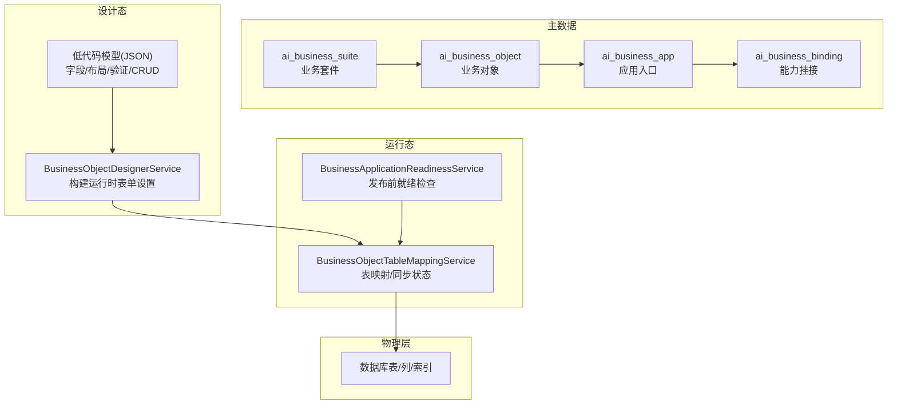
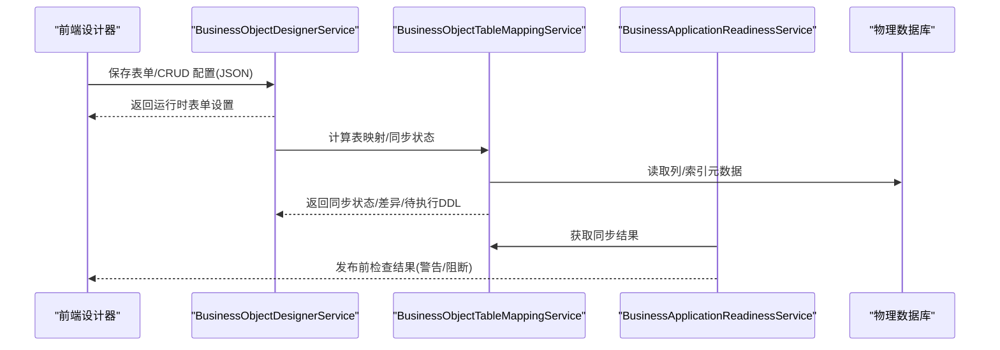
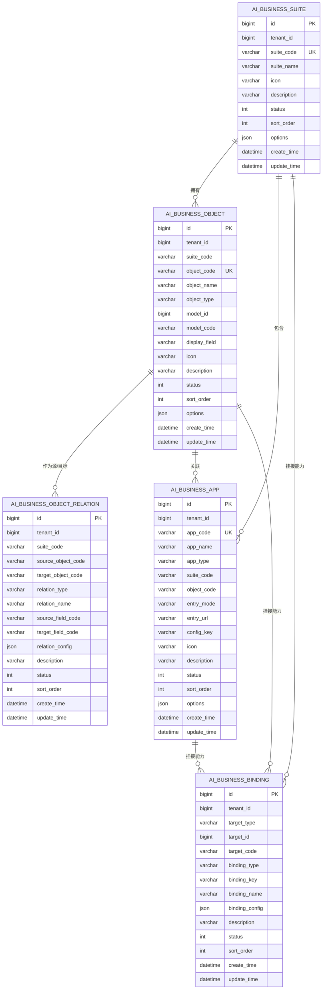
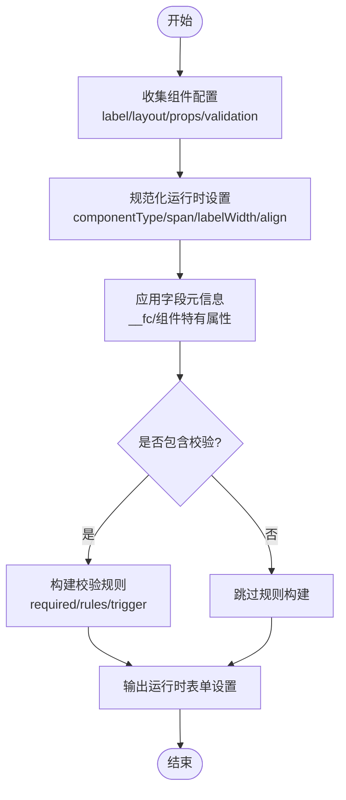
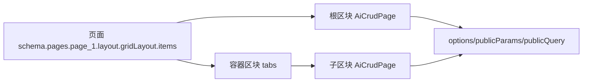
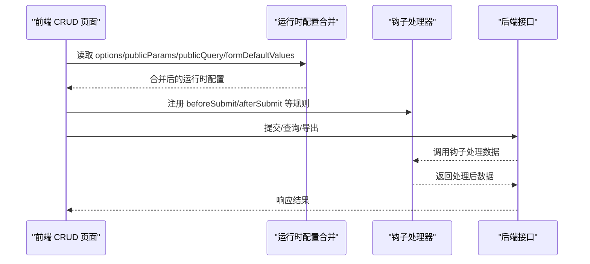
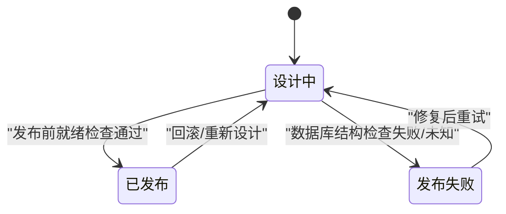
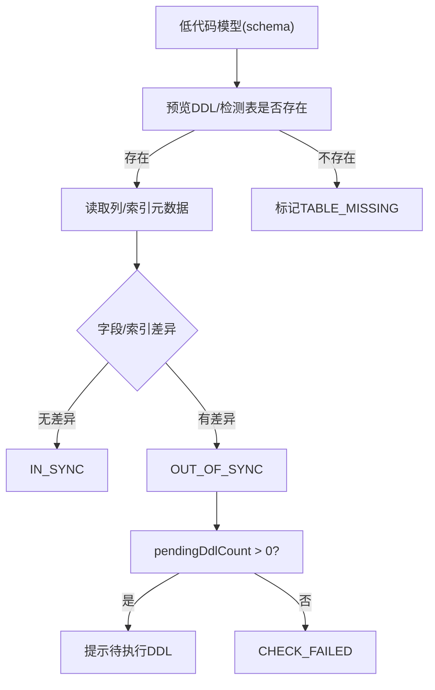
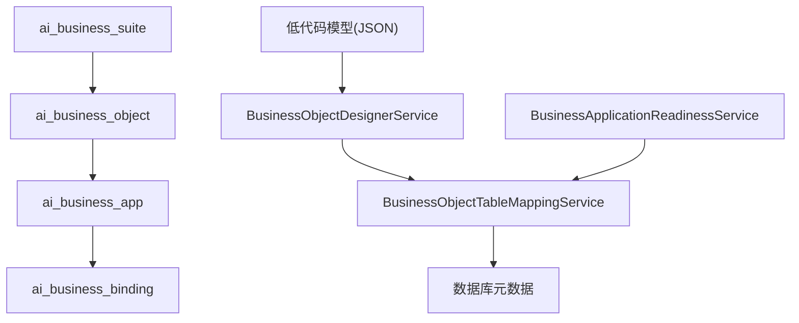

# 低代码平台数据模型

<cite>
**本文引用的文件**
- [V1.0.26__add_business_app_platform_tables.sql](file://forge-server/db/backup/V1.0.26__add_business_app_platform_tables.sql)
- [V1.0.27__add_business_app_platform_dicts_menus.sql](file://forge-server/db/backup/V1.0.27__add_business_app_platform_dicts_menus.sql)
- [BusinessObjectTableMappingVO.java](file://forge-server/forge-framework/forge-plugin-parent/forge-plugin-generator/src/main/java/com/mdframe/forge/plugin/generator/vo/businessapp/BusinessObjectTableMappingVO.java)
- [BusinessObjectTableMappingService.java](file://forge-server/forge-framework/forge-plugin-parent/forge-plugin-generator/src/main/java/com/mdframe/forge/plugin/generator/service/businessapp/BusinessObjectTableMappingService.java)
- [BusinessApplicationReadinessService.java](file://forge-server/forge-framework/forge-plugin-parent/forge-plugin-generator/src/main/java/com/mdframe/forge/plugin/generator/service/businessapp/BusinessApplicationReadinessService.java)
- [BusinessObjectDesignerService.java](file://forge-server/forge-framework/forge-plugin-parent/forge-plugin-generator/src/main/java/com/mdframe/forge/plugin/generator/service/businessapp/BusinessObjectDesignerService.java)
- [BusinessFormDesigner.vue](file://forge-admin-ui/src/views/app-center/components/designer/BusinessFormDesigner.vue)
- [forgeToFormCreate.js](file://forge-admin-ui/src/views/app-center/components/designer/form-first/forgeToFormCreate.js)
- [ForgePropertyPanel.vue](file://forge-admin-ui/src/views/app-center/components/designer/forge-form-designer/ForgePropertyPanel.vue)
- [crud-page.vue](file://forge-admin-ui/src/views/ai/crud-page.vue)
</cite>

## 目录
1. [简介](#简介)
2. [项目结构](#项目结构)
3. [核心组件](#核心组件)
4. [架构总览](#架构总览)
5. [详细组件分析](#详细组件分析)
6. [依赖关系分析](#依赖关系分析)
7. [性能考虑](#性能考虑)
8. [故障排查指南](#故障排查指南)
9. [结论](#结论)
10. [附录](#附录)

## 简介
本文件面向 Forge Admin 低代码平台的数据模型设计，聚焦业务对象设计器的数据库架构、表单配置持久化、页面模板管理、CRUD 配置、应用生命周期与版本控制、元数据管理机制，以及扩展性与兼容性方案。文档以仓库中的迁移脚本、服务类与前端设计器实现为依据，给出表结构、字段含义、关系映射与运行时数据流，帮助读者理解从“设计态”到“运行态”的完整数据链路。

## 项目结构
本项目围绕“业务套件-业务对象-应用入口-能力挂接”的主数据体系组织数据模型，并通过迁移脚本定义核心表；同时通过后端服务将“低代码模型（JSON）”与“物理数据库表”进行三向对齐（设计态、运行态、物理表），并暴露同步状态与待执行 DDL 数量等关键指标。前端设计器负责表单与 CRUD 的配置采集与渲染，最终落地为可运行的低代码页面。

图表来源
- [V1.0.26__add_business_app_platform_tables.sql:3-127](file://forge-server/db/backup/V1.0.26__add_business_app_platform_tables.sql#L3-L127)
- [BusinessObjectTableMappingService.java:57-78](file://forge-server/forge-framework/forge-plugin-parent/forge-plugin-generator/src/main/java/com/mdframe/forge/plugin/generator/service/businessapp/BusinessObjectTableMappingService.java#L57-L78)
- [BusinessApplicationReadinessService.java:364-388](file://forge-server/forge-framework/forge-plugin-parent/forge-plugin-generator/src/main/java/com/mdframe/forge/plugin/generator/service/businessapp/BusinessApplicationReadinessService.java#L364-L388)

章节来源
- [V1.0.26__add_business_app_platform_tables.sql:3-127](file://forge-server/db/backup/V1.0.26__add_business_app_platform_tables.sql#L3-L127)
- [V1.0.27__add_business_app_platform_dicts_menus.sql:3-144](file://forge-server/db/backup/V1.0.27__add_business_app_platform_dicts_menus.sql#L3-L144)

## 核心组件
- 业务套件与业务对象：用于划分领域与实体，支撑多租户隔离与排序展示。
- 应用入口：承载不同渠道（运行页、路由、iframe、外部、H5、API）的统一入口。
- 能力挂接：将流程、审批、报表、权限、消息、触发器、导入导出、移动、集成等能力与对象或应用绑定。
- 表映射与同步：将低代码模型与物理表进行对比，输出同步状态、差异项与待执行 DDL 数量。
- 表单与 CRUD 配置：前端设计器收集字段、布局、验证、CRUD 开关与钩子规则，后端将其转换为运行时配置。

章节来源
- [V1.0.26__add_business_app_platform_tables.sql:24-127](file://forge-server/db/backup/V1.0.26__add_business_app_platform_tables.sql#L24-L127)
- [BusinessObjectTableMappingVO.java:15-57](file://forge-server/forge-framework/forge-plugin-parent/forge-plugin-generator/src/main/java/com/mdframe/forge/plugin/generator/vo/businessapp/BusinessObjectTableMappingVO.java#L15-L57)
- [BusinessObjectDesignerService.java:2901-2921](file://forge-server/forge-framework/forge-plugin-parent/forge-plugin-generator/src/main/java/com/mdframe/forge/plugin/generator/service/businessapp/BusinessObjectDesignerService.java#L2901-L2921)

## 架构总览
低代码平台的数据模型由“主数据 + 设计态 JSON + 运行态映射 + 物理表”构成。设计态通过表单与 CRUD 设计器生成 JSON 模型；运行态通过服务计算与设计模型的差异，驱动 DDL 生成与同步；发布前通过就绪检查确保数据库结构与预期一致。

图表来源
- [BusinessObjectDesignerService.java:2901-2921](file://forge-server/forge-framework/forge-plugin-parent/forge-plugin-generator/src/main/java/com/mdframe/forge/plugin/generator/service/businessapp/BusinessObjectDesignerService.java#L2901-L2921)
- [BusinessObjectTableMappingService.java:57-78](file://forge-server/forge-framework/forge-plugin-parent/forge-plugin-generator/src/main/java/com/mdframe/forge/plugin/generator/service/businessapp/BusinessObjectTableMappingService.java#L57-L78)
- [BusinessApplicationReadinessService.java:364-388](file://forge-server/forge-framework/forge-plugin-parent/forge-plugin-generator/src/main/java/com/mdframe/forge/plugin/generator/service/businessapp/BusinessApplicationReadinessService.java#L364-L388)

## 详细组件分析

### 业务对象设计器数据库架构
- 业务套件表 ai_business_suite：记录套件编码、名称、图标、说明、状态、排序、扩展配置等，支持按租户唯一编码与排序索引。
- 业务对象表 ai_business_object：记录对象编码、名称、类型（主数据/明细/查找/单据）、关联的低代码模型标识、默认展示字段、图标、说明、状态、排序、扩展配置等，支持按套件、模型、更新时间索引。
- 业务对象关系表 ai_business_object_relation：描述对象间引用、明细、关联列表、多对多关系，包含关系名、源/目标字段、关系配置、说明、状态、排序等，支持按源/目标对象查询。
- 应用入口表 ai_business_app：统一入口管理，支持运行页、内部路由、iframe、外部、H5、API 等模式，关联对象与低代码运行配置键，支持按套件、对象、配置键索引。
- 能力挂接表 ai_business_binding：将流程、审批、报表、权限、消息、触发器、导入导出、移动、集成等能力与套件/对象/应用绑定，支持按目标与能力类型索引。

图表来源
- [V1.0.26__add_business_app_platform_tables.sql:3-127](file://forge-server/db/backup/V1.0.26__add_business_app_platform_tables.sql#L3-L127)

章节来源
- [V1.0.26__add_business_app_platform_tables.sql:24-127](file://forge-server/db/backup/V1.0.26__add_business_app_platform_tables.sql#L24-L127)

### 表单配置的数据存储方案
- 字段定义与布局：前端设计器在组件上维护 label、layout（span、labelWidth、align）、props（含 __fc 元信息）与 validation（required、rules）。后端服务将这些配置规范化为运行时表单设置，包括组件类型、标签宽度、栅格跨度、校验必填与自定义规则等。
- 验证规则：required 与 rules 在前端被收集并转换为运行时校验；后端在构建运行时表单设置时保留 requiredMessage 与 trigger 等元信息。
- 持久化策略：表单与字段配置以 JSON 形式保存在低代码模型中（例如 designerOptions），并在运行时通过服务解析为 UI 渲染所需的设置对象。

图表来源
- [BusinessFormDesigner.vue:733-757](file://forge-admin-ui/src/views/app-center/components/designer/BusinessFormDesigner.vue#L733-L757)
- [forgeToFormCreate.js:43-69](file://forge-admin-ui/src/views/app-center/components/designer/form-first/forgeToFormCreate.js#L43-L69)
- [BusinessObjectDesignerService.java:2901-2921](file://forge-server/forge-framework/forge-plugin-parent/forge-plugin-generator/src/main/java/com/mdframe/forge/plugin/generator/service/businessapp/BusinessObjectDesignerService.java#L2901-L2921)

章节来源
- [BusinessFormDesigner.vue:733-757](file://forge-admin-ui/src/views/app-center/components/designer/BusinessFormDesigner.vue#L733-L757)
- [forgeToFormCreate.js:43-69](file://forge-admin-ui/src/views/app-center/components/designer/form-first/forgeToFormCreate.js#L43-L69)
- [BusinessObjectDesignerService.java:2901-2921](file://forge-server/forge-framework/forge-plugin-parent/forge-plugin-generator/src/main/java/com/mdframe/forge/plugin/generator/service/businessapp/BusinessObjectDesignerService.java#L2901-L2921)

### 页面模板管理的数据模型
- 页面结构：通过低代码模型中的 pages 与 layout.gridLayout.items 描述页面区块与栅格布局。
- 组件配置：每个区块包含 blockType、id、props、children 等，支持嵌套（如 tabs 内嵌 CRUD 区块）。
- 样式定义：通过 props 与 __fc 元信息传递组件样式与行为；运行时根据 gridColumns 与 span 计算实际布局。
- 数据绑定：页面级选项（options）与公共参数（publicParams/publicQuery）在运行时合并，形成最终渲染上下文。

图表来源
- [crud-page.vue:1010-1036](file://forge-admin-ui/src/views/ai/crud-page.vue#L1010-L1036)

章节来源
- [crud-page.vue:1010-1036](file://forge-admin-ui/src/views/ai/crud-page.vue#L1010-L1036)

### CRUD 配置的数据结构设计
- 增删改查开关：通过 crudOptions 或运行时配置项控制列表、新增、编辑、删除、导出等能力。
- 数据绑定：formDefaultValues、publicQuery、publicParams 在运行时合并，决定初始值与查询上下文。
- 钩子规则：beforeSubmit/afterSubmit/beforeLoad/afterLoad 等事件通过 crudHookRules 与治理事件处理器组合，形成运行时回调链。
- 字段级 CRUD 配置：前端收集字段级别的 __crudConfig，用于控制字段在 CRUD 中的可见性、角色与行为。

图表来源
- [crud-page.vue:1010-1036](file://forge-admin-ui/src/views/ai/crud-page.vue#L1010-L1036)
- [crud-page.vue:1241-1271](file://forge-admin-ui/src/views/ai/crud-page.vue#L1241-L1271)
- [ForgePropertyPanel.vue:7213-7237](file://forge-admin-ui/src/views/app-center/components/designer/forge-form-designer/ForgePropertyPanel.vue#L7213-L7237)

章节来源
- [crud-page.vue:1010-1036](file://forge-admin-ui/src/views/ai/crud-page.vue#L1010-L1036)
- [crud-page.vue:1241-1271](file://forge-admin-ui/src/views/ai/crud-page.vue#L1241-L1271)
- [ForgePropertyPanel.vue:7213-7237](file://forge-admin-ui/src/views/app-center/components/designer/forge-form-designer/ForgePropertyPanel.vue#L7213-L7237)

### 低代码应用的生命周期管理数据模型
- 创建：通过 ai_business_app 记录应用入口编码、名称、类型、入口模式与地址，关联对象与配置键。
- 发布：发布前通过就绪检查读取表映射同步状态，若存在未知、失败或缺失则提示风险或阻断。
- 版本控制：低代码模型通过 designVersion 与 lastSyncTime/lastSyncMessage 跟踪设计与物理表的同步历史；字段级同步状态用于定位差异。

图表来源
- [BusinessApplicationReadinessService.java:364-388](file://forge-server/forge-framework/forge-plugin-parent/forge-plugin-generator/src/main/java/com/mdframe/forge/plugin/generator/service/businessapp/BusinessApplicationReadinessService.java#L364-L388)
- [BusinessObjectTableMappingVO.java:37-55](file://forge-server/forge-framework/forge-plugin-parent/forge-plugin-generator/src/main/java/com/mdframe/forge/plugin/generator/vo/businessapp/BusinessObjectTableMappingVO.java#L37-L55)

章节来源
- [BusinessApplicationReadinessService.java:364-388](file://forge-server/forge-framework/forge-plugin-parent/forge-plugin-generator/src/main/java/com/mdframe/forge/plugin/generator/service/businessapp/BusinessApplicationReadinessService.java#L364-L388)
- [BusinessObjectTableMappingVO.java:37-55](file://forge-server/forge-framework/forge-plugin-parent/forge-plugin-generator/src/main/java/com/mdframe/forge/plugin/generator/vo/businessapp/BusinessObjectTableMappingVO.java#L37-L55)

### 元数据管理机制（动态表结构生成与管理）
- 设计态模型：低代码模型包含字段定义、数据类型、长度、是否必填、组件类型等。
- 运行态映射：服务读取数据库列与索引元数据，与设计模型对比，输出字段级同步状态与阻塞差异。
- DDL 生成：根据差异计算待执行 DDL 数量，并在发布前提示或自动执行（受 allowDdl 与权限控制）。
- 同步历史：记录 lastSyncStatus、lastSyncTime、lastSyncMessage，便于审计与回溯。

图表来源
- [BusinessObjectTableMappingService.java:57-78](file://forge-server/forge-framework/forge-plugin-parent/forge-plugin-generator/src/main/java/com/mdframe/forge/plugin/generator/service/businessapp/BusinessObjectTableMappingService.java#L57-L78)
- [BusinessObjectTableMappingVO.java:41-55](file://forge-server/forge-framework/forge-plugin-parent/forge-plugin-generator/src/main/java/com/mdframe/forge/plugin/generator/vo/businessapp/BusinessObjectTableMappingVO.java#L41-L55)

章节来源
- [BusinessObjectTableMappingService.java:57-78](file://forge-server/forge-framework/forge-plugin-parent/forge-plugin-generator/src/main/java/com/mdframe/forge/plugin/generator/service/businessapp/BusinessObjectTableMappingService.java#L57-L78)
- [BusinessObjectTableMappingVO.java:41-55](file://forge-server/forge-framework/forge-plugin-parent/forge-plugin-generator/src/main/java/com/mdframe/forge/plugin/generator/vo/businessapp/BusinessObjectTableMappingVO.java#L41-L55)

### 扩展性与兼容性设计方案
- 多租户隔离：所有主数据表均包含 tenant_id，并以 (tenant_id, code) 作为唯一约束，保证跨租户安全隔离。
- 扩展字段：使用 options/json 字段存储扩展配置，避免频繁变更表结构。
- 枚举字典：通过 sys_dict_type/sys_dict_data 集中管理套件、对象类型、关系类型、应用类型、入口模式、能力类型等，便于统一维护与国际化。
- 向后兼容：设计版本字段（designVersion）与同步历史（lastSyncTime/lastSyncMessage）支持渐进式升级与回滚。
- 解耦能力：能力挂接表将流程、审批、报表、权限、消息、触发器、导入导出、移动、集成等能力与对象/应用松耦合绑定，支持按需启用与替换。

章节来源
- [V1.0.26__add_business_app_platform_tables.sql:3-127](file://forge-server/db/backup/V1.0.26__add_business_app_platform_tables.sql#L3-L127)
- [V1.0.27__add_business_app_platform_dicts_menus.sql:3-144](file://forge-server/db/backup/V1.0.27__add_business_app_platform_dicts_menus.sql#L3-L144)

## 依赖关系分析
- 主数据依赖：业务对象依赖业务套件；应用入口依赖业务套件与对象；能力挂接依赖套件/对象/应用。
- 设计态依赖：表单与 CRUD 配置依赖低代码模型；运行时表单设置依赖设计器服务。
- 运行态依赖：表映射服务依赖 DDL 服务与数据库元数据；就绪检查依赖表映射服务。
- 前端依赖：页面与区块依赖运行时配置合并；字段级 CRUD 配置依赖属性面板收集。

图表来源
- [V1.0.26__add_business_app_platform_tables.sql:24-127](file://forge-server/db/backup/V1.0.26__add_business_app_platform_tables.sql#L24-L127)
- [BusinessObjectTableMappingService.java:57-78](file://forge-server/forge-framework/forge-plugin-parent/forge-plugin-generator/src/main/java/com/mdframe/forge/plugin/generator/service/businessapp/BusinessObjectTableMappingService.java#L57-L78)
- [BusinessApplicationReadinessService.java:364-388](file://forge-server/forge-framework/forge-plugin-parent/forge-plugin-generator/src/main/java/com/mdframe/forge/plugin/generator/service/businessapp/BusinessApplicationReadinessService.java#L364-L388)

章节来源
- [V1.0.26__add_business_app_platform_tables.sql:24-127](file://forge-server/db/backup/V1.0.26__add_business_app_platform_tables.sql#L24-L127)
- [BusinessObjectTableMappingService.java:57-78](file://forge-server/forge-framework/forge-plugin-parent/forge-plugin-generator/src/main/java/com/mdframe/forge/plugin/generator/service/businessapp/BusinessObjectTableMappingService.java#L57-L78)
- [BusinessApplicationReadinessService.java:364-388](file://forge-server/forge-framework/forge-plugin-parent/forge-plugin-generator/src/main/java/com/mdframe/forge/plugin/generator/service/businessapp/BusinessApplicationReadinessService.java#L364-L388)

## 性能考虑
- 索引优化：主数据表针对常用查询维度建立复合索引（如租户+套件+状态+排序、租户+更新时间），提升列表与筛选性能。
- 元数据缓存：建议对数据库列/索引元数据进行短期缓存，减少频繁 DDL 预览与元数据读取带来的开销。
- 批量操作：在发布前批量计算差异与生成 DDL，避免逐字段多次往返数据库。
- 前端渲染：合理设置 gridColumns 与 span，减少不必要的重排与重绘；合并公共参数与查询以减少重复请求。

[本节提供通用指导，不直接分析具体文件]

## 故障排查指南
- 数据库结构检查失败：当表映射服务的同步状态为 CHECK_FAILED 或 FAILED 时，需检查字段类型、长度、必填性等差异，并修正设计模型或执行 DDL。
- 同步状态未知：若 syncStatus 为 UNKNOWN，建议在发布前复核并重新计算映射，确保获得实时结构检查结果。
- 表缺失：若 tableExists 为 false，需先创建物理表或调整设计模型以匹配现有表结构。
- 待执行 DDL：pendingDdlCount > 0 表示存在未执行的 DDL，需在发布前确认并执行，以避免运行期不一致。

章节来源
- [BusinessApplicationReadinessService.java:364-388](file://forge-server/forge-framework/forge-plugin-parent/forge-plugin-generator/src/main/java/com/mdframe/forge/plugin/generator/service/businessapp/BusinessApplicationReadinessService.java#L364-L388)
- [BusinessObjectTableMappingService.java:57-78](file://forge-server/forge-framework/forge-plugin-parent/forge-plugin-generator/src/main/java/com/mdframe/forge/plugin/generator/service/businessapp/BusinessObjectTableMappingService.java#L57-L78)
- [BusinessObjectTableMappingVO.java:41-55](file://forge-server/forge-framework/forge-plugin-parent/forge-plugin-generator/src/main/java/com/mdframe/forge/plugin/generator/vo/businessapp/BusinessObjectTableMappingVO.java#L41-L55)

## 结论
本数据模型以“业务套件-对象-应用-能力”为主线，结合低代码模型与物理表的双向映射，实现了从设计态到运行态的可控演进。通过字典化管理枚举、JSON 扩展字段与版本/同步历史，平台具备良好的扩展性与兼容性。发布前的就绪检查与同步状态可视化，有效降低了上线风险。

[本节总结性内容，不直接分析具体文件]

## 附录
- 字典与菜单：业务套件、对象类型、关系类型、应用类型、入口模式、能力类型等字典项已在迁移脚本中初始化，并配套菜单与按钮权限，便于统一管理。
- 参考路径：
  - 主数据表定义：[V1.0.26__add_business_app_platform_tables.sql:3-127](file://forge-server/db/backup/V1.0.26__add_business_app_platform_tables.sql#L3-L127)
  - 字典与菜单初始化：[V1.0.27__add_business_app_platform_dicts_menus.sql:3-144](file://forge-server/db/backup/V1.0.27__add_business_app_platform_dicts_menus.sql#L3-L144)
  - 表映射与服务逻辑：[BusinessObjectTableMappingService.java:57-78](file://forge-server/forge-framework/forge-plugin-parent/forge-plugin-generator/src/main/java/com/mdframe/forge/plugin/generator/service/businessapp/BusinessObjectTableMappingService.java#L57-L78)
  - 表单与 CRUD 配置：[BusinessFormDesigner.vue:733-757](file://forge-admin-ui/src/views/app-center/components/designer/BusinessFormDesigner.vue#L733-L757)、[crud-page.vue:1010-1036](file://forge-admin-ui/src/views/ai/crud-page.vue#L1010-L1036)