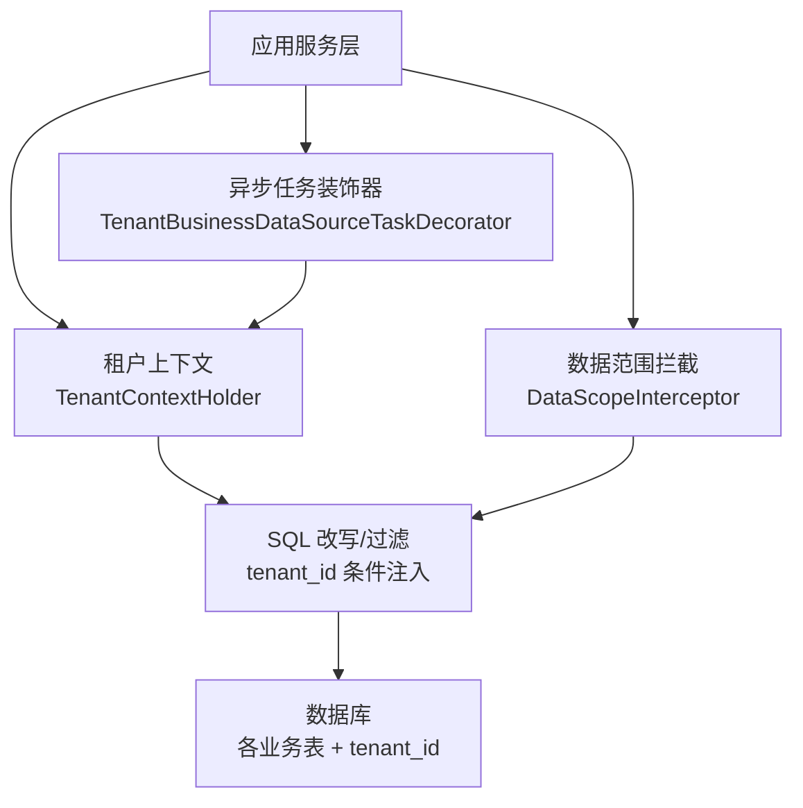
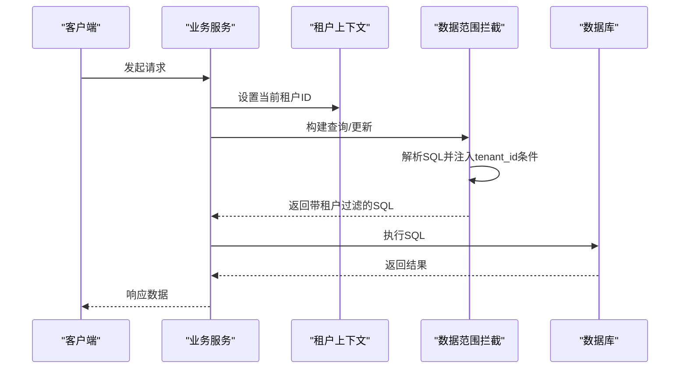
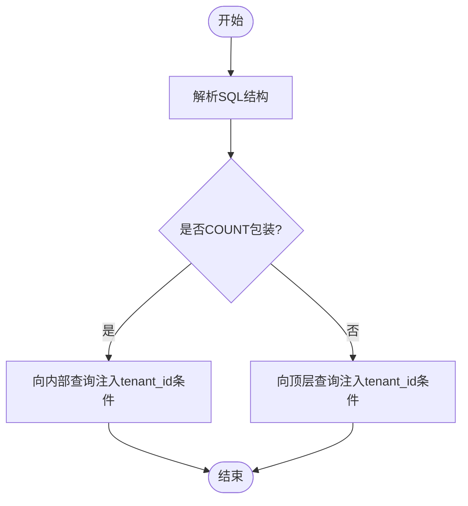
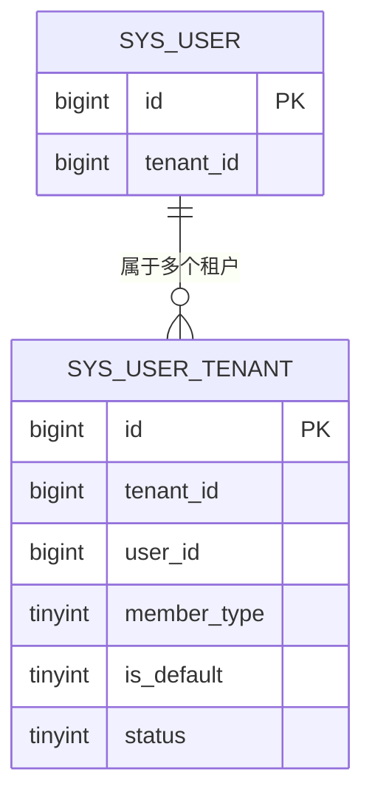
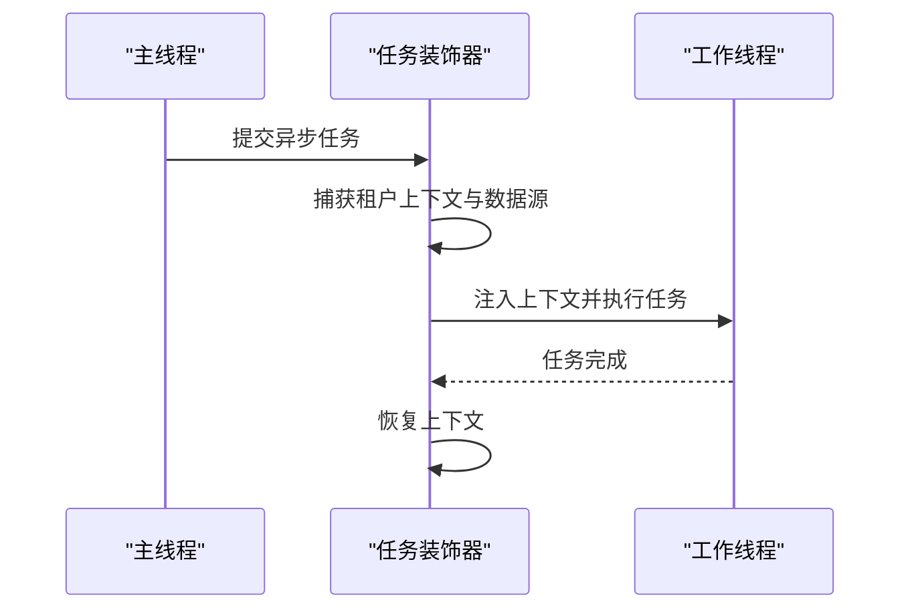
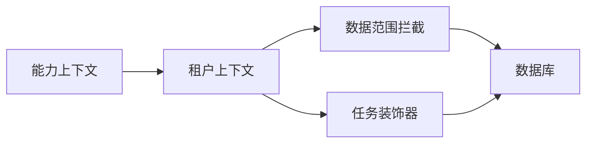

# 多租户数据隔离设计

<cite>
**本文引用的文件**
- [V1.0.55__add_user_tenant_membership.sql](file://forge-server/db/backup/V1.0.55__add_user_tenant_membership.sql)
- [V1.0.56__harden_tenant_isolation_boundaries.sql](file://forge-server/db/backup/V1.0.56__harden_tenant_isolation_boundaries.sql)
- [tenant_migration.sql](file://forge-server/forge-framework/forge-starter-parent/forge-starter-tenant/src/main/resources/sql/tenant_migration.sql)
- [TenantBusinessDataSourceTaskDecorator.java](file://forge-server/forge-framework/forge-starter-parent/forge-starter-tenant/src/main/java/com/mdframe/forge/starter/tenant/datasource/TenantBusinessDataSourceTaskDecorator.java)
- [DataScopeInterceptorTest.java](file://forge-server/forge-framework/forge-starter-parent/forge-starter-datascope/src/test/java/com/mdframe/forge/starter/datascope/handler/DataScopeInterceptorTest.java)
- [TenantInterceptorWorkspaceTest.java](file://forge-server/forge-framework/forge-starter-parent/forge-starter-tenant/src/test/java/com/mdframe/forge/starter/tenant/interceptor/TenantInterceptorWorkspaceTest.java)
- [SysTenantServiceImpl.java](file://forge-server/forge-framework/forge-plugin-parent/forge-plugin-system/src/main/java/com/mdframe/forge/plugin/system/service/impl/SysTenantServiceImpl.java)
- [CapabilityTenantContext.java](file://forge-server/forge-framework/forge-plugin-parent/forge-plugin-capability-parent/forge-plugin-capability-platform/src/main/java/com/mdframe/forge/plugin/capability/identity/security/CapabilityTenantContext.java)
</cite>

## 目录
1. [简介](#简介)
2. [项目结构](#项目结构)
3. [核心组件](#核心组件)
4. [架构总览](#架构总览)
5. [详细组件分析](#详细组件分析)
6. [依赖关系分析](#依赖关系分析)
7. [性能考虑](#性能考虑)
8. [故障排查指南](#故障排查指南)
9. [结论](#结论)
10. [附录](#附录)

## 简介
本设计文档面向 Forge Admin 的多租户数据隔离，围绕 tenant_id 字段的设计与落地、数据库层面的数据范围控制、用户与租户的关联模型、索引优化策略以及迁移方案进行系统化说明。目标是确保在多租户环境下，业务数据在查询、写入、统计等全链路中实现严格的租户隔离，同时兼顾可维护性与性能。

## 项目结构
本项目在多租户方面的关键资产包括：
- 数据库迁移脚本：用于为系统表与流程表补齐 tenant_id 字段、历史数据归并、唯一约束与索引改造。
- 租户上下文与拦截器：在请求与异步任务中注入 tenant_id，并在 SQL 层自动附加租户过滤条件。
- 数据权限拦截：通过数据范围配置将 tenant_id 注入到 SQL 的 WHERE 子句，保障跨租户访问被拒绝。
- 能力平台可信执行：在外部协议校验后，以可信租户身份安全访问租户表。

图表来源
- [TenantBusinessDataSourceTaskDecorator.java:19-61](file://forge-server/forge-framework/forge-starter-parent/forge-starter-tenant/src/main/java/com/mdframe/forge/starter/tenant/datasource/TenantBusinessDataSourceTaskDecorator.java#L19-L61)
- [DataScopeInterceptorTest.java:21-83](file://forge-server/forge-framework/forge-starter-parent/forge-starter-datascope/src/test/java/com/mdframe/forge/starter/datascope/handler/DataScopeInterceptorTest.java#L21-L83)

章节来源
- [V1.0.56__harden_tenant_isolation_boundaries.sql:1-385](file://forge-server/db/backup/V1.0.56__harden_tenant_isolation_boundaries.sql#L1-L385)
- [tenant_migration.sql:1-107](file://forge-server/forge-framework/forge-starter-parent/forge-starter-tenant/src/main/resources/sql/tenant_migration.sql#L1-L107)

## 核心组件
- 租户上下文（TenantContextHolder）：线程级存储当前租户 ID 与是否忽略租户过滤的标志，贯穿请求与异步任务。
- 数据范围拦截（DataScopeInterceptor）：根据配置将 tenant_id 条件注入到 SQL 的 WHERE 子句，支持嵌套查询与 COUNT 包装场景。
- 异步任务装饰器（TenantBusinessDataSourceTaskDecorator）：将当前租户上下文与数据源选择传递到异步线程，保证后台任务也受租户隔离约束。
- 能力平台可信执行（CapabilityTenantContext）：在外部凭据校验通过后，以可信租户身份执行租户表访问，并临时关闭数据范围以避免误过滤。
- 租户管理接口（SysTenantServiceImpl）：对租户信息进行分页查询与访问控制，非管理员仅能访问自身租户。

章节来源
- [TenantBusinessDataSourceTaskDecorator.java:19-61](file://forge-server/forge-framework/forge-starter-parent/forge-starter-tenant/src/main/java/com/mdframe/forge/starter/tenant/datasource/TenantBusinessDataSourceTaskDecorator.java#L19-L61)
- [DataScopeInterceptorTest.java:21-83](file://forge-server/forge-framework/forge-starter-parent/forge-starter-datascope/src/test/java/com/mdframe/forge/starter/datascope/handler/DataScopeInterceptorTest.java#L21-L83)
- [CapabilityTenantContext.java:17-33](file://forge-server/forge-framework/forge-plugin-parent/forge-plugin-capability-parent/forge-plugin-capability-platform/src/main/java/com/mdframe/forge/plugin/capability/identity/security/CapabilityTenantContext.java#L17-L33)
- [SysTenantServiceImpl.java:60-96](file://forge-server/forge-framework/forge-plugin-parent/forge-plugin-system/src/main/java/com/mdframe/forge/plugin/system/service/impl/SysTenantServiceImpl.java#L60-L96)

## 架构总览
下图展示了从请求进入、租户上下文注入、SQL 改写到最终落库的全链路过程，体现了“统一 tenant_id 字段 + 自动过滤”的隔离机制。

图表来源
- [DataScopeInterceptorTest.java:21-83](file://forge-server/forge-framework/forge-starter-parent/forge-starter-datascope/src/test/java/com/mdframe/forge/starter/datascope/handler/DataScopeInterceptorTest.java#L21-L83)
- [TenantBusinessDataSourceTaskDecorator.java:19-61](file://forge-server/forge-framework/forge-starter-parent/forge-starter-tenant/src/main/java/com/mdframe/forge/starter/tenant/datasource/TenantBusinessDataSourceTaskDecorator.java#L19-L61)

## 详细组件分析

### 租户标识字段设计与落地
- 设计原则
  - 所有承载租户数据的表必须包含 tenant_id 字段，作为数据隔离的最小单位。
  - 默认租户约定为 1，历史遗留的 NULL 或 0 统一归并为默认租户。
  - 对于自然键（如 model_key、business_key、category_code、template_key、form_key、process_def_key+stat_date）需改为“租户内唯一”，即联合唯一键包含 tenant_id。
- 落地方式
  - 通过迁移脚本批量为系统表与流程表添加 tenant_id 字段，并对历史数据进行归一化。
  - 对新增字段创建合适的索引，优先使用复合索引以覆盖常见查询模式。
  - 对存在全局唯一约束的表，删除旧的唯一索引并重建为租户内唯一。

章节来源
- [V1.0.56__harden_tenant_isolation_boundaries.sql:4-47](file://forge-server/db/backup/V1.0.56__harden_tenant_isolation_boundaries.sql#L4-L47)
- [V1.0.56__harden_tenant_isolation_boundaries.sql:48-385](file://forge-server/db/backup/V1.0.56__harden_tenant_isolation_boundaries.sql#L48-L385)
- [tenant_migration.sql:6-35](file://forge-server/forge-framework/forge-starter-parent/forge-starter-tenant/src/main/resources/sql/tenant_migration.sql#L6-L35)
- [tenant_migration.sql:74-97](file://forge-server/forge-framework/forge-starter-parent/forge-starter-tenant/src/main/resources/sql/tenant_migration.sql#L74-L97)

### 数据范围控制的数据库层面实现
- 自动注入 tenant_id 条件
  - 数据范围拦截器会根据配置将 tenant_id 条件注入到 SQL 的 WHERE 子句中。
  - 针对 COUNT 包裹的查询，条件会注入到内部查询，避免外层误加条件导致计数错误。
- 跨租户查询的安全限制
  - 默认开启租户过滤，任何未显式忽略的请求都会按当前租户过滤。
  - 特殊场景（如能力平台可信执行）可临时关闭数据范围，但必须在严格边界内执行并恢复上下文。
- 技术保障
  - 通过测试用例验证不同 SQL 形态下的注入正确性，确保复杂查询也能得到正确的租户过滤。

图表来源
- [DataScopeInterceptorTest.java:21-83](file://forge-server/forge-framework/forge-starter-parent/forge-starter-datascope/src/test/java/com/mdframe/forge/starter/datascope/handler/DataScopeInterceptorTest.java#L21-L83)

章节来源
- [DataScopeInterceptorTest.java:21-83](file://forge-server/forge-framework/forge-starter-parent/forge-starter-datascope/src/test/java/com/mdframe/forge/starter/datascope/handler/DataScopeInterceptorTest.java#L21-L83)
- [CapabilityTenantContext.java:17-33](file://forge-server/forge-framework/forge-plugin-parent/forge-plugin-capability-parent/forge-plugin-capability-platform/src/main/java/com/mdframe/forge/plugin/capability/identity/security/CapabilityTenantContext.java#L17-L33)

### 用户与租户的关联关系设计
- 用户-租户成员关系表（sys_user_tenant）
  - 作用：记录用户属于哪些租户、是否为默认租户、成员类型（管理员/普通成员）、状态等。
  - 关键字段：tenant_id、user_id、member_type、is_default、status。
  - 唯一约束：(tenant_id, user_id) 保证用户在每个租户只有一条成员记录。
  - 常用索引：基于 user_id 的状态与默认租户索引，便于快速查找用户的默认租户与活跃成员关系。
- 历史数据迁移
  - 将 sys_user 中的 tenant_id 归一化为默认租户。
  - 根据用户类型推断成员类型，并将缺失的成员关系补录到 sys_user_tenant。

图表来源
- [V1.0.55__add_user_tenant_membership.sql:1-42](file://forge-server/db/backup/V1.0.55__add_user_tenant_membership.sql#L1-L42)

章节来源
- [V1.0.55__add_user_tenant_membership.sql:1-42](file://forge-server/db/backup/V1.0.55__add_user_tenant_membership.sql#L1-L42)

### 异步任务中的租户上下文传递
- 任务装饰器职责
  - 捕获主线程的租户上下文与数据源选择，传递到异步任务线程。
  - 在任务完成后恢复之前的上下文，避免污染其他任务。
- 适用场景
  - 定时任务、消息消费、导出/导入等后台处理，确保同样遵循租户隔离。

图表来源
- [TenantBusinessDataSourceTaskDecorator.java:19-61](file://forge-server/forge-framework/forge-starter-parent/forge-starter-tenant/src/main/java/com/mdframe/forge/starter/tenant/datasource/TenantBusinessDataSourceTaskDecorator.java#L19-L61)

章节来源
- [TenantBusinessDataSourceTaskDecorator.java:19-61](file://forge-server/forge-framework/forge-starter-parent/forge-starter-tenant/src/main/java/com/mdframe/forge/starter/tenant/datasource/TenantBusinessDataSourceTaskDecorator.java#L19-L61)

### 能力平台的可信租户执行
- 背景
  - 外部协议完成凭据校验后，需要以可信租户身份访问租户表。
- 机制
  - 设置可信租户 ID，关闭数据范围跳过，执行动作后再恢复之前的上下文。
  - 防止外部调用误用租户上下文造成越权。

章节来源
- [CapabilityTenantContext.java:17-33](file://forge-server/forge-framework/forge-plugin-parent/forge-plugin-capability-parent/forge-plugin-capability-platform/src/main/java/com/mdframe/forge/plugin/capability/identity/security/CapabilityTenantContext.java#L17-L33)

### 租户管理服务的访问控制
- 非管理员仅能访问自身租户的数据，避免跨租户浏览。
- 获取启用状态的租户时，使用忽略租户上下文的方式读取配置，确保不受当前租户过滤影响。

章节来源
- [SysTenantServiceImpl.java:60-96](file://forge-server/forge-framework/forge-plugin-parent/forge-plugin-system/src/main/java/com/mdframe/forge/plugin/system/service/impl/SysTenantServiceImpl.java#L60-L96)

## 依赖关系分析
- 组件耦合
  - 数据范围拦截依赖租户上下文；任务装饰器依赖租户上下文与动态数据源上下文。
  - 能力平台可信执行依赖租户上下文与数据范围上下文。
- 外部依赖
  - 动态数据源（DynamicDataSourceContextHolder）用于在不同租户间切换数据源。
  - SQL 解析与改写（CCJSqlParser）用于注入租户条件。
- 潜在循环依赖
  - 当前实现通过明确的上下文与拦截器解耦，未见直接循环依赖。

图表来源
- [DataScopeInterceptorTest.java:21-83](file://forge-server/forge-framework/forge-starter-parent/forge-starter-datascope/src/test/java/com/mdframe/forge/starter/datascope/handler/DataScopeInterceptorTest.java#L21-L83)
- [TenantBusinessDataSourceTaskDecorator.java:19-61](file://forge-server/forge-framework/forge-starter-parent/forge-starter-tenant/src/main/java/com/mdframe/forge/starter/tenant/datasource/TenantBusinessDataSourceTaskDecorator.java#L19-L61)
- [CapabilityTenantContext.java:17-33](file://forge-server/forge-framework/forge-plugin-parent/forge-plugin-capability-parent/forge-plugin-capability-platform/src/main/java/com/mdframe/forge/plugin/capability/identity/security/CapabilityTenantContext.java#L17-L33)

## 性能考虑
- 索引设计原则
  - 高频查询列优先建立复合索引，例如 (tenant_id, username)、(tenant_id, parent_id)。
  - 流程类表建议为 (tenant_id, status, create_time) 建立复合索引，提升按租户与时间范围的查询效率。
  - 通知与阅读记录表建议为 (tenant_id, notice_id, org_id/user_id) 建立复合索引，加速组织维度与用户维度的读取。
- 唯一约束优化
  - 将全局唯一键调整为租户内唯一，减少跨租户冲突，提高并发写入稳定性。
- 查询优化
  - 利用数据范围拦截自动注入 tenant_id 条件，避免手写遗漏导致的跨租户扫描。
  - 对 COUNT 包装查询，确保条件注入到内部查询，避免外层误加条件影响性能与结果。

章节来源
- [tenant_migration.sql:85-97](file://forge-server/forge-framework/forge-starter-parent/forge-starter-tenant/src/main/resources/sql/tenant_migration.sql#L85-L97)
- [V1.0.56__harden_tenant_isolation_boundaries.sql:266-385](file://forge-server/db/backup/V1.0.56__harden_tenant_isolation_boundaries.sql#L266-L385)
- [DataScopeInterceptorTest.java:21-83](file://forge-server/forge-framework/forge-starter-parent/forge-starter-datascope/src/test/java/com/mdframe/forge/starter/datascope/handler/DataScopeInterceptorTest.java#L21-L83)

## 故障排查指南
- 常见问题
  - 历史数据未归属租户：检查迁移脚本是否执行成功，确认 NULL/0 已归一化为默认租户。
  - 跨租户数据泄露：核查数据范围拦截是否生效，确认 SQL 中是否注入了 tenant_id 条件。
  - 异步任务越权：确认任务装饰器是否正确传递租户上下文，避免线程切换导致上下文丢失。
  - 唯一约束冲突：检查是否已将全局唯一键改为租户内唯一，避免跨租户重复。
- 定位方法
  - 查看数据范围拦截日志与生成的 SQL，确认 tenant_id 条件注入位置。
  - 核对迁移脚本的执行顺序与回滚策略，确保索引与约束变更一致。
  - 在能力平台可信执行路径中，确认临时关闭数据范围的范围最小化与及时恢复。

章节来源
- [V1.0.56__harden_tenant_isolation_boundaries.sql:4-47](file://forge-server/db/backup/V1.0.56__harden_tenant_isolation_boundaries.sql#L4-L47)
- [DataScopeInterceptorTest.java:21-83](file://forge-server/forge-framework/forge-starter-parent/forge-starter-datascope/src/test/java/com/mdframe/forge/starter/datascope/handler/DataScopeInterceptorTest.java#L21-L83)
- [TenantBusinessDataSourceTaskDecorator.java:19-61](file://forge-server/forge-framework/forge-starter-parent/forge-starter-tenant/src/main/java/com/mdframe/forge/starter/tenant/datasource/TenantBusinessDataSourceTaskDecorator.java#L19-L61)
- [CapabilityTenantContext.java:17-33](file://forge-server/forge-framework/forge-plugin-parent/forge-plugin-capability-parent/forge-plugin-capability-platform/src/main/java/com/mdframe/forge/plugin/capability/identity/security/CapabilityTenantContext.java#L17-L33)

## 结论
Forge Admin 的多租户数据隔离以“统一 tenant_id 字段 + 自动 SQL 注入”为核心，结合用户-租户成员关系表、异步任务上下文传递与能力平台可信执行，形成端到端的隔离保障。通过合理的索引设计与唯一约束调整，既保证了安全性，又兼顾了查询性能与扩展性。建议在新增业务表时遵循统一的迁移规范与索引策略，持续完善租户隔离边界。

## 附录
- 最佳实践
  - 新建表必含 tenant_id，并在迁移脚本中声明索引与唯一约束。
  - 对自然键采用租户内唯一，避免跨租户冲突。
  - 所有查询走数据范围拦截，禁止绕过 tenant_id 条件。
  - 后台任务统一通过任务装饰器传递租户上下文。
  - 能力平台可信执行仅在必要范围内关闭数据范围，并及时恢复。
- 迁移规范
  - 先备份数据库，再执行迁移脚本。
  - 历史数据归一化至默认租户，清理重复字典数据。
  - 对流程类表补充 tenant_id 并建立复合索引。
  - 将全局唯一键调整为租户内唯一，确保业务键在租户内不冲突。