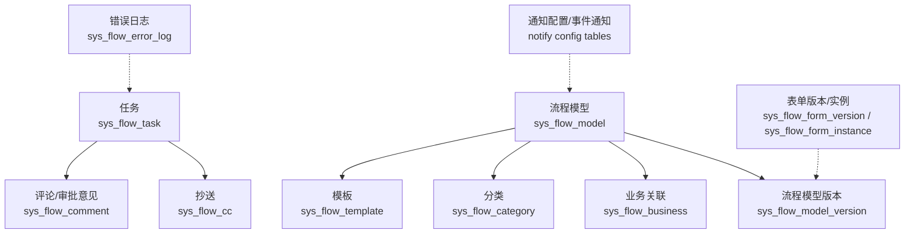
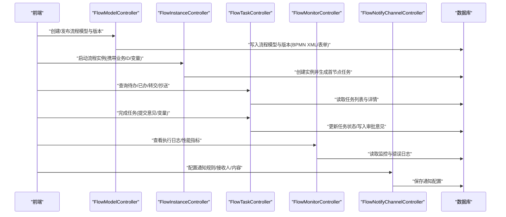
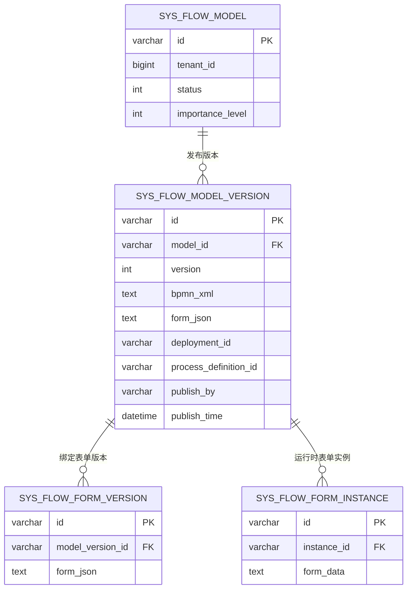
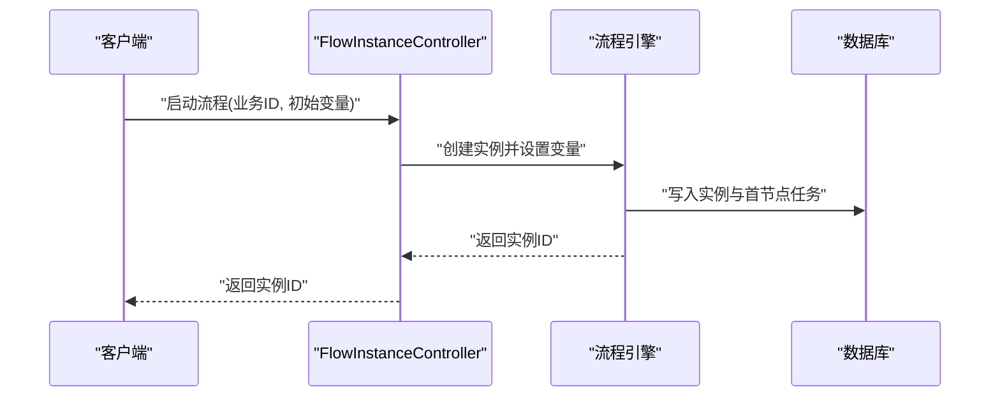
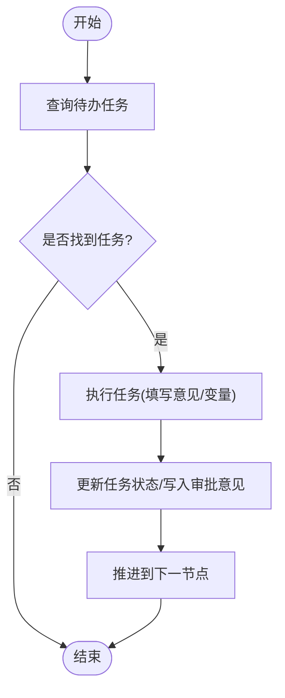
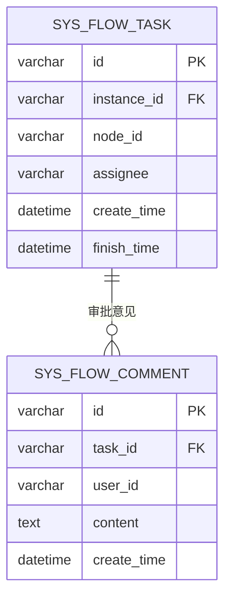
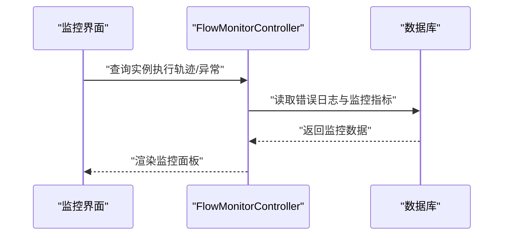
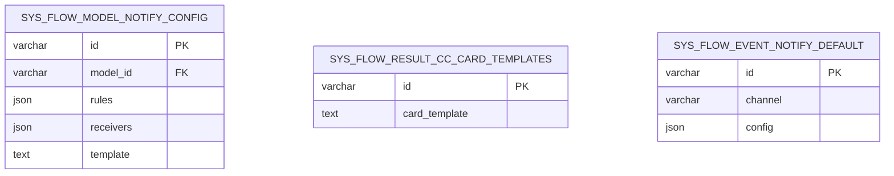
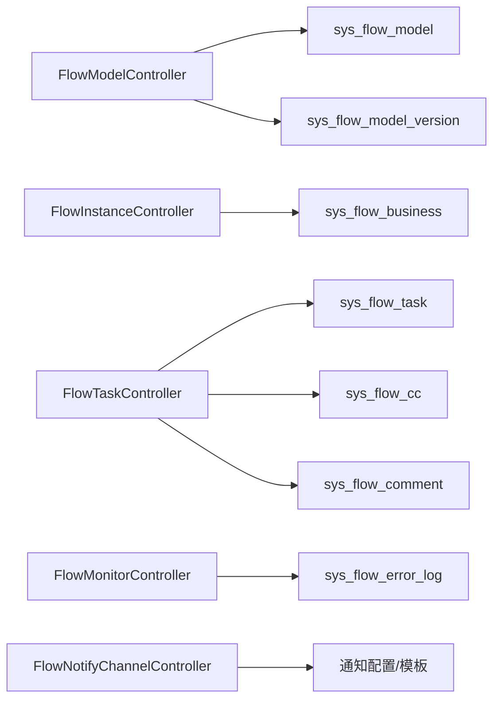

# 工作流引擎数据设计

<cite>
**本文引用的文件**
- [flow_tables.sql](file://forge-server/forge-framework/forge-plugin-parent/forge-plugin-flow/sql/flow_tables.sql)
- [flow_tables_v2.sql](file://forge-server/forge-framework/forge-plugin-parent/forge-plugin-flow/sql/flow_tables_v2.sql)
- [flow_version_init.sql](file://forge-server/forge-admin-server/src/main/resources/sql/flow_version_init.sql)
- [V1.0.57__add_flow_form_runtime_entry.sql](file://forge-server/db/backup/V1.0.57__add_flow_form_runtime_entry.sql)
- [V1.0.74__add_flow_task_overdue_reminder.sql](file://forge-server/db/backup/V1.0.74__add_flow_task_overdue_reminder.sql)
- [V1.0.100__add_flow_monitor_datascope_config.sql](file://forge-server/db/migration/V1.0.100__add_flow_monitor_datascope_config.sql)
- [V1.0.128__flow_model_notify_config.sql](file://forge-server/db/migration/V1.0.128__flow_model_notify_config.sql)
- [V1.0.129__flow_result_cc_card_templates.sql](file://forge-server/db/migration/V1.0.129__flow_result_cc_card_templates.sql)
- [V1.0.130__default_flow_event_notify_redis.sql](file://forge-server/db/migration/V1.0.130__default_flow_event_notify_redis.sql)
- [V1.0.135__optimize_flow_task_list_queries.sql](file://forge-server/db/migration/V1.0.135__optimize_flow_task_list_queries.sql)
- [V1.0.139__index_user_list_and_flow_candidate_queries.sql](file://forge-server/db/migration/V1.0.139__index_user_list_and_flow_candidate_queries.sql)
- [FlowInstanceController.java](file://forge-server/forge-flow/forge-flow-server/src/main/java/com/mdframe/forge/flow/controller/FlowInstanceController.java)
- [FlowTaskController.java](file://forge-server/forge-flow/forge-flow-server/src/main/java/com/mdframe/forge/flow/controller/FlowTaskController.java)
- [FlowMonitorController.java](file://forge-server/forge-flow/forge-flow-server/src/main/java/com/mdframe/forge/flow/controller/FlowMonitorController.java)
- [FlowModelController.java](file://forge-server/forge-flow/forge-flow-server/src/main/java/com/mdframe/forge/flow/controller/FlowModelController.java)
- [FlowNodeConfigController.java](file://forge-server/forge-flow/forge-flow-server/src/main/java/com/mdframe/forge/flow/controller/FlowNodeConfigController.java)
- [FlowNotifyChannelController.java](file://forge-server/forge-flow/forge-flow-server/src/main/java/com/mdframe/forge/flow/controller/FlowNotifyChannelController.java)
</cite>

## 目录
1. [引言](#引言)
2. [项目结构](#项目结构)
3. [核心组件](#核心组件)
4. [架构总览](#架构总览)
5. [详细组件分析](#详细组件分析)
6. [依赖关系分析](#依赖关系分析)
7. [性能考虑](#性能考虑)
8. [故障排查指南](#故障排查指南)
9. [结论](#结论)
10. [附录](#附录)

## 引言
本文件面向Forge Admin工作流引擎的数据设计，围绕流程定义、流程实例、任务调度、审批记录、流程监控与通知配置等关键域，给出数据库表结构、字段语义、索引策略与查询优化建议。文档同时结合控制器接口职责，说明数据在启动、执行、完成、监控与通知等环节的流转方式，帮助读者从“数据模型—运行时—可观测性”全链路理解工作流引擎的数据设计。

## 项目结构
工作流相关的数据定义主要位于：
- 流程基础表与扩展表：forge-plugin-flow/sql 下的 flow_tables.sql 与 flow_tables_v2.sql
- 版本管理与表单运行时：flow_version_init.sql 与 V1.0.57__add_flow_form_runtime_entry.sql
- 超时提醒与监控能力：V1.0.74__add_flow_task_overdue_reminder.sql、V1.0.100__add_flow_monitor_datascope_config.sql
- 通知与结果卡片：V1.0.128__flow_model_notify_config.sql、V1.0.129__flow_result_cc_card_templates.sql、V1.0.130__default_flow_event_notify_redis.sql
- 查询优化与索引：V1.0.135__optimize_flow_task_list_queries.sql、V1.0.139__index_user_list_and_flow_candidate_queries.sql
- 运行时控制器：FlowInstanceController、FlowTaskController、FlowMonitorController、FlowModelController、FlowNodeConfigController、FlowNotifyChannelController

图表来源
- [flow_tables.sql:7-158](file://forge-server/forge-framework/forge-plugin-parent/forge-plugin-flow/sql/flow_tables.sql#L7-L158)
- [flow_tables_v2.sql:8-195](file://forge-server/forge-framework/forge-plugin-parent/forge-plugin-flow/sql/flow_tables_v2.sql#L8-L195)
- [flow_version_init.sql:8-28](file://forge-server/forge-admin-server/src/main/resources/sql/flow_version_init.sql#L8-L28)
- [V1.0.57__add_flow_form_runtime_entry.sql:45-184](file://forge-server/db/backup/V1.0.57__add_flow_form_runtime_entry.sql#L45-L184)

章节来源
- [flow_tables.sql:7-158](file://forge-server/forge-framework/forge-plugin-parent/forge-plugin-flow/sql/flow_tables.sql#L7-L158)
- [flow_tables_v2.sql:8-195](file://forge-server/forge-framework/forge-plugin-parent/forge-plugin-flow/sql/flow_tables_v2.sql#L8-L195)
- [flow_version_init.sql:8-28](file://forge-server/forge-admin-server/src/main/resources/sql/flow_version_init.sql#L8-L28)
- [V1.0.57__add_flow_form_runtime_entry.sql:45-184](file://forge-server/db/backup/V1.0.57__add_flow_form_runtime_entry.sql#L45-L184)

## 核心组件
- 流程定义与版本管理
  - 流程模型：用于承载BPMN流程定义元信息、状态、重要性等级等
  - 版本历史：存储BPMN XML、表单配置、发布人、发布时间、部署ID、流程定义ID等
- 流程实例与变量
  - 通过流程实例表（由引擎维护）与业务关联表建立关系；表单版本/实例用于持久化表单数据
- 任务调度
  - 待办/已办/转交/抄送：通过任务表及抄送表表达任务分配、处理与协作
- 审批记录
  - 评论/审批意见表记录审批人、时间、意见等
- 监控与异常
  - 错误日志表记录执行异常；监控数据范围配置支持权限隔离
- 通知配置
  - 通知渠道、事件通知默认配置、结果卡片模板等

章节来源
- [flow_tables.sql:7-158](file://forge-server/forge-framework/forge-plugin-parent/forge-plugin-flow/sql/flow_tables.sql#L7-L158)
- [flow_tables_v2.sql:8-195](file://forge-server/forge-framework/forge-plugin-parent/forge-plugin-flow/sql/flow_tables_v2.sql#L8-L195)
- [flow_version_init.sql:8-28](file://forge-server/forge-admin-server/src/main/resources/sql/flow_version_init.sql#L8-L28)
- [V1.0.57__add_flow_form_runtime_entry.sql:45-184](file://forge-server/db/backup/V1.0.57__add_flow_form_runtime_entry.sql#L45-L184)
- [V1.0.100__add_flow_monitor_datascope_config.sql](file://forge-server/db/migration/V1.0.100__add_flow_monitor_datascope_config.sql)
- [V1.0.128__flow_model_notify_config.sql](file://forge-server/db/migration/V1.0.128__flow_model_notify_config.sql)
- [V1.0.129__flow_result_cc_card_templates.sql](file://forge-server/db/migration/V1.0.129__flow_result_cc_card_templates.sql)
- [V1.0.130__default_flow_event_notify_redis.sql](file://forge-server/db/migration/V1.0.130__default_flow_event_notify_redis.sql)

## 架构总览
下图展示工作流引擎在“定义—实例—任务—监控—通知”的数据与调用关系，以及各控制器的职责边界。

图表来源
- [FlowModelController.java](file://forge-server/forge-flow/forge-flow-server/src/main/java/com/mdframe/forge/flow/controller/FlowModelController.java)
- [FlowInstanceController.java](file://forge-server/forge-flow/forge-flow-server/src/main/java/com/mdframe/forge/flow/controller/FlowInstanceController.java)
- [FlowTaskController.java](file://forge-server/forge-flow/forge-flow-server/src/main/java/com/mdframe/forge/flow/controller/FlowTaskController.java)
- [FlowMonitorController.java](file://forge-server/forge-flow/forge-flow-server/src/main/java/com/mdframe/forge/flow/controller/FlowMonitorController.java)
- [FlowNotifyChannelController.java](file://forge-server/forge-flow/forge-flow-server/src/main/java/com/mdframe/forge/flow/controller/FlowNotifyChannelController.java)

## 详细组件分析

### 流程定义与版本数据模型
- 流程模型表（sys_flow_model）
  - 作用：存储流程定义的基础信息与状态、重要性等级等
  - 关键字段：主键、租户、状态、重要性等级、版本关联等
- 流程模型版本表（sys_flow_model_version）
  - 作用：持久化每次发布的BPMN XML、表单配置、发布人、发布时间、部署ID、流程定义ID
  - 索引：按模型ID与版本号唯一，便于回滚与对比
- 表单版本与实例
  - 表单版本（sys_flow_form_version）：绑定到流程版本，存储表单JSON
  - 表单实例（sys_flow_form_instance）：流程运行时的表单数据快照

图表来源
- [flow_tables.sql:7-31](file://forge-server/forge-framework/forge-plugin-parent/forge-plugin-flow/sql/flow_tables.sql#L7-L31)
- [flow_version_init.sql:8-28](file://forge-server/forge-admin-server/src/main/resources/sql/flow_version_init.sql#L8-L28)
- [V1.0.57__add_flow_form_runtime_entry.sql:45-184](file://forge-server/db/backup/V1.0.57__add_flow_form_runtime_entry.sql#L45-L184)

章节来源
- [flow_tables.sql:7-31](file://forge-server/forge-framework/forge-plugin-parent/forge-plugin-flow/sql/flow_tables.sql#L7-L31)
- [flow_version_init.sql:8-28](file://forge-server/forge-admin-server/src/main/resources/sql/flow_version_init.sql#L8-L28)
- [V1.0.57__add_flow_form_runtime_entry.sql:45-184](file://forge-server/db/backup/V1.0.57__add_flow_form_runtime_entry.sql#L45-L184)

### 流程实例与变量持久化
- 流程实例：由引擎侧表管理生命周期与当前活动节点；业务侧通过业务关联表（sys_flow_business）将实例与业务对象绑定
- 变量传递：通过表单实例或引擎变量表（由引擎维护）进行持久化；表单实例表提供结构化数据快照
- 启动流程：通过实例控制器发起，传入业务标识与初始变量，引擎创建实例并生成首个任务

图表来源
- [FlowInstanceController.java](file://forge-server/forge-flow/forge-flow-server/src/main/java/com/mdframe/forge/flow/controller/FlowInstanceController.java)
- [flow_tables.sql:32-56](file://forge-server/forge-framework/forge-plugin-parent/forge-plugin-flow/sql/flow_tables.sql#L32-L56)
- [V1.0.57__add_flow_form_runtime_entry.sql:123-160](file://forge-server/db/backup/V1.0.57__add_flow_form_runtime_entry.sql#L123-L160)

章节来源
- [flow_tables.sql:32-56](file://forge-server/forge-framework/forge-plugin-parent/forge-plugin-flow/sql/flow_tables.sql#L32-L56)
- [V1.0.57__add_flow_form_runtime_entry.sql:123-160](file://forge-server/db/backup/V1.0.57__add_flow_form_runtime_entry.sql#L123-L160)
- [FlowInstanceController.java](file://forge-server/forge-flow/forge-flow-server/src/main/java/com/mdframe/forge/flow/controller/FlowInstanceController.java)

### 任务调度数据模型（待办/已办/分配/转交）
- 任务表（sys_flow_task）
  - 作用：记录任务节点、状态、候选人/办理人、创建/完成时间、所属实例等
- 抄送表（sys_flow_cc）
  - 作用：记录任务的抄送关系，便于协同与审计
- 任务操作
  - 查询待办/已办：通过任务控制器提供分页与过滤
  - 完成任务：提交意见、变量更新、状态推进

图表来源
- [flow_tables.sql:57-94](file://forge-server/forge-framework/forge-plugin-parent/forge-plugin-flow/sql/flow_tables.sql#L57-L94)
- [flow_tables.sql:95-114](file://forge-server/forge-framework/forge-plugin-parent/forge-plugin-flow/sql/flow_tables.sql#L95-L114)
- [FlowTaskController.java](file://forge-server/forge-flow/forge-flow-server/src/main/java/com/mdframe/forge/flow/controller/FlowTaskController.java)

章节来源
- [flow_tables.sql:57-114](file://forge-server/forge-framework/forge-plugin-parent/forge-plugin-flow/sql/flow_tables.sql#L57-L114)
- [FlowTaskController.java](file://forge-server/forge-flow/forge-flow-server/src/main/java/com/mdframe/forge/flow/controller/FlowTaskController.java)

### 审批记录数据存储
- 评论/审批意见表（sys_flow_comment）
  - 作用：记录审批人、时间、意见内容、关联任务/实例等
- 超时提醒记录（可选）
  - 作用：记录任务超时提醒，辅助SLA监控

图表来源
- [flow_tables.sql:57-94](file://forge-server/forge-framework/forge-plugin-parent/forge-plugin-flow/sql/flow_tables.sql#L57-L94)
- [flow_tables.sql:115-132](file://forge-server/forge-framework/forge-plugin-parent/forge-plugin-flow/sql/flow_tables.sql#L115-L132)
- [V1.0.74__add_flow_task_overdue_reminder.sql](file://forge-server/db/backup/V1.0.74__add_flow_task_overdue_reminder.sql)

章节来源
- [flow_tables.sql:115-132](file://forge-server/forge-framework/forge-plugin-parent/forge-plugin-flow/sql/flow_tables.sql#L115-L132)
- [V1.0.74__add_flow_task_overdue_reminder.sql](file://forge-server/db/backup/V1.0.74__add_flow_task_overdue_reminder.sql)

### 流程监控数据设计
- 错误日志表（sys_flow_error_log）
  - 作用：记录流程执行过程中的异常堆栈、上下文、时间戳等
- 监控数据范围配置
  - 作用：为监控视图提供数据范围控制，确保多租户/部门隔离
- 监控查询
  - 通过监控控制器提供执行轨迹、性能指标与异常聚合

图表来源
- [flow_tables_v2.sql:151-181](file://forge-server/forge-framework/forge-plugin-parent/forge-plugin-flow/sql/flow_tables_v2.sql#L151-L181)
- [V1.0.100__add_flow_monitor_datascope_config.sql](file://forge-server/db/migration/V1.0.100__add_flow_monitor_datascope_config.sql)
- [FlowMonitorController.java](file://forge-server/forge-flow/forge-flow-server/src/main/java/com/mdframe/forge/flow/controller/FlowMonitorController.java)

章节来源
- [flow_tables_v2.sql:151-181](file://forge-server/forge-framework/forge-plugin-parent/forge-plugin-flow/sql/flow_tables_v2.sql#L151-L181)
- [V1.0.100__add_flow_monitor_datascope_config.sql](file://forge-server/db/migration/V1.0.100__add_flow_monitor_datascope_config.sql)
- [FlowMonitorController.java](file://forge-server/forge-flow/forge-flow-server/src/main/java/com/mdframe/forge/flow/controller/FlowMonitorController.java)

### 流程通知配置数据结构
- 通知配置表（模型级通知）
  - 作用：配置通知规则、接收人、通知内容与触发时机
- 结果卡片模板
  - 作用：定义流程结果消息的卡片样式与内容模板
- 默认事件通知（Redis）
  - 作用：为流程事件通知提供默认通道配置，提升可扩展性

图表来源
- [V1.0.128__flow_model_notify_config.sql](file://forge-server/db/migration/V1.0.128__flow_model_notify_config.sql)
- [V1.0.129__flow_result_cc_card_templates.sql](file://forge-server/db/migration/V1.0.129__flow_result_cc_card_templates.sql)
- [V1.0.130__default_flow_event_notify_redis.sql](file://forge-server/db/migration/V1.0.130__default_flow_event_notify_redis.sql)
- [FlowNotifyChannelController.java](file://forge-server/forge-flow/forge-flow-server/src/main/java/com/mdframe/forge/flow/controller/FlowNotifyChannelController.java)

章节来源
- [V1.0.128__flow_model_notify_config.sql](file://forge-server/db/migration/V1.0.128__flow_model_notify_config.sql)
- [V1.0.129__flow_result_cc_card_templates.sql](file://forge-server/db/migration/V1.0.129__flow_result_cc_card_templates.sql)
- [V1.0.130__default_flow_event_notify_redis.sql](file://forge-server/db/migration/V1.0.130__default_flow_event_notify_redis.sql)
- [FlowNotifyChannelController.java](file://forge-server/forge-flow/forge-flow-server/src/main/java/com/mdframe/forge/flow/controller/FlowNotifyChannelController.java)

## 依赖关系分析
- 控制器与数据表的耦合
  - FlowModelController 依赖流程模型与版本表
  - FlowInstanceController 依赖实例与业务关联表
  - FlowTaskController 依赖任务、抄送与评论表
  - FlowMonitorController 依赖错误日志与监控配置
  - FlowNotifyChannelController 依赖通知配置与模板表
- 迁移脚本对表结构的演进
  - 新增表单运行时、通知配置、监控数据范围、查询优化等

图表来源
- [FlowModelController.java](file://forge-server/forge-flow/forge-flow-server/src/main/java/com/mdframe/forge/flow/controller/FlowModelController.java)
- [FlowInstanceController.java](file://forge-server/forge-flow/forge-flow-server/src/main/java/com/mdframe/forge/flow/controller/FlowInstanceController.java)
- [FlowTaskController.java](file://forge-server/forge-flow/forge-flow-server/src/main/java/com/mdframe/forge/flow/controller/FlowTaskController.java)
- [FlowMonitorController.java](file://forge-server/forge-flow/forge-flow-server/src/main/java/com/mdframe/forge/flow/controller/FlowMonitorController.java)
- [FlowNotifyChannelController.java](file://forge-server/forge-flow/forge-flow-server/src/main/java/com/mdframe/forge/flow/controller/FlowNotifyChannelController.java)
- [flow_tables.sql:7-158](file://forge-server/forge-framework/forge-plugin-parent/forge-plugin-flow/sql/flow_tables.sql#L7-L158)
- [flow_tables_v2.sql:8-195](file://forge-server/forge-framework/forge-plugin-parent/forge-plugin-flow/sql/flow_tables_v2.sql#L8-L195)

章节来源
- [flow_tables.sql:7-158](file://forge-server/forge-framework/forge-plugin-parent/forge-plugin-flow/sql/flow_tables.sql#L7-L158)
- [flow_tables_v2.sql:8-195](file://forge-server/forge-framework/forge-plugin-parent/forge-plugin-flow/sql/flow_tables_v2.sql#L8-L195)

## 性能考虑
- 任务列表查询优化
  - 通过专用迁移脚本优化任务列表查询，减少扫描与排序开销
- 用户列表与候选查询索引
  - 为用户列表与流程候选人查询添加索引，提升筛选与分配效率
- 监控数据范围
  - 通过监控数据范围配置实现高效的数据隔离与过滤

章节来源
- [V1.0.135__optimize_flow_task_list_queries.sql](file://forge-server/db/migration/V1.0.135__optimize_flow_task_list_queries.sql)
- [V1.0.139__index_user_list_and_flow_candidate_queries.sql](file://forge-server/db/migration/V1.0.139__index_user_list_and_flow_candidate_queries.sql)
- [V1.0.100__add_flow_monitor_datascope_config.sql](file://forge-server/db/migration/V1.0.100__add_flow_monitor_datascope_config.sql)

## 故障排查指南
- 常见异常定位
  - 查看错误日志表以获取异常堆栈、上下文与时间戳
  - 结合监控控制器提供的执行轨迹与性能指标定位瓶颈
- 超时与提醒
  - 检查任务超时提醒记录，确认是否触发提醒与后续处理
- 通知问题
  - 核对通知配置与默认事件通知通道，确认接收人与模板是否正确

章节来源
- [flow_tables_v2.sql:151-181](file://forge-server/forge-framework/forge-plugin-parent/forge-plugin-flow/sql/flow_tables_v2.sql#L151-L181)
- [V1.0.74__add_flow_task_overdue_reminder.sql](file://forge-server/db/backup/V1.0.74__add_flow_task_overdue_reminder.sql)
- [V1.0.128__flow_model_notify_config.sql](file://forge-server/db/migration/V1.0.128__flow_model_notify_config.sql)
- [V1.0.130__default_flow_event_notify_redis.sql](file://forge-server/db/migration/V1.0.130__default_flow_event_notify_redis.sql)

## 结论
本数据设计围绕流程定义、实例、任务、审批、监控与通知六大域，提供了完整的表结构与演进路径。通过版本化管理BPMN与表单、完善任务与抄送关系、强化监控与通知能力，并结合查询优化与索引策略，确保了工作流引擎在高并发与复杂场景下的稳定性与可观测性。建议在实施中严格遵循迁移脚本顺序，并在生产环境启用监控与告警，持续优化关键查询路径。

## 附录
- 关键表清单与用途
  - 流程模型与版本：sys_flow_model、sys_flow_model_version
  - 业务关联与表单：sys_flow_business、sys_flow_form_version、sys_flow_form_instance
  - 任务与协作：sys_flow_task、sys_flow_cc、sys_flow_comment
  - 监控与异常：sys_flow_error_log、监控数据范围配置
  - 通知与模板：通知配置表、结果卡片模板、默认事件通知配置
- 索引与优化建议
  - 任务列表查询优化、用户列表与候选人查询索引
  - 监控数据范围配置以提升过滤效率

章节来源
- [flow_tables.sql:7-158](file://forge-server/forge-framework/forge-plugin-parent/forge-plugin-flow/sql/flow_tables.sql#L7-L158)
- [flow_tables_v2.sql:8-195](file://forge-server/forge-framework/forge-plugin-parent/forge-plugin-flow/sql/flow_tables_v2.sql#L8-L195)
- [flow_version_init.sql:8-28](file://forge-server/forge-admin-server/src/main/resources/sql/flow_version_init.sql#L8-L28)
- [V1.0.57__add_flow_form_runtime_entry.sql:45-184](file://forge-server/db/backup/V1.0.57__add_flow_form_runtime_entry.sql#L45-L184)
- [V1.0.100__add_flow_monitor_datascope_config.sql](file://forge-server/db/migration/V1.0.100__add_flow_monitor_datascope_config.sql)
- [V1.0.128__flow_model_notify_config.sql](file://forge-server/db/migration/V1.0.128__flow_model_notify_config.sql)
- [V1.0.129__flow_result_cc_card_templates.sql](file://forge-server/db/migration/V1.0.129__flow_result_cc_card_templates.sql)
- [V1.0.130__default_flow_event_notify_redis.sql](file://forge-server/db/migration/V1.0.130__default_flow_event_notify_redis.sql)
- [V1.0.135__optimize_flow_task_list_queries.sql](file://forge-server/db/migration/V1.0.135__optimize_flow_task_list_queries.sql)
- [V1.0.139__index_user_list_and_flow_candidate_queries.sql](file://forge-server/db/migration/V1.0.139__index_user_list_and_flow_candidate_queries.sql)