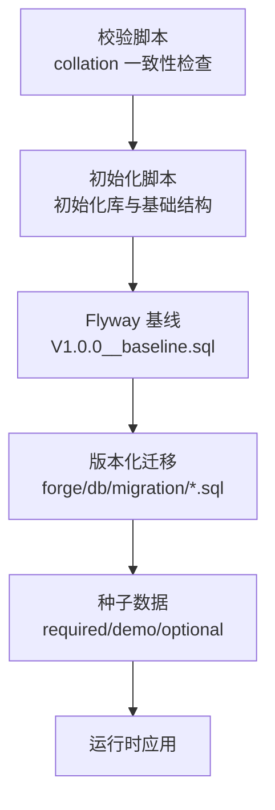
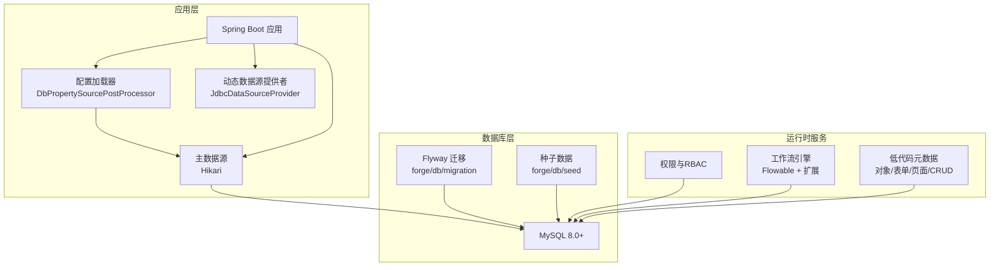
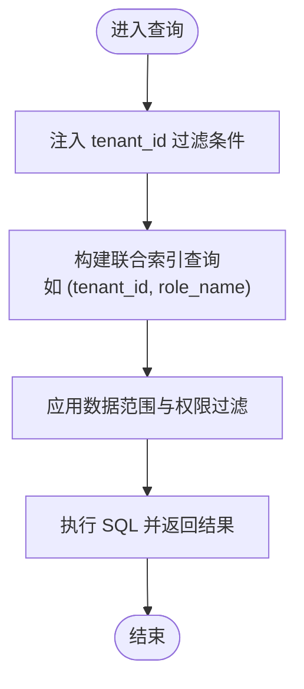
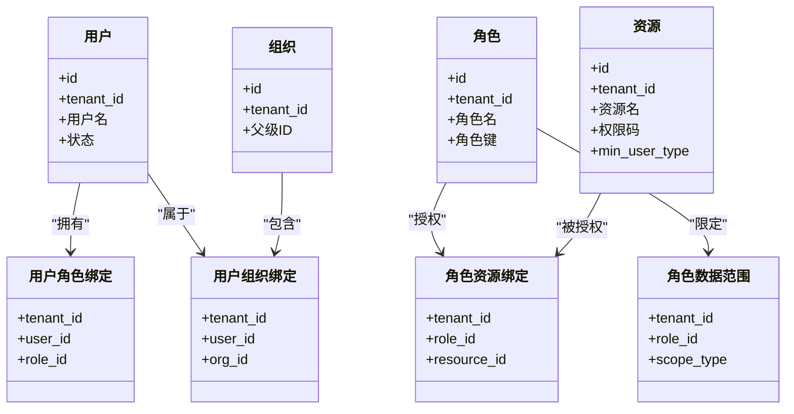
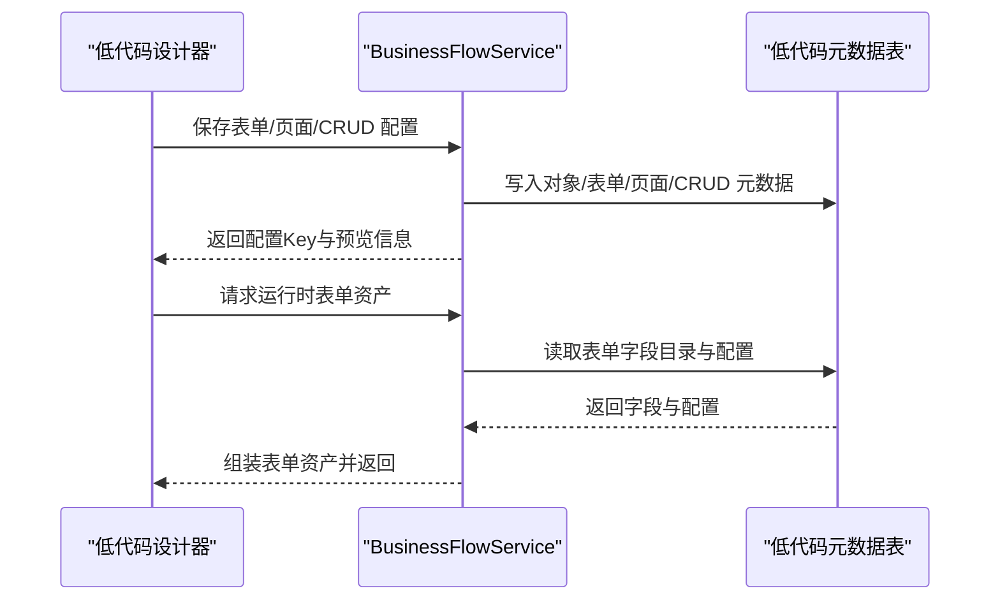
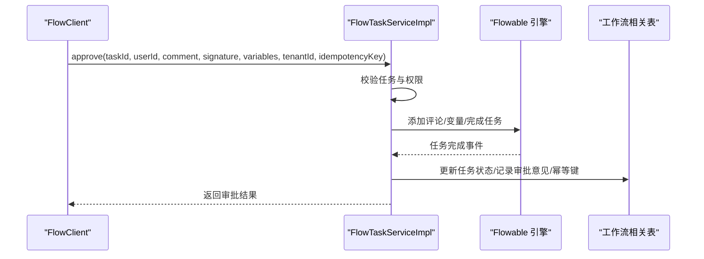
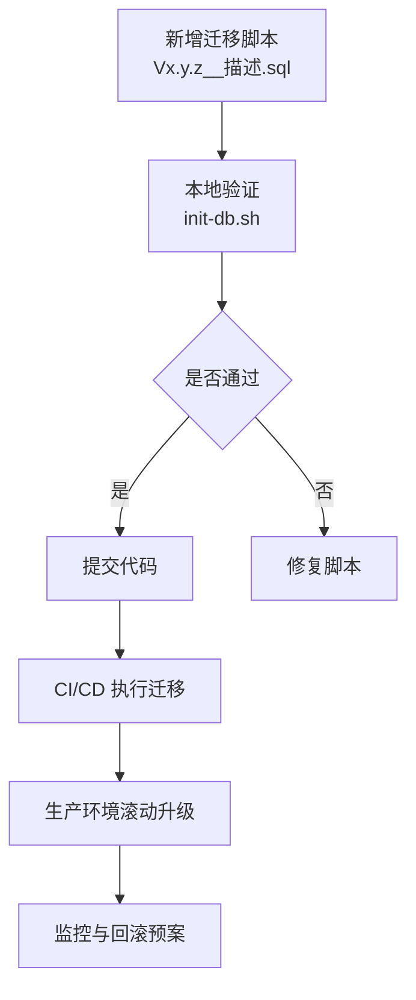
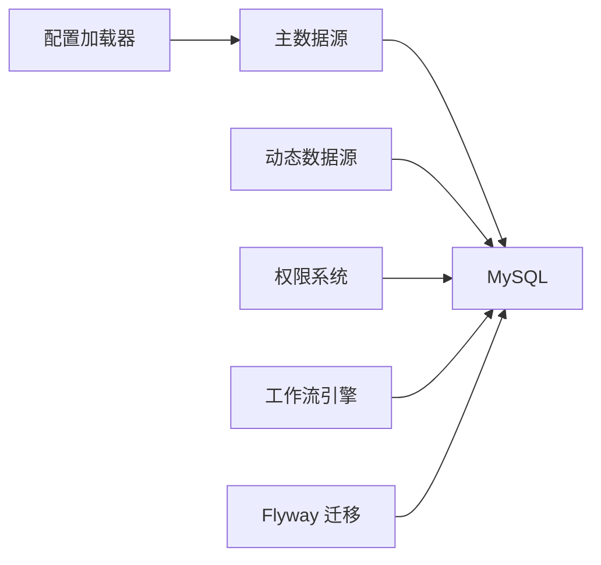

# 数据库架构设计

<cite>
**本文引用的文件**
- [forge-server/db/README.md](file://forge-server/db/README.md)
- [application-dev.example.yml](file://forge-server/forge-admin-server/src/main/resources/application-dev.example.yml)
- [DbPropertySourcePostProcessor.java](file://forge-server/forge-framework/forge-starter-parent/forge-starter-config/src/main/java/com/mdframe/forge/starter/property/DbPropertySourcePostProcessor.java)
- [ConfigDbProperties.java](file://forge-server/forge-framework/forge-starter-parent/forge-starter-config/src/main/java/com/mdframe/forge/starter/property/ConfigDbProperties.java)
- [JdbcDataSourceProvider.java](file://forge-server/forge-framework/forge-plugin-parent/forge-plugin-data/src/main/java/com/mdframe/forge/plugin/data/support/JdbcDataSourceProvider.java)
- [DataConnectionServiceImpl.java](file://forge-server/forge-framework/forge-plugin-parent/forge-plugin-data/src/main/java/com/mdframe/forge/plugin/data/service/impl/DataConnectionServiceImpl.java)
- [check-collation-consistency.sh](file://forge-server/scripts/db/check-collation-consistency.sh)
- [V1.0.6__add_logic_delete_to_tenant_table.sql](file://forge-server/db/migration/V1.0.6__add_logic_delete_to_tenant_table.sql)
- [V1.0.8__add_logic_delete_to_resource_table.sql](file://forge-server/db/migration/V1.0.8__add_logic_delete_to_resource_table.sql)
- [tenant_migration.sql](file://forge-server/forge-framework/forge-starter-parent/forge-starter-tenant/src/main/resources/sql/tenant_migration.sql)
- [V1.0.56__harden_tenant_isolation_boundaries.sql](file://forge-server/db/backup/V1.0.56__harden_tenant_isolation_boundaries.sql)
- [V1.0.65__harden_user_type_permission_boundaries.sql](file://forge-server/db/backup/V1.0.65__harden_user_type_permission_boundaries.sql)
- [V1.0.26__add_capability_high_risk_approval.sql](file://forge-server/db/migration/V1.0.26__add_capability_high_risk_approval.sql)
- [V1.0.85__add_business_process_start_permission.sql](file://forge-server/db/migration/V1.0.85__add_business_process_start_permission.sql)
- [FlowClient.java](file://forge-server/forge-flow/forge-flow-client/src/main/java/com/mdframe/forge/flow/client/FlowClient.java)
- [FlowTaskServiceImpl.java](file://forge-server/forge-framework/forge-plugin-parent/forge-plugin-flow/src/main/java/com/mdframe/forge/starter/flow/service/impl/FlowTaskServiceImpl.java)
- [BusinessFlowService.java](file://forge-server/forge-framework/forge-plugin-parent/forge-plugin-generator/src/main/java/com/mdframe/forge/plugin/generator/service/businessapp/BusinessFlowService.java)
- [sql-seeds.md](file://.agents/skills/forge-codegen-crud/references/sql-seeds.md)
- [sql-templates.md](file://.agents/skills/forge-business-flow-development/references/sql-templates.md)
- [flyway-ai-coding.md](file://docs/blogs/flyway-ai-coding.md)
</cite>

## 目录
1. [引言](#引言)
2. [项目结构](#项目结构)
3. [核心组件](#核心组件)
4. [架构总览](#架构总览)
5. [详细组件分析](#详细组件分析)
6. [依赖关系分析](#依赖关系分析)
7. [性能考虑](#性能考虑)
8. [故障排查指南](#故障排查指南)
9. [结论](#结论)
10. [附录](#附录)

## 引言
本文件为 Forge Admin 的完整数据库架构设计文档，聚焦 MySQL 8.0+ 选型与特性、多租户数据隔离、RBAC 权限模型、低代码平台元数据存储、工作流引擎存储以及数据迁移与运维保障策略。内容基于仓库中的初始化脚本、Flyway 版本化迁移、配置加载机制、动态数据源与连接管理、权限与工作流相关表结构的演进记录进行归纳与说明，帮助读者在不深入源码的情况下理解整体数据库设计与落地实践。

## 项目结构
Forge Admin 将数据库相关的资产集中在 forge-server/db 目录下，采用“基线 + 版本化迁移 + 种子数据”的组织方式：
- 基线：V1.0.0__baseline.sql 作为 Flyway 基线，历史结构由初始化脚本提供。
- 迁移：forge/db/migration 下按版本号递增的 SQL 变更脚本，覆盖系统、权限、租户、低代码、工作流等能力。
- 种子：forge/db/seed 分为 required（必需）、demo（演示）、optional（可选）三类，配合初始化脚本按需导入。
- 社区导出：forge/db/community-export 用于社区版同步产物，包含 schema 与 seed 摘要。
- 初始化与校验：forge/scripts/db/init-db.sh 负责创建库、执行初始化脚本、迁移与种子；check-collation-consistency.sh 校验字符集与排序规则一致性。

**图表来源**
- [V1.0.0__baseline.sql:1-4](file://forge-server/db/migration/V1.0.0__baseline.sql#L1-L4)
- [forge-server/db/README.md:45-77](file://forge-server/db/README.md#L45-L77)
- [forge-server/scripts/db/check-collation-consistency.sh:37-67](file://forge-server/scripts/db/check-collation-consistency.sh#L37-L67)

**章节来源**
- [forge-server/db/README.md:1-165](file://forge-server/db/README.md#L1-L165)
- [forge-server/db/migration/V1.0.0__baseline.sql:1-4](file://forge-server/db/migration/V1.0.0__baseline.sql#L1-L4)

## 核心组件
- 数据库连接与配置加载：通过 Spring Boot 配置与自定义 EnvironmentPostProcessor 从数据库读取配置，形成运行时属性源，优先级高于默认配置。
- 动态数据源与连接管理：支持业务侧动态注册数据连接，使用 Hikari 连接池，密码加密存储，连接池参数可配。
- 多租户隔离：系统表普遍包含 tenant_id 字段，并通过唯一索引与联合索引强化隔离；迁移脚本对历史数据进行归一化处理。
- RBAC 权限模型：资源、角色、用户、组织、岗位等多表关联，结合最小用户类型与模块数据范围控制访问边界。
- 低代码元数据：业务对象、表单、页面、CRUD 配置以 JSON 或结构化字段存储在相应表中，支持运行时装配与发布。
- 工作流引擎：流程定义、实例、任务、审批记录等由 Flowable 与自研扩展共同维护，任务操作具备幂等与审计能力。
- 数据迁移与运维：Flyway 版本化管理，不可变变更记录；提供社区导出与敏感数据扫描工具；推荐日常迁移工作流。

**章节来源**
- [DbPropertySourcePostProcessor.java:15-46](file://forge-server/forge-framework/forge-starter-parent/forge-starter-config/src/main/java/com/mdframe/forge/starter/property/DbPropertySourcePostProcessor.java#L15-L46)
- [ConfigDbProperties.java:1-45](file://forge-server/forge-framework/forge-starter-parent/forge-starter-config/src/main/java/com/mdframe/forge/starter/property/ConfigDbProperties.java#L1-L45)
- [JdbcDataSourceProvider.java:21-69](file://forge-server/forge-framework/forge-plugin-parent/forge-plugin-data/src/main/java/com/mdframe/forge/plugin/data/support/JdbcDataSourceProvider.java#L21-L69)
- [DataConnectionServiceImpl.java:63-92](file://forge-server/forge-framework/forge-plugin-parent/forge-plugin-data/src/main/java/com/mdframe/forge/plugin/data/service/impl/DataConnectionServiceImpl.java#L63-L92)
- [V1.0.56__harden_tenant_isolation_boundaries.sql:1-23](file://forge-server/db/backup/V1.0.56__harden_tenant_isolation_boundaries.sql#L1-L23)
- [V1.0.65__harden_user_type_permission_boundaries.sql:1-38](file://forge-server/db/backup/V1.0.65__harden_user_type_permission_boundaries.sql#L1-L38)
- [BusinessFlowService.java:591-619](file://forge-server/forge-framework/forge-plugin-parent/forge-plugin-generator/src/main/java/com/mdframe/forge/plugin/generator/service/businessapp/BusinessFlowService.java#L591-L619)
- [FlowTaskServiceImpl.java:271-331](file://forge-server/forge-framework/forge-plugin-parent/forge-plugin-flow/src/main/java/com/mdframe/forge/starter/flow/service/impl/FlowTaskServiceImpl.java#L271-L331)
- [forge-server/db/README.md:129-165](file://forge-server/db/README.md#L129-L165)

## 架构总览
下图展示 Forge Admin 在数据库层面的总体架构：应用启动时通过配置加载器从数据库获取配置，运行期通过主数据源访问系统表与业务表；动态数据源为外部数据集提供连接；Flyway 在启动时按版本执行迁移；工作流引擎与权限系统在运行时协同完成任务与访问控制。

**图表来源**
- [DbPropertySourcePostProcessor.java:15-46](file://forge-server/forge-framework/forge-starter-parent/forge-starter-config/src/main/java/com/mdframe/forge/starter/property/DbPropertySourcePostProcessor.java#L15-L46)
- [JdbcDataSourceProvider.java:21-69](file://forge-server/forge-framework/forge-plugin-parent/forge-plugin-data/src/main/java/com/mdframe/forge/plugin/data/support/JdbcDataSourceProvider.java#L21-L69)
- [application-dev.example.yml:1-34](file://forge-server/forge-admin-server/src/main/resources/application-dev.example.yml#L1-L34)
- [forge-server/db/README.md:129-165](file://forge-server/db/README.md#L129-L165)

## 详细组件分析

### 多租户数据隔离方案
- 租户标识：系统表普遍包含 tenant_id 字段，默认租户为 1；迁移脚本对历史数据中 NULL 或 0 的值进行归一化为 1，确保统一隔离边界。
- 索引优化：为关键表添加联合索引，如角色表的 (tenant_id, role_name)、组织表的 (tenant_id, parent_id)，提升跨租户查询效率。
- 逻辑删除与活跃标记：通过 logic_delete_active 等字段与唯一索引组合，避免同一租户内重复键冲突并支持软删除。
- 数据范围控制：结合角色数据范围与组织维度，限制查询结果集范围；资源表增加 min_user_type 控制最低可访问用户类型。

**图表来源**
- [tenant_migration.sql:93-106](file://forge-server/forge-framework/forge-starter-parent/forge-starter-tenant/src/main/resources/sql/tenant_migration.sql#L93-L106)
- [V1.0.56__harden_tenant_isolation_boundaries.sql:1-23](file://forge-server/db/backup/V1.0.56__harden_tenant_isolation_boundaries.sql#L1-L23)
- [V1.0.6__add_logic_delete_to_tenant_table.sql:22-33](file://forge-server/db/migration/V1.0.6__add_logic_delete_to_tenant_table.sql#L22-L33)
- [V1.0.8__add_logic_delete_to_resource_table.sql:22-33](file://forge-server/db/migration/V1.0.8__add_logic_delete_to_resource_table.sql#L22-L33)

**章节来源**
- [V1.0.56__harden_tenant_isolation_boundaries.sql:1-23](file://forge-server/db/backup/V1.0.56__harden_tenant_isolation_boundaries.sql#L1-L23)
- [tenant_migration.sql:93-106](file://forge-server/forge-framework/forge-starter-parent/forge-starter-tenant/src/main/resources/sql/tenant_migration.sql#L93-L106)
- [V1.0.6__add_logic_delete_to_tenant_table.sql:22-33](file://forge-server/db/migration/V1.0.6__add_logic_delete_to_tenant_table.sql#L22-L33)
- [V1.0.8__add_logic_delete_to_resource_table.sql:22-33](file://forge-server/db/migration/V1.0.8__add_logic_delete_to_resource_table.sql#L22-L33)

### RBAC 权限模型数据库设计
- 核心实体：用户、角色、资源、组织、岗位、角色资源绑定、角色数据范围、用户角色绑定、用户组织/岗位绑定等。
- 权限边界：资源表新增 min_user_type 字段，限制不同用户类型的可见性与可分配性；系统管理资源仅对租户管理员与系统管理员开放。
- 种子与增量：通过迁移脚本为内置角色授予必要资源权限，保证新能力上线后权限一致。
- 数据范围：角色数据范围与组织维度结合，实现细粒度数据访问控制。

**图表来源**
- [V1.0.65__harden_user_type_permission_boundaries.sql:1-38](file://forge-server/db/backup/V1.0.65__harden_user_type_permission_boundaries.sql#L1-L38)
- [V1.0.26__add_capability_high_risk_approval.sql:81-86](file://forge-server/db/migration/V1.0.26__add_capability_high_risk_approval.sql#L81-L86)
- [V1.0.85__add_business_process_start_permission.sql:34-55](file://forge-server/db/migration/V1.0.85__add_business_process_start_permission.sql#L34-L55)

**章节来源**
- [V1.0.65__harden_user_type_permission_boundaries.sql:1-38](file://forge-server/db/backup/V1.0.65__harden_user_type_permission_boundaries.sql#L1-L38)
- [V1.0.26__add_capability_high_risk_approval.sql:81-86](file://forge-server/db/migration/V1.0.26__add_capability_high_risk_approval.sql#L81-L86)
- [V1.0.85__add_business_process_start_permission.sql:34-55](file://forge-server/db/migration/V1.0.85__add_business_process_start_permission.sql#L34-L55)

### 低代码平台数据库设计
- 业务对象定义：对象编码、名称、版本、设计器选项等以结构化字段存储，支持运行时解析与装配。
- 表单配置：表单 Key、默认表单 Key、字段目录、字段预览等通过 JSON 或结构化字段保存，便于前端渲染与校验。
- 页面模板：页面 Key、页面名称、页面类型、路由路径等元数据集中管理，支持发布与预览。
- CRUD 配置：运行时 CRUD 配置与对象绑定，支持字段映射、视图 Key、数据来源等，驱动列表与表单生成。

**图表来源**
- [BusinessFlowService.java:591-619](file://forge-server/forge-framework/forge-plugin-parent/forge-plugin-generator/src/main/java/com/mdframe/forge/plugin/generator/service/businessapp/BusinessFlowService.java#L591-L619)
- [BusinessFlowService.java:5530-5556](file://forge-server/forge-framework/forge-plugin-parent/forge-plugin-generator/src/main/java/com/mdframe/forge/plugin/generator/service/businessapp/BusinessFlowService.java#L5530-L5556)
- [BusinessFlowService.java:5887-5919](file://forge-server/forge-framework/forge-plugin-parent/forge-plugin-generator/src/main/java/com/mdframe/forge/plugin/generator/service/businessapp/BusinessFlowService.java#L5887-L5919)

**章节来源**
- [BusinessFlowService.java:591-619](file://forge-server/forge-framework/forge-plugin-parent/forge-plugin-generator/src/main/java/com/mdframe/forge/plugin/generator/service/businessapp/BusinessFlowService.java#L591-L619)
- [BusinessFlowService.java:5530-5556](file://forge-server/forge-framework/forge-plugin-parent/forge-plugin-generator/src/main/java/com/mdframe/forge/plugin/generator/service/businessapp/BusinessFlowService.java#L5530-L5556)
- [BusinessFlowService.java:5887-5919](file://forge-server/forge-framework/forge-plugin-parent/forge-plugin-generator/src/main/java/com/mdframe/forge/plugin/generator/service/businessapp/BusinessFlowService.java#L5887-L5919)

### 工作流引擎数据库设计
- 流程定义与实例：流程模型 Key、版本策略、状态字段等与业务对象关联，实例管理与任务调度由 Flowable 与扩展共同维护。
- 任务审批：任务审批接口携带租户 ID、幂等键与请求摘要，服务端校验任务归属与动作合法性，记录审批意见与签名。
- 审批记录与回调：审批点结果持久化，支持直接发送与自动审批重复任务；错误记录用于监控与告警。

**图表来源**
- [FlowClient.java:337-364](file://forge-server/forge-flow/forge-flow-client/src/main/java/com/mdframe/forge/flow/client/FlowClient.java#L337-L364)
- [FlowTaskServiceImpl.java:271-331](file://forge-server/forge-framework/forge-plugin-parent/forge-plugin-flow/src/main/java/com/mdframe/forge/starter/flow/service/impl/FlowTaskServiceImpl.java#L271-L331)

**章节来源**
- [FlowClient.java:337-364](file://forge-server/forge-flow/forge-flow-client/src/main/java/com/mdframe/forge/flow/client/FlowClient.java#L337-L364)
- [FlowTaskServiceImpl.java:271-331](file://forge-server/forge-framework/forge-plugin-parent/forge-plugin-flow/src/main/java/com/mdframe/forge/starter/flow/service/impl/FlowTaskServiceImpl.java#L271-L331)

### 数据迁移与运维保障
- Flyway 版本管理：启用环境变量 FORGE_FLYWAY_ENABLED=true 后，应用启动自动执行 forge/db/migration/*.sql；基线版本为 V1.0.0，历史结构由初始化脚本提供。
- 增量升级：新增表结构或数据变更以 Vx.y.z__描述.sql 命名，保持不可变历史记录；禁止修改已执行脚本。
- 回滚机制：通过更高版本脚本修正问题；必要时可使用 flyway repair 更新历史记录，但需谨慎。
- 数据备份恢复：提供社区导出脚本与敏感数据检查，支持 dry-run 验证与正式导出；建议定期备份与演练恢复。
- 字符集与排序规则：初始化脚本与 Docker 配置强制 utf8mb4 与指定 collation，确保全链路一致性。

**图表来源**
- [forge-server/db/README.md:129-165](file://forge-server/db/README.md#L129-L165)
- [sql-seeds.md:1-11](file://.agents/skills/forge-codegen-crud/references/sql-seeds.md#L1-L11)
- [sql-templates.md:232-241](file://.agents/skills/forge-business-flow-development/references/sql-templates.md#L232-L241)
- [flyway-ai-coding.md:417-444](file://docs/blogs/flyway-ai-coding.md#L417-L444)

**章节来源**
- [forge-server/db/README.md:129-165](file://forge-server/db/README.md#L129-L165)
- [sql-seeds.md:1-11](file://.agents/skills/forge-codegen-crud/references/sql-seeds.md#L1-L11)
- [sql-templates.md:232-241](file://.agents/skills/forge-business-flow-development/references/sql-templates.md#L232-L241)
- [flyway-ai-coding.md:417-444](file://docs/blogs/flyway-ai-coding.md#L417-L444)

## 依赖关系分析
- 配置依赖：应用启动通过 DbPropertySourcePostProcessor 从数据库加载配置，优先级高于默认配置；ConfigDbProperties 提供连接参数。
- 数据源依赖：主数据源使用 Hikari 连接池，动态数据源提供者缓存连接并按租户隔离；连接池参数可配置，测试 SQL 用于健康检查。
- 权限与工作流依赖：权限系统通过资源与角色绑定控制访问；工作流引擎通过任务与实例管理业务流程，审批动作具备幂等与审计。
- 迁移依赖：Flyway 依赖版本化脚本与基线，禁止修改已执行脚本；社区导出依赖白名单与黑名单配置。

**图表来源**
- [DbPropertySourcePostProcessor.java:15-46](file://forge-server/forge-framework/forge-starter-parent/forge-starter-config/src/main/java/com/mdframe/forge/starter/property/DbPropertySourcePostProcessor.java#L15-L46)
- [JdbcDataSourceProvider.java:21-69](file://forge-server/forge-framework/forge-plugin-parent/forge-plugin-data/src/main/java/com/mdframe/forge/plugin/data/support/JdbcDataSourceProvider.java#L21-L69)
- [application-dev.example.yml:1-34](file://forge-server/forge-admin-server/src/main/resources/application-dev.example.yml#L1-L34)

**章节来源**
- [DbPropertySourcePostProcessor.java:15-46](file://forge-server/forge-framework/forge-starter-parent/forge-starter-config/src/main/java/com/mdframe/forge/starter/property/DbPropertySourcePostProcessor.java#L15-L46)
- [JdbcDataSourceProvider.java:21-69](file://forge-server/forge-framework/forge-plugin-parent/forge-plugin-data/src/main/java/com/mdframe/forge/plugin/data/support/JdbcDataSourceProvider.java#L21-L69)
- [application-dev.example.yml:1-34](file://forge-server/forge-admin-server/src/main/resources/application-dev.example.yml#L1-L34)

## 性能考虑
- 连接池调优：主数据源与动态数据源均使用 Hikari，合理设置最大连接数、空闲超时、连接生命周期与测试 SQL，避免连接泄漏与频繁重建。
- 索引优化：为高频查询字段添加联合索引，如租户隔离与角色、组织维度的查询；利用逻辑删除与活跃标记减少无效扫描。
- 查询范围控制：通过 tenant_id 与数据范围过滤缩小结果集，减少全表扫描；分页与排序字段需有合适索引。
- 批量操作：启用 rewriteBatchedStatements 提升批量插入/更新/删除性能，但需注意对数据库的负载影响。
- 字符集与排序规则：统一 utf8mb4 与指定 collation，避免隐式转换导致的性能损耗与乱码问题。

[本节为通用性能指导，不直接分析具体文件]

## 故障排查指南
- Flyway 校验失败：若出现 checksum mismatch，检查是否修改了已执行的迁移脚本；应新增更高版本脚本修正，而非改动旧脚本。
- 权限异常：确认资源表 min_user_type 与角色资源绑定是否正确；系统管理资源仅对租户管理员与系统管理员可见。
- 租户数据越界：检查 tenant_id 是否为空或为 0，必要时执行归一化迁移；确认查询是否注入了 tenant_id 过滤条件。
- 工作流任务失败：查看任务错误记录与审批意见；确认任务归属与动作合法性；检查幂等键与请求摘要是否重复。
- 字符集不一致：使用 check-collation-consistency.sh 校验初始化脚本与 Docker 配置；确保数据库、连接与应用层一致。

**章节来源**
- [flyway-ai-coding.md:417-444](file://docs/blogs/flyway-ai-coding.md#L417-L444)
- [V1.0.65__harden_user_type_permission_boundaries.sql:1-38](file://forge-server/db/backup/V1.0.65__harden_user_type_permission_boundaries.sql#L1-L38)
- [V1.0.56__harden_tenant_isolation_boundaries.sql:1-23](file://forge-server/db/backup/V1.0.56__harden_tenant_isolation_boundaries.sql#L1-L23)
- [FlowTaskServiceImpl.java:271-331](file://forge-server/forge-framework/forge-plugin-parent/forge-plugin-flow/src/main/java/com/mdframe/forge/starter/flow/service/impl/FlowTaskServiceImpl.java#L271-L331)
- [check-collation-consistency.sh:37-67](file://forge-server/scripts/db/check-collation-consistency.sh#L37-L67)

## 结论
Forge Admin 的数据库架构围绕 MySQL 8.0+ 的特性与工程化实践展开，通过 Flyway 版本化迁移、多租户隔离、RBAC 权限模型、低代码元数据存储与工作流引擎集成，构建了可扩展、可维护、可演进的后台管理平台。建议在团队中严格执行迁移规范与权限边界控制，结合性能调优与故障排查指南，保障系统稳定运行与持续交付。

[本节为总结性内容，不直接分析具体文件]

## 附录
- 初始化命令：参考 forge-server/db/README.md 中的初始化与导入演示数据步骤。
- 迁移规范：遵循 sql-seeds.md 与 sql-templates.md 中的命名与幂等要求。
- 配置示例：参考 application-dev.example.yml 中的数据源与 Redis 配置。
- 社区导出：使用 export-community-db.sh 进行 dry-run 与正式导出，关注白名单与敏感字段。

[本节为补充信息，不直接分析具体文件]