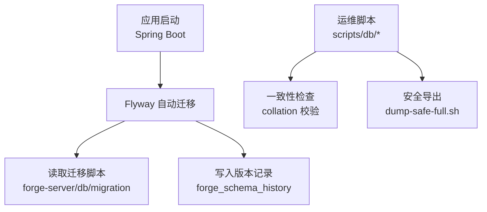
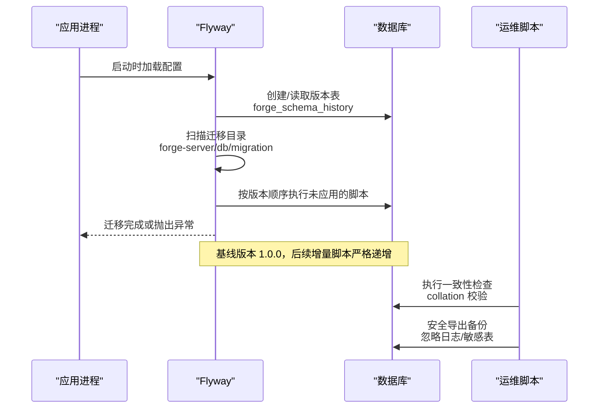
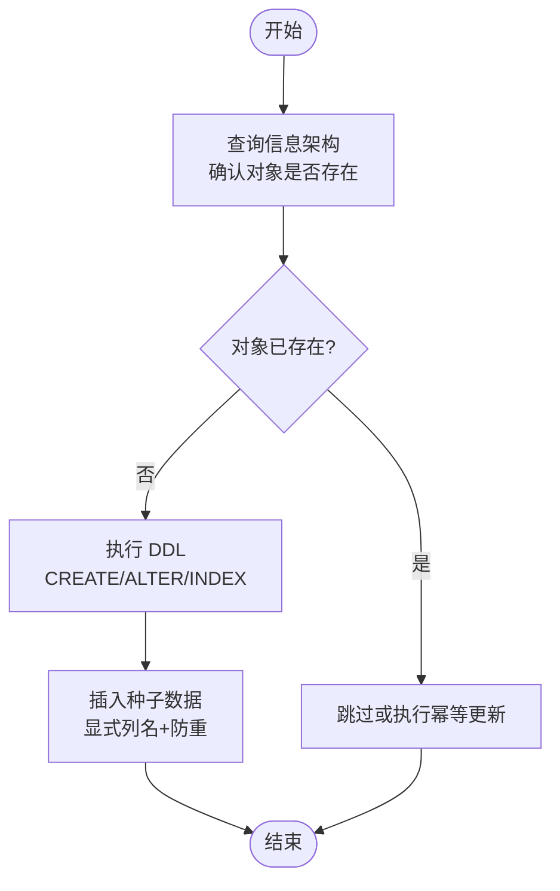
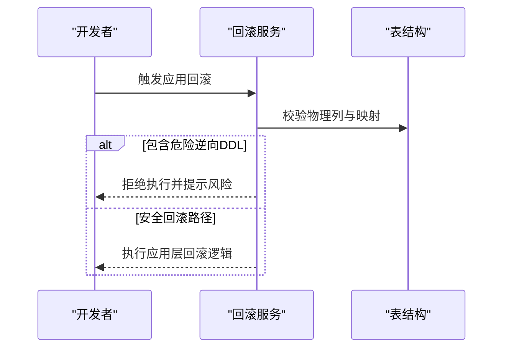
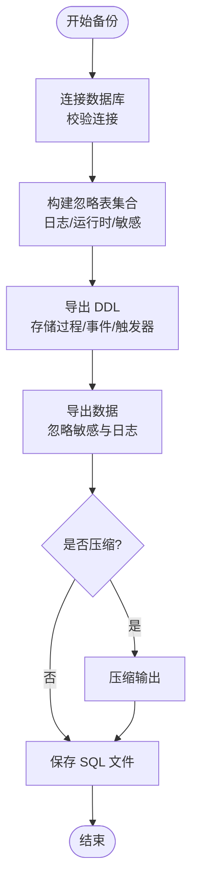
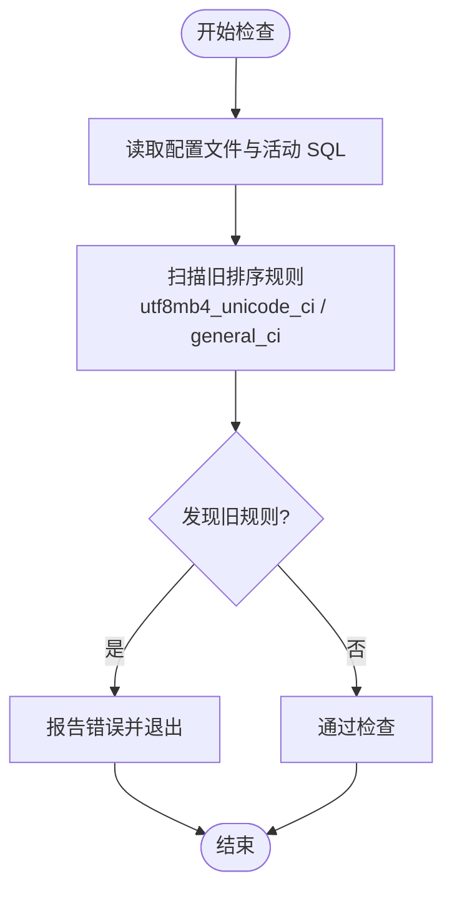
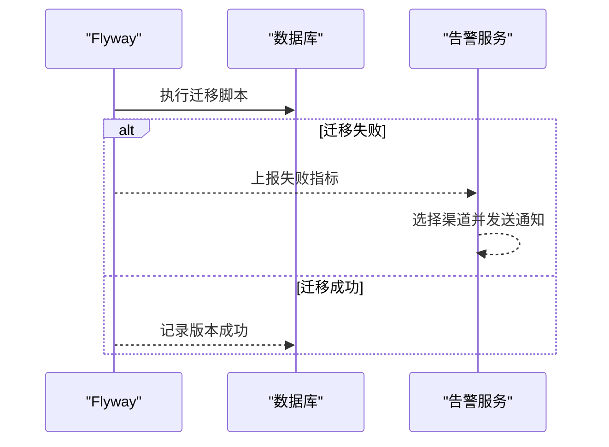
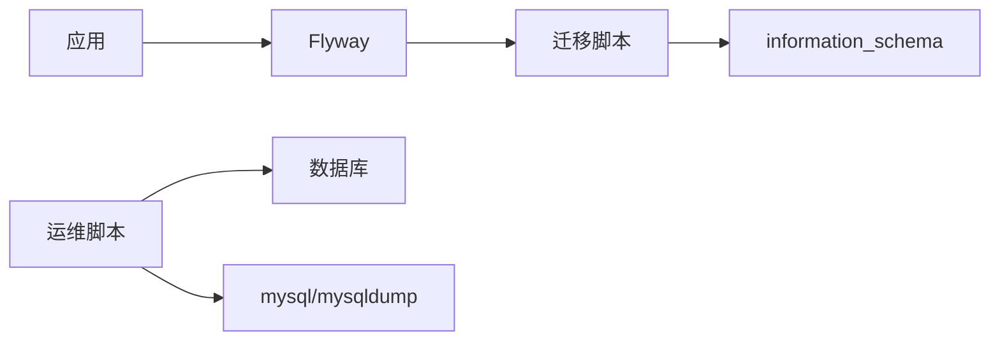

# 数据迁移策略

<cite>
**本文引用的文件**
- [application.yml](file://forge-server/forge-admin-server/src/main/resources/application.yml)
- [V1.0.0__baseline.sql](file://forge-server/db/migration/V1.0.0__baseline.sql)
- [V1.0.105__seed_presale_registration_lowcode_app.sql](file://forge-server/db/migration/V1.0.105__seed_presale_registration_lowcode_app.sql)
- [check-collation-consistency.sh](file://forge-server/scripts/db/check-collation-consistency.sh)
- [dump-safe-full.sh](file://forge-server/scripts/db/dump-safe-full.sh)
- [flyway-ai-coding.md](file://docs/blogs/flyway-ai-coding.md)
- [sql-seeds.md](file://.agents/skills/forge-codegen-crud/references/sql-seeds.md)
- [CodeRuleMigrationContractTest.java](file://forge-server/forge-framework/forge-plugin-parent/forge-plugin-generator/src/test/java/com/mdframe/forge/plugin/generator/manager/coderule/CodeRuleMigrationContractTest.java)
- [BusinessApplicationRollbackContractTest.java](file://forge-server/forge-framework/forge-plugin-parent/forge-plugin-generator/src/test/java/com/mdframe/forge/plugin/generator/service/businessapp/BusinessApplicationRollbackContractTest.java)
- [JobAlarmPermissionMigrationContractTest.java](file://forge-server/forge-framework/forge-plugin-parent/forge-plugin-job/src/test/java/com/mdframe/forge/plugin/job/migration/JobAlarmPermissionMigrationContractTest.java)
- [JobReliabilityMigrationContractTest.java](file://forge-server/forge-framework/forge-plugin-parent/forge-plugin-job/src/test/java/com/mdframe/forge/plugin/job/migration/JobReliabilityMigrationContractTest.java)
- [JobFailureAlarmServiceTest.java](file://forge-server/forge-framework/forge-plugin-parent/forge-plugin-job/src/test/java/com/mdframe/forge/plugin/job/service/JobFailureAlarmServiceTest.java)
</cite>

## 目录
1. [简介](#简介)
2. [项目结构](#项目结构)
3. [核心组件](#核心组件)
4. [架构总览](#架构总览)
5. [详细组件分析](#详细组件分析)
6. [依赖关系分析](#依赖关系分析)
7. [性能考虑](#性能考虑)
8. [故障排查指南](#故障排查指南)
9. [结论](#结论)
10. [附录](#附录)

## 简介
本文件为 Forge Admin 的数据迁移策略文档，围绕 Flyway 版本化管理、增量升级、回滚策略、备份恢复、字符集一致性检查以及生产环境最佳实践与监控告警进行系统化说明。文档基于仓库中已落地的配置、脚本与测试契约，确保策略可执行、可审计、可回归。

## 项目结构
Forge Admin 的数据库迁移相关资产主要分布在以下位置：
- 应用配置：Spring Boot 通过 application.yml 启用并配置 Flyway，指定迁移脚本位置、历史表名、基线版本等。
- 迁移脚本：统一位于 forge-server/db/migration，采用 V<major>.<minor>.<patch>__描述.sql 命名规范，首个脚本为基线。
- 初始化与校验脚本：scripts/db 下提供排序规则一致性检查、安全全量导出等工具。
- 知识库与规范：docs 与 .agents 下的参考文档对 Flyway 使用、SQL 种子数据编写提出明确约束。

图表来源
- [application.yml:65-72](file://forge-server/forge-admin-server/src/main/resources/application.yml#L65-L72)
- [V1.0.0__baseline.sql:1-4](file://forge-server/db/migration/V1.0.0__baseline.sql#L1-L4)
- [check-collation-consistency.sh:65-99](file://forge-server/scripts/db/check-collation-consistency.sh#L65-L99)
- [dump-safe-full.sh:219-455](file://forge-server/scripts/db/dump-safe-full.sh#L219-L455)

章节来源
- [application.yml:65-72](file://forge-server/forge-admin-server/src/main/resources/application.yml#L65-L72)
- [V1.0.0__baseline.sql:1-4](file://forge-server/db/migration/V1.0.0__baseline.sql#L1-L4)

## 核心组件
- Flyway 集成与配置
  - 启用开关、迁移路径、历史表、占位符替换策略均通过环境变量或默认值控制，便于多环境切换。
  - 基线版本设置为 1.0.0，首次运行将把现有历史结构标记为基线，后续变更以增量迁移脚本推进。
- 迁移脚本组织
  - 所有增量变更以版本号递增的 SQL 文件管理，首个脚本为基线，用于锚定历史结构。
  - 新增脚本需遵循“不可变历史”原则，禁止修改已执行过的脚本。
- 数据种子与幂等性
  - 种子数据插入必须显式列名并使用防重逻辑（如 WHERE NOT EXISTS），避免重复执行导致主键冲突。
  - 索引与字段变更需通过 information_schema 查询判断是否存在，保证幂等。
- 字符集与排序规则一致性
  - 提供静态检查脚本，强制要求初始化入口与活动 SQL 使用统一的 utf8mb4 + utf8mb4_0900_ai_ci。
  - 不改动已发布迁移，避免 checksum mismatch。
- 备份与恢复
  - 提供安全全量导出脚本，支持忽略日志/运行时/敏感表，可选压缩输出，生成带元信息的 SQL 文件。
- 监控与告警
  - 任务失败告警服务具备通道选择、收件人配置、指标上报能力；迁移相关的权限与字典由迁移脚本注入。

章节来源
- [application.yml:65-72](file://forge-server/forge-admin-server/src/main/resources/application.yml#L65-L72)
- [sql-seeds.md:1-11](file://.agents/skills/forge-codegen-crud/references/sql-seeds.md#L1-L11)
- [check-collation-consistency.sh:65-99](file://forge-server/scripts/db/check-collation-consistency.sh#L65-L99)
- [dump-safe-full.sh:219-455](file://forge-server/scripts/db/dump-safe-full.sh#L219-L455)
- [JobAlarmPermissionMigrationContractTest.java:12-29](file://forge-server/forge-framework/forge-plugin-parent/forge-plugin-job/src/test/java/com/mdframe/forge/plugin/job/migration/JobAlarmPermissionMigrationContractTest.java#L12-L29)
- [JobFailureAlarmServiceTest.java:50-100](file://forge-server/forge-framework/forge-plugin-parent/forge-plugin-job/src/test/java/com/mdframe/forge/plugin/job/service/JobFailureAlarmServiceTest.java#L50-L100)

## 架构总览
下图展示应用启动时 Flyway 的执行流程、迁移脚本来源、版本记录写入以及运维脚本的辅助作用。

图表来源
- [application.yml:65-72](file://forge-server/forge-admin-server/src/main/resources/application.yml#L65-L72)
- [V1.0.0__baseline.sql:1-4](file://forge-server/db/migration/V1.0.0__baseline.sql#L1-L4)
- [check-collation-consistency.sh:65-99](file://forge-server/scripts/db/check-collation-consistency.sh#L65-L99)
- [dump-safe-full.sh:219-455](file://forge-server/scripts/db/dump-safe-full.sh#L219-L455)

## 详细组件分析

### Flyway 版本管理与执行顺序
- 版本命名规范
  - 文件名格式：V<major>.<minor>.<patch>__lower_snake_case_description.sql。
  - 首个脚本为基线，用于锚定历史结构；后续变更以更高版本号追加。
- 执行顺序
  - Flyway 按版本号升序执行未应用的迁移脚本，并在历史表中记录版本、描述、成功状态。
  - 基线版本设置为 1.0.0，历史结构通过基线脚本声明，新变更不得修改已执行脚本。
- 版本控制策略
  - 禁止修改任何已执行的迁移脚本内容，修正必须新增更高版本。
  - 同一版本号仅允许一个脚本，避免冲突。
  - 建议团队按模块划分版本号空间以降低并行开发冲突概率。

章节来源
- [application.yml:65-72](file://forge-server/forge-admin-server/src/main/resources/application.yml#L65-L72)
- [V1.0.0__baseline.sql:1-4](file://forge-server/db/migration/V1.0.0__baseline.sql#L1-L4)
- [flyway-ai-coding.md:31-79](file://docs/blogs/flyway-ai-coding.md#L31-L79)
- [flyway-ai-coding.md:83-129](file://docs/blogs/flyway-ai-coding.md#L83-L129)

### 增量升级实现机制
- 新增表
  - 使用幂等的建表语句，避免重复执行报错。
  - 在种子数据插入时使用显式列名与防重逻辑。
- 修改字段
  - 添加字段前查询信息架构，确认字段不存在再添加。
  - 修改字段类型或长度时评估影响范围，必要时分阶段迁移。
- 添加索引
  - 添加索引前查询统计信息，避免重复创建。
  - 若需替换旧索引，先检测旧索引是否存在，再原子化替换。

图表来源
- [sql-seeds.md:1-11](file://.agents/skills/forge-codegen-crud/references/sql-seeds.md#L1-L11)
- [CodeRuleMigrationContractTest.java:62-84](file://forge-server/forge-framework/forge-plugin-parent/forge-plugin-generator/src/test/java/com/mdframe/forge/plugin/generator/manager/coderule/CodeRuleMigrationContractTest.java#L62-L84)
- [JobReliabilityMigrationContractTest.java:53-88](file://forge-server/forge-framework/forge-plugin-parent/forge-plugin-job/src/test/java/com/mdframe/forge/plugin/job/migration/JobReliabilityMigrationContractTest.java#L53-L88)

章节来源
- [sql-seeds.md:1-11](file://.agents/skills/forge-codegen-crud/references/sql-seeds.md#L1-L11)
- [CodeRuleMigrationContractTest.java:62-84](file://forge-server/forge-framework/forge-plugin-parent/forge-plugin-generator/src/test/java/com/mdframe/forge/plugin/generator/manager/coderule/CodeRuleMigrationContractTest.java#L62-L84)
- [JobReliabilityMigrationContractTest.java:53-88](file://forge-server/forge-framework/forge-plugin-parent/forge-plugin-job/src/test/java/com/mdframe/forge/plugin/job/migration/JobReliabilityMigrationContractTest.java#L53-L88)

### 回滚机制设计方案
- 设计原则
  - 不直接执行逆向 DDL（如 DROP COLUMN）作为通用回滚手段，避免破坏历史结构。
  - 业务应用回滚通过应用层能力实现，迁移脚本保持只读与不可变。
- 回滚边界
  - 回滚服务会校验物理列与映射关系，拒绝执行可能破坏结构的逆向操作。
  - 对于复杂数据变更，优先采用“新增字段+数据迁移+废弃旧字段”的分阶段方案，而非直接删除。
- 验证方式
  - 通过测试契约断言回滚服务不包含危险操作，确保回滚边界受控。

图表来源
- [BusinessApplicationRollbackContractTest.java:16-29](file://forge-server/forge-framework/forge-plugin-parent/forge-plugin-generator/src/test/java/com/mdframe/forge/plugin/generator/service/businessapp/BusinessApplicationRollbackContractTest.java#L16-L29)

章节来源
- [BusinessApplicationRollbackContractTest.java:16-29](file://forge-server/forge-framework/forge-plugin-parent/forge-plugin-generator/src/test/java/com/mdframe/forge/plugin/generator/service/businessapp/BusinessApplicationRollbackContractTest.java#L16-L29)

### 数据备份恢复实施方案
- 定期备份策略
  - 使用安全全量导出脚本，默认忽略日志、运行时与敏感配置表，减少备份体积与泄露风险。
  - 支持压缩输出与 dry-run 模式，便于 CI/CD 集成与演练。
- 灾难恢复流程
  - 恢复前准备目标库连接参数与凭据，执行导入后校验外键与唯一约束。
  - 恢复过程中关闭外键检查，导入完成后恢复设置，确保数据完整性。
- 数据一致性保证
  - 导出脚本通过事务与锁表策略保证一致性快照。
  - 输出文件包含元信息（数据库名、时间、忽略表清单），便于审计与回溯。

图表来源
- [dump-safe-full.sh:219-455](file://forge-server/scripts/db/dump-safe-full.sh#L219-L455)

章节来源
- [dump-safe-full.sh:219-455](file://forge-server/scripts/db/dump-safe-full.sh#L219-L455)

### 字符集一致性检查实现
- 目标
  - 统一使用 utf8mb4 与 utf8mb4_0900_ai_ci，避免临时表与业务表比较时的排序规则不一致。
- 检查范围
  - 初始化脚本、Docker Compose 服务端配置、活动独立 SQL、公开文档中的建库示例。
- 兼容边界
  - 不修改已发布的 Flyway 迁移文件，避免 checksum mismatch。
  - 不批量转换已有业务库的表或列，历史库需先备份并由 DBA 制定转换方案。
- 自动化门禁
  - 提供一致性检查脚本，扫描旧排序规则声明并阻断提交。

图表来源
- [check-collation-consistency.sh:65-99](file://forge-server/scripts/db/check-collation-consistency.sh#L65-L99)

章节来源
- [check-collation-consistency.sh:65-99](file://forge-server/scripts/db/check-collation-consistency.sh#L65-L99)

### 生产环境迁移最佳实践
- 灰度发布
  - 先在预发环境执行迁移并验证，再逐步推广到生产。
  - 对大表变更采用分阶段迁移，降低锁表与性能影响。
- 迁移验证
  - 迁移完成后执行一致性检查与关键查询验证，确保结构与数据符合预期。
  - 结合监控指标观察慢查询与锁等待情况。
- 性能影响评估
  - 对索引重建、字段类型变更、大数据量 INSERT/UPDATE 进行预估与压测。
  - 使用事务与分批处理，避免长事务阻塞。

章节来源
- [flyway-ai-coding.md:31-79](file://docs/blogs/flyway-ai-coding.md#L31-L79)
- [flyway-ai-coding.md:83-129](file://docs/blogs/flyway-ai-coding.md#L83-L129)

### 迁移过程中的错误处理与监控告警
- 错误处理
  - Flyway 启动失败会抛出校验异常，需根据失败记录定位问题并修复脚本后重试。
  - 对于失败记录，可在清理后重新执行迁移。
- 监控告警
  - 任务失败告警服务支持多渠道通知（WEB、EMAIL），并记录失败指标。
  - 迁移相关的权限与字典由迁移脚本注入，确保告警功能可用。

图表来源
- [JobAlarmPermissionMigrationContractTest.java:12-29](file://forge-server/forge-framework/forge-plugin-parent/forge-plugin-job/src/test/java/com/mdframe/forge/plugin/job/migration/JobAlarmPermissionMigrationContractTest.java#L12-L29)
- [JobFailureAlarmServiceTest.java:50-100](file://forge-server/forge-framework/forge-plugin-parent/forge-plugin-job/src/test/java/com/mdframe/forge/plugin/job/service/JobFailureAlarmServiceTest.java#L50-L100)

章节来源
- [flyway-ai-coding.md:187-203](file://docs/blogs/flyway-ai-coding.md#L187-L203)
- [JobAlarmPermissionMigrationContractTest.java:12-29](file://forge-server/forge-framework/forge-plugin-parent/forge-plugin-job/src/test/java/com/mdframe/forge/plugin/job/migration/JobAlarmPermissionMigrationContractTest.java#L12-L29)
- [JobFailureAlarmServiceTest.java:50-100](file://forge-server/forge-framework/forge-plugin-parent/forge-plugin-job/src/test/java/com/mdframe/forge/plugin/job/service/JobFailureAlarmServiceTest.java#L50-L100)

## 依赖关系分析
- 应用与 Flyway
  - 应用通过 Spring Boot 自动装配 Flyway，读取 application.yml 配置并执行迁移。
- 迁移脚本与信息架构
  - 迁移脚本依赖 information_schema 进行对象存在性检查，保证幂等与兼容性。
- 运维脚本与数据库
  - 一致性检查与备份脚本直接操作数据库客户端与导出工具，提供可重复执行的运维能力。

图表来源
- [application.yml:65-72](file://forge-server/forge-admin-server/src/main/resources/application.yml#L65-L72)
- [CodeRuleMigrationContractTest.java:62-84](file://forge-server/forge-framework/forge-plugin-parent/forge-plugin-generator/src/test/java/com/mdframe/forge/plugin/generator/manager/coderule/CodeRuleMigrationContractTest.java#L62-L84)
- [dump-safe-full.sh:219-455](file://forge-server/scripts/db/dump-safe-full.sh#L219-L455)

章节来源
- [application.yml:65-72](file://forge-server/forge-admin-server/src/main/resources/application.yml#L65-L72)
- [CodeRuleMigrationContractTest.java:62-84](file://forge-server/forge-framework/forge-plugin-parent/forge-plugin-generator/src/test/java/com/mdframe/forge/plugin/generator/manager/coderule/CodeRuleMigrationContractTest.java#L62-L84)
- [dump-safe-full.sh:219-455](file://forge-server/scripts/db/dump-safe-full.sh#L219-L455)

## 性能考虑
- 迁移脚本应尽量避免全表扫描与大事务，采用分批处理与索引优化。
- 对大表字段变更与索引重建，建议在低峰期执行并监控锁等待。
- 种子数据插入使用防重与显式列名，减少冲突与解析开销。
- 备份导出使用单事务与快速选项，减少锁表时间与 IO 压力。

## 故障排查指南
- Flyway 校验失败
  - 检查失败记录并清理后重新执行迁移。
  - 确认迁移脚本内容与历史一致，避免 checksum mismatch。
- 字符集不一致
  - 使用一致性检查脚本扫描旧排序规则声明并修复。
  - 确保初始化脚本与服务端配置统一为目标字符集与排序规则。
- 备份导出失败
  - 检查数据库连接、凭据与客户端工具可用性。
  - 使用 dry-run 模式预览命令与忽略表清单。

章节来源
- [flyway-ai-coding.md:187-203](file://docs/blogs/flyway-ai-coding.md#L187-L203)
- [check-collation-consistency.sh:65-99](file://forge-server/scripts/db/check-collation-consistency.sh#L65-L99)
- [dump-safe-full.sh:219-455](file://forge-server/scripts/db/dump-safe-full.sh#L219-L455)

## 结论
Forge Admin 的数据迁移策略以 Flyway 为核心，结合严格的版本管理、幂等脚本编写、字符集一致性检查与安全备份恢复，形成可审计、可回归、可扩展的工程体系。配合监控告警与生产最佳实践，能够在保障数据安全与一致性的前提下，支撑高频迭代与稳定发布。

## 附录
- 迁移脚本示例路径
  - 基线脚本：[V1.0.0__baseline.sql](file://forge-server/db/migration/V1.0.0__baseline.sql)
  - 种子数据示例：[V1.0.105__seed_presale_registration_lowcode_app.sql](file://forge-server/db/migration/V1.0.105__seed_presale_registration_lowcode_app.sql)
- 规范与参考
  - AI Coding 时代的 Flyway 实践：[flyway-ai-coding.md](file://docs/blogs/flyway-ai-coding.md)
  - SQL 种子数据规范：[sql-seeds.md](file://.agents/skills/forge-codegen-crud/references/sql-seeds.md)
- 运维脚本
  - 一致性检查：[check-collation-consistency.sh](file://forge-server/scripts/db/check-collation-consistency.sh)
  - 安全导出：[dump-safe-full.sh](file://forge-server/scripts/db/dump-safe-full.sh)